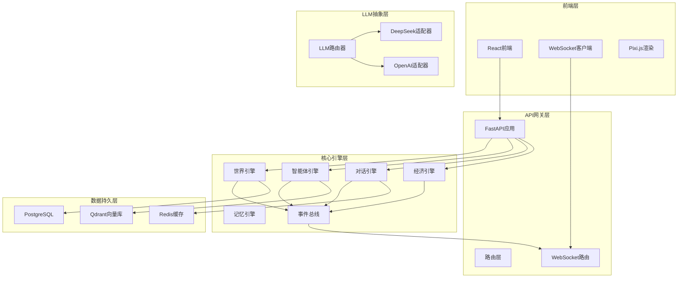
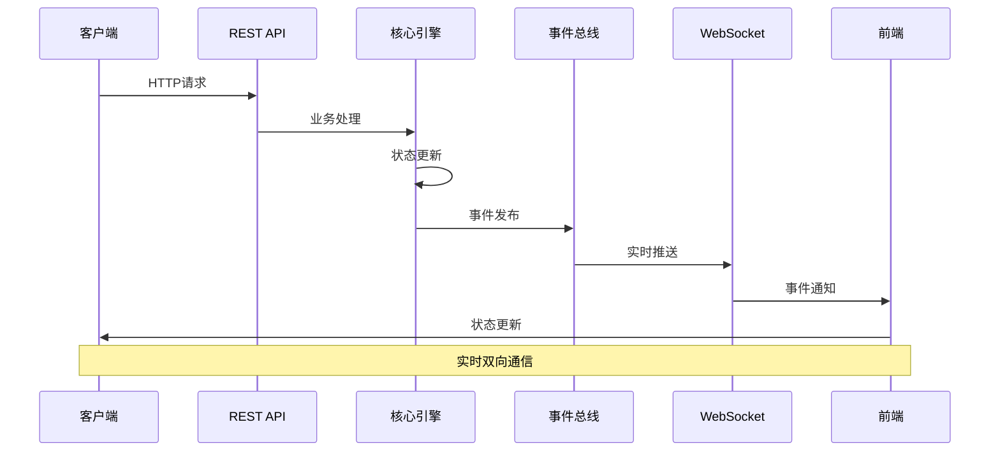
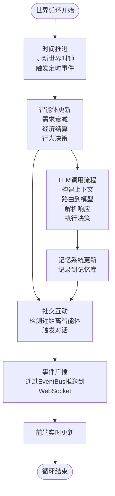
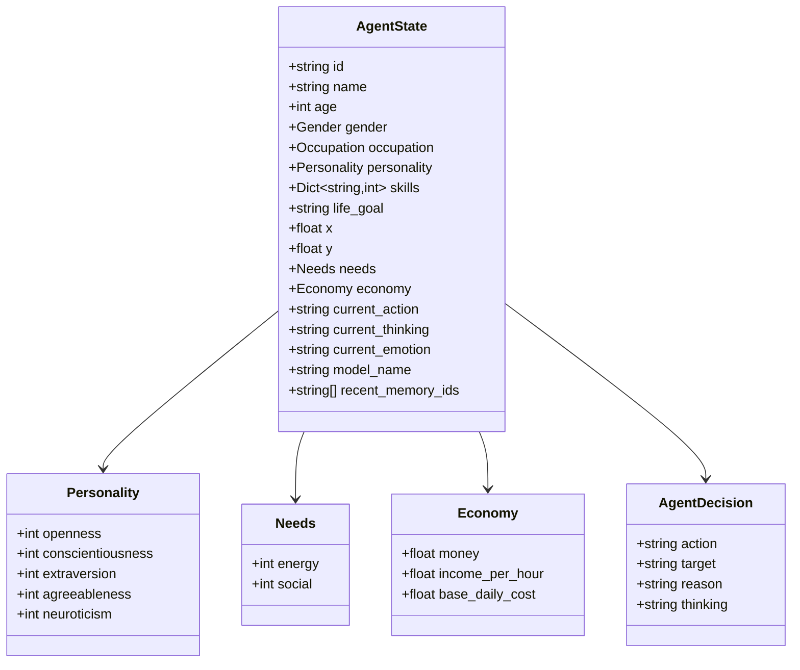
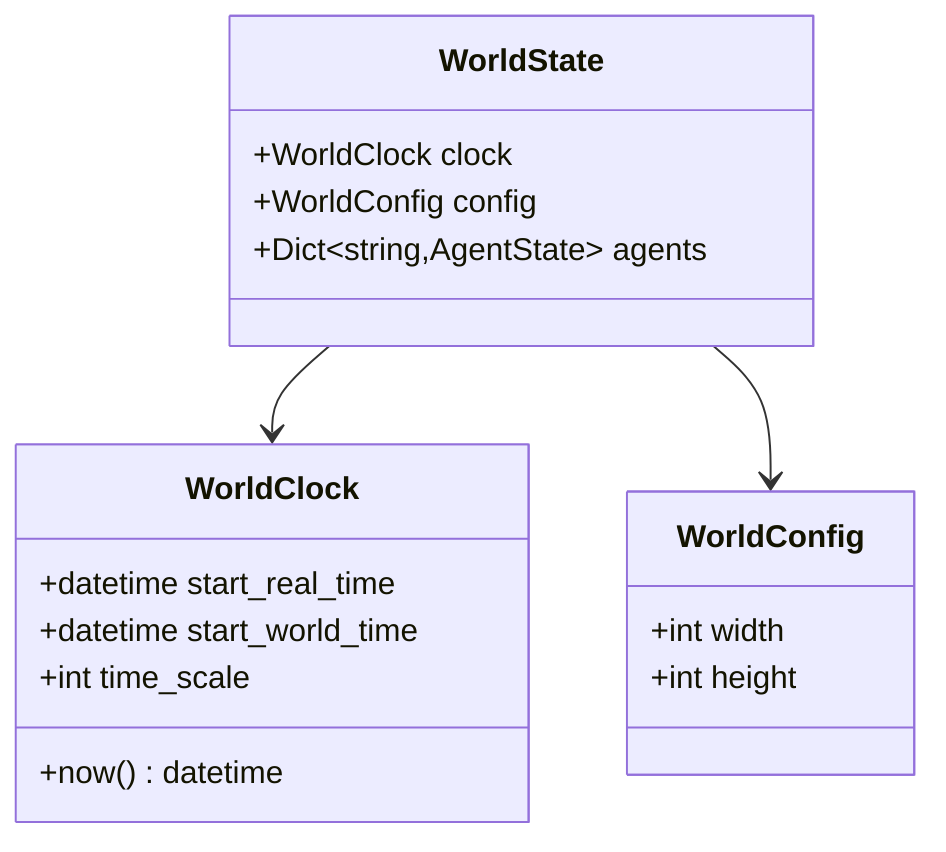
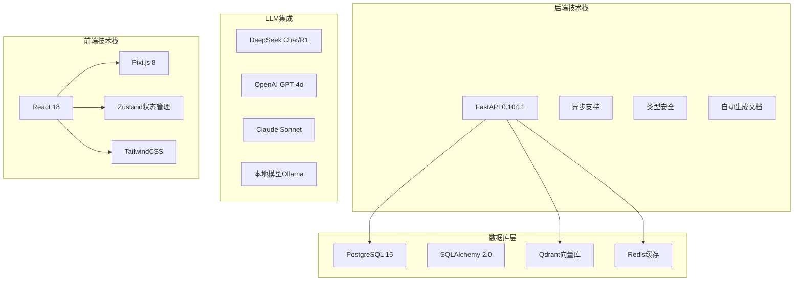

# API接口文档

<cite>
**本文档引用的文件**
- [API与通信协议规格说明](file://specs/06-api-design.spec.md)
- [系统架构规格说明](file://specs/01-architecture.spec.md)
- [项目概述](file://specs/00-project-overview.spec.md)
- [经济系统规格说明](file://specs/03-economy-system.spec.md)
- [智能体核心数据结构](file://backend/app/core/agent.py)
- [世界引擎数据结构](file://backend/app/core/world.py)
- [配置管理](file://backend/app/core/config.py)
</cite>

## 目录
1. [简介](#简介)
2. [项目结构](#项目结构)
3. [核心组件](#核心组件)
4. [架构概览](#架构概览)
5. [详细组件分析](#详细组件分析)
6. [依赖关系分析](#依赖关系分析)
7. [性能考虑](#性能考虑)
8. [故障排除指南](#故障排除指南)
9. [结论](#结论)
10. [附录](#附录)

## 简介
AI Society是一个开源的AI自治世界观察实验平台，旨在创建一个包含50+个智能体的虚拟社会，让智能体在其中自由生活、交流和发展。该项目采用前后端分离架构，后端基于FastAPI构建REST API和WebSocket实时通信，前端使用React + Pixi.js进行可视化展示。

本项目的核心理念包括：
- **纯观察**：像看蚂蚁窝一样观察AI社会的自发演化
- **自治优先**：智能体按自己的想法生活，系统不强制剧本
- **真实对齐**：能力、金钱、开销逻辑与现实世界对齐
- **开源开放**：代码开源，数据开放，让社区一起研究

## 项目结构
基于架构规格说明，AI Society采用分层架构设计：



**图表来源**
- [系统架构规格说明](file://specs/01-architecture.spec.md#L5-L57)
- [系统架构规格说明](file://specs/01-architecture.spec.md#L92-L169)

**章节来源**
- [系统架构规格说明](file://specs/01-architecture.spec.md#L1-L248)
- [项目概述](file://specs/00-project-overview.spec.md#L1-L46)

## 核心组件
AI Society的核心组件包括：

### 1. REST API层
- **基础信息**：Base URL: /api, Version: v1, Content-Type: application/json
- **设计原则**：RESTful API用于查询和控制操作，统一的响应格式，中文友好的错误信息

### 2. WebSocket实时通信层
- **连接地址**：ws://host/api/stream
- **订阅机制**：支持按频道或按智能体订阅
- **事件推送**：实时推送智能体移动、状态变化、对话事件等

### 3. 核心数据模型
- **智能体状态**：包含个人信息、性格特征、技能水平、经济状况等
- **世界状态**：时间管理、配置参数、智能体集合
- **经济系统**：收入计算、支出管理、经济状态分级

**章节来源**
- [API与通信协议规格说明](file://specs/06-api-design.spec.md#L10-L16)
- [智能体核心数据结构](file://backend/app/core/agent.py#L25-L92)
- [世界引擎数据结构](file://backend/app/core/world.py#L8-L40)

## 架构概览
AI Society采用事件驱动的微服务架构，核心数据流如下：



**图表来源**
- [系统架构规格说明](file://specs/01-architecture.spec.md#L171-L196)

### 世界循环机制
系统每10分钟执行一次完整的世界循环：



**图表来源**
- [系统架构规格说明](file://specs/01-architecture.spec.md#L173-L220)

**章节来源**
- [系统架构规格说明](file://specs/01-architecture.spec.md#L171-L220)

## 详细组件分析

### REST API接口规范

#### 世界状态查询
**获取世界状态**
- 方法：GET
- 路径：/api/world/status
- 功能：返回当前世界时间、运行状态、智能体数量等信息

**控制世界运行**
- 方法：POST  
- 路径：/api/world/control
- 请求体：包含action字段（pause/resume/speed_up/slow_down/reset）
- 功能：控制世界暂停、恢复、调整时间倍率等

**获取位置列表**
- 方法：GET
- 路径：/api/world/locations
- 查询参数：无
- 功能：返回所有位置的详细信息

**获取位置详情**
- 方法：GET
- 路径：/api/world/locations/{location_id}
- 路径参数：location_id（位置ID）
- 功能：返回指定位置的当前占用者、最近事件、热度历史等

**章节来源**
- [API与通信协议规格说明](file://specs/06-api-design.spec.md#L22-L108)

#### 智能体管理
**获取所有智能体**
- 方法：GET
- 路径：/api/agents
- 查询参数：
  - page：页码（默认1）
  - limit：每页数量（默认20）
  - occupation：职业筛选
  - sort：排序字段
- 功能：分页获取智能体列表

**获取智能体详情**
- 方法：GET
- 路径：/api/agents/{agent_id}
- 路径参数：agent_id（智能体ID）
- 功能：返回智能体完整档案，包括个人资料、当前状态、关系网络、近期记忆

**获取智能体轨迹**
- 方法：GET
- 路径：/api/agents/{agent_id}/trajectory
- 路径参数：agent_id（智能体ID）
- 查询参数：hours（查询小时数，默认24）
- 功能：返回智能体的历史位置轨迹

**章节来源**
- [API与通信协议规格说明](file://specs/06-api-design.spec.md#L112-L232)

#### 对话系统
**获取实时对话列表**
- 方法：GET
- 路径：/api/conversations/active
- 功能：返回当前正在进行的对话列表

**获取对话详情**
- 方法：GET
- 路径：/api/conversations/{conversation_id}
- 路径参数：conversation_id（对话ID）
- 功能：返回对话的完整历史、参与者、话题、关系变化等

**获取历史对话**
- 方法：GET
- 路径：/api/conversations/history
- 查询参数：
  - agent_id：智能体ID
  - start_date：开始日期
  - end_date：结束日期
  - page：页码
  - limit：每页数量
- 功能：分页获取历史对话记录

**章节来源**
- [API与通信协议规格说明](file://specs/06-api-design.spec.md#L234-L307)

#### 统计分析
**获取社会统计**
- 方法：GET
- 路径：/api/stats/society
- 功能：返回人口统计、经济指标、社交网络等综合统计数据

**获取热门地点**
- 方法：GET
- 路径：/api/stats/hot-locations
- 功能：返回按热度排序的地点列表

**章节来源**
- [API与通信协议规格说明](file://specs/06-api-design.spec.md#L309-L380)

#### 数据导出
**导出对话数据**
- 方法：GET
- 路径：/api/export/conversations
- 查询参数：
  - format：输出格式（csv/json）
  - start_date：开始日期
  - end_date：结束日期
- 功能：导出指定时间段的对话数据

**导出智能体数据**
- 方法：GET
- 路径：/api/export/agents
- 查询参数：format（输出格式，默认json）
- 功能：导出所有智能体的结构化数据

**导出社交网络**
- 方法：GET
- 路径：/api/export/social-network
- 查询参数：format（输出格式，默认graphml）
- 功能：导出社交关系网络图数据

**章节来源**
- [API与通信协议规格说明](file://specs/06-api-design.spec.md#L382-L410)

### WebSocket实时通信

#### 连接建立
```javascript
const ws = new WebSocket('ws://host/api/stream');

// 连接成功后发送订阅消息
ws.onopen = () => {
  ws.send(JSON.stringify({
    type: 'subscribe',
    channels: ['all']  // 或 ['agents', 'conversations', 'world']
  }));
};
```

#### 订阅管理
- **通用订阅**：`channels: ['all']` 订阅所有事件
- **按频道订阅**：`channels: ['conversations']` 只接收对话相关事件
- **按智能体订阅**：`type: 'subscribe_agent'` 订阅特定智能体事件
- **取消订阅**：`type: 'unsubscribe'` 取消指定频道订阅

#### 事件类型定义

**智能体移动事件**
```json
{
  "type": "agent_move",
  "timestamp": "2024-01-15T14:30:00Z",
  "data": {
    "agent_id": "agent_1",
    "agent_name": "李明",
    "from": {"x": 1200, "y": 200},
    "to": {"x": 1250, "y": 220},
    "location": "时光咖啡馆"
  }
}
```

**智能体状态变化事件**
```json
{
  "type": "agent_state_change",
  "timestamp": "2024-01-15T14:30:00Z",
  "data": {
    "agent_id": "agent_1",
    "changes": {
      "current_action": {"old": "walking", "new": "idle"},
      "current_thinking": "到了咖啡馆，看看有没有朋友",
      "energy": {"old": 78, "new": 75}
    }
  }
}
```

**对话相关事件**
- `conversation_start`：对话开始事件
- `conversation_message`：新消息事件  
- `conversation_end`：对话结束事件

**关系变化事件**
```json
{
  "type": "relationship_change",
  "timestamp": "2024-01-15T14:35:00Z",
  "data": {
    "agent_a": {"id": "agent_1", "name": "李明"},
    "agent_b": {"id": "agent_2", "name": "王芳"},
    "old_strength": 65,
    "new_strength": 68,
    "old_type": "friend",
    "new_type": "friend",
    "reason": "进行了一次愉快的对话"
  }
}
```

**系统事件**
- `agent_created`：新智能体创建事件
- `agent_departed`：智能体离开事件
- `world_event`：世界事件（如日落）
- `economic_event`：经济事件（如每日结算）

**章节来源**
- [API与通信协议规格说明](file://specs/06-api-design.spec.md#L411-L617)

### 数据模型定义

#### 智能体核心数据结构


**图表来源**
- [智能体核心数据结构](file://backend/app/core/agent.py#L25-L92)

#### 世界引擎数据结构


**图表来源**
- [世界引擎数据结构](file://backend/app/core/world.py#L8-L40)

**章节来源**
- [智能体核心数据结构](file://backend/app/core/agent.py#L1-L92)
- [世界引擎数据结构](file://backend/app/core/world.py#L1-L40)

## 依赖关系分析

### 技术栈依赖
AI Society采用现代化的技术栈组合：



**图表来源**
- [系统架构规格说明](file://specs/01-architecture.spec.md#L61-L91)

### 性能指标要求
系统设定明确的性能目标：
- **智能体数量**：50-200个
- **前端帧率**：60fps
- **API响应时间**：<100ms
- **WebSocket延迟**：<50ms
- **LLM调用频率**：每智能体每10分钟最多1次
- **内存占用**：<2GB

**章节来源**
- [系统架构规格说明](file://specs/01-architecture.spec.md#L238-L248)

## 性能考虑
基于架构设计，AI Society在性能方面有以下考虑：

### 1. 异步架构优势
- **FastAPI异步原生**：充分利用异步I/O提升并发处理能力
- **事件驱动架构**：减少轮询开销，提高实时性
- **缓存策略**：Redis缓存热点数据，减少数据库压力

### 2. 数据库优化
- **PostgreSQL**：支持JSON字段存储复杂数据结构
- **Qdrant向量库**：优化相似度检索性能
- **索引设计**：针对常用查询字段建立索引

### 3. 前端渲染优化
- **Pixi.js WebGL加速**：高性能2D渲染，支持大量精灵
- **Zustand轻量状态管理**：避免不必要的重渲染
- **虚拟滚动**：大数据集的高效展示

### 4. LLM调用优化
- **调用频率限制**：每智能体每10分钟最多1次
- **模型路由**：根据场景选择合适的模型
- **上下文压缩**：合理控制提示词长度

## 故障排除指南

### 错误响应格式
所有API错误都遵循统一的响应格式：
```json
{
  "success": false,
  "error": {
    "code": "AGENT_NOT_FOUND",
    "message": "找不到指定的智能体",
    "details": {
      "agent_id": "agent_999"
    }
  }
}
```

### 错误码对照表
| 错误码 | HTTP状态 | 说明 |
|--------|----------|------|
| AGENT_NOT_FOUND | 404 | 智能体不存在 |
| LOCATION_NOT_FOUND | 404 | 位置不存在 |
| CONVERSATION_NOT_FOUND | 404 | 对话不存在 |
| INVALID_PARAMETER | 400 | 参数错误 |
| WORLD_PAUSED | 409 | 世界已暂停，无法执行操作 |
| RATE_LIMITED | 429 | 请求过于频繁 |
| INTERNAL_ERROR | 500 | 服务器内部错误 |

### 速率限制策略
- **REST API**：100次/分钟
- **WebSocket**：无限制（服务器推送）
- **导出API**：10次/小时

### 常见问题诊断
1. **WebSocket连接失败**：检查网络连接和防火墙设置
2. **API响应超时**：检查数据库连接和Redis服务状态
3. **实时事件丢失**：确认订阅频道配置正确
4. **LLM调用失败**：检查API密钥配置和网络连通性

**章节来源**
- [API与通信协议规格说明](file://specs/06-api-design.spec.md#L619-L655)

## 结论
AI Society项目通过精心设计的架构实现了高性能的AI自治世界模拟。其REST API提供了完整的查询和控制能力，WebSocket实时通信确保了流畅的用户体验，而丰富的经济和社会系统则为深入研究AI群体行为提供了理想的实验环境。

项目的主要优势包括：
- **模块化设计**：清晰的分层架构便于维护和扩展
- **性能优化**：异步架构和缓存策略确保高并发处理能力
- **实时性保障**：事件驱动架构提供毫秒级响应
- **可扩展性**：插件化的LLM集成支持多种模型
- **开源生态**：完整的文档和示例便于社区贡献

## 附录

### API版本控制
- **版本号**：v1
- **版本策略**：向后兼容的增量更新
- **弃用政策**：提供至少3个月的过渡期

### 安全考虑
- **认证机制**：预留认证接口，支持JWT令牌
- **授权控制**：基于角色的访问控制
- **数据保护**：敏感信息加密存储
- **API防护**：防止常见攻击（XSS、CSRF、注入）

### 客户端实现指南
1. **REST客户端**：使用标准HTTP客户端库
2. **WebSocket客户端**：使用浏览器原生WebSocket API
3. **错误处理**：实现重试机制和降级策略
4. **状态同步**：保持本地状态与服务器状态一致

### 实际调用示例
由于项目结构限制，具体的代码示例请参考API设计规格说明中的示例格式。

**章节来源**
- [API与通信协议规格说明](file://specs/06-api-design.spec.md#L1-L655)