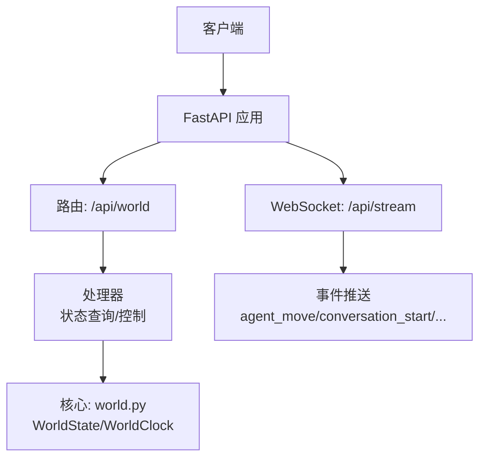
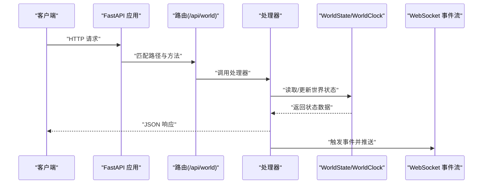
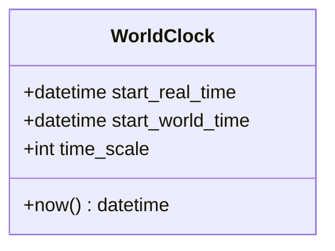
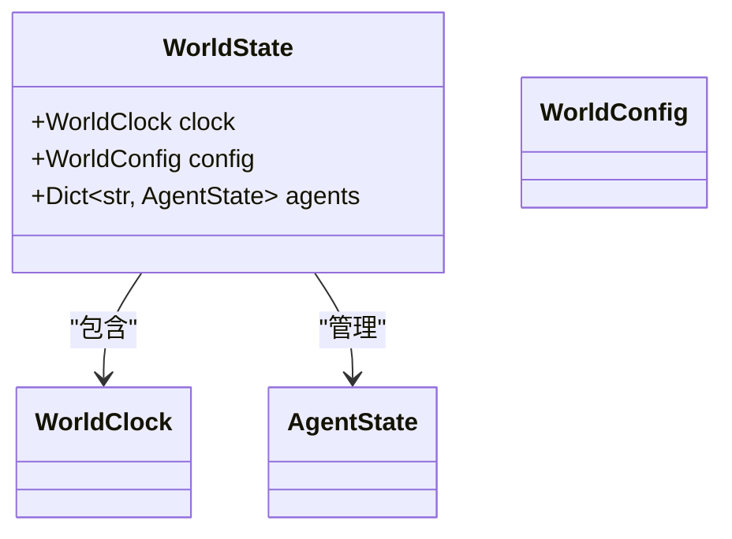
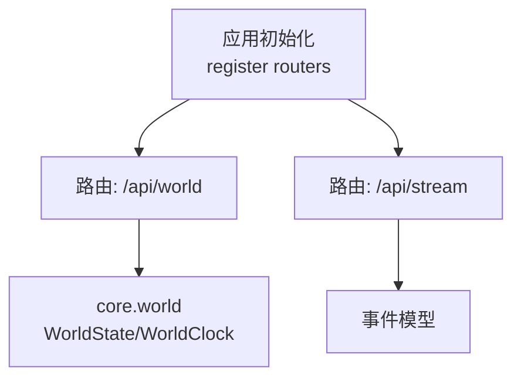

# 世界状态API

<cite>
**本文档引用的文件**
- [backend/app/core/world.py](file://backend/app/core/world.py)
- [backend/app/core/config.py](file://backend/app/core/config.py)
- [backend/app/__init__.py](file://backend/app/__init__.py)
- [specs/06-api-design.spec.md](file://specs/06-api-design.spec.md)
</cite>

## 目录
1. [简介](#简介)
2. [项目结构](#项目结构)
3. [核心组件](#核心组件)
4. [架构总览](#架构总览)
5. [详细组件分析](#详细组件分析)
6. [依赖关系分析](#依赖关系分析)
7. [性能考虑](#性能考虑)
8. [故障排除指南](#故障排除指南)
9. [结论](#结论)
10. [附录](#附录)

## 简介
本文件面向“世界状态API”的使用与实现，聚焦于世界时钟管理、事件触发机制与状态同步的数据结构。根据仓库现有规范与核心实现，世界状态API通过统一的REST接口对外提供世界状态查询、运行控制与事件推送能力，并以WebSocket进行实时事件广播。

## 项目结构
- 后端应用通过FastAPI创建，路由在应用初始化时注册到前缀/api/world下。
- 世界状态相关的核心数据结构位于core模块，包括世界时钟、世界配置与世界状态。
- API设计规范定义了REST端点、响应格式、错误码与速率限制。

图表来源
- [backend/app/__init__.py](file://backend/app/__init__.py#L16-L21)
- [specs/06-api-design.spec.md](file://specs/06-api-design.spec.md#L10-L16)

章节来源
- [backend/app/__init__.py](file://backend/app/__init__.py#L1-L22)
- [specs/06-api-design.spec.md](file://specs/06-api-design.spec.md#L1-L20)

## 核心组件
- 世界时钟（WorldClock）
  - 管理现实时间与世界时间的映射，提供当前世界时间计算。
  - 时间缩放比例可配置，默认为10（现实1分钟 = 世界10分钟）。
- 世界配置（WorldConfig）
  - 定义世界地图尺寸等静态配置项。
- 世界状态（WorldState）
  - 包含时钟、配置以及智能体集合等运行时状态。
  - 使用内存字典存储智能体状态，便于快速访问与扩展。

章节来源
- [backend/app/core/world.py](file://backend/app/core/world.py#L8-L40)
- [backend/app/core/config.py](file://backend/app/core/config.py#L12-L13)

## 架构总览
世界状态API的调用链路如下：
- 客户端通过HTTP请求访问/api/world下的端点。
- FastAPI路由将请求分发至对应处理器。
- 处理器读取或更新WorldState，必要时触发事件并通过WebSocket广播。

图表来源
- [backend/app/__init__.py](file://backend/app/__init__.py#L16-L21)
- [specs/06-api-design.spec.md](file://specs/06-api-design.spec.md#L10-L16)

## 详细组件分析

### 世界时钟（WorldClock）
- 功能要点
  - 记录起始现实时间与起始世界时间。
  - 提供当前世界时间计算，基于现实时间差乘以时间缩放比例。
- 性能与复杂度
  - 计算为O(1)，无额外存储开销。
- 优化建议
  - 若需支持多世界实例，可将起始时间与缩放比例作为可变配置。
  - 在高并发场景中，确保时钟计算的线程安全（当前实现为纯函数式计算，天然线程安全）。

图表来源
- [backend/app/core/world.py](file://backend/app/core/world.py#L8-L21)

章节来源
- [backend/app/core/world.py](file://backend/app/core/world.py#L8-L21)

### 世界状态（WorldState）
- 结构组成
  - clock: WorldClock 实例
  - config: WorldConfig 实例
  - agents: 字典，键为智能体ID，值为AgentState
- 数据流
  - 处理器从WorldState读取当前世界时间、智能体数量等指标。
  - 更新操作（如重置、推进）会修改WorldState并触发事件。
- 扩展性
  - 当前使用内存存储，后续可替换为数据库或缓存层。

图表来源
- [backend/app/core/world.py](file://backend/app/core/world.py#L23-L40)

章节来源
- [backend/app/core/world.py](file://backend/app/core/world.py#L23-L40)

### 世界配置（WorldConfig）
- 作用
  - 定义世界地图的宽度与高度等静态配置。
- 与时间缩放的关系
  - 时间缩放由配置模块提供默认值，可在运行时调整。

章节来源
- [backend/app/core/world.py](file://backend/app/core/world.py#L23-L27)
- [backend/app/core/config.py](file://backend/app/core/config.py#L12-L13)

### API端点与行为（基于规范）
- GET /api/world/status
  - 功能：获取世界状态摘要（世界时间、现实时间、昼夜、天数、智能体数量、活动对话数、状态等）。
  - 响应：统一格式，包含success与data字段。
  - 状态码：200 成功；错误时参考统一错误格式与错误码表。
- POST /api/world/control
  - 功能：控制世界运行（暂停、恢复、加速、减速、重置）。
  - 请求体：包含action字段（枚举值）。
  - 响应：统一格式，包含success与message。
  - 状态码：200 成功；409 世界已暂停时禁止某些操作；错误时参考统一错误格式与错误码表。
- WebSocket /api/stream
  - 功能：实时推送世界事件（智能体移动、状态变化、对话开始/消息/结束、关系变化、世界事件、经济事件等）。
  - 订阅：支持按频道或特定智能体订阅。

章节来源
- [specs/06-api-design.spec.md](file://specs/06-api-design.spec.md#L20-L59)
- [specs/06-api-design.spec.md](file://specs/06-api-design.spec.md#L411-L596)

### 实际调用示例（基于规范）
- 查询世界状态
  - 请求：GET /api/world/status
  - 响应：包含世界时间、现实时间、时间缩放、时段、是否白天、天数、智能体数量、活动对话数、状态等字段。
- 控制世界运行
  - 请求：POST /api/world/control，请求体包含action字段（例如"pause"、"resume"、"reset"等）。
  - 响应：包含success与message。
- WebSocket 订阅
  - 连接：ws://host/api/stream
  - 订阅：发送订阅消息，channels可选'all'、'agents'、'conversations'、'world'等。

章节来源
- [specs/06-api-design.spec.md](file://specs/06-api-design.spec.md#L22-L59)
- [specs/06-api-design.spec.md](file://specs/06-api-design.spec.md#L411-L425)
- [specs/06-api-design.spec.md](file://specs/06-api-design.spec.md#L597-L617)

### 错误处理与状态码
- 统一错误响应格式：success为false，error包含code、message与details。
- 常见错误码与HTTP状态：
  - AGENT_NOT_FOUND → 404
  - LOCATION_NOT_FOUND → 404
  - CONVERSATION_NOT_FOUND → 404
  - INVALID_PARAMETER → 400
  - WORLD_PAUSED → 409
  - RATE_LIMITED → 429
  - INTERNAL_ERROR → 500

章节来源
- [specs/06-api-design.spec.md](file://specs/06-api-design.spec.md#L619-L647)

## 依赖关系分析
- 应用启动时注册路由，将世界相关处理器绑定到/api/world前缀。
- 世界状态API依赖core模块中的WorldState与WorldClock。
- WebSocket服务独立于REST API，但共享事件模型。

图表来源
- [backend/app/__init__.py](file://backend/app/__init__.py#L16-L21)

章节来源
- [backend/app/__init__.py](file://backend/app/__init__.py#L1-L22)

## 性能考虑
- 世界时钟计算为O(1)，对性能影响极小。
- WorldState使用内存字典存储智能体状态，适合中小规模仿真。
- WebSocket推送为服务器主动推送，注意连接数与消息频率控制。
- REST API速率限制：每分钟100次；导出API每小时10次。

章节来源
- [specs/06-api-design.spec.md](file://specs/06-api-design.spec.md#L648-L654)

## 故障排除指南
- 404 未找到：检查资源ID（智能体、位置、对话）是否正确。
- 400 参数错误：检查请求体字段类型与取值范围。
- 409 世界已暂停：在世界暂停状态下，部分控制操作不可用。
- 429 请求过于频繁：降低调用频率，遵守速率限制。
- 500 内部错误：检查服务日志，确认WorldState更新流程与事件推送逻辑。

章节来源
- [specs/06-api-design.spec.md](file://specs/06-api-design.spec.md#L636-L647)

## 结论
世界状态API通过清晰的REST接口与WebSocket事件流，提供了世界状态查询与控制能力。核心数据结构简洁高效，易于扩展。建议在生产环境中结合速率限制与监控，确保系统稳定运行。

## 附录
- API基础信息
  - Base URL: /api
  - Version: v1
  - Content-Type: application/json
- 速率限制
  - REST API: 100次/分钟
  - WebSocket: 无限制（服务器推送）
  - 导出API: 10次/小时

章节来源
- [specs/06-api-design.spec.md](file://specs/06-api-design.spec.md#L10-L16)
- [specs/06-api-design.spec.md](file://specs/06-api-design.spec.md#L648-L654)