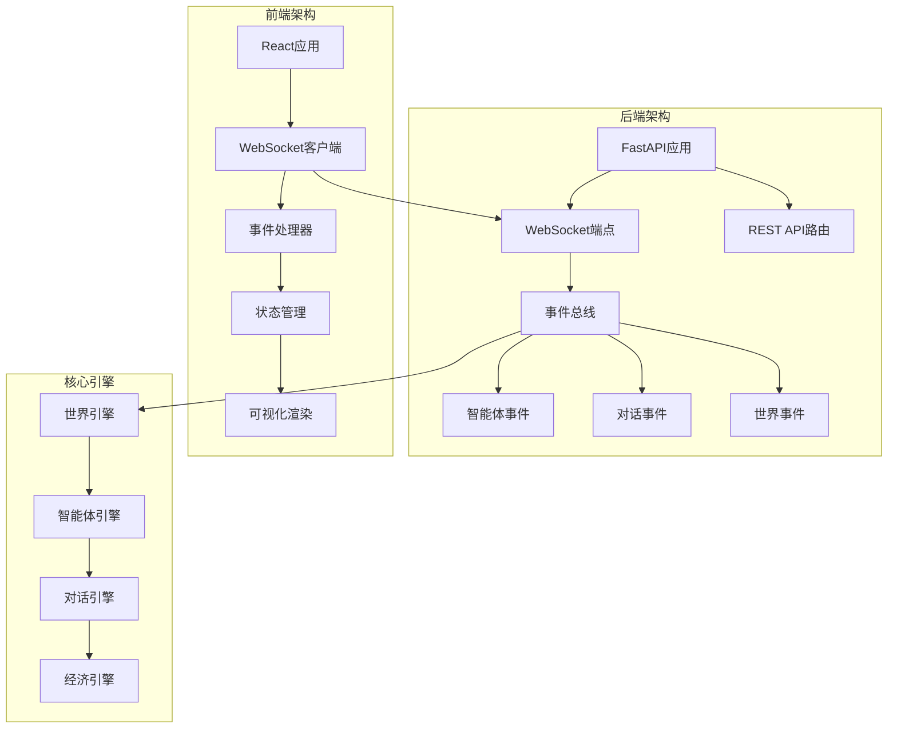
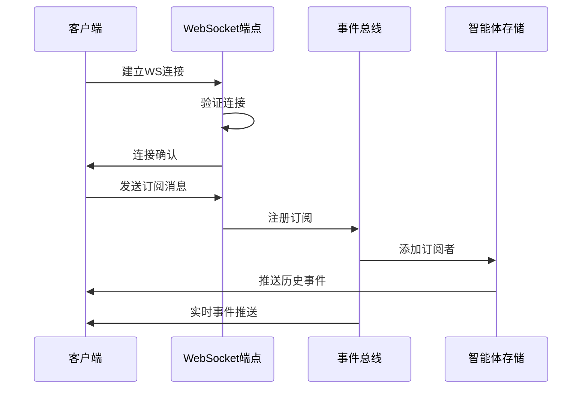
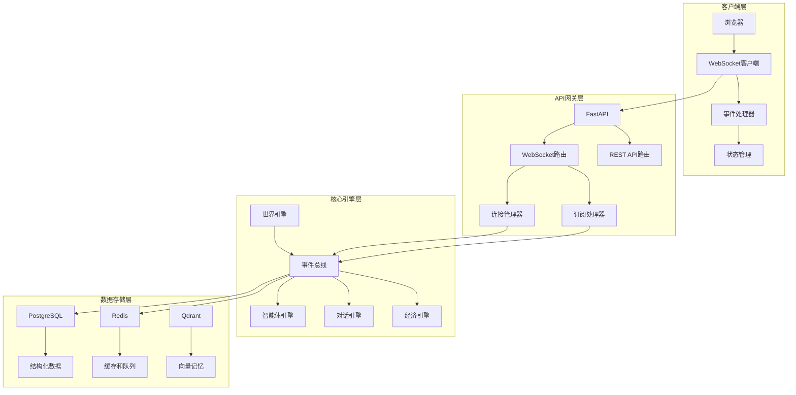
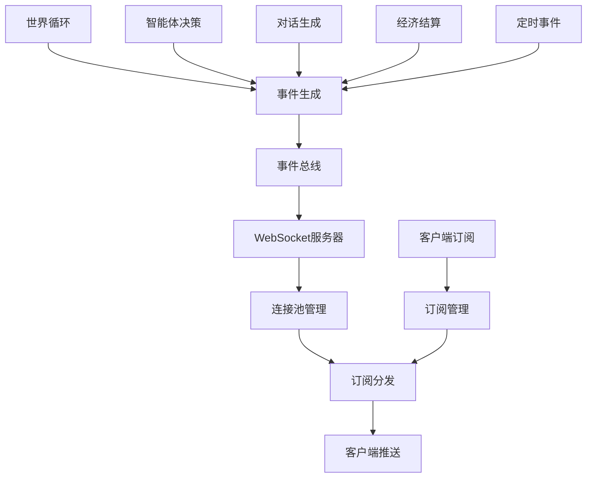
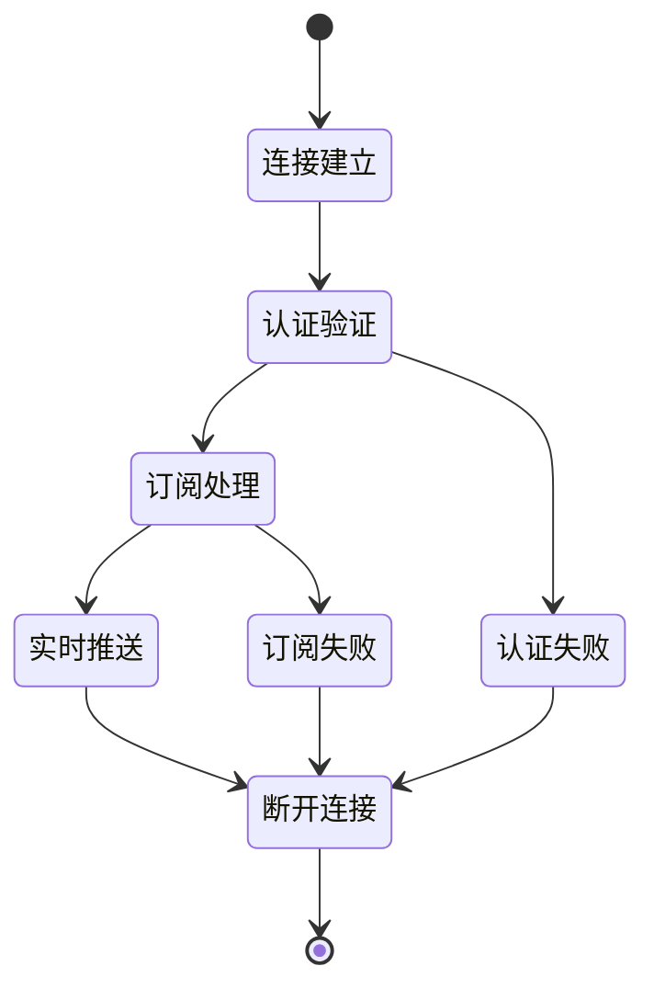
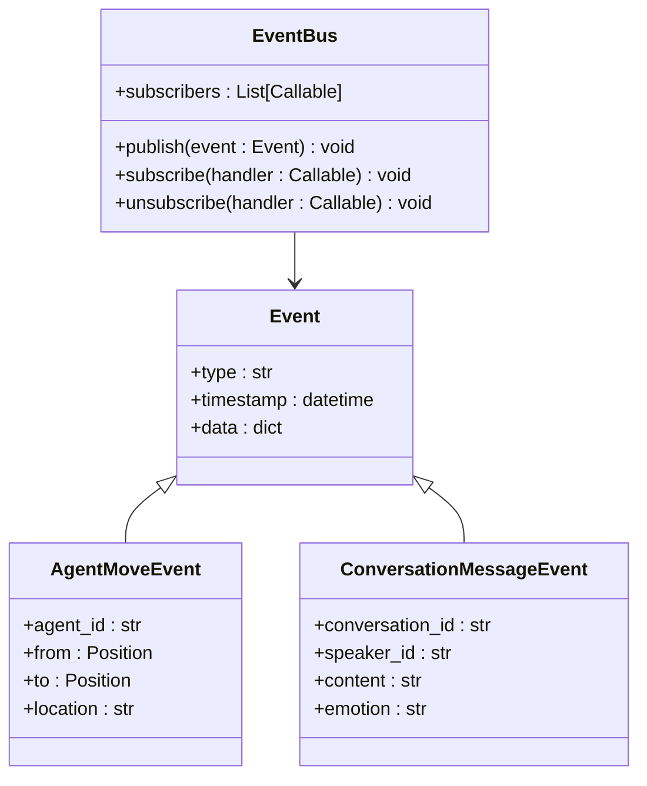
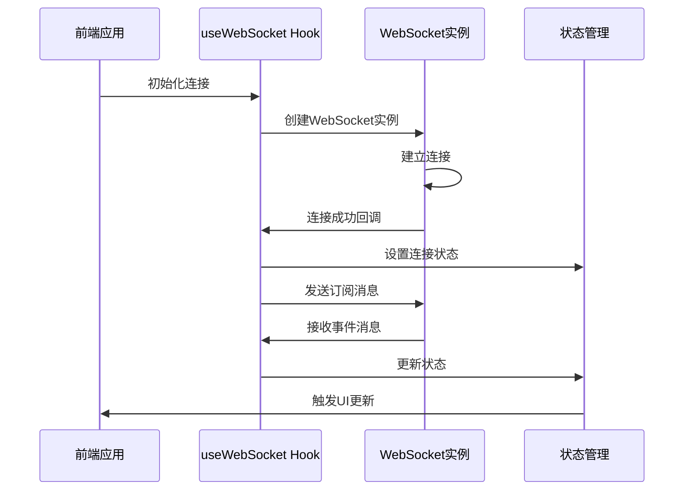
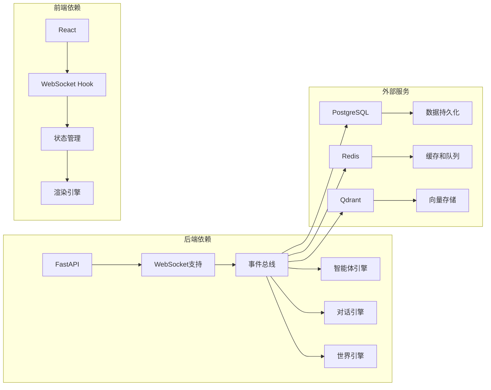
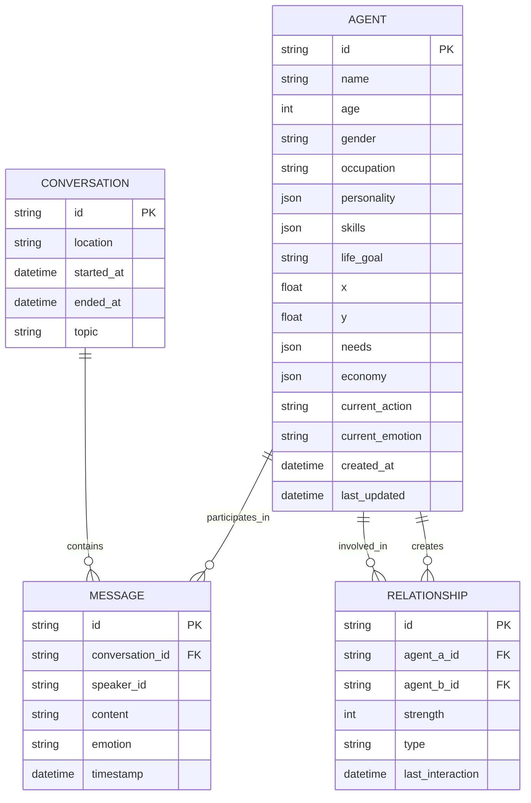

# 实时流API

<cite>
**本文档引用的文件**
- [06-api-design.spec.md](file://specs/06-api-design.spec.md)
- [01-architecture.spec.md](file://specs/01-architecture.spec.md)
- [07-frontend.spec.md](file://specs/07-frontend.spec.md)
- [08-implementation-plan.spec.md](file://specs/08-implementation-plan.spec.md)
- [world.py](file://backend/app/core/world.py)
- [agent.py](file://backend/app/core/agent.py)
</cite>

## 目录
1. [简介](#简介)
2. [项目结构](#项目结构)
3. [核心组件](#核心组件)
4. [架构概览](#架构概览)
5. [详细组件分析](#详细组件分析)
6. [依赖关系分析](#依赖关系分析)
7. [性能考虑](#性能考虑)
8. [故障排除指南](#故障排除指南)
9. [结论](#结论)

## 简介

实时流API是AI Society项目的核心通信机制，负责将世界中的实时事件通过WebSocket推送给前端观察者。该系统实现了完整的事件驱动架构，支持多种事件类型、灵活的订阅机制和高效的实时数据传输。

AI Society是一个开源的AI自治世界观察实验平台，通过实时流API实现了50-200个智能体的实时观察和交互。系统采用FastAPI作为后端框架，React作为前端框架，实现了高性能的实时事件推送。

## 项目结构

项目的实时流API主要分布在以下目录结构中：

**图表来源**
- [01-architecture.spec.md](file://specs/01-architecture.spec.md#L1-L255)
- [06-api-design.spec.md](file://specs/06-api-design.spec.md#L411-L617)

**章节来源**
- [01-architecture.spec.md](file://specs/01-architecture.spec.md#L1-L255)
- [06-api-design.spec.md](file://specs/06-api-design.spec.md#L1-L655)

## 核心组件

### WebSocket连接管理

实时流API的核心是WebSocket连接管理，负责处理客户端连接、订阅管理和事件推送。

#### 连接建立流程

**图表来源**
- [06-api-design.spec.md](file://specs/06-api-design.spec.md#L413-L425)
- [07-frontend.spec.md](file://specs/07-frontend.spec.md#L360-L407)

#### 订阅管理机制

系统支持多种订阅模式：

1. **频道订阅**：`['all']`, `['agents']`, `['conversations']`, `['world']`
2. **智能体订阅**：针对特定智能体的事件推送
3. **组合订阅**：同时订阅多个频道和智能体

**章节来源**
- [06-api-design.spec.md](file://specs/06-api-design.spec.md#L597-L617)

### 事件类型定义

实时流API定义了丰富的事件类型，覆盖智能体行为、对话交互和世界状态变化：

#### 智能体相关事件

| 事件类型 | 描述 | 数据字段 | 触发条件 |
|---------|------|---------|----------|
| `agent_move` | 智能体移动 | agent_id, agent_name, from, to, location | 智能体位置变化 |
| `agent_state_change` | 智能体状态变化 | agent_id, changes | 需求、情感、行动变化 |
| `agent_created` | 新智能体创建 | agent_id, name, age, occupation | AI生成新智能体 |
| `agent_departed` | 智能体离开 | agent_id, name, reason, days_lived | 经济困难或达到寿命 |

#### 对话相关事件

| 事件类型 | 描述 | 数据字段 | 触发条件 |
|---------|------|---------|----------|
| `conversation_start` | 对话开始 | conversation_id, participants, location | 两个智能体相遇 |
| `conversation_message` | 新消息 | conversation_id, speaker_id, speaker_name, content, emotion | 对话中有新消息 |
| `conversation_end` | 对话结束 | conversation_id, duration_minutes, message_count, topic, relationship_change | 对话自然结束 |
| `relationship_change` | 关系变化 | agent_a, agent_b, old_strength, new_strength, reason | 对话影响关系 |

#### 世界相关事件

| 事件类型 | 描述 | 数据字段 | 触发条件 |
|---------|------|---------|----------|
| `world_event` | 世界事件 | event, message, world_time | 日出/日落等定时事件 |
| `economic_event` | 经济事件 | event, summary | 每日结算 |

**章节来源**
- [06-api-design.spec.md](file://specs/06-api-design.spec.md#L427-L595)

## 架构概览

### 系统架构图

**图表来源**
- [01-architecture.spec.md](file://specs/01-architecture.spec.md#L3-L57)
- [06-api-design.spec.md](file://specs/06-api-design.spec.md#L411-L617)

### 数据流架构

**图表来源**
- [01-architecture.spec.md](file://specs/01-architecture.spec.md#L178-L203)
- [06-api-design.spec.md](file://specs/06-api-design.spec.md#L411-L617)

**章节来源**
- [01-architecture.spec.md](file://specs/01-architecture.spec.md#L1-L255)

## 详细组件分析

### WebSocket连接管理器

#### 连接生命周期管理

**图表来源**
- [06-api-design.spec.md](file://specs/06-api-design.spec.md#L413-L425)

#### 连接池管理

系统实现了高效的连接池管理机制：

- **连接池大小**：支持高并发连接
- **心跳检测**：定期检测连接有效性
- **资源清理**：自动清理断开的连接
- **负载均衡**：多实例部署支持

**章节来源**
- [06-api-design.spec.md](file://specs/06-api-design.spec.md#L411-L425)

### 事件总线系统

#### 事件发布订阅模式

**图表来源**
- [06-api-design.spec.md](file://specs/06-api-design.spec.md#L427-L595)

#### 事件过滤机制

系统支持多种事件过滤策略：

1. **类型过滤**：按事件类型过滤
2. **智能体过滤**：按智能体ID过滤
3. **范围过滤**：按地理位置过滤
4. **时间过滤**：按时间范围过滤

**章节来源**
- [06-api-design.spec.md](file://specs/06-api-design.spec.md#L427-L595)

### 前端WebSocket客户端

#### 客户端连接实现

**图表来源**
- [07-frontend.spec.md](file://specs/07-frontend.spec.md#L360-L407)

#### 客户端事件处理

前端实现了完善的事件处理机制：

- **事件解析**：JSON消息解析
- **状态更新**：自动更新应用状态
- **错误处理**：异常情况下的状态恢复
- **性能优化**：批量更新和渲染优化

**章节来源**
- [07-frontend.spec.md](file://specs/07-frontend.spec.md#L360-L407)

## 依赖关系分析

### 核心依赖关系

**图表来源**
- [01-architecture.spec.md](file://specs/01-architecture.spec.md#L100-L176)

### 数据模型关系

**图表来源**
- [agent.py](file://backend/app/core/agent.py#L48-L92)

**章节来源**
- [01-architecture.spec.md](file://specs/01-architecture.spec.md#L100-L176)
- [agent.py](file://backend/app/core/agent.py#L1-L92)

## 性能考虑

### 实时性能指标

系统设计了严格的性能指标以确保实时流的高效运行：

| 指标类别 | 目标值 | 说明 |
|---------|--------|------|
| **WebSocket延迟** | <50ms | 事件从产生到客户端接收的时间 |
| **前端帧率** | 60fps | React组件渲染性能 |
| **智能体数量** | 50-200 | 系统可支持的智能体规模 |
| **API响应时间** | <100ms | REST API响应延迟 |
| **LLM调用频率** | 每智能体每10分钟最多1次 | 避免过度调用API |
| **内存占用** | <2GB | 系统整体内存使用 |

### 性能优化策略

#### 渲染优化

前端实现了多项渲染优化技术：

1. **可见区域渲染**：只渲染屏幕可见范围内的智能体
2. **对象池复用**：智能体精灵对象池减少GC压力
3. **批量状态更新**：使用requestAnimationFrame合并状态更新
4. **虚拟滚动**：事件列表使用虚拟滚动提高性能

#### 事件推送优化

后端采用了高效的事件推送策略：

1. **批量推送**：聚合多个事件一次性推送
2. **增量更新**：只推送变化的数据
3. **压缩传输**：对事件数据进行压缩
4. **背压处理**：防止客户端过载

**章节来源**
- [01-architecture.spec.md](file://specs/01-architecture.spec.md#L245-L255)
- [07-frontend.spec.md](file://specs/07-frontend.spec.md#L485-L521)

## 故障排除指南

### 常见问题诊断

#### 连接问题

| 问题症状 | 可能原因 | 解决方案 |
|---------|----------|----------|
| 连接超时 | 网络问题或服务器不可达 | 检查网络连接和服务器状态 |
| 认证失败 | 凭据错误或过期 | 验证认证信息和令牌有效期 |
| 订阅失败 | 频道不存在或权限不足 | 检查订阅参数和用户权限 |
| 推送延迟 | 服务器负载过高 | 监控服务器性能和资源使用 |

#### 事件处理问题

| 问题症状 | 可能原因 | 解决方案 |
|---------|----------|----------|
| 事件丢失 | 网络中断或客户端断开 | 实现断线重连和事件重放 |
| 重复事件 | 订阅重复或服务器bug | 检查订阅状态和服务器日志 |
| 数据不一致 | 并发更新冲突 | 实现事件顺序保证和数据同步 |
| 性能下降 | 事件过多或客户端处理慢 | 优化事件过滤和客户端处理 |

#### 性能问题

| 问题症状 | 可能原因 | 解决方案 |
|---------|----------|----------|
| 帧率下降 | 渲染过多或计算密集 | 实现渲染优化和计算卸载 |
| 内存泄漏 | 事件监听器未清理 | 检查事件监听器生命周期 |
| CPU占用高 | 事件处理逻辑复杂 | 优化算法和异步处理 |
| 内存占用大 | 数据缓存过多 | 实现缓存清理和内存监控 |

### 调试工具和方法

#### 服务器端调试

1. **日志监控**：启用详细的服务器日志记录
2. **性能分析**：使用性能分析工具监控系统瓶颈
3. **连接监控**：实时监控WebSocket连接状态
4. **事件追踪**：跟踪事件的完整生命周期

#### 客户端调试

1. **WebSocket调试**：使用浏览器开发者工具监控WS通信
2. **状态检查**：验证应用状态的正确性
3. **事件序列**：检查事件的接收顺序和完整性
4. **性能监控**：监控前端性能指标

**章节来源**
- [06-api-design.spec.md](file://specs/06-api-design.spec.md#L619-L655)

## 结论

实时流API是AI Society项目的核心基础设施，实现了高性能、可扩展的实时事件推送系统。通过合理的架构设计和优化策略，系统能够支持50-200个智能体的实时观察，为用户提供流畅的AI自治世界观察体验。

系统的成功关键在于：

1. **事件驱动架构**：基于事件总线的松耦合设计
2. **高效连接管理**：优化的WebSocket连接池和订阅机制
3. **性能优化策略**：前后端协同的性能优化方案
4. **容错处理机制**：完善的错误处理和恢复机制

未来可以在以下方面进一步改进：
- 实现更精细的事件过滤和聚合
- 增强系统的可扩展性和分布式部署能力
- 优化大规模事件推送的性能
- 增加更多的监控和诊断工具