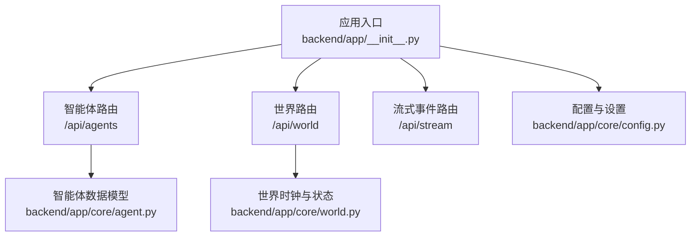
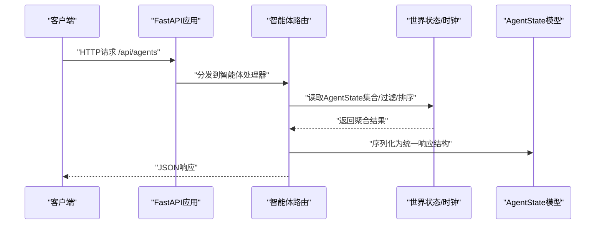
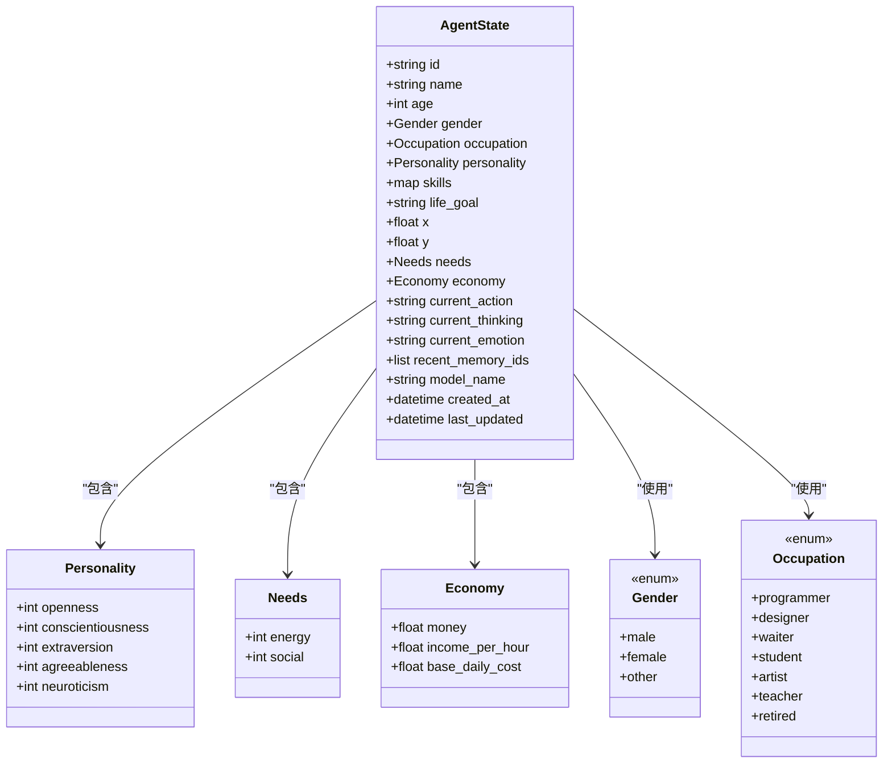
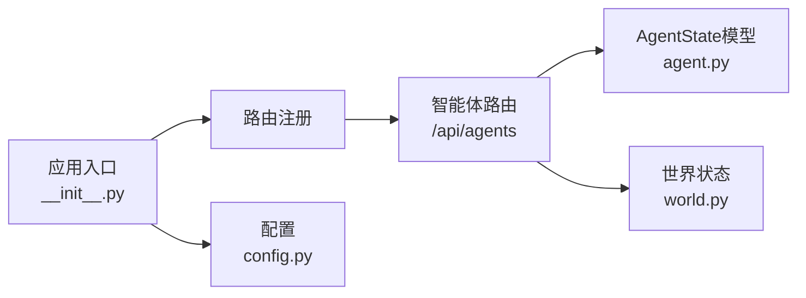

# 智能体管理API

<cite>
**本文档引用的文件**
- [specs/06-api-design.spec.md](file://specs/06-api-design.spec.md)
- [backend/app/__init__.py](file://backend/app/__init__.py)
- [backend/app/core/agent.py](file://backend/app/core/agent.py)
- [backend/app/core/world.py](file://backend/app/core/world.py)
- [backend/app/core/config.py](file://backend/app/core/config.py)
</cite>

## 目录
1. [简介](#简介)
2. [项目结构](#项目结构)
3. [核心组件](#核心组件)
4. [架构总览](#架构总览)
5. [详细组件分析](#详细组件分析)
6. [依赖关系分析](#依赖关系分析)
7. [性能考虑](#性能考虑)
8. [故障排除指南](#故障排除指南)
9. [结论](#结论)
10. [附录](#附录)

## 简介
本文件为智能体管理API的完整技术文档，覆盖/agents端点的全部REST操作，包括获取智能体列表、获取单个智能体详情、创建、更新、删除等。文档同时阐述智能体数据模型、字段定义与验证规则，并提供行为控制、状态查询与批量操作的接口规范说明。

## 项目结构
- 后端基于FastAPI应用，通过路由注册将世界、智能体与流式事件服务挂载到统一的/api前缀下。
- 智能体相关API在规格说明中定义，实际路由注册位于应用入口文件中。
- 核心领域模型（AgentState、Personality、Needs、Economy等）在core模块中定义，支撑API的数据结构与业务语义。

**图表来源**
- [backend/app/__init__.py](file://backend/app/__init__.py#L7-L21)
- [backend/app/core/agent.py](file://backend/app/core/agent.py#L25-L92)
- [backend/app/core/world.py](file://backend/app/core/world.py#L8-L40)
- [backend/app/core/config.py](file://backend/app/core/config.py#L7-L42)

**章节来源**
- [backend/app/__init__.py](file://backend/app/__init__.py#L7-L21)

## 核心组件
- 智能体数据模型：包含身份信息、人格、技能、状态、需求、经济状况等。
- 世界状态与时间：提供世界时钟与AgentState集合，支撑智能体状态查询与行为模拟。
- 应用路由：注册/agents相关路由，提供REST接口与WebSocket事件流。

**章节来源**
- [backend/app/core/agent.py](file://backend/app/core/agent.py#L25-L92)
- [backend/app/core/world.py](file://backend/app/core/world.py#L30-L36)
- [backend/app/__init__.py](file://backend/app/__init__.py#L17-L19)

## 架构总览
智能体管理API遵循REST设计，结合WebSocket进行实时事件推送。请求统一走/api前缀，响应采用统一的成功/失败包装结构；错误码与速率限制在规格说明中给出。

**图表来源**
- [backend/app/__init__.py](file://backend/app/__init__.py#L17-L19)
- [specs/06-api-design.spec.md](file://specs/06-api-design.spec.md#L110-L232)
- [backend/app/core/world.py](file://backend/app/core/world.py#L30-L36)

## 详细组件分析

### 1. 智能体数据模型与字段定义
以下为智能体核心数据模型的关键字段与含义（以规格说明为准），便于理解API请求/响应结构与验证规则：

- 身份信息
  - id: 字符串，唯一标识
  - name: 字符串，姓名
  - age: 整数，年龄
  - gender: 枚举，性别(male/female/other)
  - occupation: 枚举，职业(programmer/designer/waiter/student/artist/teacher/retired)
  - model_name: 字符串，使用的LLM模型别名（默认值见模型定义）

- 人格维度
  - openness: 整数
  - conscientiousness: 整数
  - extraversion: 整数
  - agreeableness: 整数
  - neuroticism: 整数

- 技能
  - skills: 映射，键为技能名字符串，值为整数评分

- 生活目标与背景
  - life_goal: 字符串
  - backstory: 字符串

- 当前状态
  - position: 位置坐标(x,y)
  - current_location: 字符串，当前位置名称
  - current_action: 字符串，当前动作
  - current_target: 字符串，当前目标
  - current_thinking: 字符串，当前思考
  - current_emotion: 字符串，当前情绪
  - needs: 包含energy与social
  - economy: 包含money、income_per_hour、base_daily_cost

- 记忆与时间戳
  - recent_memory_ids: 字符串数组
  - created_at/last_updated: UTC时间戳

- 关系与近期记忆（在详情响应中出现）
  - relationships: 数组，包含对方agent_id/name/type/strength/last_interaction
  - recent_memories: 数组，包含content/time/importance

- 轨迹查询
  - trajectory: 数组，包含time/location/action

**章节来源**
- [backend/app/core/agent.py](file://backend/app/core/agent.py#L9-L23)
- [backend/app/core/agent.py](file://backend/app/core/agent.py#L25-L92)
- [specs/06-api-design.spec.md](file://specs/06-api-design.spec.md#L110-L232)

### 2. 接口规范与示例

- 获取智能体列表
  - 方法与路径: GET /api/agents
  - 查询参数:
    - page: 整数，页码
    - limit: 整数，每页数量
    - occupation: 枚举值，按职业过滤
    - sort: 字段名，按某字段排序
  - 响应: 包含total/page/limit与agents数组，agents元素字段见“身份信息+状态”部分
  - 示例参考: 规格说明中的“获取所有智能体”示例

- 获取智能体详情
  - 方法与路径: GET /api/agents/{agent_id}
  - 路径参数: agent_id
  - 响应: 包含profile/state/relationships/recent_memories三部分
    - profile: 身份信息+人格+技能+目标+背景+模型名
    - state: 位置、动作、思考、情绪、需求、经济等
    - relationships与recent_memories: 关系与记忆片段
  - 示例参考: 规格说明中的“获取智能体详情”示例

- 获取智能体轨迹
  - 方法与路径: GET /api/agents/{agent_id}/trajectory
  - 查询参数: hours（整数，默认24）
  - 响应: agent_id与trajectory数组，元素包含time/location/action
  - 示例参考: 规格说明中的“获取智能体轨迹”示例

- 创建智能体
  - 方法与路径: POST /api/agents
  - 请求体: 至少包含身份信息（name/age/gender/occupation）与可选的人格、技能、目标等
  - 响应: 返回新创建的AgentState摘要或完整详情
  - 注意: 具体字段校验与默认值请参考AgentState模型定义

- 更新智能体
  - 方法与路径: PUT /api/agents/{agent_id}
  - 路径参数: agent_id
  - 请求体: 支持更新的部分字段（如name/age/gender/occupation/personality/skills等）
  - 响应: 返回更新后的AgentState

- 删除智能体
  - 方法与路径: DELETE /api/agents/{agent_id}
  - 路径参数: agent_id
  - 响应: 成功删除的确认信息

- 批量操作
  - 说明: 规格说明未提供专门的批量API端点。建议通过客户端循环调用单个资源端点实现批量创建/更新/删除。
  - 注意: 在高并发场景下需考虑速率限制与幂等性。

**章节来源**
- [specs/06-api-design.spec.md](file://specs/06-api-design.spec.md#L110-L232)
- [backend/app/core/agent.py](file://backend/app/core/agent.py#L25-L92)

### 3. 行为控制与状态查询
- 行为控制
  - 世界控制: 通过世界相关API控制世界运行状态（暂停/恢复/加速/减速/重置），从而影响智能体行为的推进节奏
  - 参考: 规格说明中的“控制世界运行”与“世界状态”
- 状态查询
  - 实时状态: 通过GET /api/agents/{agent_id}获取当前状态
  - 历史轨迹: 通过GET /api/agents/{agent_id}/trajectory查询历史位置与动作
  - 关系与记忆: 详情响应中包含relationships与recent_memories，便于分析社交与认知状态

**章节来源**
- [specs/06-api-design.spec.md](file://specs/06-api-design.spec.md#L18-L108)
- [specs/06-api-design.spec.md](file://specs/06-api-design.spec.md#L212-L232)

### 4. 数据模型类图

**图表来源**
- [backend/app/core/agent.py](file://backend/app/core/agent.py#L9-L92)

## 依赖关系分析
- 应用入口依赖路由模块与配置模块，将智能体路由注册到/api/agents前缀下。
- 智能体路由依赖核心AgentState模型与世界状态（WorldState）以提供数据访问。
- 配置模块提供环境变量与多模型支持，间接影响智能体的推理与行为。

**图表来源**
- [backend/app/__init__.py](file://backend/app/__init__.py#L3-L4)
- [backend/app/core/agent.py](file://backend/app/core/agent.py#L25-L92)
- [backend/app/core/world.py](file://backend/app/core/world.py#L30-L36)
- [backend/app/core/config.py](file://backend/app/core/config.py#L24-L29)

**章节来源**
- [backend/app/__init__.py](file://backend/app/__init__.py#L3-L4)
- [backend/app/core/agent.py](file://backend/app/core/agent.py#L25-L92)
- [backend/app/core/world.py](file://backend/app/core/world.py#L30-L36)
- [backend/app/core/config.py](file://backend/app/core/config.py#L24-L29)

## 性能考虑
- 速率限制
  - REST API: 每分钟100次
  - WebSocket: 服务器主动推送，无限制
  - 导出API: 每小时10次
- 分页与过滤
  - 列表查询支持分页与按职业过滤，建议合理设置limit与occupation参数以减少响应体积
- 缓存与索引
  - 建议对常用查询（如按occupation、按name模糊匹配）建立索引或缓存策略
- 并发与幂等
  - 批量操作建议在客户端侧进行限速与去重，确保幂等性

**章节来源**
- [specs/06-api-design.spec.md](file://specs/06-api-design.spec.md#L648-L655)

## 故障排除指南
- 常见错误码
  - AGENT_NOT_FOUND: 404，智能体不存在
  - LOCATION_NOT_FOUND: 404，位置不存在
  - CONVERSATION_NOT_FOUND: 404，对话不存在
  - INVALID_PARAMETER: 400，参数错误
  - WORLD_PAUSED: 409，世界已暂停，无法执行某些操作
  - RATE_LIMITED: 429，请求过于频繁
  - INTERNAL_ERROR: 500，服务器内部错误
- 响应格式
  - 统一的错误响应包含success=false与error.code/message/details
- 排查步骤
  - 确认agent_id是否正确
  - 检查查询参数（page/limit/occupation/sort）是否符合预期
  - 若提示WORLD_PAUSED，请先调用世界控制接口恢复运行
  - 若触发RATE_LIMITED，请降低请求频率或增加等待时间

**章节来源**
- [specs/06-api-design.spec.md](file://specs/06-api-design.spec.md#L619-L647)

## 结论
智能体管理API提供了完整的CRUD与查询能力，并通过统一的响应格式与错误码体系保障了易用性与一致性。结合世界控制与WebSocket事件流，用户可以全面观察与干预AI社会的演化过程。建议在生产环境中配合合理的分页、过滤与缓存策略，以获得更佳的性能与用户体验。

## 附录

### A. API端点一览
- GET /api/agents?page=&limit=&occupation=&sort=
- GET /api/agents/{agent_id}
- GET /api/agents/{agent_id}/trajectory?hours=
- POST /api/agents
- PUT /api/agents/{agent_id}
- DELETE /api/agents/{agent_id}

**章节来源**
- [specs/06-api-design.spec.md](file://specs/06-api-design.spec.md#L110-L232)

### B. 数据模型字段对照表
- 身份信息: id, name, age, gender, occupation, model_name
- 人格: openness, conscientiousness, extraversion, agreeableness, neuroticism
- 技能: map<string,int>
- 生活目标: life_goal, backstory
- 状态: position(current_location), current_action, current_target, current_thinking, current_emotion
- 需求: needs.energy, needs.social
- 经济: economy.money, economy.income_per_hour, economy.base_daily_cost
- 时间: created_at, last_updated
- 关系: relationships[]
- 记忆: recent_memories[], recent_memory_ids[]

**章节来源**
- [backend/app/core/agent.py](file://backend/app/core/agent.py#L25-L92)
- [specs/06-api-design.spec.md](file://specs/06-api-design.spec.md#L110-L232)