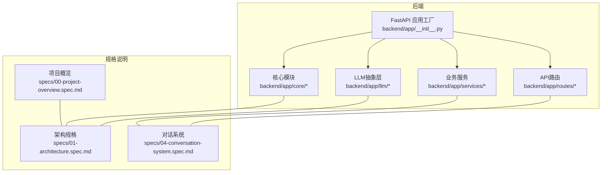
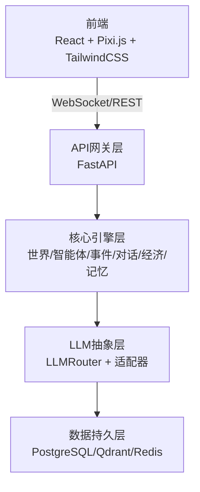
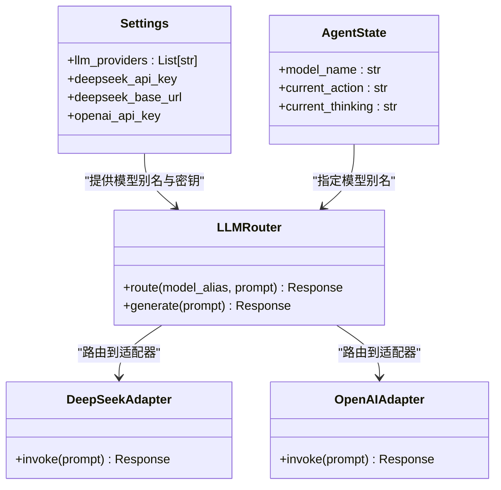
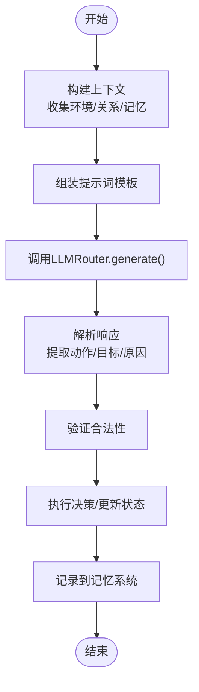
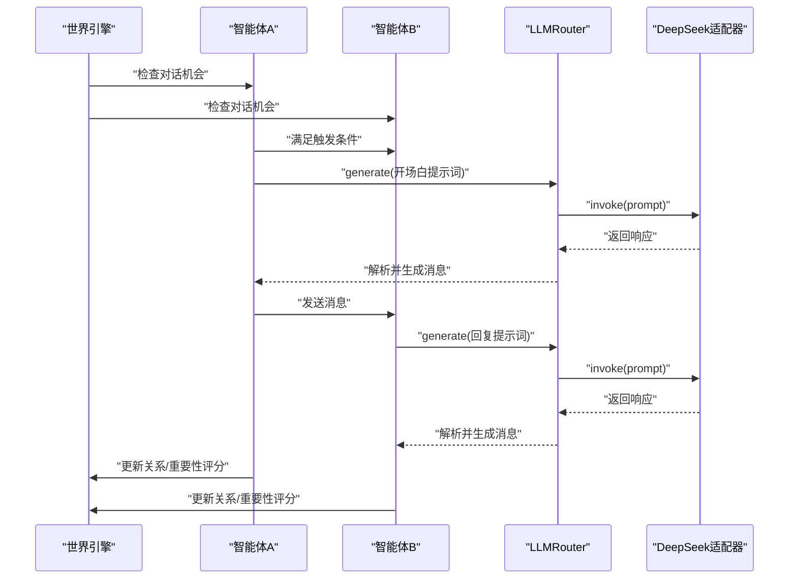
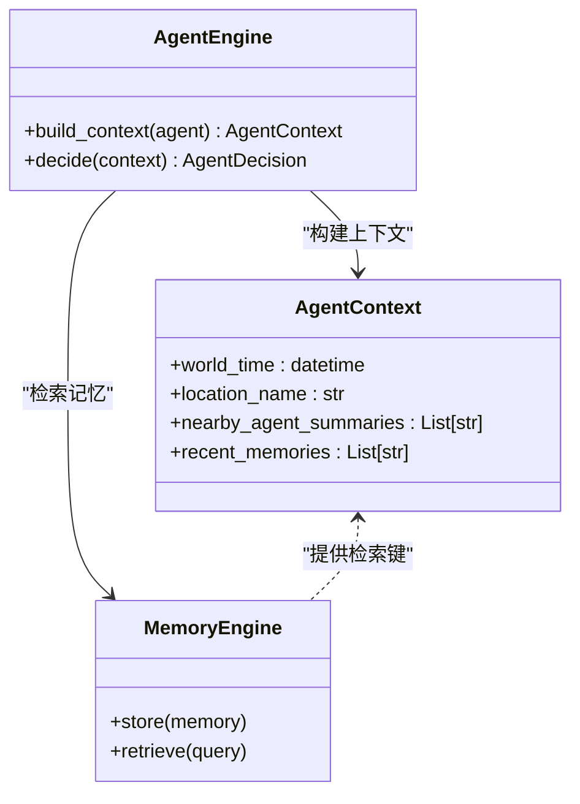
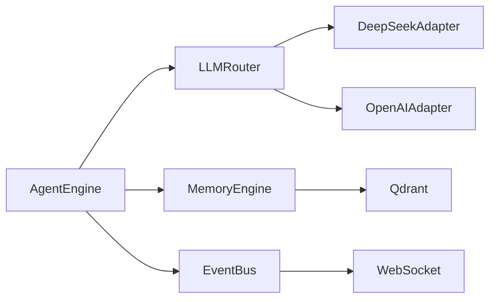

# LLM集成系统

<cite>
**本文档引用的文件**
- [backend/app/core/agent.py](file://backend/app/core/agent.py)
- [backend/app/core/config.py](file://backend/app/core/config.py)
- [backend/app/core/world.py](file://backend/app/core/world.py)
- [specs/00-project-overview.spec.md](file://specs/00-project-overview.spec.md)
- [specs/01-architecture.spec.md](file://specs/01-architecture.spec.md)
- [specs/04-conversation-system.spec.md](file://specs/04-conversation-system.spec.md)
</cite>

## 目录
1. [简介](#简介)
2. [项目结构](#项目结构)
3. [核心组件](#核心组件)
4. [架构总览](#架构总览)
5. [详细组件分析](#详细组件分析)
6. [依赖分析](#依赖分析)
7. [性能考虑](#性能考虑)
8. [故障排查指南](#故障排查指南)
9. [结论](#结论)
10. [附录](#附录)

## 简介
本项目是一个“AI社会”观察实验平台，旨在构建一个由50+自治智能体组成的虚拟社会，观察其在时间、经济、社交与记忆驱动下的自发演化。LLM集成系统作为智能体复杂决策与对话生成的核心，采用多模型适配器架构，支持DeepSeek、OpenAI、Claude等不同大语言模型，并通过LLMRouter实现路由、负载均衡与错误处理。

## 项目结构
后端采用FastAPI应用工厂模式组织，核心模块位于backend/app下，LLM抽象层位于backend/app/llm目录（根据规格说明），对话系统与智能体状态在specs中详细定义。系统通过配置中心集中管理多模型提供商与API密钥，世界时钟与智能体状态在core模块中定义。

**图表来源**
- [specs/01-architecture.spec.md](file://specs/01-architecture.spec.md#L92-L169)
- [specs/00-project-overview.spec.md](file://specs/00-project-overview.spec.md#L1-L46)

**章节来源**
- [specs/01-architecture.spec.md](file://specs/01-architecture.spec.md#L92-L169)
- [specs/00-project-overview.spec.md](file://specs/00-project-overview.spec.md#L1-L46)

## 核心组件
- 配置中心：集中管理环境、数据库、Redis、向量库以及多模型提供商列表与各厂商API密钥。
- 智能体状态：包含身份、需求、经济、记忆索引、当前行动与思考、所用模型标识等。
- 世界时钟：提供现实与世界时间映射，支撑系统节奏与事件触发。
- 对话系统：定义对话触发条件、提示词模板、轮次控制、情绪与话题分析、关系变化与记忆存储。

**章节来源**
- [backend/app/core/config.py](file://backend/app/core/config.py#L1-L42)
- [backend/app/core/agent.py](file://backend/app/core/agent.py#L25-L92)
- [backend/app/core/world.py](file://backend/app/core/world.py#L8-L40)
- [specs/04-conversation-system.spec.md](file://specs/04-conversation-system.spec.md#L1-L581)

## 架构总览
系统采用分层架构：前端通过WebSocket与REST API与后端交互；后端包含API网关层、核心引擎层（世界引擎、智能体引擎、事件总线、对话引擎、经济引擎、记忆引擎）、LLM抽象层（LLMRouter与多模型适配器）、数据持久层（PostgreSQL、Qdrant、Redis）。LLMRouter负责根据智能体配置将请求路由至对应适配器，实现多模型统一接入与成本控制。

**图表来源**
- [specs/01-architecture.spec.md](file://specs/01-architecture.spec.md#L3-L57)

## 详细组件分析

### LLMRouter与多模型适配器架构
- 设计原理
  - 统一接口：所有适配器实现一致的调用接口，屏蔽不同厂商API差异。
  - 路由策略：基于AgentState.model_name进行路由，支持按模型能力（如推理型/对话型）与成本策略选择。
  - 负载均衡：在适配器内部或外部实现并发限制与重试策略，避免单点瓶颈。
  - 错误处理：统一异常捕获与降级策略（如回退到低成本模型或本地模型）。
- 实现细节
  - 配置注册：Settings.llm_providers维护可用模型别名，便于扩展与切换。
  - 模型选择：AgentState.model_name决定调用哪个适配器，支持同一智能体在不同情境切换模型。
  - 成本控制：通过模型定价与调用频率控制（每智能体每10分钟最多1次）实现预算管理。
- 适配策略
  - DeepSeek：提供对话与推理两种模式，分别适用于日常社交与复杂决策。
  - OpenAI/Claude：作为高端智能体选项，适合需要更强推理或创意的任务。
  - 本地模型：Ollama用于开发测试与隐私敏感场景。

**图表来源**
- [backend/app/core/config.py](file://backend/app/core/config.py#L24-L37)
- [backend/app/core/agent.py](file://backend/app/core/agent.py#L74-L75)
- [specs/01-architecture.spec.md](file://specs/01-architecture.spec.md#L38-L46)

**章节来源**
- [specs/01-architecture.spec.md](file://specs/01-architecture.spec.md#L38-L46)
- [backend/app/core/config.py](file://backend/app/core/config.py#L24-L37)
- [backend/app/core/agent.py](file://backend/app/core/agent.py#L74-L75)

### 提示词工程最佳实践
- 结构化提示词：将背景、关系、场景、记忆等要素按模板组装，确保上下文完整且可读。
- 行为约束：明确输出格式与字数限制，减少解析歧义。
- 情绪与话题：结合情绪关键词与话题模式，提升对话自然度与可追踪性。
- 记忆注入：在提示词中注入近期记忆，增强连贯性与个性化。

**图表来源**
- [specs/01-architecture.spec.md](file://specs/01-architecture.spec.md#L198-L220)
- [specs/04-conversation-system.spec.md](file://specs/04-conversation-system.spec.md#L211-L240)

**章节来源**
- [specs/04-conversation-system.spec.md](file://specs/04-conversation-system.spec.md#L100-L166)
- [specs/04-conversation-system.spec.md](file://specs/04-conversation-system.spec.md#L211-L240)

### 对话系统与LLM集成
- 触发机制：基于距离、停留时间、关系亲疏、外向性与社交需求的概率模型触发对话。
- 轮次控制：最小/最大轮次、轮间隔、超时与打断条件，保证对话节奏与资源消耗可控。
- 情绪与话题：通过关键词检测与话题模式匹配，量化对话情感与主题，指导关系变化与记忆重要性。
- 记忆存储：对话摘要与重要性评分写入记忆系统，形成可检索的Episodic记忆。

**图表来源**
- [specs/04-conversation-system.spec.md](file://specs/04-conversation-system.spec.md#L16-L96)
- [specs/04-conversation-system.spec.md](file://specs/04-conversation-system.spec.md#L211-L240)
- [specs/04-conversation-system.spec.md](file://specs/04-conversation-system.spec.md#L381-L409)

**章节来源**
- [specs/04-conversation-system.spec.md](file://specs/04-conversation-system.spec.md#L16-L96)
- [specs/04-conversation-system.spec.md](file://specs/04-conversation-system.spec.md#L168-L188)
- [specs/04-conversation-system.spec.md](file://specs/04-conversation-system.spec.md#L242-L296)
- [specs/04-conversation-system.spec.md](file://specs/04-conversation-system.spec.md#L376-L439)

### 上下文管理、记忆集成与决策支持
- 上下文管理：AgentContext封装世界时间、地点、附近智能体摘要与近期记忆，作为提示词构建的基础。
- 记忆集成：对话与事件写入记忆系统，支持按重要性与主题检索，为后续决策提供依据。
- 决策支持：结合需求衰减、经济状态与关系强度，通过LLM生成合理的行为与目标，再由AgentEngine执行。

**图表来源**
- [backend/app/core/agent.py](file://backend/app/core/agent.py#L87-L92)
- [specs/04-conversation-system.spec.md](file://specs/04-conversation-system.spec.md#L381-L409)

**章节来源**
- [backend/app/core/agent.py](file://backend/app/core/agent.py#L87-L92)
- [specs/04-conversation-system.spec.md](file://specs/04-conversation-system.spec.md#L376-L439)

## 依赖分析
- 组件耦合
  - AgentEngine与LLMRouter松耦合：通过模型别名解耦具体实现。
  - LLMRouter与适配器：通过统一接口实现多厂商适配。
  - 对话系统与记忆系统：通过事件与存储接口连接，便于替换实现。
- 外部依赖
  - 配置中心集中管理API密钥与URL，避免硬编码。
  - 数据层采用PostgreSQL、Qdrant、Redis，满足结构化数据、向量检索与缓存队列需求。

**图表来源**
- [specs/01-architecture.spec.md](file://specs/01-architecture.spec.md#L24-L56)

**章节来源**
- [specs/01-architecture.spec.md](file://specs/01-architecture.spec.md#L24-L56)

## 性能考虑
- 调用频率控制：每智能体每10分钟最多1次LLM调用，降低总体成本与延迟。
- 并发与限流：在适配器层实现并发限制与重试，避免供应商限流或超时。
- 缓存与预热：对常用提示词与结果进行缓存，减少重复计算。
- 资源隔离：将LLM调用置于后台任务或队列中，避免阻塞主线程。

## 故障排查指南
- 模型不可用
  - 检查Settings中llm_providers与对应API密钥是否正确配置。
  - 确认AgentState.model_name与配置项一致。
- 路由失败
  - 查看LLMRouter路由逻辑，确认模型别名是否存在。
  - 检查适配器初始化与健康检查。
- 响应解析异常
  - 校验提示词模板输出格式，确保符合解析预期。
  - 添加日志与断言，定位非法字段。
- 成本超支
  - 监控调用次数与Token用量，调整模型选择与提示词长度。
  - 启用回退策略（低成本模型或本地模型）。

## 结论
本LLM集成系统通过多模型适配器与LLMRouter实现了对DeepSeek、OpenAI、Claude等模型的统一接入，结合严格的提示词工程、上下文管理与记忆集成，支撑智能体在复杂社会场景中的自主决策与对话生成。通过成本控制与性能优化策略，系统在可扩展性与稳定性方面具备良好基础。

## 附录

### 配置示例与API调用模式
- 环境变量
  - DEEPSEEK_API_KEY：DeepSeek API密钥
  - OPENAI_API_KEY：OpenAI API密钥
  - DATABASE_URL：数据库连接串
  - REDIS_URL：Redis连接串
  - VECTOR_STORE_URL：向量库地址
- API调用模式
  - 对话生成：LLMRouter.generate(prompt)，内部根据AgentState.model_name路由到对应适配器。
  - 记忆存储：对话结束后调用MemoryEngine.store(summary_prompt)生成摘要并存储。

**章节来源**
- [backend/app/core/config.py](file://backend/app/core/config.py#L31-L37)
- [specs/04-conversation-system.spec.md](file://specs/04-conversation-system.spec.md#L223-L223)
- [specs/04-conversation-system.spec.md](file://specs/04-conversation-system.spec.md#L395-L395)