# 前端系统

<cite>
**本文引用的文件**
- [前端规格说明](file://specs/07-frontend.spec.md)
- [系统架构规格说明](file://specs/01-architecture.spec.md)
- [项目概述规格说明](file://specs/00-project-overview.spec.md)
- [实施计划规格说明](file://specs/08-implementation-plan.spec.md)
</cite>

## 目录
1. [简介](#简介)
2. [项目结构](#项目结构)
3. [核心组件](#核心组件)
4. [架构总览](#架构总览)
5. [组件详解](#组件详解)
6. [依赖关系分析](#依赖关系分析)
7. [性能考量](#性能考量)
8. [故障排查指南](#故障排查指南)
9. [结论](#结论)
10. [附录](#附录)

## 简介
本文件面向AI Society前端系统，聚焦React组件架构、状态管理与可视化实现，系统性阐述Pixi.js图形引擎的使用、实时渲染与交互设计；同时解释Zustand状态管理、组件通信与性能优化策略，并覆盖用户界面布局、响应式设计与跨浏览器兼容性。文档还提供组件使用示例、自定义配置与主题定制指南，解释实时数据绑定、事件处理与用户体验优化，并给出前端部署配置、构建流程与性能监控建议。

## 项目结构
前端采用React 18 + Vite 5 + TypeScript 5 + TailwindCSS 3 + Pixi.js 8 + Zustand + Recharts + 原生WebSocket的组合，整体布局遵循“观察为主”的设计理念，强调信息密度与流畅体验，确保60fps实时更新与简洁优雅的视觉表达。

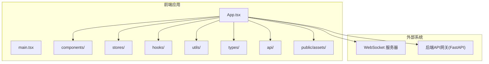

**图表来源**
- [前端规格说明](file://specs/07-frontend.spec.md#L594-L649)
- [系统架构规格说明](file://specs/01-architecture.spec.md#L1-L57)

**章节来源**
- [前端规格说明](file://specs/07-frontend.spec.md#L594-L649)
- [系统架构规格说明](file://specs/01-architecture.spec.md#L1-L57)

## 核心组件
- 顶部导航栏 TopBar：显示Logo、项目名称、游戏内时间与现实时间、控制按钮（暂停/继续/加速）、全屏切换与设置入口。
- 世界地图 WorldMap：基于Pixi.js渲染2000×2000世界，支持缩放与拖拽，展示位置、智能体、对话气泡与移动轨迹，支持热力图模式。
- 智能体精灵 AgentSprite：圆形头像、名字标签、状态指示器（绿色/黄色/蓝色/灰色）、情绪图标、移动轨迹线。
- 对话气泡 ChatBubble：白色圆角矩形，带说话人名、内容与左下小三角，支持淡入淡出动画与情绪背景色微调。
- 智能体列表面板 AgentListPanel：搜索框、筛选器（职业/状态）、智能体列表与点击选中联动。
- 智能体详情面板 AgentDetailPanel：头像、姓名/年龄/职业、性格维度、状态指标、社交关系、最近记忆。
- 实时事件流 EventStream：事件列表，支持类型筛选、点击跳转、自动滚动与暂停滚动。
- 统计面板 StatsPanel：人口统计、职业分布饼图、活跃对话数、今日对话总数、热门地点、经济指标。
- 社交网络图 SocialNetworkGraph：力导向图，节点大小代表社交连接数，边粗细代表关系强度，支持拖拽、缩放与悬停详情。

**章节来源**
- [前端规格说明](file://specs/07-frontend.spec.md#L74-L300)

## 架构总览
前端通过原生WebSocket与后端实时通信，Zustand集中管理世界时间、智能体、事件与对话状态，React组件负责UI渲染与交互，Pixi.js负责高性能2D渲染，TailwindCSS提供样式与响应式布局，Recharts用于统计图表。

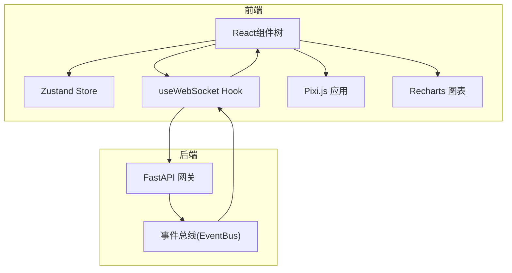

**图表来源**
- [前端规格说明](file://specs/07-frontend.spec.md#L360-L407)
- [系统架构规格说明](file://specs/01-architecture.spec.md#L14-L57)

**章节来源**
- [前端规格说明](file://specs/07-frontend.spec.md#L360-L407)
- [系统架构规格说明](file://specs/01-architecture.spec.md#L14-L57)

## 组件详解

### 顶部导航栏 TopBar
- 职责：显示Logo与项目名称、游戏内时间与现实时间、控制按钮（暂停/继续/加速）、全屏切换、设置入口。
- 交互：onPause/onResume/onSpeedChange回调驱动全局时间控制与渲染节奏。

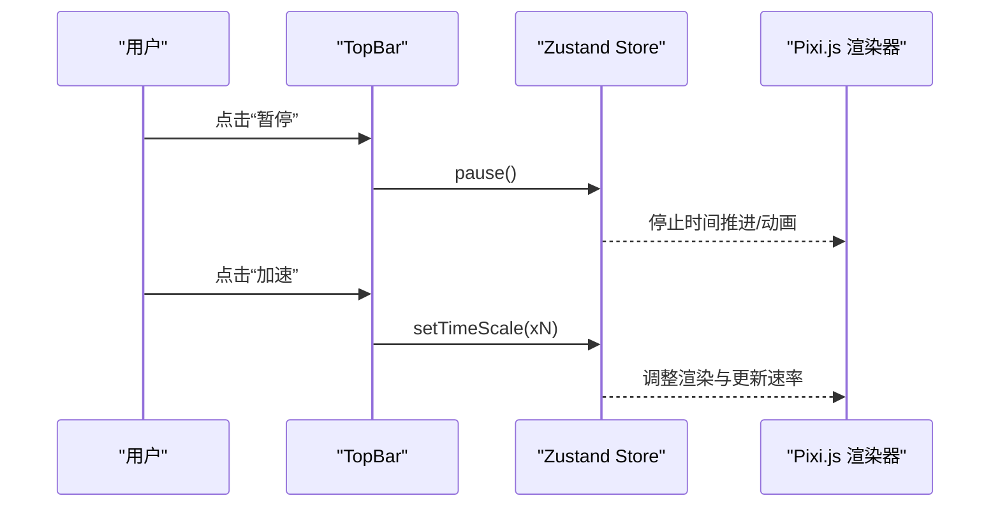

**图表来源**
- [前端规格说明](file://specs/07-frontend.spec.md#L74-L94)

**章节来源**
- [前端规格说明](file://specs/07-frontend.spec.md#L74-L94)

### 世界地图 WorldMap 与 Pixi.js 渲染
- 图层组织：背景层（地面/道路）、建筑层（位置建筑物）、智能体层（精灵）、效果层（对话气泡/选中高亮）、UI层（标签/指示器）。
- 交互：滚轮缩放、拖拽平移、点击智能体高亮、点击位置显示信息、热力图模式（可选）。
- 性能：仅渲染可见区域内的智能体、对象池复用精灵、批量更新状态、限制事件历史与气泡数量。

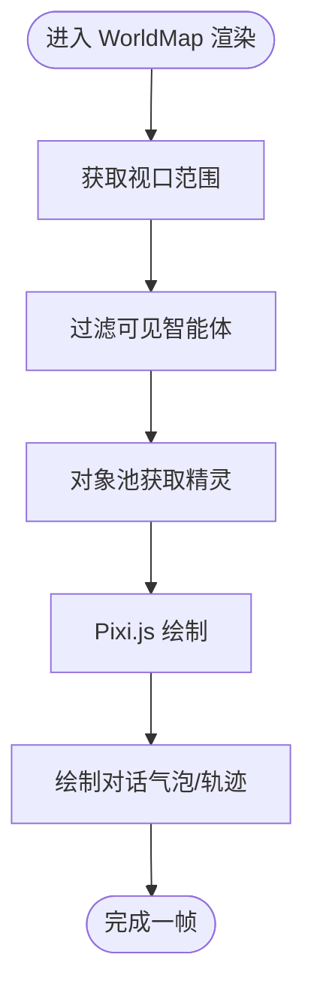

**图表来源**
- [前端规格说明](file://specs/07-frontend.spec.md#L485-L540)

**章节来源**
- [前端规格说明](file://specs/07-frontend.spec.md#L95-L125)
- [前端规格说明](file://specs/07-frontend.spec.md#L485-L540)

### 智能体精灵 AgentSprite
- 视觉：圆形头像（按性别/职业生成）、名字标签（悬停显示）、状态指示器（绿色/黄色/蓝色/灰色）、情绪图标、移动轨迹线。
- 交互：onClick回调，触发选中与地图跟随。

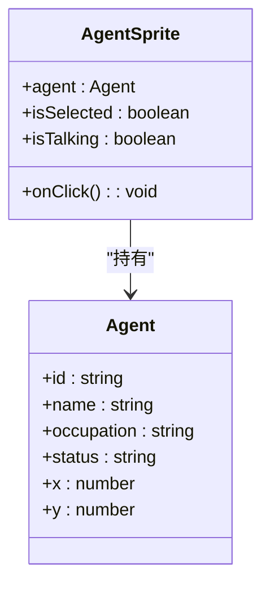

**图表来源**
- [前端规格说明](file://specs/07-frontend.spec.md#L127-L147)

**章节来源**
- [前端规格说明](file://specs/07-frontend.spec.md#L127-L147)

### 对话气泡 ChatBubble
- 视觉：白色圆角矩形、说话人名、内容、左下小三角指向、淡入淡出动画、情绪背景色微调。
- 生命周期：按持续时间显示，完成后淡出并回收。

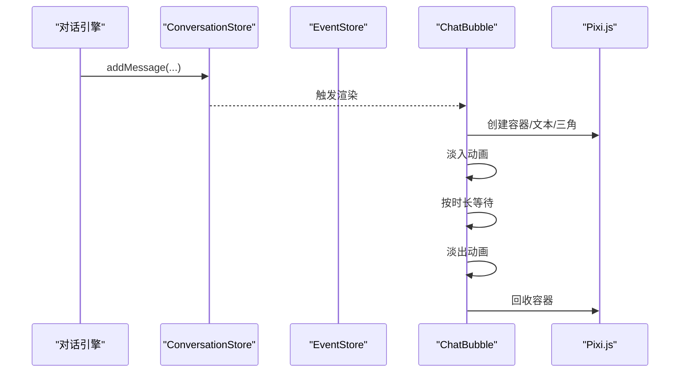

**图表来源**
- [前端规格说明](file://specs/07-frontend.spec.md#L149-L171)

**章节来源**
- [前端规格说明](file://specs/07-frontend.spec.md#L149-L171)

### 智能体列表面板 AgentListPanel
- 功能：搜索框（按名字）、筛选器（职业/状态）、列表项（头像/姓名+职业/当前位置/当前状态/想法/状态指示器）、点击选中并联动地图。

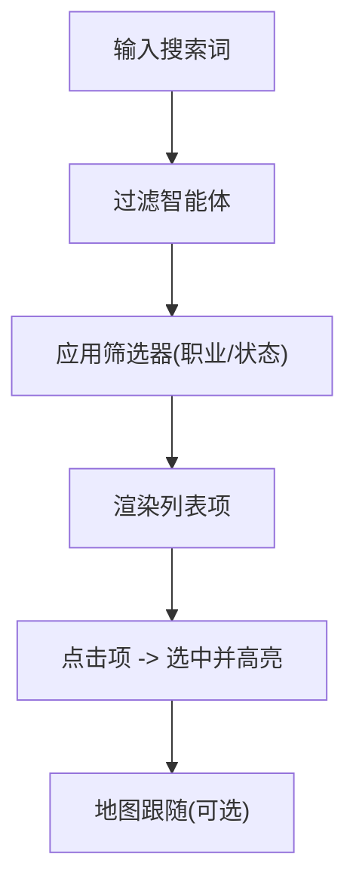

**图表来源**
- [前端规格说明](file://specs/07-frontend.spec.md#L173-L202)

**章节来源**
- [前端规格说明](file://specs/07-frontend.spec.md#L173-L202)

### 智能体详情面板 AgentDetailPanel
- 布局：头像、姓名/年龄/职业、性格维度（进度条）、状态指标（能量/社交/幸福/余额）、社交关系、最近记忆。

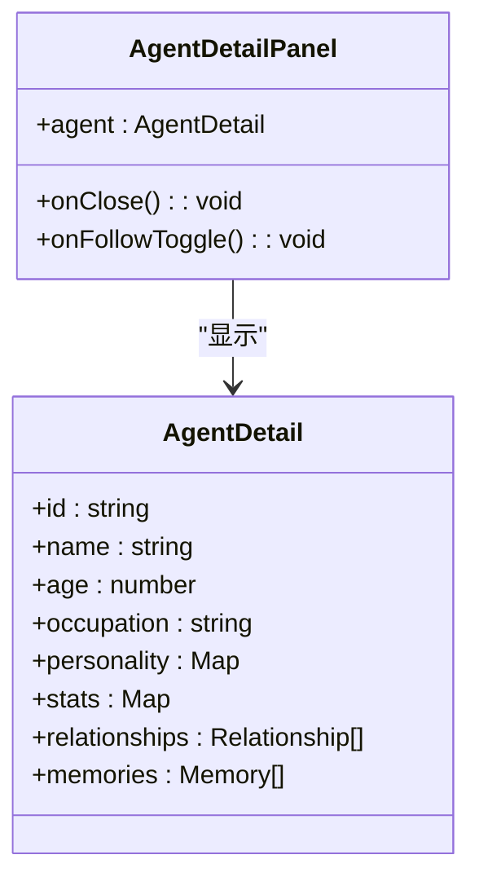

**图表来源**
- [前端规格说明](file://specs/07-frontend.spec.md#L204-L239)

**章节来源**
- [前端规格说明](file://specs/07-frontend.spec.md#L204-L239)

### 实时事件流 EventStream
- 功能：实时滚动（新事件自动顶部）、点击事件跳转到相关智能体/位置、按类型筛选、暂停滚动（鼠标悬停时）。
- 数据来源：WebSocket订阅，事件类型包括对话、移动、关系变化、系统消息等。

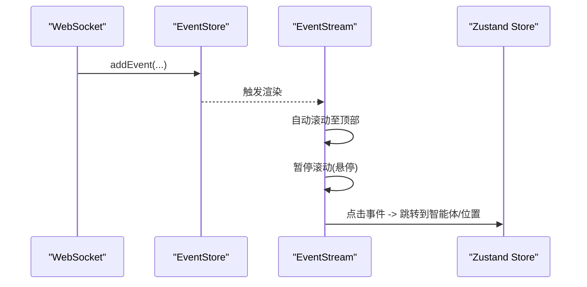

**图表来源**
- [前端规格说明](file://specs/07-frontend.spec.md#L241-L267)

**章节来源**
- [前端规格说明](file://specs/07-frontend.spec.md#L241-L267)

### 统计面板 StatsPanel 与社交网络图 SocialNetworkGraph
- StatsPanel：人口统计、职业分布饼图、活跃对话数、今日对话总数、热门地点、经济指标。
- SocialNetworkGraph：力导向图，节点大小=社交连接数，边粗细=关系强度，支持拖拽、缩放、悬停详情、点击节点选中。

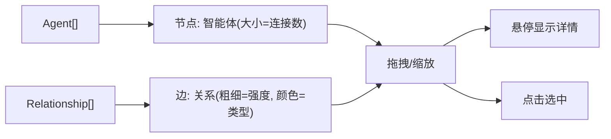

**图表来源**
- [前端规格说明](file://specs/07-frontend.spec.md#L269-L300)

**章节来源**
- [前端规格说明](file://specs/07-frontend.spec.md#L269-L300)

## 依赖关系分析
- 组件依赖：TopBar依赖Zustand管理的时间与控制状态；WorldMap依赖Zustand的Agent与Location数据；AgentListPanel与AgentDetailPanel依赖AgentStore；EventStream依赖EventStore；StatsPanel与SocialNetworkGraph依赖Agent与Relationship数据。
- 外部依赖：WebSocket用于实时数据订阅；Pixi.js用于高性能2D渲染；TailwindCSS用于样式与响应式；Recharts用于统计图表。
- 状态管理：Zustand Store将世界时间、智能体、事件、对话等状态集中管理，避免深层props传递与重复渲染。

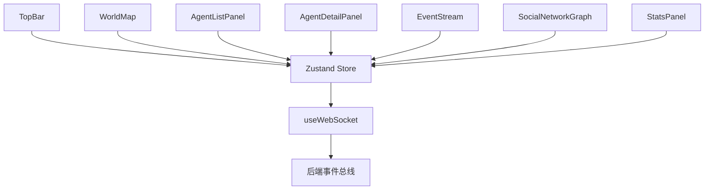

**图表来源**
- [前端规格说明](file://specs/07-frontend.spec.md#L302-L358)
- [前端规格说明](file://specs/07-frontend.spec.md#L360-L407)

**章节来源**
- [前端规格说明](file://specs/07-frontend.spec.md#L302-L358)
- [前端规格说明](file://specs/07-frontend.spec.md#L360-L407)

## 性能考量
- 渲染优化：
  - 可见区域裁剪：仅渲染视口范围内的智能体，减少绘制开销。
  - 对象池：精灵复用，避免频繁创建销毁。
  - 批量更新：使用requestAnimationFrame合并状态更新，降低抖动。
- 内存优化：
  - 事件历史限制：限制最大事件数，移除最旧事件。
  - 气泡数量限制：限制同时可见气泡数量，避免过度渲染。
- 动画与交互：
  - 智能体移动使用缓动函数与requestAnimationFrame，保证60fps。
  - 对话气泡淡入淡出使用时间插值，平滑过渡。
- 响应式与跨浏览器：
  - TailwindCSS提供移动端优先的响应式断点与通用样式。
  - Pixi.js在现代浏览器中提供稳定的WebGL加速，需关注Canvas兼容性与像素比设置。

**章节来源**
- [前端规格说明](file://specs/07-frontend.spec.md#L485-L540)
- [前端规格说明](file://specs/07-frontend.spec.md#L409-L484)

## 故障排查指南
- WebSocket连接失败：
  - 检查后端WebSocket端点可达性与订阅通道。
  - 确认前端useWebSocket Hook中的URL与订阅消息格式。
- Pixi.js渲染异常：
  - 检查Canvas尺寸与像素比设置，确保在高DPI显示器上正确缩放。
  - 确认精灵纹理加载与图层顺序。
- 性能下降：
  - 检查是否启用可见区域裁剪与对象池。
  - 减少同时可见气泡数量与事件历史长度。
- 事件流不更新：
  - 确认事件类型映射与store动作调用链路。
  - 检查自动滚动与暂停滚动的交互逻辑。

**章节来源**
- [前端规格说明](file://specs/07-frontend.spec.md#L360-L407)
- [前端规格说明](file://specs/07-frontend.spec.md#L485-L540)

## 结论
AI Society前端系统以“观察为主”的理念为核心，结合React组件化、Zustand状态管理与Pixi.js高性能渲染，实现了60fps的实时世界观察体验。通过严格的性能优化策略与清晰的组件职责划分，系统在复杂场景下仍能保持流畅与稳定。配合TailwindCSS与Recharts，界面简洁优雅且信息密度高，满足研究者与观察者的长期观看需求。

## 附录

### 组件使用示例与最佳实践
- 世界地图渲染：在WorldMap中传入width/height、locations、agents、conversations与点击回调，确保视口参数与数据同步。
- 智能体选中：在AgentListPanel中监听onSelectAgent，触发Zustand的selectAgent动作，并在WorldMap中高亮对应AgentSprite。
- 实时事件：在EventStream中设置filter与onFilterChange，结合EventStore的addEvent与clearEvents进行事件管理。
- 统计与社交图：在StatsPanel中传入WorldStats，在SocialNetworkGraph中传入agents与relationships，确保节点与边的数据一致性。

**章节来源**
- [前端规格说明](file://specs/07-frontend.spec.md#L95-L300)

### 自定义配置与主题定制
- 主题变量：通过CSS自定义属性定义主色、状态色、中性色与情绪色，确保全局一致性。
- 响应式断点：依据大屏/中屏/小屏调整地图与面板占比，小屏支持面板折叠。
- 字体与排版：使用Tailwind的字体与间距工具类，保证在不同设备上的可读性。

**章节来源**
- [前端规格说明](file://specs/07-frontend.spec.md#L64-L71)
- [前端规格说明](file://specs/07-frontend.spec.md#L565-L592)

### 部署配置与构建流程
- 构建工具：Vite提供快速开发与生产打包能力，支持TypeScript与静态资源处理。
- 静态资源：精灵图、地图纹理与UI九宫格气泡位于public/assets，确保路径正确。
- 环境变量：通过.env或构建时注入的环境变量配置WebSocket地址与API端点。
- 容器化：参考实施计划中的Dockerfile与docker-compose.yml，实现一键启动与部署。

**章节来源**
- [前端规格说明](file://specs/07-frontend.spec.md#L594-L649)
- [实施计划规格说明](file://specs/08-implementation-plan.spec.md#L375-L400)

### 性能监控建议
- 帧率监控：使用浏览器开发者工具的Performance面板与FPS计数器，确保60fps稳定。
- 内存占用：定期检查内存快照，确认对象池与事件历史长度未导致泄漏。
- 网络延迟：监控WebSocket延迟与事件到达时间，优化订阅与渲染节流。
- 渲染热点：使用Pixi.js的统计信息与浏览器GPU分析工具，识别绘制瓶颈。

**章节来源**
- [系统架构规格说明](file://specs/01-architecture.spec.md#L238-L248)