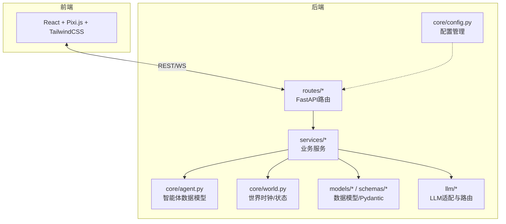
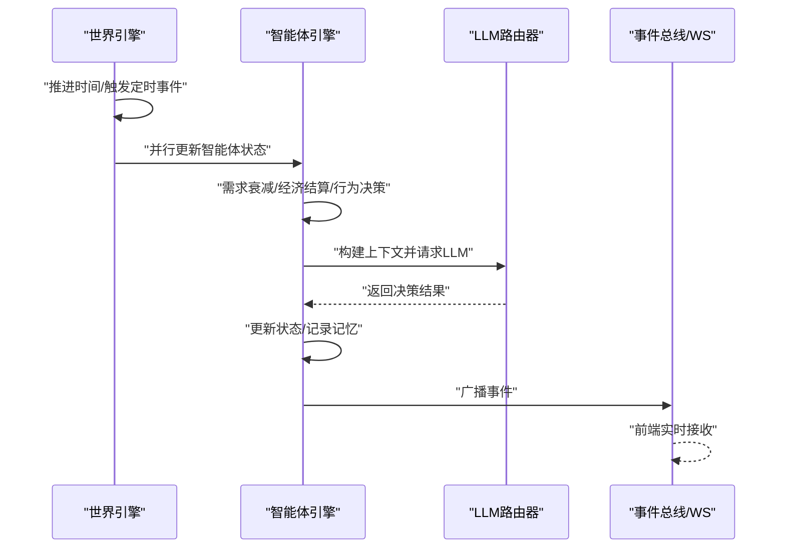
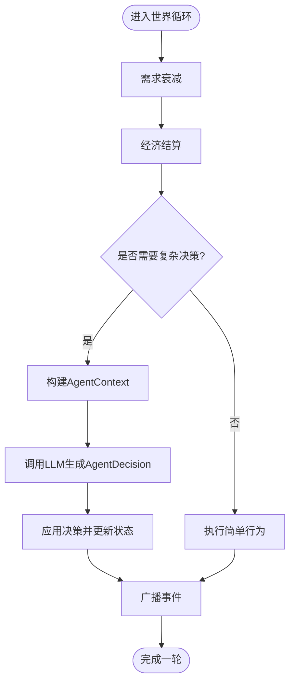
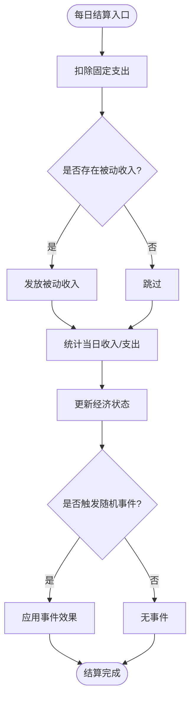
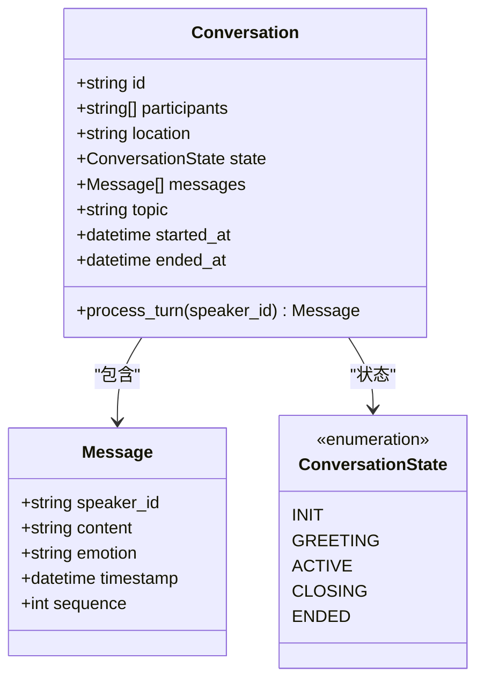
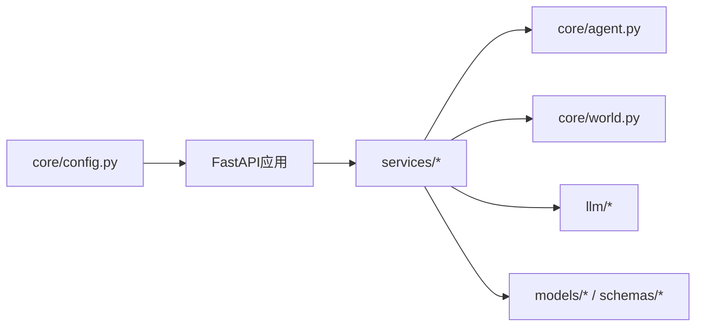

# 代码规范与最佳实践

<cite>
**本文引用的文件**
- [backend/app/core/agent.py](file://backend/app/core/agent.py)
- [backend/app/core/world.py](file://backend/app/core/world.py)
- [backend/app/core/config.py](file://backend/app/core/config.py)
- [specs/00-project-overview.spec.md](file://specs/00-project-overview.spec.md)
- [specs/01-architecture.spec.md](file://specs/01-architecture.spec.md)
- [specs/03-economy-system.spec.md](file://specs/03-economy-system.spec.md)
- [specs/04-conversation-system.spec.md](file://specs/04-conversation-system.spec.md)
</cite>

## 目录
1. [简介](#简介)
2. [项目结构](#项目结构)
3. [核心组件](#核心组件)
4. [架构总览](#架构总览)
5. [详细组件分析](#详细组件分析)
6. [依赖分析](#依赖分析)
7. [性能考虑](#性能考虑)
8. [故障排查指南](#故障排查指南)
9. [结论](#结论)
10. [附录](#附录)

## 简介
本指南面向AI Society项目，旨在建立统一的Python代码风格、命名约定、注释规范与最佳实践；明确FastAPI路由设计原则、数据模型定义规范与错误处理模式；规范智能体行为代码组织方式、经济系统算法实现规范与对话系统消息格式标准；提供代码审查检查清单、性能优化建议与安全编码实践，并给出具体“示例/反例”路径指引，帮助团队在保持高质量的同时提升协作效率与可维护性。

## 项目结构
- 后端采用分层与领域驱动相结合的组织方式：
  - core层：世界时钟、智能体状态与决策、配置管理等核心领域对象
  - routes层：FastAPI路由（示例：world、agents、stream）
  - services层：业务服务（示例：world_service、agent_service、chat_service、spawn_service）
  - models/schemas层：数据库模型与Pydantic模型
  - llm层：多模型适配与路由
  - data：初始数据与配置
- 前后端分离，前端使用React/Pixi.js/TailwindCSS，后端使用FastAPI，通过REST与WebSocket交互

**图表来源**
- [specs/01-architecture.spec.md](file://specs/01-architecture.spec.md#L92-L169)
- [backend/app/core/agent.py](file://backend/app/core/agent.py#L1-L92)
- [backend/app/core/world.py](file://backend/app/core/world.py#L1-L40)
- [backend/app/core/config.py](file://backend/app/core/config.py#L1-L42)

**章节来源**
- [specs/01-architecture.spec.md](file://specs/01-architecture.spec.md#L92-L169)

## 核心组件
- 智能体数据模型：使用dataclass定义Personality、Needs、Economy、AgentState、AgentDecision、AgentContext，确保字段清晰、默认值合理、类型标注完整
- 世界引擎：WorldClock负责时间推进与缩放；WorldState聚合clock与agents，支持后续替换为数据库/缓存
- 配置管理：Settings集中管理环境、数据库、Redis、向量库、LLM提供商与密钥，配合lru_cache缓存

**章节来源**
- [backend/app/core/agent.py](file://backend/app/core/agent.py#L9-L92)
- [backend/app/core/world.py](file://backend/app/core/world.py#L8-L40)
- [backend/app/core/config.py](file://backend/app/core/config.py#L7-L42)

## 架构总览
- 后端基于FastAPI，具备类型安全、异步原生与自动生成文档的优势
- 世界循环每游戏内10分钟推进一次，包含时间推进、智能体更新、社交互动与事件广播
- LLM调用通过LLMRouter路由至对应适配器，解析响应后执行决策并广播事件

**图表来源**
- [specs/01-architecture.spec.md](file://specs/01-architecture.spec.md#L171-L220)

**章节来源**
- [specs/01-architecture.spec.md](file://specs/01-architecture.spec.md#L171-L220)

## 详细组件分析

### Python代码风格与命名规范
- 文件与模块
  - 模块名使用小写与下划线，避免混合大小写
  - 包含__init__.py的包保持简洁，仅暴露必要接口
- 类与数据类
  - dataclass优先用于纯数据载体，字段带类型注解，必要时提供默认工厂
  - 普通类使用驼峰命名，dataclass使用帕斯卡命名
- 函数与方法
  - 函数名使用小写下划线，动宾结构，语义明确
  - 方法参数顺序：self/cls在首位，必填参数在前，可选参数在后
- 常量与枚举
  - 常量全大写+下划线；枚举继承str与Enum，值为小写字符串
- 变量
  - 使用语义化名称，避免缩写；复数形式用于集合
- 注释与文档
  - 模块顶部简述职责；类/函数提供docstring，描述输入、输出、异常与边界条件
  - 复杂逻辑处添加行内注释，解释“为什么”而非“是什么”
- 导入顺序
  - 标准库、第三方库、项目内模块，组间空行分隔；同一组内字母序排列

**章节来源**
- [backend/app/core/agent.py](file://backend/app/core/agent.py#L1-L92)
- [backend/app/core/world.py](file://backend/app/core/world.py#L1-L40)
- [backend/app/core/config.py](file://backend/app/core/config.py#L1-L42)

### FastAPI路由设计原则
- 路由组织
  - routes/world.py、routes/agents.py、routes/stream.py分别承载世界、智能体与流式事件
  - 路由函数职责单一，尽量无副作用，将业务逻辑下沉到services层
- 请求/响应
  - 使用Pydantic模型定义请求体与响应体，确保类型安全与自动校验
  - 明确HTTP状态码与错误响应结构，便于前端统一处理
- 异步与并发
  - 使用async def定义异步路由；对IO密集操作（如LLM调用、数据库访问）使用await
  - 对CPU密集操作考虑异步池或后台任务
- 中间件与依赖注入
  - 通过Depends注入配置与服务实例，减少重复代码
- 文档与测试
  - 为每个路由提供summary/description；结合pytest编写单元/集成测试

**章节来源**
- [specs/01-architecture.spec.md](file://specs/01-architecture.spec.md#L117-L120)

### 数据模型定义规范
- Pydantic模型
  - 字段显式声明类型与默认值；必要时使用Field()指定序列化/校验规则
  - 使用BaseModel子类，避免在模型中嵌套复杂逻辑
- 数据库模型
  - 使用SQLAlchemy 2.0 ORM，字段与Pydantic模型保持一致或提供映射层
  - 主键、外键、索引、唯一约束清晰标注；JSON字段注意序列化/反序列化
- 模型演进
  - 通过Alembic管理迁移；新增字段需提供默认值或nullable策略

**章节来源**
- [specs/01-architecture.spec.md](file://specs/01-architecture.spec.md#L121-L128)

### 错误处理模式
- 统一异常体系
  - 定义业务异常与通用HTTP异常，前者用于业务语义，后者映射到标准HTTP状态码
- 路由层捕获
  - 在路由层捕获异常并返回标准化错误响应，包含错误码、消息与可选详情
- 服务层校验
  - 在服务层前置校验输入参数与业务规则，失败即抛出业务异常
- 日志与追踪
  - 记录异常堆栈与请求ID，便于问题定位与审计

**章节来源**
- [specs/01-architecture.spec.md](file://specs/01-architecture.spec.md#L117-L120)

### 智能体行为代码组织方式
- 行为分类
  - 简单行为（规则驱动）：如需求衰减、基础经济结算
  - 复杂行为（LLM驱动）：如对话生成、人生规划
- 上下文构建
  - AgentContext收集世界时间、地点、附近智能体摘要、近期记忆，作为LLM提示词输入
- 决策输出
  - AgentDecision包含action、target、reason、thinking，便于回溯与可视化
- 并行更新
  - 世界循环中并行处理所有智能体，避免阻塞；对共享资源使用锁或事件总线

**图表来源**
- [specs/01-architecture.spec.md](file://specs/01-architecture.spec.md#L171-L196)
- [backend/app/core/agent.py](file://backend/app/core/agent.py#L78-L92)

**章节来源**
- [backend/app/core/agent.py](file://backend/app/core/agent.py#L48-L92)
- [specs/01-architecture.spec.md](file://specs/01-architecture.spec.md#L171-L196)

### 经济系统算法实现规范
- 收入计算
  - 基于职业时薪与技能加成、心情修正，保留两位小数
- 支出结算
  - 每日固定支出自动扣除；被动收入按职业发放
- 经济状态分级
  - 根据余额阈值划分状态，状态影响消费意愿、工作动机与压力水平
- 随机事件
  - 奖金、医疗、运气红包、手机损坏等事件按概率触发，影响余额与广播事件
- 社交经济互动
  - 借钱与请客逻辑需检查关系强度与经济状况，记录债务关系并广播事件

**图表来源**
- [specs/03-economy-system.spec.md](file://specs/03-economy-system.spec.md#L94-L109)

**章节来源**
- [specs/03-economy-system.spec.md](file://specs/03-economy-system.spec.md#L16-L157)

### 对话系统消息格式标准
- 对话触发
  - 基于距离、停留时长、关系亲疏、外向性与社交需求计算开启概率
- 消息结构
  - Message包含speaker_id、content、emotion、timestamp、sequence等字段
- 对话状态机
  - ConversationState包含init/greeting/active/closing/ended，支持最小/最大轮次与超时控制
- 情绪与话题
  - 情绪关键词检测与话题提取辅助关系变化与记忆重要性评估
- 群体对话
  - @提及解析与轮流发言策略，优先被@者、外向者与最久未发言者

**图表来源**
- [specs/04-conversation-system.spec.md](file://specs/04-conversation-system.spec.md#L193-L240)

**章节来源**
- [specs/04-conversation-system.spec.md](file://specs/04-conversation-system.spec.md#L14-L96)
- [specs/04-conversation-system.spec.md](file://specs/04-conversation-system.spec.md#L100-L188)
- [specs/04-conversation-system.spec.md](file://specs/04-conversation-system.spec.md#L242-L296)
- [specs/04-conversation-system.spec.md](file://specs/04-conversation-system.spec.md#L298-L374)
- [specs/04-conversation-system.spec.md](file://specs/04-conversation-system.spec.md#L441-L504)

## 依赖分析
- 模块耦合
  - world.py通过dataclass引用agent.py中的AgentState，避免循环导入
  - config.py提供全局Settings与缓存，供路由与服务层按需注入
- 外部依赖
  - FastAPI、SQLAlchemy 2.0、Pydantic、APScheduler、Redis、Qdrant等
- 接口契约
  - LLMRouter统一多模型调用接口；AgentEngine与ChatEngine通过事件总线解耦

**图表来源**
- [specs/01-architecture.spec.md](file://specs/01-architecture.spec.md#L92-L169)
- [backend/app/core/config.py](file://backend/app/core/config.py#L39-L42)
- [backend/app/core/world.py](file://backend/app/core/world.py#L38-L40)

**章节来源**
- [backend/app/core/world.py](file://backend/app/core/world.py#L38-L40)
- [backend/app/core/config.py](file://backend/app/core/config.py#L39-L42)

## 性能考虑
- 世界循环节拍
  - 控制每轮处理时间，避免超过10分钟（现实）的上限；对CPU密集逻辑拆分批次
- 并行与异步
  - 智能体更新并行化；LLM调用使用异步与连接池；WebSocket广播采用批量推送
- 缓存与索引
  - 使用Redis缓存热点数据；为常用查询建立索引；对向量检索设置合理分页
- 内存与GC
  - 避免大对象频繁分配；及时清理无用引用；监控内存占用不超过2GB目标
- API与WS
  - 控制API响应时间小于100ms；WebSocket延迟小于50ms；限制LLM调用频率（每智能体每10分钟最多1次）

**章节来源**
- [specs/01-architecture.spec.md](file://specs/01-architecture.spec.md#L238-L248)

## 故障排查指南
- 配置问题
  - 确认环境变量与Settings加载正确；检查数据库URL、Redis与向量库地址
- 时间同步
  - 核对WorldClock的time_scale与UTC偏移；验证世界时间与现实时间比值
- LLM调用
  - 检查模型别名与API密钥；确认LLMRouter路由正确；解析响应格式与合法性
- 事件广播
  - 确保EventBus正常运行；WebSocket连接健康；前端事件流面板可订阅

**章节来源**
- [backend/app/core/config.py](file://backend/app/core/config.py#L7-L42)
- [backend/app/core/world.py](file://backend/app/core/world.py#L8-L21)

## 结论
本指南从风格、架构、模型、行为、经济与对话六大维度给出了统一规范与最佳实践，结合AI Society项目的实际实现与规格说明，既保证工程稳定性，又兼顾扩展性与可观测性。建议在代码评审中逐条对照检查，并在CI中引入静态检查与测试覆盖率门槛，持续提升代码质量。

## 附录

### 代码审查检查清单
- 风格与命名
  - 是否遵循文件/类/函数/变量命名规范
  - docstring是否完整，注释是否解释“为什么”
- 类型与模型
  - dataclass/Pydantic模型字段是否完整且类型正确
  - 数据库模型与ORM字段映射是否一致
- 路由与服务
  - 路由职责是否单一；服务层是否承担业务逻辑
  - 异步与并发是否正确使用
- 错误处理
  - 是否统一异常体系；错误响应是否标准化
- 性能与安全
  - 是否避免N+1查询；是否使用参数化查询防止注入
  - 是否限制输入大小与频率；是否记录必要的审计日志

### 示例/反例路径指引
- 智能体数据模型
  - 示例：Personality、Needs、Economy、AgentState、AgentDecision、AgentContext的字段与默认值
  - 反例：缺失类型注解、默认值不合理、字段过多导致难以维护
  - 参考路径：[backend/app/core/agent.py](file://backend/app/core/agent.py#L25-L92)
- 世界时钟
  - 示例：WorldClock.now根据现实时间推导世界时间
  - 反例：未考虑时区与缩放比例导致时间错乱
  - 参考路径：[backend/app/core/world.py](file://backend/app/core/world.py#L16-L21)
- 配置管理
  - 示例：Settings集中管理环境、数据库、Redis、向量库与LLM提供商
  - 反例：硬编码敏感信息、未使用缓存导致重复初始化
  - 参考路径：[backend/app/core/config.py](file://backend/app/core/config.py#L7-L42)
- 经济系统
  - 示例：收入计算、每日结算、经济状态分级与随机事件
  - 反例：未考虑技能加成与心情修正、事件概率不一致
  - 参考路径：[specs/03-economy-system.spec.md](file://specs/03-economy-system.spec.md#L33-L109)
- 对话系统
  - 示例：对话触发概率、消息结构、状态机与情绪/话题分析
  - 反例：未考虑关系修正与外向性影响、群聊轮流发言策略缺失
  - 参考路径：[specs/04-conversation-system.spec.md](file://specs/04-conversation-system.spec.md#L55-L96)