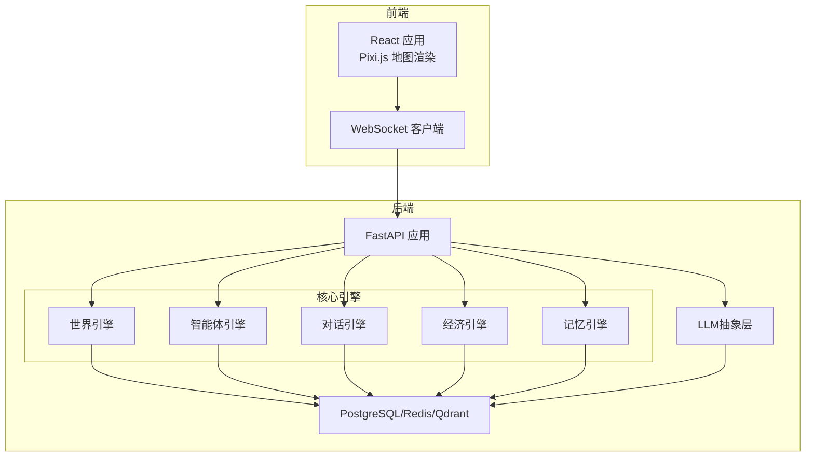
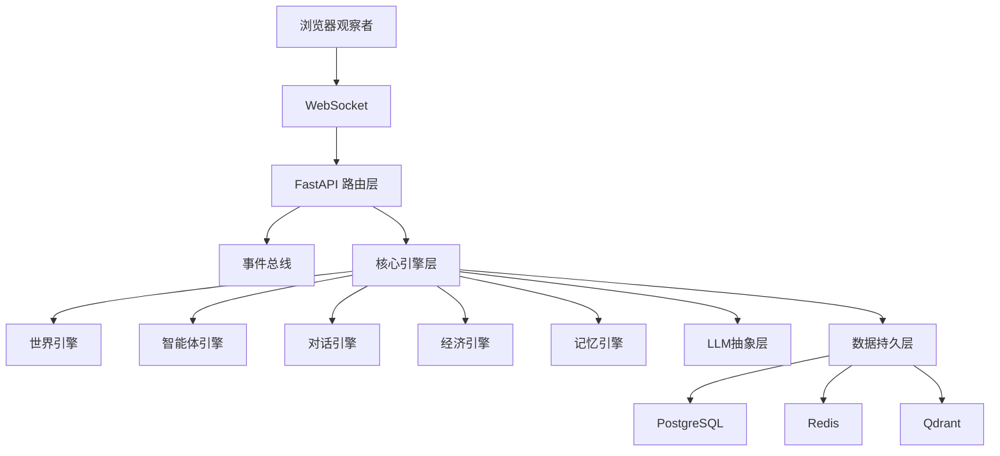
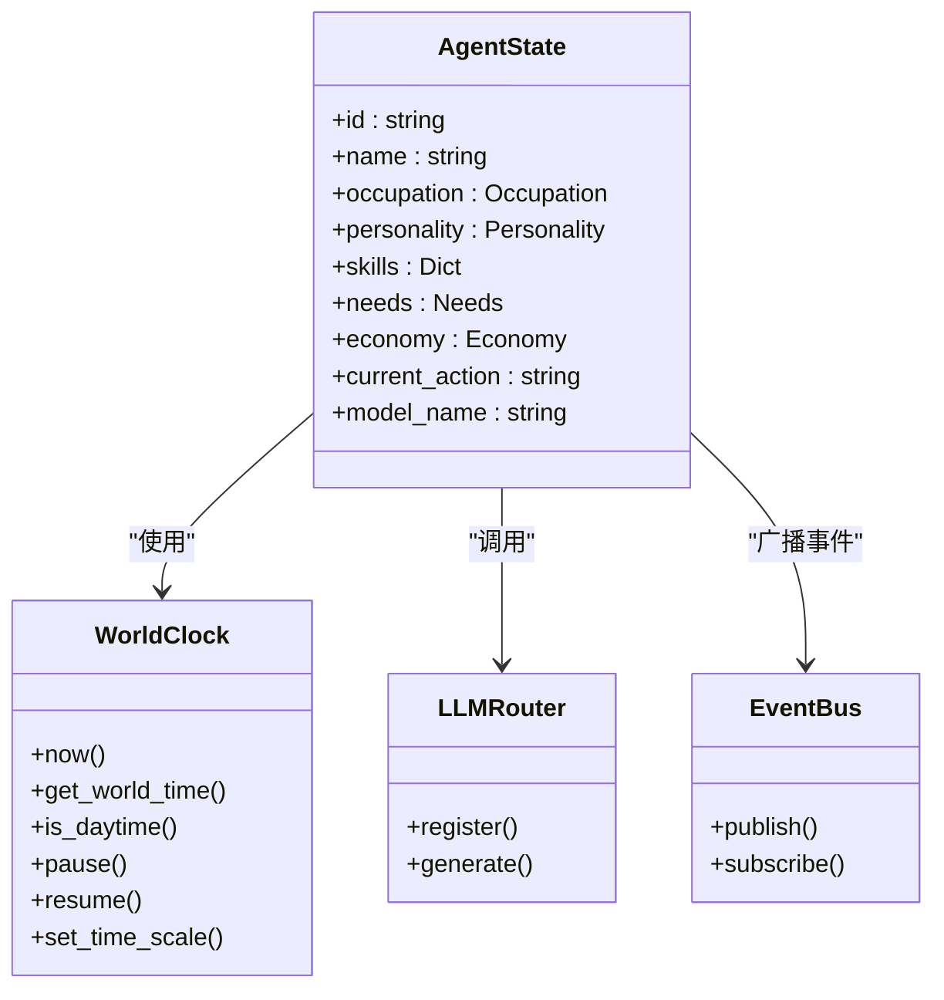
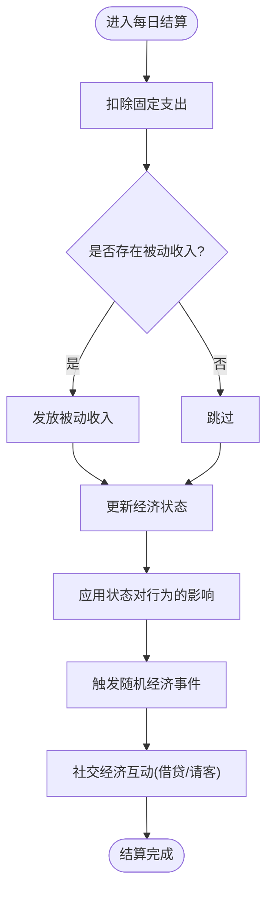
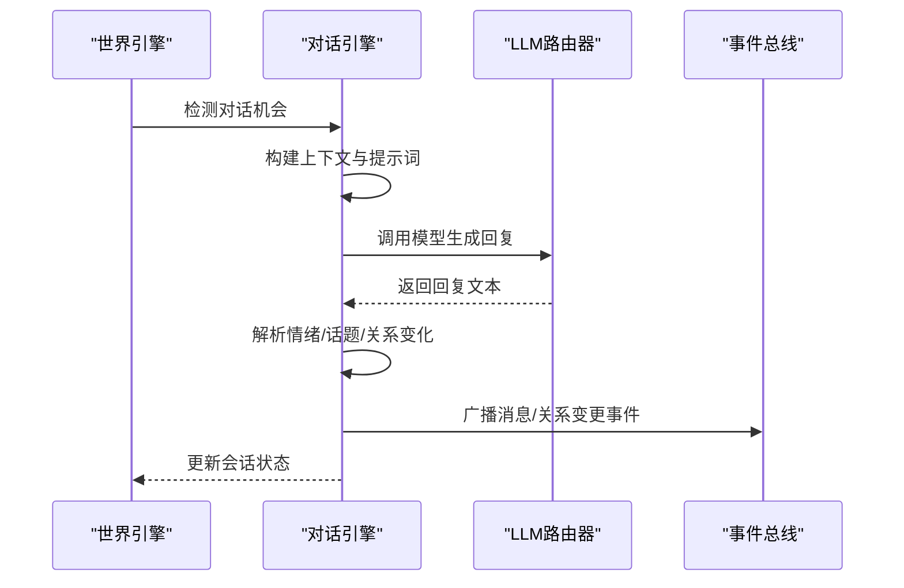
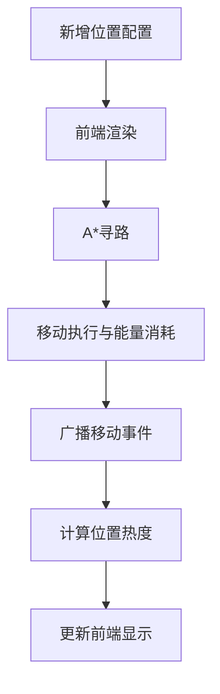
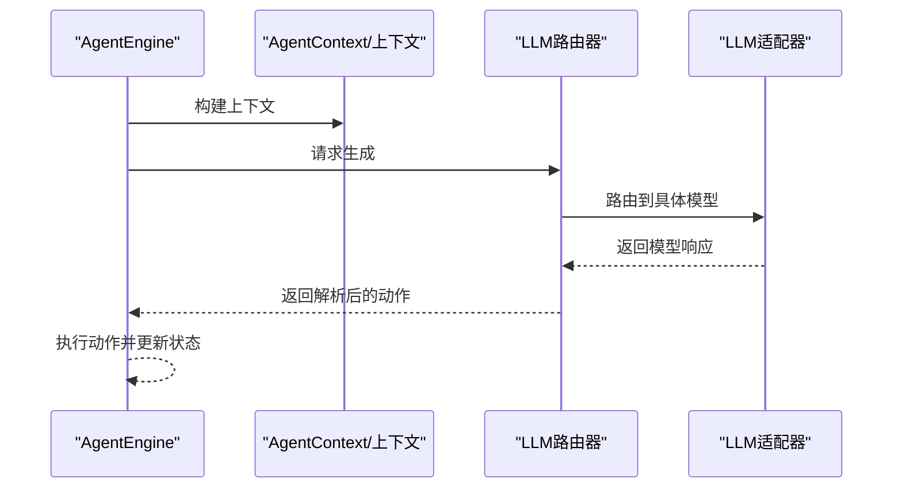
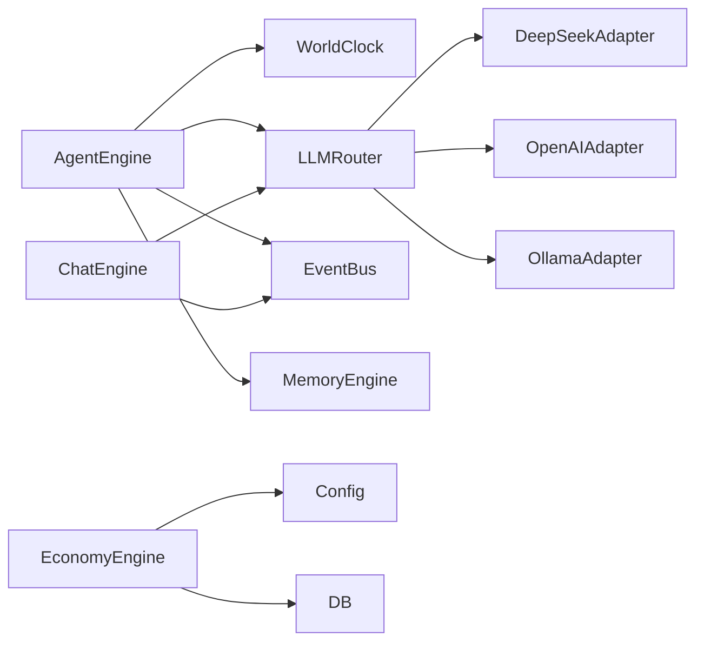

# 功能开发流程

<cite>
**本文引用的文件**
- [项目概述.spec.md](file://specs/00-project-overview.spec.md)
- [系统架构.spec.md](file://specs/01-architecture.spec.md)
- [智能体系统.spec.md](file://specs/02-agent-system.spec.md)
- [经济系统.spec.md](file://specs/03-economy-system.spec.md)
- [对话系统.spec.md](file://specs/04-conversation-system.spec.md)
- [世界与地图.spec.md](file://specs/05-world-map.spec.md)
- [API设计.spec.md](file://specs/06-api-design.spec.md)
- [前端.spec.md](file://specs/07-frontend.spec.md)
- [实施计划.spec.md](file://specs/08-implementation-plan.spec.md)
- [agent.py](file://backend/app/core/agent.py)
- [world.py](file://backend/app/core/world.py)
- [config.py](file://backend/app/core/config.py)
</cite>

## 目录
1. [简介](#简介)
2. [项目结构](#项目结构)
3. [核心组件](#核心组件)
4. [架构总览](#架构总览)
5. [详细组件分析](#详细组件分析)
6. [依赖分析](#依赖分析)
7. [性能考虑](#性能考虑)
8. [故障排查指南](#故障排查指南)
9. [结论](#结论)
10. [附录](#附录)

## 简介
本指南面向AI Society项目的“新功能开发流程与实施”，覆盖从需求分析到功能上线的完整生命周期，重点包括：
- 智能体系统扩展开发
- 经济模型定制实现
- 对话机制增强
- 地图扩展开发
- 行为定制实现
- LLM模型集成
- 功能设计文档模板
- 开发任务分解方法
- 代码评审标准
- 版本管理与发布流程

目标是帮助团队在保持低耦合、可扩展性的前提下，高质量地交付功能。

## 项目结构
项目采用前后端分离架构，后端基于FastAPI，前端基于React + Pixi.js，核心模块位于backend/app下，规格文档位于specs目录，形成“文档驱动开发”的闭环。

**图示来源**
- [系统架构.spec.md](file://specs/01-architecture.spec.md#L1-L255)

**章节来源**
- [系统架构.spec.md](file://specs/01-architecture.spec.md#L99-L176)

## 核心组件
- 配置管理：集中管理时间缩放、预算、模型、数据库、Redis、Qdrant等配置项，支持环境变量覆盖。
- 世界时钟：提供时间缩放、时间段判定、暂停/恢复、事件广播。
- 智能体数据结构：包含身份、需求、经济、记忆索引、当前行为与思考、所用模型等。
- LLM抽象层：统一适配器接口与路由器，支持多模型路由与成本控制。
- 对话引擎：触发检测、会话管理、提示词模板、情绪与话题分析、关系影响。
- 经济引擎：收入/支出、状态分级、随机事件、借贷与请客等社交经济互动。
- 记忆引擎：对话记忆存储与检索，重要性评分与向量化存储。
- 世界与地图：区域布局、寻路算法、时间系统、位置状态与热度。

**章节来源**
- [config.py](file://backend/app/core/config.py#L1-L175)
- [world.py](file://backend/app/core/world.py#L73-L292)
- [agent.py](file://backend/app/core/agent.py#L25-L92)
- [系统架构.spec.md](file://specs/01-architecture.spec.md#L229-L244)

## 架构总览
后端采用“核心引擎层 + LLM抽象层 + 数据持久层”的分层设计，事件总线贯穿各引擎，WebSocket向前端推送实时事件流；前端以React + Pixi.js渲染地图与UI，Zustand管理状态，Recharts展示统计。

**图示来源**
- [系统架构.spec.md](file://specs/01-architecture.spec.md#L1-L57)

## 详细组件分析

### 智能体系统扩展开发
- 扩展点
  - 新增职业/性别/技能：在智能体数据结构中扩展枚举与字段。
  - 新增行为类型：在AgentEngine中扩展决策分支与执行逻辑。
  - 新增提示词模板：在LLM抽象层中新增模板并注册。
- 开发流程
  1) 需求分析与规格评审 → 2) 设计数据模型与提示词 → 3) 实现AgentEngine决策分支 → 4) 实现行为执行与事件广播 → 5) 单元测试与集成测试 → 6) 文档与规格更新 → 7) 代码评审 → 8) 合入主干与发布。
- 关键接口
  - AgentState：承载智能体状态与上下文。
  - WorldClock：提供时间信息与时间段判定。
  - LLMRouter：按模型名路由到对应适配器。
  - EventBus：事件发布订阅。

**图示来源**
- [agent.py](file://backend/app/core/agent.py#L25-L92)
- [world.py](file://backend/app/core/world.py#L73-L292)
- [系统架构.spec.md](file://specs/01-architecture.spec.md#L205-L227)

**章节来源**
- [agent.py](file://backend/app/core/agent.py#L25-L92)
- [world.py](file://backend/app/core/world.py#L73-L292)
- [系统架构.spec.md](file://specs/01-architecture.spec.md#L229-L244)

### 经济模型定制实现
- 定制维度
  - 收入体系：职业时薪/日薪/月薪、技能加成、心情修正。
  - 支出体系：固定日均开销、可选消费、被动收入。
  - 经济状态：富裕/稳定/紧张/拮据/负债，对行为与情绪的影响。
  - 随机事件：奖金、医疗、红包、手机损坏等。
  - 社交经济：借贷、请客等互动。
- 实施步骤
  1) 在配置文件中新增/调整参数 → 2) 实现或调整经济结算逻辑 → 3) 更新经济状态与行为影响映射 → 4) 新增/调整数据库模型与迁移 → 5) 编写单元测试与集成测试 → 6) 文档与规格更新 → 7) 代码评审 → 8) 合入主干与发布。

**图示来源**
- [经济系统.spec.md](file://specs/03-economy-system.spec.md#L91-L109)

**章节来源**
- [经济系统.spec.md](file://specs/03-economy-system.spec.md#L16-L157)

### 对话机制增强
- 增强方向
  - 触发机制：距离/时长/关系/主动搭讪/工作场景/约定见面。
  - 生成策略：开场白/回复提示词模板、轮次控制、结束条件。
  - 分析能力：情绪检测、话题提取、关系影响计算。
  - 群体对话：多人聚集触发、轮流发言、@提及。
- 实施步骤
  1) 评估现有触发与生成逻辑 → 2) 扩展提示词模板与解析器 → 3) 实现群聊与@功能 → 4) 增强情绪与话题分析 → 5) 新增数据库模型与迁移 → 6) 编写测试 → 7) 文档与规格更新 → 8) 代码评审 → 9) 合入主干与发布。

**图示来源**
- [对话系统.spec.md](file://specs/04-conversation-system.spec.md#L200-L240)
- [系统架构.spec.md](file://specs/01-architecture.spec.md#L205-L227)

**章节来源**
- [对话系统.spec.md](file://specs/04-conversation-system.spec.md#L12-L188)

### 地图扩展开发流程
- 扩展内容
  - 新增区域与位置：在配置文件中添加位置信息，前端自动渲染。
  - 导航系统：A*寻路、移动执行、能量消耗、事件广播。
  - 时间系统：定时事件（日出/日落/发工资/日结）。
  - 热度系统：基于占用率、时间修正、近期活动的热度计算。
- 实施步骤
  1) 设计区域布局与位置配置 → 2) 实现/调整寻路与移动逻辑 → 3) 新增定时事件与广播 → 4) 实现热度计算与前端渲染 → 5) 编写测试 → 6) 文档与规格更新 → 7) 代码评审 → 8) 合入主干与发布。

**图示来源**
- [世界与地图.spec.md](file://specs/05-world-map.spec.md#L335-L419)

**章节来源**
- [世界与地图.spec.md](file://specs/05-world-map.spec.md#L30-L329)

### 行为定制实现方法
- 方法论
  - 规则优先：紧急需求与日程使用规则引擎，降低LLM调用频率。
  - LLM辅助：复杂决策与创造性行为使用LLM，结合上下文与记忆。
  - 执行与反馈：行为执行后更新状态、记录记忆、广播事件。
- 实施步骤
  1) 识别可规则化的简单行为 → 2) 实现规则分支与执行 → 3) 识别需LLM的复杂行为 → 4) 设计提示词与解析 → 5) 集成到AgentEngine → 6) 编写测试 → 7) 文档与规格更新 → 8) 代码评审 → 9) 合入主干与发布。

**章节来源**
- [实施计划.spec.md](file://specs/08-implementation-plan.spec.md#L146-L203)

### LLM模型集成开发步骤
- 集成流程
  - 定义统一适配器接口 → 实现具体模型适配器（DeepSeek/可选OpenAI/Ollama） → 实现路由器按模型名路由 → 管理提示词模板 → 实施调用频率限制与成本统计 → 编写集成测试。
- 扩展新模型
  - 在LLM目录新增适配器文件 → 实现统一接口 → 在路由器中注册 → 更新配置与提示词模板 → 测试与文档更新。

**图示来源**
- [系统架构.spec.md](file://specs/01-architecture.spec.md#L205-L227)

**章节来源**
- [系统架构.spec.md](file://specs/01-architecture.spec.md#L229-L244)

## 依赖分析
- 组件耦合
  - AgentEngine依赖WorldClock、LLMRouter、EventBus、MemoryEngine。
  - 对话引擎依赖LLMRouter、EventBus、关系与记忆模块。
  - 经济引擎依赖配置与数据库模型。
- 外部依赖
  - LLM：DeepSeek、OpenAI、Claude、Ollama。
  - 数据库：PostgreSQL、Redis、Qdrant。
  - 前端：React、Pixi.js、Zustand、TailwindCSS、Recharts。

**图示来源**
- [系统架构.spec.md](file://specs/01-architecture.spec.md#L38-L98)

**章节来源**
- [系统架构.spec.md](file://specs/01-architecture.spec.md#L99-L176)

## 性能考虑
- 智能体并发：建议分批处理、降低决策频率、缓存热点数据。
- LLM调用：控制调用频率与成本，优先规则决策，必要时使用轻量模型。
- 前端渲染：仅渲染可见区域、精灵复用、对象池。
- 数据库：批量写入、索引优化、连接池配置。

**章节来源**
- [系统架构.spec.md](file://specs/01-architecture.spec.md#L245-L255)

## 故障排查指南
- 常见问题
  - LLM调用失败：检查API密钥、基础URL、重试与降级策略。
  - 性能瓶颈：检查决策频率、数据库查询、前端渲染范围。
  - 事件未推送：确认WebSocket连接、事件总线订阅、路由配置。
- 排查步骤
  1) 查看日志级别与输出 → 2) 核对环境变量与配置 → 3) 验证外部服务连通性 → 4) 回放关键事件 → 5) 修复并回归测试 → 6) 更新文档与监控。

**章节来源**
- [实施计划.spec.md](file://specs/08-implementation-plan.spec.md#L415-L424)

## 结论
通过文档驱动、模块化设计与严格的测试流程，AI Society可在保证稳定性的同时快速扩展新功能。建议在每个阶段坚持“先自动化测试、渐进交付”，并在代码评审中重点关注耦合度、可扩展性与性能指标。

## 附录

### 功能设计文档模板
- 项目背景与目标
- 需求与约束
- 设计原则与假设
- 数据模型与接口
- 算法与流程
- 性能与成本目标
- 风险与应对
- 测试策略与验收标准
- 版本与发布计划

### 开发任务分解方法
- 按模块拆分：配置/引擎/存储/前端
- 按层次拆分：接口/实现/测试/文档
- 按风险拆分：高风险前置验证
- 按收益拆分：高频/高频+低成本

### 代码评审标准
- 正确性：覆盖边界与异常
- 可读性：命名规范、注释清晰
- 可维护性：低耦合、单一职责
- 性能：满足指标、避免热点
- 安全：输入校验、权限控制
- 测试：单元/集成/端到端

### 版本管理与发布流程
- 分支策略：主干保护、特性分支、热修复
- 提交规范：类型+模块+简述
- 标签与发布：语义化版本、变更日志
- 回滚策略：灰度发布、快速回滚

**章节来源**
- [实施计划.spec.md](file://specs/08-implementation-plan.spec.md#L403-L445)