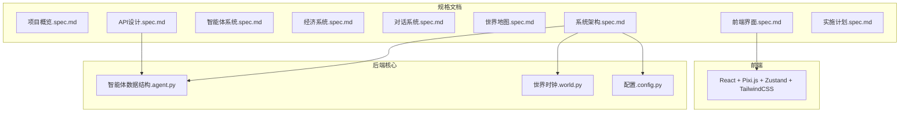
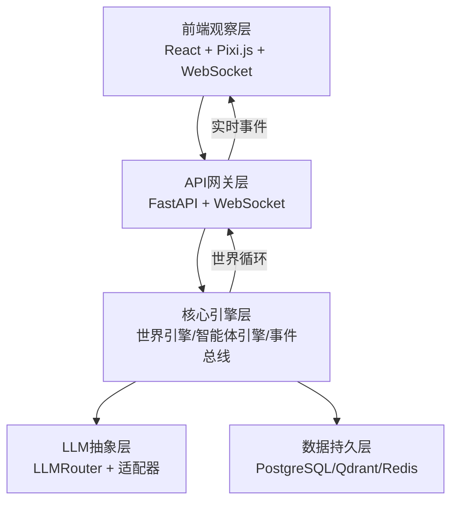
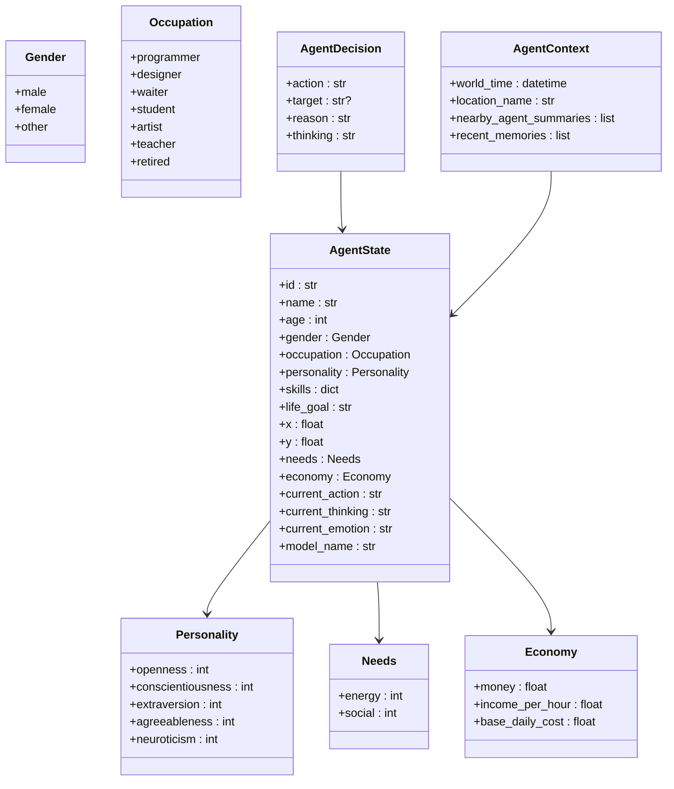
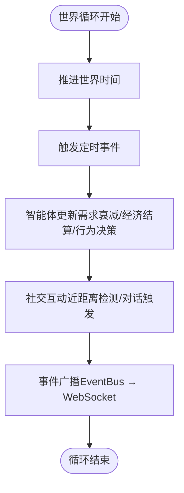
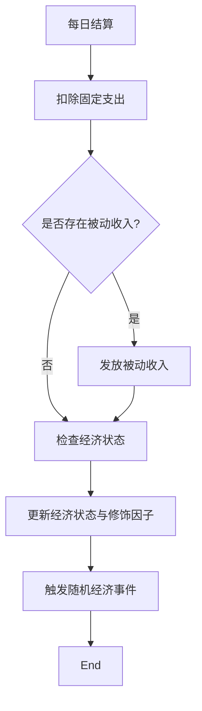
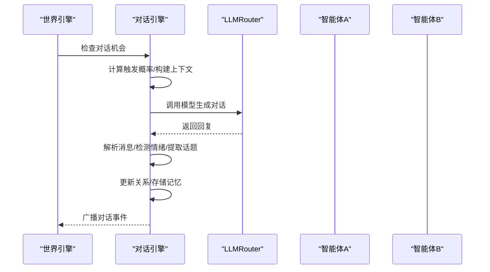
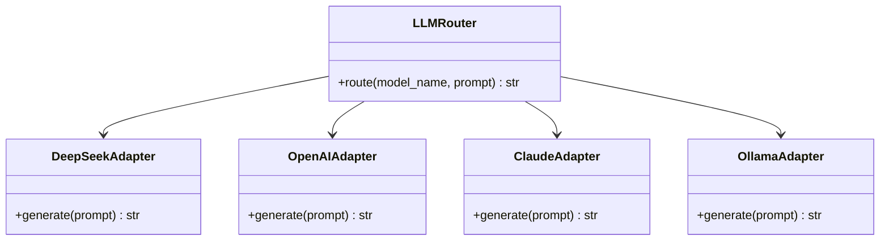
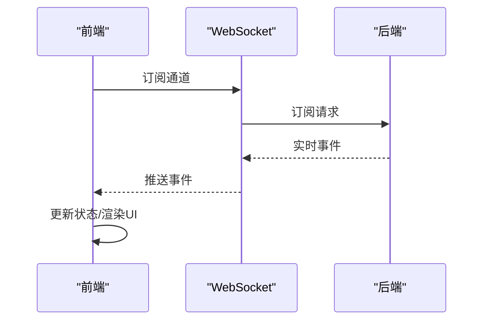
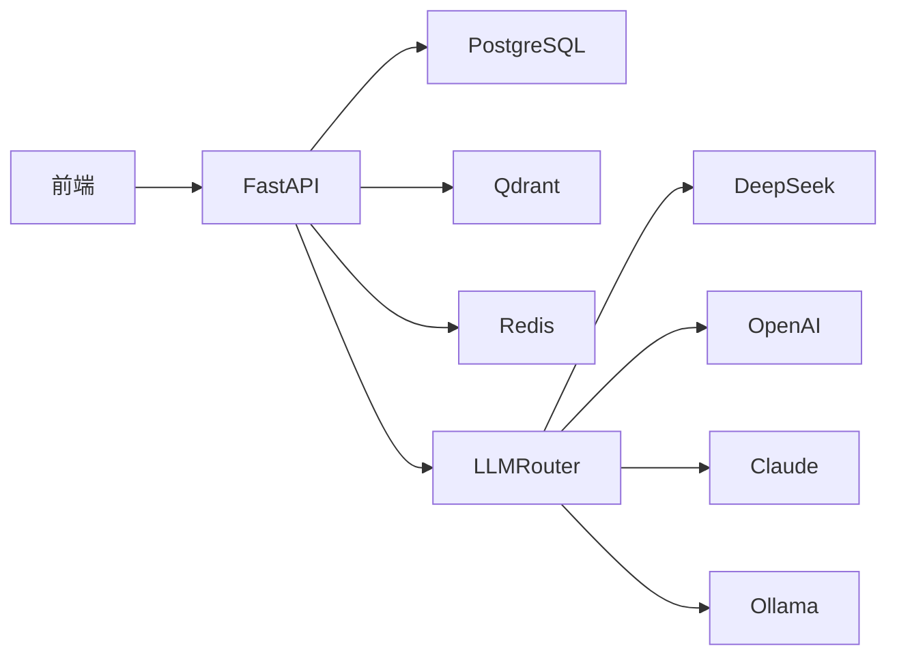

# 开发指南

<cite>
**本文档引用的文件**
- [项目概览.spec.md](file://specs/00-project-overview.spec.md)
- [系统架构.spec.md](file://specs/01-architecture.spec.md)
- [智能体系统.spec.md](file://specs/02-agent-system.spec.md)
- [经济系统.spec.md](file://specs/03-economy-system.spec.md)
- [对话系统.spec.md](file://specs/04-conversation-system.spec.md)
- [世界地图.spec.md](file://specs/05-world-map.spec.md)
- [API设计.spec.md](file://specs/06-api-design.spec.md)
- [前端界面.spec.md](file://specs/07-frontend.spec.md)
- [实施计划.spec.md](file://specs/08-implementation-plan.spec.md)
- [智能体数据结构.agent.py](file://backend/app/core/agent.py)
- [世界时钟.world.py](file://backend/app/core/world.py)
- [配置.config.py](file://backend/app/core/config.py)
</cite>

## 目录
1. [简介](#简介)
2. [项目结构](#项目结构)
3. [核心组件](#核心组件)
4. [架构总览](#架构总览)
5. [详细组件分析](#详细组件分析)
6. [依赖关系分析](#依赖关系分析)
7. [性能考量](#性能考量)
8. [故障排查指南](#故障排查指南)
9. [结论](#结论)
10. [附录](#附录)

## 简介
AI Society 是一个开源的自治智能体社会实验平台，目标是在虚拟世界中观察50+智能体的自由生活、交流与发展，探索AI群体行为的涌现现象。项目强调“纯观察”“自治优先”“真实对齐”“开源开放”，提供基于成熟技术栈的后端（FastAPI）、前端（React + Pixi.js）与LLM抽象层，支持多模型路由与实时事件流。

## 项目结构
- 规格文档集中于 specs/，涵盖项目概览、架构、智能体、经济、对话、地图、API、前端与实施计划。
- 后端核心位于 backend/app/core，包含智能体、世界、配置等基础数据结构与配置。
- 前端位于 frontend/，采用React 18 + Vite + Pixi.js + Zustand + TailwindCSS + Recharts + 原生WebSocket。

**图表来源**
- [系统架构.spec.md](file://specs/01-architecture.spec.md#L92-L169)
- [智能体数据结构.agent.py](file://backend/app/core/agent.py#L1-L92)
- [世界时钟.world.py](file://backend/app/core/world.py#L1-L40)
- [配置.config.py](file://backend/app/core/config.py#L1-L42)
- [前端界面.spec.md](file://specs/07-frontend.spec.md#L12-L23)

**章节来源**
- [系统架构.spec.md](file://specs/01-architecture.spec.md#L92-L169)
- [前端界面.spec.md](file://specs/07-frontend.spec.md#L594-L649)

## 核心组件
- 智能体系统：包含身份（职业、性格、技能、目标）、状态（位置、需求、经济、情绪、思考）、行为决策与记忆索引。
- 世界引擎：维护世界时钟、地图尺寸与Agent集合，驱动世界循环。
- 经济引擎：基于现实对齐的收入、支出、被动收入、经济状态与随机事件。
- 对话引擎：触发机制、提示词模板、对话状态机、关系变化与记忆存储。
- LLM抽象层：多模型路由（DeepSeek/OpenAI/Claude/Ollama），统一接口与提示词模板。
- 前端地图与事件流：Pixi.js渲染世界、实时事件推送、交互与性能优化。

**章节来源**
- [智能体数据结构.agent.py](file://backend/app/core/agent.py#L25-L92)
- [世界时钟.world.py](file://backend/app/core/world.py#L8-L40)
- [经济系统.spec.md](file://specs/03-economy-system.spec.md#L1-L418)
- [对话系统.spec.md](file://specs/04-conversation-system.spec.md#L1-L581)
- [系统架构.spec.md](file://specs/01-architecture.spec.md#L38-L46)

## 架构总览
系统采用分层架构：前端观察层、API网关层（FastAPI）、核心引擎层（世界/智能体/对话/经济/记忆）、LLM抽象层（多模型路由）、数据持久层（PostgreSQL/Qdrant/Redis）。世界循环每10分钟推进一次，包含时间推进、智能体更新、社交互动与事件广播。

**图表来源**
- [系统架构.spec.md](file://specs/01-architecture.spec.md#L3-L57)
- [API设计.spec.md](file://specs/06-api-design.spec.md#L411-L596)

**章节来源**
- [系统架构.spec.md](file://specs/01-architecture.spec.md#L171-L220)

## 详细组件分析

### 智能体系统
- 数据结构：性别、职业枚举；个性（五大人格维度）、需求（能量、社交）、经济（资产、收入、基础开销）；AgentState、AgentDecision、AgentContext。
- 行为与决策：需求衰减、经济结算、行为决策（规则引擎与LLM结合）。
- 记忆与社交：记忆索引、对话记忆、关系变化。

**图表来源**
- [智能体数据结构.agent.py](file://backend/app/core/agent.py#L9-L92)

**章节来源**
- [智能体数据结构.agent.py](file://backend/app/core/agent.py#L1-L92)
- [智能体系统.spec.md](file://specs/02-agent-system.spec.md#L1-L200)

### 世界与地图系统
- 世界配置：尺寸、时间缩放（现实1分钟=游戏内10分钟）、网格寻路、最大智能体数量。
- 地图布局：住宅区、商业区、中心广场、休闲区、工作区的功能分区与位置配置。
- 时间系统：WorldClock类与定时事件（日出/日落/发工资/日结）。
- 导航系统：A*寻路算法与移动执行，消耗能量并广播事件。
- 位置热度：基于占用率、时间修正与近期活动的热度计算。

**图表来源**
- [系统架构.spec.md](file://specs/01-architecture.spec.md#L173-L196)
- [世界地图.spec.md](file://specs/05-world-map.spec.md#L243-L286)

**章节来源**
- [世界地图.spec.md](file://specs/05-world-map.spec.md#L12-L530)

### 经济系统
- 收入：按职业时薪、技能加成、心情修正计算；被动收入（学生/退休）。
- 支出：固定日均开销（房租、餐饮、交通、通讯）；可选消费（咖啡、聚餐、电影、购物、旅行）。
- 经济状态：富裕/稳定/紧张/拮据/负债，影响消费意愿、工作动机与压力。
- 随机事件：奖金、医疗、红包、手机损坏等；社交经济互动（借钱、请客）。
- 数据模型：交易记录、债务关系；前端经济面板与社会统计。

**图表来源**
- [经济系统.spec.md](file://specs/03-economy-system.spec.md#L94-L109)
- [经济系统.spec.md](file://specs/03-economy-system.spec.md#L115-L157)

**章节来源**
- [经济系统.spec.md](file://specs/03-economy-system.spec.md#L16-L418)

### 对话与社交系统
- 触发机制：近距离、主动搭讪、工作互动、约定见面；概率受关系、外向性、社交需求影响。
- 对话生成：开场白与回复提示词模板；对话轮次控制与结束条件；情绪检测与话题提取。
- 关系变化：对话影响、话题影响、性格兼容性；关系类型升级与广播事件。
- 记忆存储：对话摘要与重要性评分；向量记忆（Qdrant）预留。

**图表来源**
- [对话系统.spec.md](file://specs/04-conversation-system.spec.md#L211-L240)
- [系统架构.spec.md](file://specs/01-architecture.spec.md#L198-L220)

**章节来源**
- [对话系统.spec.md](file://specs/04-conversation-system.spec.md#L12-L581)

### LLM模型集成与路由
- 多模型路由：支持DeepSeek Chat/Reasoner、OpenAI GPT-4o、Claude Sonnet、Ollama本地模型。
- 适配器接口：统一LLMAdapter接口，便于新增模型。
- 提示词模板：对话开场白、回复、群聊提示词等。

**图表来源**
- [系统架构.spec.md](file://specs/01-architecture.spec.md#L40-L46)
- [系统架构.spec.md](file://specs/01-architecture.spec.md#L224-L232)

**章节来源**
- [系统架构.spec.md](file://specs/01-architecture.spec.md#L83-L91)

### 前端界面与实时通信
- 技术栈：React 18、Vite、Pixi.js 8、Zustand、TailwindCSS、Recharts、原生WebSocket。
- 组件：顶部导航、世界地图（含位置标注、智能体精灵、对话气泡）、智能体列表/详情、实时事件流、统计面板、社交网络图。
- WebSocket协议：订阅通道、事件类型（agent_move、conversation_message、relationship_change、world_event、economic_event）。
- 性能优化：可见区域裁剪、对象池、批量更新、事件历史限制。

**图表来源**
- [API设计.spec.md](file://specs/06-api-design.spec.md#L411-L596)
- [前端界面.spec.md](file://specs/07-frontend.spec.md#L360-L407)

**章节来源**
- [前端界面.spec.md](file://specs/07-frontend.spec.md#L12-L650)
- [API设计.spec.md](file://specs/06-api-design.spec.md#L411-L596)

## 依赖关系分析
- 后端依赖：FastAPI（异步、类型安全、自动文档）、APScheduler（任务调度）、SQLAlchemy 2.0（ORM）、PostgreSQL 15、Qdrant（向量检索）、Redis（缓存/队列）、Docker/Docker Compose（容器化）。
- 前端依赖：React 18、Vite、Pixi.js 8、Zustand、TailwindCSS、Recharts、原生WebSocket。
- LLM依赖：DeepSeek、OpenAI、Claude、Ollama，通过LLMRouter统一接入。

**图表来源**
- [系统架构.spec.md](file://specs/01-architecture.spec.md#L61-L91)

**章节来源**
- [系统架构.spec.md](file://specs/01-architecture.spec.md#L61-L91)

## 性能考量
- 智能体数量：目标50-200；前端帧率60fps；API响应时间<100ms；WebSocket延迟<50ms；LLM调用频率每智能体每10分钟最多1次；内存占用<2GB。
- 优化建议：前端可见区域裁剪、对象池复用、批量状态更新；后端异步处理、缓存热点数据、数据库索引优化；LLM调用节流与批处理。

**章节来源**
- [系统架构.spec.md](file://specs/01-architecture.spec.md#L238-L248)

## 故障排查指南
- API错误码：AGENT_NOT_FOUND、LOCATION_NOT_FOUND、CONVERSATION_NOT_FOUND、INVALID_PARAMETER、WORLD_PAUSED、RATE_LIMITED、INTERNAL_ERROR。
- WebSocket连接：确认订阅通道与事件类型；检查后端事件广播；前端useWebSocket钩子状态。
- LLM调用：检查模型密钥与路由配置；验证提示词模板；监控调用频率与成本。
- 前端渲染：确认Pixi.js图层顺序与可见区域裁剪；检查对象池释放；限制事件历史长度。

**章节来源**
- [API设计.spec.md](file://specs/06-api-design.spec.md#L619-L655)
- [前端界面.spec.md](file://specs/07-frontend.spec.md#L485-L539)

## 结论
本开发指南基于项目规格文档与核心数据结构，提供了从环境搭建、代码规范、测试策略到新功能扩展与发布的全流程指导。建议开发者遵循“自治优先”“真实对齐”的核心理念，利用多模型路由与实时事件流，持续扩展智能体行为、经济模型与地图区域，并通过严格的测试与性能优化保障系统稳定性与可扩展性。

## 附录

### 开发环境搭建
- 后端：安装Python 3.10+，使用pip安装FastAPI、SQLAlchemy、APScheduler、Pydantic等依赖；配置数据库URL、Redis、向量库地址；设置LLM提供商密钥。
- 前端：安装Node.js 18+，使用npm/yarn安装React、Vite、Pixi.js、Zustand、TailwindCSS；启动开发服务器。
- LLM：在配置中注册模型别名，确保DeepSeek/OpenAI/Claude/Ollama可用；测试提示词模板。

**章节来源**
- [配置.config.py](file://backend/app/core/config.py#L1-L42)
- [系统架构.spec.md](file://specs/01-architecture.spec.md#L61-L91)

### 代码规范与测试策略
- 代码规范：类型注解、数据类优先、枚举统一、中文注释、模块职责单一。
- 单元测试：针对Agent决策、对话状态机、经济结算、路径寻找等关键逻辑编写测试。
- 集成测试：模拟世界循环、WebSocket事件流、LLM调用链路。
- 性能测试：前端帧率、API响应时间、WebSocket延迟、内存占用与并发智能体数量。

**章节来源**
- [智能体数据结构.agent.py](file://backend/app/core/agent.py#L1-L92)
- [对话系统.spec.md](file://specs/04-conversation-system.spec.md#L190-L240)
- [经济系统.spec.md](file://specs/03-economy-system.spec.md#L94-L109)
- [世界地图.spec.md](file://specs/05-world-map.spec.md#L331-L420)

### 新功能开发流程
- 智能体系统扩展：在AgentState中新增字段或行为类型；在AgentEngine中实现决策逻辑；更新提示词模板。
- 经济模型定制：调整收入/支出参数、经济状态阈值、随机事件权重；更新前端经济面板。
- 对话机制增强：扩展触发条件、提示词模板、情绪检测与话题提取；支持群聊与@提醒。
- 地图扩展：在位置配置中添加新区域；前端自动渲染；更新热度计算与导航。
- 行为定制：在AgentEngine中扩展ActionType与行为逻辑；更新需求衰减与经济结算。
- LLM模型集成：新增适配器并注册到LLMRouter；更新提示词模板与解析逻辑。

**章节来源**
- [系统架构.spec.md](file://specs/01-architecture.spec.md#L222-L237)
- [智能体系统.spec.md](file://specs/02-agent-system.spec.md#L1-L200)
- [对话系统.spec.md](file://specs/04-conversation-system.spec.md#L16-L50)
- [经济系统.spec.md](file://specs/03-economy-system.spec.md#L377-L418)
- [世界地图.spec.md](file://specs/05-world-map.spec.md#L74-L197)

### 代码审查标准与版本发布流程
- 代码审查：关注耦合度、可读性、性能影响、安全性与测试覆盖率；确保中文注释与类型安全。
- 版本发布：语义化版本号；变更日志；自动化测试通过；文档同步更新；容器镜像构建与部署。

**章节来源**
- [项目概览.spec.md](file://specs/00-project-overview.spec.md#L37-L46)

### 贡献指南、问题报告与功能请求
- 贡献指南：遵循代码规范与测试策略；提交前自检；提供变更说明与测试用例。
- 问题报告：提供复现步骤、日志与环境信息；分类标签（Bug/性能/文档）。
- 功能请求：描述场景与收益；提供原型或规格说明；评估复杂度与影响范围。

**章节来源**
- [项目概览.spec.md](file://specs/00-project-overview.spec.md#L43-L46)

### 开发工具配置与调试技巧
- 后端：启用调试模式（Settings.debug），使用FastAPI自动文档；数据库迁移使用Alembic；Redis与Qdrant本地部署。
- 前端：Vite热重载；Pixi.js调试工具；Zustand DevTools；WebSocket调试（浏览器开发者工具）。
- 调试技巧：分层断点（世界循环→智能体→对话→LLM）；事件流追踪；性能剖析（前端帧率、后端响应时间）。

**章节来源**
- [配置.config.py](file://backend/app/core/config.py#L7-L11)
- [系统架构.spec.md](file://specs/01-architecture.spec.md#L61-L71)