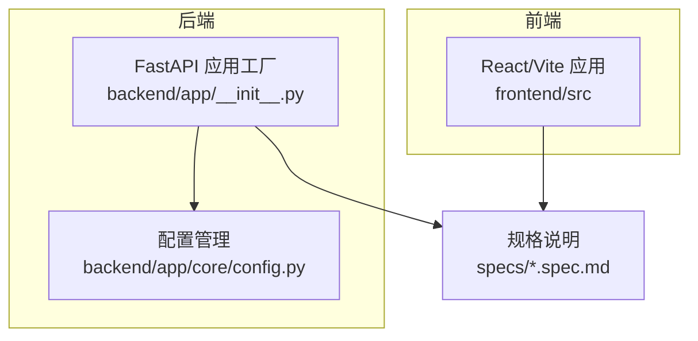
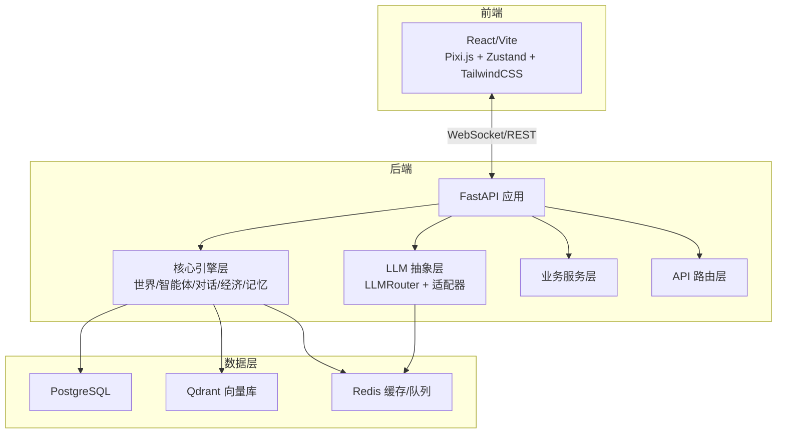
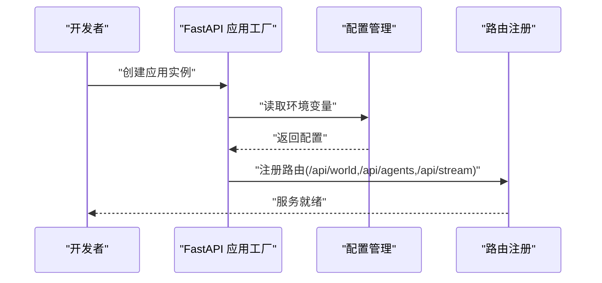
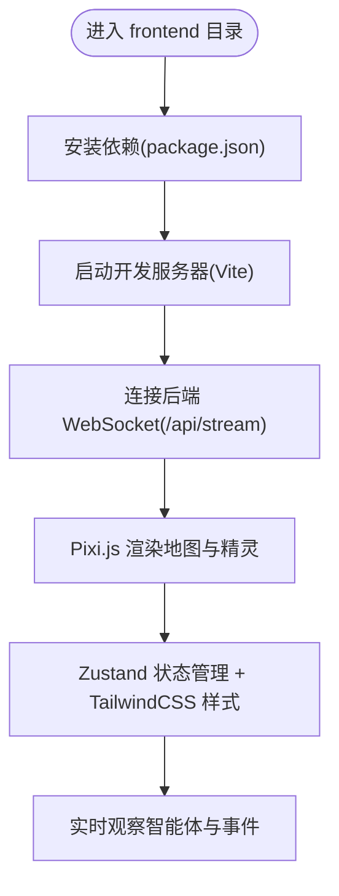
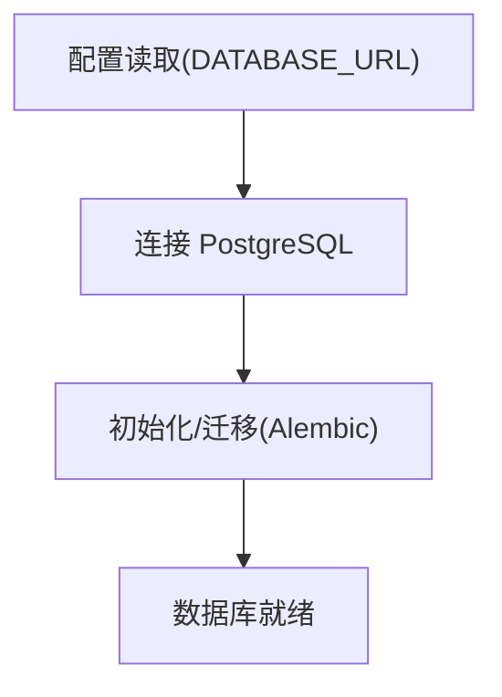
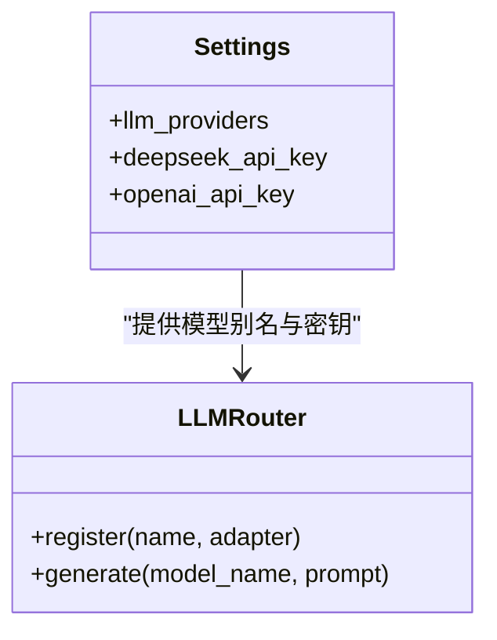
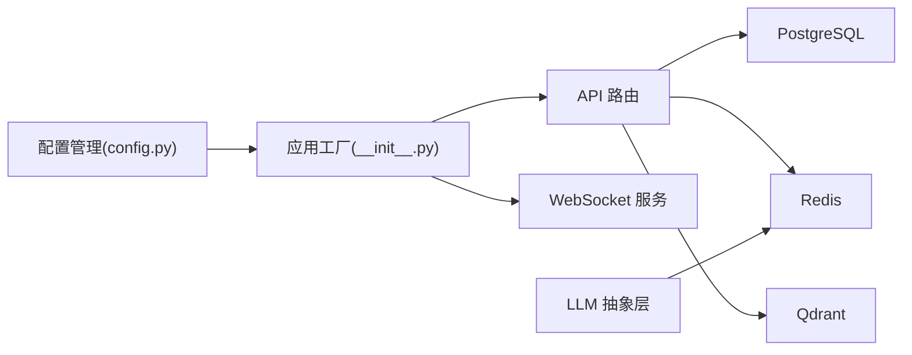

# 开发环境搭建

<cite>
**本文引用的文件**
- [backend/app/core/config.py](file://backend/app/core/config.py)
- [backend/app/__init__.py](file://backend/app/__init__.py)
- [specs/00-project-overview.spec.md](file://specs/00-project-overview.spec.md)
- [specs/01-architecture.spec.md](file://specs/01-architecture.spec.md)
- [specs/06-api-design.spec.md](file://specs/06-api-design.spec.md)
- [specs/07-frontend.spec.md](file://specs/07-frontend.spec.md)
- [specs/08-implementation-plan.spec.md](file://specs/08-implementation-plan.spec.md)
</cite>

## 目录
1. [简介](#简介)
2. [项目结构](#项目结构)
3. [核心组件](#核心组件)
4. [架构总览](#架构总览)
5. [详细组件分析](#详细组件分析)
6. [依赖分析](#依赖分析)
7. [性能考虑](#性能考虑)
8. [故障排查指南](#故障排查指南)
9. [结论](#结论)
10. [附录](#附录)

## 简介
本指南面向首次参与 AI Society 项目的开发者，提供从零开始的开发环境搭建步骤，覆盖：
- Python 后端环境配置与依赖安装
- FastAPI 后端服务本地运行
- React 前端开发环境配置与启动
- 数据库、Redis、向量库等外部服务准备
- LLM 提供商 API 密钥配置
- Docker 容器化部署准备
- IDE 与调试工具建议
- 版本控制工作流
- 常见环境问题排查

## 项目结构
AI Society 采用前后端分离架构，后端基于 FastAPI，前端基于 React/Vite，整体目录结构如下：
- backend：Python 后端，包含 FastAPI 应用工厂、核心模块、LLM 抽象层、API 路由、服务层、模型与迁移等
- frontend：React 前端，Vite 构建，Pixi.js 2D 渲染，Zustand 状态管理，TailwindCSS 样式
- specs：规格说明文档，涵盖架构、API、前端界面、实施计划等
- docker-compose.yml、.env.example：容器化与环境变量模板（仓库根目录）

**图表来源**
- [backend/app/__init__.py](file://backend/app/__init__.py#L1-L22)
- [backend/app/core/config.py](file://backend/app/core/config.py#L1-L42)
- [specs/01-architecture.spec.md](file://specs/01-architecture.spec.md#L92-L169)

**章节来源**
- [specs/01-architecture.spec.md](file://specs/01-architecture.spec.md#L92-L169)

## 核心组件
- 配置管理：集中管理环境变量、数据库、Redis、向量库、LLM 提供商等配置
- 应用工厂：创建 FastAPI 应用实例，注册路由与中间件
- 规格说明：定义 API 协议、WebSocket 事件、前端界面与技术栈

**章节来源**
- [backend/app/core/config.py](file://backend/app/core/config.py#L1-L42)
- [backend/app/__init__.py](file://backend/app/__init__.py#L1-L22)
- [specs/06-api-design.spec.md](file://specs/06-api-design.spec.md#L1-L655)
- [specs/07-frontend.spec.md](file://specs/07-frontend.spec.md#L1-L650)

## 架构总览
系统采用“观察者视角”的前端 + FastAPI 后端 + 多层数据存储的架构。后端负责世界引擎、智能体引擎、事件总线、LLM 抽象层与 API/WS 服务；前端负责地图渲染、实时事件流与交互面板。

**图表来源**
- [specs/01-architecture.spec.md](file://specs/01-architecture.spec.md#L3-L57)
- [specs/01-architecture.spec.md](file://specs/01-architecture.spec.md#L59-L91)
- [specs/01-architecture.spec.md](file://specs/01-architecture.spec.md#L171-L220)

## 详细组件分析

### Python 环境与依赖安装
- 运行时要求：Python 3.10+
- 包管理：pip（建议使用虚拟环境）
- 依赖安装：在 backend 目录下安装后端依赖（requirements.txt）
- 开发依赖：可选安装测试与格式化工具（如 pytest、ruff、black 等，按需）

建议步骤
- 创建并激活虚拟环境
- 在 backend 目录安装依赖
- 安装前端依赖（frontend/package.json），以便后续联调

**章节来源**
- [specs/01-architecture.spec.md](file://specs/01-architecture.spec.md#L61-L70)
- [specs/08-implementation-plan.spec.md](file://specs/08-implementation-plan.spec.md#L31-L42)

### FastAPI 后端服务搭建
- 应用工厂：通过应用工厂创建 FastAPI 实例，注册世界、智能体、流式 WebSocket 路由
- 配置加载：通过配置类读取环境变量，支持开发/生产环境差异
- 运行方式：使用 uvicorn 或直接运行 Python 入口文件（依据实际入口文件）

关键要点
- 环境变量：DATABASE_URL、REDIS_URL、VECTOR_STORE_URL、DEEPSEEK_API_KEY、OPENAI_API_KEY 等
- 路由前缀：/api/world、/api/agents、/api/stream
- 事件总线：用于发布/订阅世界事件，驱动前端实时更新

**图表来源**
- [backend/app/__init__.py](file://backend/app/__init__.py#L7-L21)
- [backend/app/core/config.py](file://backend/app/core/config.py#L7-L41)

**章节来源**
- [backend/app/__init__.py](file://backend/app/__init__.py#L1-L22)
- [backend/app/core/config.py](file://backend/app/core/config.py#L1-L42)

### React 前端开发环境配置
- 技术栈：React 18、Vite、Pixi.js、Zustand、TailwindCSS、Recharts、TypeScript
- 启动方式：在 frontend 目录执行开发服务器命令
- WebSocket：前端通过原生 WebSocket 连接后端流式通道
- 渲染：使用 Pixi.js 进行大规模精灵渲染，保证 60fps

**图表来源**
- [specs/07-frontend.spec.md](file://specs/07-frontend.spec.md#L12-L23)
- [specs/07-frontend.spec.md](file://specs/07-frontend.spec.md#L360-L407)

**章节来源**
- [specs/07-frontend.spec.md](file://specs/07-frontend.spec.md#L1-L650)

### 数据库连接设置
- 数据库：PostgreSQL 15（结构化数据）
- 连接字符串：通过配置读取 DATABASE_URL，默认 SQLite（开发环境）
- 迁移：使用 Alembic（后端目录包含 alembic/）
- 建议：开发期可使用本地 Docker Compose 启动 PostgreSQL

**图表来源**
- [backend/app/core/config.py](file://backend/app/core/config.py#L15-L16)
- [specs/01-architecture.spec.md](file://specs/01-architecture.spec.md#L67-L68)

**章节来源**
- [backend/app/core/config.py](file://backend/app/core/config.py#L15-L16)
- [specs/01-architecture.spec.md](file://specs/01-architecture.spec.md#L67-L68)

### LLM 提供商 API 密钥配置
- 支持模型：DeepSeek Chat/Reasoner、OpenAI GPT-4o 等
- 环境变量：DEEPSEEK_API_KEY、DEEPSEEK_BASE_URL、OPENAI_API_KEY
- 路由策略：LLMRouter 根据模型名称路由到对应适配器
- 成本控制：建议在开发期使用本地模型或降低调用频率

**图表来源**
- [backend/app/core/config.py](file://backend/app/core/config.py#L24-L36)
- [specs/01-architecture.spec.md](file://specs/01-architecture.spec.md#L38-L46)

**章节来源**
- [backend/app/core/config.py](file://backend/app/core/config.py#L24-L36)
- [specs/01-architecture.spec.md](file://specs/01-architecture.spec.md#L83-L91)

### Redis 缓存服务启动
- 用途：缓存、消息队列、会话存储
- 默认地址：redis://localhost:6379/0
- 建议：使用 Docker Compose 启动 Redis，确保后端与前端联调时可用

**章节来源**
- [backend/app/core/config.py](file://backend/app/core/config.py#L18-L19)
- [specs/01-architecture.spec.md](file://specs/01-architecture.spec.md#L69-L69)

### Docker 容器化部署准备
- 后端镜像：基于 Python 基础镜像，复制 requirements.txt 并安装依赖
- 前端镜像：基于 Node 基础镜像，安装依赖并构建静态资源
- Compose：定义 PostgreSQL、Redis、Qdrant、后端、前端服务
- 环境变量：使用 .env.example 作为模板，避免硬编码敏感信息

**章节来源**
- [specs/01-architecture.spec.md](file://specs/01-architecture.spec.md#L70-L70)
- [specs/08-implementation-plan.spec.md](file://specs/08-implementation-plan.spec.md#L34-L34)

### IDE 配置与调试工具建议
- Python：VS Code + Python 扩展，启用 lint（flake8/ruff）、格式化（black/isort）
- 前端：VS Code + ES7+ React/Redux 扩展，TypeScript 严格模式
- 调试：后端使用断点调试；前端使用 React DevTools + Redux DevTools
- API 调试：使用 curl 或 Postman 访问 REST API；WebSocket 工具验证实时流

**章节来源**
- [specs/08-implementation-plan.spec.md](file://specs/08-implementation-plan.spec.md#L13-L20)

### 版本控制工作流
- 分支策略：主分支保护，特性分支开发，Pull Request 审查
- 提交规范：语义化提交信息，关联 Issue
- 发布流程：打 Tag → 自动构建 → 发布 Release

**章节来源**
- [specs/08-implementation-plan.spec.md](file://specs/08-implementation-plan.spec.md#L375-L400)

## 依赖分析
后端应用工厂依赖配置模块，配置模块集中管理数据库、Redis、向量库与 LLM 提供商参数；前端依赖规格文档中的技术栈与通信协议。

**图表来源**
- [backend/app/core/config.py](file://backend/app/core/config.py#L15-L36)
- [backend/app/__init__.py](file://backend/app/__init__.py#L1-L22)
- [specs/01-architecture.spec.md](file://specs/01-architecture.spec.md#L51-L56)

**章节来源**
- [backend/app/core/config.py](file://backend/app/core/config.py#L1-L42)
- [backend/app/__init__.py](file://backend/app/__init__.py#L1-L22)

## 性能考虑
- 后端：异步 FastAPI + SQLAlchemy 2.0，合理拆分任务，避免阻塞 IO
- 前端：仅渲染可见区域，对象池复用，批量更新状态，限制事件历史长度
- LLM：减少高频调用，优先规则决策，必要时使用本地模型
- 数据库：索引优化、批量写入、连接池配置

**章节来源**
- [specs/01-architecture.spec.md](file://specs/01-architecture.spec.md#L238-L248)
- [specs/07-frontend.spec.md](file://specs/07-frontend.spec.md#L485-L540)

## 故障排查指南
常见问题与解决思路
- 后端无法连接数据库
  - 检查 DATABASE_URL 是否正确（本地/远程）
  - 确认 PostgreSQL 已启动且端口可达
- Redis 连接失败
  - 检查 REDIS_URL 与端口
  - 确认 Redis 已启动并允许连接
- LLM 调用报错
  - 核对 DEEPSEEK_API_KEY/OPENAI_API_KEY
  - 检查模型别名是否在 llm_providers 中注册
- WebSocket 无法接收事件
  - 确认前端已发送订阅消息
  - 检查后端事件总线是否正常发布
- 前端渲染卡顿
  - 限制可见精灵数量，启用对象池
  - 减少不必要的状态更新

**章节来源**
- [specs/06-api-design.spec.md](file://specs/06-api-design.spec.md#L411-L425)
- [specs/07-frontend.spec.md](file://specs/07-frontend.spec.md#L485-L540)

## 结论
通过本指南，您可以在本地快速搭建 AI Society 的开发环境，完成 Python 后端与 React 前端的联调，并准备好数据库、Redis、向量库与 LLM 提供商的接入。建议在开发过程中遵循规格文档中的设计原则与性能目标，逐步完善功能并持续优化。

## 附录
- 项目定位与核心理念参见规格文档
- API 与 WebSocket 协议详见 API 设计文档
- 前端界面与交互规范详见前端规格文档
- 实施计划与里程碑参见实施计划文档

**章节来源**
- [specs/00-project-overview.spec.md](file://specs/00-project-overview.spec.md#L1-L46)
- [specs/06-api-design.spec.md](file://specs/06-api-design.spec.md#L1-L655)
- [specs/07-frontend.spec.md](file://specs/07-frontend.spec.md#L1-L650)
- [specs/08-implementation-plan.spec.md](file://specs/08-implementation-plan.spec.md#L1-L445)