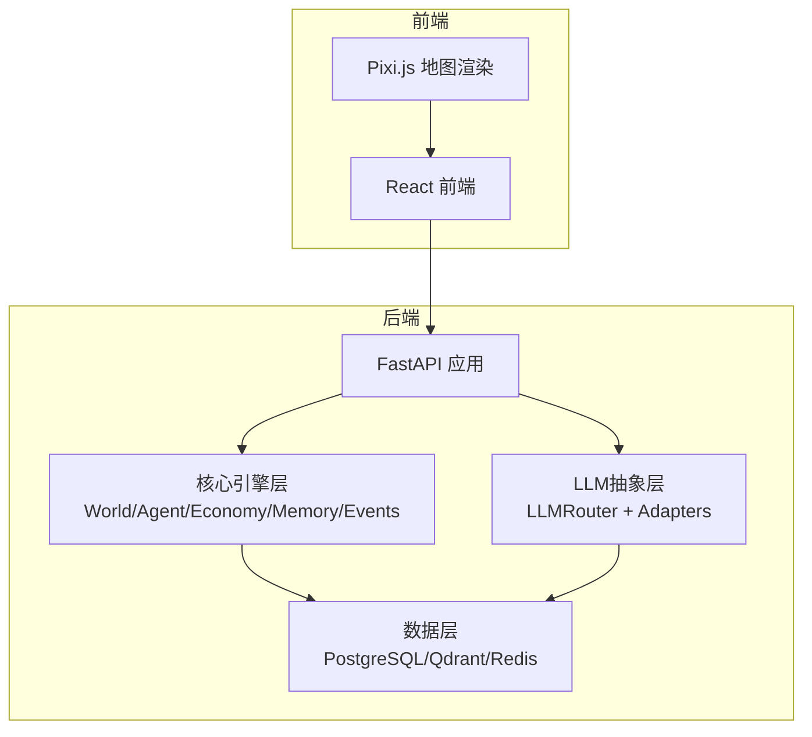
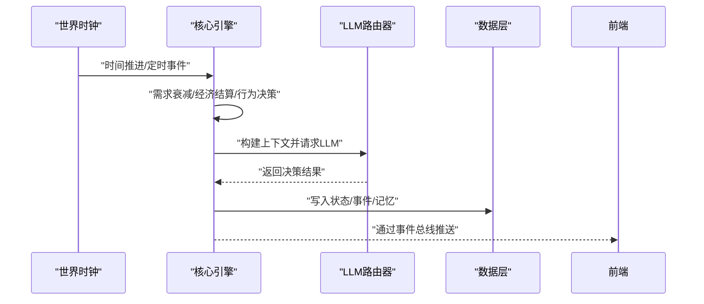
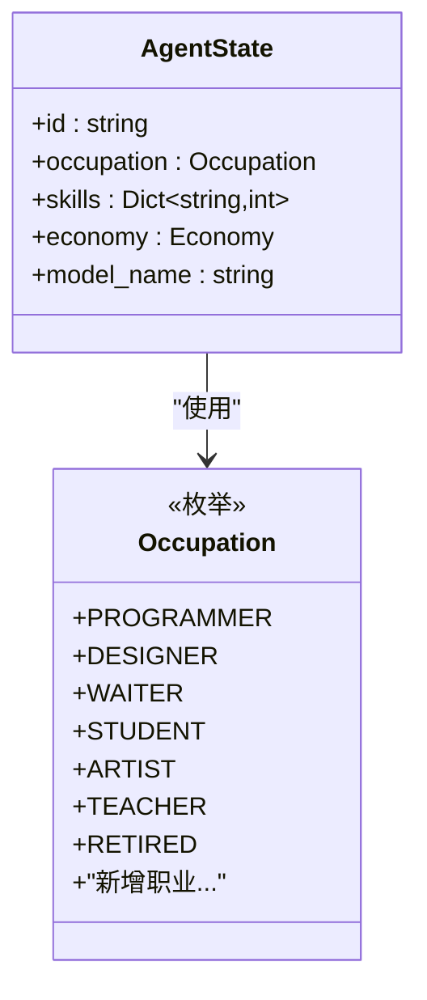
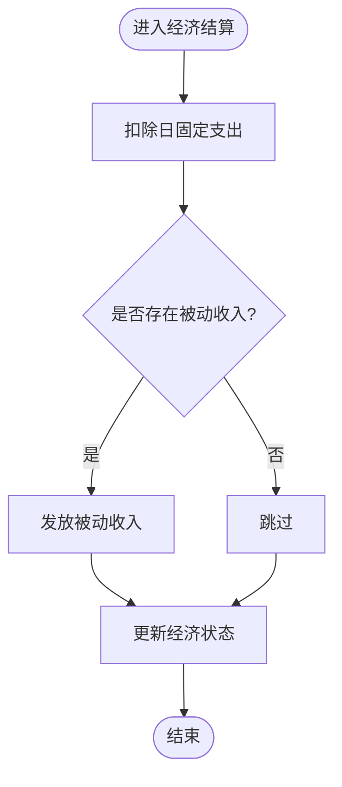
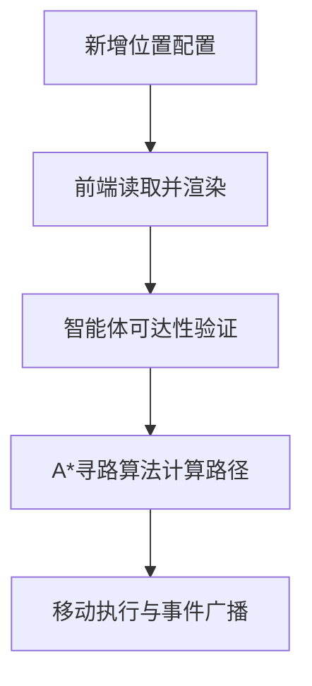
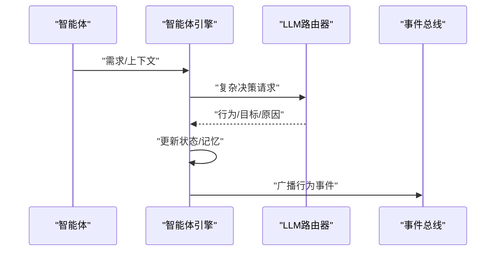
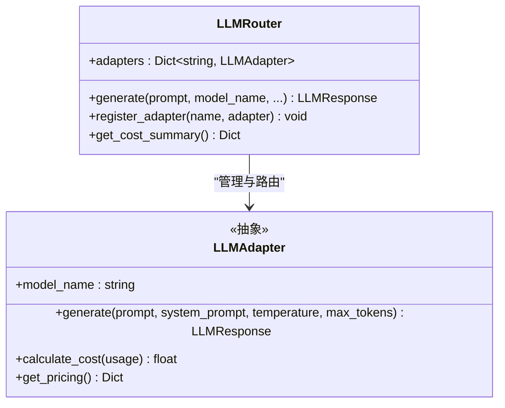
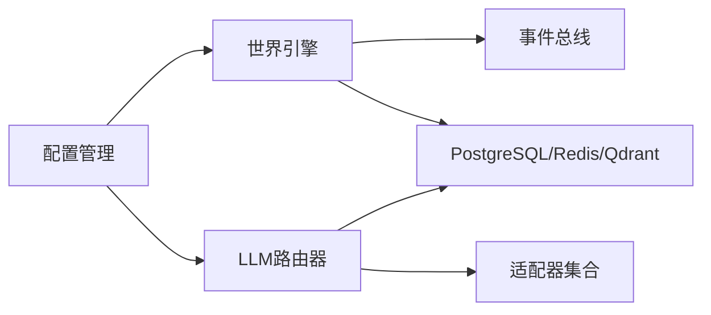

# 扩展开发指南

<cite>
**本文引用的文件**
- [specs/00-project-overview.spec.md](file://specs/00-project-overview.spec.md)
- [specs/01-architecture.spec.md](file://specs/01-architecture.spec.md)
- [specs/03-economy-system.spec.md](file://specs/03-economy-system.spec.md)
- [specs/05-world-map.spec.md](file://specs/05-world-map.spec.md)
- [specs/06-api-design.spec.md](file://specs/06-api-design.spec.md)
- [backend/app/core/agent.py](file://backend/app/core/agent.py)
- [backend/app/core/world.py](file://backend/app/core/world.py)
- [backend/app/core/config.py](file://backend/app/core/config.py)
- [backend/app/llm/router.py](file://backend/app/llm/router.py)
- [backend/app/llm/adapters/base.py](file://backend/app/llm/adapters/base.py)
</cite>

## 目录
1. [简介](#简介)
2. [项目结构](#项目结构)
3. [核心组件](#核心组件)
4. [架构概览](#架构概览)
5. [详细组件分析](#详细组件分析)
6. [依赖分析](#依赖分析)
7. [性能考虑](#性能考虑)
8. [故障排查指南](#故障排查指南)
9. [结论](#结论)
10. [附录](#附录)

## 简介
本指南面向希望扩展现有AI Society系统的开发者，提供从智能体类型扩展、经济模型参数定制、地图扩展开发、行为扩展实现，到LLM适配器集成、插件系统与第三方服务集成、自定义API扩展的完整方法论与最佳实践。文档同时给出扩展点识别方法、兼容性保证策略与向后兼容性维护建议，并通过图示与来源标注帮助读者快速定位实现细节。

## 项目结构
AI Society采用前后端分离架构，后端基于FastAPI，前端基于React + Pixi.js，核心引擎层包含世界引擎、智能体引擎、事件总线、对话引擎、经济引擎与记忆引擎；LLM抽象层通过路由器统一调度多模型适配器；数据层包括PostgreSQL、Qdrant与Redis。

**图表来源**
- [specs/01-architecture.spec.md](file://specs/01-architecture.spec.md#L3-L56)

**章节来源**
- [specs/01-architecture.spec.md](file://specs/01-architecture.spec.md#L99-L176)

## 核心组件
- 世界时钟与时间系统：提供时间缩放、时间段判定、定时事件发布。
- 智能体数据模型：包含性别、职业、个性、需求、经济、记忆索引与模型选择等字段。
- LLM路由器：统一管理多模型适配器，支持成本跟踪、预算控制与模型路由。
- 配置管理：集中管理应用配置，支持环境变量覆盖与类型安全。

**章节来源**
- [backend/app/core/world.py](file://backend/app/core/world.py#L73-L292)
- [backend/app/core/agent.py](file://backend/app/core/agent.py#L9-L92)
- [backend/app/llm/router.py](file://backend/app/llm/router.py#L89-L224)
- [backend/app/core/config.py](file://backend/app/core/config.py#L19-L175)

## 架构概览
系统采用“事件驱动 + 异步处理”的主循环模式：每tick推进世界时间，触发定时事件；并行更新智能体状态（需求衰减、经济结算、行为决策），随后进行社交互动与事件广播。LLM调用在复杂决策阶段由路由器统一调度，确保成本可控与模型可替换。

**图表来源**
- [specs/01-architecture.spec.md](file://specs/01-architecture.spec.md#L180-L227)

**章节来源**
- [specs/01-architecture.spec.md](file://specs/01-architecture.spec.md#L178-L227)

## 详细组件分析

### 扩展点识别与兼容性策略
- 明确扩展边界：新增智能体类型、行为、地图区域、经济参数、LLM模型、API端点、第三方服务等均应遵循“低耦合、高内聚”原则。
- 兼容性保障：通过配置驱动（如经济参数配置文件）、枚举与数据类约束、统一接口（LLMAdapter）与事件契约，确保升级不影响既有功能。
- 向后兼容：对新增字段采用默认值；对新增枚举值保留旧值映射；对API新增字段保持可选；对行为扩展提供回退策略。

**章节来源**
- [specs/01-architecture.spec.md](file://specs/01-architecture.spec.md#L229-L244)

### 扩展智能体类型
- 新增职业枚举：在智能体数据模型的职业枚举中加入新类型。
- 配置默认属性：在种子数据与配置中补充新职业的默认技能、需求权重、模型偏好等。
- 行为与交互：在智能体引擎中为新类型实现专属行为分支与社交交互逻辑。
- 前端展示：在前端UI中为新职业类型提供可视化标识与状态面板。

**图表来源**
- [backend/app/core/agent.py](file://backend/app/core/agent.py#L15-L23)
- [backend/app/core/agent.py](file://backend/app/core/agent.py#L48-L76)

**章节来源**
- [backend/app/core/agent.py](file://backend/app/core/agent.py#L15-L76)

### 定制经济模型参数
- 参数来源：经济参数可通过配置文件与数据库模型共同管理，支持日固定支出、职业薪资、消费价格与状态阈值等。
- 扩展方式：新增职业/消费类别时，在配置文件中添加条目，并在经济引擎中实现对应的计算逻辑与事件广播。
- 成本控制：通过LLM路由器的成本跟踪与预算控制，避免因扩展导致的API成本失控。

**图表来源**
- [specs/03-economy-system.spec.md](file://specs/03-economy-system.spec.md#L94-L109)

**章节来源**
- [specs/03-economy-system.spec.md](file://specs/03-economy-system.spec.md#L312-L417)

### 地图扩展开发
- 添加位置：在地图位置配置中新增区域，设置类型、功能、开放时间、容量与消费价格等。
- 前端渲染：前端自动读取位置配置并渲染建筑与热点指示器。
- 导航寻路：寻路算法基于网格与A*实现，新增区域需确保可达性与碰撞检测正常。

**图表来源**
- [specs/05-world-map.spec.md](file://specs/05-world-map.spec.md#L76-L196)
- [specs/05-world-map.spec.md](file://specs/05-world-map.spec.md#L335-L419)

**章节来源**
- [specs/05-world-map.spec.md](file://specs/05-world-map.spec.md#L31-L196)

### 行为扩展实现步骤
- 定义行为类型：在智能体数据模型中扩展行为枚举或字符串标识。
- 实现决策逻辑：在智能体引擎中为新行为编写决策分支，结合上下文（位置、需求、记忆）与LLM生成结果。
- 事件广播：将行为结果通过事件总线推送到前端，确保实时可视化。

**图表来源**
- [specs/01-architecture.spec.md](file://specs/01-architecture.spec.md#L205-L227)

**章节来源**
- [specs/01-architecture.spec.md](file://specs/01-architecture.spec.md#L229-L239)

### LLM适配器集成流程
- 实现适配器接口：继承适配器基类，实现生成方法与定价查询。
- 注册到路由器：在路由器中注册新适配器并设置默认模型。
- 成本与预算：通过路由器的成本跟踪与预算控制，确保扩展不会导致超支。
- 配置与运行时切换：通过配置与智能体字段支持运行时模型切换。

**图表来源**
- [backend/app/llm/adapters/base.py](file://backend/app/llm/adapters/base.py#L58-L118)
- [backend/app/llm/router.py](file://backend/app/llm/router.py#L89-L224)

**章节来源**
- [backend/app/llm/adapters/base.py](file://backend/app/llm/adapters/base.py#L58-L118)
- [backend/app/llm/router.py](file://backend/app/llm/router.py#L114-L157)

### 插件系统开发
- 接口契约：定义插件接口（如行为插件、事件处理器、经济规则插件），确保插件可热加载与卸载。
- 生命周期：提供初始化、启用、禁用、清理等生命周期钩子。
- 配置驱动：通过配置文件声明启用的插件与参数，避免硬编码。
- 安全与隔离：插件在沙箱或独立进程运行，防止破坏核心引擎。

[本节为概念性指导，未直接分析具体文件，故不提供章节来源]

### 第三方服务集成
- 适配器模式：将第三方服务封装为适配器，统一接口以适配现有调用链。
- 配置与凭证：通过配置管理集中管理第三方服务的访问凭证与参数。
- 错误与降级：实现重试、熔断与降级策略，保证系统稳定性。

[本节为概念性指导，未直接分析具体文件，故不提供章节来源]

### 自定义API扩展
- 路由设计：遵循REST风格，统一响应格式与错误码。
- 事件订阅：通过WebSocket通道推送实时事件，支持频道与智能体级订阅。
- 速率限制：对导出与查询接口实施速率限制，避免滥用。
- 文档与版本：自动生成API文档，明确版本策略与弃用流程。

**章节来源**
- [specs/06-api-design.spec.md](file://specs/06-api-design.spec.md#L18-L655)

## 依赖分析
- 低耦合：核心引擎通过事件总线解耦，LLM通过路由器解耦，配置通过Settings集中管理。
- 外部依赖：PostgreSQL、Qdrant、Redis分别承担结构化数据、向量检索与缓存/队列，形成清晰的数据分层。
- 循环依赖规避：通过接口抽象与模块化拆分，避免循环导入与运行时耦合。

**图表来源**
- [specs/01-architecture.spec.md](file://specs/01-architecture.spec.md#L59-L98)
- [backend/app/core/config.py](file://backend/app/core/config.py#L19-L175)
- [backend/app/llm/router.py](file://backend/app/llm/router.py#L89-L224)

**章节来源**
- [specs/01-architecture.spec.md](file://specs/01-architecture.spec.md#L59-L98)

## 性能考虑
- 并行处理：智能体更新采用并行策略，减少主循环阻塞。
- 异步I/O：事件总线与数据库访问采用异步，提升吞吐。
- 成本控制：LLM调用频率与预算限制确保资源可控。
- 前端优化：Pixi.js按图层渲染，热点区域动态更新，降低GPU/CPU负载。

[本节提供通用指导，未直接分析具体文件，故不提供章节来源]

## 故障排查指南
- 世界时钟异常：检查时间缩放配置与暂停/恢复状态，确认tick事件是否正常发布。
- LLM调用失败：检查模型名称是否注册、预算是否超支、适配器是否正确实现。
- 经济结算异常：核对配置文件中的日固定支出与职业薪资，确认被动收入与状态更新逻辑。
- 地图导航问题：检查新增区域的网格可达性与A*寻路参数，确认事件广播是否触发。

**章节来源**
- [backend/app/core/world.py](file://backend/app/core/world.py#L205-L277)
- [backend/app/llm/router.py](file://backend/app/llm/router.py#L183-L208)
- [specs/03-economy-system.spec.md](file://specs/03-economy-system.spec.md#L94-L109)
- [specs/05-world-map.spec.md](file://specs/05-world-map.spec.md#L335-L419)

## 结论
通过明确的扩展点、严格的接口契约与配置驱动，AI Society能够在保持稳定性的前提下持续演进。建议在每次扩展中遵循“先设计、再实现、后验证”的流程，确保新功能与现有系统高度兼容，并通过监控与日志及时发现与修复问题。

[本节为总结性内容，未直接分析具体文件，故不提供章节来源]

## 附录

### 扩展开发示例清单
- 新增智能体类型：在职业枚举中添加新类型，补充种子数据与前端展示。
- 新增地图区域：在位置配置中添加新区域，验证可达性与渲染。
- 新增经济参数：在配置文件中添加新职业/消费类别，实现结算逻辑。
- 新增LLM模型：实现适配器接口并注册到路由器，配置定价与默认模型。
- 新增API端点：遵循REST规范与错误码约定，提供WebSocket订阅能力。
- 插件系统：定义插件接口与生命周期，支持配置驱动启用。

[本节为清单性内容，未直接分析具体文件，故不提供章节来源]