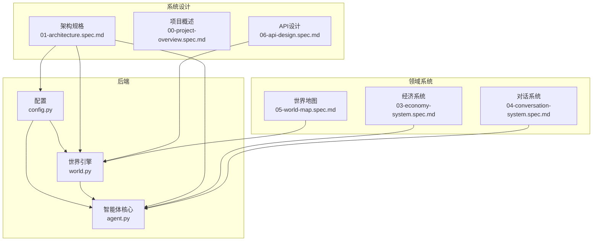
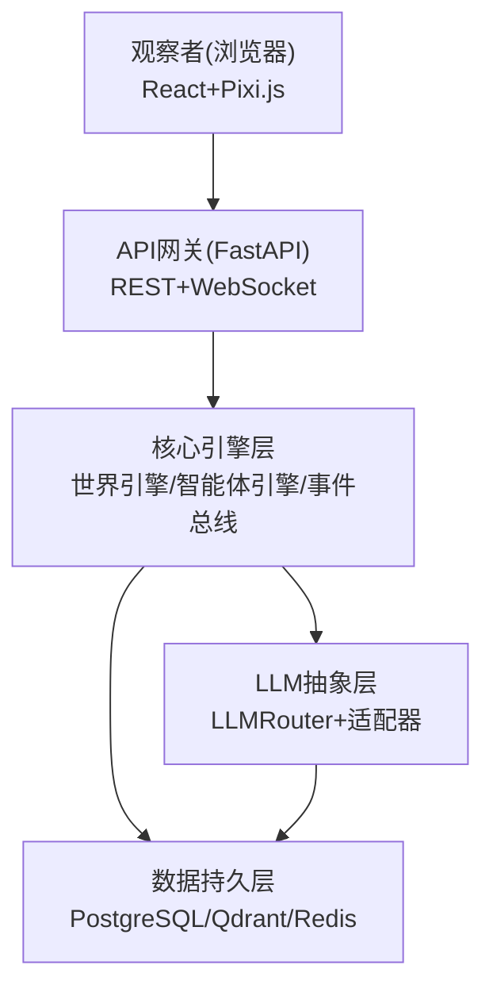
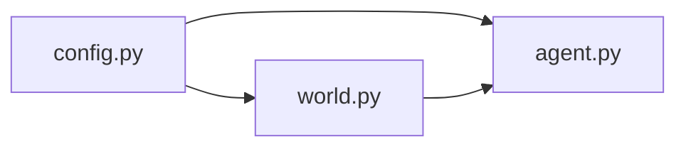

# 测试策略与实施

<cite>
**本文引用的文件**
- [backend/app/core/agent.py](file://backend/app/core/agent.py)
- [backend/app/core/world.py](file://backend/app/core/world.py)
- [backend/app/core/config.py](file://backend/app/core/config.py)
- [specs/00-project-overview.spec.md](file://specs/00-project-overview.spec.md)
- [specs/01-architecture.spec.md](file://specs/01-architecture.spec.md)
- [specs/03-economy-system.spec.md](file://specs/03-economy-system.spec.md)
- [specs/04-conversation-system.spec.md](file://specs/04-conversation-system.spec.md)
- [specs/05-world-map.spec.md](file://specs/05-world-map.spec.md)
- [specs/06-api-design.spec.md](file://specs/06-api-design.spec.md)
- [specs/08-implementation-plan.spec.md](file://specs/08-implementation-plan.spec.md)
</cite>

## 目录
1. [简介](#简介)
2. [项目结构](#项目结构)
3. [核心组件](#核心组件)
4. [架构总览](#架构总览)
5. [详细组件分析](#详细组件分析)
6. [依赖分析](#依赖分析)
7. [性能考虑](#性能考虑)
8. [故障排查指南](#故障排查指南)
9. [结论](#结论)
10. [附录](#附录)

## 简介
本测试策略面向“AI Society”项目，旨在建立覆盖单元测试、集成测试与端到端测试的全链路测试体系。重点包括：
- 智能体行为测试：验证AgentState、AgentDecision、AgentContext等核心数据结构与行为决策流程。
- 经济系统验证：验证收入、支出、经济状态分级、随机事件与社交经济交互的正确性与稳定性。
- 对话质量评估：基于对话状态机、情绪检测、话题提取与关系变化的可验证指标。
- 测试数据准备与模拟环境：基于规格文档构建可控的初始状态与边界条件。
- 自动化测试脚本与持续集成：结合实施计划与架构文档，设计可落地的CI流水线。

## 项目结构
后端采用分层架构，核心模块位于 backend/app/core，包含配置、世界时钟、智能体状态等；规格文档提供系统设计、API与对话/经济系统规范；前端采用React+Pixi.js，通过WebSocket与后端交互。

图表来源
- [specs/01-architecture.spec.md](file://specs/01-architecture.spec.md#L1-L255)
- [specs/06-api-design.spec.md](file://specs/06-api-design.spec.md#L1-L84)
- [specs/03-economy-system.spec.md](file://specs/03-economy-system.spec.md#L1-L418)
- [specs/04-conversation-system.spec.md](file://specs/04-conversation-system.spec.md#L1-L581)
- [specs/05-world-map.spec.md](file://specs/05-world-map.spec.md#L74-L197)
- [backend/app/core/config.py](file://backend/app/core/config.py#L1-L42)
- [backend/app/core/world.py](file://backend/app/core/world.py#L1-L40)
- [backend/app/core/agent.py](file://backend/app/core/agent.py#L1-L92)

章节来源
- [specs/01-architecture.spec.md](file://specs/01-architecture.spec.md#L1-L255)
- [specs/00-project-overview.spec.md](file://specs/00-project-overview.spec.md#L1-L46)
- [specs/06-api-design.spec.md](file://specs/06-api-design.spec.md#L1-L84)

## 核心组件
- 配置与环境：Settings提供时间缩放、模型提供商、数据库与缓存等配置入口，支持缓存加载。
- 世界时钟：WorldClock提供现实时间到游戏内时间的映射，支持世界时间推进。
- 世界状态：WorldState聚合clock、config与agents，承载全局状态。
- 智能体状态：AgentState封装身份、位置、需求、经济、情绪、记忆索引与模型选择等。
- 对话系统：Conversation状态机、情绪检测、话题提取、关系变化与群聊机制。
- 经济系统：收入/支出、经济状态分级、随机事件、社交经济交互与职业变动。

章节来源
- [backend/app/core/config.py](file://backend/app/core/config.py#L1-L42)
- [backend/app/core/world.py](file://backend/app/core/world.py#L1-L40)
- [backend/app/core/agent.py](file://backend/app/core/agent.py#L1-L92)
- [specs/03-economy-system.spec.md](file://specs/03-economy-system.spec.md#L1-L418)
- [specs/04-conversation-system.spec.md](file://specs/04-conversation-system.spec.md#L1-L581)

## 架构总览
系统采用“观察者—API网关—核心引擎—LLM抽象层—数据持久层”的分层架构。测试应覆盖从API到引擎再到LLM与数据层的全链路。

图表来源
- [specs/01-architecture.spec.md](file://specs/01-architecture.spec.md#L1-L255)

## 详细组件分析

### 单元测试策略
- 配置模块
  - 目标：验证Settings字段解析、默认值与缓存行为。
  - 方法：构造不同环境变量组合，断言time_scale、llm_providers、数据库URL等。
  - 关键路径：[backend/app/core/config.py](file://backend/app/core/config.py#L1-L42)
- 世界时钟
  - 目标：验证时间缩放(1:10)与now()返回值。
  - 方法：设置start_real_time/start_world_time，推进现实时间，断言世界时间线性增长。
  - 关键路径：[backend/app/core/world.py](file://backend/app/core/world.py#L8-L21)
- 智能体状态
  - 目标：验证Personality、Needs、Economy、AgentState、AgentDecision、AgentContext字段完整性与默认值。
  - 方法：构造最小AgentState实例，断言各字段类型与默认值；验证模型名、需求衰减、经济状态字段。
  - 关键路径：[backend/app/core/agent.py](file://backend/app/core/agent.py#L25-L92)
- 经济系统
  - 目标：验证收入计算、被动收入、每日结算、经济状态分级与随机事件。
  - 方法：构造不同职业、技能、心情与经济状态，断言收入与余额变化；模拟随机事件概率分布。
  - 关键路径：[specs/03-economy-system.spec.md](file://specs/03-economy-system.spec.md#L31-L157)
- 对话系统
  - 目标：验证对话状态机、情绪检测、话题提取、关系更新与群聊轮次。
  - 方法：构造Conversation实例，逐步process_turn，断言状态转换与消息情绪/话题；验证update_relationship_after_conversation。
  - 关键路径：[specs/04-conversation-system.spec.md](file://specs/04-conversation-system.spec.md#L190-L374)

章节来源
- [backend/app/core/config.py](file://backend/app/core/config.py#L1-L42)
- [backend/app/core/world.py](file://backend/app/core/world.py#L8-L21)
- [backend/app/core/agent.py](file://backend/app/core/agent.py#L25-L92)
- [specs/03-economy-system.spec.md](file://specs/03-economy-system.spec.md#L31-L157)
- [specs/04-conversation-system.spec.md](file://specs/04-conversation-system.spec.md#L190-L374)

### 集成测试策略
- API层
  - 目标：验证/GET api/world/status、/POST api/world/control、/GET api/world/locations等端点。
  - 方法：启动FastAPI应用，发送HTTP请求，断言响应结构与字段值；结合WebSocket事件流验证实时推送。
  - 关键路径：[specs/06-api-design.spec.md](file://specs/06-api-design.spec.md#L20-L84)
- 事件总线
  - 目标：验证事件发布/订阅、广播到WebSocket。
  - 方法：构造事件，发布并断言订阅回调被调用；通过WebSocket接收事件流。
  - 关键路径：[specs/01-architecture.spec.md](file://specs/01-architecture.spec.md#L180-L203)
- LLM路由
  - 目标：验证多模型路由与提示词组装。
  - 方法：构造AgentContext，调用llm_router.generate，断言模型选择与响应格式。
  - 关键路径：[specs/01-architecture.spec.md](file://specs/01-architecture.spec.md#L205-L227)

章节来源
- [specs/06-api-design.spec.md](file://specs/06-api-design.spec.md#L20-L84)
- [specs/01-architecture.spec.md](file://specs/01-architecture.spec.md#L180-L227)

### 端到端测试策略
- 用户观察流
  - 目标：验证从登录到实时观察的完整路径。
  - 方法：启动后端+前端，建立WebSocket连接，断言事件流面板与地图渲染；导出数据验证。
  - 关键路径：[specs/00-project-overview.spec.md](file://specs/00-project-overview.spec.md#L32-L35)
- 性能与稳定性
  - 目标：在50-200智能体规模下，保持前端帧率、API响应时间与WebSocket延迟达标。
  - 方法：压测脚本模拟多智能体并发，监控指标并记录异常。
  - 关键路径：[specs/01-architecture.spec.md](file://specs/01-architecture.spec.md#L245-L255)

章节来源
- [specs/00-project-overview.spec.md](file://specs/00-project-overview.spec.md#L32-L35)
- [specs/01-architecture.spec.md](file://specs/01-architecture.spec.md#L245-L255)

### 智能体行为测试方法
- 行为决策验证
  - 目标：验证AgentDecision与AgentContext在不同需求、经济状态与社交情境下的合理性。
  - 方法：构造多种AgentState与AgentContext，断言决策动作与目标符合预期；引入边界条件（极低能量、负债等）。
  - 关键路径：[backend/app/core/agent.py](file://backend/app/core/agent.py#L78-L92)
- 需求与经济耦合
  - 目标：验证需求衰减与经济状态对行为的影响。
  - 方法：模拟一天的经济结算与需求衰减，断言行为倾向变化（消费意愿、工作动机、压力水平）。
  - 关键路径：[specs/03-economy-system.spec.md](file://specs/03-economy-system.spec.md#L111-L157)

章节来源
- [backend/app/core/agent.py](file://backend/app/core/agent.py#L78-L92)
- [specs/03-economy-system.spec.md](file://specs/03-economy-system.spec.md#L111-L157)

### 经济系统验证策略
- 收入与支出
  - 目标：验证时薪/日薪/月薪计算、技能加成与心情修正。
  - 方法：构造不同职业与技能等级，断言收入结果；验证每日固定支出与被动收入发放。
  - 关键路径：[specs/03-economy-system.spec.md](file://specs/03-economy-system.spec.md#L16-L109)
- 经济状态与行为修正
  - 目标：验证状态分级与对消费意愿、工作动机、压力的影响。
  - 方法：设置不同余额区间，断言行为修正系数；模拟极端情况（IN_DEBT）。
  - 关键路径：[specs/03-economy-system.spec.md](file://specs/03-economy-system.spec.md#L111-L157)
- 随机事件与社交经济
  - 目标：验证事件概率与社交借贷/请客逻辑。
  - 方法：多次运行模拟，统计事件发生频率；验证借贷前后余额与关系变化。
  - 关键路径：[specs/03-economy-system.spec.md](file://specs/03-economy-system.spec.md#L159-L231)

章节来源
- [specs/03-economy-system.spec.md](file://specs/03-economy-system.spec.md#L16-L157)
- [specs/03-economy-system.spec.md](file://specs/03-economy-system.spec.md#L159-L231)

### 对话质量评估标准
- 对话状态机
  - 目标：验证INIT/GREETING/ACTIVE/CLOSING/ENDED状态转换。
  - 方法：驱动process_turn直至CLOSING/ENDED，断言消息数量与状态。
  - 关键路径：[specs/04-conversation-system.spec.md](file://specs/04-conversation-system.spec.md#L190-L240)
- 情绪检测与话题提取
  - 目标：验证情绪关键词与话题模式识别。
  - 方法：构造含特定关键词的消息，断言detect_emotion与extract_topic结果。
  - 关键路径：[specs/04-conversation-system.spec.md](file://specs/04-conversation-system.spec.md#L242-L296)
- 关系变化
  - 盆标：验证对话后关系强度变化与类型升级。
  - 方法：构造不同对话场景（深度交流、争吵、抱怨），断言delta与升级条件。
  - 关键路径：[specs/04-conversation-system.spec.md](file://specs/04-conversation-system.spec.md#L298-L374)

章节来源
- [specs/04-conversation-system.spec.md](file://specs/04-conversation-system.spec.md#L190-L296)
- [specs/04-conversation-system.spec.md](file://specs/04-conversation-system.spec.md#L298-L374)

### 测试数据准备与模拟环境
- 初始智能体模板
  - 目标：提供可控的AgentState集合，覆盖不同职业、性格与技能。
  - 方法：参考规格文档中的seed_agents.json结构，准备多组样本数据。
  - 关键路径：[specs/01-architecture.spec.md](file://specs/01-architecture.spec.md#L139-L139)
- 地图与位置
  - 目标：提供可重复的位置配置，便于社交与行为触发测试。
  - 方法：使用locations.json配置关键地点（住宅、咖啡馆、公司、广场等）。
  - 关键路径：[specs/05-world-map.spec.md](file://specs/05-world-map.spec.md#L74-L197)
- 世界时钟与时间尺度
  - 目标：确保测试在固定时间尺度下可重现。
  - 方法：固定start_real_time/start_world_time，推进现实时间以验证世界时间。
  - 关键路径：[specs/01-architecture.spec.md](file://specs/01-architecture.spec.md#L180-L203)

章节来源
- [specs/01-architecture.spec.md](file://specs/01-architecture.spec.md#L139-L139)
- [specs/05-world-map.spec.md](file://specs/05-world-map.spec.md#L74-L197)
- [specs/01-architecture.spec.md](file://specs/01-architecture.spec.md#L180-L203)

### 自动化测试脚本与持续集成
- 单元测试
  - 目标：核心模块100%覆盖率。
  - 方法：pytest收集测试用例，覆盖配置、世界时钟、智能体状态、经济与对话逻辑。
  - 关键路径：[specs/08-implementation-plan.spec.md](file://specs/08-implementation-plan.spec.md#L49-L94)
- 集成测试
  - 目标：API与事件总线可用性。
  - 方法：FastAPI应用启动后，调用/GET /api/world/status与WebSocket端点。
  - 关键路径：[specs/06-api-design.spec.md](file://specs/06-api-design.spec.md#L20-L84)
- 端到端测试
  - 目标：前端可观察、事件流正常。
  - 方法：启动后端+前端，建立WS连接，断言事件流与地图渲染。
  - 关键路径：[specs/00-project-overview.spec.md](file://specs/00-project-overview.spec.md#L32-L35)
- CI配置建议
  - 目标：自动化执行单元/集成/端到端测试。
  - 方法：使用Docker Compose启动PostgreSQL+Redis，运行pytest与前端测试，上传覆盖率报告。
  - 关键路径：[specs/01-architecture.spec.md](file://specs/01-architecture.spec.md#L173-L176)

章节来源
- [specs/08-implementation-plan.spec.md](file://specs/08-implementation-plan.spec.md#L49-L94)
- [specs/06-api-design.spec.md](file://specs/06-api-design.spec.md#L20-L84)
- [specs/00-project-overview.spec.md](file://specs/00-project-overview.spec.md#L32-L35)
- [specs/01-architecture.spec.md](file://specs/01-architecture.spec.md#L173-L176)

## 依赖分析
- 模块耦合
  - world.py依赖agent.py以避免循环引用，需注意导入顺序与类型注解。
  - config.py提供Settings与缓存，被其他模块广泛依赖。
- 外部依赖
  - FastAPI、SQLAlchemy、Qdrant、Redis等在架构文档中明确列出，测试需确保其可用性。
- 循环依赖规避
  - 通过文件末尾导入避免循环引用，测试时需关注导入时机。

图表来源
- [backend/app/core/world.py](file://backend/app/core/world.py#L38-L40)
- [backend/app/core/config.py](file://backend/app/core/config.py#L1-L42)

章节来源
- [backend/app/core/world.py](file://backend/app/core/world.py#L38-L40)
- [backend/app/core/config.py](file://backend/app/core/config.py#L1-L42)

## 性能考虑
- 指标目标
  - 智能体数量：50-200
  - 前端帧率：60fps
  - API响应时间：<100ms
  - WebSocket延迟：<50ms
  - LLM调用频率：每智能体每10分钟最多1次
  - 内存占用：<2GB
- 建议
  - 使用缓存与批量处理减少LLM调用频次。
  - 对对话与经济结算采用异步处理与限流。
  - 在测试中模拟高负载场景，验证指标达标。

章节来源
- [specs/01-architecture.spec.md](file://specs/01-architecture.spec.md#L245-L255)

## 故障排查指南
- 配置加载失败
  - 现象：无法读取环境变量或默认值异常。
  - 排查：检查ENVIRONMENT、DATABASE_URL、DEEPSEEK_API_KEY等；确认缓存装饰器生效。
  - 关键路径：[backend/app/core/config.py](file://backend/app/core/config.py#L39-L42)
- 世界时间异常
  - 现象：世界时间不随现实时间推进或比例不正确。
  - 排查：核对start_real_time/start_world_time与time_scale；断言now()返回值。
  - 关键路径：[backend/app/core/world.py](file://backend/app/core/world.py#L16-L21)
- 对话状态卡滞
  - 现象：Conversation无法进入CLOSING/ENDED。
  - 排查：检查process_turn中结束条件（"[END]"或最大轮次）；验证消息列表长度。
  - 关键路径：[specs/04-conversation-system.spec.md](file://specs/04-conversation-system.spec.md#L210-L240)
- 经济结算异常
  - 现象：余额与状态不一致。
  - 排查：核对daily_settlement逻辑与update_economic_status调用；模拟多轮结算。
  - 关键路径：[specs/03-economy-system.spec.md](file://specs/03-economy-system.spec.md#L91-L109)

章节来源
- [backend/app/core/config.py](file://backend/app/core/config.py#L39-L42)
- [backend/app/core/world.py](file://backend/app/core/world.py#L16-L21)
- [specs/04-conversation-system.spec.md](file://specs/04-conversation-system.spec.md#L210-L240)
- [specs/03-economy-system.spec.md](file://specs/03-economy-system.spec.md#L91-L109)

## 结论
本测试策略以规格文档为依据，围绕配置、世界时钟、智能体状态、对话与经济系统构建了分层测试方案，并结合API与事件总线设计了集成与端到端测试路径。通过明确的覆盖率与性能目标、可复现的测试数据与模拟环境，以及CI流水线建议，确保系统在演进过程中保持高质量与稳定性。

## 附录
- 测试覆盖率要求
  - 单元测试：核心模块100%
  - 集成测试：API与事件总线100%
  - 端到端测试：关键用户路径100%
- 性能基准测试
  - 在50/100/200智能体规模下，记录API响应时间、WebSocket延迟、前端帧率与内存占用。
- 回归测试流程
  - 每次变更后执行单元+集成测试；重大功能变更执行端到端回归；CI自动触发全量测试。