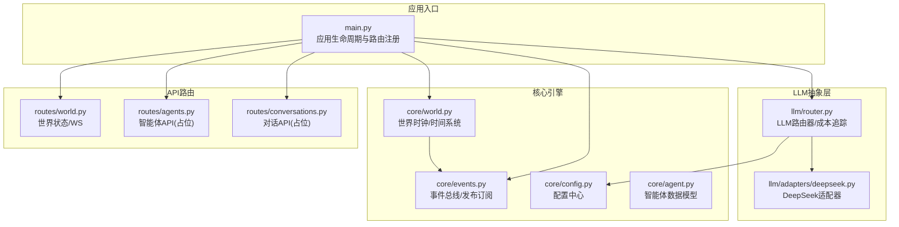
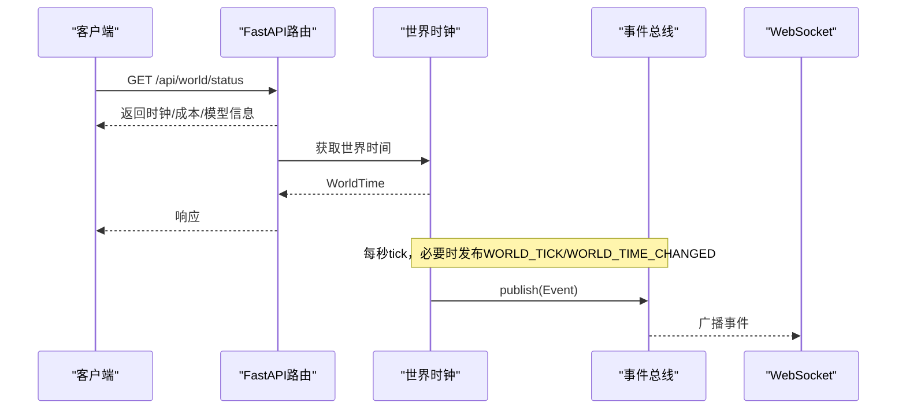
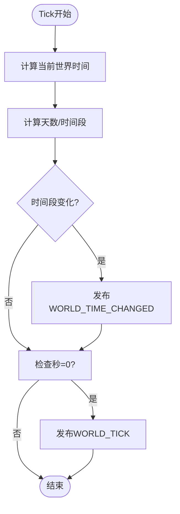
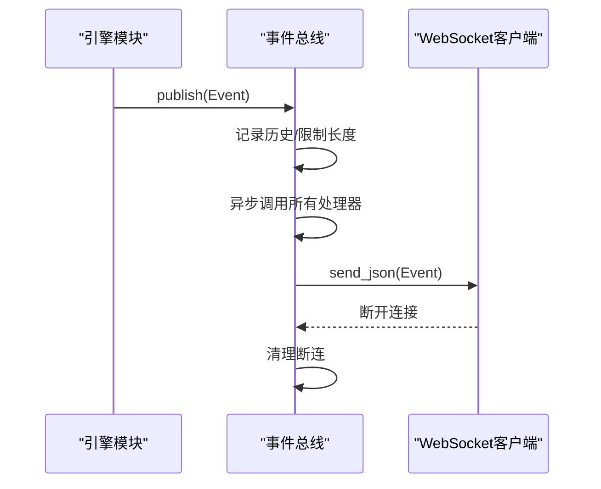
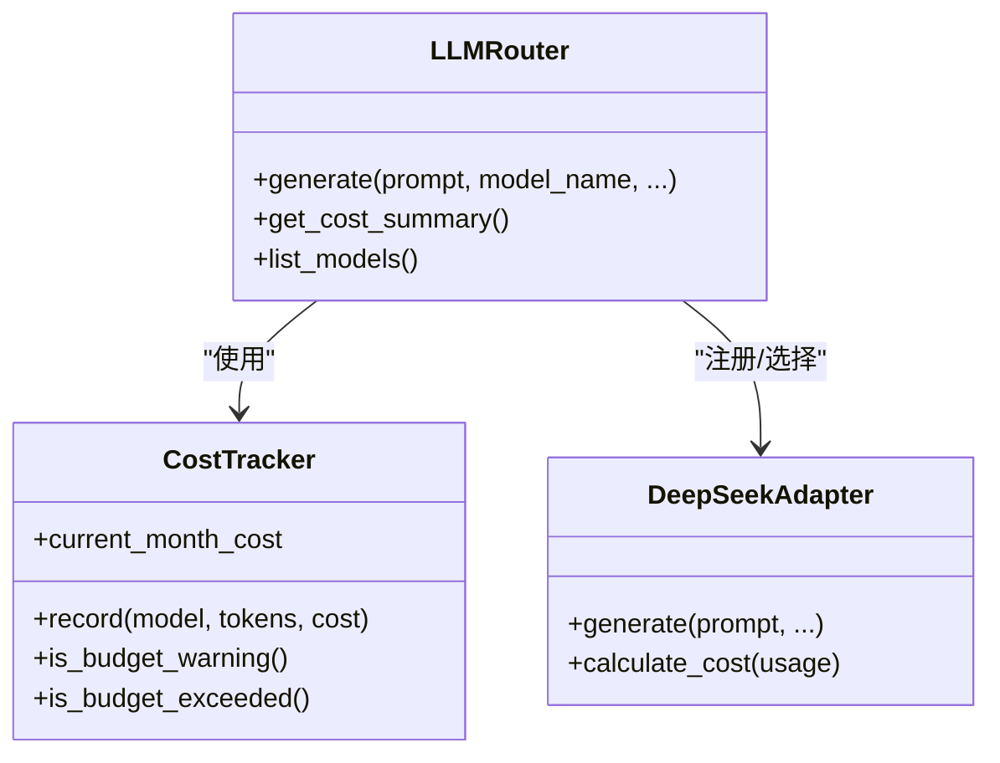
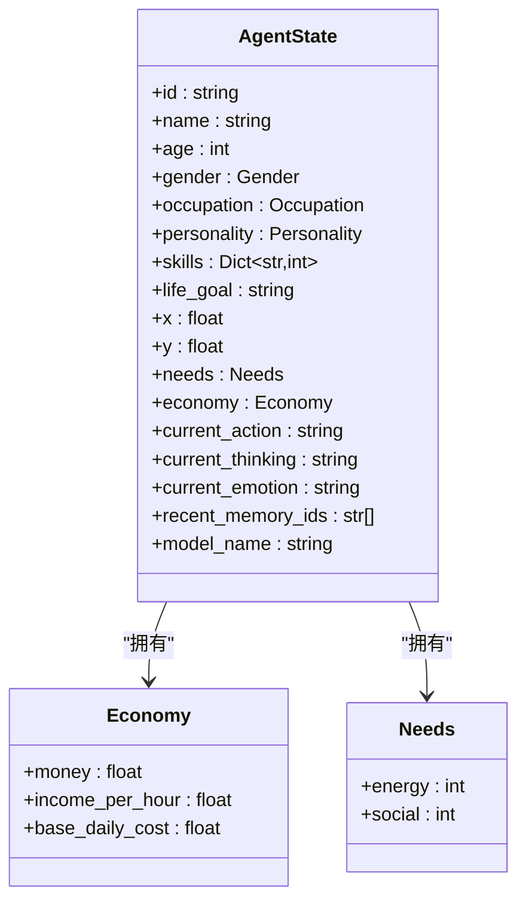
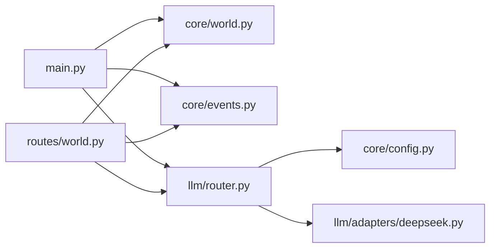

# 调试与问题排查

<cite>
**本文档引用的文件**
- [backend/app/main.py](file://backend/app/main.py)
- [backend/app/core/world.py](file://backend/app/core/world.py)
- [backend/app/core/events.py](file://backend/app/core/events.py)
- [backend/app/core/config.py](file://backend/app/core/config.py)
- [backend/app/core/agent.py](file://backend/app/core/agent.py)
- [backend/app/llm/router.py](file://backend/app/llm/router.py)
- [backend/app/llm/adapters/deepseek.py](file://backend/app/llm/adapters/deepseek.py)
- [backend/app/routes/world.py](file://backend/app/routes/world.py)
- [backend/app/routes/agents.py](file://backend/app/routes/agents.py)
- [backend/app/routes/conversations.py](file://backend/app/routes/conversations.py)
- [specs/00-project-overview.spec.md](file://specs/00-project-overview.spec.md)
- [specs/01-architecture.spec.md](file://specs/01-architecture.spec.md)
- [specs/03-economy-system.spec.md](file://specs/03-economy-system.spec.md)
- [specs/04-conversation-system.spec.md](file://specs/04-conversation-system.spec.md)
</cite>

## 目录
1. [简介](#简介)
2. [项目结构](#项目结构)
3. [核心组件](#核心组件)
4. [架构总览](#架构总览)
5. [详细组件分析](#详细组件分析)
6. [依赖分析](#依赖分析)
7. [性能考虑](#性能考虑)
8. [故障排查指南](#故障排查指南)
9. [结论](#结论)
10. [附录](#附录)

## 简介
本指南面向AI Society项目的开发者与运维人员，提供系统性的调试与问题排查方法。内容涵盖：
- 智能体异常行为排查
- 经济系统数据异常处理
- 对话系统通信故障排除
- 日志分析方法、性能瓶颈识别、内存泄漏检测
- 常见问题解决方案、错误代码含义说明、系统监控指标解读
- 开发工具使用技巧与生产环境问题处理流程

## 项目结构
后端采用FastAPI应用，核心围绕“世界时钟”“事件总线”“LLM路由器”三大引擎展开，并通过REST API与WebSocket对外提供服务。

**图表来源**
- [backend/app/main.py](file://backend/app/main.py#L26-L98)
- [backend/app/core/world.py](file://backend/app/core/world.py#L73-L292)
- [backend/app/core/events.py](file://backend/app/core/events.py#L88-L269)
- [backend/app/core/config.py](file://backend/app/core/config.py#L19-L175)
- [backend/app/core/agent.py](file://backend/app/core/agent.py#L25-L92)
- [backend/app/llm/router.py](file://backend/app/llm/router.py#L89-L224)
- [backend/app/llm/adapters/deepseek.py](file://backend/app/llm/adapters/deepseek.py#L24-L160)
- [backend/app/routes/world.py](file://backend/app/routes/world.py#L15-L110)
- [backend/app/routes/agents.py](file://backend/app/routes/agents.py#L19-L175)
- [backend/app/routes/conversations.py](file://backend/app/routes/conversations.py#L17-L124)

**章节来源**
- [specs/01-architecture.spec.md](file://specs/01-architecture.spec.md#L1-L255)
- [specs/00-project-overview.spec.md](file://specs/00-project-overview.spec.md#L1-L46)

## 核心组件
- 世界时钟：负责时间推进、事件广播、暂停/恢复/缩放控制。
- 事件总线：发布订阅模式，承载世界事件、智能体事件、对话事件、经济事件等。
- LLM路由器：统一路由与成本控制，支持预算预警/超支保护。
- 配置中心：集中管理运行参数，支持环境变量覆盖。
- 智能体数据模型：定义AgentState、AgentDecision、AgentContext等核心数据结构。

**章节来源**
- [backend/app/core/world.py](file://backend/app/core/world.py#L73-L292)
- [backend/app/core/events.py](file://backend/app/core/events.py#L88-L269)
- [backend/app/llm/router.py](file://backend/app/llm/router.py#L89-L224)
- [backend/app/core/config.py](file://backend/app/core/config.py#L19-L175)
- [backend/app/core/agent.py](file://backend/app/core/agent.py#L25-L92)

## 架构总览
系统采用“世界循环”驱动：每游戏内固定周期推进时间、更新智能体状态、触发对话与事件广播。LLM调用通过路由器统一接入，成本与预算受控。

**图表来源**
- [backend/app/routes/world.py](file://backend/app/routes/world.py#L18-L44)
- [backend/app/core/world.py](file://backend/app/core/world.py#L235-L277)
- [backend/app/core/events.py](file://backend/app/core/events.py#L167-L195)

## 详细组件分析

### 世界时钟与时间系统
- 时间推进：基于现实时间与缩放比例计算游戏内时间；支持暂停、恢复、动态调整缩放。
- 事件广播：每tick检查时间段变化并发布世界时间变更事件；每分钟发布tick事件。
- 状态查询：提供REST接口查询当前时间、暂停/恢复、设置缩放。

**图表来源**
- [backend/app/core/world.py](file://backend/app/core/world.py#L249-L277)

**章节来源**
- [backend/app/core/world.py](file://backend/app/core/world.py#L73-L292)
- [backend/app/routes/world.py](file://backend/app/routes/world.py#L35-L88)

### 事件总线与实时通信
- 发布订阅：事件类型枚举化，处理器异步执行，异常隔离。
- 历史记录：可配置历史长度，支持按类型过滤与回放。
- WebSocket：注册/注销连接，事件广播，断连清理。

**图表来源**
- [backend/app/core/events.py](file://backend/app/core/events.py#L167-L239)

**章节来源**
- [backend/app/core/events.py](file://backend/app/core/events.py#L88-L269)
- [backend/app/routes/world.py](file://backend/app/routes/world.py#L90-L110)

### LLM路由器与成本控制
- 多模型路由：按模型名选择适配器，支持默认模型与动态切换。
- 成本追踪：按月统计调用成本，支持预算预警与超支保护。
- 适配器：DeepSeek适配器通过OpenAI兼容接口调用，支持推理token计费。

**图表来源**
- [backend/app/llm/router.py](file://backend/app/llm/router.py#L89-L224)
- [backend/app/llm/adapters/deepseek.py](file://backend/app/llm/adapters/deepseek.py#L24-L160)

**章节来源**
- [backend/app/llm/router.py](file://backend/app/llm/router.py#L89-L224)
- [backend/app/llm/adapters/deepseek.py](file://backend/app/llm/adapters/deepseek.py#L24-L160)

### 智能体数据模型
- AgentState：包含身份、位置、需求、经济、情绪、近期记忆索引、模型名等。
- AgentDecision/AgentContext：用于决策与上下文构建。
- 与经济系统、对话系统协同，支撑行为决策与交互。

**图表来源**
- [backend/app/core/agent.py](file://backend/app/core/agent.py#L25-L92)

**章节来源**
- [backend/app/core/agent.py](file://backend/app/core/agent.py#L25-L92)

### 经济系统数据异常处理（概念）
- 收入/支出/被动收入/固定成本计算逻辑清晰，支持按职业与技能加成。
- 每日结算触发，检查经济状态并影响行为倾向。
- 建议在实现阶段增加边界校验、事务一致性与审计日志。

**章节来源**
- [specs/03-economy-system.spec.md](file://specs/03-economy-system.spec.md#L31-L157)

### 对话系统通信故障排除（概念）
- 触发机制：距离、停留时长、关系亲疏、外向性、社交需求等综合概率。
- 对话状态机：greeting/active/closing/ended，支持话题记忆与情绪检测。
- 群聊轮转：按被@、外向性权重、最久未说话者选择发言人。
- 建议在实现阶段加强提示词稳定性、超时与中断处理、消息去重与顺序校验。

**章节来源**
- [specs/04-conversation-system.spec.md](file://specs/04-conversation-system.spec.md#L16-L241)

## 依赖分析
- 应用生命周期：main.py在启动时初始化世界时钟与事件总线，关闭时清理资源。
- 路由依赖：世界路由依赖事件总线与LLM路由器；智能体/对话路由为占位，后续实现将依赖核心引擎。
- 配置依赖：世界时钟、LLM路由器、适配器均从配置中心读取参数。

**图表来源**
- [backend/app/main.py](file://backend/app/main.py#L26-L98)
- [backend/app/routes/world.py](file://backend/app/routes/world.py#L15-L110)
- [backend/app/llm/router.py](file://backend/app/llm/router.py#L89-L224)

**章节来源**
- [backend/app/main.py](file://backend/app/main.py#L26-L98)
- [backend/app/routes/world.py](file://backend/app/routes/world.py#L15-L110)

## 性能考虑
- 事件总线异步处理：避免阻塞，建议为耗时处理器单独线程池或限速。
- LLM调用频率：按规格目标，每智能体每固定周期最多一次，避免过度调用。
- WebSocket广播：批量/节流发送，断连清理及时，避免内存泄漏。
- 时间缩放与并发：大并发下建议分片/限速，避免CPU争用。

[本节为通用指导，无需具体文件引用]

## 故障排查指南

### 一、智能体异常行为排查
- 现象：智能体行为不符合预期（如长时间不动、重复动作）。
- 排查步骤：
  1) 检查世界时钟是否正常tick与暂停状态。
  2) 查看事件总线是否正确发布“AGENT_DECIDED/AGENT_ACTION/AGENT_MOVED”等事件。
  3) 核对智能体状态字段（位置、需求、情绪、模型名）是否合理。
  4) 若涉及LLM决策，检查LLM路由器是否超预算、适配器是否可用。
- 常见原因：
  - 世界时钟被暂停或缩放异常。
  - 事件处理器抛错导致后续处理中断。
  - 智能体数据越界（如坐标/需求/金钱）。
  - LLM调用失败或成本超支。

**章节来源**
- [backend/app/core/world.py](file://backend/app/core/world.py#L205-L234)
- [backend/app/core/events.py](file://backend/app/core/events.py#L196-L208)
- [backend/app/core/agent.py](file://backend/app/core/agent.py#L48-L76)
- [backend/app/llm/router.py](file://backend/app/llm/router.py#L183-L189)

### 二、经济系统数据异常处理
- 现象：余额异常波动、支出未扣、收入未入账。
- 排查步骤：
  1) 检查每日结算触发频率与时点。
  2) 对比固定支出、被动收入与最终余额变化。
  3) 核对经济状态分级与行为修正系数是否生效。
  4) 审计交易记录（若实现），确保收支方向与金额正确。
- 建议：
  - 在结算前后打印关键数值，便于对比。
  - 对极端值（负余额）做保护与告警。

**章节来源**
- [specs/03-economy-system.spec.md](file://specs/03-economy-system.spec.md#L91-L157)

### 三、对话系统通信故障排除
- 现象：对话无法触发、消息丢失、情绪/话题解析异常。
- 排查步骤：
  1) 检查对话触发条件（距离、停留、关系、外向性、社交需求）。
  2) 确认事件总线是否发布“CONVERSATION_STARTED/MESSAGE/ENDED”。
  3) 校验WebSocket连接状态与消息序列。
  4) 检查提示词模板与LLM响应解析（去“[END]”、情绪关键词、话题关键字）。
- 建议：
  - 为对话状态机增加超时与打断处理。
  - 对群聊@提及做容错与回退策略。

**章节来源**
- [specs/04-conversation-system.spec.md](file://specs/04-conversation-system.spec.md#L16-L241)
- [backend/app/core/events.py](file://backend/app/core/events.py#L167-L195)

### 四、日志分析方法
- 日志级别：通过配置中心设置日志级别与输出目标。
- 关键日志点：
  - 世界时钟：初始化、暂停/恢复、缩放调整、tick事件。
  - 事件总线：发布事件、处理器异常、WebSocket连接/断开。
  - LLM路由器：模型选择、预算预警/超支、成本记录。
- 建议：
  - 使用结构化日志字段（事件类型、时间、来源、耗时）。
  - 对高频事件做采样或聚合统计。

**章节来源**
- [backend/app/core/config.py](file://backend/app/core/config.py#L150-L157)
- [backend/app/core/world.py](file://backend/app/core/world.py#L119-L122)
- [backend/app/core/events.py](file://backend/app/core/events.py#L176-L208)
- [backend/app/llm/router.py](file://backend/app/llm/router.py#L188-L189)

### 五、性能瓶颈识别
- CPU瓶颈：LLM调用密集、事件处理器同步阻塞。
- IO瓶颈：数据库/向量库/Redis写入延迟、WebSocket广播堆积。
- 内存增长：事件历史过长、WebSocket连接未清理、缓存未淘汰。
- 识别手段：
  - 监控API响应时间、WebSocket延迟、LLM调用频率与成本。
  - 分析事件总线处理器耗时分布，定位慢处理器。
  - 对比不同时间缩放下系统吞吐，评估线性度。

**章节来源**
- [specs/01-architecture.spec.md](file://specs/01-architecture.spec.md#L245-L255)

### 六、内存泄漏检测
- 症状：RSS持续上升、GC不回收、连接数异常增长。
- 检测方法：
  - 定期快照进程内存，对比事件历史长度与WebSocket连接数。
  - 检查事件总线断连清理逻辑是否生效。
  - 核查LLM适配器与HTTP客户端连接池是否正确释放。
- 预防措施：
  - 限制事件历史最大长度，定期清理。
  - WebSocket断连后立即从集合移除。
  - 使用上下文管理器确保资源释放。

**章节来源**
- [backend/app/core/events.py](file://backend/app/core/events.py#L241-L264)
- [backend/app/llm/adapters/deepseek.py](file://backend/app/llm/adapters/deepseek.py#L58-L64)

### 七、常见问题与解决方案
- 问题：LLM调用报“预算超支”
  - 解决：等待下月或提升预算；检查CostTracker阈值。
- 问题：世界时钟无法暂停/恢复
  - 解决：确认调用pause()/resume()返回状态；检查_is_paused/_pause_time。
- 问题：WebSocket消息丢失
  - 解决：检查断连清理逻辑；确认事件总线广播成功。
- 问题：智能体位置异常
  - 解决：核对AgentState.x/y与移动事件；检查地图边界。

**章节来源**
- [backend/app/llm/router.py](file://backend/app/llm/router.py#L184-L189)
- [backend/app/core/world.py](file://backend/app/core/world.py#L205-L220)
- [backend/app/core/events.py](file://backend/app/core/events.py#L219-L229)
- [backend/app/core/agent.py](file://backend/app/core/agent.py#L58-L62)

### 八、错误代码与含义说明
- 世界路由：
  - POST /pause：返回暂停状态与时钟信息。
  - POST /resume：返回恢复状态与时钟信息。
  - POST /time-scale/{scale}：设置缩放比例，越界返回错误消息。
- 智能体/对话路由（占位）：
  - 当前返回“TODO”，后续实现将提供真实状态与数据。

**章节来源**
- [backend/app/routes/world.py](file://backend/app/routes/world.py#L46-L88)
- [backend/app/routes/agents.py](file://backend/app/routes/agents.py#L105-L132)
- [backend/app/routes/conversations.py](file://backend/app/routes/conversations.py#L76-L110)

### 九、系统监控指标解读
- 世界时钟：time_scale、is_running、is_paused、当前时间格式化。
- 成本统计：月预算、当月成本、剩余预算、预算使用百分比、是否预警/超支。
- 模型列表：各模型定价信息，便于成本对比。
- WebSocket：连接数、消息发送/断连统计。

**章节来源**
- [backend/app/routes/world.py](file://backend/app/routes/world.py#L18-L32)
- [backend/app/llm/router.py](file://backend/app/llm/router.py#L210-L219)
- [backend/app/llm/router.py](file://backend/app/llm/router.py#L89-L112)

### 十、开发工具使用技巧
- 启动与调试：
  - 使用main.py提供的uvicorn运行参数，结合debug开关。
  - CORS在开发环境允许跨域，生产需限制来源。
- 日志：
  - 通过配置中心设置log_level与log_file，便于本地与容器化日志收集。
- API文档：
  - 访问/doc或/redoc查看自动生成的接口文档。

**章节来源**
- [backend/app/main.py](file://backend/app/main.py#L67-L98)
- [backend/app/core/config.py](file://backend/app/core/config.py#L150-L157)

### 十一、生产环境问题处理流程
- 快速止损：
  - 暂停世界时钟，避免进一步负载。
  - 降级LLM模型或临时禁用高成本功能。
- 事件回放：
  - 从事件总线历史按类型过滤，定位异常节点。
- 资源回收：
  - 清理断连WebSocket、限制事件历史长度、释放LLM连接池。
- 恢复与验证：
  - 逐步恢复服务，观察关键指标与日志，确认无异常后再扩大流量。

**章节来源**
- [backend/app/core/world.py](file://backend/app/core/world.py#L274-L277)
- [backend/app/core/events.py](file://backend/app/core/events.py#L261-L264)

## 结论
本指南提供了从架构、组件到实践的全链路调试方法。建议在开发与生产环境中：
- 明确日志规范与监控指标
- 严格控制LLM成本与调用频率
- 保障事件总线与WebSocket的健壮性
- 建立问题快速止损与恢复流程

[本节为总结，无需具体文件引用]

## 附录
- 术语
  - 世界时间：由世界时钟维护的游戏内时间，受现实时间与缩放比例影响。
  - 事件总线：发布订阅模式的事件通道，承载系统内各模块解耦通信。
  - LLM路由器：统一LLM调用入口，负责模型选择、成本追踪与预算控制。
- 参考文档
  - 项目概览与技术约束
  - 系统架构与目录结构
  - 经济系统与对话系统规格

**章节来源**
- [specs/00-project-overview.spec.md](file://specs/00-project-overview.spec.md#L1-L46)
- [specs/01-architecture.spec.md](file://specs/01-architecture.spec.md#L1-L255)
- [specs/03-economy-system.spec.md](file://specs/03-economy-system.spec.md#L1-L418)
- [specs/04-conversation-system.spec.md](file://specs/04-conversation-system.spec.md#L1-L581)