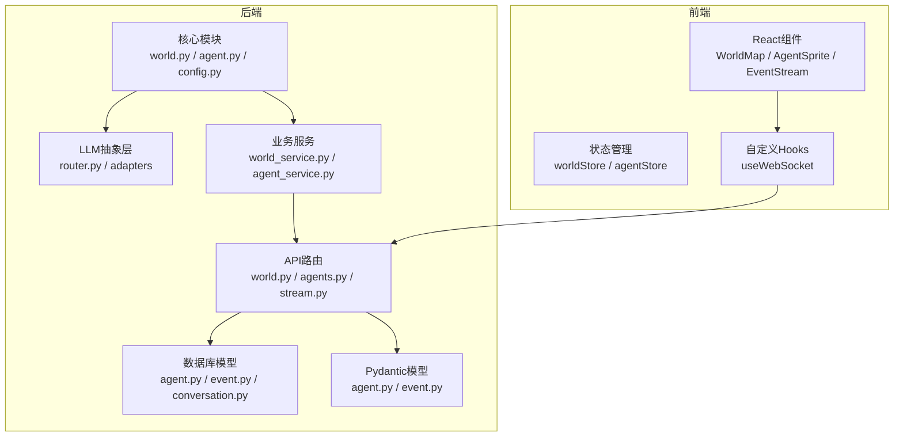
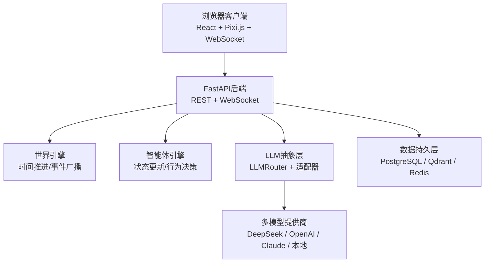
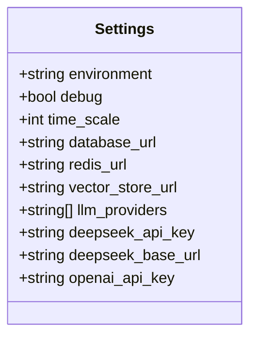
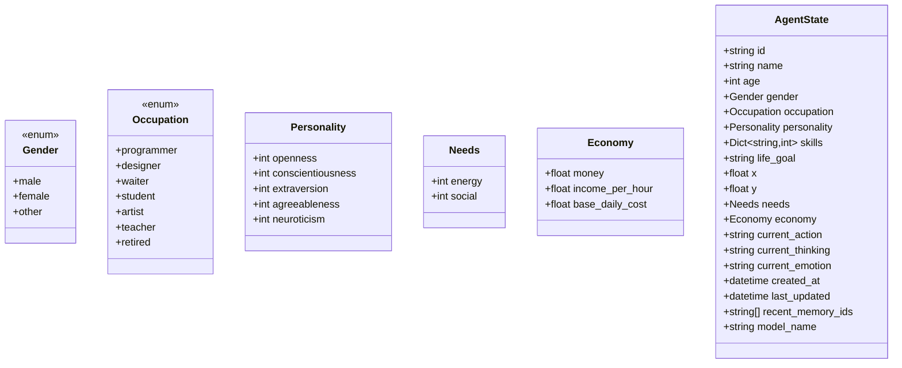
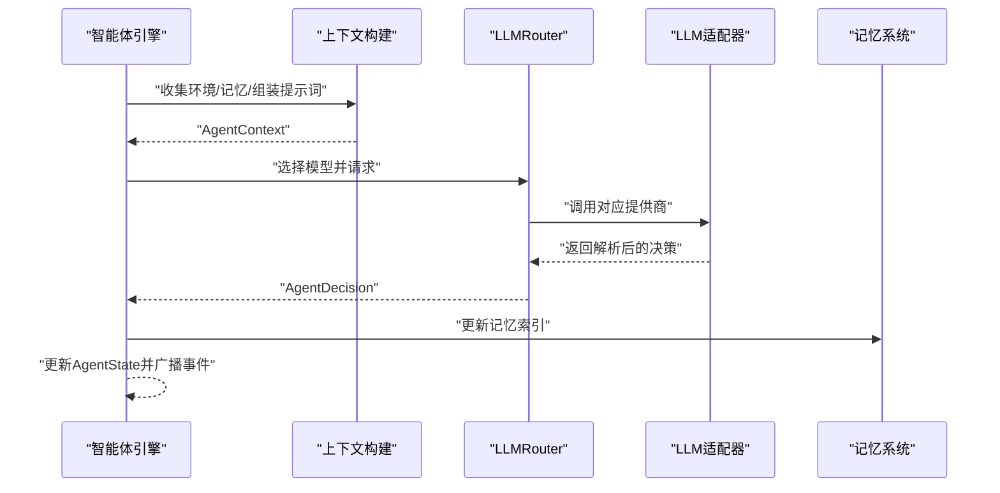
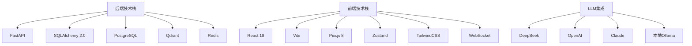

# 快速开始

<cite>
**本文引用的文件**
- [项目概览](file://specs/00-project-overview.spec.md)
- [系统架构](file://specs/01-architecture.spec.md)
- [配置管理](file://backend/app/core/config.py)
- [智能体数据模型](file://backend/app/core/agent.py)
</cite>

## 目录
1. [简介](#简介)
2. [项目结构](#项目结构)
3. [核心组件](#核心组件)
4. [架构总览](#架构总览)
5. [详细组件分析](#详细组件分析)
6. [依赖分析](#依赖分析)
7. [性能考虑](#性能考虑)
8. [故障排除指南](#故障排除指南)
9. [结论](#结论)
10. [附录](#附录)

## 简介
本指南面向新手开发者，帮助你在30分钟内完成AI Society项目的环境搭建与首次运行。你将学到：
- 如何准备Python环境与依赖
- 如何配置数据库与向量存储
- 如何设置LLM API密钥
- 如何启动后端与前端
- 如何观察智能体行为与系统状态
- 常见问题的排查方法

## 项目结构
AI Society采用前后端分离架构，后端基于FastAPI，前端基于React，核心逻辑位于后端的app目录中。项目包含以下关键部分：
- 后端核心模块：世界引擎、智能体引擎、经济系统、事件总线、LLM抽象层
- 前端组件：世界地图、智能体精灵、事件流面板、统计面板
- 规格文档：项目概览、系统架构、功能规范等

**图表来源**
- [系统架构](file://specs/01-architecture.spec.md#L92-L169)

**章节来源**
- [系统架构](file://specs/01-architecture.spec.md#L92-L169)

## 核心组件
- 配置管理：集中管理环境变量、数据库连接、Redis、向量库以及LLM提供商列表与密钥。
- 智能体数据模型：定义性别、职业、个性、需求、经济状态、当前行动与思考等字段。
- 世界引擎：负责时间推进、事件触发与世界状态更新。
- 智能体引擎：负责智能体的状态更新、行为决策与社交互动。
- LLM抽象层：统一多模型路由与适配器接口，支持DeepSeek、OpenAI等。

**章节来源**
- [配置管理](file://backend/app/core/config.py#L7-L41)
- [智能体数据模型](file://backend/app/core/agent.py#L9-L92)

## 架构总览
下图展示了从浏览器到后端再到数据层的整体交互路径，以及LLM调用的关键流程。

**图表来源**
- [系统架构](file://specs/01-architecture.spec.md#L3-L57)
- [系统架构](file://specs/01-architecture.spec.md#L198-L220)

**章节来源**
- [系统架构](file://specs/01-architecture.spec.md#L3-L57)
- [系统架构](file://specs/01-architecture.spec.md#L198-L220)

## 详细组件分析

### 配置管理（Settings）
- 环境与调试：通过环境变量切换开发/生产模式，并启用调试。
- 时间缩放：现实1分钟对应程序内10分钟的时间倍率。
- 数据库与缓存：默认使用SQLite（开发），可替换为PostgreSQL；Redis用于缓存与消息队列。
- 向量存储：预留Qdrant地址，用于向量记忆。
- LLM提供商：预设DeepSeek与OpenAI，支持注册多个模型别名。
- API密钥：支持DeepSeek与OpenAI的API密钥注入。

**图表来源**
- [配置管理](file://backend/app/core/config.py#L7-L41)

**章节来源**
- [配置管理](file://backend/app/core/config.py#L7-L41)

### 智能体数据模型
- 性别与职业枚举：支持多种职业与性别选项。
- 个性维度：开放性、尽责性、外向性、宜人性、神经质。
- 需求与经济：包含能量、社交需求，以及金钱、收入与日均开销。
- 状态字段：当前位置、当前行动、思考内容、情绪、创建与更新时间。
- 记忆索引：最近记忆ID列表，便于检索。
- 模型选择：每个智能体可配置使用的LLM模型别名。

**图表来源**
- [智能体数据模型](file://backend/app/core/agent.py#L9-L92)

**章节来源**
- [智能体数据模型](file://backend/app/core/agent.py#L9-L92)

### LLM调用流程
当智能体需要复杂决策时，系统会：
1. 构建上下文：收集环境信息、检索相关记忆、组装提示词。
2. 路由到模型：根据智能体配置选择对应LLM提供商。
3. 解析响应：提取动作、目标与原因，验证合法性。
4. 执行决策：更新智能体状态、记录记忆并广播事件。

**图表来源**
- [系统架构](file://specs/01-architecture.spec.md#L198-L220)

**章节来源**
- [系统架构](file://specs/01-architecture.spec.md#L198-L220)

## 依赖分析
- 后端技术栈：FastAPI（异步、类型安全）、SQLAlchemy 2.0（异步ORM）、PostgreSQL（结构化数据）、Qdrant（向量记忆）、Redis（缓存与消息队列）。
- 前端技术栈：React 18、Vite、Pixi.js 8（2D渲染）、Zustand（状态管理）、TailwindCSS（样式）、WebSocket（实时通信）。
- LLM集成：支持DeepSeek、OpenAI、Claude与本地Ollama，具备路由与适配能力。

**图表来源**
- [系统架构](file://specs/01-architecture.spec.md#L59-L91)

**章节来源**
- [系统架构](file://specs/01-architecture.spec.md#L59-L91)

## 性能考虑
- 智能体数量：目标50-200个，需关注内存占用与并发处理。
- 前端帧率：目标60fps，注意精灵数量与渲染优化。
- API响应时间：目标小于100ms，避免阻塞IO。
- WebSocket延迟：目标小于50ms，保证实时性。
- LLM调用频率：建议每智能体每10分钟最多1次，降低成本与延迟。

**章节来源**
- [系统架构](file://specs/01-architecture.spec.md#L238-L247)

## 故障排除指南
- 环境变量未生效
  - 症状：数据库连接失败或LLM调用报错。
  - 排查：确认已正确设置DATABASE_URL、REDIS_URL、VECTOR_STORE_URL、DEEPSEEK_API_KEY、OPENAI_API_KEY等。
  - 参考：配置项定义与默认值。
- 数据库无法连接
  - 症状：启动时报数据库错误。
  - 排查：若使用SQLite，请确认路径存在且可写；如使用PostgreSQL，请检查主机、端口、用户名与密码。
  - 参考：数据库URL配置。
- LLM调用失败
  - 症状：智能体无法生成决策或报错。
  - 排查：确认API密钥有效、网络可达、模型别名与提供商一致。
  - 参考：LLM提供商列表与密钥配置。
- 前端无法连接后端
  - 症状：页面空白或WebSocket连接失败。
  - 排查：确认后端监听地址与端口、CORS配置、代理转发（如使用Nginx）。
- 性能瓶颈
  - 症状：帧率下降、响应变慢。
  - 排查：减少智能体数量、优化渲染、合并事件广播、使用Redis缓存热点数据。

**章节来源**
- [配置管理](file://backend/app/core/config.py#L15-L37)

## 结论
通过本指南，你已经了解了AI Society的核心架构、关键组件与配置要点。按照“环境搭建—依赖安装—数据库与LLM配置—启动后端与前端—观察系统”的流程，可以在30分钟内完成首次运行。后续可根据需要扩展LLM模型、新增智能体行为与地图区域，并持续优化性能与稳定性。

## 附录

### 快速开始清单（30分钟）
- 准备Python 3.10+与pip环境
- 克隆仓库并进入项目根目录
- 创建虚拟环境并激活
- 安装后端依赖
- 设置环境变量（数据库、Redis、向量库、LLM密钥）
- 初始化数据库（如使用PostgreSQL）
- 启动后端服务
- 安装前端依赖并启动前端
- 打开浏览器访问前端页面，观察智能体行为
- 查看系统状态与事件流，进行基础配置

### 基本使用示例
- 观察智能体行为：在前端世界地图上查看智能体移动、交互与事件流。
- 查看系统状态：通过事件流面板与统计面板了解世界时间、智能体总数与平均情绪。
- 基础配置：在后端配置文件中调整时间缩放、LLM提供商与默认模型别名。

**章节来源**
- [项目概览](file://specs/00-project-overview.spec.md#L1-L46)
- [系统架构](file://specs/01-architecture.spec.md#L171-L196)