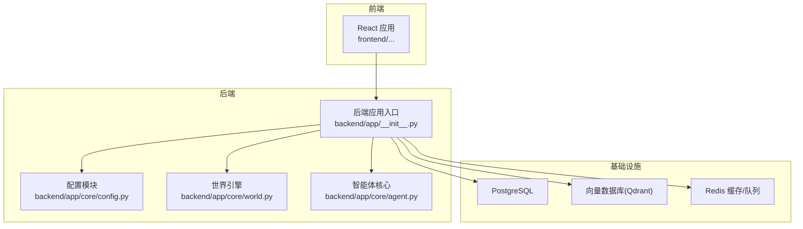
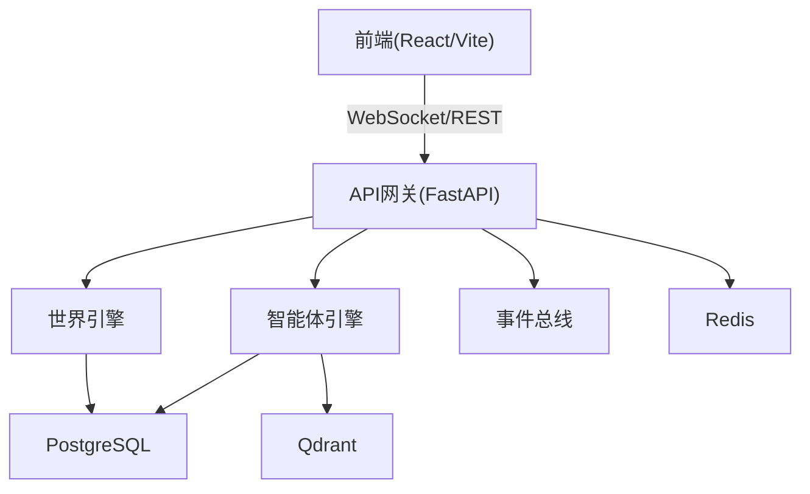
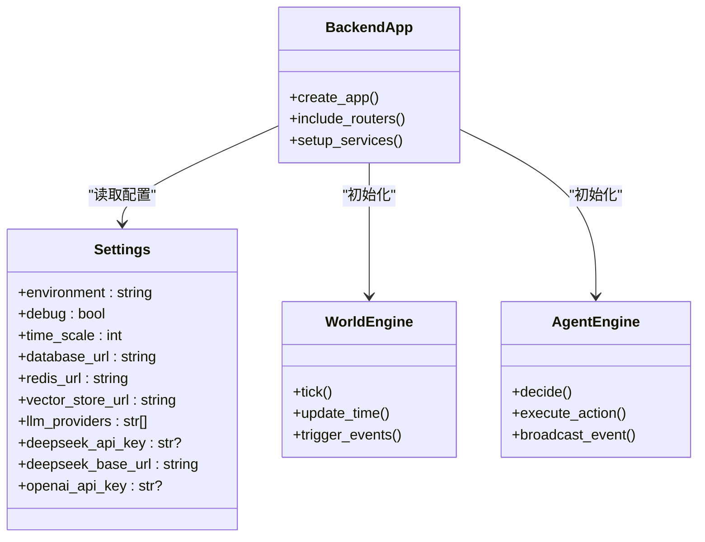
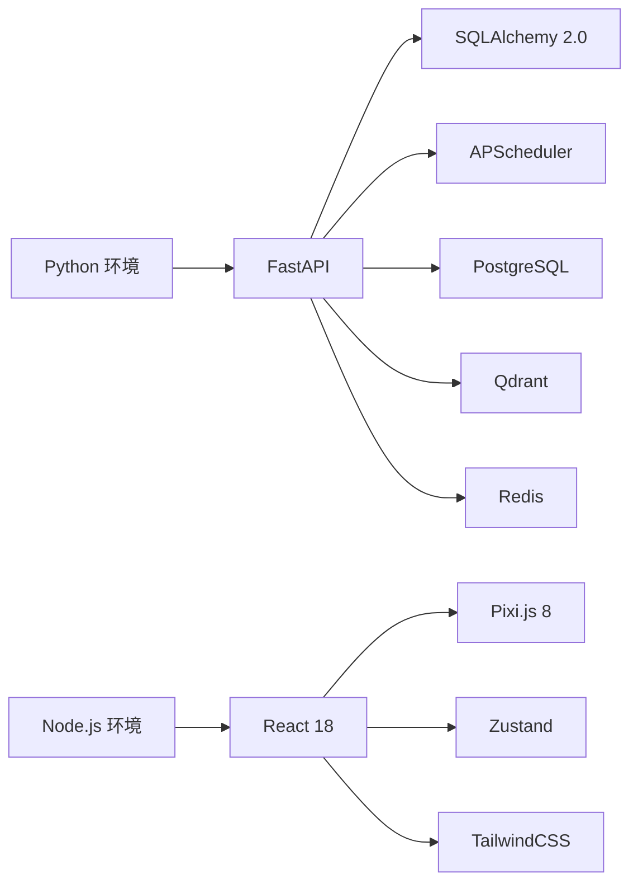

# 安装问题

<cite>
**本文引用的文件**
- [项目概览规范](file://specs/00-project-overview.spec.md)
- [系统架构规范](file://specs/01-architecture.spec.md)
- [后端配置模块](file://backend/app/core/config.py)
- [后端应用入口](file://backend/app/__init__.py)
- [智能体核心模块](file://backend/app/core/agent.py)
- [世界引擎模块](file://backend/app/core/world.py)
</cite>

## 目录
1. [简介](#简介)
2. [项目结构](#项目结构)
3. [核心组件](#核心组件)
4. [架构总览](#架构总览)
5. [详细组件分析](#详细组件分析)
6. [依赖关系分析](#依赖关系分析)
7. [性能考虑](#性能考虑)
8. [故障排除指南](#故障排除指南)
9. [结论](#结论)

## 简介
本指南面向首次安装与运行 AI Society 项目的用户，聚焦安装阶段常见问题的系统化排查路径，覆盖 Python 环境配置、依赖安装、数据库与缓存服务启动、Docker 容器启动异常、Node.js 版本要求、Python 版本要求、权限与网络代理、防火墙设置，以及 Windows/macOS/Linux 的差异化注意事项。文档以项目规格与现有代码为依据，提供可操作的检查清单与修复步骤。

## 项目结构
AI Society 采用前后端分离与容器化部署策略：
- 后端基于 Python + FastAPI，核心逻辑位于 backend/app，包含配置、世界引擎、智能体引擎等模块。
- 前端基于 React + Vite，位于 frontend 目录（根据规格文档描述）。
- 项目提供 docker-compose.yml 与 Dockerfile（规格文档中列出），用于一键启动后端与数据库服务。
- 环境变量通过 .env.example 提供模板，后端配置模块使用 Pydantic 设置默认值与环境变量映射。

**图表来源**
- [系统架构规范](file://specs/01-architecture.spec.md#L92-L169)
- [后端配置模块](file://backend/app/core/config.py#L15-L22)

**章节来源**
- [系统架构规范](file://specs/01-architecture.spec.md#L92-L169)

## 核心组件
- 配置模块负责读取环境变量并提供默认值，涵盖数据库连接、Redis 连接、向量数据库地址及 LLM 提供商列表等。
- 世界引擎与智能体核心模块是后端业务主干，负责世界循环与智能体行为决策。
- 应用入口模块作为 FastAPI 应用工厂，承载路由与服务初始化。

**章节来源**
- [后端配置模块](file://backend/app/core/config.py#L7-L41)
- [后端应用入口](file://backend/app/__init__.py#L1-L50)
- [智能体核心模块](file://backend/app/core/agent.py#L1-L50)
- [世界引擎模块](file://backend/app/core/world.py#L1-L50)

## 架构总览
系统采用分层架构：前端通过 WebSocket 与 REST API 与后端交互；后端使用 FastAPI 提供接口，内部通过事件总线驱动世界循环；数据层包含 PostgreSQL、Qdrant、Redis 等组件。

**图表来源**
- [系统架构规范](file://specs/01-architecture.spec.md#L3-L57)
- [后端配置模块](file://backend/app/core/config.py#L15-L22)

## 详细组件分析
本节聚焦安装相关的组件与配置点，帮助快速定位问题。

**图表来源**
- [后端配置模块](file://backend/app/core/config.py#L7-L41)
- [后端应用入口](file://backend/app/__init__.py#L1-L50)
- [世界引擎模块](file://backend/app/core/world.py#L1-L50)
- [智能体核心模块](file://backend/app/core/agent.py#L1-L50)

**章节来源**
- [后端配置模块](file://backend/app/core/config.py#L7-L41)
- [后端应用入口](file://backend/app/__init__.py#L1-L50)
- [智能体核心模块](file://backend/app/core/agent.py#L1-L50)
- [世界引擎模块](file://backend/app/core/world.py#L1-L50)

## 依赖关系分析
- 后端依赖：FastAPI、SQLAlchemy 2.0、APScheduler、PostgreSQL、Qdrant、Redis 等（详见架构规范）。
- 前端依赖：React 18、Vite、Pixi.js 8、Zustand、TailwindCSS 等（详见架构规范）。
- 容器化：Docker 与 docker-compose 用于标准化部署（规格文档列出）。

**图表来源**
- [系统架构规范](file://specs/01-architecture.spec.md#L59-L82)

**章节来源**
- [系统架构规范](file://specs/01-architecture.spec.md#L59-L82)

## 性能考虑
- 规模目标：支持 50-200 个智能体，前端帧率 60fps，API 响应时间 <100ms，WebSocket 延迟 <50ms。
- LLM 调用频率限制：每智能体每 10 分钟最多 1 次，避免高并发导致的资源瓶颈。
- 内存占用目标：<2GB，建议在资源受限环境中降低智能体数量或关闭高负载功能。

**章节来源**
- [系统架构规范](file://specs/01-architecture.spec.md#L238-L248)

## 故障排除指南

### 一、Python 环境配置问题
- 症状
  - Python 未安装或版本过低
  - venv/virtualenv 创建失败
  - pip 安装依赖时报错“找不到命令”或权限不足
- 检查步骤
  - 确认已安装 Python 3.10 或以上版本，并确保 python 与 pip 命令可用
  - 使用 venv 创建隔离环境，激活后再次执行依赖安装
  - 若出现权限错误，请以管理员身份运行终端或调整用户权限
- 修复建议
  - 升级 Python 至 3.10+，重新创建虚拟环境
  - 使用国内镜像源加速 pip 安装（如清华源）
  - 在 Windows 上使用 PowerShell 并启用执行策略；在 macOS/Linux 上使用 bash/zsh 并确认 PATH 正确
- 相关配置参考
  - 后端配置模块使用环境变量与默认值，确保在虚拟环境中正确加载

**章节来源**
- [后端配置模块](file://backend/app/core/config.py#L7-L41)

### 二、依赖包安装失败
- 症状
  - 安装过程中报错“找不到依赖”、“版本冲突”、“编译错误”
- 检查步骤
  - 确认 requirements.txt 存在且路径正确（规格文档中列出）
  - 清理 pip 缓存并重试安装
  - 检查网络代理设置，必要时切换至稳定网络
- 修复建议
  - 使用稳定版本的依赖，避免最新版不稳定特性
  - 如遇编译类错误，安装对应系统开发工具（如 Microsoft C++ Build Tools 在 Windows）
  - 在 Linux/macOS 上使用包管理器预装编译依赖
- 相关配置参考
  - 后端配置模块默认使用 SQLite（开发环境），生产环境需配置 PostgreSQL

**章节来源**
- [系统架构规范](file://specs/01-architecture.spec.md#L66-L69)
- [后端配置模块](file://backend/app/core/config.py#L15-L16)

### 三、数据库服务启动失败
- 症状
  - PostgreSQL 无法启动或连接失败
  - Qdrant 无法访问
  - Redis 连接超时
- 检查步骤
  - 确认 docker-compose.yml 存在并正确配置数据库服务
  - 查看容器日志，确认端口未被占用
  - 检查环境变量 DATABASE_URL、VECTOR_STORE_URL、REDIS_URL 是否指向正确主机与端口
- 修复建议
  - 修改端口避免冲突（如 5432、6333、6379）
  - 在 Windows/macOS 上确保 Docker Desktop 已启动并分配足够资源
  - 在 Linux 上检查防火墙与 SELinux 设置
- 相关配置参考
  - 后端配置模块默认使用本地地址，生产环境请替换为实际服务地址

**章节来源**
- [系统架构规范](file://specs/01-architecture.spec.md#L51-L56)
- [后端配置模块](file://backend/app/core/config.py#L15-L22)

### 四、Docker 容器启动异常
- 症状
  - 容器启动后立即退出
  - 端口映射失败或服务不可达
  - 构建镜像时报错（如缺少依赖文件）
- 检查步骤
  - 确认 docker-compose.yml 与 Dockerfile 存在（规格文档列出）
  - 查看容器日志，定位具体启动失败原因
  - 检查卷挂载路径与权限
- 修复建议
  - 在 Windows 上使用 WSL2 后端以提升兼容性
  - 在 macOS 上确保 Docker Desktop 资源充足（CPU/内存）
  - 在 Linux 上检查 Docker 服务状态与用户组权限
- 相关配置参考
  - 后端配置模块中的数据库/缓存/向量库 URL 默认指向 localhost，需与 docker-compose 网络一致

**章节来源**
- [系统架构规范](file://specs/01-architecture.spec.md#L70-L70)
- [后端配置模块](file://backend/app/core/config.py#L15-L22)

### 五、Node.js 版本要求与前端构建问题
- 症状
  - npm/yarn/pnpm 安装失败或版本不兼容
  - Vite 构建报错或热更新异常
- 检查步骤
  - 确认已安装 Node.js 18 或以上版本
  - 清理 node_modules 与缓存后重装依赖
  - 检查 package.json 中的脚本与依赖版本
- 修复建议
  - 使用 nvm/n 管理 Node.js 版本，避免全局污染
  - 在 Windows 上使用 Git Bash 或 WSL；在 macOS/Linux 上使用 zsh/bash
  - 如网络受限，配置 npm/yarn 的镜像源

**章节来源**
- [系统架构规范](file://specs/01-architecture.spec.md#L72-L81)

### 六、权限问题
- 症状
  - 文件写入失败、端口占用、Docker 权限不足
- 检查步骤
  - 在 Linux/macOS 上确认当前用户属于 docker 组
  - 在 Windows 上以管理员身份运行终端
  - 检查项目目录与数据库卷的读写权限
- 修复建议
  - 将用户加入 docker 组（Linux/macOS）
  - 在 Windows 上以管理员权限运行 PowerShell/WSL
  - 临时关闭杀软或添加白名单以避免误拦截

**章节来源**
- [系统架构规范](file://specs/01-architecture.spec.md#L70-L70)

### 七、网络代理与防火墙设置
- 症状
  - pip/npm 无法下载依赖
  - LLM 服务调用超时
- 检查步骤
  - 确认代理配置正确，或在无代理环境下测试
  - 检查本地防火墙是否阻止了数据库/缓存/向量库端口
- 修复建议
  - 配置 pip 与 npm 的镜像源
  - 在防火墙中放行 PostgreSQL(5432)/Qdrant(6333)/Redis(6379) 端口
  - 如使用企业网络，联系 IT 放行相关域名与端口

**章节来源**
- [系统架构规范](file://specs/01-architecture.spec.md#L83-L91)
- [后端配置模块](file://backend/app/core/config.py#L15-L22)

### 八、不同操作系统针对性指导
- Windows
  - 建议使用 WSL2 以获得更好的 Linux 兼容性
  - 确保 Docker Desktop 已安装并运行
  - 使用 PowerShell 并以管理员身份运行
- macOS
  - 确保 Docker Desktop 资源充足（至少 4GB 内存）
  - 使用 zsh 并正确配置 PATH
- Linux
  - 确保 Docker 服务已启动并加入 docker 组
  - 检查防火墙与 SELinux 设置

**章节来源**
- [系统架构规范](file://specs/01-architecture.spec.md#L70-L70)

### 九、常见错误信息解读与修复步骤
- “找不到模块/包”
  - 可能原因：虚拟环境未激活、pip 未安装、路径错误
  - 修复：重新创建并激活虚拟环境，确认 pip 与 python 指向同一解释器
- “端口被占用”
  - 可能原因：已有服务占用了数据库/缓存/向量库端口
  - 修复：修改 docker-compose.yml 中的端口映射或停止占用进程
- “Permission denied”
  - 可能原因：文件权限不足、Docker 权限不足
  - 修复：在 Linux/macOS 上加入 docker 组；在 Windows 上以管理员运行
- “Connection refused”
  - 可能原因：容器未启动、服务未监听、防火墙阻断
  - 修复：查看容器日志，确认服务监听地址与端口，放行防火墙

**章节来源**
- [系统架构规范](file://specs/01-architecture.spec.md#L51-L56)
- [后端配置模块](file://backend/app/core/config.py#L15-L22)

## 结论
安装阶段的问题多源于环境配置、依赖版本、服务启动与网络设置。建议按照“环境—依赖—服务—网络”的顺序逐项排查，并结合各操作系统的特性进行针对性优化。若仍无法解决，可从容器日志与后端配置入手，定位具体失败环节并采取相应修复措施。