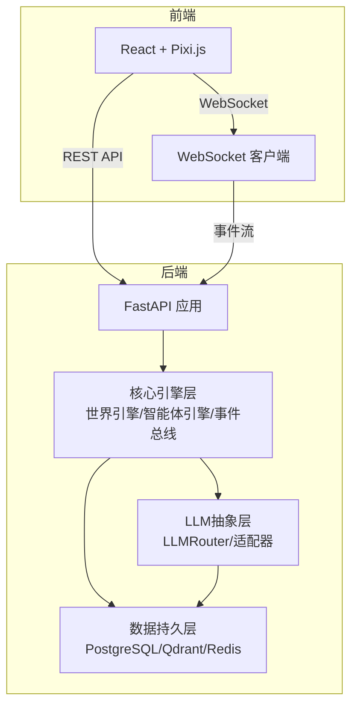
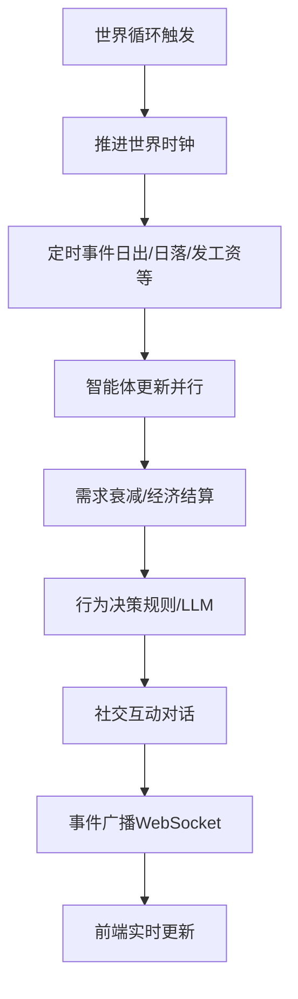
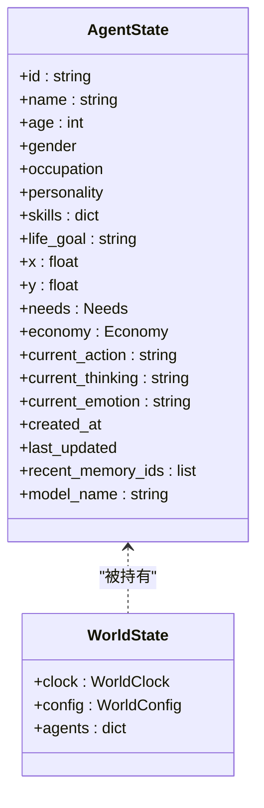
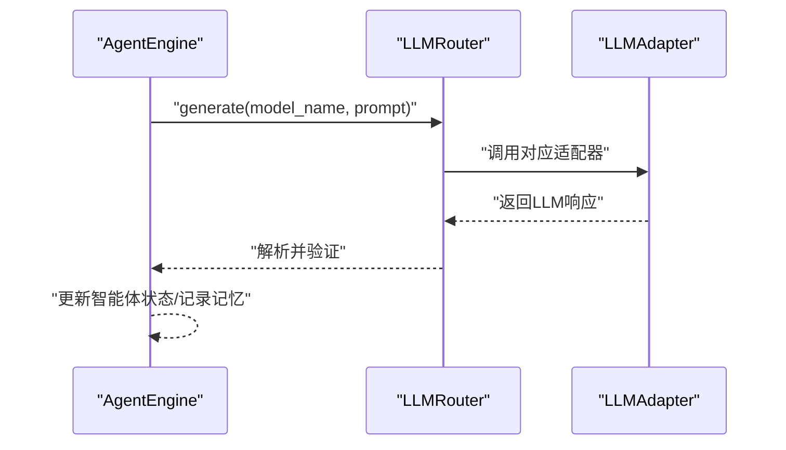
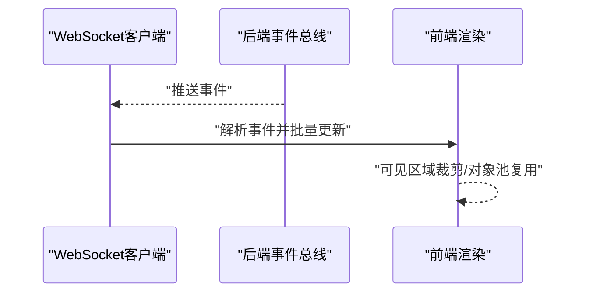
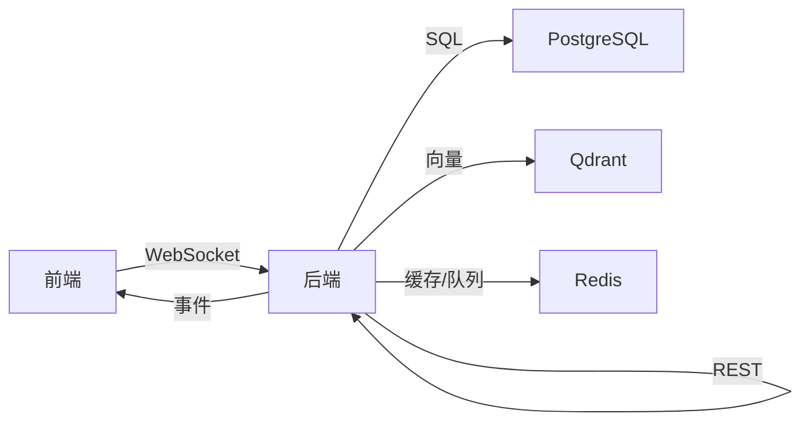

# 性能问题

<cite>
**本文引用的文件**
- [backend/app/core/agent.py](file://backend/app/core/agent.py)
- [backend/app/core/world.py](file://backend/app/core/world.py)
- [backend/app/core/config.py](file://backend/app/core/config.py)
- [specs/01-architecture.spec.md](file://specs/01-architecture.spec.md)
- [specs/07-frontend.spec.md](file://specs/07-frontend.spec.md)
- [specs/06-api-design.spec.md](file://specs/06-api-design.spec.md)
- [specs/05-world-map.spec.md](file://specs/05-world-map.spec.md)
- [specs/04-conversation-system.spec.md](file://specs/04-conversation-system.spec.md)
- [specs/03-economy-system.spec.md](file://specs/03-economy-system.spec.md)
</cite>

## 目录
1. [简介](#简介)
2. [项目结构](#项目结构)
3. [核心组件](#核心组件)
4. [架构总览](#架构总览)
5. [详细组件分析](#详细组件分析)
6. [依赖分析](#依赖分析)
7. [性能考量](#性能考量)
8. [故障排除指南](#故障排除指南)
9. [结论](#结论)
10. [附录](#附录)

## 简介
本指南聚焦于AI Society项目在高并发与大规模智能体场景下的性能问题诊断与优化。围绕以下主题展开：
- 智能体数量增加导致的性能下降与内存使用过高
- CPU占用分析、内存泄漏检测与数据库查询优化
- 前端渲染性能瓶颈、WebSocket消息堆积与LLM调用延迟
- 性能监控工具使用、基准测试与性能回归检测流程
- 负载均衡配置、资源限制调整与系统扩容建议
- 面向不同硬件配置的最佳实践

## 项目结构
后端采用分层架构：核心引擎层（世界引擎、智能体引擎、事件总线）、LLM抽象层（多模型路由）、数据持久层（PostgreSQL、Qdrant、Redis）。前端基于React + Pixi.js，通过WebSocket实时接收事件流。

**图表来源**
- [specs/01-architecture.spec.md](file://specs/01-architecture.spec.md#L1-L255)

**章节来源**
- [specs/01-architecture.spec.md](file://specs/01-architecture.spec.md#L1-L255)

## 核心组件
- AgentState：智能体状态载体，包含位置、需求、经济、近期记忆索引、所用模型等字段，是世界循环中频繁读写的热点对象。
- WorldState：世界时钟与全局智能体字典，负责维护agents映射与世界时间推进。
- Settings：集中式配置，包含时间缩放、数据库URL、Redis/向量库地址、LLM提供商列表及密钥等。

这些组件共同决定系统在高并发下的内存占用、CPU负载与IO压力。

**章节来源**
- [backend/app/core/agent.py](file://backend/app/core/agent.py#L48-L92)
- [backend/app/core/world.py](file://backend/app/core/world.py#L24-L40)
- [backend/app/core/config.py](file://backend/app/core/config.py#L7-L41)

## 架构总览
系统以“世界循环”为核心节奏，每10分钟推进一次。循环内包含时间推进、智能体更新（需求衰减、经济结算、行为决策）、社交互动与事件广播。LLM调用作为复杂决策的关键环节，需严格控制频率与成本。

**图表来源**
- [specs/01-architecture.spec.md](file://specs/01-architecture.spec.md#L180-L203)

**章节来源**
- [specs/01-architecture.spec.md](file://specs/01-architecture.spec.md#L180-L227)

## 详细组件分析

### 智能体状态与内存占用
- AgentState包含位置、需求、经济、记忆索引与模型标识等字段，随智能体数量线性增长内存占用。
- WorldState.agents为内存字典，键为智能体ID，值为AgentState实例；在高并发下需关注字典读写与序列化成本。

**图表来源**
- [backend/app/core/agent.py](file://backend/app/core/agent.py#L48-L92)
- [backend/app/core/world.py](file://backend/app/core/world.py#L30-L40)

**章节来源**
- [backend/app/core/agent.py](file://backend/app/core/agent.py#L48-L92)
- [backend/app/core/world.py](file://backend/app/core/world.py#L30-L40)

### LLM调用与路由
- LLMRouter根据AgentState.model_name路由至对应适配器（如DeepSeek、OpenAI），并进行调用频率限制与成本统计。
- 调用频率目标：每智能体每10分钟最多1次，避免API限流与成本飙升。

**图表来源**
- [specs/01-architecture.spec.md](file://specs/01-architecture.spec.md#L205-L227)

**章节来源**
- [specs/01-architecture.spec.md](file://specs/01-architecture.spec.md#L205-L227)

### 前端渲染与WebSocket事件流
- 前端使用Pixi.js进行2D渲染，采用可见区域裁剪、对象池与批量更新降低GPU/CPU压力。
- WebSocket订阅事件通道，前端按事件类型解码并更新状态，注意事件堆积时的节流与丢弃策略。

**图表来源**
- [specs/07-frontend.spec.md](file://specs/07-frontend.spec.md#L360-L407)
- [specs/06-api-design.spec.md](file://specs/06-api-design.spec.md#L411-L425)

**章节来源**
- [specs/07-frontend.spec.md](file://specs/07-frontend.spec.md#L485-L521)
- [specs/06-api-design.spec.md](file://specs/06-api-design.spec.md#L411-L425)

## 依赖分析
- 后端依赖FastAPI（异步原生）、APScheduler（后台任务）、SQLAlchemy 2.0（异步ORM）、PostgreSQL、Qdrant、Redis。
- 前端依赖React 18、Pixi.js 8、Zustand、TailwindCSS、Recharts、原生WebSocket。

**图表来源**
- [specs/01-architecture.spec.md](file://specs/01-architecture.spec.md#L59-L92)

**章节来源**
- [specs/01-architecture.spec.md](file://specs/01-architecture.spec.md#L59-L92)

## 性能考量
- 智能体数量与内存：WorldState.agents为Dict[str, AgentState]，内存占用与智能体数量近似线性关系。建议：
  - 限制最大智能体数量（WORLD_CONFIG.max_agents）
  - 使用对象池与批处理减少GC压力
- CPU占用：世界循环内并行处理智能体更新，LLM调用应串行或限速，避免CPU争用。
- 数据库查询：使用索引、分页与只读事务；对高频统计接口（如热门地点、社会统计）建立物化视图或缓存。
- 前端渲染：可见区域裁剪、精灵对象池、requestAnimationFrame合并更新。
- WebSocket：订阅粒度控制、事件压缩、背压处理与断线重连。

**章节来源**
- [specs/05-world-map.spec.md](file://specs/05-world-map.spec.md#L14-L27)
- [specs/07-frontend.spec.md](file://specs/07-frontend.spec.md#L485-L521)
- [specs/06-api-design.spec.md](file://specs/06-api-design.spec.md#L309-L380)

## 故障排除指南

### 1) 智能体数量增加导致的性能下降与内存过高
- 症状
  - 世界循环耗时上升、CPU使用率升高、内存持续增长
- 诊断步骤
  - 采集世界循环耗时（每10分钟一次）与各阶段耗时（需求衰减、经济结算、LLM决策、社交互动）
  - 监控WorldState.agents数量与平均AgentState大小
  - 检查是否存在未清理的recent_memory_ids或重复事件
- 优化策略
  - 限制最大智能体数量（WORLD_CONFIG.max_agents）
  - 对LLM调用实施速率限制与并发队列
  - 使用对象池与批量更新，减少频繁分配
  - 将AgentState中的非必要字段延迟加载或惰性序列化

**章节来源**
- [specs/05-world-map.spec.md](file://specs/05-world-map.spec.md#L14-L27)
- [specs/01-architecture.spec.md](file://specs/01-architecture.spec.md#L245-L255)

### 2) CPU占用分析方法
- 方法
  - 使用异步性能剖析工具（如uvprof、py-spy）定位热点协程
  - 分阶段测量：需求衰减、经济结算、LLM调用、社交互动、事件广播
  - 对LLM调用设置超时与重试上限，避免阻塞
- 建议
  - 将可并行的部分（如智能体状态更新）拆分为多个worker进程/线程
  - 对热点路径使用更高效的数据结构（如数组代替字典）

**章节来源**
- [specs/01-architecture.spec.md](file://specs/01-architecture.spec.md#L180-L203)

### 3) 内存泄漏检测技术
- 方法
  - 使用内存分析工具（如tracemalloc、memory_profiler）追踪对象生命周期
  - 检查AgentState是否被正确释放、事件历史是否溢出清理
  - 前端事件历史与对话气泡数量上限（MAX_EVENTS、MAX_VISIBLE_BUBBLES）
- 建议
  - 定期清理recent_memory_ids与过期事件
  - 使用弱引用避免循环引用
  - 前端采用对象池回收PIXI精灵

**章节来源**
- [specs/07-frontend.spec.md](file://specs/07-frontend.spec.md#L523-L538)

### 4) 数据库查询优化技巧
- 方法
  - 为高频查询字段建立索引（如agent_id、location_id、时间戳）
  - 使用分页与只读事务，避免长事务锁表
  - 对统计类接口（社会统计、热门地点）使用缓存或物化视图
- 建议
  - 使用SQLAlchemy异步连接池，合理设置pool_size与max_overflow
  - 对对话与关系存储采用分区或归档策略

**章节来源**
- [specs/06-api-design.spec.md](file://specs/06-api-design.spec.md#L309-L380)
- [specs/03-economy-system.spec.md](file://specs/03-economy-system.spec.md#L312-L342)

### 5) 前端渲染性能瓶颈
- 症状
  - 帧率下降、卡顿、WebSocket事件堆积
- 诊断步骤
  - 使用浏览器性能面板（FPS、CPU、内存、网络）
  - 检查可见区域裁剪、对象池复用与批量更新是否生效
- 优化策略
  - 可见区域裁剪（仅渲染屏幕内精灵）
  - 对象池复用PIXI精灵，减少GC
  - requestAnimationFrame合并状态更新
  - 事件过滤与限流，避免UI过度刷新

**章节来源**
- [specs/07-frontend.spec.md](file://specs/07-frontend.spec.md#L485-L521)

### 6) WebSocket消息堆积与延迟
- 症状
  - 前端事件积压、延迟增大、断线重连频繁
- 诊断步骤
  - 监控WebSocket消息队列长度与处理速率
  - 检查订阅粒度与事件类型过滤
- 优化策略
  - 订阅粒度控制（channels参数），按需订阅
  - 事件压缩与批量推送
  - 断线重连与心跳保活
  - 服务端背压处理（丢弃过旧事件）

**章节来源**
- [specs/06-api-design.spec.md](file://specs/06-api-design.spec.md#L411-L425)
- [specs/07-frontend.spec.md](file://specs/07-frontend.spec.md#L360-L407)

### 7) LLM调用延迟与成本控制
- 症状
  - LLM调用超时、成本飙升、世界循环阻塞
- 诊断步骤
  - 记录每次LLM调用耗时与失败率
  - 统计调用频率与token用量
- 优化策略
  - 速率限制：每智能体每10分钟最多1次
  - 并发队列与超时重试
  - 选择合适模型（DeepSeek Chat vs DeepSeek R1）
  - 提示词模板优化，减少token用量

**章节来源**
- [specs/01-architecture.spec.md](file://specs/01-architecture.spec.md#L245-L255)

### 8) 性能监控工具使用指南
- 工具
  - 后端：py-spy（采样分析）、Prometheus+Grafana（指标）、Postgres EXPLAIN/ANALYZE（SQL）
  - 前端：Chrome DevTools（性能、内存、网络）、React DevTools
- 建议
  - 设置关键指标：世界循环耗时、LLM调用耗时/失败率、WebSocket队列长度、内存占用、CPU使用率
  - 前端FPS与事件延迟阈值告警

**章节来源**
- [specs/01-architecture.spec.md](file://specs/01-architecture.spec.md#L245-L255)

### 9) 基准测试与性能回归检测
- 基准测试
  - 固定智能体规模（如50/200），测量世界循环耗时、API响应时间、WebSocket延迟
  - LLM调用吞吐与成本对比（不同模型与提示词长度）
- 回归检测
  - CI中加入性能回归阈值（如世界循环耗时增长超过10%）
  - 前端FPS与事件延迟阈值

**章节来源**
- [specs/01-architecture.spec.md](file://specs/01-architecture.spec.md#L245-L255)

### 10) 负载均衡与系统扩容
- 负载均衡
  - 使用反向代理（Nginx/Haproxy）分发请求，开启粘性会话或无状态设计
- 扩容建议
  - 前端：CDN与静态资源分离，多副本部署
  - 后端：水平扩展FastAPI服务，使用Redis做会话共享
  - 数据层：PostgreSQL主从、Qdrant集群、Redis哨兵/集群
- 资源限制
  - Docker容器CPU/内存限制，K8s资源配额
  - LLM调用速率限制与超时设置

**章节来源**
- [specs/01-architecture.spec.md](file://specs/01-architecture.spec.md#L59-L92)

### 11) 不同硬件配置的最佳实践
- 低配（单核/低内存）
  - 减少智能体数量、关闭非必要事件广播、禁用高成本LLM
- 中配（多核/中内存）
  - 启用并行处理与限速LLM、使用Redis缓存热点数据
- 高配（多核/高内存/SSD）
  - 全量事件广播、启用Qdrant向量检索、优化数据库索引与连接池

**章节来源**
- [specs/01-architecture.spec.md](file://specs/01-architecture.spec.md#L245-L255)

## 结论
AI Society的性能问题主要集中在高并发智能体带来的内存与CPU压力、LLM调用成本与延迟、前端渲染与WebSocket事件堆积。通过限制智能体规模、优化数据结构与查询、实施LLM速率限制、前端渲染优化与监控告警，可在不同硬件配置下获得稳定的运行表现。建议将性能回归检测纳入CI流程，并结合负载均衡与系统扩容策略，确保服务在增长过程中保持高性能与低成本。

## 附录
- 关键性能指标目标
  - 智能体数量：50-200
  - 前端帧率：60fps
  - API响应时间：<100ms
  - WebSocket延迟：<50ms
  - LLM调用频率：每智能体每10分钟最多1次
  - 内存占用：<2GB

**章节来源**
- [specs/01-architecture.spec.md](file://specs/01-architecture.spec.md#L245-L255)