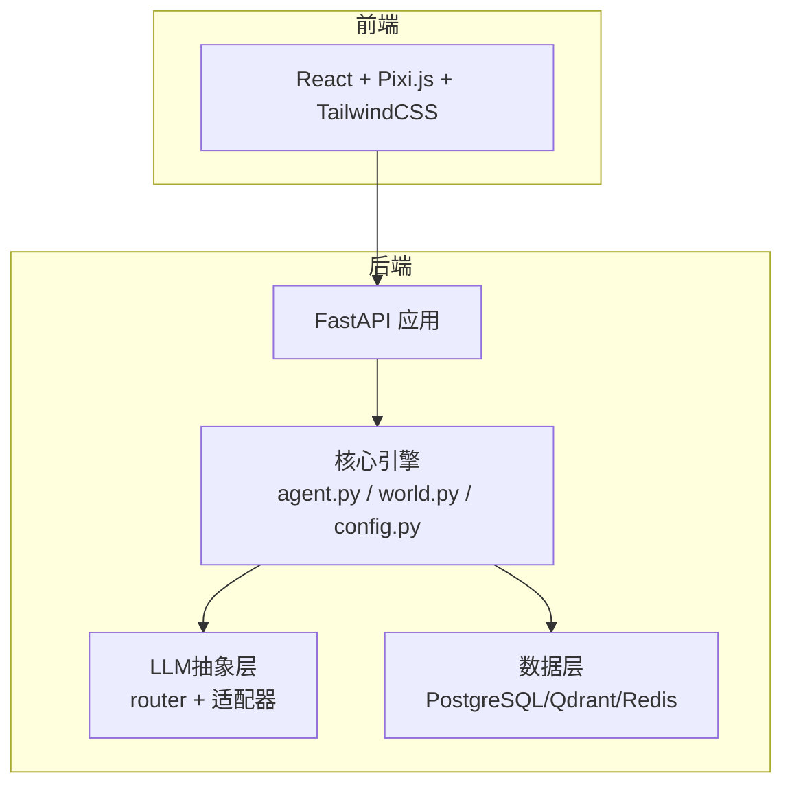
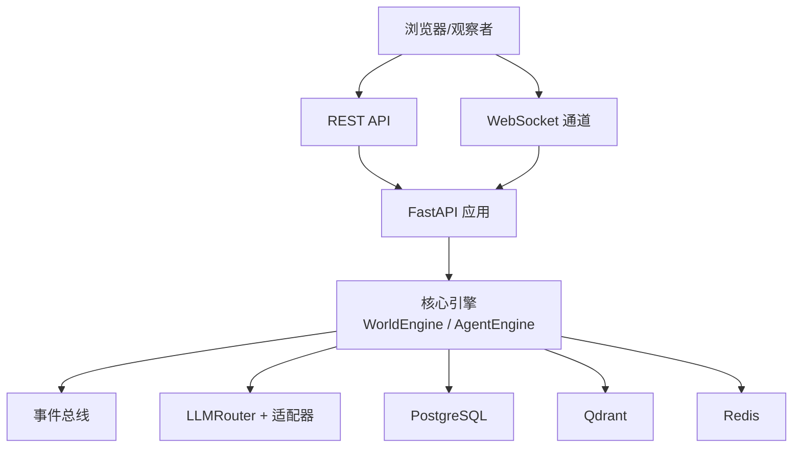
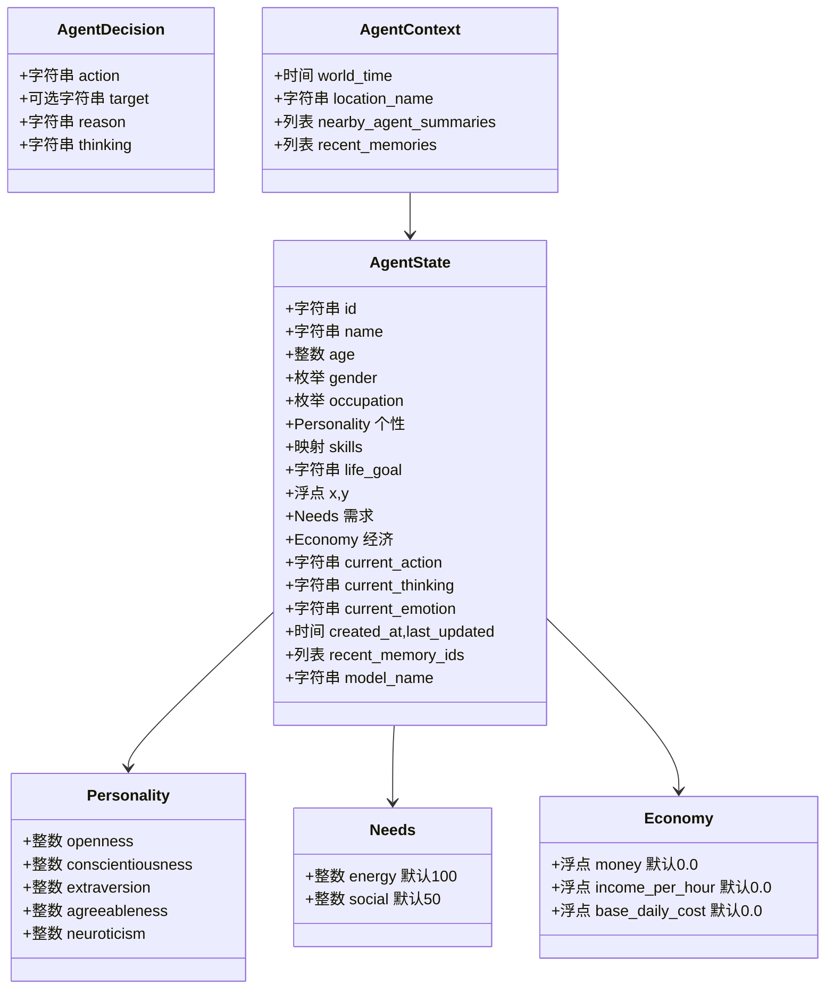
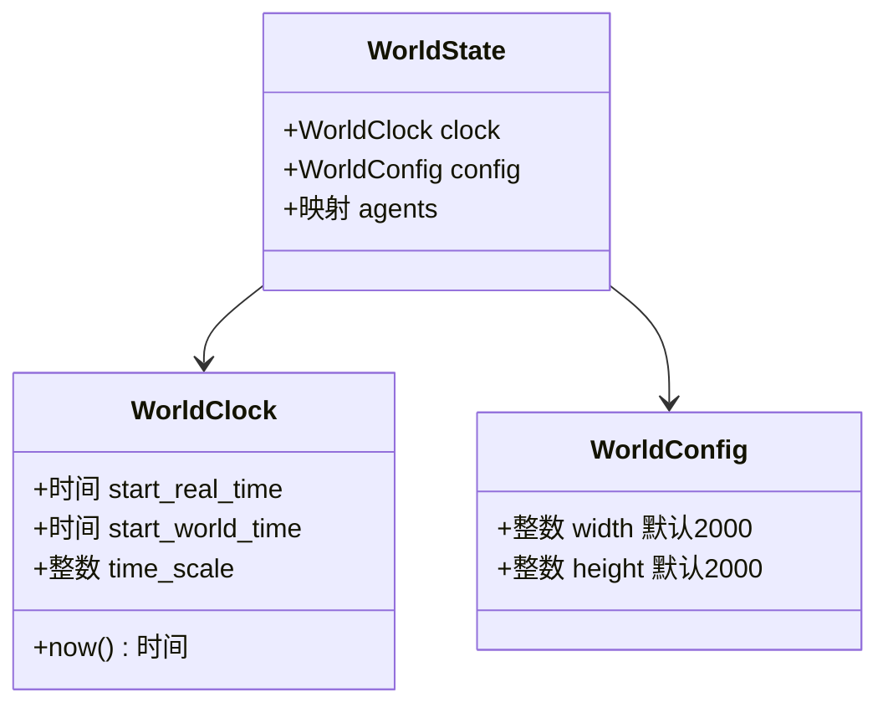
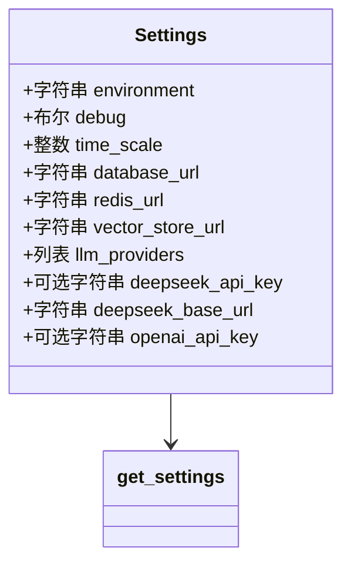
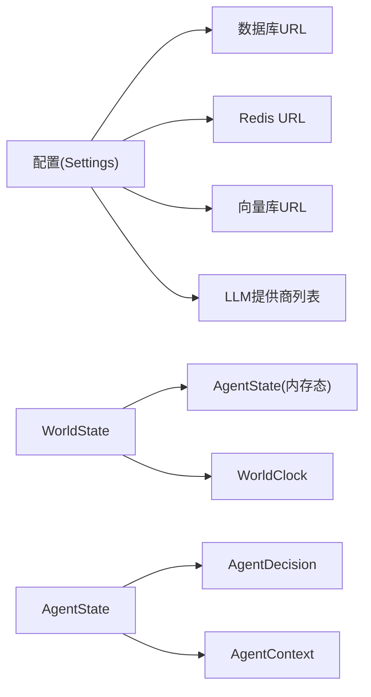

# 故障排除

<cite>
**本文引用的文件**
- [backend/app/core/agent.py](file://backend/app/core/agent.py)
- [backend/app/core/config.py](file://backend/app/core/config.py)
- [backend/app/core/world.py](file://backend/app/core/world.py)
- [specs/00-project-overview.spec.md](file://specs/00-project-overview.spec.md)
- [specs/01-architecture.spec.md](file://specs/01-architecture.spec.md)
- [specs/06-api-design.spec.md](file://specs/06-api-design.spec.md)
</cite>

## 目录
1. [简介](#简介)
2. [项目结构](#项目结构)
3. [核心组件](#核心组件)
4. [架构概览](#架构概览)
5. [详细组件分析](#详细组件分析)
6. [依赖关系分析](#依赖关系分析)
7. [性能考虑](#性能考虑)
8. [故障排除指南](#故障排除指南)
9. [结论](#结论)
10. [附录](#附录)

## 简介
本指南面向AI Society项目的运维与开发者，提供系统化的故障排除方法，覆盖安装与环境准备、配置错误、运行异常、性能问题、网络与外部服务（LLM API、数据库、向量库、缓存）问题、紧急处置与回滚策略，以及社区支持与反馈渠道。文档基于现有代码与规格说明，结合实际可落地的调试步骤与定位策略，帮助快速恢复系统稳定运行。

## 项目结构
AI Society采用前后端分离架构，后端以Python/FastAPI为核心，前端以React/Pixi.js构建，通过WebSocket与REST API进行交互；系统包含世界引擎、智能体引擎、对话与经济系统、事件总线与LLM抽象层，并预留数据库、向量库与缓存等持久化与中间件能力。

图表来源
- [specs/01-architecture.spec.md](file://specs/01-architecture.spec.md#L1-L248)

章节来源
- [specs/01-architecture.spec.md](file://specs/01-architecture.spec.md#L92-L169)

## 核心组件
- 智能体状态与决策模型：定义智能体的身份、需求、经济、个性、近期记忆索引、当前行动/思考/情绪、所用模型等字段，支撑行为决策与对话触发。
- 世界时钟与状态：提供世界时间推进、配置参数（尺寸）、内存态的智能体集合，避免循环引用的导入顺序。
- 配置管理：集中管理环境、时间缩放、数据库URL、Redis/向量库地址、LLM提供商列表及各厂商API密钥与基础URL。

章节来源
- [backend/app/core/agent.py](file://backend/app/core/agent.py#L25-L92)
- [backend/app/core/world.py](file://backend/app/core/world.py#L8-L40)
- [backend/app/core/config.py](file://backend/app/core/config.py#L7-L42)

## 架构概览
系统采用分层架构：前端负责渲染与交互，后端提供REST与WebSocket接口，核心引擎负责世界与智能体状态推进，LLM抽象层负责多模型路由与调用，数据层承载结构化数据、向量记忆与缓存。

图表来源
- [specs/01-architecture.spec.md](file://specs/01-architecture.spec.md#L3-L57)
- [specs/06-api-design.spec.md](file://specs/06-api-design.spec.md#L1-L655)

## 详细组件分析

### 智能体状态与决策模型
- 字段职责清晰：身份信息、位置坐标、需求与经济、当前行动/思考/情绪、近期记忆索引、所用模型名称。
- 决策上下文：包含世界时间、地点名称、附近智能体摘要、近期记忆列表，用于LLM路由与提示词组装。

图表来源
- [backend/app/core/agent.py](file://backend/app/core/agent.py#L25-L92)

章节来源
- [backend/app/core/agent.py](file://backend/app/core/agent.py#L25-L92)

### 世界时钟与状态
- 世界时钟：以UTC起始时间与现实时间差计算世界时间，支持按倍率推进。
- 世界配置：地图宽高默认值。
- 世界状态：持有时钟与配置，内存态维护智能体字典。

图表来源
- [backend/app/core/world.py](file://backend/app/core/world.py#L8-L40)

章节来源
- [backend/app/core/world.py](file://backend/app/core/world.py#L8-L40)

### 配置管理
- 环境与调试：根据环境变量设置调试模式与时间缩放。
- 数据库与中间件：数据库URL、Redis、向量库地址可配置。
- LLM提供商：支持多模型别名注册，DeepSeek与OpenAI等厂商API密钥与基础URL可配置。

图表来源
- [backend/app/core/config.py](file://backend/app/core/config.py#L7-L42)

章节来源
- [backend/app/core/config.py](file://backend/app/core/config.py#L7-L42)

## 依赖关系分析
- 组件耦合：世界状态在文件末尾导入智能体状态，避免循环引用。
- 外部依赖：配置层集中管理数据库、缓存、向量库与LLM提供商，降低跨模块耦合。
- API与通信：REST API与WebSocket协议在规格说明中明确，便于定位前端/后端问题。

图表来源
- [backend/app/core/world.py](file://backend/app/core/world.py#L34-L40)
- [backend/app/core/config.py](file://backend/app/core/config.py#L15-L39)
- [backend/app/core/agent.py](file://backend/app/core/agent.py#L78-L92)

章节来源
- [backend/app/core/world.py](file://backend/app/core/world.py#L34-L40)
- [backend/app/core/config.py](file://backend/app/core/config.py#L15-L39)
- [backend/app/core/agent.py](file://backend/app/core/agent.py#L78-L92)

## 性能考虑
- 目标指标：智能体数量50-200、前端帧率60fps、API响应<100ms、WS延迟<50ms、LLM调用频率每智能体每10分钟最多1次、内存<2GB。
- 优化方向：合理的时间缩放、并发智能体更新、LLM调用节流、缓存命中与向量检索优化、数据库批量写入与索引。

章节来源
- [specs/01-architecture.spec.md](file://specs/01-architecture.spec.md#L238-L248)

## 故障排除指南

### 一、安装与环境准备
- 症状：依赖安装失败、Python版本不兼容、包冲突。
- 排查步骤：
  - 确认Python版本满足后端要求（规格说明中技术栈为Python/FastAPI）。
  - 使用隔离环境（venv/conda）安装requirements.txt中的依赖。
  - 若存在编译依赖，确保系统已安装相应构建工具与头文件。
- 建议：参考规格说明中的技术栈与容器化部署方式，优先使用Docker Compose以减少环境差异。

章节来源
- [specs/01-architecture.spec.md](file://specs/01-architecture.spec.md#L61-L71)

### 二、配置错误
- 症状：数据库连接失败、Redis不可达、向量库无法访问、LLM调用报错。
- 排查步骤：
  - 检查环境变量是否正确设置（DATABASE_URL、REDIS_URL、VECTOR_STORE_URL、DEEPSEEK_*、OPENAI_*）。
  - 验证配置加载：确认Settings类的字段被正确读取，必要时打印或记录当前配置。
  - 数据库：确认数据库URL可达且具备权限；若使用SQLite，请确认路径存在且可写。
  - 缓存/消息队列：确认Redis服务运行正常，端口与认证配置正确。
  - 向量库：确认Qdrant服务运行，端口与健康检查可用。
  - LLM：确认对应API密钥与基础URL配置正确，网络可访问。
- 建议：在启动阶段输出关键配置项，便于快速定位配置问题。

章节来源
- [backend/app/core/config.py](file://backend/app/core/config.py#L7-L42)

### 三、运行异常
- 症状：世界暂停、智能体不更新、前端无事件推送。
- 排查步骤：
  - 通过REST API查询世界状态，确认状态为“running”，否则调用控制接口恢复。
  - 检查核心引擎循环是否正常推进（世界时钟与智能体更新）。
  - 检查WebSocket连接与订阅，确认客户端已订阅所需频道。
- 建议：在关键节点增加日志输出，记录世界时间推进与智能体更新周期。

章节来源
- [specs/06-api-design.spec.md](file://specs/06-api-design.spec.md#L20-L60)
- [specs/01-architecture.spec.md](file://specs/01-architecture.spec.md#L171-L196)

### 四、性能问题诊断
- 症状：CPU占用高、内存增长、前端卡顿、API响应变慢。
- 排查步骤：
  - CPU占用：使用性能分析工具定位热点函数，关注智能体更新、LLM调用与事件广播环节。
  - 内存泄漏：检查智能体状态与事件对象生命周期，确认无长生命周期引用；监控内存曲线。
  - 前端帧率：检查渲染批次与事件推送频率，适当降低事件粒度或前端渲染优化。
  - API延迟：检查数据库查询与缓存命中率，必要时引入索引与连接池。
- 建议：遵循性能目标，限制LLM调用频率，启用缓存与批量写入。

章节来源
- [specs/01-architecture.spec.md](file://specs/01-architecture.spec.md#L238-L248)

### 五、网络连接问题
- 症状：WebSocket断连、REST API超时、LLM调用失败。
- 排查步骤：
  - WebSocket：确认服务端监听端口、代理转发与客户端订阅消息格式正确。
  - REST API：检查服务端日志与网络连通性，验证速率限制与错误码。
  - LLM：检查网络连通性、代理设置、API密钥与基础URL，确认请求未被防火墙拦截。
- 建议：在网关层增加重试与熔断策略，记录请求ID以便追踪。

章节来源
- [specs/06-api-design.spec.md](file://specs/06-api-design.spec.md#L411-L425)
- [specs/06-api-design.spec.md](file://specs/06-api-design.spec.md#L619-L655)

### 六、数据库连接失败
- 症状：应用启动时报数据库连接错误、查询失败。
- 排查步骤：
  - 检查DATABASE_URL格式与可达性，确认数据库服务运行。
  - 若使用SQLite，确认路径存在且具备写权限。
  - 检查连接池配置与并发连接数上限。
- 建议：在启动阶段进行数据库健康检查，失败时快速退出并记录日志。

章节来源
- [backend/app/core/config.py](file://backend/app/core/config.py#L15-L16)

### 七、LLM API调用错误
- 症状：LLM调用超时、鉴权失败、响应解析错误。
- 排查步骤：
  - 检查对应LLM提供商的API密钥与基础URL配置。
  - 确认网络连通性与代理设置，必要时开启HTTPS与证书校验。
  - 检查请求负载与模型参数，避免超出限额或参数非法。
  - 记录请求ID与响应体，便于定位具体错误。
- 建议：实现统一的LLM适配器与重试机制，区分瞬时错误与永久错误。

章节来源
- [backend/app/core/config.py](file://backend/app/core/config.py#L24-L39)
- [specs/01-architecture.spec.md](file://specs/01-architecture.spec.md#L83-L91)

### 八、紧急情况处理流程
- 世界暂停：通过REST API控制接口暂停世界，避免进一步状态变化。
- 快速回滚：保留最近一次数据库备份与容器镜像标签，回退至上一个稳定版本。
- 数据恢复：从备份恢复数据库与向量库，核对关键表与索引完整性。
- 事件广播：临时关闭高频事件推送，降低系统负载，逐步恢复。

章节来源
- [specs/06-api-design.spec.md](file://specs/06-api-design.spec.md#L45-L59)
- [specs/01-architecture.spec.md](file://specs/01-architecture.spec.md#L50-L57)

### 九、系统回滚策略
- 版本标记：使用容器镜像标签与数据库迁移版本号进行标记。
- 回滚步骤：停止服务 -> 回滚镜像 -> 恢复数据库备份 -> 启动服务 -> 验证功能。
- 验证清单：世界状态、智能体数量、WebSocket事件、REST API响应、LLM调用成功率。

章节来源
- [specs/01-architecture.spec.md](file://specs/01-architecture.spec.md#L134-L136)

### 十、社区支持与问题反馈
- 项目定位与开源信息：项目为开源AI自治世界观察实验平台，遵循OpenRAIL协议。
- 反馈渠道：依据项目规范在社区讨论区提交问题，附带环境信息、日志片段与最小复现步骤。
- 升级建议：优先升级依赖至兼容版本，遵循规格说明中的技术栈与性能目标。

章节来源
- [specs/00-project-overview.spec.md](file://specs/00-project-overview.spec.md#L43-L46)

## 结论
本指南提供了从安装、配置、运行到性能与网络问题的系统化排障流程，并结合项目架构与核心组件给出可操作的定位策略。建议在生产环境中启用完善的日志与监控体系，定期备份数据库与向量库，严格遵循回滚与应急流程，确保系统的稳定性与可恢复性。

## 附录

### A. 常见错误码与处理建议
- AGENT_NOT_FOUND：检查智能体ID与存储一致性。
- LOCATION_NOT_FOUND：检查地图数据与索引。
- CONVERSATION_NOT_FOUND：检查对话表与外键。
- INVALID_PARAMETER：校验请求参数与范围。
- WORLD_PAUSED：调用控制接口恢复运行。
- RATE_LIMITED：降低请求频率或增加配额。
- INTERNAL_ERROR：检查服务端日志与堆栈跟踪。

章节来源
- [specs/06-api-design.spec.md](file://specs/06-api-design.spec.md#L636-L647)

### B. API与WebSocket参考
- REST API：查询世界状态、控制运行、获取智能体与对话详情、统计数据与导出。
- WebSocket：订阅事件通道，接收智能体移动、状态变化、对话与关系变化、世界与经济事件。

章节来源
- [specs/06-api-design.spec.md](file://specs/06-api-design.spec.md#L18-L655)