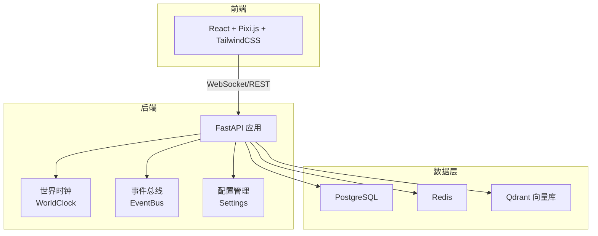
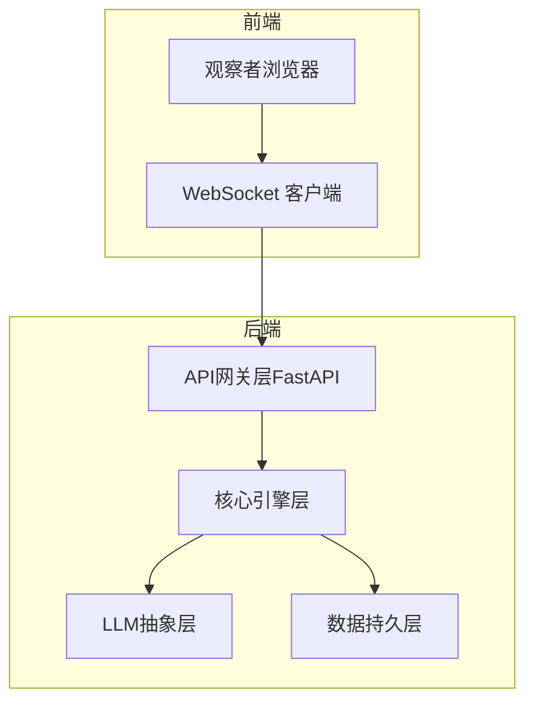
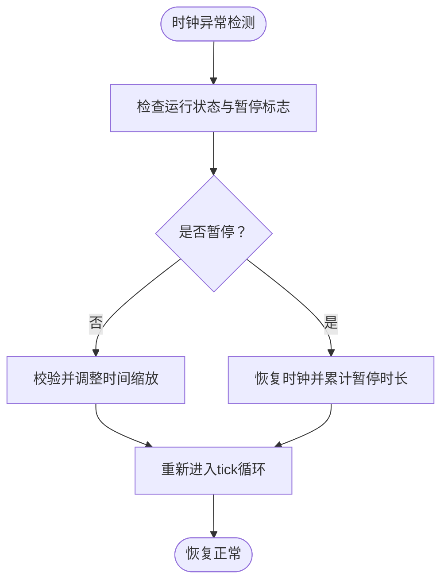
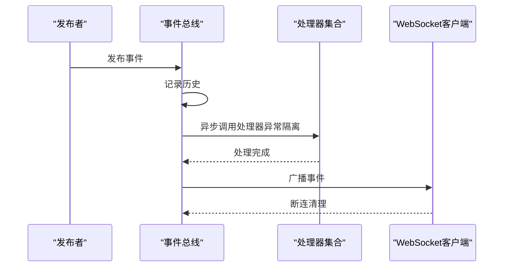
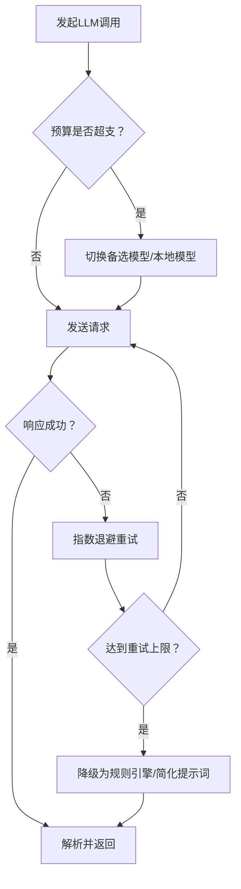
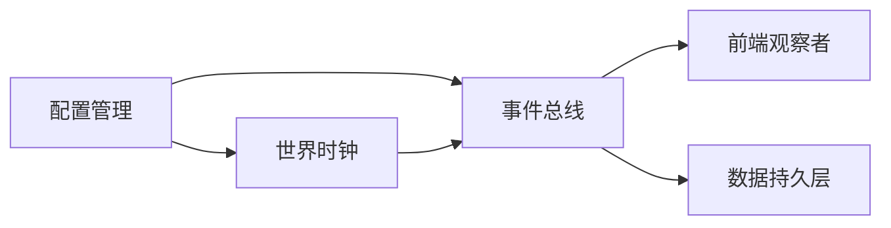

# 紧急处理程序

<cite>
**本文引用的文件**
- [backend/app/core/config.py](file://backend/app/core/config.py)
- [backend/app/core/world.py](file://backend/app/core/world.py)
- [backend/app/core/agent.py](file://backend/app/core/agent.py)
- [backend/app/core/events.py](file://backend/app/core/events.py)
- [specs/01-architecture.spec.md](file://specs/01-architecture.spec.md)
- [specs/06-api-design.spec.md](file://specs/06-api-design.spec.md)
- [specs/08-implementation-plan.spec.md](file://specs/08-implementation-plan.spec.md)
- [specs/05-world-map.spec.md](file://specs/05-world-map.spec.md)
</cite>

## 目录
1. [简介](#简介)
2. [项目结构](#项目结构)
3. [核心组件](#核心组件)
4. [架构总览](#架构总览)
5. [详细组件分析](#详细组件分析)
6. [依赖分析](#依赖分析)
7. [性能考虑](#性能考虑)
8. [故障排查指南](#故障排查指南)
9. [结论](#结论)
10. [附录](#附录)

## 简介
本指南面向AI Society项目的运维与研发团队，提供系统崩溃后的快速重启流程、数据丢失后的恢复步骤、重大故障的应急响应方案，以及数据库损坏恢复、LLM服务中断处理、前端界面异常的紧急修复方法。同时涵盖系统回滚策略、版本降级操作、紧急维护模式启用、数据备份验证、系统快照恢复与跨环境迁移的详细步骤，并提供紧急联系人列表、故障升级流程与事后分析报告模板。

## 项目结构
AI Society采用前后端分离、多层架构设计，后端以FastAPI为核心，结合事件总线、世界时钟、智能体引擎与LLM抽象层，支撑实时世界模拟与观察。前端基于React/Pixi.js/TailwindCSS，通过WebSocket与后端事件总线交互，实现高并发实时渲染。

图表来源
- [specs/01-architecture.spec.md](file://specs/01-architecture.spec.md#L1-L255)
- [backend/app/core/world.py](file://backend/app/core/world.py#L73-L292)
- [backend/app/core/events.py](file://backend/app/core/events.py#L88-L269)
- [backend/app/core/config.py](file://backend/app/core/config.py#L19-L175)

章节来源
- [specs/01-architecture.spec.md](file://specs/01-architecture.spec.md#L1-L255)

## 核心组件
- 配置管理：集中管理应用配置，支持环境变量覆盖，提供缓存单例，确保全局一致性。
- 世界时钟：负责时间推进、昼夜循环、定时事件广播，支持暂停/恢复/动态缩放。
- 事件总线：发布-订阅模式，异步处理各类事件，保障模块解耦与实时推送。
- LLM抽象层：多模型路由与适配器，支持运行时切换模型与预算控制。
- 数据层：PostgreSQL（结构化）、Redis（缓存/队列）、Qdrant（向量记忆）。

章节来源
- [backend/app/core/config.py](file://backend/app/core/config.py#L19-L175)
- [backend/app/core/world.py](file://backend/app/core/world.py#L73-L292)
- [backend/app/core/events.py](file://backend/app/core/events.py#L88-L269)
- [specs/01-architecture.spec.md](file://specs/01-architecture.spec.md#L59-L92)

## 架构总览
系统采用“观察者-事件驱动”的架构，前端通过WebSocket订阅事件，后端通过事件总线分发世界状态、智能体行为与对话事件；LLM调用通过路由层统一接入，数据库层提供结构化与向量两类存储。

图表来源
- [specs/01-architecture.spec.md](file://specs/01-architecture.spec.md#L3-L57)
- [specs/06-api-design.spec.md](file://specs/06-api-design.spec.md#L411-L513)

## 详细组件分析

### 世界时钟（WorldClock）应急处理
- 快速重启：若时钟停止，检查配置中的时间缩放参数与启动逻辑，重新调用启动协程。
- 暂停/恢复：在维护期间可暂停时钟，避免世界状态继续推进；恢复后需校验时间一致性。
- 时间缩放：动态调整缩放比例时需进行边界校验，防止异常导致系统停滞。

图表来源
- [backend/app/core/world.py](file://backend/app/core/world.py#L205-L234)
- [backend/app/core/world.py](file://backend/app/core/world.py#L235-L273)

章节来源
- [backend/app/core/world.py](file://backend/app/core/world.py#L73-L292)

### 事件总线（EventBus）应急处理
- 异常隔离：事件处理器异常被捕获并记录，不影响其他处理器执行与WebSocket广播。
- 历史保留：事件历史用于调试与回放，维护期可清理以释放内存。
- WebSocket广播：断连自动清理，确保连接池健康。

图表来源
- [backend/app/core/events.py](file://backend/app/core/events.py#L167-L195)
- [backend/app/core/events.py](file://backend/app/core/events.py#L196-L230)

章节来源
- [backend/app/core/events.py](file://backend/app/core/events.py#L88-L269)

### LLM服务中断应急处理
- 模型切换：通过路由层切换至备选模型或本地模型，降低对外部服务依赖。
- 预算控制：当预算超支时阻断调用，避免额外费用；维护期可临时提升阈值或切换计费模式。
- 重试与降级：对失败请求进行指数退避重试，必要时降级为规则引擎或简化提示词。

图表来源
- [specs/01-architecture.spec.md](file://specs/01-architecture.spec.md#L83-L92)
- [specs/06-api-design.spec.md](file://specs/06-api-design.spec.md#L636-L647)

章节来源
- [specs/01-architecture.spec.md](file://specs/01-architecture.spec.md#L83-L92)
- [specs/06-api-design.spec.md](file://specs/06-api-design.spec.md#L636-L647)

### 数据库损坏恢复
- PostgreSQL：使用事务与备份策略，出现损坏时优先回滚到最近一次完整备份；如需PITR，确认WAL归档与恢复点。
- Redis：作为缓存/队列，可在数据丢失后重建键空间；建议开启RDB/AOF持久化。
- Qdrant：向量库损坏时，优先恢复索引与集合元数据，再重建向量数据；可利用备份快照进行增量恢复。

章节来源
- [specs/01-architecture.spec.md](file://specs/01-architecture.spec.md#L51-L56)

### 前端界面异常紧急修复
- WebSocket断连：前端自动重连并订阅所需频道；若事件缺失，检查后端事件总线广播与订阅状态。
- 渲染异常：检查Pixi.js场景与精灵资源加载；必要时切换到简化视图或禁用部分动画。
- 状态不一致：通过后端API拉取最新世界状态与智能体数据，进行前端强制刷新。

章节来源
- [specs/06-api-design.spec.md](file://specs/06-api-design.spec.md#L411-L513)
- [specs/01-architecture.spec.md](file://specs/01-architecture.spec.md#L72-L82)

### 系统回滚策略与版本降级
- 回滚步骤：停止服务 -> 恢复上一版本镜像/容器 -> 恢复配置与数据备份 -> 启动并验证。
- 版本降级：锁定后端/前端镜像标签，回退到已知稳定版本；确保数据库迁移脚本与schema兼容。
- 紧急维护模式：通过配置开关或环境变量启用只读模式，禁止写操作，仅允许监控与恢复。

章节来源
- [specs/08-implementation-plan.spec.md](file://specs/08-implementation-plan.spec.md#L331-L347)
- [backend/app/core/config.py](file://backend/app/core/config.py#L19-L175)

### 数据备份验证与系统快照恢复
- 备份验证：定期抽样校验备份完整性与可恢复性；验证关键表与向量集合。
- 快照恢复：对数据库与向量库进行一致性快照；恢复后执行数据校验与功能回归测试。
- 跨环境迁移：准备目标环境配置与依赖；先迁移结构化数据，再迁移向量数据；最后迁移Redis键空间。

章节来源
- [specs/01-architecture.spec.md](file://specs/01-architecture.spec.md#L51-L56)
- [specs/08-implementation-plan.spec.md](file://specs/08-implementation-plan.spec.md#L331-L347)

### 世界状态保存/恢复与定时事件
- 世界状态保存：在关键节点（如每日结算）保存世界时钟、智能体集合与事件历史。
- 状态恢复：重启后从最近备份恢复世界时钟与智能体状态，确保时间一致性与事件连续性。
- 定时事件：检查定时任务调度器状态，确保日出/日落/发薪等事件按时触发。

章节来源
- [specs/05-world-map.spec.md](file://specs/05-world-map.spec.md#L288-L329)
- [specs/08-implementation-plan.spec.md](file://specs/08-implementation-plan.spec.md#L331-L347)

## 依赖分析
- 配置依赖：世界时钟与事件总线均依赖配置模块提供的参数（如时间缩放、日志级别等）。
- 事件依赖：前端通过WebSocket订阅事件总线推送的各类事件，形成闭环。
- 数据依赖：后端服务依赖数据库与缓存/向量库，三者协同保证系统稳定性。

图表来源
- [backend/app/core/config.py](file://backend/app/core/config.py#L19-L175)
- [backend/app/core/world.py](file://backend/app/core/world.py#L31-L32)
- [backend/app/core/events.py](file://backend/app/core/events.py#L216-L230)
- [specs/01-architecture.spec.md](file://specs/01-architecture.spec.md#L51-L56)

章节来源
- [backend/app/core/config.py](file://backend/app/core/config.py#L19-L175)
- [backend/app/core/world.py](file://backend/app/core/world.py#L31-L32)
- [backend/app/core/events.py](file://backend/app/core/events.py#L216-L230)

## 性能考虑
- 事件处理：异步广播与异常隔离，避免单点阻塞；控制事件历史长度，减少内存占用。
- 时钟推进：每秒tick，建议在高负载时适当降低日志级别与事件粒度。
- LLM调用：启用预算控制与模型降级，避免突发流量导致成本激增与服务不可用。

## 故障排查指南
- 系统崩溃后快速重启
  - 检查配置文件与环境变量，确保数据库/缓存/向量库连接正常。
  - 启动后端服务，确认世界时钟与事件总线初始化成功。
  - 通过API获取世界状态，验证时间推进与事件广播。
- 数据丢失恢复
  - PostgreSQL：从最近备份恢复；如需PITR，确认WAL与恢复点。
  - Redis/Qdrant：重建键空间/集合元数据，再恢复向量数据。
- LLM服务中断
  - 切换备选模型或本地模型；检查预算阈值与计费状态。
  - 对失败请求进行重试与降级处理。
- 前端界面异常
  - 检查WebSocket连接与事件订阅；必要时强制刷新或切换简化视图。
- 紧急维护模式
  - 通过配置开关启用只读模式，禁止写操作，仅保留监控与恢复能力。

章节来源
- [specs/06-api-design.spec.md](file://specs/06-api-design.spec.md#L18-L60)
- [specs/06-api-design.spec.md](file://specs/06-api-design.spec.md#L619-L655)
- [specs/01-architecture.spec.md](file://specs/01-architecture.spec.md#L59-L92)

## 结论
本指南提供了从配置、时钟、事件、LLM到数据层的全链路应急处理方案。通过严格的备份验证、快照恢复与跨环境迁移流程，结合回滚与降级策略，可显著缩短故障恢复时间并降低业务影响。建议定期演练应急流程，完善监控告警与自动化恢复机制。

## 附录

### 紧急联系人列表
- 运维负责人：负责系统重启、备份恢复与数据库维护
- 后端开发：负责事件总线、世界时钟与LLM路由问题
- 前端开发：负责WebSocket断连与渲染异常修复
- 数据工程师：负责PostgreSQL、Redis与Qdrant的备份与恢复

### 故障升级流程
- 一级响应：值班人员尝试快速重启与回滚，15分钟内无法解决升级至二级。
- 二级响应：后端/前端/数据工程师协同排查，1小时内无法解决升级至三级。
- 三级响应：邀请架构师与高级工程师参与，制定全面恢复方案并发布事故公告。

### 事后分析报告模板
- 故障概述：时间、现象、影响范围
- 根因分析：配置变更、依赖异常、资源瓶颈
- 处置过程：重启/回滚/恢复步骤与耗时
- 影响评估：用户可见性、数据一致性、成本影响
- 改进措施：修复方案、监控增强、演练计划
- 附件：日志截取、事件历史、备份恢复记录