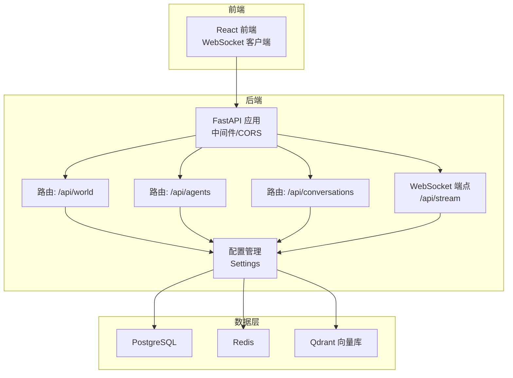
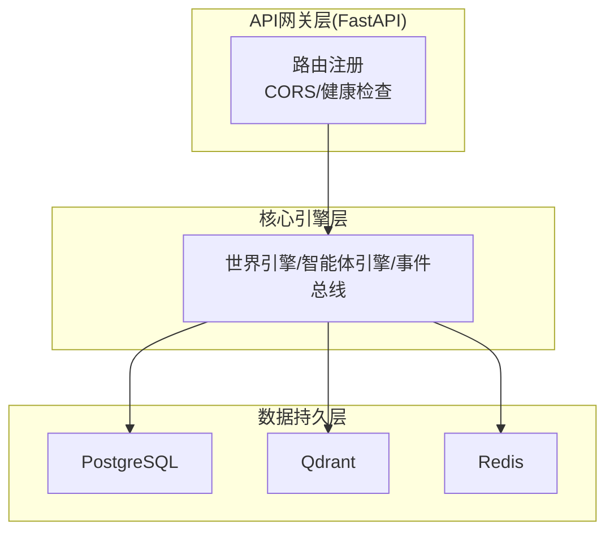
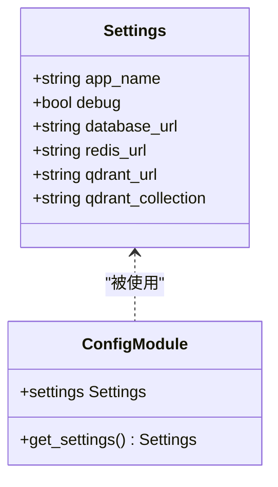
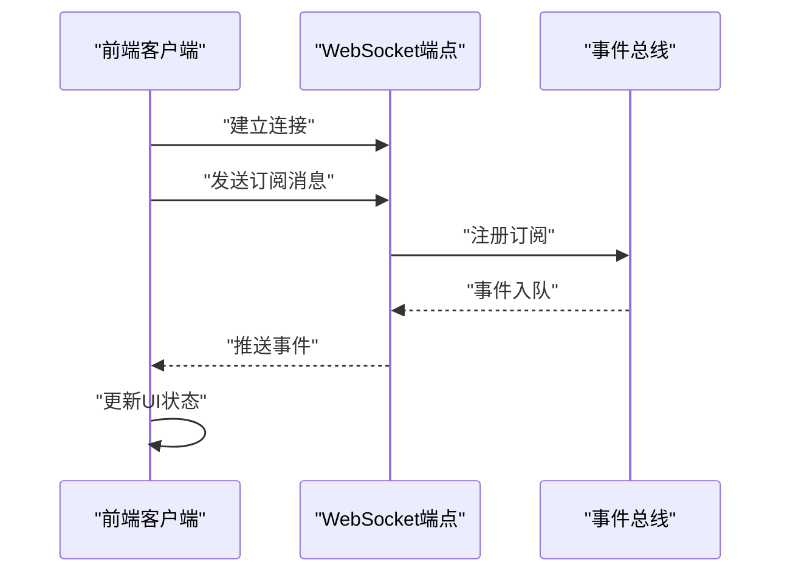
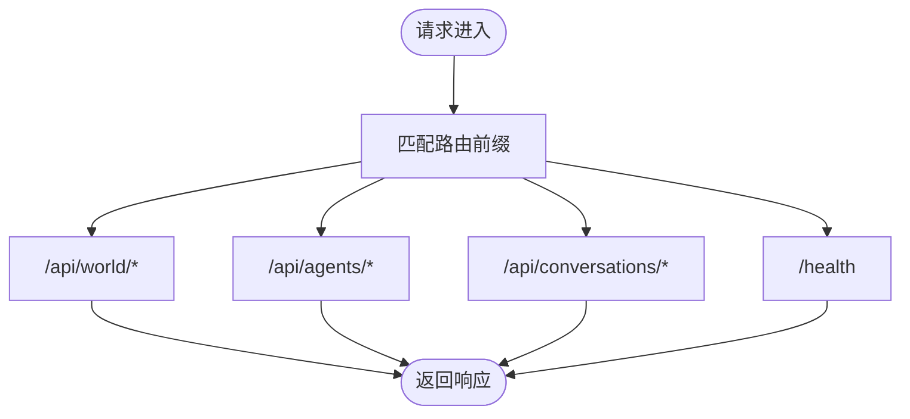
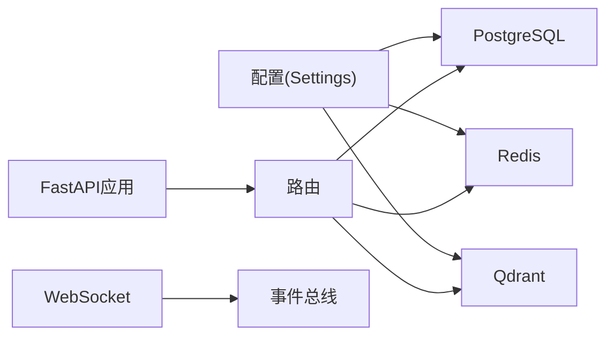

# 网络数据库问题

<cite>
**本文引用的文件**
- [backend/app/main.py](file://backend/app/main.py)
- [backend/app/core/config.py](file://backend/app/core/config.py)
- [specs/01-architecture.spec.md](file://specs/01-architecture.spec.md)
- [specs/06-api-design.spec.md](file://specs/06-api-design.spec.md)
- [specs/07-frontend.spec.md](file://specs/07-frontend.spec.md)
- [specs/08-implementation-plan.spec.md](file://specs/08-implementation-plan.spec.md)
</cite>

## 目录
1. [简介](#简介)
2. [项目结构](#项目结构)
3. [核心组件](#核心组件)
4. [架构总览](#架构总览)
5. [详细组件分析](#详细组件分析)
6. [依赖分析](#依赖分析)
7. [性能考虑](#性能考虑)
8. [故障排除指南](#故障排除指南)
9. [结论](#结论)
10. [附录](#附录)

## 简介
本指南聚焦于AI Society项目在网络与数据库连接层面的常见问题与系统化排障方法，涵盖以下主题：
- 数据层问题：PostgreSQL连接池耗尽、Redis缓存失效、Qdrant向量查询超时
- 网络连通性：测试方法、延迟优化、跨域与安全配置
- 实时通信：WebSocket连接不稳定、API接口超时
- 运维保障：数据库备份恢复、连接重试与故障转移策略

本指南以仓库现有规范与实现为依据，结合FastAPI、Pydantic配置、WebSocket协议与架构文档，提供可操作的诊断步骤与修复建议。

## 项目结构
后端采用FastAPI应用工厂模式，核心模块包括配置、世界时钟、事件总线与LLM抽象层；前端通过React与WebSocket实时接收事件流。数据库与向量库通过配置集中管理，API与WebSocket协议在规范文档中有明确约定。

**图表来源**
- [backend/app/main.py](file://backend/app/main.py#L60-L97)
- [backend/app/core/config.py](file://backend/app/core/config.py#L84-L107)
- [specs/01-architecture.spec.md](file://specs/01-architecture.spec.md#L50-L56)
- [specs/06-api-design.spec.md](file://specs/06-api-design.spec.md#L411-L425)

**章节来源**
- [backend/app/main.py](file://backend/app/main.py#L60-L97)
- [specs/01-architecture.spec.md](file://specs/01-architecture.spec.md#L1-L56)

## 核心组件
- 配置管理：集中管理数据库、Redis、Qdrant等外部服务连接参数，支持环境变量覆盖与缓存单例。
- FastAPI应用：统一CORS配置、路由注册与健康检查端点。
- WebSocket协议：前端订阅频道，后端按频道推送事件。
- 架构约束：数据库、向量库、缓存三类数据层分离，API与实时通道职责清晰。

**章节来源**
- [backend/app/core/config.py](file://backend/app/core/config.py#L19-L175)
- [backend/app/main.py](file://backend/app/main.py#L60-L97)
- [specs/06-api-design.spec.md](file://specs/06-api-design.spec.md#L411-L425)

## 架构总览
系统采用“API网关层 + 核心引擎层 + 数据持久层”的分层架构。API层负责REST与WebSocket；核心引擎层驱动世界循环与事件总线；数据层分别承载结构化数据、向量记忆与缓存/消息队列。

**图表来源**
- [specs/01-architecture.spec.md](file://specs/01-architecture.spec.md#L14-L56)

**章节来源**
- [specs/01-architecture.spec.md](file://specs/01-architecture.spec.md#L1-L56)

## 详细组件分析

### 组件A：配置与连接参数
- 数据库连接：PostgreSQL连接URL在配置中集中定义，可通过环境变量覆盖。
- 缓存连接：Redis连接URL在配置中定义。
- 向量库连接：Qdrant URL与集合名在配置中定义。
- 配置加载：使用缓存单例，避免重复解析与IO开销。

**图表来源**
- [backend/app/core/config.py](file://backend/app/core/config.py#L19-L175)

**章节来源**
- [backend/app/core/config.py](file://backend/app/core/config.py#L84-L107)

### 组件B：WebSocket协议与前端集成
- 连接与订阅：前端建立WebSocket后发送订阅消息，可按频道或特定智能体订阅。
- 事件类型：包含智能体移动、状态变化、对话开始/消息/结束、关系变化、世界事件、经济事件等。
- 前端处理：根据事件类型更新状态与UI。

**图表来源**
- [specs/06-api-design.spec.md](file://specs/06-api-design.spec.md#L411-L425)
- [specs/07-frontend.spec.md](file://specs/07-frontend.spec.md#L362-L406)

**章节来源**
- [specs/06-api-design.spec.md](file://specs/06-api-design.spec.md#L411-L425)
- [specs/07-frontend.spec.md](file://specs/07-frontend.spec.md#L362-L406)

### 组件C：API路由与CORS
- 路由注册：世界、智能体、对话三类路由前缀与标签明确。
- CORS配置：允许任意来源、凭据、方法与头，生产环境应收紧。
- 健康检查：提供统一健康检查端点。

**图表来源**
- [backend/app/main.py](file://backend/app/main.py#L86-L95)

**章节来源**
- [backend/app/main.py](file://backend/app/main.py#L60-L97)

## 依赖分析
- 配置依赖：所有数据层连接参数由配置模块提供，降低耦合。
- 路由依赖：各业务路由依赖配置与核心引擎，保持关注点分离。
- WebSocket依赖：事件总线作为发布/订阅中枢，解耦前端与业务逻辑。

**图表来源**
- [backend/app/core/config.py](file://backend/app/core/config.py#L84-L107)
- [backend/app/main.py](file://backend/app/main.py#L60-L97)

**章节来源**
- [backend/app/core/config.py](file://backend/app/core/config.py#L84-L107)
- [backend/app/main.py](file://backend/app/main.py#L60-L97)

## 性能考虑
- 目标指标：API响应时间<100ms、WebSocket延迟<50ms、前端帧率60fps。
- 连接池与并发：数据库连接池大小需与并发负载匹配；缓存命中率直接影响延迟。
- 向量检索：Qdrant查询超时与索引/副本配置密切相关。

[本节为通用指导，无需具体文件来源]

## 故障排除指南

### PostgreSQL连接池耗尽
- 症状
  - 数据库写入/查询超时或报错
  - 应用日志出现连接等待或拒绝
- 诊断步骤
  - 检查数据库连接URL与凭据是否正确
  - 查看应用配置中数据库URL是否被环境变量覆盖
  - 评估当前并发与连接池上限，确认是否存在未释放连接
- 修复建议
  - 调整连接池参数（最大连接数、空闲连接、超时）
  - 优化事务与查询，减少长事务与锁竞争
  - 引入连接池监控与告警
- 相关配置
  - 数据库URL在配置中定义，支持环境变量覆盖

**章节来源**
- [backend/app/core/config.py](file://backend/app/core/config.py#L84-L87)

### Redis缓存失效
- 症状
  - 缓存读写失败、键过期异常、内存增长
- 诊断步骤
  - 检查Redis连接URL与认证
  - 使用客户端命令验证连接与键空间
  - 检查内存淘汰策略与过期键回收
- 修复建议
  - 调整过期策略与内存上限
  - 优化键命名与序列化方式
  - 引入哨兵/集群提升可用性
- 相关配置
  - Redis URL在配置中定义

**章节来源**
- [backend/app/core/config.py](file://backend/app/core/config.py#L92-L95)

### Qdrant向量查询超时
- 症状
  - 向量检索接口响应缓慢或超时
- 诊断步骤
  - 检查Qdrant URL与集合名
  - 确认集合索引状态与副本健康
  - 分析查询负载与向量维度
- 修复建议
  - 优化查询参数（top/k、过滤条件）
  - 增加副本与分片，调整索引参数
  - 引入查询缓存与预检索
- 相关配置
  - Qdrant URL与集合名在配置中定义

**章节来源**
- [backend/app/core/config.py](file://backend/app/core/config.py#L100-L107)

### WebSocket连接不稳定
- 症状
  - 连接断开、订阅消息丢失、心跳失败
- 诊断步骤
  - 检查WebSocket端点可达性与协议版本
  - 确认前端订阅消息格式与频道名称
  - 查看后端事件总线订阅与推送链路
- 修复建议
  - 前端实现指数退避重连与断线重订阅
  - 后端增加订阅校验与异常恢复
  - 限流与背压策略防止风暴
- 协议参考
  - WebSocket连接与订阅消息格式见API规范

**章节来源**
- [specs/06-api-design.spec.md](file://specs/06-api-design.spec.md#L411-L425)
- [specs/07-frontend.spec.md](file://specs/07-frontend.spec.md#L362-L406)

### API接口超时
- 症状
  - REST接口响应时间过长或超时
- 诊断步骤
  - 使用健康检查端点确认服务可用性
  - 检查路由前缀与端点映射
  - 分析慢查询与数据库连接瓶颈
- 修复建议
  - 优化查询与索引
  - 引入缓存与异步处理
  - 调整超时与重试策略
- 健康检查
  - 提供统一健康检查端点

**章节来源**
- [backend/app/main.py](file://backend/app/main.py#L91-L95)

### 跨域访问问题
- 症状
  - 前端跨域请求被拦截，CORS错误
- 诊断步骤
  - 检查CORS中间件配置
  - 确认允许的来源、方法与头
- 修复建议
  - 生产环境限制允许来源
  - 明确预检请求处理
- 配置位置
  - CORS中间件在应用工厂中注册

**章节来源**
- [backend/app/main.py](file://backend/app/main.py#L77-L84)

### 网络连通性测试方法
- 基本连通性
  - 使用ping/trace进行路径探测
  - 使用telnet或nc验证端口可达
- 服务可达性
  - 直接curl访问健康检查端点
  - 验证WebSocket握手与订阅
- 延迟与抖动
  - 使用工具测量RTT与丢包
  - 分析不同地域节点延迟差异

[本节为通用指导，无需具体文件来源]

### 数据库备份恢复流程
- 备份策略
  - 定期全量与增量备份
  - 验证备份文件完整性与可恢复性
- 恢复流程
  - 选择合适的时间点进行回滚
  - 逐步恢复并验证数据一致性
- 业务影响最小化
  - 采用只读窗口与切换流量
  - 回滚后进行一致性校验

[本节为通用指导，无需具体文件来源]

### 连接重试机制与故障转移
- 连接重试
  - 指数退避与抖动
  - 最大重试次数与超时上限
- 故障转移
  - 主备切换与副本选举
  - 服务发现与负载均衡
- 监控与告警
  - 连接失败率与延迟阈值
  - 自动化故障检测与恢复

[本节为通用指导，无需具体文件来源]

### 网络延迟优化与安全配置
- 延迟优化
  - CDN与就近接入
  - TCP优化与TLS会话复用
- 防火墙与安全组
  - 仅开放必要端口
  - 限制来源IP与速率
- 安全最佳实践
  - TLS加密传输
  - 认证与授权策略
  - 审计与日志留存

[本节为通用指导，无需具体文件来源]

## 结论
本指南基于项目现有架构与规范，提供了针对数据层、网络与实时通信的系统化排障思路。建议在生产环境中：
- 严格限制CORS来源，启用TLS与认证
- 配置合理的连接池与缓存策略
- 对关键服务实施监控与告警
- 制定完善的备份与故障转移预案

[本节为总结性内容，无需具体文件来源]

## 附录
- 实施计划参考：数据库Schema设计、SQLAlchemy模型、Alembic迁移、Qdrant集成与记忆检索等任务清单与验收标准。

**章节来源**
- [specs/08-implementation-plan.spec.md](file://specs/08-implementation-plan.spec.md#L327-L352)