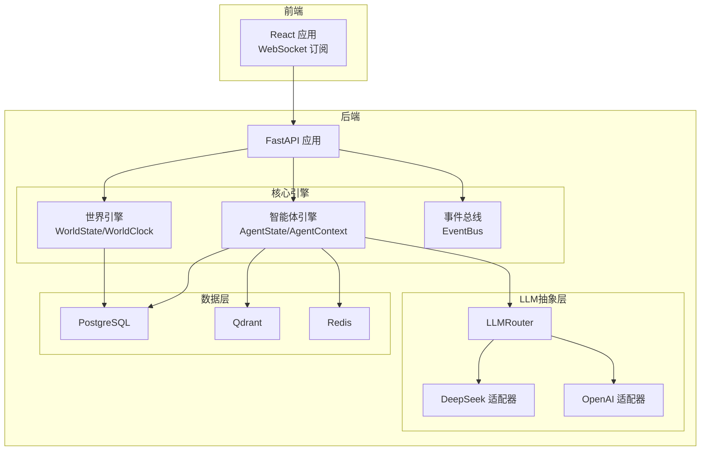
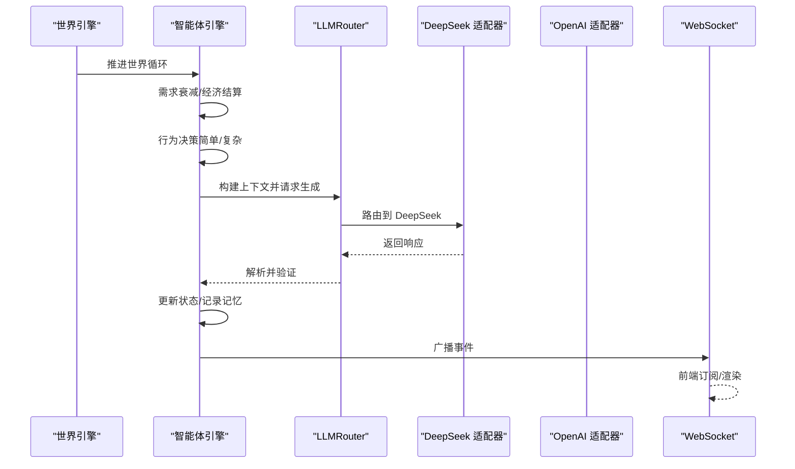
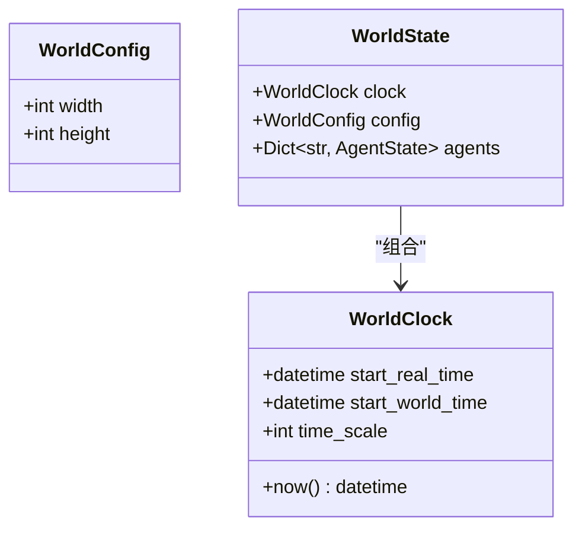
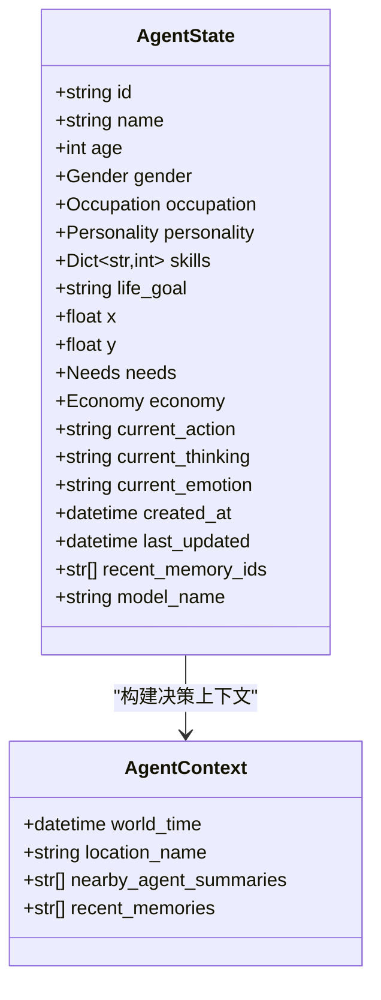
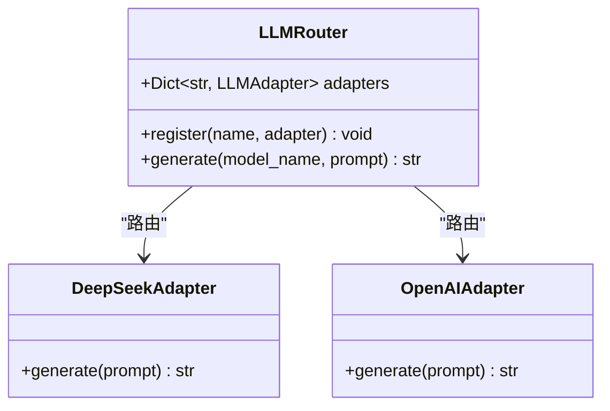
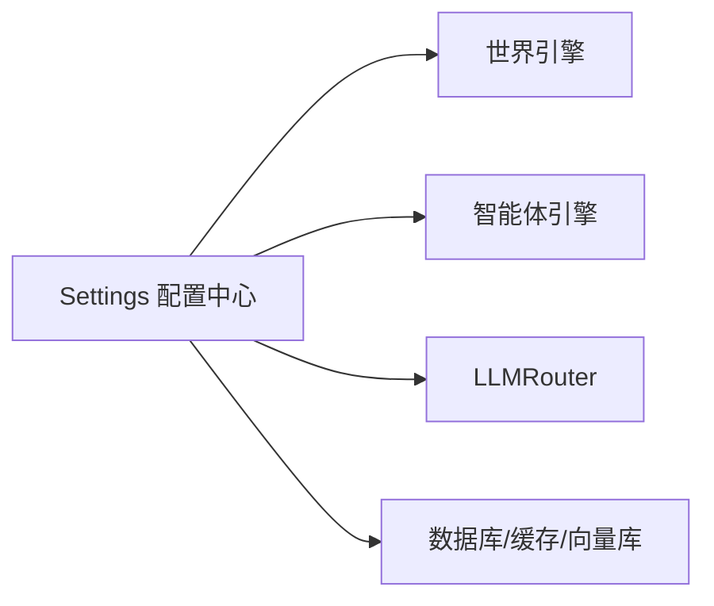

# 运行时错误

<cite>
**本文引用的文件**
- [backend/app/core/world.py](file://backend/app/core/world.py)
- [backend/app/core/agent.py](file://backend/app/core/agent.py)
- [backend/app/core/config.py](file://backend/app/core/config.py)
- [specs/01-architecture.spec.md](file://specs/01-architecture.spec.md)
- [specs/06-api-design.spec.md](file://specs/06-api-design.spec.md)
- [specs/08-implementation-plan.spec.md](file://specs/08-implementation-plan.spec.md)
</cite>

## 目录
1. [简介](#简介)
2. [项目结构](#项目结构)
3. [核心组件](#核心组件)
4. [架构总览](#架构总览)
5. [详细组件分析](#详细组件分析)
6. [依赖分析](#依赖分析)
7. [性能考虑](#性能考虑)
8. [故障排除指南](#故障排除指南)
9. [结论](#结论)
10. [附录](#附录)

## 简介
本指南聚焦于AI Society项目在运行过程中可能出现的核心错误与系统级问题，覆盖世界引擎初始化失败、智能体创建异常、LLM模型调用错误、数据库连接超时、WebSocket连接中断、内存溢出、性能指标异常、资源耗尽与并发访问冲突等场景。文档提供错误堆栈分析方法、日志级别建议、关键错误码含义、具体错误示例与排查步骤，并给出面向实际代码实现的定位与修复路径。

## 项目结构
后端采用分层架构：核心引擎层（世界引擎、智能体引擎、事件总线）、LLM抽象层（多模型路由与适配器）、数据持久层（PostgreSQL/Qdrant/Redis），以及FastAPI提供的REST与WebSocket接口。前端通过WebSocket订阅实时事件流，实现可视化观察。

图表来源
- [specs/01-architecture.spec.md](file://specs/01-architecture.spec.md#L1-L255)
- [backend/app/core/world.py](file://backend/app/core/world.py#L1-L40)
- [backend/app/core/agent.py](file://backend/app/core/agent.py#L1-L92)
- [backend/app/core/config.py](file://backend/app/core/config.py#L1-L42)

章节来源
- [specs/01-architecture.spec.md](file://specs/01-architecture.spec.md#L1-L255)

## 核心组件
- 世界引擎：维护世界时钟与全局状态，负责世界循环推进与事件触发。
- 智能体引擎：管理智能体状态、需求、经济、记忆与决策上下文。
- LLM抽象层：通过路由器根据模型名路由至对应适配器，屏蔽多厂商差异。
- 配置中心：集中管理环境、数据库、Redis、向量库与LLM提供商等配置项。

章节来源
- [backend/app/core/world.py](file://backend/app/core/world.py#L8-L40)
- [backend/app/core/agent.py](file://backend/app/core/agent.py#L25-L92)
- [backend/app/core/config.py](file://backend/app/core/config.py#L7-L42)

## 架构总览
世界循环以固定节奏推进，每10分钟（现实1分钟）执行一次：时间推进、智能体更新（需求衰减、经济结算、行为决策）、社交互动、事件广播。智能体复杂决策通过LLMRouter路由到具体模型，响应解析后更新状态并广播事件；前端通过WebSocket订阅实时事件流。

图表来源
- [specs/01-architecture.spec.md](file://specs/01-architecture.spec.md#L180-L227)
- [specs/08-implementation-plan.spec.md](file://specs/08-implementation-plan.spec.md#L113-L137)

## 详细组件分析

### 世界引擎初始化与时间推进
- 世界时钟基于UTC时间差计算世界时间，时间缩放因子可配置。
- 世界状态持有时钟与智能体字典，当前使用内存存储，后续可替换为数据库/缓存。

图表来源
- [backend/app/core/world.py](file://backend/app/core/world.py#L8-L40)

章节来源
- [backend/app/core/world.py](file://backend/app/core/world.py#L8-L40)

### 智能体状态与决策上下文
- 智能体包含身份、位置、需求、经济、个性、技能、记忆索引与所用模型名等字段。
- 决策上下文包含世界时间、位置名称、附近智能体摘要与近期记忆列表。

图表来源
- [backend/app/core/agent.py](file://backend/app/core/agent.py#L25-L92)

章节来源
- [backend/app/core/agent.py](file://backend/app/core/agent.py#L25-L92)

### LLM抽象层与路由
- LLMRouter根据模型名映射到具体适配器（如DeepSeek、OpenAI），并进行调用与结果解析。
- 实现层面需确保模型名合法、适配器存在、调用频率与成本控制。

图表来源
- [specs/08-implementation-plan.spec.md](file://specs/08-implementation-plan.spec.md#L113-L137)

章节来源
- [specs/08-implementation-plan.spec.md](file://specs/08-implementation-plan.spec.md#L113-L137)

## 依赖分析
- 配置中心集中管理数据库URL、Redis URL、向量库URL、LLM提供商列表及各厂商API密钥。
- 世界引擎与智能体引擎依赖配置中心读取运行参数。
- LLM抽象层依赖配置中心中的提供商列表与密钥。

图表来源
- [backend/app/core/config.py](file://backend/app/core/config.py#L7-L42)

章节来源
- [backend/app/core/config.py](file://backend/app/core/config.py#L7-L42)

## 性能考虑
- 智能体数量目标：50–200；前端帧率目标：60fps；API响应时间<100ms；WebSocket延迟<50ms；LLM调用频率：每智能体每10分钟最多1次；内存占用<2GB。
- 世界循环应避免阻塞，复杂决策通过异步LLM调用与后台任务调度实现。

章节来源
- [specs/01-architecture.spec.md](file://specs/01-architecture.spec.md#L245-L255)

## 故障排除指南

### 一、世界引擎初始化失败
常见症状
- 世界时钟无法计算或抛出异常
- 世界状态agents字典为空导致后续逻辑崩溃

可能原因
- 时钟起始时间未正确初始化
- 世界配置宽高非法或越界
- 循环导入导致AgentState未就绪（当前文件末尾导入）

排查步骤
- 检查世界时钟构造参数与UTC时间差计算
- 校验世界配置宽高是否为正数且在合理范围
- 确认WorldState.agents初始化为字典，避免None引用
- 若使用数据库持久化，检查数据库连接字符串与权限

修复建议
- 明确起始时间与时间缩放因子，确保时钟now()返回有效datetime
- 为WorldConfig增加默认值与边界校验
- 将AgentState导入移至文件末尾，避免循环引用

章节来源
- [backend/app/core/world.py](file://backend/app/core/world.py#L8-L40)

### 二、智能体创建异常
常见症状
- 创建智能体时报错“找不到智能体”或“参数错误”
- 智能体状态字段缺失或类型不匹配

可能原因
- 缺少必要字段（如id/name/age/gender/occupation）
- 模型名不在允许列表中
- 位置或经济配置非法
- 重复ID导致插入冲突

排查步骤
- 校验AgentState构造参数与枚举值（性别、职业）
- 确认model_name在配置的llm_providers中
- 检查位置列表与容量，避免超员
- 查看数据库唯一约束与索引

修复建议
- 在创建服务中增加字段校验与默认值填充
- 为model_name提供默认值并做白名单校验
- 为重复ID生成策略与数据库唯一键约束

章节来源
- [backend/app/core/agent.py](file://backend/app/core/agent.py#L25-L92)
- [backend/app/core/config.py](file://backend/app/core/config.py#L24-L29)
- [specs/06-api-design.spec.md](file://specs/06-api-design.spec.md#L636-L647)

### 三、LLM模型调用错误
常见症状
- “未知模型”或“模型不可用”
- LLM调用超时、限流或返回空响应
- 成本统计异常或超出预算

可能原因
- 模型名不在LLMRouter注册表中
- API密钥缺失或无效
- 基础URL不可达或跨域限制
- 调用频率过高被限流

排查步骤
- 确认model_name与llm_providers一致
- 检查DEEPSEEK_API_KEY/OPENAI_API_KEY是否设置
- 验证DEEPSEEK_BASE_URL/VECTOR_STORE_URL可达
- 查看限流阈值与速率限制配置
- 分析日志中的HTTP状态码与错误信息

修复建议
- 在LLMRouter中增加模型名校验与兜底策略
- 为每个适配器实现重试与熔断机制
- 增加调用成本统计与预算告警

章节来源
- [specs/08-implementation-plan.spec.md](file://specs/08-implementation-plan.spec.md#L113-L137)
- [backend/app/core/config.py](file://backend/app/core/config.py#L31-L36)

### 四、数据库连接超时
常见症状
- 初始化数据库连接时超时或拒绝
- 查询/事务执行报错

可能原因
- DATABASE_URL配置错误或数据库未启动
- 网络策略限制（容器间连通性）
- 连接池耗尽或事务长时间占用

排查步骤
- 校验DATABASE_URL格式与主机/端口可达性
- 检查数据库服务状态与认证信息
- 查看连接池大小与最大连接数
- 监控慢查询与锁等待

修复建议
- 使用健康检查脚本验证数据库连通性
- 调整连接池参数与超时阈值
- 为长事务拆分与加索引优化

章节来源
- [backend/app/core/config.py](file://backend/app/core/config.py#L15-L16)
- [specs/01-architecture.spec.md](file://specs/01-architecture.spec.md#L51-L56)

### 五、WebSocket连接中断
常见症状
- 前端无法接收事件或连接频繁断开
- 订阅消息未生效或事件丢失

可能原因
- WebSocket服务器未启动或端口被占用
- 前端URL错误或CORS未配置
- 服务器负载过高导致丢弃连接
- 网络中间件（NAT/防火墙）中断长连接

排查步骤
- 校验WebSocket地址与端口
- 检查后端路由与订阅逻辑
- 查看服务器日志与连接数上限
- 使用抓包工具确认握手与心跳

修复建议
- 增加重连与断线恢复机制
- 优化事件广播性能，减少阻塞
- 配置反向代理与心跳保活

章节来源
- [specs/06-api-design.spec.md](file://specs/06-api-design.spec.md#L411-L425)
- [specs/06-api-design.spec.md](file://specs/06-api-design.spec.md#L597-L617)

### 六、内存溢出
常见症状
- 进程OOM或频繁GC导致卡顿
- 智能体数量增长后内存持续攀升

可能原因
- 事件/记忆未清理，agents字典无限增长
- 大对象未释放或缓存未淘汰
- 日志级别过高产生大量临时对象

排查步骤
- 监控进程内存曲线与对象数量
- 检查事件总线与记忆索引是否清理
- 分析热点路径中的大对象分配

修复建议
- 为agents与事件设置容量上限与淘汰策略
- 使用弱引用或分页加载
- 降低日志级别，避免高频格式化

章节来源
- [specs/01-architecture.spec.md](file://specs/01-architecture.spec.md#L245-L255)

### 七、性能监控指标异常
常见症状
- API响应时间超过阈值
- WebSocket延迟升高
- LLM调用频率异常

可能原因
- 世界循环阻塞或并发不足
- LLM调用未异步化
- 前端批量更新未合并

排查步骤
- 使用指标埋点记录关键链路耗时
- 检查并发任务与线程池配置
- 分析LLM调用频率与成本

修复建议
- 将阻塞操作异步化与批量化
- 为LLM调用增加队列与背压
- 优化前端渲染与状态更新

章节来源
- [specs/01-architecture.spec.md](file://specs/01-architecture.spec.md#L245-L255)

### 八、资源耗尽与并发访问冲突
常见症状
- CPU/IO瓶颈、连接数过多
- 数据竞争导致状态不一致

可能原因
- 未限制并发任务数量
- 未加锁或锁粒度过粗
- 缓存未命中导致重复计算

排查步骤
- 监控CPU、内存、连接数与队列长度
- 检查共享资源访问路径
- 分析热点数据与热点函数

修复建议
- 为关键路径增加限流与熔断
- 使用细粒度锁或无锁数据结构
- 引入缓存与预计算

章节来源
- [specs/01-architecture.spec.md](file://specs/01-architecture.spec.md#L64-L70)

### 九、错误堆栈分析方法与日志级别
- 堆栈分析：从调用链最外层API进入，逐层定位到具体适配器或数据库驱动；关注异常类型与上下文参数。
- 日志级别建议：开发环境DEBUG，生产环境INFO；对LLM调用与数据库操作启用细粒度日志，但避免输出敏感信息。
- 关键错误码含义（参考API规范）：
  - AGENT_NOT_FOUND：智能体不存在
  - LOCATION_NOT_FOUND：位置不存在
  - CONVERSATION_NOT_FOUND：对话不存在
  - INVALID_PARAMETER：参数错误
  - WORLD_PAUSED：世界已暂停，无法执行操作
  - RATE_LIMITED：请求过于频繁
  - INTERNAL_ERROR：服务器内部错误

章节来源
- [specs/06-api-design.spec.md](file://specs/06-api-design.spec.md#L619-L647)

## 结论
本指南提供了从架构到实现层面的运行时错误排查路径。建议在开发与生产环境中结合日志、指标与告警体系，针对世界引擎初始化、智能体创建、LLM调用、数据库与WebSocket等关键环节建立自动化巡检与快速回滚机制，确保系统稳定与可观测性。

## 附录

### A. 错误码对照表（节选）
- AGENT_NOT_FOUND：404，智能体不存在
- LOCATION_NOT_FOUND：404，位置不存在
- CONVERSATION_NOT_FOUND：404，对话不存在
- INVALID_PARAMETER：400，参数错误
- WORLD_PAUSED：409，世界已暂停，无法执行操作
- RATE_LIMITED：429，请求过于频繁
- INTERNAL_ERROR：500，服务器内部错误

章节来源
- [specs/06-api-design.spec.md](file://specs/06-api-design.spec.md#L636-L647)