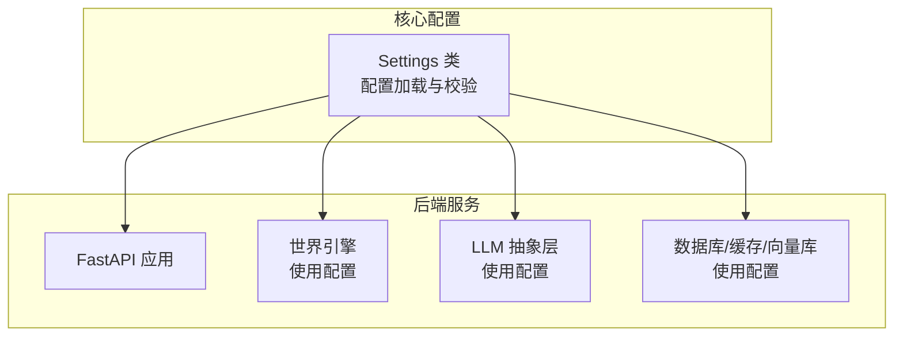
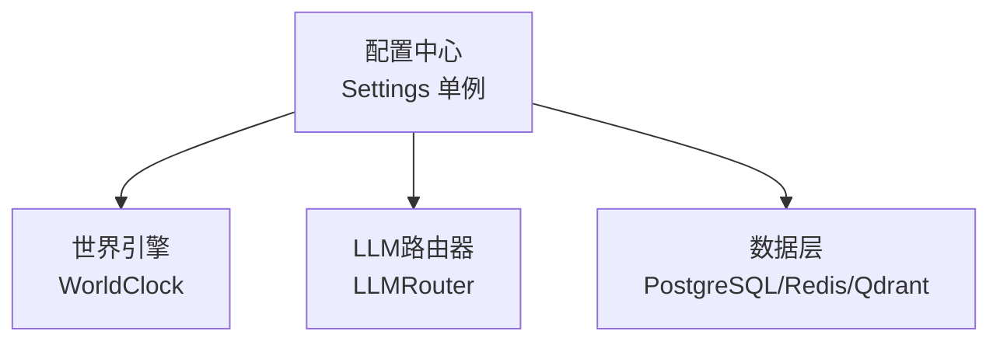
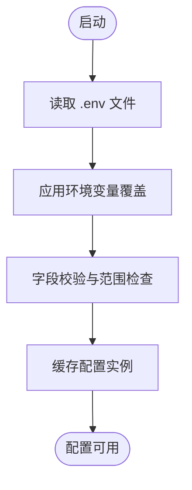
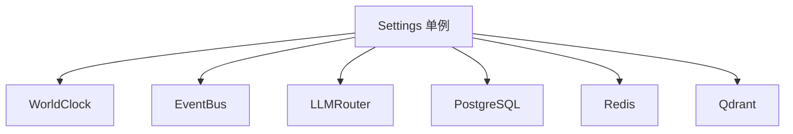

# 配置问题

<cite>
**本文引用的文件**
- [backend/app/core/config.py](file://backend/app/core/config.py)
- [specs/01-架构规格说明.md](file://specs/01-architecture.spec.md)
- [specs/03-经济系统.spec.md](file://specs/03-economy-system.spec.md)
- [specs/04-对话与社交系统.spec.md](file://specs/04-对话与社交系统.spec.md)
- [specs/06-API设计.spec.md](file://specs/06-API设计.spec.md)
- [backend/app/core/world.py](file://backend/app/core/world.py)
</cite>

## 目录
1. [简介](#简介)
2. [项目结构](#项目结构)
3. [核心组件](#核心组件)
4. [架构总览](#架构总览)
5. [详细组件分析](#详细组件分析)
6. [依赖分析](#依赖分析)
7. [性能考虑](#性能考虑)
8. [故障排除指南](#故障排除指南)
9. [结论](#结论)
10. [附录](#附录)

## 简介
本指南聚焦于“AI Society”项目在实际运行中可能遇到的配置问题，围绕以下方面提供系统化的排查与修复建议：
- 环境变量配置错误与优先级
- 数据库连接字符串问题
- LLM API密钥配置失败
- Redis连接问题
- Qdrant向量数据库配置异常
- 配置热更新机制与验证方法
- 配置文件格式验证与变更影响分析
- 生产环境配置最佳实践、安全配置检查与配置备份恢复

## 项目结构
后端采用分层架构，配置集中于核心模块，通过统一的设置类加载与缓存，确保全局一致的配置来源与优先级。

**图表来源**
- [backend/app/core/config.py](file://backend/app/core/config.py#L19-L32)
- [specs/01-架构规格说明.md](file://specs/01-架构规格说明.md#L38-L56)

**章节来源**
- [specs/01-架构规格说明.md](file://specs/01-架构规格说明.md#L38-L56)

## 核心组件
- 配置类与加载策略
  - 使用 pydantic-settings 的 Settings 类统一管理配置项，并通过 .env 文件与环境变量注入。
  - 配置优先级：环境变量 > .env 文件 > 默认值。
  - 通过单例缓存避免重复初始化，保证配置在进程生命周期内一致。
- 关键配置项
  - LLM相关：DeepSeek API密钥、基础URL、默认模型
  - 成本控制：月度预算、成本预警阈值
  - 数据库：PostgreSQL连接URL
  - 缓存：Redis连接URL
  - 向量库：Qdrant URL与集合名
  - 智能体与对话：初始/最大智能体数量、决策间隔、对话轮次与触发距离
  - 日志：日志级别与可选日志文件

**章节来源**
- [backend/app/core/config.py](file://backend/app/core/config.py#L19-L32)
- [backend/app/core/config.py](file://backend/app/core/config.py#L53-L64)
- [backend/app/core/config.py](file://backend/app/core/config.py#L69-L79)
- [backend/app/core/config.py](file://backend/app/core/config.py#L84-L87)
- [backend/app/core/config.py](file://backend/app/core/config.py#L92-L95)
- [backend/app/core/config.py](file://backend/app/core/config.py#L100-L107)
- [backend/app/core/config.py](file://backend/app/core/config.py#L112-L129)
- [backend/app/core/config.py](file://backend/app/core/config.py#L134-L145)
- [backend/app/core/config.py](file://backend/app/core/config.py#L150-L157)
- [backend/app/core/config.py](file://backend/app/core/config.py#L160-L170)

## 架构总览
配置贯穿应用各层，世界引擎、LLM抽象层与数据层均依赖配置驱动其行为与连接参数。

**图表来源**
- [backend/app/core/world.py](file://backend/app/core/world.py#L31-L31)
- [specs/01-架构规格说明.md](file://specs/01-架构规格说明.md#L38-L56)

**章节来源**
- [backend/app/core/world.py](file://backend/app/core/world.py#L31-L31)
- [specs/01-架构规格说明.md](file://specs/01-架构规格说明.md#L38-L56)

## 详细组件分析

### 配置加载与优先级
- 加载来源与顺序
  - 环境变量：最高优先级，覆盖所有其他来源
  - .env 文件：次之，用于本地开发与容器编排
  - 默认值：最低优先级，未显式配置时生效
- 配置校验
  - 数值范围校验（如时间缩放、预算、智能体数量等）
  - 字符串字段描述明确，便于排查
- 单例缓存
  - 通过缓存函数确保配置实例唯一，避免重复解析带来的资源浪费

**图表来源**
- [backend/app/core/config.py](file://backend/app/core/config.py#L27-L32)
- [backend/app/core/config.py](file://backend/app/core/config.py#L160-L170)

**章节来源**
- [backend/app/core/config.py](file://backend/app/core/config.py#L27-L32)
- [backend/app/core/config.py](file://backend/app/core/config.py#L160-L170)

### 数据库配置错误排查
- 常见症状
  - 应用启动时报数据库连接失败
  - 查询/写入操作报错，事务回滚
- 排查步骤
  - 确认连接URL格式正确（含协议、主机、端口、数据库名、凭据）
  - 校验网络连通性与防火墙策略
  - 核对数据库服务状态与用户权限
  - 检查SSL/TLS配置（如启用）
  - 验证 .env 或环境变量中 DATABASE_URL 是否被正确注入
- 影响范围
  - ORM层无法建立连接，导致模型初始化失败
  - 业务服务（如经济、对话、智能体）无法持久化状态

**章节来源**
- [backend/app/core/config.py](file://backend/app/core/config.py#L84-L87)
- [specs/03-经济系统.spec.md](file://specs/03-经济系统.spec.md#L314-L342)
- [specs/04-对话与社交系统.spec.md](file://specs/04-对话与社交系统.spec.md#L509-L536)

### Redis连接问题排查
- 常见症状
  - 缓存/消息队列不可用，事件广播延迟
  - 会话状态丢失或异常
- 排查步骤
  - 确认连接URL格式与认证信息
  - 检查Redis服务健康状态与内存水位
  - 校验网络连通性与安全组规则
  - 验证 .env 或环境变量中 REDIS_URL 是否生效
- 影响范围
  - 会话、事件总线、后台任务调度等依赖缓存的功能受影响

**章节来源**
- [backend/app/core/config.py](file://backend/app/core/config.py#L92-L95)

### Qdrant向量数据库配置异常排查
- 常见症状
  - 向量检索失败、集合不存在或无法写入
  - 记忆系统无法保存/加载向量
- 排查步骤
  - 确认Qdrant服务可达且版本兼容
  - 校验集合名称与索引配置
  - 检查网络策略与代理设置
  - 验证 .env 或环境变量中 QDRANT_URL 与 QDRANT_COLLECTION 是否正确
- 影响范围
  - 记忆检索与相似度匹配功能受限

**章节来源**
- [backend/app/core/config.py](file://backend/app/core/config.py#L100-L107)

### LLM API密钥配置失败排查
- 常见症状
  - LLM调用失败、鉴权错误或额度耗尽
  - 智能体无法生成对话或决策
- 排查步骤
  - 确认API密钥存在且未过期
  - 校验基础URL与模型名称
  - 检查服务商配额与账单状态
  - 验证 .env 或环境变量中 DEEPSEEK_API_KEY 与 DEEPSEEK_BASE_URL 是否生效
- 影响范围
  - 对话引擎与复杂决策流程阻塞

**章节来源**
- [backend/app/core/config.py](file://backend/app/core/config.py#L53-L64)

## 依赖分析
配置在系统中的依赖关系如下：

**图表来源**
- [backend/app/core/world.py](file://backend/app/core/world.py#L31-L31)
- [specs/01-架构规格说明.md](file://specs/01-架构规格说明.md#L38-L56)

**章节来源**
- [backend/app/core/world.py](file://backend/app/core/world.py#L31-L31)
- [specs/01-架构规格说明.md](file://specs/01-架构规格说明.md#L38-L56)

## 性能考虑
- 配置缓存
  - 使用单例缓存减少重复解析与IO开销
- 连接池与超时
  - 数据库、Redis、Qdrant应配置合理的连接池大小与超时参数，避免阻塞
- LLM调用频率限制
  - 通过系统设计限制调用频率，避免触发服务商限流

**章节来源**
- [backend/app/core/config.py](file://backend/app/core/config.py#L160-L170)
- [specs/01-架构规格说明.md](file://specs/01-架构规格说明.md#L229-L239)

## 故障排除指南

### 一、环境变量与配置文件检查清单
- 必填项核对
  - 数据库连接URL：DATABASE_URL
  - Redis连接URL：REDIS_URL
  - Qdrant地址与集合：QDRANT_URL、QDRANT_COLLECTION
  - DeepSeek API密钥与基础URL：DEEPSEEK_API_KEY、DEEPSEEK_BASE_URL
  - 默认模型：DEFAULT_MODEL
- 可选项核对
  - 月度预算与预警阈值：MONTHLY_BUDGET、COST_WARNING_THRESHOLD
  - 日志级别与日志文件：LOG_LEVEL、LOG_FILE
- 优先级验证
  - 确认环境变量覆盖了 .env 文件中的同名项
  - 在容器环境中确认环境变量注入正确

**章节来源**
- [backend/app/core/config.py](file://backend/app/core/config.py#L27-L32)
- [backend/app/core/config.py](file://backend/app/core/config.py#L53-L64)
- [backend/app/core/config.py](file://backend/app/core/config.py#L69-L79)
- [backend/app/core/config.py](file://backend/app/core/config.py#L84-L87)
- [backend/app/core/config.py](file://backend/app/core/config.py#L92-L95)
- [backend/app/core/config.py](file://backend/app/core/config.py#L100-L107)
- [backend/app/core/config.py](file://backend/app/core/config.py#L150-L157)

### 二、配置文件验证方法
- .env 文件格式
  - 使用键值对形式，避免空格与特殊字符
  - 避免在值中使用未转义的引号
- 配置项范围校验
  - 数值字段需满足最小/最大范围
  - 字符串字段需符合预期格式
- 运行时验证
  - 在应用启动阶段打印关键配置摘要，便于快速定位问题

**章节来源**
- [backend/app/core/config.py](file://backend/app/core/config.py#L27-L32)
- [backend/app/core/config.py](file://backend/app/core/config.py#L43-L48)
- [backend/app/core/config.py](file://backend/app/core/config.py#L69-L79)
- [backend/app/core/config.py](file://backend/app/core/config.py#L112-L129)
- [backend/app/core/config.py](file://backend/app/core/config.py#L134-L145)

### 三、配置热更新机制
- 当前实现
  - 配置为单例缓存，进程重启前不会重新加载
- 建议方案
  - 在守护进程中监听配置文件变更并触发优雅重启
  - 对关键配置（如LLM模型、预算阈值）提供运行时开关或API端点（需评估安全与一致性）

**章节来源**
- [backend/app/core/config.py](file://backend/app/core/config.py#L160-L170)

### 四、数据库配置错误排查
- 步骤
  - 使用连接字符串直连验证（含凭据与网络）
  - 检查数据库服务日志与慢查询
  - 核对用户权限与角色
- 影响分析
  - ORM初始化失败、事务无法提交、数据丢失风险

**章节来源**
- [backend/app/core/config.py](file://backend/app/core/config.py#L84-L87)
- [specs/03-经济系统.spec.md](file://specs/03-经济系统.spec.md#L314-L342)
- [specs/04-对话与社交系统.spec.md](file://specs/04-对话与社交系统.spec.md#L509-L536)

### 五、Redis连接问题排查
- 步骤
  - 使用客户端工具连接验证
  - 检查内存水位与持久化策略
  - 核对ACL与密码
- 影响分析
  - 事件广播延迟、会话状态异常

**章节来源**
- [backend/app/core/config.py](file://backend/app/core/config.py#L92-L95)

### 六、Qdrant向量数据库配置异常排查
- 步骤
  - 检查集合是否存在与索引状态
  - 校验网络连通与代理设置
  - 查看服务端日志
- 影响分析
  - 记忆检索失败、向量相似度计算异常

**章节来源**
- [backend/app/core/config.py](file://backend/app/core/config.py#L100-L107)

### 七、LLM API密钥配置失败排查
- 步骤
  - 校验密钥有效性与权限范围
  - 检查服务商配额与账单
  - 验证基础URL与模型名称
- 影响分析
  - 智能体无法生成对话或决策

**章节来源**
- [backend/app/core/config.py](file://backend/app/core/config.py#L53-L64)

### 八、配置变更影响分析
- 数据库/缓存/向量库
  - 连接参数变更需重启相关服务
  - 集群/副本配置变更需同步更新
- LLM
  - 模型切换影响成本与性能
  - 基础URL变更影响可用性
- 经济与对话
  - 预算与阈值变更影响成本控制策略
  - 决策间隔与对话轮次影响系统负载

**章节来源**
- [specs/03-经济系统.spec.md](file://specs/03-经济系统.spec.md#L92-L109)
- [specs/04-对话与社交系统.spec.md](file://specs/04-对话与社交系统.spec.md#L170-L188)

### 九、生产环境配置最佳实践
- 安全
  - 将敏感配置置于环境变量或密管系统，不在代码仓库中提交
  - 限制数据库与外部服务的访问白名单
- 可靠性
  - 为数据库、Redis、Qdrant配置健康检查与告警
  - 设置连接超时与重试策略
- 可观测性
  - 启用日志级别与结构化日志
  - 记录关键配置摘要与变更历史

**章节来源**
- [backend/app/core/config.py](file://backend/app/core/config.py#L150-L157)
- [specs/06-API设计.spec.md](file://specs/06-API设计.spec.md#L636-L655)

### 十、配置备份与恢复
- 备份
  - 定期导出 .env 文件与密钥管理系统的配置快照
  - 记录当前生效的配置摘要（含版本与时间戳）
- 恢复
  - 在灾难恢复演练中验证 .env 与密钥注入流程
  - 逐步回滚并验证各组件连通性

**章节来源**
- [backend/app/core/config.py](file://backend/app/core/config.py#L27-L32)

## 结论
通过明确配置优先级、规范 .env 文件格式、强化连接参数校验与监控告警，可显著降低配置相关故障的发生率与影响面。建议在生产环境中结合密管系统与自动化巡检，确保配置的机密性、一致性与可追溯性。

## 附录

### A. 配置项优先级说明
- 环境变量 > .env 文件 > 默认值
- 适用于所有配置项，包括数据库、缓存、向量库、LLM与业务参数

**章节来源**
- [backend/app/core/config.py](file://backend/app/core/config.py#L6-L9)

### B. 关键配置项一览
- 数据库：DATABASE_URL
- 缓存：REDIS_URL
- 向量库：QDRANT_URL、QDRANT_COLLECTION
- LLM：DEEPSEEK_API_KEY、DEEPSEEK_BASE_URL、DEFAULT_MODEL
- 成本控制：MONTHLY_BUDGET、COST_WARNING_THRESHOLD
- 智能体与对话：INITIAL_AGENT_COUNT、MAX_AGENT_COUNT、DECISION_INTERVAL_SECONDS、MAX_CONVERSATION_TURNS、CONVERSATION_TRIGGER_DISTANCE
- 日志：LOG_LEVEL、LOG_FILE

**章节来源**
- [backend/app/core/config.py](file://backend/app/core/config.py#L84-L87)
- [backend/app/core/config.py](file://backend/app/core/config.py#L92-L95)
- [backend/app/core/config.py](file://backend/app/core/config.py#L100-L107)
- [backend/app/core/config.py](file://backend/app/core/config.py#L53-L64)
- [backend/app/core/config.py](file://backend/app/core/config.py#L69-L79)
- [backend/app/core/config.py](file://backend/app/core/config.py#L112-L129)
- [backend/app/core/config.py](file://backend/app/core/config.py#L134-L145)
- [backend/app/core/config.py](file://backend/app/core/config.py#L150-L157)