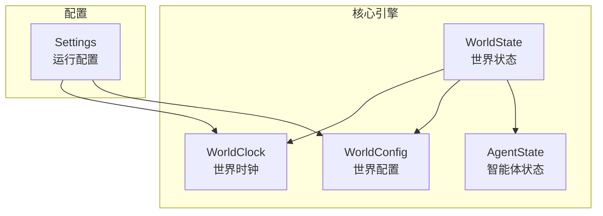
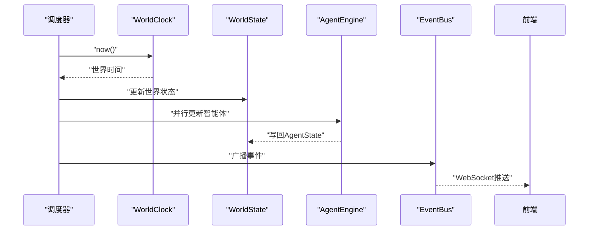
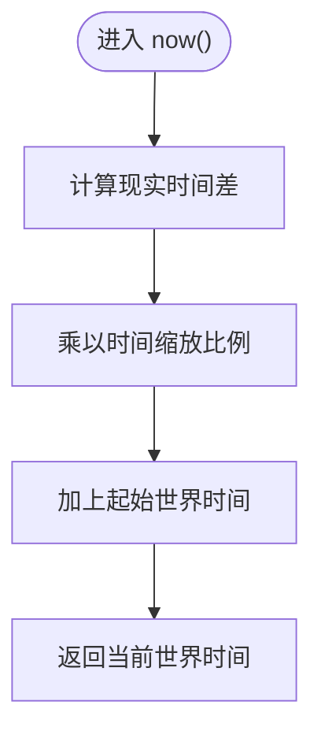
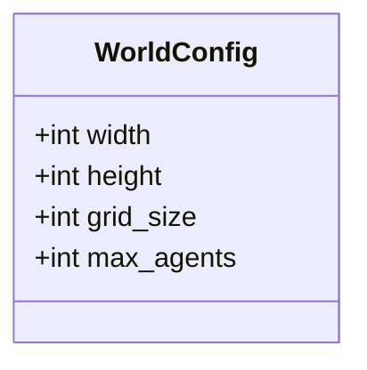
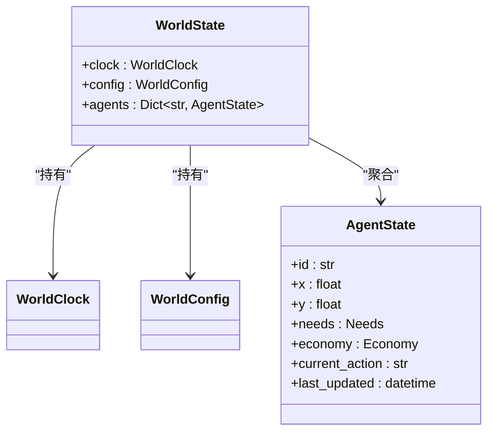
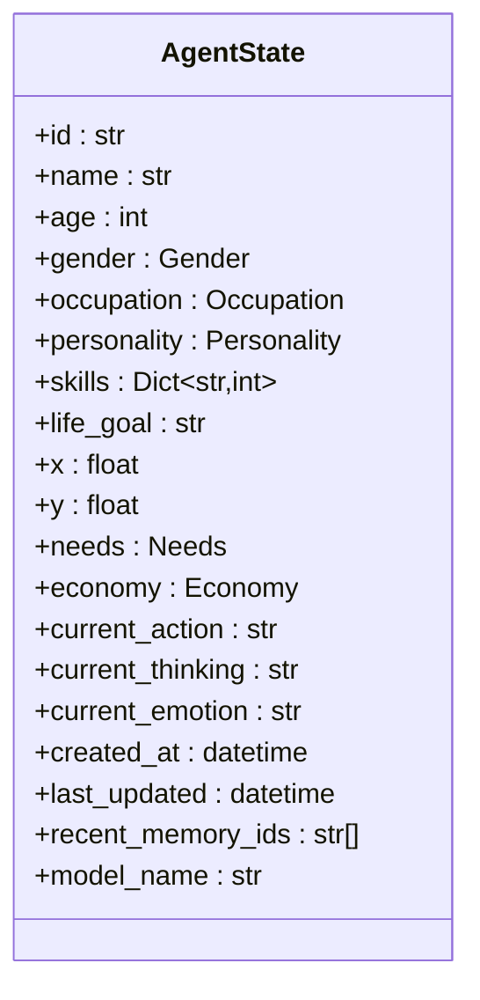
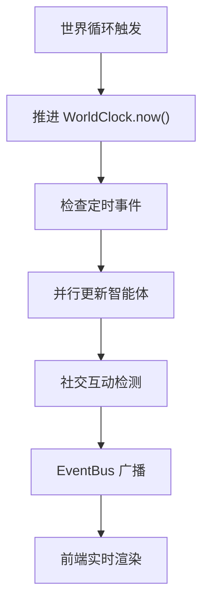
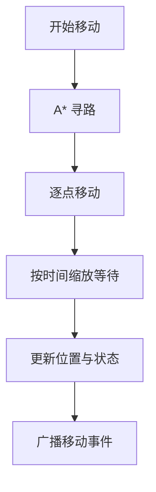
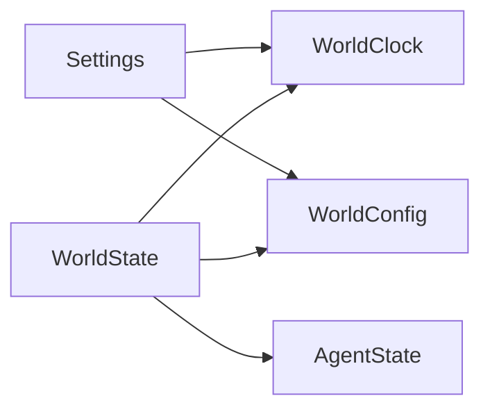

# 世界状态模型

<cite>
**本文档引用的文件**
- [backend/app/core/world.py](file://backend/app/core/world.py)
- [backend/app/core/agent.py](file://backend/app/core/agent.py)
- [backend/app/core/config.py](file://backend/app/core/config.py)
- [specs/01-architecture.spec.md](file://specs/01-architecture.spec.md)
- [specs/05-world-map.spec.md](file://specs/05-world-map.spec.md)
- [specs/06-api-design.spec.md](file://specs/06-api-design.spec.md)
</cite>

## 目录
1. [简介](#简介)
2. [项目结构](#项目结构)
3. [核心组件](#核心组件)
4. [架构概览](#架构概览)
5. [详细组件分析](#详细组件分析)
6. [依赖关系分析](#依赖关系分析)
7. [性能考量](#性能考量)
8. [故障排查指南](#故障排查指南)
9. [结论](#结论)
10. [附录](#附录)

## 简介
本文件围绕“世界状态数据模型”展开，系统性梳理 WorldState、WorldClock、WorldConfig 等核心数据结构的设计理念与实现细节；解释世界时间管理系统（现实时间与虚拟时间的转换机制、时间缩放比例、时间同步策略）；阐述世界配置参数（地图尺寸、环境设置）的作用与配置方法；说明世界状态的内存存储结构、状态更新机制与并发访问控制现状；并给出状态序列化、快照生成与恢复流程建议，以及世界初始化配置示例与状态监控方法。

## 项目结构
后端采用分层模块化组织，核心引擎位于 backend/app/core，包含世界引擎、智能体引擎、事件总线等模块。世界状态模型主要集中在 world.py 与 agent.py，配置参数集中在 config.py。架构规范文档提供了世界循环、时间系统、地图与导航等高层设计约束。

**图表来源**
- [backend/app/core/world.py](file://backend/app/core/world.py#L8-L39)
- [backend/app/core/agent.py](file://backend/app/core/agent.py#L48-L92)
- [backend/app/core/config.py](file://backend/app/core/config.py#L7-L42)

**章节来源**
- [specs/01-architecture.spec.md](file://specs/01-architecture.spec.md#L180-L203)
- [specs/05-world-map.spec.md](file://specs/05-world-map.spec.md#L12-L28)

## 核心组件
- WorldClock：负责现实时间与虚拟时间的映射与推进，提供当前世界时间、昼夜判断与时段分类等能力。
- WorldConfig：定义世界地图尺寸、时间缩放、网格大小、最大智能体数量等全局配置。
- WorldState：聚合世界时钟、配置与智能体集合，作为世界引擎的内存状态容器。
- AgentState：描述单个智能体的位置、需求、经济、行为与心理状态等。

这些组件以数据类形式组织，强调不可变性与可序列化性，便于后续替换为数据库或缓存存储。

**章节来源**
- [backend/app/core/world.py](file://backend/app/core/world.py#L8-L39)
- [backend/app/core/agent.py](file://backend/app/core/agent.py#L48-L92)
- [backend/app/core/config.py](file://backend/app/core/config.py#L7-L42)

## 架构概览
世界引擎遵循“每 N 分钟（现实）推进一次世界循环”的模式：推进时间、触发定时事件、并行更新智能体、社交互动、事件广播。世界时钟与配置参数贯穿整个循环，确保时间尺度与地图约束一致。

**图表来源**
- [specs/01-architecture.spec.md](file://specs/01-architecture.spec.md#L180-L203)
- [specs/05-world-map.spec.md](file://specs/05-world-map.spec.md#L238-L286)

## 详细组件分析

### WorldClock：世界时间管理
- 设计理念
  - 将现实时间与虚拟时间解耦，通过固定的时间缩放比例实现“快进/慢放”的世界演进。
  - 以 UTC 为基准，避免时区差异带来的同步问题。
- 关键字段
  - start_real_time：记录世界启动时刻的现实时间。
  - start_world_time：记录世界启动时刻的虚拟时间。
  - time_scale：现实与虚拟时间的比例系数，默认 10。
- 核心方法
  - now()：根据现实时间差与缩放比例计算当前世界时间。
- 时间同步策略
  - 通过 start_real_time 与 start_world_time 的差值保持一致性，避免漂移。
  - 世界循环按固定周期（现实 N 分钟）推进，确保前端与后端时间步调一致。

**图表来源**
- [backend/app/core/world.py](file://backend/app/core/world.py#L16-L20)

**章节来源**
- [backend/app/core/world.py](file://backend/app/core/world.py#L8-L21)
- [specs/05-world-map.spec.md](file://specs/05-world-map.spec.md#L238-L286)

### WorldConfig：世界配置参数
- 设计理念
  - 将地图尺寸、时间缩放、网格大小、最大智能体数量等全局参数集中管理，便于运行时调整与持久化。
- 关键字段
  - width/height：地图像素尺寸，决定渲染边界与寻路网格范围。
  - grid_size：寻路网格大小，影响路径规划效率与精度。
  - max_agents：最大智能体数量，用于资源与性能控制。
- 配置方法
  - 运行时可通过 Settings.time_scale 与 WORLD_CONFIG 配置文件进行统一注入。
  - 世界初始化时读取配置并应用到 WorldState。

**图表来源**
- [specs/05-world-map.spec.md](file://specs/05-world-map.spec.md#L14-L28)

**章节来源**
- [specs/05-world-map.spec.md](file://specs/05-world-map.spec.md#L12-L28)
- [backend/app/core/config.py](file://backend/app/core/config.py#L12-L13)

### WorldState：世界状态容器
- 设计理念
  - 以数据类聚合世界时钟、配置与智能体集合，作为世界引擎的内存状态中枢。
  - 采用字典存储智能体，便于快速查找与更新。
- 关键字段
  - clock：世界时钟实例。
  - config：世界配置实例。
  - agents：智能体字典，键为智能体 ID，值为 AgentState。
- 并发访问控制现状
  - 当前为内存结构，未内置锁或原子操作；建议在世界循环与外部 API 调用之间引入互斥锁或不可变快照以保证一致性。

**图表来源**
- [backend/app/core/world.py](file://backend/app/core/world.py#L29-L39)
- [backend/app/core/agent.py](file://backend/app/core/agent.py#L48-L92)

**章节来源**
- [backend/app/core/world.py](file://backend/app/core/world.py#L29-L39)

### AgentState：智能体状态
- 设计理念
  - 将智能体的物理位置、心理需求、经济状况、行为与思考等状态整合在一个数据类中，便于序列化与传输。
- 关键字段
  - 位置：x/y。
  - 需求：能量、社交等。
  - 经济：金钱、收入、基础开销。
  - 行为：当前动作、思考、情绪。
  - 时间戳：创建与最后更新时间。
- 与世界状态的关系
  - 由 AgentEngine 在世界循环中更新，并写回到 WorldState.agents。

**图表来源**
- [backend/app/core/agent.py](file://backend/app/core/agent.py#L48-L92)

**章节来源**
- [backend/app/core/agent.py](file://backend/app/core/agent.py#L48-L92)

### 时间系统与世界循环
- 时间缩放与推进
  - 现实 1 分钟 ≈ 虚拟 10 分钟；世界循环按固定周期推进，前端与后端保持一致步调。
- 定时事件
  - 日出/日落、上下班、每日结算等事件在特定虚拟时间触发，驱动世界状态变化。
- 与导航系统的衔接
  - 寻路网格大小与时间缩放共同决定移动耗时与现实等待时间，保证视觉与逻辑一致。

**图表来源**
- [specs/01-architecture.spec.md](file://specs/01-architecture.spec.md#L180-L203)
- [specs/05-world-map.spec.md](file://specs/05-world-map.spec.md#L238-L329)

**章节来源**
- [specs/01-architecture.spec.md](file://specs/01-architecture.spec.md#L180-L203)
- [specs/05-world-map.spec.md](file://specs/05-world-map.spec.md#L238-L329)

### 地图与导航
- 地图尺寸与网格
  - WORLD_CONFIG 定义地图宽高与网格大小，寻路算法以网格坐标进行 A* 搜索。
- 导航执行
  - 移动速度与时间缩放结合，异步等待现实时间以匹配虚拟节奏。
- 位置状态
  - LocationState 提供拥挤度与空旷度等属性，辅助智能体决策。

**图表来源**
- [specs/05-world-map.spec.md](file://specs/05-world-map.spec.md#L331-L419)

**章节来源**
- [specs/05-world-map.spec.md](file://specs/05-world-map.spec.md#L331-L419)

## 依赖关系分析
- 组件耦合
  - WorldState 聚合 WorldClock 与 WorldConfig，同时持有 AgentState 字典。
  - Settings 为运行时配置来源，影响 WorldClock 与 WorldConfig 的默认值。
- 外部依赖
  - 架构文档指出使用 FastAPI、APScheduler、PostgreSQL、Qdrant、Redis 等，为后续持久化与扩展提供基础。

**图表来源**
- [backend/app/core/world.py](file://backend/app/core/world.py#L29-L39)
- [backend/app/core/config.py](file://backend/app/core/config.py#L7-L42)

**章节来源**
- [specs/01-architecture.spec.md](file://specs/01-architecture.spec.md#L100-L176)

## 性能考量
- 时间推进复杂度
  - WorldClock.now() 为 O(1)，成本极低。
- 智能体更新
  - 世界循环中并行处理智能体，需注意共享状态的并发安全。
- 寻路与移动
  - A* 算法复杂度取决于网格大小与障碍物密度；合理设置 grid_size 与 max_agents 可平衡性能与精度。
- 内存占用
  - 当前内存存储结构简单高效，但需关注智能体数量上限与序列化体积。

[本节为通用性能讨论，无需具体文件分析]

## 故障排查指南
- 世界时间异常
  - 检查 WorldClock 的 start_real_time 与 start_world_time 是否正确初始化，确认 time_scale 设置。
- 智能体状态不一致
  - 若存在并发写入，需引入互斥锁或不可变快照；确认 WorldState.agents 的更新路径。
- 导航失败
  - 核对网格大小与起点终点坐标，检查障碍物与可达性；验证移动等待时间与时间缩放的一致性。
- API 与 WebSocket
  - 参考 API 规范中的错误码与响应格式，定位请求参数与权限问题。

**章节来源**
- [specs/06-api-design.spec.md](file://specs/06-api-design.spec.md#L619-L655)

## 结论
世界状态模型以数据类为核心，清晰分离时间管理、配置与智能体状态，具备良好的可扩展性与可维护性。通过 Settings 与 WORLD_CONFIG 的统一注入，可在运行时灵活调整时间缩放与地图参数。建议在并发场景下引入锁或不可变快照，并为后续持久化与分布式部署预留接口。

[本节为总结性内容，无需具体文件分析]

## 附录

### 世界初始化配置示例
- 初始化步骤
  - 创建 WorldClock：设定起始现实时间与起始世界时间。
  - 创建 WorldConfig：设置地图尺寸、网格大小、最大智能体数量。
  - 创建 WorldState：注入 WorldClock、WorldConfig，并初始化空的 agents 字典。
  - 加载初始智能体模板并写入 agents。
- 配置来源
  - Settings.time_scale 与 WORLD_CONFIG 的字段值应与世界循环与地图系统保持一致。

**章节来源**
- [backend/app/core/world.py](file://backend/app/core/world.py#L8-L39)
- [specs/05-world-map.spec.md](file://specs/05-world-map.spec.md#L12-L28)
- [backend/app/core/config.py](file://backend/app/core/config.py#L12-L13)

### 状态监控方法
- 世界状态 API
  - 通过 /api/world/status 获取世界时间、昼夜状态、智能体数量等关键指标。
- WebSocket 实时事件
  - 订阅 agent_move、conversation_*、world_event 等事件，实现前端实时可视化。
- 统计与导出
  - 使用 /api/stats/* 获取人口、经济、社交统计；使用 /api/export/* 导出对话与智能体数据，辅助离线分析。

**章节来源**
- [specs/06-api-design.spec.md](file://specs/06-api-design.spec.md#L20-L108)
- [specs/06-api-design.spec.md](file://specs/06-api-design.spec.md#L411-L595)

### 序列化、快照与恢复
- 序列化格式
  - 建议采用 JSON/YAML/MessagePack 等轻量格式，优先序列化 WorldState 的核心字段（clock、config、agents）。
- 快照生成
  - 在世界循环间隙或外部指令触发时生成快照文件，包含时间戳与世界状态摘要。
- 状态恢复
  - 从快照文件加载 WorldState，重建 WorldClock 与 WorldConfig，并恢复 agents 字典。
- 并发与一致性
  - 恢复过程应阻塞世界循环，或使用不可变快照切换，避免并发写入导致的数据竞争。

[本节为通用流程建议，无需具体文件分析]