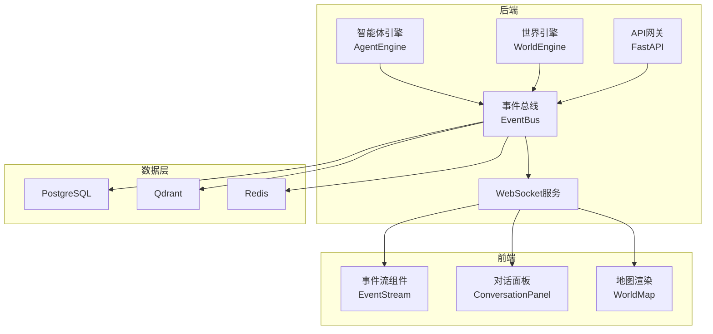
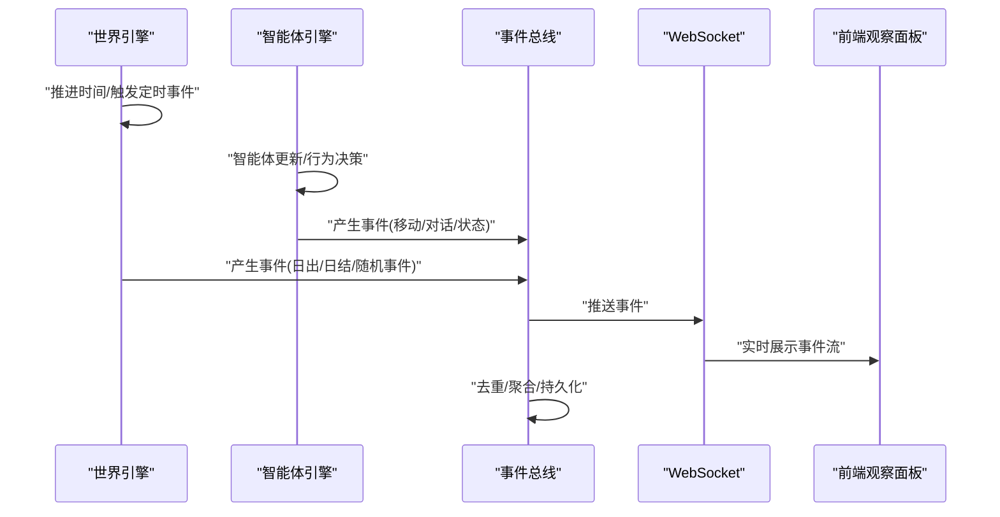
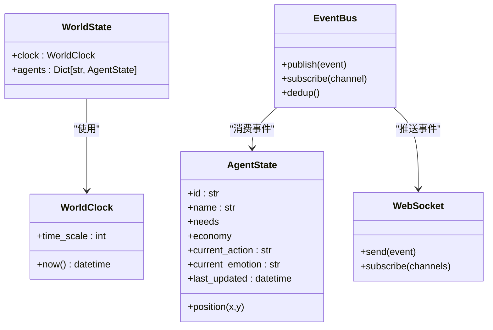

# 事件数据模型

<cite>
**本文档引用的文件**
- [项目概览.spec.md](file://specs/00-project-overview.spec.md)
- [系统架构.spec.md](file://specs/01-architecture.spec.md)
- [经济系统.spec.md](file://specs/03-economy-system.spec.md)
- [对话与社交系统.spec.md](file://specs/04-conversation-system.spec.md)
- [世界与地图系统.spec.md](file://specs/05-world-map.spec.md)
- [API与通信协议.spec.md](file://specs/06-api-design.spec.md)
- [前端.spec.md](file://specs/07-frontend.spec.md)
- [实现计划.spec.md](file://specs/08-implementation-plan.spec.md)
- [世界引擎.world.py](file://backend/app/core/world.py)
- [智能体数据结构.agent.py](file://backend/app/core/agent.py)
</cite>

## 目录
1. [简介](#简介)
2. [项目结构](#项目结构)
3. [核心组件](#核心组件)
4. [架构总览](#架构总览)
5. [详细组件分析](#详细组件分析)
6. [依赖分析](#依赖分析)
7. [性能考虑](#性能考虑)
8. [故障排除指南](#故障排除指南)
9. [结论](#结论)
10. [附录](#附录)

## 简介
本文件系统化阐述 AI Society 项目的事件数据模型与事件系统设计，涵盖事件类型定义、事件载荷格式、事件时间戳、事件传播机制；详细描述智能体行为事件、经济交易事件、社交互动事件、环境变化事件等数据模型；解释事件生命周期管理、事件队列处理、事件去重机制与事件持久化策略；说明事件与智能体状态变更的关系、事件对世界状态的影响以及事件的实时传播机制；并提供事件日志格式、事件查询接口与事件分析工具的使用方法。

## 项目结构
事件系统位于后端核心引擎层，围绕“世界引擎 + 智能体引擎 + 事件总线”展开，并通过 WebSocket 实时推送到前端观察面板。事件来源包括智能体移动、对话开始/消息/结束、关系变化、世界定时事件、经济结算事件等。

**图表来源**
- [系统架构.spec.md](file://specs/01-architecture.spec.md#L1-L255)
- [API与通信协议.spec.md](file://specs/06-api-design.spec.md#L411-L617)

**章节来源**
- [系统架构.spec.md](file://specs/01-architecture.spec.md#L1-L255)
- [API与通信协议.spec.md](file://specs/06-api-design.spec.md#L1-L655)

## 核心组件
- 世界引擎：维护世界时钟、定时事件与世界状态，负责触发“日出/日落/发工资/日结”等世界事件。
- 智能体引擎：驱动智能体决策循环，产生“移动、对话、状态变更”等事件。
- 事件总线：统一收集、去重、分发事件，写入缓存/队列与数据库。
- WebSocket：实时推送事件到前端观察面板。
- 数据持久层：PostgreSQL 存储结构化事件与对话；Qdrant 存储向量记忆；Redis 作为缓存与消息队列。

**章节来源**
- [系统架构.spec.md](file://specs/01-architecture.spec.md#L23-L56)
- [世界引擎.world.py](file://backend/app/core/world.py#L1-L40)
- [智能体数据结构.agent.py](file://backend/app/core/agent.py#L1-L92)

## 架构总览
事件在系统内的流转路径如下：
- 世界循环每 10 分钟推进一次，触发定时事件；
- 智能体并行更新，行为决策可能产生事件；
- 事件经事件总线聚合后，通过 WebSocket 推送至前端；
- 同时写入数据库与缓存，支持查询与分析。

**图表来源**
- [系统架构.spec.md](file://specs/01-architecture.spec.md#L180-L227)
- [API与通信协议.spec.md](file://specs/06-api-design.spec.md#L411-L617)

**章节来源**
- [系统架构.spec.md](file://specs/01-architecture.spec.md#L178-L227)
- [API与通信协议.spec.md](file://specs/06-api-design.spec.md#L411-L617)

## 详细组件分析

### 事件类型与数据模型
事件类型与典型载荷如下（字段均为实际存在字段，未列出的字段视为可选或省略）：

- 智能体移动事件
  - 类型：agent_move
  - 载荷字段：agent_id, agent_name, from(x,y), to(x,y), location
  - 时间戳：事件发生时的 UTC 时间
  - 示例路径：[世界与地图系统.spec.md](file://specs/05-world-map.spec.md#L406-L418)

- 智能体状态变化事件
  - 类型：agent_state_change
  - 载荷字段：agent_id, changes(含旧值/新值的键值对)
  - 示例路径：[API与通信协议.spec.md](file://specs/06-api-design.spec.md#L445-L460)

- 对话开始事件
  - 类型：conversation_start
  - 载荷字段：conversation_id, participants[{id,name}], location
  - 示例路径：[API与通信协议.spec.md](file://specs/06-api-design.spec.md#L462-L477)

- 新消息事件
  - 类型：conversation_message
  - 载荷字段：conversation_id, speaker_id, speaker_name, content, emotion
  - 示例路径：[API与通信协议.spec.md](file://specs/06-api-design.spec.md#L479-L493)

- 对话结束事件
  - 类型：conversation_end
  - 载荷字段：conversation_id, duration_minutes, message_count, topic, relationship_change{agent_a,agent_b,delta}
  - 示例路径：[API与通信协议.spec.md](file://specs/06-api-design.spec.md#L495-L513)

- 关系变化事件
  - 类型：relationship_change
  - 载荷字段：agent_a{id,name}, agent_b{id,name}, old_strength, new_strength, old_type, new_type, reason
  - 示例路径：[API与通信协议.spec.md](file://specs/06-api-design.spec.md#L515-L531)

- 新智能体创建事件
  - 类型：agent_created
  - 载荷字段：agent_id, name, age, occupation, reason, initial_location
  - 示例路径：[API与通信协议.spec.md](file://specs/06-api-design.spec.md#L533-L548)

- 智能体离开事件
  - 类型：agent_departed
  - 载荷字段：agent_id, name, reason, days_lived
  - 示例路径：[API与通信协议.spec.md](file://specs/06-api-design.spec.md#L550-L563)

- 世界事件
  - 类型：world_event
  - 载荷字段：event, message, world_time
  - 示例路径：[API与通信协议.spec.md](file://specs/06-api-design.spec.md#L565-L577)

- 经济事件
  - 类型：economic_event
  - 载荷字段：event, summary{total_income,total_expense,bankruptcies,new_jobs}
  - 示例路径：[API与通信协议.spec.md](file://specs/06-api-design.spec.md#L579-L595)

- 世界定时事件（系统内触发）
  - 类型：world（内部类型），如 sunrise/sunset/new_day/daily_settlement
  - 载荷字段：message
  - 示例路径：[世界与地图系统.spec.md](file://specs/05-world-map.spec.md#L288-L329)

**章节来源**
- [API与通信协议.spec.md](file://specs/06-api-design.spec.md#L427-L595)
- [世界与地图系统.spec.md](file://specs/05-world-map.spec.md#L288-L329)

### 事件时间戳与世界时间
- 事件时间戳采用 UTC 标准时间，确保跨时区一致性。
- 世界时间由世界引擎维护，现实 1 分钟 = 游戏内 10 分钟，用于事件的“世界时间”字段与日志对齐。
- 世界时钟类提供 now() 方法，返回当前世界时间。

**章节来源**
- [API与通信协议.spec.md](file://specs/06-api-design.spec.md#L411-L617)
- [世界引擎.world.py](file://backend/app/core/world.py#L8-L21)

### 事件生命周期管理
- 产生：智能体行为、对话、关系变化、世界定时事件触发。
- 聚合：事件总线进行去重与聚合，避免重复推送。
- 分发：通过 WebSocket 推送到前端；同时写入数据库与缓存。
- 查询：REST API 提供事件查询接口，支持分页、过滤与导出。
- 归档：历史事件可导出为 CSV/JSON/GraphML，用于离线分析。

**章节来源**
- [系统架构.spec.md](file://specs/01-architecture.spec.md#L178-L227)
- [API与通信协议.spec.md](file://specs/06-api-design.spec.md#L411-L617)

### 事件队列处理与去重机制
- 队列：Redis 作为消息队列承载事件分发，保证高吞吐与可靠性。
- 去重：基于事件类型与关键字段组合生成唯一键，避免重复事件推送。
- 聚合：短时间窗口内的同类事件可合并为聚合事件，减少前端压力。

**章节来源**
- [系统架构.spec.md](file://specs/01-architecture.spec.md#L51-L56)
- [API与通信协议.spec.md](file://specs/06-api-design.spec.md#L597-L617)

### 事件持久化策略
- 结构化事件：PostgreSQL 表存储事件元数据与统计摘要。
- 向量记忆：Qdrant 存储对话与事件向量，支持语义检索。
- 缓存：Redis 缓存热点事件与最新状态，降低数据库压力。
- 导出：支持 CSV/JSON/GraphML 导出，便于外部分析工具使用。

**章节来源**
- [系统架构.spec.md](file://specs/01-architecture.spec.md#L51-L56)
- [API与通信协议.spec.md](file://specs/06-api-design.spec.md#L382-L410)

### 事件与智能体状态变更的关系
- 智能体移动事件：触发 agent_move，反映位置变化与能量消耗。
- 智能体状态变化事件：反映 needs、economy、current_action 等字段变化。
- 对话事件：触发 conversation_start/message/end，伴随关系变化与记忆存储。
- 经济事件：反映 daily_settlement、收入/支出、失业/求职等状态变化。

**章节来源**
- [智能体数据结构.agent.py](file://backend/app/core/agent.py#L48-L92)
- [对话与社交系统.spec.md](file://specs/04-conversation-system.spec.md#L328-L375)
- [经济系统.spec.md](file://specs/03-economy-system.spec.md#L91-L109)

### 事件对世界状态的影响
- 世界定时事件：日出/日落、上下班时间、日结等，驱动智能体作息与经济结算。
- 随机世界事件：免费咖啡、集市、公司团建等，影响位置热度与智能体聚集。
- 经济事件：每日结算、失业/求职、随机经济事件，影响社会统计与个体财务。

**章节来源**
- [世界与地图系统.spec.md](file://specs/05-world-map.spec.md#L288-L472)
- [经济系统.spec.md](file://specs/03-economy-system.spec.md#L159-L287)

### 实时传播机制
- WebSocket 订阅：客户端可订阅 all、agents、conversations、world 等频道。
- 事件分发：事件总线将事件推送到 WebSocket，前端组件即时更新。
- 前端组件：EventStream 实时滚动事件；点击事件可跳转到相关智能体/位置；支持按类型筛选与暂停滚动。

**章节来源**
- [API与通信协议.spec.md](file://specs/06-api-design.spec.md#L411-L617)
- [前端.spec.md](file://specs/07-frontend.spec.md#L241-L407)

### 事件日志格式
- 统一字段：type、timestamp、data。
- data 内容随事件类型而定，遵循上述“事件类型与数据模型”章节的字段规范。
- 前端日志示例格式（文本样式）：[14:30] 李明 对 王芳 说: "最近项目忙吗?"

**章节来源**
- [API与通信协议.spec.md](file://specs/06-api-design.spec.md#L427-L595)
- [前端.spec.md](file://specs/07-frontend.spec.md#L241-L267)

### 事件查询接口与分析工具
- REST API
  - 获取世界状态、控制世界运行、获取位置列表/详情、获取智能体列表/详情/轨迹、获取实时对话列表/详情/历史、社会统计、热门地点等。
  - 导出接口：导出对话数据（CSV）、导出智能体数据（JSON）、导出社交网络（GraphML）。
- WebSocket
  - 订阅通道：channels=['all'|'agents'|'conversations'|'world']，可订阅特定智能体。
- 分析工具
  - GraphML 可导入 Gephi 进行社交网络可视化分析。
  - CSV/JSON 可用于统计面板与自定义分析脚本。

**章节来源**
- [API与通信协议.spec.md](file://specs/06-api-design.spec.md#L18-L655)

## 依赖分析
事件系统与核心模块的依赖关系如下：

**图表来源**
- [世界引擎.world.py](file://backend/app/core/world.py#L8-L40)
- [智能体数据结构.agent.py](file://backend/app/core/agent.py#L48-L92)
- [系统架构.spec.md](file://specs/01-architecture.spec.md#L23-L56)

**章节来源**
- [世界引擎.world.py](file://backend/app/core/world.py#L1-L40)
- [智能体数据结构.agent.py](file://backend/app/core/agent.py#L1-L92)
- [系统架构.spec.md](file://specs/01-architecture.spec.md#L23-L56)

## 性能考虑
- 事件去重与聚合：减少重复事件推送，降低前端渲染与网络带宽压力。
- 缓存与队列：Redis 缓存热点事件，消息队列削峰填谷。
- 分页与限流：REST API 与导出接口设置速率限制，避免过载。
- 前端优化：EventStream 自动滚动、暂停滚动、按类型筛选，提升用户体验。

**章节来源**
- [API与通信协议.spec.md](file://specs/06-api-design.spec.md#L619-L655)
- [前端.spec.md](file://specs/07-frontend.spec.md#L241-L407)

## 故障排除指南
- 事件未推送
  - 检查 WebSocket 连接状态与订阅频道；确认事件总线已发布事件。
  - 参考：[API与通信协议.spec.md](file://specs/06-api-design.spec.md#L411-L617)
- 事件重复
  - 检查去重逻辑是否生效；核对事件唯一键生成规则。
  - 参考：[系统架构.spec.md](file://specs/01-architecture.spec.md#L51-L56)
- 查询异常
  - 检查 REST API 参数与速率限制；确认数据库连接正常。
  - 参考：[API与通信协议.spec.md](file://specs/06-api-design.spec.md#L619-L655)
- 导出失败
  - 检查导出接口频率限制与文件格式；确认数据完整性。
  - 参考：[API与通信协议.spec.md](file://specs/06-api-design.spec.md#L382-L410)

**章节来源**
- [API与通信协议.spec.md](file://specs/06-api-design.spec.md#L411-L655)
- [系统架构.spec.md](file://specs/01-architecture.spec.md#L51-L56)

## 结论
本事件数据模型以“统一事件格式 + 去重聚合 + 实时推送 + 持久化归档”为核心，覆盖智能体行为、社交互动、经济交易与环境变化四大类事件。通过 WebSocket 实时传播与 REST API 查询导出，既满足观察者实时监控的需求，又支持离线深度分析。建议在生产环境中强化事件去重策略与缓存预热，持续优化前端渲染性能与后端吞吐能力。

## 附录
- 事件类型速查
  - agent_move、agent_state_change、conversation_start、conversation_message、conversation_end、relationship_change、agent_created、agent_departed、world_event、economic_event
- 相关实现参考
  - 世界循环与定时事件：[系统架构.spec.md](file://specs/01-architecture.spec.md#L180-L227)、[世界与地图系统.spec.md](file://specs/05-world-map.spec.md#L288-L329)
  - 对话事件与关系变化：[对话与社交系统.spec.md](file://specs/04-conversation-system.spec.md#L328-L375)
  - 经济事件与日结：[经济系统.spec.md](file://specs/03-economy-system.spec.md#L91-L109)