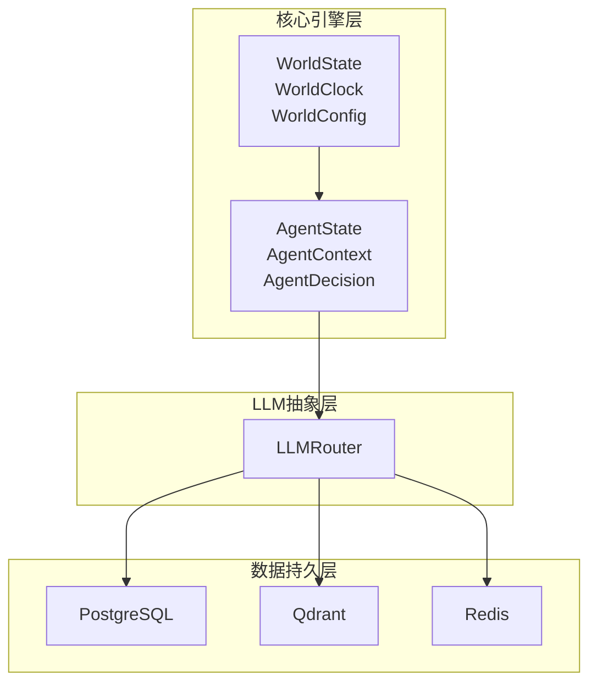
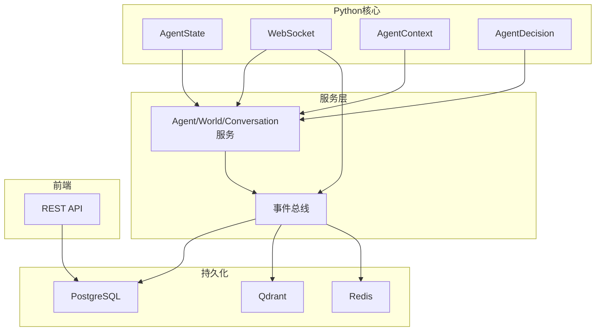
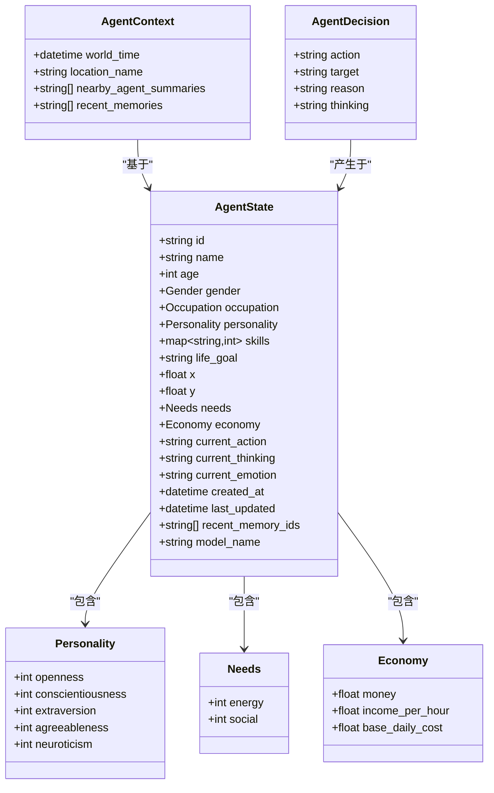
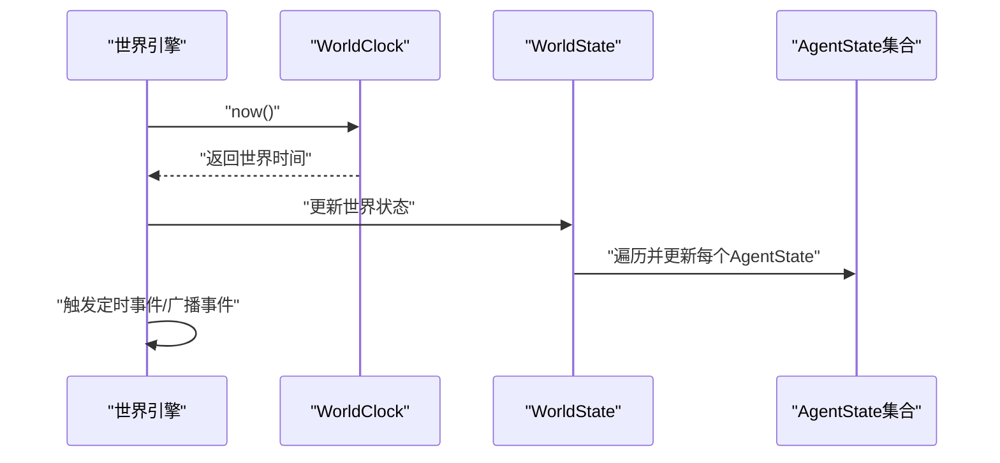
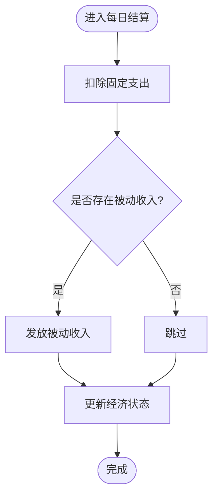
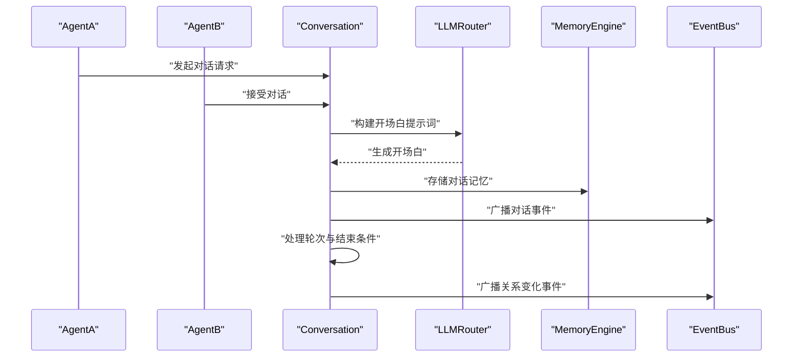
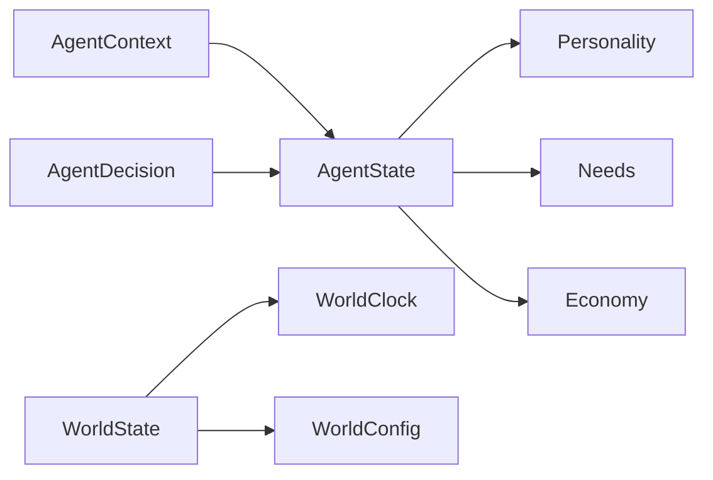

# 数据模型设计

<cite>
**本文引用的文件**
- [backend/app/core/agent.py](file://backend/app/core/agent.py)
- [backend/app/core/world.py](file://backend/app/core/world.py)
- [specs/00-project-overview.spec.md](file://specs/00-project-overview.spec.md)
- [specs/01-architecture.spec.md](file://specs/01-architecture.spec.md)
- [specs/03-economy-system.spec.md](file://specs/03-economy-system.spec.md)
- [specs/04-conversation-system.spec.md](file://specs/04-conversation-system.spec.md)
- [specs/05-world-map.spec.md](file://specs/05-world-map.spec.md)
- [specs/06-api-design.spec.md](file://specs/06-api-design.spec.md)
</cite>

## 目录
1. [简介](#简介)
2. [项目结构](#项目结构)
3. [核心数据结构](#核心数据结构)
4. [架构总览](#架构总览)
5. [详细组件分析](#详细组件分析)
6. [依赖关系分析](#依赖关系分析)
7. [性能考量](#性能考量)
8. [故障排查指南](#故障排查指南)
9. [结论](#结论)
10. [附录](#附录)

## 简介
本文件面向AI Society项目，系统化梳理数据模型设计，重点覆盖AgentState、WorldState、事件与对话等核心数据结构，明确字段定义、数据类型与业务含义；结合规格文档给出实体关系、约束与索引建议；阐述数据验证与业务规则；并给出数据库Schema设计、数据访问模式、缓存策略、数据生命周期与迁移路径、版本控制策略、数据安全与隐私保护、访问控制以及数据导出与研究用途格式说明。

## 项目结构
- 后端采用分层架构：核心引擎层（Agent/World/Event）、LLM抽象层、数据持久层（PostgreSQL/Qdrant/Redis），并通过FastAPI提供REST与WebSocket接口。
- 数据模型在Python层以dataclass/Enum形式定义，同时在规格文档中给出数据库模型与API响应结构，便于映射到ORM模型与前端展示。

**图表来源**
- [specs/01-architecture.spec.md](file://specs/01-architecture.spec.md#L51-L56)
- [specs/03-economy-system.spec.md](file://specs/03-economy-system.spec.md#L314-L342)
- [specs/04-conversation-system.spec.md](file://specs/04-conversation-system.spec.md#L509-L536)

**章节来源**
- [specs/01-architecture.spec.md](file://specs/01-architecture.spec.md#L92-L169)

## 核心数据结构
本节聚焦AgentState、WorldState、事件与对话相关数据结构，逐项说明字段、类型与业务含义，并给出数据验证与业务规则建议。

### AgentState（智能体状态）
- 字段与类型
  - 标识与基本信息：id（字符串）、name（字符串）、age（整数）、gender（枚举Gender）、occupation（枚举Occupation）、personality（Personality对象）、skills（字典[str,int]）、life_goal（字符串）
  - 空间与状态：x（浮点）、y（浮点）、needs（Needs对象）、economy（Economy对象）、current_action（字符串）、current_thinking（字符串）、current_emotion（字符串）
  - 时间戳：created_at（UTC时间）、last_updated（UTC时间）
  - 记忆索引：recent_memory_ids（字符串列表）
  - 模型选择：model_name（字符串）
- 业务含义
  - 描述智能体的身份、人格、技能、目标与实时状态，支撑行为决策、社交互动与经济活动。
- 数据验证与规则
  - age需为正整数；x/y为合理地图坐标范围；needs与economy数值应非负；model_name需在允许列表中；created_at/last_updated保持UTC与时序一致性。
- 字段来源
  - [backend/app/core/agent.py](file://backend/app/core/agent.py#L48-L76)

**章节来源**
- [backend/app/core/agent.py](file://backend/app/core/agent.py#L25-L76)

### AgentContext（智能体上下文）
- 字段与类型
  - world_time（时间）、location_name（字符串）、nearby_agent_summaries（字符串列表）、recent_memories（字符串列表）
- 业务含义
  - 为LLM决策提供环境信息、邻近智能体概要与近期记忆片段，辅助生成自然对话与行为。
- 字段来源
  - [backend/app/core/agent.py](file://backend/app/core/agent.py#L87-L92)

**章节来源**
- [backend/app/core/agent.py](file://backend/app/core/agent.py#L87-L92)

### AgentDecision（智能体决策）
- 字段与类型
  - action（字符串）、target（可选字符串）、reason（字符串）、thinking（字符串）
- 业务含义
  - 记录智能体决策的动作、目标、原因与思考过程，便于审计与回放。
- 字段来源
  - [backend/app/core/agent.py](file://backend/app/core/agent.py#L79-L84)

**章节来源**
- [backend/app/core/agent.py](file://backend/app/core/agent.py#L79-L84)

### Personality（个性五因素）
- 字段与类型
  - openness（整数）、conscientiousness（整数）、extraversion（整数）、agreeableness（整数）、neuroticism（整数）
- 业务含义
  - 五大人格维度，用于影响行为倾向、对话风格与社交效果。
- 字段来源
  - [backend/app/core/agent.py](file://backend/app/core/agent.py#L26-L31)

**章节来源**
- [backend/app/core/agent.py](file://backend/app/core/agent.py#L26-L31)

### Needs/Economy（需求与经济）
- 字段与类型
  - Needs：energy（整数，默认100）、social（整数，默认50）
  - Economy：money（浮点，默认0.0）、income_per_hour（浮点，默认0.0）、base_daily_cost（浮点，默认0）
- 业务含义
  - 需求驱动日常行为（如觅食、社交、休息）；经济决定生存与消费能力，支撑现实对齐的收支与状态分级。
- 字段来源
  - [backend/app/core/agent.py](file://backend/app/core/agent.py#L35-L45)

**章节来源**
- [backend/app/core/agent.py](file://backend/app/core/agent.py#L35-L45)

### WorldState（世界状态）
- 字段与类型
  - clock（WorldClock对象）、config（WorldConfig对象）、agents（字典[str, AgentState]）
- 业务含义
  - 世界时钟与配置，以及智能体集合（当前采用内存字典，后续可替换为数据库/缓存）。
- 字段来源
  - [backend/app/core/world.py](file://backend/app/core/world.py#L30-L36)

**章节来源**
- [backend/app/core/world.py](file://backend/app/core/world.py#L30-L36)

### WorldClock/WorldConfig（世界时间与配置）
- 字段与类型
  - WorldClock：start_real_time（时间）、start_world_time（时间）、time_scale（整数，默认10）、now()方法
  - WorldConfig：width（整数）、height（整数）
- 业务含义
  - 将现实时间映射到游戏内时间，提供世界尺寸配置。
- 字段来源
  - [backend/app/core/world.py](file://backend/app/core/world.py#L9-L27)

**章节来源**
- [backend/app/core/world.py](file://backend/app/core/world.py#L9-L27)

### 对话与事件相关数据（来自规格文档）
- Conversation（对话）
  - 字段：id、conversation_type、participants、location、topic、started_at、ended_at、world_time_start、world_time_end、message_count、sentiment_summary
- Message（消息）
  - 字段：id、conversation_id、speaker_id、content、emotion、mentioned_ids、timestamp、world_time、sequence
- 事件类型（WorldEventType）
  - SUNRISE、SUNSET、NEW_DAY、WEATHER_CHANGE、AGENT_CREATED、AGENT_DEPARTED、DAILY_SETTLEMENT、RANDOM_EVENT
- 字段来源
  - [specs/04-conversation-system.spec.md](file://specs/04-conversation-system.spec.md#L509-L536)
  - [specs/05-world-map.spec.md](file://specs/05-world-map.spec.md#L426-L444)

**章节来源**
- [specs/04-conversation-system.spec.md](file://specs/04-conversation-system.spec.md#L509-L536)
- [specs/05-world-map.spec.md](file://specs/05-world-map.spec.md#L426-L444)

## 架构总览
下图展示数据模型在系统中的角色与交互：Python层dataclass定义核心数据结构，经由服务层与事件总线，写入PostgreSQL、Qdrant与Redis；前端通过REST与WebSocket消费数据。

**图表来源**
- [specs/01-architecture.spec.md](file://specs/01-architecture.spec.md#L51-L56)
- [specs/06-api-design.spec.md](file://specs/06-api-design.spec.md#L411-L595)

## 详细组件分析

### AgentState类图

**图表来源**
- [backend/app/core/agent.py](file://backend/app/core/agent.py#L26-L92)

**章节来源**
- [backend/app/core/agent.py](file://backend/app/core/agent.py#L25-L92)

### WorldState与时间系统序列图

**图表来源**
- [backend/app/core/world.py](file://backend/app/core/world.py#L16-L21)
- [backend/app/core/world.py](file://backend/app/core/world.py#L30-L36)

**章节来源**
- [backend/app/core/world.py](file://backend/app/core/world.py#L9-L36)

### 经济系统流程图（每日结算）

**图表来源**
- [specs/03-economy-system.spec.md](file://specs/03-economy-system.spec.md#L94-L109)

**章节来源**
- [specs/03-economy-system.spec.md](file://specs/03-economy-system.spec.md#L94-L109)

### 对话生成与关系更新序列图

**图表来源**
- [specs/04-conversation-system.spec.md](file://specs/04-conversation-system.spec.md#L200-L240)
- [specs/04-conversation-system.spec.md](file://specs/04-conversation-system.spec.md#L331-L374)

**章节来源**
- [specs/04-conversation-system.spec.md](file://specs/04-conversation-system.spec.md#L200-L240)
- [specs/04-conversation-system.spec.md](file://specs/04-conversation-system.spec.md#L331-L374)

## 依赖关系分析
- AgentState依赖Personality、Needs、Economy；WorldState依赖WorldClock与WorldConfig；AgentContext与AgentDecision用于LLM决策上下文与结果记录。
- 服务层通过事件总线将AgentState、Conversation、Message等写入PostgreSQL、Qdrant与Redis；前端通过REST与WebSocket消费。

**图表来源**
- [backend/app/core/agent.py](file://backend/app/core/agent.py#L26-L92)
- [backend/app/core/world.py](file://backend/app/core/world.py#L30-L36)

**章节来源**
- [backend/app/core/agent.py](file://backend/app/core/agent.py#L25-L92)
- [backend/app/core/world.py](file://backend/app/core/world.py#L30-L36)

## 性能考量
- 内存状态：WorldState.agents当前为内存字典，建议在高并发场景引入Redis缓存热点智能体，配合PostgreSQL持久化。
- 事件流：WebSocket实时推送高频事件，建议按通道与目标过滤，避免全量广播造成带宽压力。
- LLM调用：按规格目标“每智能体每10分钟最多1次”，建议在服务层做限流与排队，结合Redis去重。
- 查询优化：对常用查询（如按职业、状态、时间范围）建立索引，分页与投影减少传输量。

[本节为通用指导，无需列出具体文件来源]

## 故障排查指南
- 常见错误与处理
  - AGENT_NOT_FOUND：检查智能体ID与生命周期；确认数据导出/导入一致性。
  - LOCATION_NOT_FOUND：核对地图配置与位置ID；检查热力与占用状态。
  - CONVERSATION_NOT_FOUND：确认对话ID与时间范围；检查事件广播链路。
  - INVALID_PARAMETER：校验参数类型与范围；统一错误响应格式。
  - WORLD_PAUSED：暂停期间禁止写操作；恢复后重试。
  - RATE_LIMITED：调整客户端重试策略与批量粒度。
- 日志与监控
  - 记录事件类型、时间戳、数据变更前后值，便于回溯与审计。
  - 对高频接口（导出API）设置速率限制，防止资源耗尽。

**章节来源**
- [specs/06-api-design.spec.md](file://specs/06-api-design.spec.md#L619-L655)

## 结论
本数据模型以AgentState为核心，结合WorldState的时间与空间配置，形成可扩展的智能体社会仿真框架。通过对话与经济子系统，实现与现实对齐的行为与交互。建议在现有Python dataclass基础上，映射至PostgreSQL/Redis/Qdrant的ORM模型，完善索引与缓存策略，确保高性能与可维护性。

[本节为总结性内容，无需列出具体文件来源]

## 附录

### 数据库Schema设计（建议）
- 智能体表（agents）
  - 字段：id（主键）、profile（JSON，含基础信息与personality/skills/life_goal）、state（JSON，含位置、needs、economy、当前状态）、created_at、updated_at
  - 索引：id、created_at、updated_at
- 世界事件表（events）
  - 字段：id（主键）、type、payload（JSON）、world_time、created_at
  - 索引：type、world_time、created_at
- 对话表（conversations）
  - 字段：id（主键）、conversation_type、participants（JSON）、location、topic、started_at、ended_at、world_time_start、world_time_end、message_count、sentiment_summary
  - 索引：started_at、location、topic
- 消息表（messages）
  - 字段：id（主键）、conversation_id（外键）、speaker_id、content、emotion、mentioned_ids（JSON）、timestamp、world_time、sequence
  - 索引：conversation_id、speaker_id、timestamp
- 经济交易表（transactions）
  - 字段：id（主键）、agent_id、transaction_type、category、amount、balance_after、description、counterparty_id、timestamp、world_time
  - 索引：agent_id、timestamp、world_time
- 债务关系表（debts）
  - 字段：id（主键）、borrower_id、lender_id、original_amount、remaining_amount、created_at、due_date、status
  - 索引：borrower_id、lender_id、status、due_date

**章节来源**
- [specs/03-economy-system.spec.md](file://specs/03-economy-system.spec.md#L314-L342)
- [specs/04-conversation-system.spec.md](file://specs/04-conversation-system.spec.md#L509-L536)

### 数据访问模式
- 读：按ID/时间范围/状态查询；分页与投影；热点数据Redis缓存。
- 写：事件驱动写入；批量入库；幂等性保障（如按世界时间戳去重）。
- 查询：聚合统计（人口、经济、社交）走PostgreSQL；向量检索（记忆）走Qdrant；会话与队列走Redis。

**章节来源**
- [specs/01-architecture.spec.md](file://specs/01-architecture.spec.md#L51-L56)
- [specs/06-api-design.spec.md](file://specs/06-api-design.spec.md#L411-L595)

### 缓存策略
- 热点智能体：Redis缓存AgentState，命中失败回源PostgreSQL。
- 事件流：WebSocket推送，客户端本地缓冲；断线重连按最后时间戳续传。
- 会话与临时数据：Redis Set/Hash存储，设置TTL。

**章节来源**
- [specs/01-architecture.spec.md](file://specs/01-architecture.spec.md#L51-L56)
- [specs/06-api-design.spec.md](file://specs/06-api-design.spec.md#L411-L595)

### 数据生命周期管理
- 生成：Agent创建、对话与事件产生。
- 存储：短期事件写入Redis/事件总线，定期归档至PostgreSQL；记忆写入Qdrant。
- 归档与清理：按保留策略清理旧事件与低价值数据；导出用于研究。
- 回收：软删除标记，定期物理清理。

**章节来源**
- [specs/01-architecture.spec.md](file://specs/01-architecture.spec.md#L51-L56)

### 迁移路径与版本控制
- 迁移：使用Alembic管理PostgreSQL Schema变更；每次变更记录版本号与回滚脚本。
- 版本：API版本化（/api/v1），向前兼容；数据模型版本在表结构或JSON字段中体现。
- 回滚：灰度发布，失败快速回滚；数据一致性校验。

**章节来源**
- [specs/01-architecture.spec.md](file://specs/01-architecture.spec.md#L134-L136)

### 数据安全、隐私与访问控制
- 安全：HTTPS、WS加密；敏感参数脱敏；最小权限原则。
- 隐私：匿名化处理（如去除真实姓名），仅保留必要标识；合规标注。
- 访问控制：API鉴权（如令牌/会话）；导出接口限频与白名单；事件通道订阅权限控制。

**章节来源**
- [specs/06-api-design.spec.md](file://specs/06-api-design.spec.md#L619-L655)

### 数据导出与研究用途
- 对话导出：CSV/JSON，字段包括时间、对话ID、说话人、对象、内容、地点、情绪。
- 智能体导出：JSON，包含profile与state；可扩展为GraphML用于社交网络分析。
- 统计导出：社会统计、热门地点、经济面板等聚合数据。

**章节来源**
- [specs/06-api-design.spec.md](file://specs/06-api-design.spec.md#L382-L410)