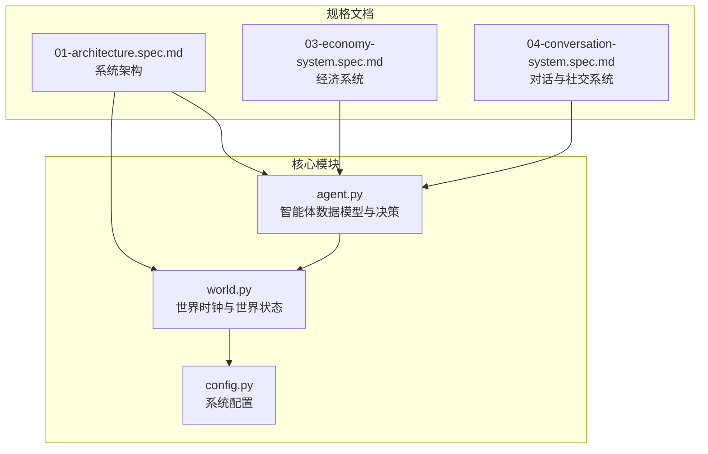
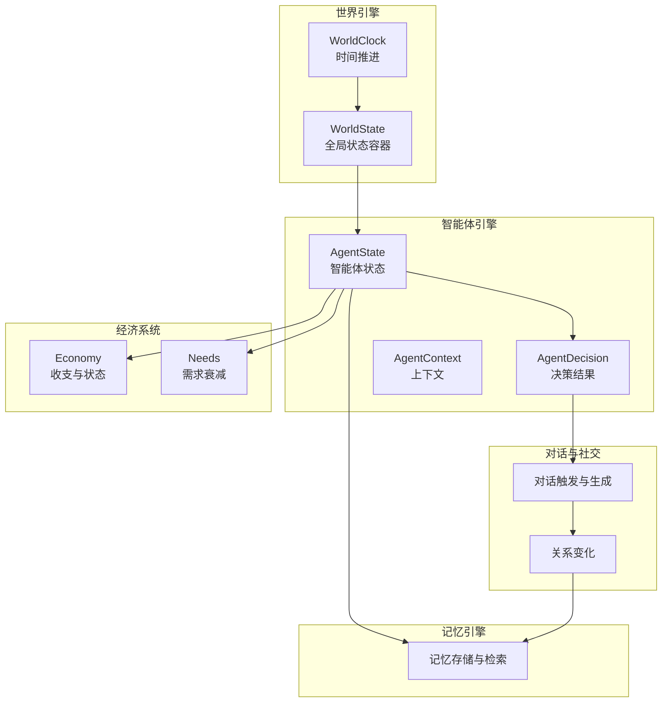
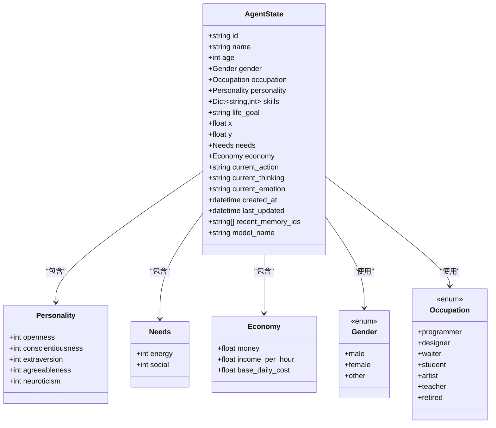
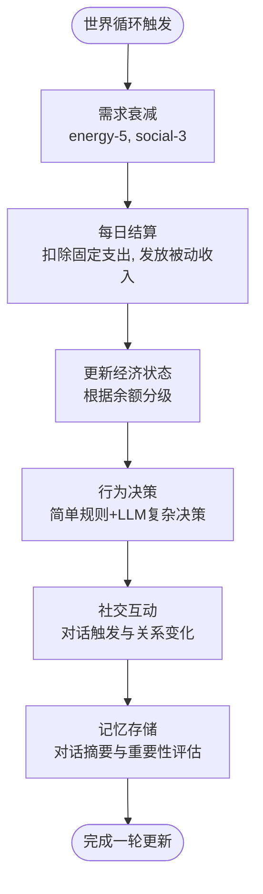
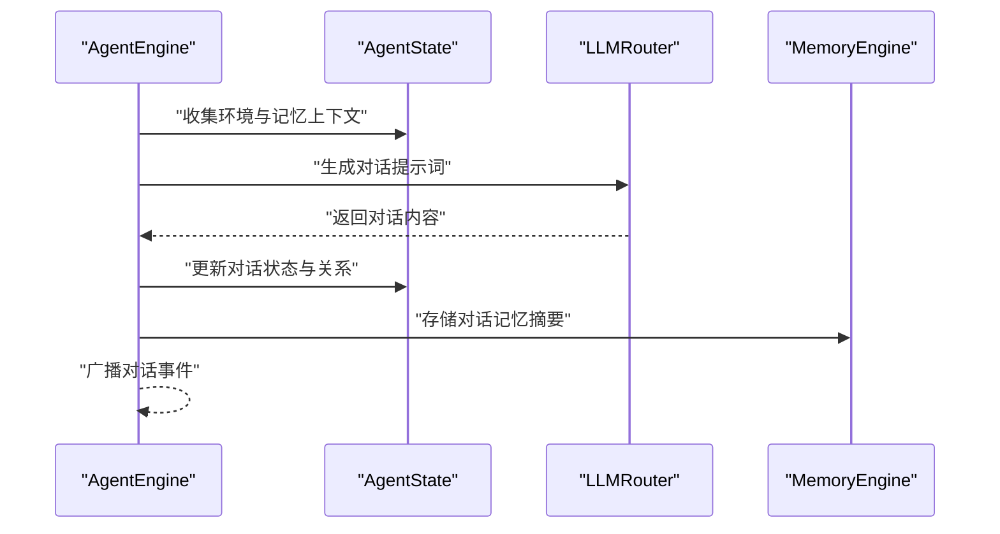
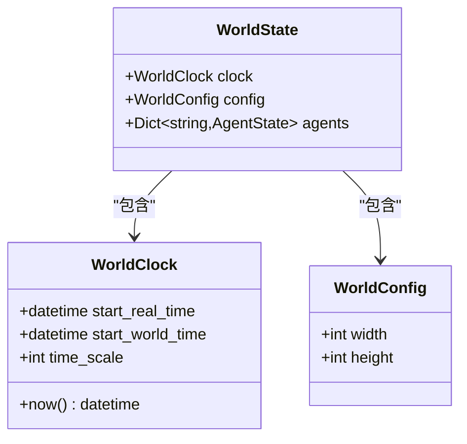
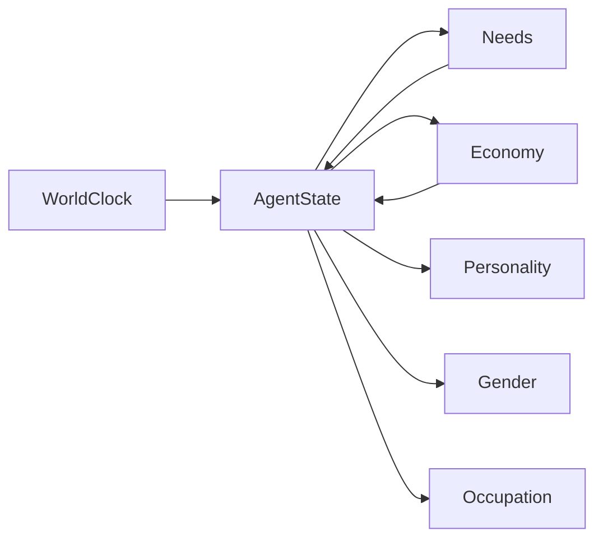

# 智能体数据模型

<cite>
**本文档引用的文件**
- [backend/app/core/agent.py](file://backend/app/core/agent.py)
- [backend/app/core/world.py](file://backend/app/core/world.py)
- [backend/app/core/config.py](file://backend/app/core/config.py)
- [specs/01-architecture.spec.md](file://specs/01-architecture.spec.md)
- [specs/03-economy-system.spec.md](file://specs/03-economy-system.spec.md)
- [specs/04-conversation-system.spec.md](file://specs/04-conversation-system.spec.md)
</cite>

## 目录
1. [简介](#简介)
2. [项目结构](#项目结构)
3. [核心组件](#核心组件)
4. [架构概览](#架构概览)
5. [详细组件分析](#详细组件分析)
6. [依赖分析](#依赖分析)
7. [性能考虑](#性能考虑)
8. [故障排查指南](#故障排查指南)
9. [结论](#结论)
10. [附录](#附录)

## 简介
本文件系统化梳理智能体数据模型，重点围绕 AgentState 数据结构的字段定义、取值范围、默认值与业务含义展开，并结合需求系统、经济系统、对话与社交系统、世界时钟与持久化策略，形成完整的生命周期与状态转换说明。同时提供配置示例、状态快照格式与数据验证规则，帮助开发者快速理解与实现。

## 项目结构
后端采用分层架构，核心模块位于 backend/app/core，包含智能体、世界、配置等基础能力；规格文档位于 specs，涵盖系统架构、经济系统、对话系统等专题设计。

图表来源
- [backend/app/core/agent.py](file://backend/app/core/agent.py#L1-L92)
- [backend/app/core/world.py](file://backend/app/core/world.py#L1-L40)
- [backend/app/core/config.py](file://backend/app/core/config.py#L1-L42)
- [specs/01-architecture.spec.md](file://specs/01-architecture.spec.md#L1-L248)
- [specs/03-economy-system.spec.md](file://specs/03-economy-system.spec.md#L1-L418)
- [specs/04-conversation-system.spec.md](file://specs/04-conversation-system.spec.md#L1-L581)

章节来源
- [specs/01-architecture.spec.md](file://specs/01-architecture.spec.md#L92-L169)

## 核心组件
本节聚焦 AgentState 的字段定义、类型、默认值与业务含义，以及与其关联的子结构（Personality、Needs、Economy）。

- 字段清单与语义
  - 身份信息
    - id: 字符串，唯一标识
    - name: 字符串，显示名称
    - age: 整数，年龄
    - gender: 枚举，取值包含 male、female、other
    - occupation: 枚举，职业类别（如 programmer、designer、waiter、student、artist、teacher、retired）
  - 个性特征
    - personality: Personality 对象，包含开放性、尽责性、外向性、宜人性、神经质五个维度的整数评分
    - skills: 映射，键为技能名字符串，值为整数等级
    - life_goal: 字符串，人生目标
  - 需求系统
    - needs: Needs 对象，默认初始值包含 energy（整数）、social（整数），用于驱动行为动机
  - 经济状态
    - economy: Economy 对象，默认初始值包含 money（浮点）、income_per_hour（浮点）、base_daily_cost（浮点），用于模拟现实经济压力
  - 行为与状态
    - x、y: 浮点坐标，表示世界空间位置
    - current_action: 字符串，默认 idle，表示当前动作
    - current_thinking: 字符串，默认空，表示当前思考内容
    - current_emotion: 字符串，默认 neutral，表示当前情绪
  - 时间戳
    - created_at、last_updated: UTC 时间，用于审计与排序
  - 记忆与模型
    - recent_memory_ids: 字符串列表，默认空，指向近期记忆索引
    - model_name: 字符串，默认 deepseek-chat，表示使用的推理模型别名

- 默认值与约束
  - 默认值来源于字段声明与工厂函数，确保对象创建时具备合理初始状态
  - 业务约束体现在后续系统逻辑中（如需求衰减、经济结算、对话触发等）

章节来源
- [backend/app/core/agent.py](file://backend/app/core/agent.py#L9-L92)

## 架构概览
智能体状态贯穿世界引擎、经济引擎、对话引擎与记忆引擎，形成“状态驱动行为”的闭环。世界时钟控制时间推进，经济系统与需求系统共同决定行为优先级，对话系统触发社交互动并更新关系，记忆系统沉淀经验。

图表来源
- [specs/01-architecture.spec.md](file://specs/01-architecture.spec.md#L171-L220)
- [backend/app/core/world.py](file://backend/app/core/world.py#L8-L40)
- [backend/app/core/agent.py](file://backend/app/core/agent.py#L25-L92)
- [specs/03-economy-system.spec.md](file://specs/03-economy-system.spec.md#L1-L418)
- [specs/04-conversation-system.spec.md](file://specs/04-conversation-system.spec.md#L1-L581)

## 详细组件分析

### AgentState 数据结构详解
- 字段类型与默认值
  - 标量字段：id、name、age、gender、occupation、life_goal、model_name
  - 复合字段：personality（Personality）、skills（映射）、needs（Needs，默认工厂）、economy（Economy，默认工厂）
  - 位置与状态：x、y（浮点）、current_action、current_thinking、current_emotion（字符串）
  - 时间戳：created_at、last_updated（UTC）
  - 记忆索引：recent_memory_ids（字符串列表）
- 业务含义
  - 身份信息：支撑社交识别与经济角色（职业）
  - 个性特征：影响对话倾向、关系建立与消费意愿
  - 需求系统：驱动日常行为（如寻找餐厅、社交、休息）
  - 经济状态：反映生存压力与行为自由度
  - 行为与状态：承载决策与思考过程，便于调试与可视化
  - 记忆索引：连接记忆引擎，形成经验闭环

图表来源
- [backend/app/core/agent.py](file://backend/app/core/agent.py#L9-L92)

章节来源
- [backend/app/core/agent.py](file://backend/app/core/agent.py#L25-L92)

### 需求系统（Needs）与经济系统（Economy）
- 需求系统
  - 能量（energy）与社交（social）随时间衰减，驱动寻找休息、社交互动等行为
  - 需求衰减与触发条件由世界循环控制（每游戏内10分钟执行一次）
- 经济系统
  - 收入：基于职业时薪与技能加成、心情修正
  - 支出：每日固定成本（房租、餐饮、交通、通讯等），可选消费按行为触发
  - 状态分级：富裕、稳定、紧张、拮据、负债，影响消费意愿、工作动力与压力水平
  - 事件：随机经济事件（奖金、医疗、红包、手机损坏）改变资产与行为倾向

图表来源
- [specs/01-architecture.spec.md](file://specs/01-architecture.spec.md#L171-L196)
- [specs/03-economy-system.spec.md](file://specs/03-economy-system.spec.md#L31-L157)

章节来源
- [specs/03-economy-system.spec.md](file://specs/03-economy-system.spec.md#L1-L418)

### 对话与社交系统（触发与关系变化）
- 触发机制
  - 距离接近、主动搭讪、工作场景、约定见面等多种条件组合
  - 概率受关系亲疏、外向性、社交需求与最近对话时间影响
- 对话生成
  - 基于提示词模板构建上下文，调用 LLM 生成开场白与回复
  - 支持群聊轮流发言与 @ 提及
- 关系变化
  - 对话轮次、情感倾向、话题类型与性格兼容性共同决定关系强度变化
  - 关系升级与广播事件推动社交动态

图表来源
- [specs/04-conversation-system.spec.md](file://specs/04-conversation-system.spec.md#L190-L240)

章节来源
- [specs/04-conversation-system.spec.md](file://specs/04-conversation-system.spec.md#L1-L581)

### 世界时钟与世界状态
- 世界时钟
  - 现实1分钟 ≈ 游戏内10分钟，提供统一的时间基准
- 世界状态
  - 包含世界时钟与智能体集合，支持并行更新与事件广播

图表来源
- [backend/app/core/world.py](file://backend/app/core/world.py#L8-L40)

章节来源
- [backend/app/core/world.py](file://backend/app/core/world.py#L1-L40)

## 依赖分析
- AgentState 依赖
  - Personality、Needs、Economy 作为复合字段，提供细粒度的状态管理
  - Gender、Occupation 作为枚举，约束取值范围
  - 与世界时钟、经济系统、对话系统、记忆引擎协作
- 时序依赖
  - 世界循环驱动需求衰减与经济结算
  - 经济状态与需求共同影响行为决策
  - 对话与关系变化反馈至记忆系统

图表来源
- [backend/app/core/agent.py](file://backend/app/core/agent.py#L9-L92)
- [backend/app/core/world.py](file://backend/app/core/world.py#L8-L40)

章节来源
- [backend/app/core/agent.py](file://backend/app/core/agent.py#L1-L92)
- [backend/app/core/world.py](file://backend/app/core/world.py#L1-L40)

## 性能考虑
- 并行更新：世界循环中对所有智能体并行处理，减少全局等待
- 时间缩放：现实1分钟推进游戏内10分钟，降低前端刷新频率与LLM调用频次
- 内存占用：建议限制 recent_memory_ids 长度与对话历史长度，避免内存膨胀
- LLM调用频率：每智能体每10分钟最多1次，避免过度调用

章节来源
- [specs/01-architecture.spec.md](file://specs/01-architecture.spec.md#L238-L248)

## 故障排查指南
- 状态异常
  - 检查 created_at/last_updated 是否正确更新，确认时区与时间同步
  - 核对需求衰减与经济结算逻辑，确保每日固定成本与被动收入一致
- 对话不触发
  - 校验触发条件参数（距离、停留时间、关系修正、外向性修正、社交需求修正）
  - 确认智能体 current_action 非“talking”，且最近对话时间未在1小时内
- 经济状态异常
  - 检查职业时薪、技能加成与心情修正是否生效
  - 核对经济阈值与状态分级边界，确保余额计算与状态切换一致
- 记忆缺失
  - 确认对话结束后是否调用记忆存储流程，检查重要性计算与摘要生成

章节来源
- [specs/04-conversation-system.spec.md](file://specs/04-conversation-system.spec.md#L52-L96)
- [specs/03-economy-system.spec.md](file://specs/03-economy-system.spec.md#L90-L157)

## 结论
AgentState 作为智能体的核心数据载体，通过需求系统与经济系统驱动行为，借助对话与社交系统形成社会网络，再由记忆系统沉淀经验。配合世界时钟与并行更新机制，实现可扩展、可观测、可维护的智能体仿真。建议在实际实现中严格遵循字段约束、默认值与业务规则，确保状态一致性与系统稳定性。

## 附录

### 智能体配置示例
- 环境变量与模型配置
  - 支持多模型别名注册，如 deepseek-chat、deepseek-reasoner、openai-gpt4o
  - 通过环境变量设置 API Key 与基础 URL
- 经济配置示例
  - 职业时薪、日均固定成本、可选消费价格与经济阈值
  - 参考配置文件路径与键名，确保与实现一致

章节来源
- [backend/app/core/config.py](file://backend/app/core/config.py#L24-L38)
- [specs/03-economy-system.spec.md](file://specs/03-economy-system.spec.md#L377-L417)

### 状态快照格式
- 个人经济面板
  - 字段：agent_id、current_balance、economic_status、income_today、expense_today、income_this_month、expense_this_month、net_worth_trend
- 社会经济面板
  - 字段：total_gdp、average_income、gini_coefficient、unemployment_rate、wealth_distribution

章节来源
- [specs/03-economy-system.spec.md](file://specs/03-economy-system.spec.md#L344-L375)

### 数据验证规则
- 类型校验
  - id/name/life_goal 为字符串；age 为正整数；gender/occupation 为枚举值
  - skills 为映射，值为非负整数；money/income_per_hour/base_daily_cost 为非负浮点
  - x/y/current_action/current_thinking/current_emotion 为字符串；model_name 为已注册模型别名
- 业务校验
  - 需求值应在合理区间（如 energy、social ≥ 0）
  - 经济状态应与余额与阈值一致
  - 对话触发概率需满足关系、外向性与社交需求修正后的最终概率

章节来源
- [backend/app/core/agent.py](file://backend/app/core/agent.py#L9-L92)
- [specs/03-economy-system.spec.md](file://specs/03-economy-system.spec.md#L111-L157)
- [specs/04-conversation-system.spec.md](file://specs/04-conversation-system.spec.md#L16-L96)