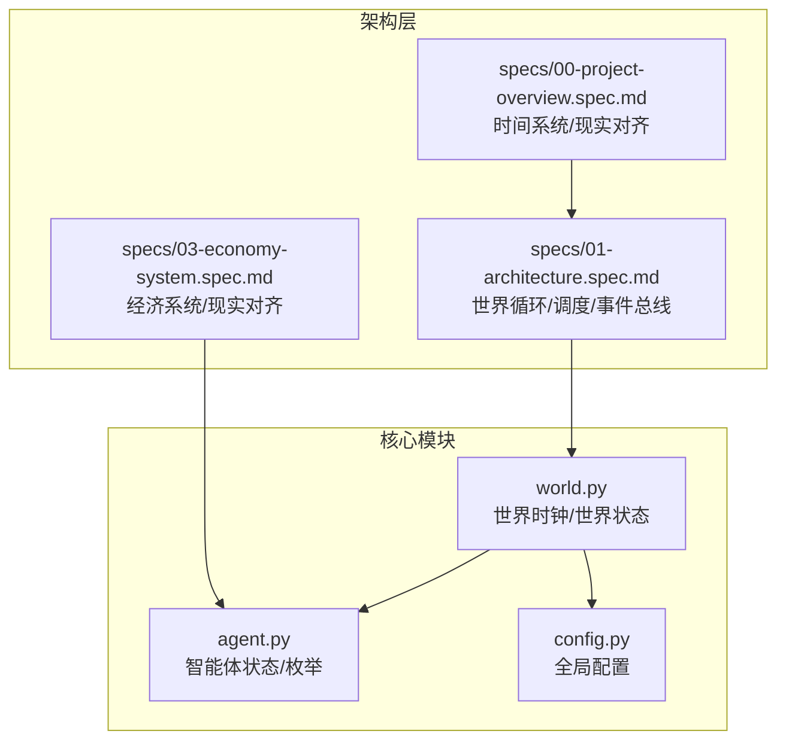
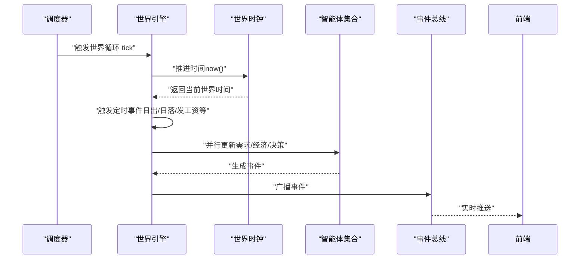
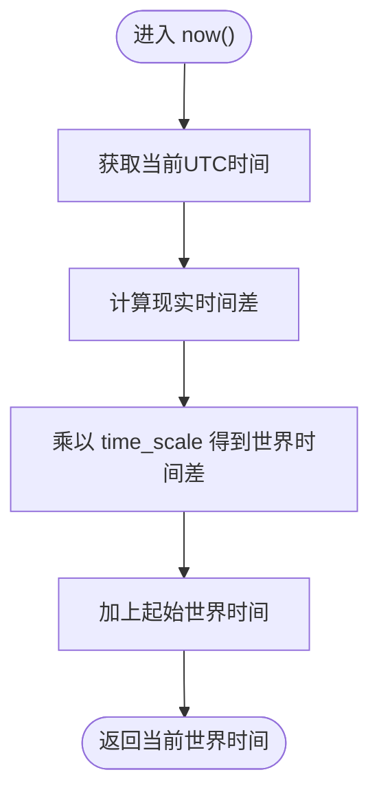
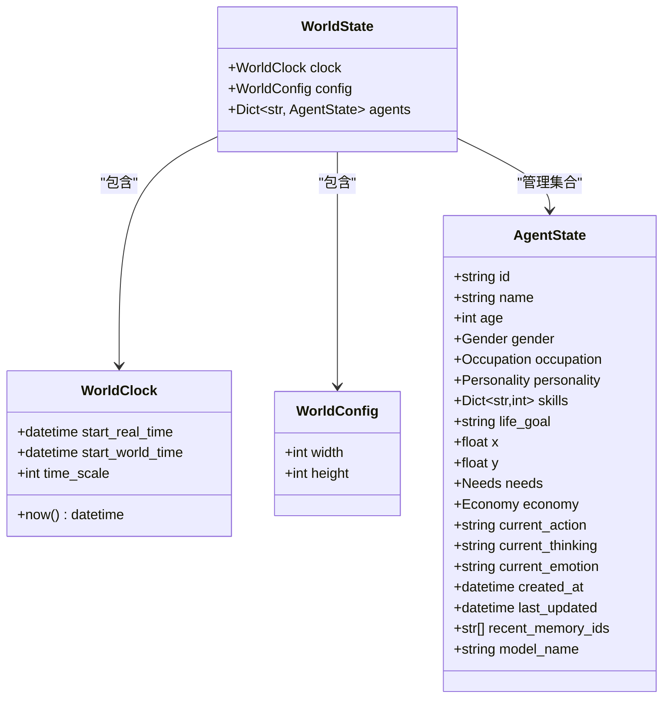
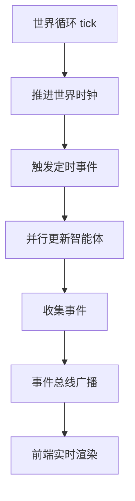
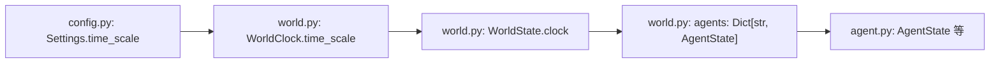

# 世界引擎

<cite>
**本文档引用的文件**
- [backend/app/core/world.py](file://backend/app/core/world.py)
- [backend/app/core/agent.py](file://backend/app/core/agent.py)
- [backend/app/core/config.py](file://backend/app/core/config.py)
- [specs/01-architecture.spec.md](file://specs/01-architecture.spec.md)
- [specs/00-project-overview.spec.md](file://specs/00-project-overview.spec.md)
- [specs/03-economy-system.spec.md](file://specs/03-economy-system.spec.md)
</cite>

## 目录
1. [简介](#简介)
2. [项目结构](#项目结构)
3. [核心组件](#核心组件)
4. [架构概览](#架构概览)
5. [详细组件分析](#详细组件分析)
6. [依赖分析](#依赖分析)
7. [性能考虑](#性能考虑)
8. [故障排查指南](#故障排查指南)
9. [结论](#结论)
10. [附录](#附录)

## 简介
本文件面向“世界引擎”的技术实现，聚焦以下主题：
- 世界时钟管理机制：现实时间与虚拟时间的比例关系（1分钟现实=10分钟虚拟）、时间推进算法与UTC时区处理
- 世界状态管理：WorldState数据结构、WorldConfig配置参数、AgentState集合管理
- 事件调度机制的设计原理：时间触发器、事件队列管理与状态同步策略
- 提供初始化世界时钟、查询当前时间、管理世界状态的代码示例路径
- 性能优化建议与常见问题解决方案

## 项目结构
世界引擎位于后端核心模块 backend/app/core，包含世界时钟、世界状态、智能体状态与配置等关键数据结构。架构规格文档进一步明确了世界循环与调度机制。

**图表来源**
- [backend/app/core/world.py](file://backend/app/core/world.py#L1-L40)
- [backend/app/core/agent.py](file://backend/app/core/agent.py#L1-L92)
- [backend/app/core/config.py](file://backend/app/core/config.py#L1-L42)
- [specs/01-architecture.spec.md](file://specs/01-architecture.spec.md#L170-L196)
- [specs/00-project-overview.spec.md](file://specs/00-project-overview.spec.md#L28-L31)
- [specs/03-economy-system.spec.md](file://specs/03-economy-system.spec.md#L1-L418)

**章节来源**
- [specs/01-architecture.spec.md](file://specs/01-architecture.spec.md#L92-L169)
- [specs/00-project-overview.spec.md](file://specs/00-project-overview.spec.md#L1-L46)

## 核心组件
- 世界时钟 WorldClock：负责将现实时间映射为虚拟时间，支持UTC时区与时钟比例（time_scale）
- 世界状态 WorldState：聚合时钟、配置与智能体集合，作为世界演化的根对象
- 世界配置 WorldConfig：地图尺寸等静态配置
- 智能体状态 AgentState：包含位置、需求、经济、行为与思考等状态字段
- 全局配置 Settings：包含 time_scale 等运行时参数

上述组件在核心模块中以数据类形式组织，便于序列化与并发读写；同时通过延迟导入避免循环引用。

**章节来源**
- [backend/app/core/world.py](file://backend/app/core/world.py#L8-L39)
- [backend/app/core/agent.py](file://backend/app/core/agent.py#L25-L92)
- [backend/app/core/config.py](file://backend/app/core/config.py#L7-L42)

## 架构概览
世界引擎遵循“世界循环”驱动的架构：每10分钟游戏内时间推进对应现实中1分钟，期间触发定时事件、智能体更新、社交互动与事件广播。该循环由调度层（如APScheduler）驱动，世界引擎提供时钟推进与状态管理能力。

**图表来源**
- [specs/01-architecture.spec.md](file://specs/01-architecture.spec.md#L173-L196)

**章节来源**
- [specs/01-architecture.spec.md](file://specs/01-architecture.spec.md#L173-L196)

## 详细组件分析

### 世界时钟 WorldClock
- 功能要点
  - 以UTC为基准，记录起始现实时间与起始世界时间
  - 通过 time_scale 将现实时间差映射为世界时间差
  - 提供 now() 返回当前世界时间
- 时间推进算法
  - 计算现实时间差：delta_real = now(UTC) - start_real_time
  - 计算世界时间差：delta_world = delta_real × time_scale
  - 返回世界时间：start_world_time + delta_world
- 时区处理
  - 使用 timezone.utc，确保跨时区一致性
  - 世界时间始终以UTC表示，便于分布式部署与事件同步

**图表来源**
- [backend/app/core/world.py](file://backend/app/core/world.py#L16-L20)

**章节来源**
- [backend/app/core/world.py](file://backend/app/core/world.py#L8-L21)
- [backend/app/core/config.py](file://backend/app/core/config.py#L12-L13)

### 世界状态 WorldState 与 WorldConfig
- WorldState
  - 聚合 WorldClock、WorldConfig，并维护智能体字典 agents
  - 初始采用内存结构，便于快速迭代；后续可替换为数据库/缓存
- WorldConfig
  - 地图宽度与高度等静态参数
- AgentState 集合管理
  - 以字符串ID为键，存储每个智能体的状态
  - 世界循环中对 agents 进行并行更新与事件收集

**图表来源**
- [backend/app/core/world.py](file://backend/app/core/world.py#L23-L39)
- [backend/app/core/agent.py](file://backend/app/core/agent.py#L25-L92)

**章节来源**
- [backend/app/core/world.py](file://backend/app/core/world.py#L23-L39)
- [backend/app/core/agent.py](file://backend/app/core/agent.py#L48-L92)

### 事件调度机制设计原理
- 时间触发器
  - 世界循环以固定周期推进（每10分钟游戏内时间=1分钟现实），在此刻触发定时事件（如昼夜、薪资发放）
- 事件队列管理
  - 世界引擎收集智能体产生的事件，交由事件总线统一广播
  - 事件总线通过WebSocket推送到前端，实现实时更新
- 状态同步策略
  - 世界状态在每次tick后进行快照或增量更新，保证前端与后端状态一致
  - 世界时间作为事件的时间戳，确保事件顺序与因果关系

**图表来源**
- [specs/01-architecture.spec.md](file://specs/01-architecture.spec.md#L173-L196)

**章节来源**
- [specs/01-architecture.spec.md](file://specs/01-architecture.spec.md#L173-L196)

### 代码示例路径（不含具体代码内容）
- 初始化世界时钟
  - 参考路径：[backend/app/core/world.py](file://backend/app/core/world.py#L8-L21)
  - 关键点：设置起始现实时间与起始世界时间，确认 time_scale
- 查询当前世界时间
  - 参考路径：[backend/app/core/world.py](file://backend/app/core/world.py#L16-L20)
  - 关键点：now() 返回当前世界时间（UTC）
- 管理世界状态
  - 参考路径：[backend/app/core/world.py](file://backend/app/core/world.py#L23-L39)
  - 关键点：WorldState 聚合时钟与配置；agents 字典管理智能体集合
- 读取全局时间缩放参数
  - 参考路径：[backend/app/core/config.py](file://backend/app/core/config.py#L12-L13)
  - 关键点：time_scale 与世界循环节拍保持一致

**章节来源**
- [backend/app/core/world.py](file://backend/app/core/world.py#L8-L39)
- [backend/app/core/config.py](file://backend/app/core/config.py#L12-L13)

## 依赖分析
- 模块内依赖
  - world.py 依赖 datetime、timedelta、timezone 进行时间计算
  - world.py 通过延迟导入 AgentState，避免循环引用
  - agent.py 定义智能体状态与枚举，被 world.py 的 WorldState 引用
  - config.py 提供 time_scale 等全局配置
- 架构依赖
  - 世界循环与调度层（如APScheduler）协同工作
  - 事件总线负责将世界状态变化推送给前端

**图表来源**
- [backend/app/core/world.py](file://backend/app/core/world.py#L1-L39)
- [backend/app/core/agent.py](file://backend/app/core/agent.py#L1-L92)
- [backend/app/core/config.py](file://backend/app/core/config.py#L1-L42)

**章节来源**
- [backend/app/core/world.py](file://backend/app/core/world.py#L1-L39)
- [backend/app/core/agent.py](file://backend/app/core/agent.py#L1-L92)
- [backend/app/core/config.py](file://backend/app/core/config.py#L1-L42)

## 性能考虑
- 世界循环节拍
  - 世界循环以固定周期推进，建议将 tick 设置为1分钟（游戏内10分钟=现实1分钟），平衡实时性与CPU占用
- 并行更新
  - 智能体更新采用并行处理，减少单点瓶颈；注意共享状态的锁或不可变数据结构
- 事件广播
  - 使用事件总线进行批量事件合并与去重，降低前端渲染压力
- 内存与持久化
  - WorldState 初始使用内存结构，建议在高负载场景引入Redis或数据库缓存，结合LRU淘汰策略
- 时间计算
  - 仅在必要时计算 delta，避免频繁的datetime运算；可缓存最近一次计算结果

[本节为通用性能建议，不直接分析具体文件]

## 故障排查指南
- 世界时间不正确
  - 检查起始现实时间与起始世界时间是否设置一致；确认系统时区为UTC
  - 参考路径：[backend/app/core/world.py](file://backend/app/core/world.py#L12-L20)
- 时间缩放不生效
  - 确认 time_scale 参数与世界循环节拍一致；检查配置加载
  - 参考路径：[backend/app/core/config.py](file://backend/app/core/config.py#L12-L13)
- 智能体状态异常
  - 检查 agents 字典的并发访问；确保事件广播前后的状态一致性
  - 参考路径：[backend/app/core/world.py](file://backend/app/core/world.py#L34-L35)
- 经济系统与现实对齐偏差
  - 核对职业收入、固定支出与结算周期；确保每日结算逻辑与世界循环节拍匹配
  - 参考路径：[specs/03-economy-system.spec.md](file://specs/03-economy-system.spec.md#L89-L109)

**章节来源**
- [backend/app/core/world.py](file://backend/app/core/world.py#L12-L20)
- [backend/app/core/config.py](file://backend/app/core/config.py#L12-L13)
- [specs/03-economy-system.spec.md](file://specs/03-economy-system.spec.md#L89-L109)

## 结论
世界引擎通过简洁的数据类与明确的时钟推进机制，实现了“现实1分钟=游戏内10分钟”的时间系统，并以世界循环为核心驱动智能体更新与事件广播。配合经济系统与现实对齐的设计，世界引擎为自治智能体社会提供了稳定、可扩展的运行基础。未来可在事件队列、状态同步与持久化方面进一步优化，以支撑更大规模的智能体集群。

[本节为总结性内容，不直接分析具体文件]

## 附录
- 术语
  - 世界时间：游戏内的虚拟时间
  - 现实时间：物理世界的UTC时间
  - time_scale：现实时间与世界时间的比例系数
- 相关规范
  - 世界循环与调度机制：[specs/01-architecture.spec.md](file://specs/01-architecture.spec.md#L173-L196)
  - 时间系统与现实对齐：[specs/00-project-overview.spec.md](file://specs/00-project-overview.spec.md#L28-L31)
  - 经济系统与现实对齐：[specs/03-economy-system.spec.md](file://specs/03-economy-system.spec.md#L1-L418)