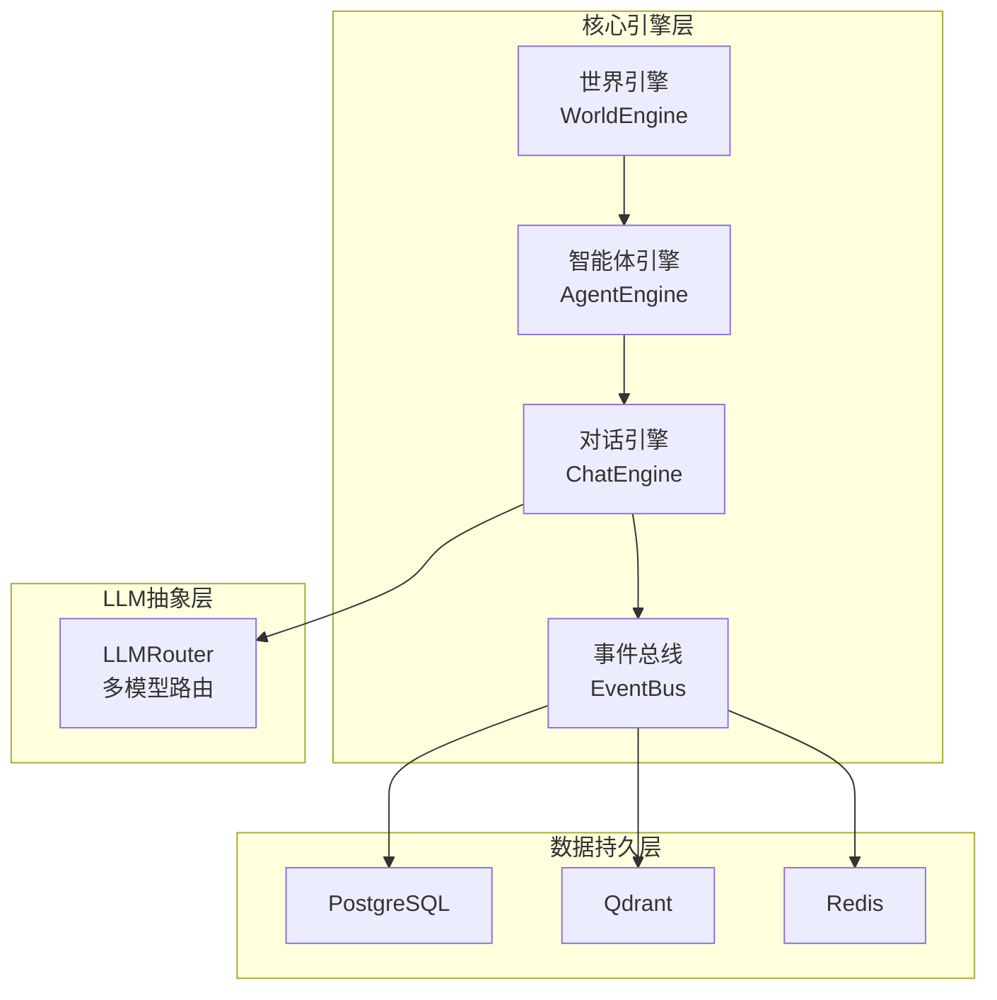
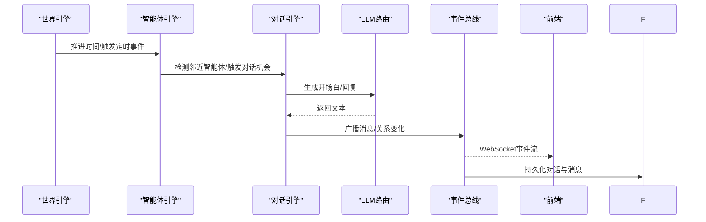
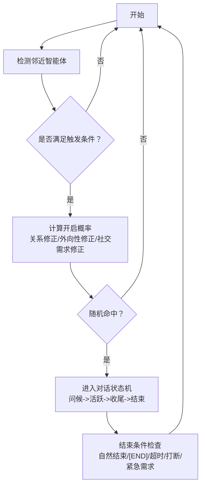
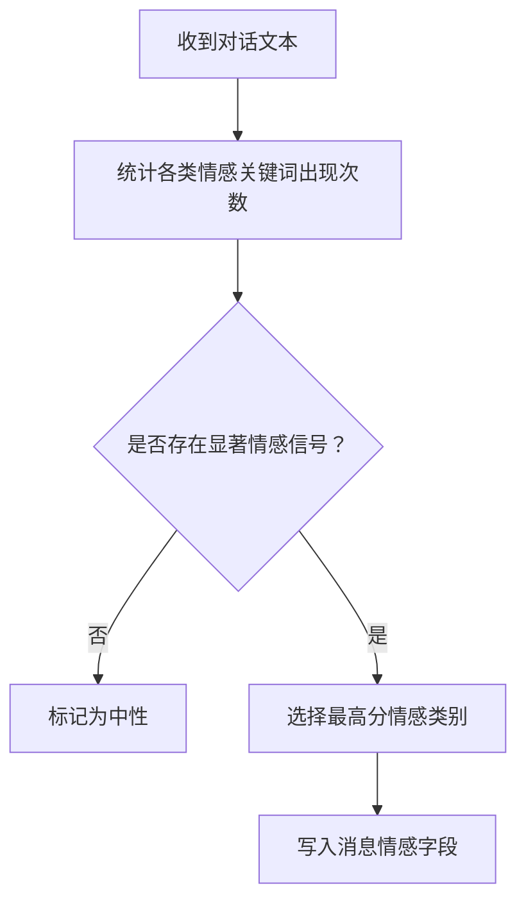
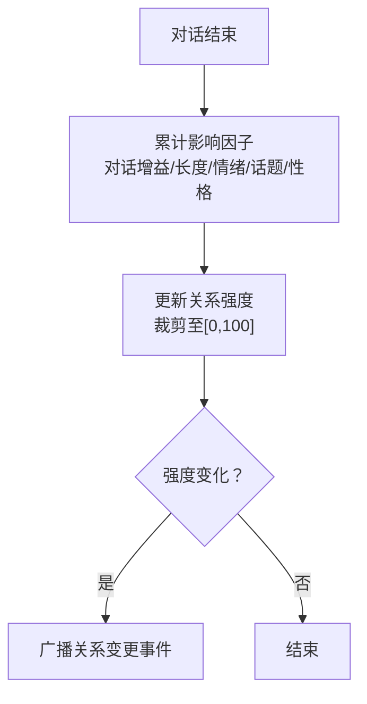
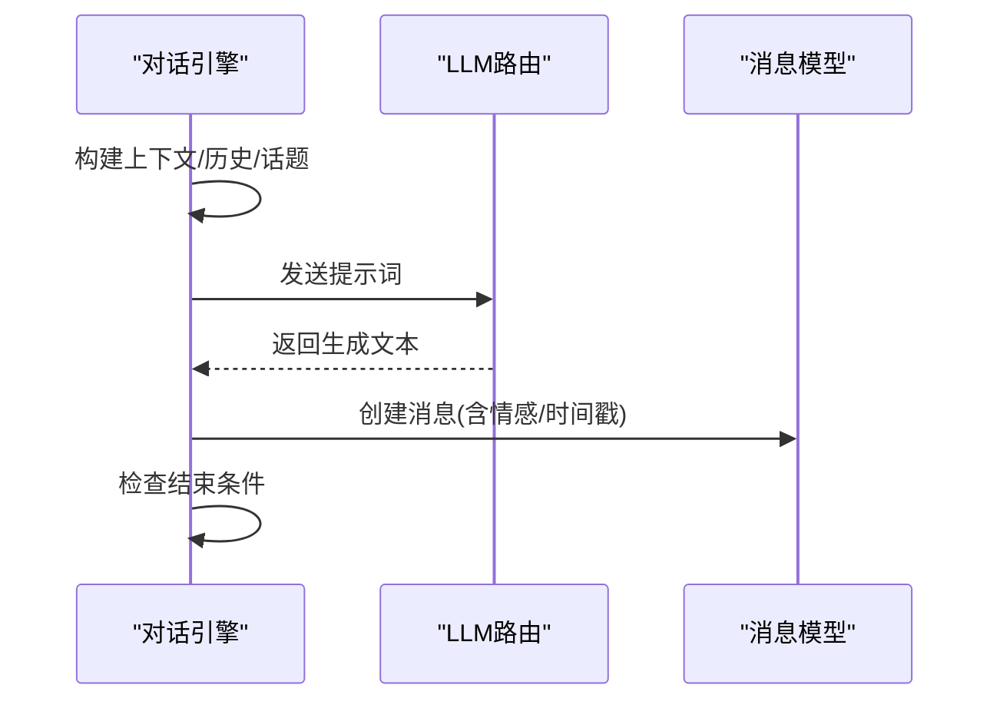
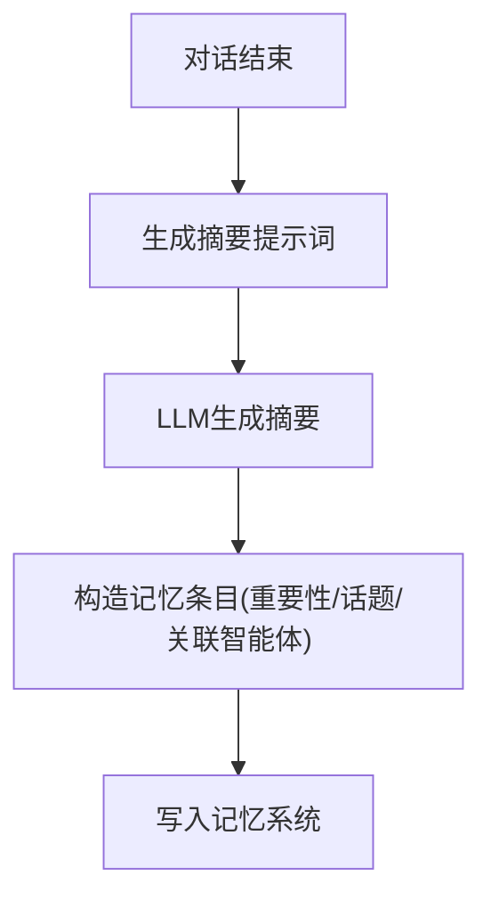
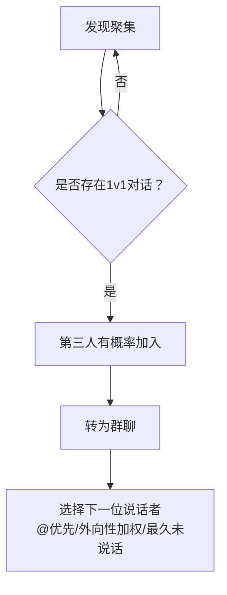
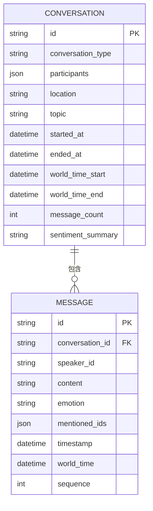
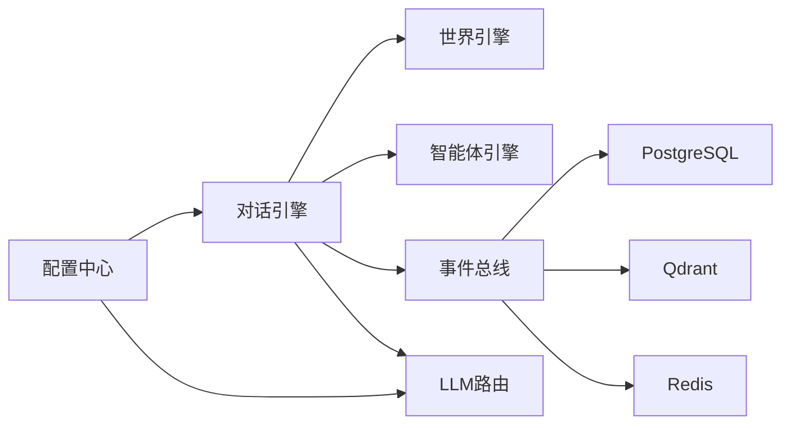

# 对话引擎

<cite>
**本文引用的文件**
- [backend/app/core/agent.py](file://backend/app/core/agent.py)
- [backend/app/core/world.py](file://backend/app/core/world.py)
- [backend/app/core/config.py](file://backend/app/core/config.py)
- [specs/01-architecture.spec.md](file://specs/01-architecture.spec.md)
- [specs/04-conversation-system.spec.md](file://specs/04-conversation-system.spec.md)
- [specs/06-api-design.spec.md](file://specs/06-api-design.spec.md)
- [specs/08-implementation-plan.spec.md](file://specs/08-implementation-plan.spec.md)
</cite>

## 目录
1. [简介](#简介)
2. [项目结构](#项目结构)
3. [核心组件](#核心组件)
4. [架构总览](#架构总览)
5. [详细组件分析](#详细组件分析)
6. [依赖分析](#依赖分析)
7. [性能考虑](#性能考虑)
8. [故障排查指南](#故障排查指南)
9. [结论](#结论)
10. [附录](#附录)

## 简介
本文件为“对话引擎”的综合技术文档，围绕智能体间对话机制、情感表达系统、关系建立算法以及对话内容生成流程展开，结合仓库中的规格说明与核心数据结构，提供从设计原理到实现路径的全景式说明，并给出优化建议与质量评估方法。

## 项目结构
对话引擎位于后端核心模块中，与世界引擎、事件总线、LLM抽象层协同工作。其核心数据结构定义在智能体与世界模块中，对话系统的触发、生成、关系与记忆更新等逻辑在规格说明中详细描述。

图表来源
- [specs/01-architecture.spec.md](file://specs/01-architecture.spec.md#L23-L33)

章节来源
- [specs/01-architecture.spec.md](file://specs/01-architecture.spec.md#L1-L255)

## 核心组件
- 智能体状态与上下文：包含身份、位置、需求、经济、个性、近期记忆与当前情绪等字段，用于支撑对话生成与关系计算。
- 世界时钟与世界状态：提供统一的时间推进与全局智能体索引，确保对话触发与事件广播的时序一致性。
- 对话状态机与消息模型：定义对话生命周期、消息结构与群聊扩展能力。
- 关系与记忆：基于对话结果更新关系强度与类型，并将对话摘要与重要性写入记忆系统。

章节来源
- [backend/app/core/agent.py](file://backend/app/core/agent.py#L25-L92)
- [backend/app/core/world.py](file://backend/app/core/world.py#L8-L40)
- [specs/04-conversation-system.spec.md](file://specs/04-conversation-system.spec.md#L190-L581)

## 架构总览
对话引擎在世界循环中与其他系统协作：世界推进时间、智能体更新需求与行为、检测邻近智能体并触发对话；对话生成通过LLM路由调用具体模型；事件经事件总线推送至前端与持久化存储。

图表来源
- [specs/01-architecture.spec.md](file://specs/01-architecture.spec.md#L180-L227)
- [specs/04-conversation-system.spec.md](file://specs/04-conversation-system.spec.md#L190-L240)

章节来源
- [specs/01-architecture.spec.md](file://specs/01-architecture.spec.md#L178-L227)

## 详细组件分析

### 对话触发机制与交流协议
- 触发条件
  - 近距离遇见：基于像素距离与停留时长，结合关系亲疏修正概率。
  - 主动搭讪：社交需求阈值触发，偏好目标按关系亲疏排序。
  - 工作互动：特定职业组合（如服务员-顾客、教师-学生、销售-客户）自动触发。
  - 约定见面：基于记忆与尽责性影响的可靠性判定。
- 交流协议
  - 会话状态机：初始化、问候、活跃、收尾、结束。
  - 轮次控制：最小/最大轮次、轮间隔、超时/打断/紧急需求等结束条件。
  - 群聊扩展：第三人加入、轮流发言、@提及机制与权重选择。

图表来源
- [specs/04-conversation-system.spec.md](file://specs/04-conversation-system.spec.md#L14-L96)
- [specs/04-conversation-system.spec.md](file://specs/04-conversation-system.spec.md#L168-L188)
- [specs/04-conversation-system.spec.md](file://specs/04-conversation-system.spec.md#L190-L240)

章节来源
- [specs/04-conversation-system.spec.md](file://specs/04-conversation-system.spec.md#L12-L96)
- [specs/04-conversation-system.spec.md](file://specs/04-conversation-system.spec.md#L168-L240)

### 情感表达系统
- 情感状态建模：智能体当前情绪字段用于影响对话生成与关系变化。
- 情感强度计算：基于关键词匹配的粗粒度情感检测，输出积极/消极/中性等类别。
- 情感传递机制：对话消息携带情感标签，作为关系更新与记忆重要性的输入。

图表来源
- [specs/04-conversation-system.spec.md](file://specs/04-conversation-system.spec.md#L244-L268)

章节来源
- [specs/04-conversation-system.spec.md](file://specs/04-conversation-system.spec.md#L244-L268)
- [backend/app/core/agent.py](file://backend/app/core/agent.py#L48-L75)

### 关系建立算法
- 社交网络构建：以智能体为中心，基于邻近检测与交互记录形成关系网络。
- 关系亲密度计算：每次对话的基础增益、对话长度加成、情绪共鸣/争吵惩罚、话题影响因子、性格兼容性修正。
- 社交影响分析：关系强度变化后触发关系类型升级，并广播关系变更事件。

图表来源
- [specs/04-conversation-system.spec.md](file://specs/04-conversation-system.spec.md#L298-L374)

章节来源
- [specs/04-conversation-system.spec.md](file://specs/04-conversation-system.spec.md#L298-L374)

### 对话内容生成流程
- 上下文管理：收集世界时间、地点、附近智能体摘要、近期记忆等。
- 话题选择：基于关键词模式提取话题类别，支持深度话题、八卦、计划等。
- 回复生成策略：根据轮次与历史构建提示词，调用LLM路由生成回复，解析[END]标记决定结束。

图表来源
- [specs/04-conversation-system.spec.md](file://specs/04-conversation-system.spec.md#L98-L188)
- [specs/04-conversation-system.spec.md](file://specs/04-conversation-system.spec.md#L190-L240)

章节来源
- [specs/04-conversation-system.spec.md](file://specs/04-conversation-system.spec.md#L98-L188)
- [specs/04-conversation-system.spec.md](file://specs/04-conversation-system.spec.md#L190-L240)

### 记忆存储与重要性评估
- 对话记忆：将对话摘要写入记忆系统，关联相关智能体与话题。
- 重要性评估：综合对话长度、情感强度、关系变化幅度与话题类别，计算重要性分数。

图表来源
- [specs/04-conversation-system.spec.md](file://specs/04-conversation-system.spec.md#L376-L439)

章节来源
- [specs/04-conversation-system.spec.md](file://specs/04-conversation-system.spec.md#L376-L439)

### 群体对话（3人以上）
- 触发：检测聚集、识别1v1对话、第三人加入的概率转换。
- 轮流发言：优先@提及者，其次按外向性加权随机选择下一个说话人。

图表来源
- [specs/04-conversation-system.spec.md](file://specs/04-conversation-system.spec.md#L441-L504)

章节来源
- [specs/04-conversation-system.spec.md](file://specs/04-conversation-system.spec.md#L441-L504)

### 数据模型与前端展示
- 数据库模型：对话与消息表包含关键字段（类型、参与者、话题、时间戳、序列、情感、提及等）。
- 前端展示：对话气泡与实时事件流，WebSocket推送事件，支持点击查看详情。

图表来源
- [specs/04-conversation-system.spec.md](file://specs/04-conversation-system.spec.md#L506-L536)

章节来源
- [specs/04-conversation-system.spec.md](file://specs/04-conversation-system.spec.md#L538-L581)

## 依赖分析
- 组件耦合与协作
  - 世界引擎提供时钟与全局智能体索引，对话引擎依赖其时间推进与空间邻近检测。
  - 智能体引擎负责需求衰减与行为决策，为对话提供动机与上下文。
  - 事件总线承载实时事件流，连接前端与持久化存储。
  - LLM抽象层屏蔽多模型差异，对话引擎仅关注提示词与响应解析。
- 外部依赖
  - PostgreSQL/Qdrant/Redis分别承担结构化数据、向量记忆与缓存/消息队列职责。
  - 环境变量与配置中心提供模型密钥、URL与时间缩放等参数。

图表来源
- [specs/01-architecture.spec.md](file://specs/01-architecture.spec.md#L23-L57)
- [backend/app/core/config.py](file://backend/app/core/config.py#L7-L42)

章节来源
- [specs/01-architecture.spec.md](file://specs/01-architecture.spec.md#L1-L255)
- [backend/app/core/config.py](file://backend/app/core/config.py#L1-L42)

## 性能考虑
- 世界循环节拍：每游戏内10分钟推进一次，限制LLM调用频率，避免过度消耗。
- 对话并发：对话轮次采用固定间隔与轮次上限，防止长时间阻塞。
- 记忆与事件：批量写入与事件去重，降低数据库与前端压力。
- 模型路由：按智能体配置选择模型，避免不必要的跨模型切换。

## 故障排查指南
- 对话未触发
  - 检查邻近检测阈值与停留时长设置，确认智能体位置与时间同步。
  - 核对关系修正系数与社交需求阈值，确保概率计算合理。
- 情绪检测异常
  - 检查关键词表覆盖范围与文本编码，必要时扩展情感词典。
- 关系变化不符合预期
  - 核对影响因子权重与话题映射，确认对话长度与情绪统计逻辑。
- 记忆重要性偏低
  - 提升话题类别权重或对话长度阈值，增强情感与关系变化的权重。
- 前端事件流延迟
  - 检查WebSocket连接与事件总线发布频率，优化消息聚合策略。

## 结论
对话引擎通过明确的触发机制、情感检测与关系更新策略，实现了自然且富有社交意义的智能体交互。配合LLM抽象层与事件总线，系统具备良好的扩展性与可观测性。建议在实际落地中持续优化提示词模板、情感词典与关系权重，并引入更精细的记忆检索与话题追踪机制，以提升对话质量与社会现象的涌现效果。

## 附录

### API与事件参考
- 获取对话详情与历史接口参见规格说明中的REST API定义。
- WebSocket事件类型包括对话开始、消息、结束与关系变化等。

章节来源
- [specs/06-api-design.spec.md](file://specs/06-api-design.spec.md#L265-L548)

### 实现要点与最佳实践
- 对话发起：在世界循环中定期检测邻近智能体，按概率与条件触发对话。
- 情感表达：在提示词中注入当前情绪，生成后解析情感标签并写入消息。
- 关系维护：对话结束后统一更新关系强度与类型，广播事件供前端与统计模块使用。
- 质量评估：基于话题分布、情感强度、关系变化幅度与对话长度进行综合评分。

章节来源
- [specs/08-implementation-plan.spec.md](file://specs/08-implementation-plan.spec.md#L227-L269)