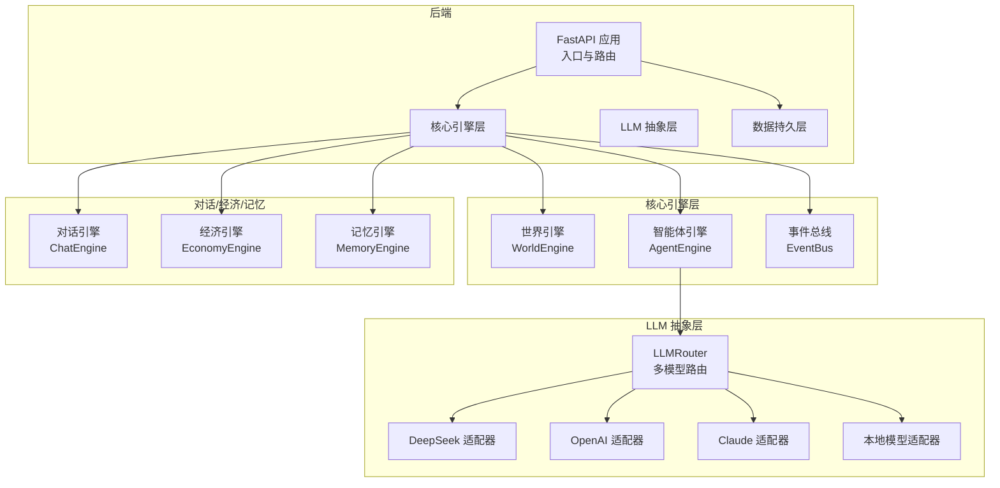
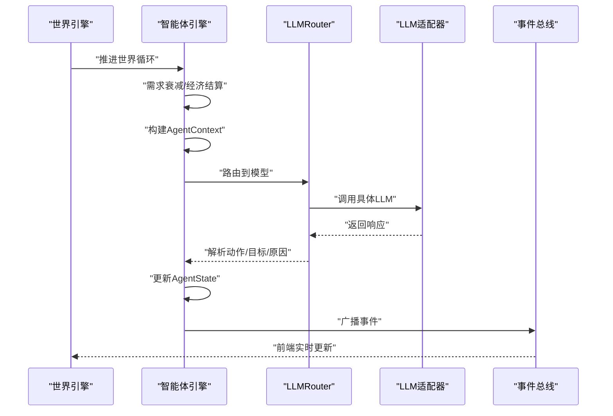
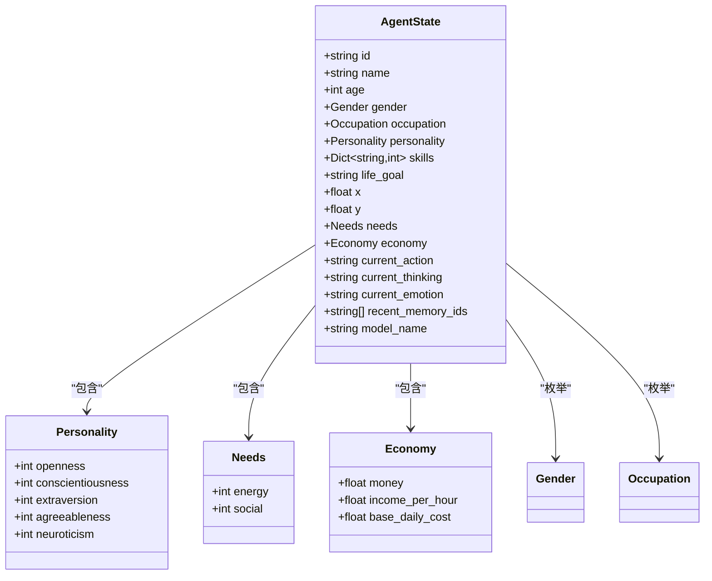
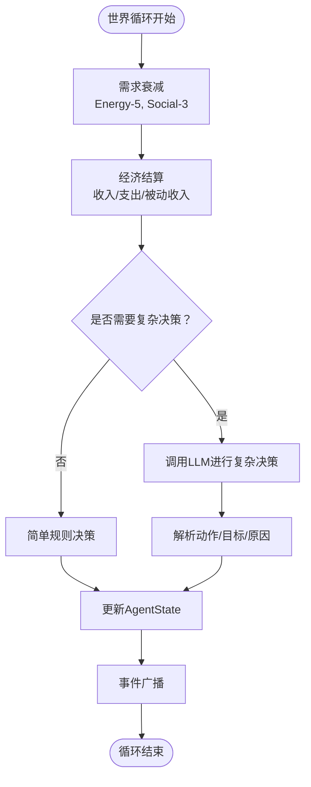
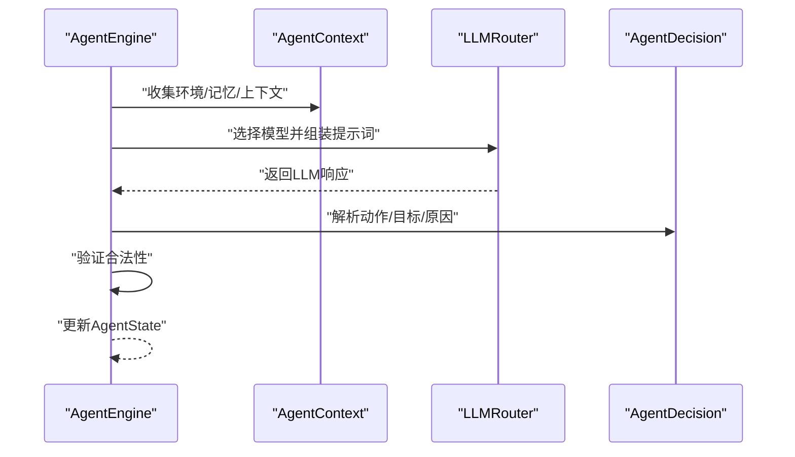
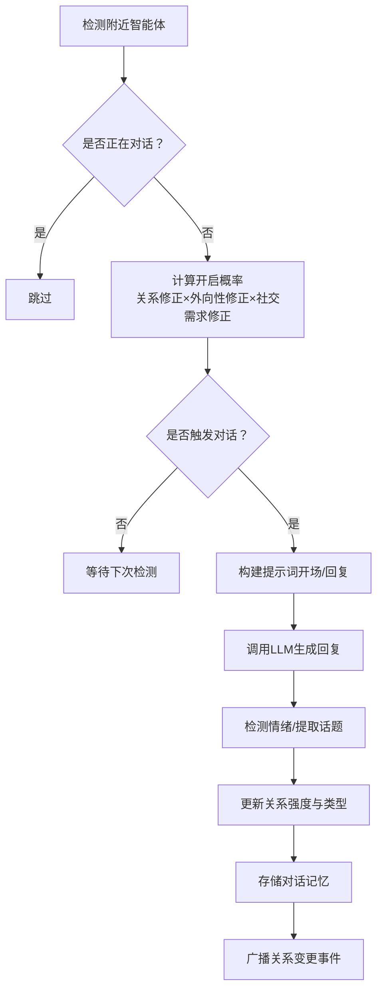
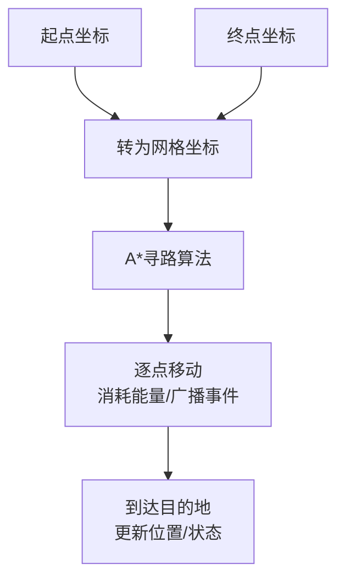
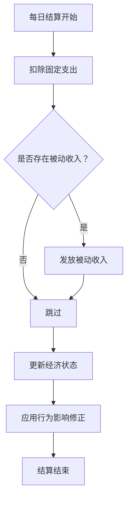
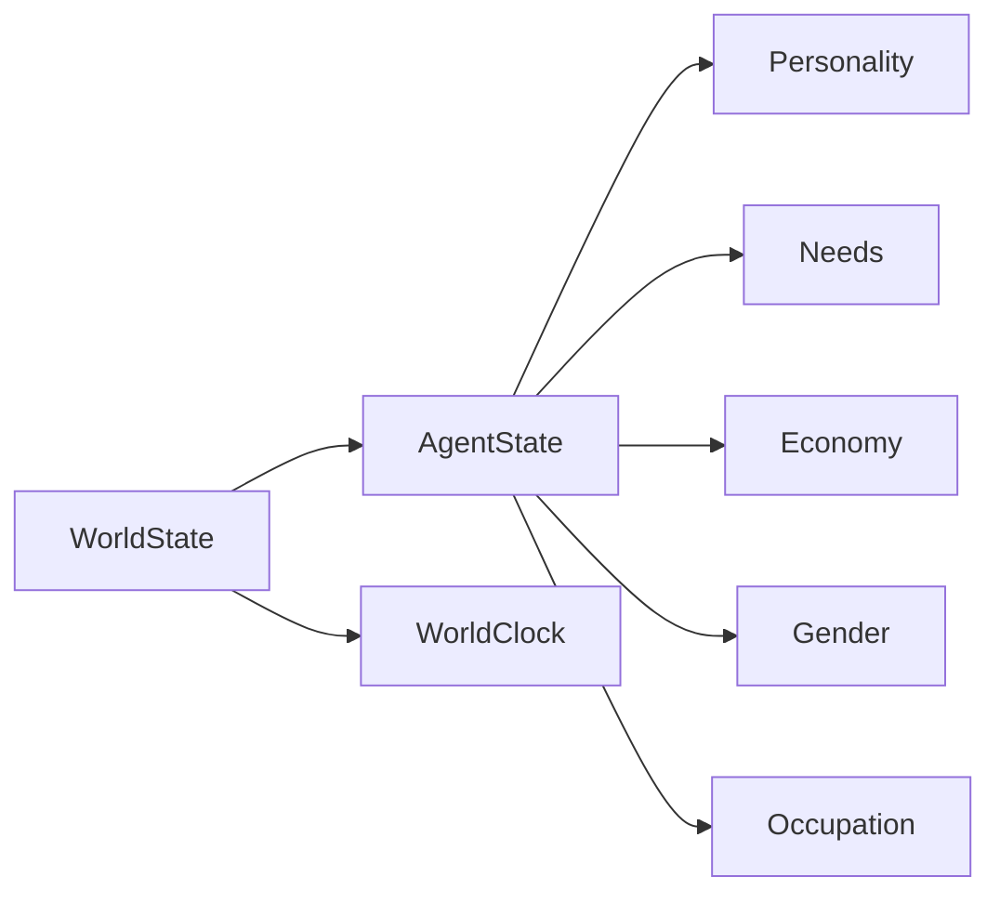

# 智能体引擎

<cite>
**本文档引用的文件**
- [backend/app/core/agent.py](file://backend/app/core/agent.py)
- [backend/app/core/world.py](file://backend/app/core/world.py)
- [specs/01-architecture.spec.md](file://specs/01-architecture.spec.md)
- [specs/03-economy-system.spec.md](file://specs/03-economy-system.spec.md)
- [specs/04-conversation-system.spec.md](file://specs/04-conversation-system.spec.md)
- [specs/05-world-map.spec.md](file://specs/05-world-map.spec.md)
</cite>

## 目录
1. [简介](#简介)
2. [项目结构](#项目结构)
3. [核心组件](#核心组件)
4. [架构总览](#架构总览)
5. [详细组件分析](#详细组件分析)
6. [依赖分析](#依赖分析)
7. [性能考虑](#性能考虑)
8. [故障排查指南](#故障排查指南)
9. [结论](#结论)
10. [附录](#附录)

## 简介
本文件面向“智能体引擎”的综合技术文档，围绕智能体数据模型、行为决策算法、个性化属性管理、智能体交互机制展开，并结合对话与社交系统、经济系统、世界地图与导航系统，提供可操作的扩展开发指南与性能优化建议。文档同时给出关键流程的时序与类图，帮助读者快速理解系统设计与实现路径。

## 项目结构
后端采用分层架构，核心位于 backend/app/core，包含智能体状态、世界时钟与配置、以及与之配套的系统规范（对话、经济、地图）。前端基于 React + Pixi.js，通过 WebSocket 实时接收事件流。

图表来源
- [specs/01-architecture.spec.md](file://specs/01-architecture.spec.md#L14-L56)

章节来源
- [specs/01-architecture.spec.md](file://specs/01-architecture.spec.md#L92-L169)

## 核心组件
本节聚焦智能体数据模型与世界状态，它们是系统运行的基础。

- AgentState：智能体的全量状态，包含身份、个性、需求、经济、位置、行为、思考、情感、记忆索引、模型选择等。
- Personality：五大人格维度（开放性、尽责性、外向性、宜人性、神经质）。
- Needs/Economy：基础需求与经济状态，支撑行为与交互的约束。
- WorldState/WorldClock：世界时间推进、地图配置与智能体集合。

章节来源
- [backend/app/core/agent.py](file://backend/app/core/agent.py#L25-L92)
- [backend/app/core/world.py](file://backend/app/core/world.py#L8-L40)

## 架构总览
智能体引擎在世界循环中驱动所有智能体的状态更新与行为决策，结合 LLM 进行复杂推理，再通过事件总线广播到前端。

图表来源
- [specs/01-architecture.spec.md](file://specs/01-architecture.spec.md#L173-L220)

章节来源
- [specs/01-architecture.spec.md](file://specs/01-architecture.spec.md#L171-L220)

## 详细组件分析

### 智能体数据模型设计
AgentState 是智能体的“事实真相”，承载其身份、个性、需求、经济、位置、行为、思考、情感、记忆索引与模型选择。Personality 与 Needs/Economy 为行为与交互提供约束与动机。

图表来源
- [backend/app/core/agent.py](file://backend/app/core/agent.py#L9-L92)

章节来源
- [backend/app/core/agent.py](file://backend/app/core/agent.py#L25-L92)

### 需求管理系统与状态转换规则
需求（Energy、Social）在世界循环中按固定速率衰减，直接影响行为选择与情绪状态。经济状态（Money、Income、DailyCost）决定消费意愿与工作动机，形成闭环。

图表来源
- [specs/01-architecture.spec.md](file://specs/01-architecture.spec.md#L175-L196)
- [specs/03-economy-system.spec.md](file://specs/03-economy-system.spec.md#L94-L109)

章节来源
- [specs/01-architecture.spec.md](file://specs/01-architecture.spec.md#L175-L196)
- [specs/03-economy-system.spec.md](file://specs/03-economy-system.spec.md#L31-L48)

### 行为决策算法与LLM集成
- AgentContext：封装世界时间、地点名称、附近智能体摘要、近期记忆，用于构建提示词。
- LLMRouter：根据 agent.model_name 路由到对应模型（DeepSeek、OpenAI、Claude、本地），统一接口解析响应并验证合法性。
- AgentDecision：标准化输出动作、目标、原因与思考，确保行为可追踪与可审计。

图表来源
- [specs/01-architecture.spec.md](file://specs/01-architecture.spec.md#L198-L220)
- [backend/app/core/agent.py](file://backend/app/core/agent.py#L87-L92)

章节来源
- [specs/01-architecture.spec.md](file://specs/01-architecture.spec.md#L198-L220)
- [backend/app/core/agent.py](file://backend/app/core/agent.py#L78-L92)

### 个性化属性管理
- 性格特征：五大人格维度影响对话倾向、社交意愿与行为偏好。
- 社交关系：通过对话与互动累积关系强度，影响后续对话概率与话题选择。
- 学习能力：技能字典（skills）随行为与经验提升，影响收入与工作效率。

章节来源
- [backend/app/core/agent.py](file://backend/app/core/agent.py#L25-L56)
- [specs/04-conversation-system.spec.md](file://specs/04-conversation-system.spec.md#L298-L374)

### 智能体交互机制
- 交流协议：基于距离、停留时长、关系亲疏、外向性与社交需求的概率触发对话。
- 情感表达：通过关键词检测情绪（快乐、悲伤、愤怒、好奇、中性），影响关系变化。
- 关系建立算法：对话轮次、情绪共鸣、话题类型与性格兼容性共同决定关系强度变化。

图表来源
- [specs/04-conversation-system.spec.md](file://specs/04-conversation-system.spec.md#L14-L96)
- [specs/04-conversation-system.spec.md](file://specs/04-conversation-system.spec.md#L190-L240)
- [specs/04-conversation-system.spec.md](file://specs/04-conversation-system.spec.md#L244-L296)
- [specs/04-conversation-system.spec.md](file://specs/04-conversation-system.spec.md#L298-L374)

章节来源
- [specs/04-conversation-system.spec.md](file://specs/04-conversation-system.spec.md#L12-L96)
- [specs/04-conversation-system.spec.md](file://specs/04-conversation-system.spec.md#L190-L240)
- [specs/04-conversation-system.spec.md](file://specs/04-conversation-system.spec.md#L244-L296)
- [specs/04-conversation-system.spec.md](file://specs/04-conversation-system.spec.md#L298-L374)

### 世界地图与导航系统
- WorldClock：现实时间与游戏时间的映射（1分钟现实=10分钟游戏）。
- 导航：A*寻路 + 网格化地图（20x20像素），移动消耗能量并广播事件。
- 位置热度：基于占用率、时间段与近期活动计算，指导智能体选址与社交。

图表来源
- [specs/05-world-map.spec.md](file://specs/05-world-map.spec.md#L331-L419)

章节来源
- [specs/05-world-map.spec.md](file://specs/05-world-map.spec.md#L238-L286)
- [specs/05-world-map.spec.md](file://specs/05-world-map.spec.md#L331-L419)

### 经济系统与行为影响
- 收入：按职业时薪、技能加成与心情修正计算；被动收入（学生/退休）按日发放。
- 支出：每日固定成本（房租、餐饮、交通、通讯）自动扣除；可选消费触发即时效果。
- 经济状态分级：富裕/稳定/紧张/拮据/负债，影响消费意愿、工作动机与幸福感。

图表来源
- [specs/03-economy-system.spec.md](file://specs/03-economy-system.spec.md#L94-L109)
- [specs/03-economy-system.spec.md](file://specs/03-economy-system.spec.md#L111-L156)

章节来源
- [specs/03-economy-system.spec.md](file://specs/03-economy-system.spec.md#L16-L48)
- [specs/03-economy-system.spec.md](file://specs/03-economy-system.spec.md#L67-L109)
- [specs/03-economy-system.spec.md](file://specs/03-economy-system.spec.md#L111-L156)

## 依赖分析
- AgentState 依赖 Personality、Needs、Economy、Gender、Occupation。
- WorldState 依赖 WorldClock 与 AgentState（避免循环导入）。
- 智能体引擎与 LLM 抽象层解耦，通过 LLMRouter 路由到具体适配器。

图表来源
- [backend/app/core/agent.py](file://backend/app/core/agent.py#L25-L92)
- [backend/app/core/world.py](file://backend/app/core/world.py#L30-L40)

章节来源
- [backend/app/core/agent.py](file://backend/app/core/agent.py#L25-L92)
- [backend/app/core/world.py](file://backend/app/core/world.py#L30-L40)

## 性能考虑
- 智能体数量：目标 50-200，建议并行处理智能体更新，减少锁竞争。
- API与WebSocket：目标延迟 <50ms，建议连接池与消息批处理。
- LLM调用频率：每智能体每10分钟最多1次，避免过度调用。
- 内存占用：<2GB，建议对象池化与增量序列化。

章节来源
- [specs/01-architecture.spec.md](file://specs/01-architecture.spec.md#L238-L248)

## 故障排查指南
- LLM响应异常：检查 AgentContext 构建是否完整、提示词模板是否正确、解析逻辑是否严格。
- 对话未触发：确认触发条件（距离、停留时长、关系修正、外向性与社交需求）是否满足。
- 经济状态异常：核对每日结算逻辑、被动收入发放与固定支出扣除。
- 导航失败：检查 A*寻路网格、障碍物与可达性，确认移动事件广播。

章节来源
- [specs/04-conversation-system.spec.md](file://specs/04-conversation-system.spec.md#L52-L96)
- [specs/03-economy-system.spec.md](file://specs/03-economy-system.spec.md#L94-L109)
- [specs/05-world-map.spec.md](file://specs/05-world-map.spec.md#L331-L419)

## 结论
智能体引擎以 AgentState 为核心，结合需求与经济系统驱动行为，通过 LLMRouter 实现复杂决策，辅以对话与社交系统、世界地图与导航系统，形成完整的社会仿真框架。建议在扩展新模型、行为与区域时遵循统一接口与提示词模板，确保系统一致性与可维护性。

## 附录
- 代码示例路径（不含具体代码内容）
  - 智能体创建与状态更新：参见世界循环与 AgentEngine 的调用链
    - [specs/01-architecture.spec.md](file://specs/01-architecture.spec.md#L175-L196)
  - 行为执行与事件广播：参见 LLM 调用与事件推送
    - [specs/01-architecture.spec.md](file://specs/01-architecture.spec.md#L198-L220)
  - 对话触发与关系更新：参见对话触发机制与关系更新逻辑
    - [specs/04-conversation-system.spec.md](file://specs/04-conversation-system.spec.md#L52-L96)
    - [specs/04-conversation-system.spec.md](file://specs/04-conversation-system.spec.md#L328-L374)
  - 经济结算与状态影响：参见每日结算与行为修正
    - [specs/03-economy-system.spec.md](file://specs/03-economy-system.spec.md#L94-L109)
    - [specs/03-economy-system.spec.md](file://specs/03-economy-system.spec.md#L124-L156)
  - 导航与移动：参见 A* 寻路与移动执行
    - [specs/05-world-map.spec.md](file://specs/05-world-map.spec.md#L331-L419)