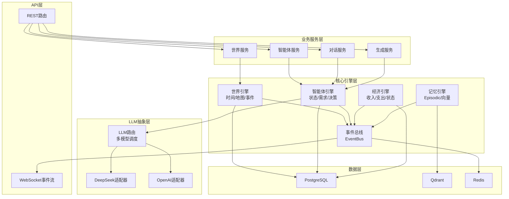
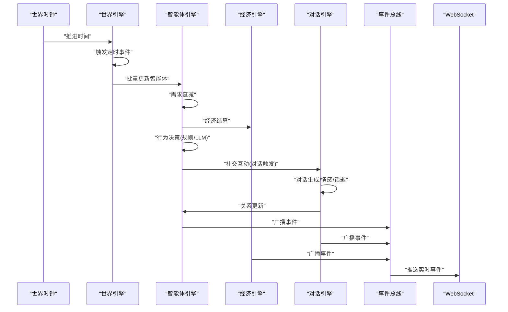
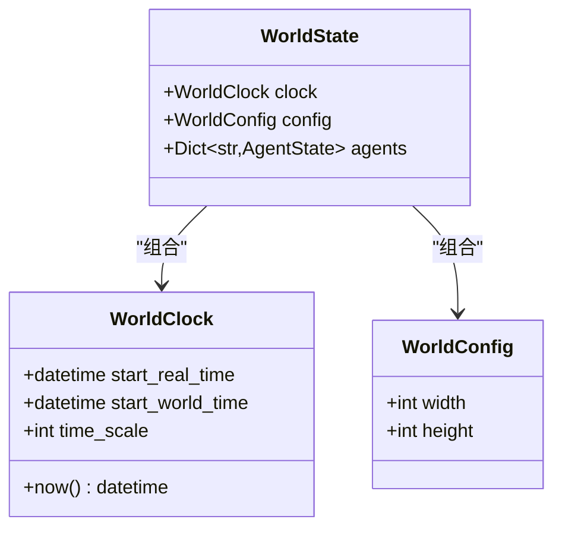
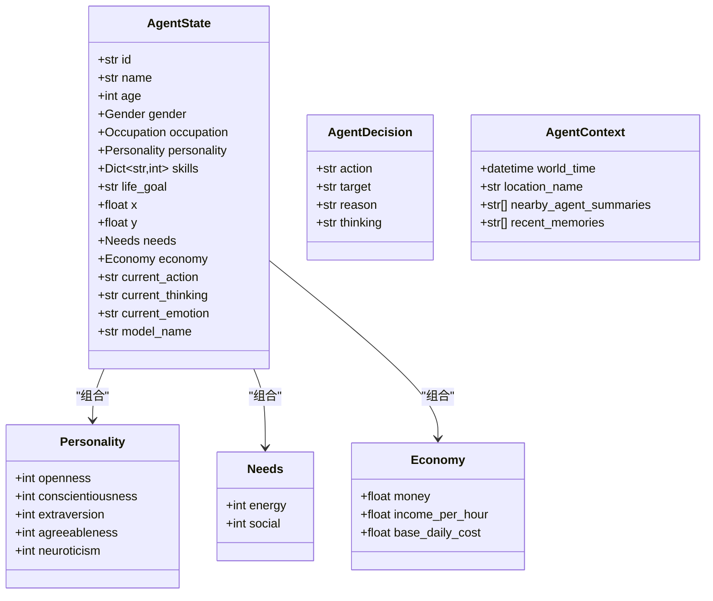
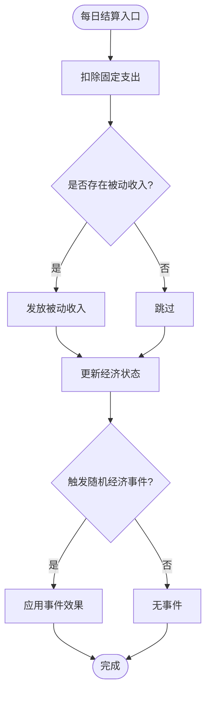
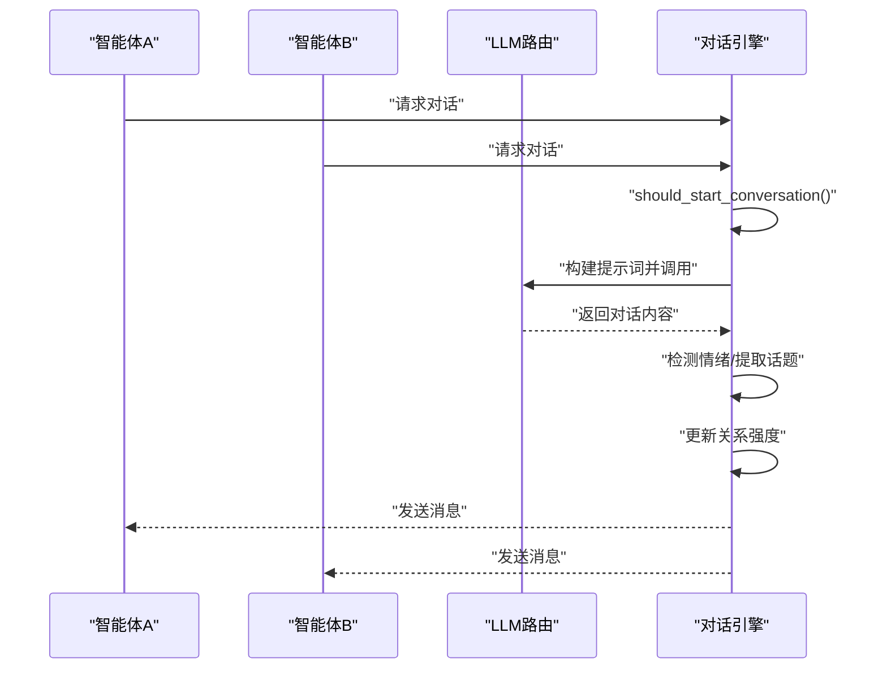
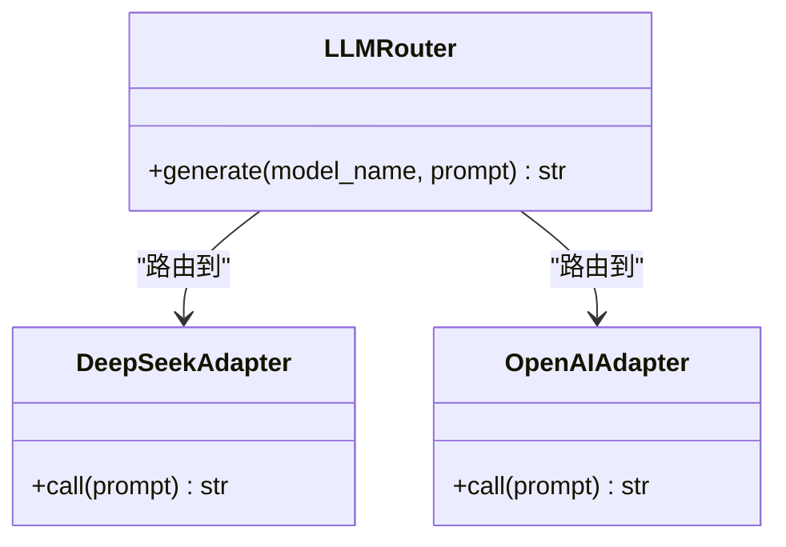
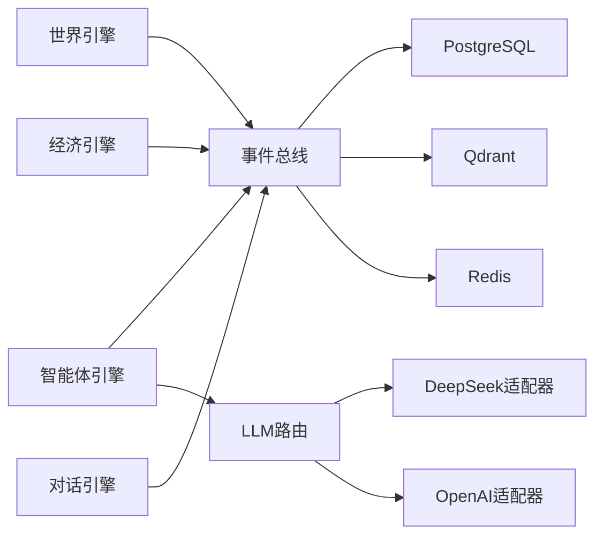

# 核心引擎

<cite>
**本文档引用的文件**
- [backend/app/core/world.py](file://backend/app/core/world.py)
- [backend/app/core/agent.py](file://backend/app/core/agent.py)
- [backend/app/core/config.py](file://backend/app/core/config.py)
- [specs/00-project-overview.spec.md](file://specs/00-project-overview.spec.md)
- [specs/01-architecture.spec.md](file://specs/01-architecture.spec.md)
- [specs/03-economy-system.spec.md](file://specs/03-economy-system.spec.md)
- [specs/04-conversation-system.spec.md](file://specs/04-conversation-system.spec.md)
- [specs/05-world-map.spec.md](file://specs/05-world-map.spec.md)
- [specs/06-api-design.spec.md](file://specs/06-api-design.spec.md)
</cite>

## 目录
1. [简介](#简介)
2. [项目结构](#项目结构)
3. [核心组件](#核心组件)
4. [架构总览](#架构总览)
5. [详细组件分析](#详细组件分析)
6. [依赖分析](#依赖分析)
7. [性能考虑](#性能考虑)
8. [故障排查指南](#故障排查指南)
9. [结论](#结论)
10. [附录](#附录)

## 简介
本文件面向“AI Society”核心引擎，系统化梳理世界引擎的时间管理、事件调度与状态同步；智能体引擎的数据模型、行为决策与需求管理；经济引擎的收入与支出计算、经济状态与财富分配；对话引擎的交流机制、情感表达与关系建立；以及LLM集成的适配器与多模型路由。文档同时给出架构图、序列图、流程图与最佳实践，帮助读者快速理解并扩展系统。

## 项目结构
后端采用分层模块化设计：
- 核心层：世界引擎、智能体引擎、经济引擎、记忆引擎、事件总线
- LLM抽象层：多模型路由与适配器
- 业务服务层：世界服务、智能体服务、对话服务、生成服务
- API层：REST路由与WebSocket事件流
- 数据层：PostgreSQL、Qdrant、Redis

图表来源
- [specs/01-architecture.spec.md](file://specs/01-architecture.spec.md#L24-L56)

章节来源
- [specs/01-architecture.spec.md](file://specs/01-architecture.spec.md#L92-L169)

## 核心组件
- 世界引擎：负责世界时钟、地图与导航、定时事件与世界事件、位置热度与状态同步。
- 智能体引擎：负责智能体数据模型、需求系统、经济状态、行为决策与上下文构建。
- 经济引擎：负责收入计算、日常结算、经济状态分级与行为影响、随机经济事件与社交经济互动。
- 对话引擎：负责对话触发、提示词构建、情感检测、话题提取、关系更新与记忆存储。
- LLM抽象层：负责多模型路由与适配器，统一LLM调用接口。

章节来源
- [backend/app/core/world.py](file://backend/app/core/world.py#L8-L40)
- [backend/app/core/agent.py](file://backend/app/core/agent.py#L25-L92)
- [specs/03-economy-system.spec.md](file://specs/03-economy-system.spec.md#L1-L418)
- [specs/04-conversation-system.spec.md](file://specs/04-conversation-system.spec.md#L1-L581)
- [specs/01-architecture.spec.md](file://specs/01-architecture.spec.md#L38-L56)

## 架构总览
世界引擎主循环（每游戏内10分钟推进一次）：
1) 时间推进：更新世界时钟、触发定时事件（日出/日落/发工资等）
2) 智能体更新：需求衰减、经济结算、行为决策（规则+LLM）
3) 社交互动：检测近距离智能体、触发对话
4) 事件广播：通过EventBus推送到WebSocket，前端实时更新

图表来源
- [specs/01-architecture.spec.md](file://specs/01-architecture.spec.md#L173-L196)

章节来源
- [specs/01-architecture.spec.md](file://specs/01-architecture.spec.md#L171-L220)

## 详细组件分析

### 世界引擎：时间管理、事件调度与状态同步
- 世界时钟
  - 现实1分钟 = 游戏内10分钟（倍率10），起始时间与世界时间偏移可控
  - 提供now()获取当前世界时间，并派生时段（朝/午/夕/夜）、昼夜判断
- 地图与导航
  - 世界尺寸2000×2000像素，网格20×20像素，A*寻路，移动消耗能量
  - 位置类型丰富（住宅/商业/办公/休闲/广场/学校/商店/工作室），具备容量与功能
- 定时事件与世界事件
  - 日出/日落、上下班、午餐、每日结算等定时事件
  - 随机世界事件（免费咖啡、集市、公司团建等）提升社会动态
- 状态同步
  - 世界状态包含时钟、配置与智能体集合，后续可接入数据库/缓存

图表来源
- [backend/app/core/world.py](file://backend/app/core/world.py#L8-L40)

章节来源
- [backend/app/core/world.py](file://backend/app/core/world.py#L8-L40)
- [specs/05-world-map.spec.md](file://specs/05-world-map.spec.md#L238-L329)

### 智能体引擎：数据模型、需求系统与行为决策
- 数据模型
  - 性别、职业枚举；五大人格维度；需求（能量/社交）；经济（余额/收入/日均成本）
  - 智能体状态：位置、当前动作/思考/情绪、记忆索引、所用模型名
- 需求系统
  - 每轮衰减（能量-5、社交-3等），驱动移动与社交行为
- 行为决策
  - 规则引擎（简单决策）与LLM（复杂决策）结合
  - AgentContext包含世界时间、地点、附近智能体摘要、近期记忆
- 模型路由
  - 智能体可配置模型名（如deepseek-chat、deepseek-reasoner、openai-gpt4o），由LLM路由选择对应适配器

图表来源
- [backend/app/core/agent.py](file://backend/app/core/agent.py#L25-L92)

章节来源
- [backend/app/core/agent.py](file://backend/app/core/agent.py#L9-L92)
- [specs/01-architecture.spec.md](file://specs/01-architecture.spec.md#L198-L220)

### 经济引擎：收入、支出与财富分配
- 收入计算
  - 职业时薪为基础，技能加成（主要技能每10点+5%），心情影响（不开心时效率下降）
- 被动收入
  - 学生/退休人员每日补贴
- 支出管理
  - 固定日均开销（房租/餐饮/交通/通讯），行为触发可选消费
- 经济状态与行为影响
  - 分为富裕/稳定/紧张/拮据/负债五级，对消费意愿、工作动机、压力水平产生影响
- 随机经济事件
  - 奖金、医疗、红包、手机损坏等事件，影响余额与行为
- 社交经济互动
  - 借款与请客，基于关系强度与经济状况，影响关系与财务

图表来源
- [specs/03-economy-system.spec.md](file://specs/03-economy-system.spec.md#L91-L109)

章节来源
- [specs/03-economy-system.spec.md](file://specs/03-economy-system.spec.md#L16-L157)

### 对话引擎：交流机制、情感表达与关系建立
- 对话触发
  - 近距离遇见过（基础概率+关系/外向性/社交需求修正）、主动搭讪、工作互动、约定见面
- 对话生成
  - 开场白与回复提示词，基于角色背景、关系、场景与记忆
  - LLM生成，解析响应，检测情绪，控制轮次与结束条件
- 情感与话题
  - 情绪关键词检测（快乐/悲伤/愤怒/好奇/中性）
  - 话题提取（工作/生活/关系/爱好/八卦/计划）
- 关系建立
  - 基础增益、长对话奖励、情绪共鸣/争吵惩罚、话题影响、性格兼容性
  - 关系强度更新与类型升级，广播关系变化事件

图表来源
- [specs/04-conversation-system.spec.md](file://specs/04-conversation-system.spec.md#L190-L240)

章节来源
- [specs/04-conversation-system.spec.md](file://specs/04-conversation-system.spec.md#L12-L188)

### LLM集成：适配器架构与多模型路由
- 多模型支持
  - 预留DeepSeek与OpenAI等多家供应商，支持不同用途（日常对话/复杂推理）
- 路由机制
  - 根据智能体model_name选择对应适配器，统一接口封装
- 适配器职责
  - DeepSeek适配器、OpenAI适配器等，负责参数映射、错误处理与响应解析

图表来源
- [specs/01-architecture.spec.md](file://specs/01-architecture.spec.md#L38-L56)

章节来源
- [specs/01-architecture.spec.md](file://specs/01-architecture.spec.md#L24-L31)
- [backend/app/core/config.py](file://backend/app/core/config.py#L24-L39)

## 依赖分析
- 组件耦合
  - 世界引擎与智能体引擎通过事件总线解耦，世界时钟驱动主循环
  - 智能体引擎依赖经济与对话子系统，LLM路由作为外部依赖注入
- 外部依赖
  - 数据持久：PostgreSQL（结构化）、Qdrant（向量记忆）、Redis（缓存/队列）
  - 通信：FastAPI + APScheduler（后台任务）、WebSocket（实时事件）

图表来源
- [specs/01-architecture.spec.md](file://specs/01-architecture.spec.md#L50-L56)

章节来源
- [specs/01-architecture.spec.md](file://specs/01-architecture.spec.md#L59-L91)

## 性能考虑
- 智能体并行更新：主循环中智能体状态更新并行处理，减少全局锁竞争
- LLM调用频率控制：每智能体每10分钟最多1次，避免高频调用
- WebSocket低延迟：事件总线推送，前端订阅特定频道，降低无效流量
- 内存占用：建议上限<2GB，合理分页与缓存策略

章节来源
- [specs/01-architecture.spec.md](file://specs/01-architecture.spec.md#L238-L248)

## 故障排查指南
- 世界暂停导致操作失败
  - 现象：返回“世界已暂停”
  - 处理：调用恢复接口后再试
- 智能体/位置/对话不存在
  - 现象：404错误
  - 处理：确认ID正确与资源存在
- 请求过于频繁
  - 现象：429限流
  - 处理：降低请求频率或使用WebSocket订阅
- 服务器内部错误
  - 现象：500错误
  - 处理：查看后端日志，重试或回滚变更

章节来源
- [specs/06-api-design.spec.md](file://specs/06-api-design.spec.md#L619-L655)

## 结论
本核心引擎以“真实对齐”为设计原则，通过清晰的分层架构与模块化组件，实现了时间推进、智能体自治、经济压力、社交互动与LLM决策的有机融合。世界引擎提供稳定的时钟与地图，智能体引擎承载行为与需求，经济与对话引擎塑造社会动态，LLM路由实现多模型灵活调度。配合完善的API与WebSocket事件流，系统既满足研究观察需求，又具备良好的扩展性与稳定性。

## 附录

### 使用模式与最佳实践
- 世界控制
  - 通过REST控制世界运行（暂停/恢复/变速），避免在暂停状态下执行写操作
- 智能体管理
  - 使用spawn服务创建智能体，设置初始位置与模型名；定期检查需求与经济状态
- 对话与关系
  - 通过对话服务发起/监听对话，关注关系变化事件，引导社交互动
- 经济观测
  - 监控每日结算事件与随机经济事件，评估社会整体健康度
- LLM调用
  - 为复杂决策场景选择合适模型（reasoner vs chat），避免过度调用

章节来源
- [specs/06-api-design.spec.md](file://specs/06-api-design.spec.md#L18-L108)
- [specs/01-architecture.spec.md](file://specs/01-architecture.spec.md#L222-L237)