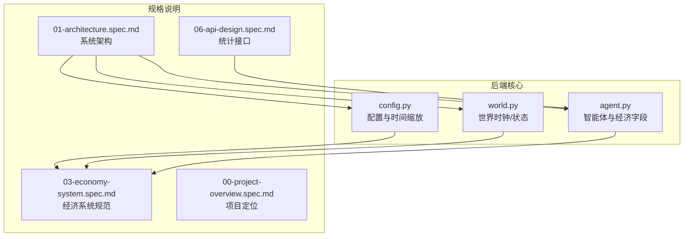
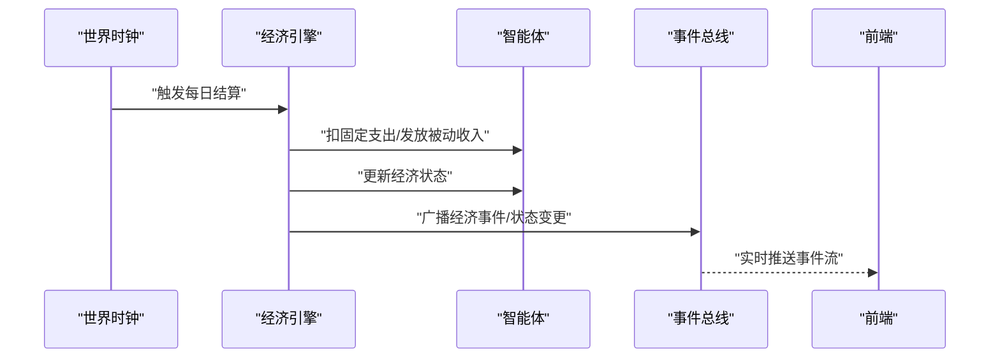
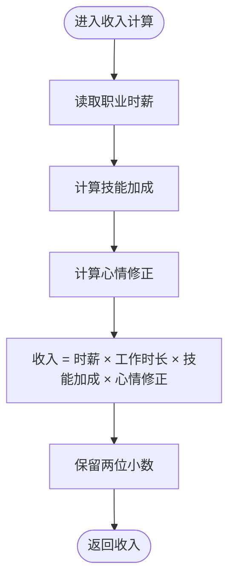
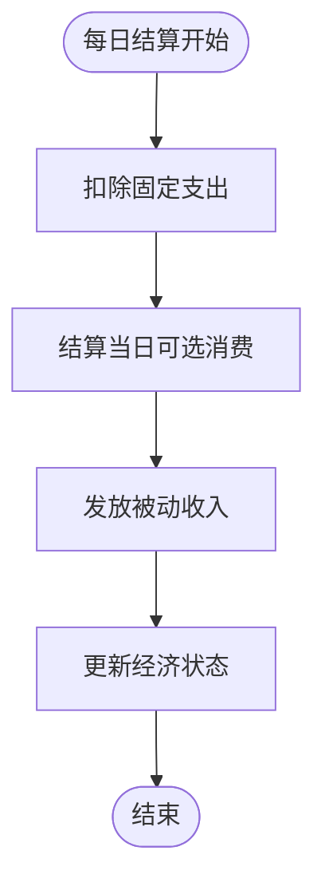
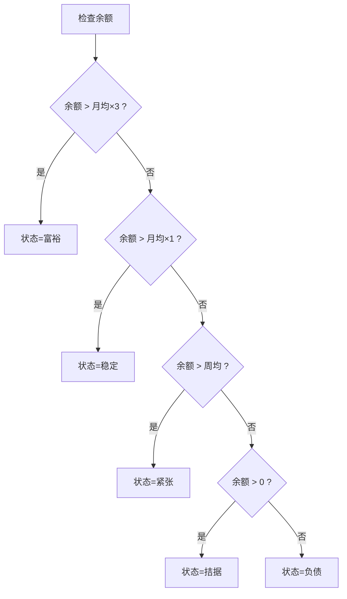
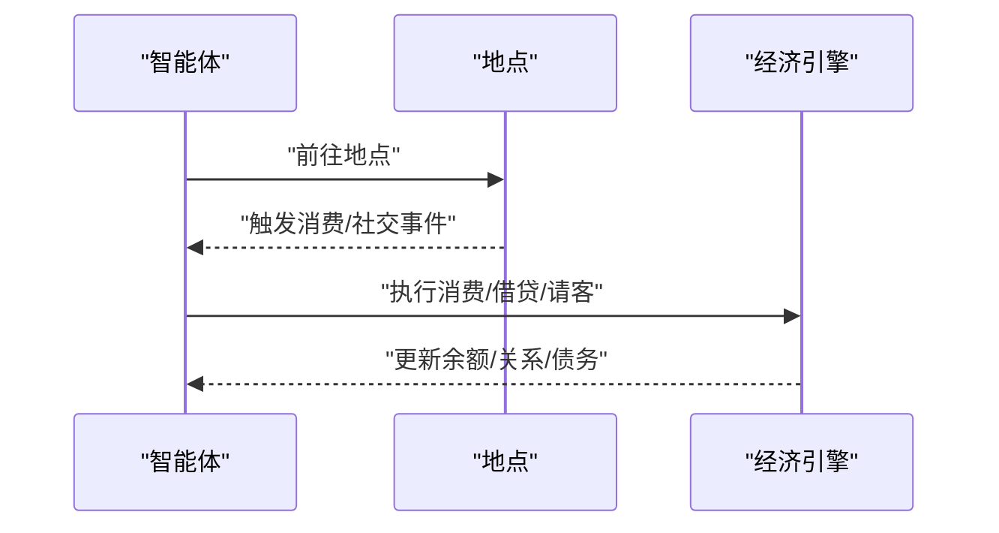
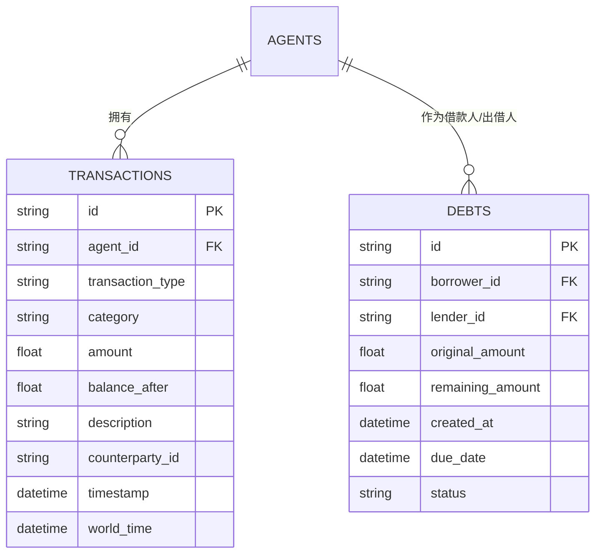
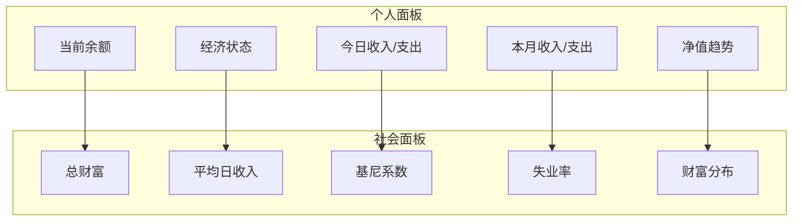
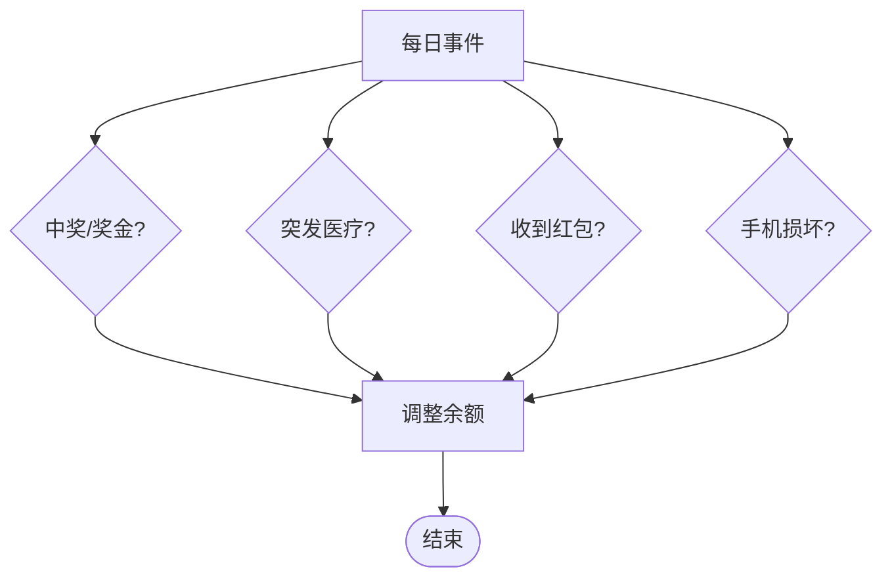
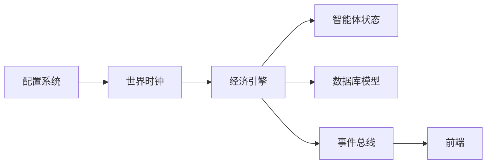

# 经济引擎

<cite>
**本文档引用的文件**
- [specs/03-economy-system.spec.md](file://specs/03-economy-system.spec.md)
- [backend/app/core/agent.py](file://backend/app/core/agent.py)
- [backend/app/core/world.py](file://backend/app/core/world.py)
- [backend/app/core/config.py](file://backend/app/core/config.py)
- [specs/00-project-overview.spec.md](file://specs/00-project-overview.spec.md)
- [specs/01-architecture.spec.md](file://specs/01-architecture.spec.md)
- [specs/06-api-design.spec.md](file://specs/06-api-design.spec.md)
</cite>

## 目录
1. [简介](#简介)
2. [项目结构](#项目结构)
3. [核心组件](#核心组件)
4. [架构总览](#架构总览)
5. [详细组件分析](#详细组件分析)
6. [依赖关系分析](#依赖关系分析)
7. [性能考量](#性能考量)
8. [故障排查指南](#故障排查指南)
9. [结论](#结论)
10. [附录](#附录)

## 简介
本文件面向“经济引擎”的技术实现与规范，围绕收入计算模型、支出管理机制、财富分配算法、经济活动触发条件、账务与统计、以及经济平衡调节机制进行系统化梳理。文档以规格说明为依据，结合现有代码结构，给出可操作的实现建议、可视化图表与参数调整指南，并提供异常处理方案。

## 项目结构
经济引擎位于后端核心模块中，与世界时钟、智能体状态、配置管理协同工作，支撑“现实对齐”的经济系统。整体目录与职责如下：
- 后端核心模块
  - core/agent.py：智能体状态与经济字段定义
  - core/world.py：世界时钟与世界状态
  - core/config.py：系统配置与时间缩放
- 规格说明
  - specs/03-economy-system.spec.md：经济系统完整规范
  - specs/00-project-overview.spec.md：项目定位与核心理念
  - specs/01-architecture.spec.md：系统架构与数据流
  - specs/06-api-design.spec.md：统计接口示例

**图表来源**
- [backend/app/core/agent.py](file://backend/app/core/agent.py#L40-L70)
- [backend/app/core/world.py](file://backend/app/core/world.py#L8-L36)
- [backend/app/core/config.py](file://backend/app/core/config.py#L7-L42)
- [specs/03-economy-system.spec.md](file://specs/03-economy-system.spec.md#L1-L418)
- [specs/01-architecture.spec.md](file://specs/01-architecture.spec.md#L99-L176)

**章节来源**
- [specs/00-project-overview.spec.md](file://specs/00-project-overview.spec.md#L23-L26)
- [specs/01-architecture.spec.md](file://specs/01-architecture.spec.md#L99-L176)

## 核心组件
- 智能体经济字段
  - 经济状态对象包含余额、时薪、日均基础成本等，支撑收入与支出计算。
- 世界时钟
  - 提供世界时间推进与时间缩放，驱动每日结算与事件触发。
- 配置系统
  - 提供时间缩放、数据库与外部服务连接等全局设置。
- 经济系统规范
  - 收入计算、支出结算、经济状态分级、随机事件、社交经济互动、数据库模型与统计面板。

**章节来源**
- [backend/app/core/agent.py](file://backend/app/core/agent.py#L40-L70)
- [backend/app/core/world.py](file://backend/app/core/world.py#L8-L36)
- [backend/app/core/config.py](file://backend/app/core/config.py#L7-L42)
- [specs/03-economy-system.spec.md](file://specs/03-economy-system.spec.md#L16-L157)

## 架构总览
经济引擎在“世界循环”中与智能体引擎协作，每游戏内10分钟（现实1分钟）推进一次。经济结算与行为决策并行处理，事件通过事件总线推送至前端。

**图表来源**
- [specs/01-architecture.spec.md](file://specs/01-architecture.spec.md#L180-L203)
- [specs/03-economy-system.spec.md](file://specs/03-economy-system.spec.md#L94-L109)

## 详细组件分析

### 收入计算模型
- 工资收入
  - 基于职业时薪与工作时长计算基础收入。
  - 技能加成：主要技能每10点带来约5%的收入加成（以50分为基准）。
  - 心情影响：当幸福度不大于50时，效率降低至0.8。
- 被动收入
  - 学生与退休人员按日发放固定补贴/养老金。

**图表来源**
- [specs/03-economy-system.spec.md](file://specs/03-economy-system.spec.md#L33-L48)

**章节来源**
- [specs/03-economy-system.spec.md](file://specs/03-economy-system.spec.md#L16-L65)

### 支出管理机制
- 固定支出（每日自动扣除）
  - 基础餐饮、交通、通讯等构成日均最低开销，维持基本生存。
- 可选支出（行为触发）
  - 咖啡、聚餐、观影、购物、旅行等，按行为发生时即时扣款。
- 每日结算流程
  - 扣除固定支出 → 结算当日可选消费 → 发放被动收入 → 更新经济状态。

**图表来源**
- [specs/03-economy-system.spec.md](file://specs/03-economy-system.spec.md#L94-L109)

**章节来源**
- [specs/03-economy-system.spec.md](file://specs/03-economy-system.spec.md#L67-L109)

### 财富分配算法与经济状态
- 经济状态分级
  - 富裕、稳定、紧张、拮据、负债，阈值基于月均/周均支出与余额比较。
- 行为影响
  - 不同状态对消费意愿、工作动机、压力水平产生差异化影响；极端状态引入幸福感与社交惩罚。

**图表来源**
- [specs/03-economy-system.spec.md](file://specs/03-economy-system.spec.md#L115-L157)

**章节来源**
- [specs/03-economy-system.spec.md](file://specs/03-economy-system.spec.md#L111-L157)

### 经济活动触发条件
- 工作行为
  - 按职业与工作时长计算收入，受技能与心情影响。
- 交易行为
  - 咖啡馆、餐厅、娱乐场所、商场等地点触发消费；旅行请假触发额外成本。
- 社交经济互动
  - 借钱：需满足关系强度与出借人经济状况；记录债务关系。
  - 请客：按人数与地点成本计算，提升关系。

**图表来源**
- [specs/03-economy-system.spec.md](file://specs/03-economy-system.spec.md#L79-L231)

**章节来源**
- [specs/03-economy-system.spec.md](file://specs/03-economy-system.spec.md#L79-L231)

### 账务处理与记录机制
- 数据库模型
  - 交易记录：收入/支出/转账分类、金额、余额后、描述、对手方、时间戳、世界时间。
  - 债务关系：借款人、出借人、原始金额、剩余金额、到期日、状态。
- 记账流程
  - 每笔交易写入交易表，保持余额后一致性；债务关系随借贷行为创建与更新。

**图表来源**
- [specs/03-economy-system.spec.md](file://specs/03-economy-system.spec.md#L315-L342)

**章节来源**
- [specs/03-economy-system.spec.md](file://specs/03-economy-system.spec.md#L312-L342)

### 经济统计与报告
- 个人面板
  - 当前余额、经济状态、今日收支、本月收支、净值趋势。
- 社会面板
  - 总财富、平均日收入、基尼系数、失业率、财富分布。
- API示例
  - 提供社会统计与热门地点等接口，便于前端展示。

**图表来源**
- [specs/03-economy-system.spec.md](file://specs/03-economy-system.spec.md#L344-L375)
- [specs/06-api-design.spec.md](file://specs/06-api-design.spec.md#L311-L380)

**章节来源**
- [specs/03-economy-system.spec.md](file://specs/03-economy-system.spec.md#L344-L375)
- [specs/06-api-design.spec.md](file://specs/06-api-design.spec.md#L311-L380)

### 经济平衡调节机制
- 随机经济事件
  - 奖金、医疗费用、红包、手机损坏等事件，按概率影响余额。
- 失业与求职
  - 检查裁员与工作表现，触发失业与遣散费；求职根据技能匹配职位。
- 创业（预留）
  - 创业成本、技能门槛与成功率，作为高风险高回报选项。

**图表来源**
- [specs/03-economy-system.spec.md](file://specs/03-economy-system.spec.md#L159-L194)

**章节来源**
- [specs/03-economy-system.spec.md](file://specs/03-economy-system.spec.md#L159-L310)

## 依赖关系分析
- 经济引擎依赖
  - 智能体经济字段：AgentState.economy 提供余额与成本等关键数据。
  - 世界时钟：WorldClock 提供时间推进与结算节奏。
  - 配置系统：Settings.time_scale 控制现实与世界时间比例。
- 与架构的关系
  - 经济结算与智能体行为决策在世界循环中并行执行，事件通过事件总线推送前端。

**图表来源**
- [backend/app/core/config.py](file://backend/app/core/config.py#L7-L42)
- [backend/app/core/world.py](file://backend/app/core/world.py#L8-L36)
- [backend/app/core/agent.py](file://backend/app/core/agent.py#L40-L70)
- [specs/01-architecture.spec.md](file://specs/01-architecture.spec.md#L180-L203)

**章节来源**
- [specs/01-architecture.spec.md](file://specs/01-architecture.spec.md#L180-L203)

## 性能考量
- 时间缩放与批量处理
  - 采用10倍时间缩放，减少高频结算带来的系统压力；每日结算与行为触发分离，避免重复计算。
- 数据一致性
  - 交易记录与余额后字段确保账务可追溯；债务关系状态字段便于快速统计。
- 前后端解耦
  - 经济事件通过事件总线推送，前端按需渲染，降低后端渲染压力。

[本节为通用指导，不直接分析具体文件]

## 故障排查指南
- 收入异常偏低
  - 检查技能加成与心情修正是否生效；确认职业时薪配置正确。
- 余额持续下降
  - 核对固定支出与被动收入是否正确结算；排查可选消费是否被重复记录。
- 经济状态误判
  - 检查阈值配置与余额计算逻辑；确保每日结算流程完整执行。
- 债务无法偿还
  - 核对债务状态与还款计划；检查借贷双方经济状况与关系强度。
- 统计面板数据缺失
  - 确认交易记录与债务关系写入成功；检查API接口返回结构与前端渲染逻辑。

**章节来源**
- [specs/03-economy-system.spec.md](file://specs/03-economy-system.spec.md#L312-L375)

## 结论
经济引擎以“现实对齐”为核心设计原则，通过明确的收入、支出、状态与事件机制，构建了可观察、可统计、可调节的自治经济系统。配合世界时钟与事件总线，实现了稳定的经济循环与丰富的社会交互。建议在实现中严格遵循现有规范，确保数据一致性与可扩展性。

[本节为总结性内容，不直接分析具体文件]

## 附录

### 经济模型参数调整指南
- 收入参数
  - 职业时薪、技能加成系数、心情修正系数，建议以小步长调整并观察效果。
- 支出参数
  - 固定支出与可选消费价格，应与城市生活成本对齐，避免过度紧缩或宽松。
- 状态阈值
  - 富裕/稳定/紧张/拮据/负债阈值需与收入与支出平衡，防止状态频繁跳变。
- 随机事件
  - 概率与影响幅度需权衡，保证系统稳定性与趣味性。

**章节来源**
- [specs/03-economy-system.spec.md](file://specs/03-economy-system.spec.md#L16-L157)
- [specs/03-economy-system.spec.md](file://specs/03-economy-system.spec.md#L377-L417)

### 代码示例路径
- 收入计算函数
  - [calculate_income](file://specs/03-economy-system.spec.md#L33-L48)
- 每日结算流程
  - [daily_settlement](file://specs/03-economy-system.spec.md#L94-L109)
- 经济状态更新
  - [update_economic_status](file://specs/03-economy-system.spec.md#L108)
- 债务与借贷
  - [borrow_money](file://specs/03-economy-system.spec.md#L200-L219)
  - [treat_meal](file://specs/03-economy-system.spec.md#L221-L231)
- 创业逻辑
  - [start_business](file://specs/03-economy-system.spec.md#L293-L310)
- 数据库模型
  - [Transaction](file://specs/03-economy-system.spec.md#L315-L329)
  - [Debt](file://specs/03-economy-system.spec.md#L331-L342)

**章节来源**
- [specs/03-economy-system.spec.md](file://specs/03-economy-system.spec.md#L33-L342)