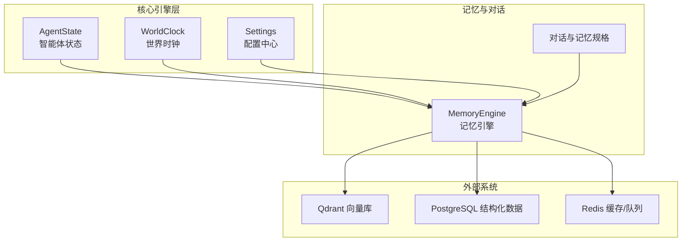
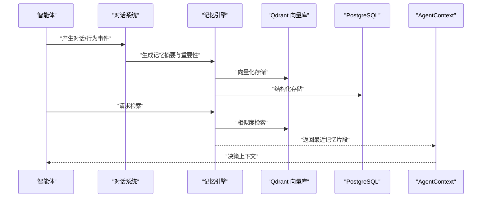
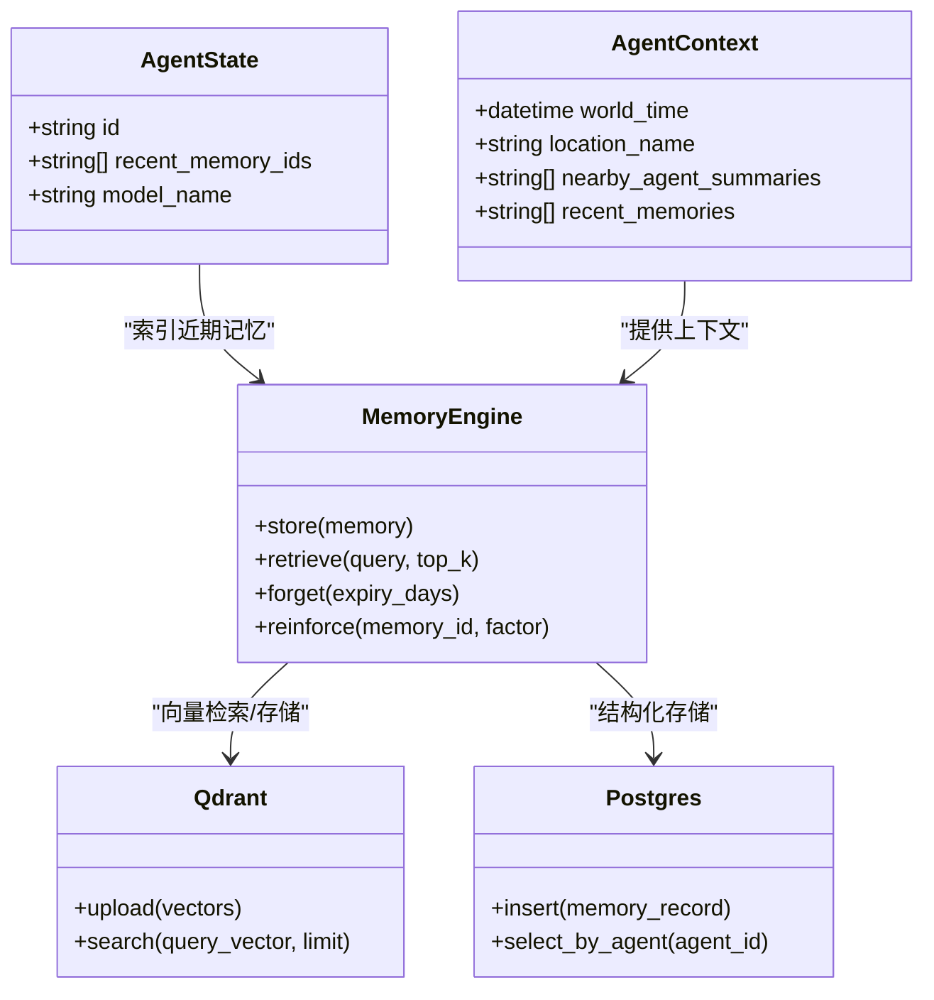
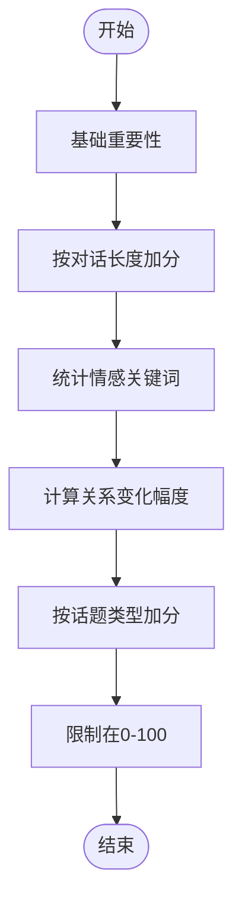
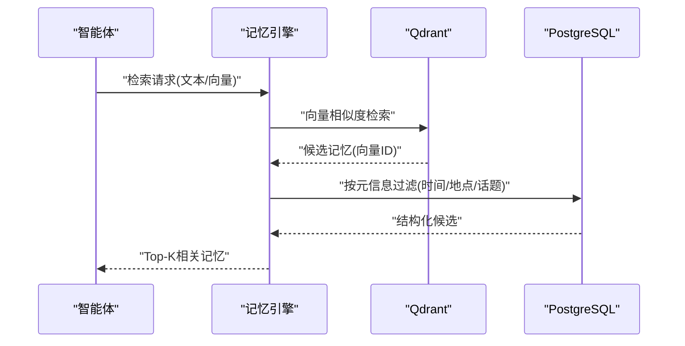
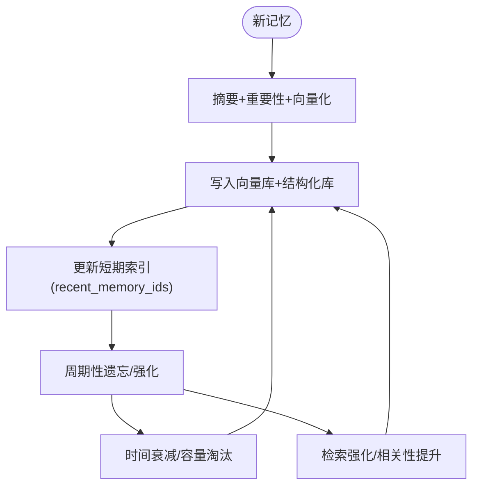
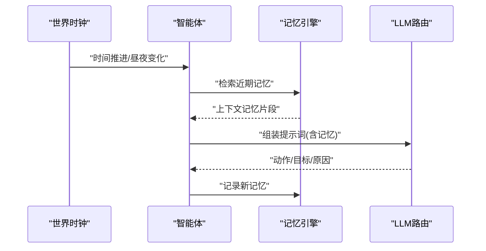
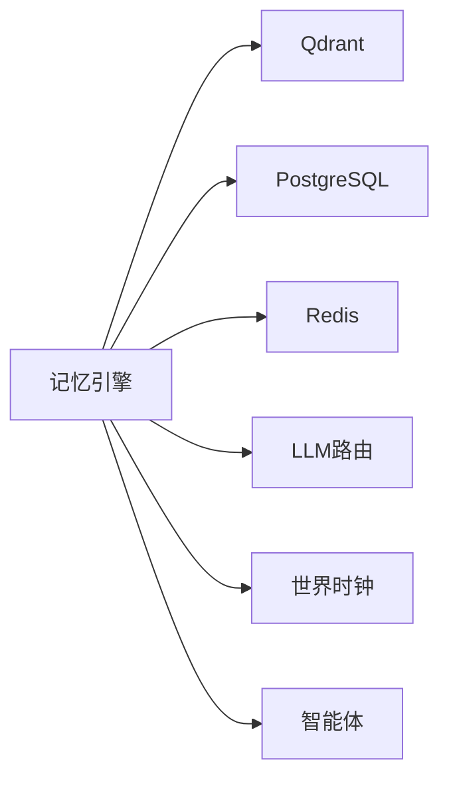

# 记忆引擎

<cite>
**本文引用的文件**
- [backend/app/core/agent.py](file://backend/app/core/agent.py)
- [backend/app/core/world.py](file://backend/app/core/world.py)
- [backend/app/core/config.py](file://backend/app/core/config.py)
- [specs/01-architecture.spec.md](file://specs/01-architecture.spec.md)
- [specs/04-conversation-system.spec.md](file://specs/04-conversation-system.spec.md)
- [specs/08-implementation-plan.spec.md](file://specs/08-implementation-plan.spec.md)
</cite>

## 目录
1. [简介](#简介)
2. [项目结构](#项目结构)
3. [核心组件](#核心组件)
4. [架构总览](#架构总览)
5. [详细组件分析](#详细组件分析)
6. [依赖分析](#依赖分析)
7. [性能考虑](#性能考虑)
8. [故障排查指南](#故障排查指南)
9. [结论](#结论)
10. [附录](#附录)

## 简介
本文件面向“记忆引擎”的技术文档，围绕短期记忆与长期记忆的分类管理、记忆权重（重要性）计算、记忆持久化与向量化检索、记忆更新策略（新增、遗忘、强化）、以及记忆在智能体决策中的作用展开。文档基于现有仓库中的核心数据结构、配置与规格说明进行系统化梳理，并提供可追溯的章节来源与图示。

## 项目结构
- 后端核心位于 backend/app/core，包含智能体状态、世界时钟与配置等模块。
- 记忆引擎作为独立子系统，与对话系统、LLM路由、事件总线协同工作。
- 规格文档 specs 提供了架构、实施计划与对话记忆存储的详细设计。

**图示来源**
- [specs/01-architecture.spec.md](file://specs/01-architecture.spec.md#L30-L32)
- [specs/01-architecture.spec.md](file://specs/01-architecture.spec.md#L52-L56)
- [specs/04-conversation-system.spec.md](file://specs/04-conversation-system.spec.md#L376-L439)
- [backend/app/core/config.py](file://backend/app/core/config.py#L98-L107)

**章节来源**
- [specs/01-architecture.spec.md](file://specs/01-architecture.spec.md#L1-L255)

## 核心组件
- 智能体状态与上下文
  - AgentState：包含近期记忆ID索引 recent_memory_ids，用于快速检索短期记忆。
  - AgentContext：在决策时携带最近记忆片段 recent_memories，辅助LLM生成上下文。
- 世界时钟与时间维度
  - WorldClock：提供世界时间、昼夜与工作/睡眠时段判断，为记忆的时间戳与重要性衰减提供依据。
- 配置中心
  - Settings：集中管理数据库、Redis、Qdrant、模型等外部依赖的连接参数与集合名称，支撑记忆持久化与检索。

**章节来源**
- [backend/app/core/agent.py](file://backend/app/core/agent.py#L48-L92)
- [backend/app/core/world.py](file://backend/app/core/world.py#L73-L292)
- [backend/app/core/config.py](file://backend/app/core/config.py#L19-L175)

## 架构总览
记忆引擎在系统中的定位如下：
- 输入：智能体行为事件、对话事件、世界时间推进。
- 处理：记忆编码（摘要、重要性、向量化）、检索（语义相似度、关键词、上下文关联）、更新（新增、遗忘、强化）。
- 输出：短期记忆索引 recent_memory_ids、AgentContext.recent_memories、向量检索结果、结构化记忆记录。

**图示来源**
- [specs/04-conversation-system.spec.md](file://specs/04-conversation-system.spec.md#L376-L439)
- [specs/01-architecture.spec.md](file://specs/01-architecture.spec.md#L30-L32)
- [backend/app/core/config.py](file://backend/app/core/config.py#L98-L107)

## 详细组件分析

### 记忆存储结构设计
- 记忆类型与字段
  - 类型：episodic（情节记忆），用于记录对话、事件等具体经历。
  - 字段：agent_id、memory_type、content、importance、world_time、related_agent_id、topic、向量化向量等。
- 短期记忆与长期记忆
  - 短期记忆：通过 AgentState.recent_memory_ids 与 AgentContext.recent_memories 维护最近记忆索引，便于快速上下文检索。
  - 长期记忆：通过向量库（Qdrant）与结构化数据库（PostgreSQL）持久化，支持跨会话检索。
- 记忆持久化机制
  - 结构化存储：使用 PostgreSQL 保存记忆元数据与关系。
  - 向量存储：使用 Qdrant 保存向量表示，支持高维相似度检索。
  - 缓存与队列：使用 Redis 缓存热点记忆与事件流，降低重复检索成本。

**图示来源**
- [backend/app/core/agent.py](file://backend/app/core/agent.py#L48-L92)
- [specs/04-conversation-system.spec.md](file://specs/04-conversation-system.spec.md#L376-L439)
- [backend/app/core/config.py](file://backend/app/core/config.py#L98-L107)

**章节来源**
- [backend/app/core/agent.py](file://backend/app/core/agent.py#L48-L92)
- [specs/04-conversation-system.spec.md](file://specs/04-conversation-system.spec.md#L376-L439)
- [backend/app/core/config.py](file://backend/app/core/config.py#L98-L107)

### 记忆权重（重要性）计算
- 对话重要性计算因子
  - 基础重要性：固定基数。
  - 对话长度：越长越重要（分档加分）。
  - 情感强度：出现积极/消极/悲伤等情感关键词时加分。
  - 关系变化：对话前后关系强度变化幅度越大，重要性越高。
  - 话题重要性：计划、关系、深度交流等话题额外加分。
- 重要性范围与归一化：最终重要性限制在0-100区间。

**图示来源**
- [specs/04-conversation-system.spec.md](file://specs/04-conversation-system.spec.md#L414-L439)

**章节来源**
- [specs/04-conversation-system.spec.md](file://specs/04-conversation-system.spec.md#L414-L439)

### 记忆检索算法
- 相似度计算
  - 向量检索：使用 Qdrant 的向量相似度（余弦/点积）检索与查询向量最接近的记忆。
  - 语义增强：结合世界时间、地点、相关智能体、话题等元信息过滤候选集。
- 关键词匹配
  - 对 content 或 topic 进行关键词过滤，提升召回准确性。
- 上下文关联分析
  - 基于 AgentContext.recent_memories 与 nearby_agent_summaries，构建多模态上下文，提高检索的相关性。

**图示来源**
- [specs/01-architecture.spec.md](file://specs/01-architecture.spec.md#L52-L56)
- [backend/app/core/config.py](file://backend/app/core/config.py#L98-L107)

**章节来源**
- [specs/01-architecture.spec.md](file://specs/01-architecture.spec.md#L52-L56)
- [backend/app/core/config.py](file://backend/app/core/config.py#L98-L107)

### 记忆更新策略
- 新记忆编码
  - 对话结束后，调用 LLM 生成摘要，计算重要性，封装为 Memory 对象，分别写入向量库与结构化数据库。
- 遗忘机制
  - 基于时间衰减：超过一定天数未被检索的记忆降低重要性或删除。
  - 基于容量：当短期记忆索引达到上限时，淘汰最旧或最低重要性的记忆。
- 记忆强化
  - 高频检索或与当前决策高度相关记忆，提升其在短期索引中的权重；同时可增加向量库中的相似度权重。

**图示来源**
- [specs/04-conversation-system.spec.md](file://specs/04-conversation-system.spec.md#L376-L439)
- [specs/08-implementation-plan.spec.md](file://specs/08-implementation-plan.spec.md#L327-L352)

**章节来源**
- [specs/04-conversation-system.spec.md](file://specs/04-conversation-system.spec.md#L376-L439)
- [specs/08-implementation-plan.spec.md](file://specs/08-implementation-plan.spec.md#L327-L352)

### 记忆在智能体决策中的作用
- 经验学习
  - 通过检索近期记忆，智能体在相同或相似情境下复用过往经验，减少LLM调用频率。
- 行为模式识别
  - 基于话题、地点、时间、相关智能体等特征，识别行为偏好与社交模式。
- 情境适应
  - 结合世界时钟（昼夜/工作/睡眠）与AgentContext，动态调整记忆权重与检索策略，提升决策合理性。

**图示来源**
- [backend/app/core/world.py](file://backend/app/core/world.py#L141-L204)
- [backend/app/core/agent.py](file://backend/app/core/agent.py#L86-L92)
- [specs/01-architecture.spec.md](file://specs/01-architecture.spec.md#L205-L227)

**章节来源**
- [backend/app/core/world.py](file://backend/app/core/world.py#L141-L204)
- [backend/app/core/agent.py](file://backend/app/core/agent.py#L86-L92)
- [specs/01-architecture.spec.md](file://specs/01-architecture.spec.md#L205-L227)

## 依赖分析
- 组件耦合
  - 记忆引擎与对话系统紧密耦合：对话结束后即刻编码并存储记忆。
  - 记忆引擎与世界时钟弱耦合：通过 world_time 与时间衰减策略间接关联。
  - 记忆引擎与配置中心强耦合：依赖 Qdrant、PostgreSQL、Redis 的连接参数与集合名称。
- 外部依赖
  - Qdrant：向量检索与存储。
  - PostgreSQL：结构化数据持久化。
  - Redis：缓存与事件队列。

**图示来源**
- [specs/01-architecture.spec.md](file://specs/01-architecture.spec.md#L52-L56)
- [backend/app/core/config.py](file://backend/app/core/config.py#L98-L107)

**章节来源**
- [specs/01-architecture.spec.md](file://specs/01-architecture.spec.md#L52-L56)
- [backend/app/core/config.py](file://backend/app/core/config.py#L98-L107)

## 性能考虑
- 检索性能
  - 向量检索采用 Top-K 限制与元信息过滤，避免全库扫描。
  - 使用 Redis 缓存热门记忆与检索结果，降低重复查询成本。
- 存储与索引
  - Qdrant 向量索引与 PostgreSQL 分层存储，兼顾语义检索与结构化查询。
  - 定期清理低重要性或过期记忆，控制存储规模。
- 决策频率
  - 智能体决策间隔（如每10分钟）与世界时钟联动，避免频繁LLM调用。

**章节来源**
- [specs/01-architecture.spec.md](file://specs/01-architecture.spec.md#L245-L255)
- [backend/app/core/config.py](file://backend/app/core/config.py#L124-L129)

## 故障排查指南
- 记忆检索不到或相关性差
  - 检查 Qdrant 连接与集合名称配置。
  - 确认记忆向量化是否成功，关键词过滤是否过于严格。
- 记忆丢失或重启后不可恢复
  - 检查 PostgreSQL 与 Redis 连接。
  - 确认世界状态保存/恢复流程是否启用。
- LLM调用成本过高
  - 优化规则决策比例，减少不必要的LLM调用。
  - 使用缓存与上下文压缩，降低token消耗。

**章节来源**
- [specs/08-implementation-plan.spec.md](file://specs/08-implementation-plan.spec.md#L340-L347)
- [backend/app/core/config.py](file://backend/app/core/config.py#L69-L79)

## 结论
记忆引擎通过“短期索引 + 长期向量/结构化存储”的双轨设计，结合重要性计算与时间衰减策略，实现了高效、可扩展的记忆管理。它与对话系统、世界时钟、LLM路由和事件总线协同，支撑智能体在复杂情境下的经验学习与情境适应，为后续的群体行为演化与社会平衡提供了坚实基础。

## 附录
- 记忆存储与检索的关键实现入口（路径参考）
  - 对话记忆存储：[specs/04-conversation-system.spec.md](file://specs/04-conversation-system.spec.md#L376-L439)
  - 记忆检索与更新（阶段任务）：[specs/08-implementation-plan.spec.md](file://specs/08-implementation-plan.spec.md#L327-L352)
  - 配置项（Qdrant/数据库/Redis）：[backend/app/core/config.py](file://backend/app/core/config.py#L98-L107)