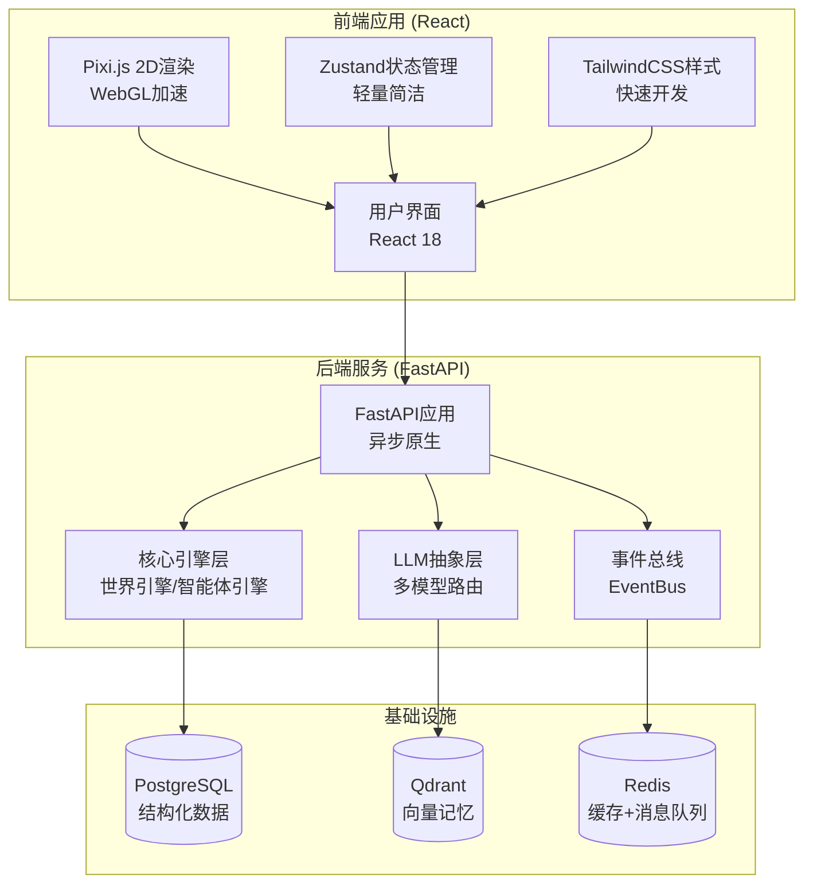
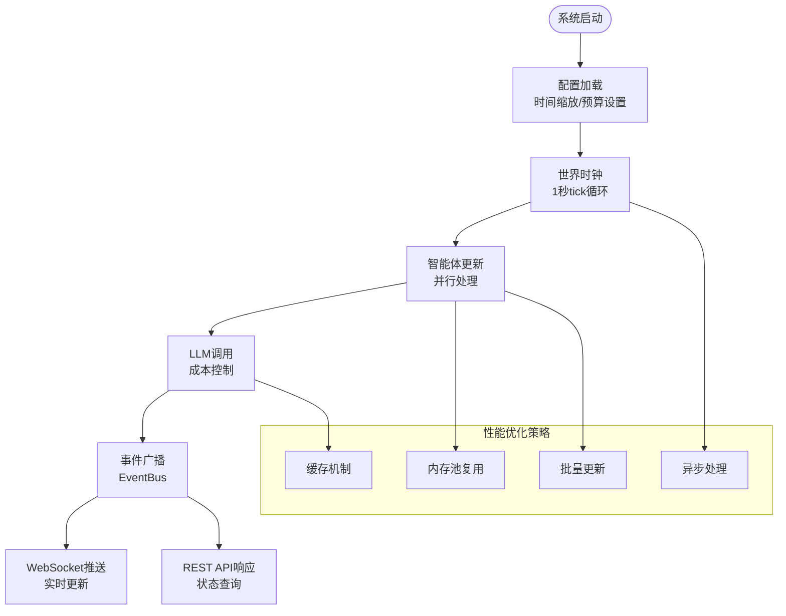
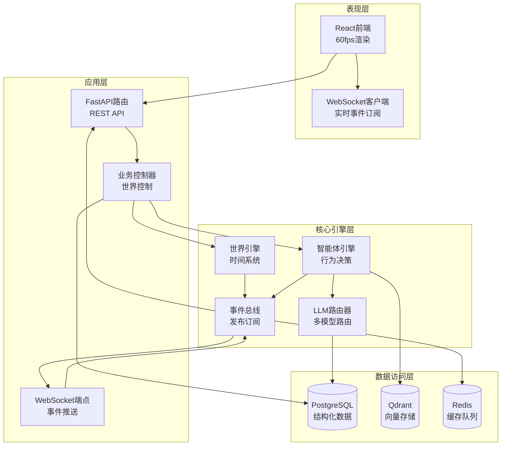
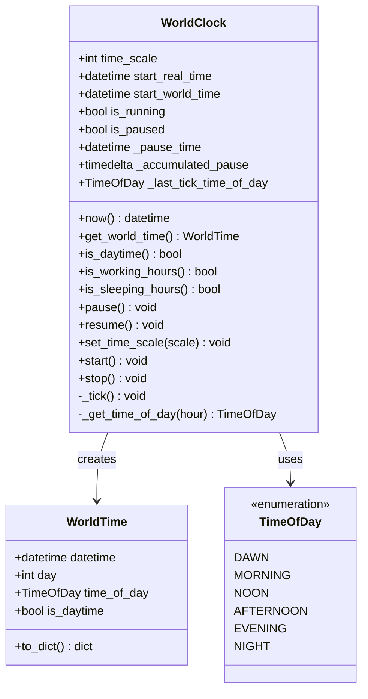
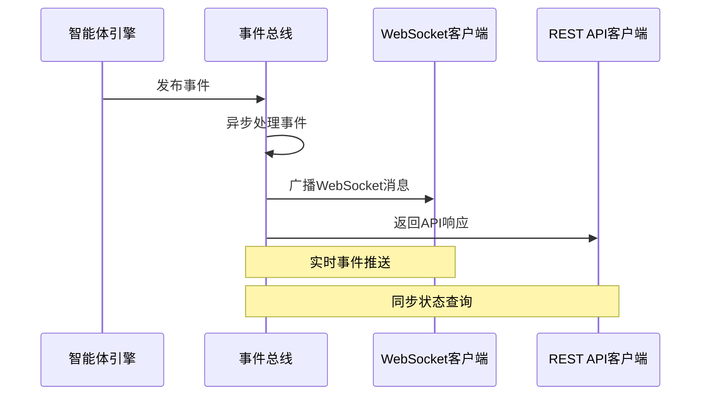
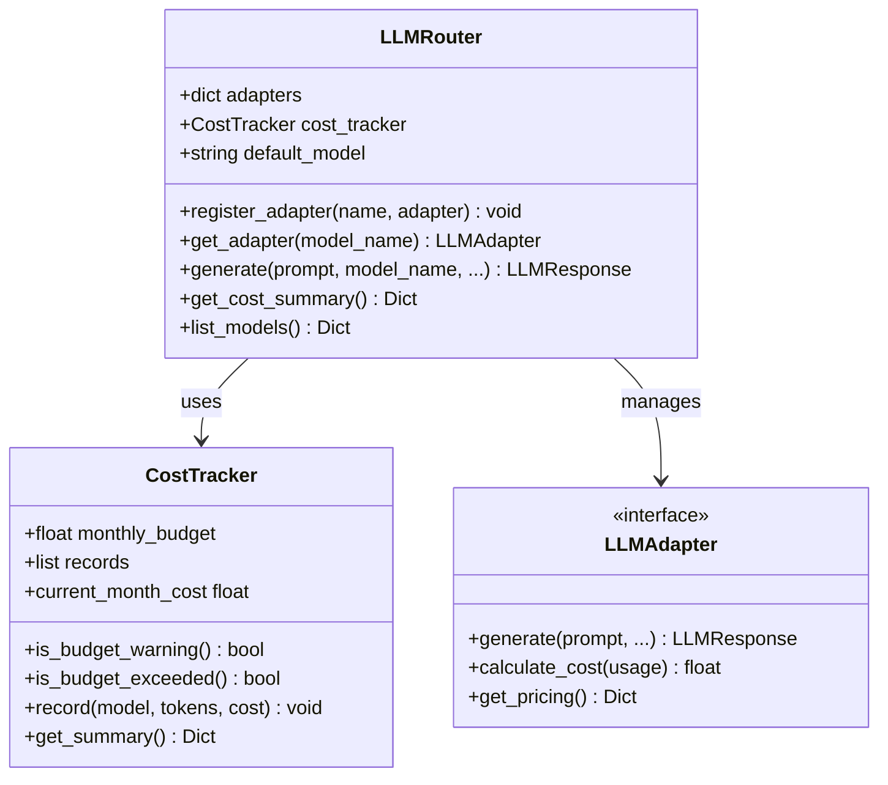
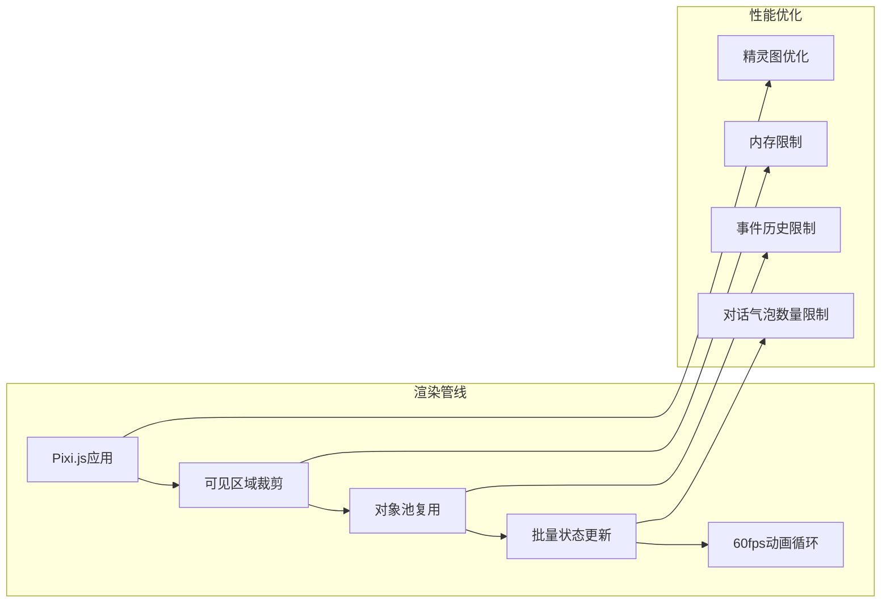
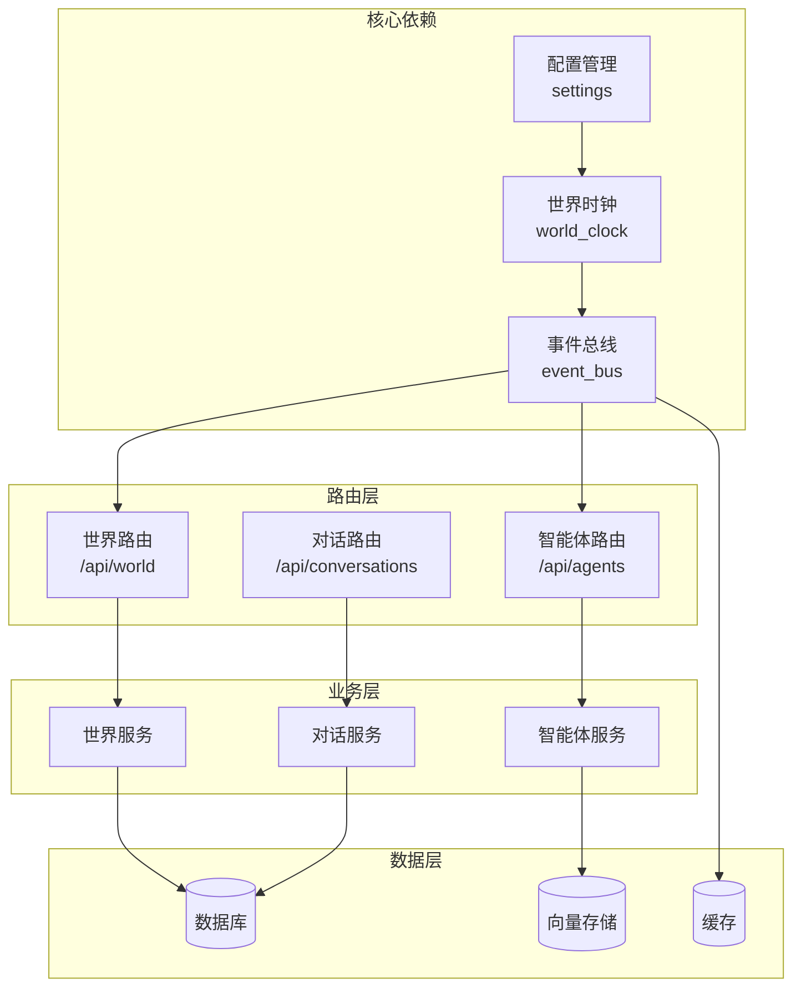
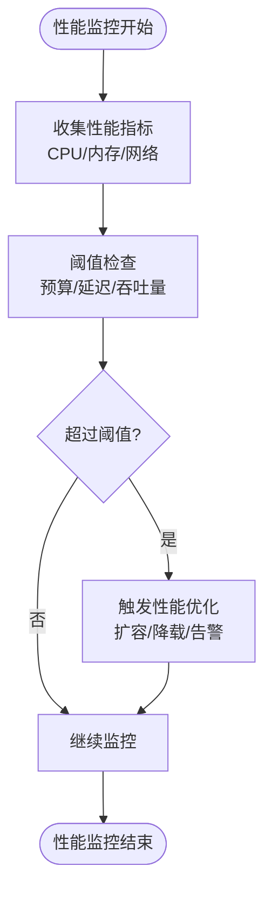

# 性能指标设计

<cite>
**本文档引用的文件**
- [specs/01-architecture.spec.md](file://specs/01-architecture.spec.md)
- [specs/06-api-design.spec.md](file://specs/06-api-design.spec.md)
- [specs/07-frontend.spec.md](file://specs/07-frontend.spec.md)
- [backend/app/core/config.py](file://backend/app/core/config.py)
- [backend/app/core/world.py](file://backend/app/core/world.py)
- [backend/app/core/events.py](file://backend/app/core/events.py)
- [backend/app/llm/router.py](file://backend/app/llm/router.py)
- [backend/app/main.py](file://backend/app/main.py)
- [backend/app/routes/world.py](file://backend/app/routes/world.py)
- [backend/app/routes/agents.py](file://backend/app/routes/agents.py)
</cite>

## 目录
1. [简介](#简介)
2. [项目结构](#项目结构)
3. [核心组件](#核心组件)
4. [架构概览](#架构概览)
5. [详细组件分析](#详细组件分析)
6. [依赖分析](#依赖分析)
7. [性能考虑](#性能考虑)
8. [故障排除指南](#故障排除指南)
9. [结论](#结论)
10. [附录](#附录)

## 简介

AI Society项目是一个开源的AI自治世界观察实验平台，旨在研究50+个智能体在虚拟社会中自由生活、交流、发展的涌现现象。该项目的核心目标是创建一个能够稳定运行并支持大规模智能体的高性能系统。

基于项目规格说明书中的性能指标目标，本文件详细分析了智能体数量目标、前端帧率要求、API响应时间和WebSocket延迟限制，并探讨了这些指标对系统架构设计的影响。

## 项目结构

AI Society项目采用分层架构设计，主要分为后端Python服务和前端React应用两大部分：

**图表来源**
- [specs/01-architecture.spec.md](file://specs/01-architecture.spec.md#L1-L57)
- [specs/07-frontend.spec.md](file://specs/07-frontend.spec.md#L12-L23)

**章节来源**
- [specs/01-architecture.spec.md](file://specs/01-architecture.spec.md#L1-L176)
- [specs/07-frontend.spec.md](file://specs/07-frontend.spec.md#L1-L650)

## 核心组件

### 性能指标目标

根据项目规格说明书，AI Society项目制定了以下关键性能指标：

| 指标类别 | 指标名称 | 目标值 | 说明 |
|---------|---------|--------|------|
| **智能体规模** | 智能体数量 | 50-200个 | 支持动态扩展的智能体数量范围 |
| **前端性能** | 前端帧率 | 60fps | 流畅的2D渲染体验 |
| **后端性能** | API响应时间 | <100ms | 快速的REST API响应 |
| **实时通信** | WebSocket延迟 | <50ms | 低延迟的事件推送 |
| **LLM调用** | 调用频率 | 每智能体每10分钟最多1次 | 控制大模型调用成本 |
| **资源限制** | 内存占用 | <2GB | 服务器资源限制 |

### 架构设计原则

项目采用"自治优先"的设计理念，所有智能体行为决策都由AI做出，不使用传统规则引擎。这种设计对性能提出了特殊要求：

**图表来源**
- [specs/01-architecture.spec.md](file://specs/01-architecture.spec.md#L180-L227)
- [specs/01-architecture.spec.md](file://specs/01-architecture.spec.md#L245-L255)

**章节来源**
- [specs/01-architecture.spec.md](file://specs/01-architecture.spec.md#L245-L255)

## 架构概览

### 系统架构设计

AI Society项目采用分层架构，确保各组件职责明确且易于扩展：

**图表来源**
- [specs/01-architecture.spec.md](file://specs/01-architecture.spec.md#L3-L57)
- [specs/01-architecture.spec.md](file://specs/01-architecture.spec.md#L100-L176)

### 性能相关配置

系统通过配置管理模块集中管理性能相关的配置参数：

**章节来源**
- [specs/01-architecture.spec.md](file://specs/01-architecture.spec.md#L59-L98)
- [backend/app/core/config.py](file://backend/app/core/config.py#L19-L175)

## 详细组件分析

### 世界时钟组件分析

世界时钟是整个系统的时间核心，直接影响着智能体行为的执行频率和系统的整体性能。

**图表来源**
- [backend/app/core/world.py](file://backend/app/core/world.py#L45-L292)

#### 性能特性分析

1. **时间缩放机制**: 通过`time_scale`参数实现现实时间与游戏时间的转换，支持1-100倍的时间缩放
2. **异步处理**: 使用`asyncio`实现非阻塞的时间推进，避免阻塞主线程
3. **精确控制**: 支持暂停、恢复和动态调整时间缩放，便于性能调试和监控

**章节来源**
- [backend/app/core/world.py](file://backend/app/core/world.py#L73-L292)

### 事件总线组件分析

事件总线实现了发布-订阅模式，是前后端通信的核心组件。

**图表来源**
- [backend/app/core/events.py](file://backend/app/core/events.py#L167-L230)

#### 性能优化策略

1. **异步事件处理**: 使用`asyncio.gather()`并行处理多个事件处理器
2. **连接管理**: 自动检测和清理断开的WebSocket连接
3. **历史记录**: 限制事件历史长度，避免内存泄漏

**章节来源**
- [backend/app/core/events.py](file://backend/app/core/events.py#L88-L269)

### LLM路由器组件分析

LLM路由器负责管理多个大语言模型适配器，实现统一的模型路由和成本控制。

**图表来源**
- [backend/app/llm/router.py](file://backend/app/llm/router.py#L89-L224)

#### 成本控制机制

1. **预算跟踪**: 实时计算当月LLM调用成本，支持预算预警
2. **频率限制**: 通过配置控制智能体决策频率，避免过度调用
3. **模型路由**: 支持多种LLM模型的动态切换和负载均衡

**章节来源**
- [backend/app/llm/router.py](file://backend/app/llm/router.py#L89-L224)

### 前端渲染组件分析

前端采用React + Pixi.js的组合，实现高性能的2D场景渲染。

**图表来源**
- [specs/07-frontend.spec.md](file://specs/07-frontend.spec.md#L485-L540)

#### 渲染优化策略

1. **可见区域渲染**: 只渲染视口范围内的智能体，减少绘制开销
2. **对象池复用**: 复用Pixi.js精灵对象，避免频繁创建销毁
3. **批量更新**: 使用`requestAnimationFrame`合并状态更新
4. **内存管理**: 限制事件历史和对话气泡数量，控制内存占用

**章节来源**
- [specs/07-frontend.spec.md](file://specs/07-frontend.spec.md#L485-L540)

## 依赖分析

### 组件间依赖关系

**图表来源**
- [backend/app/main.py](file://backend/app/main.py#L26-L58)
- [backend/app/routes/world.py](file://backend/app/routes/world.py#L1-L110)
- [backend/app/routes/agents.py](file://backend/app/routes/agents.py#L1-L175)

### 性能相关依赖

系统的关键性能依赖包括：

1. **异步处理**: 所有核心组件都支持异步操作，避免阻塞
2. **连接池**: 数据库和外部服务使用连接池管理
3. **缓存策略**: Redis作为多级缓存，减少数据库压力
4. **事件驱动**: 基于事件的解耦设计，提高系统响应性

**章节来源**
- [backend/app/main.py](file://backend/app/main.py#L26-L58)
- [specs/01-architecture.spec.md](file://specs/01-architecture.spec.md#L61-L71)

## 性能考虑

### 并发处理能力

系统通过多层次的并发设计确保高性能：

1. **异步世界时钟**: 每秒tick，非阻塞执行
2. **并行智能体处理**: 支持多个智能体同时决策
3. **异步事件处理**: 事件处理器并行执行
4. **WebSocket连接池**: 支持大量并发连接

### 内存使用控制

针对<2GB内存占用的目标，系统采用了多项优化措施：

1. **事件历史限制**: 事件历史最大1000条
2. **前端内存限制**: 事件历史限制在500条以内
3. **对象池复用**: Pixi.js精灵对象复用
4. **对话气泡限制**: 最多10个同时显示的对话气泡

### 网络通信优化

1. **WebSocket优化**: 事件压缩和批量推送
2. **API缓存**: 频繁查询结果缓存
3. **连接复用**: HTTP/1.1连接复用
4. **CDN加速**: 静态资源CDN分发

### 性能监控策略

**章节来源**
- [specs/06-api-design.spec.md](file://specs/06-api-design.spec.md#L648-L655)

## 故障排除指南

### 常见性能问题诊断

1. **内存泄漏排查**
   - 检查事件历史长度是否超过限制
   - 确认WebSocket连接是否正确清理
   - 验证对象池是否正常工作

2. **CPU使用率过高**
   - 检查智能体决策频率配置
   - 监控LLM调用频率和成本
   - 优化前端渲染逻辑

3. **WebSocket连接问题**
   - 检查连接池配置
   - 监控消息队列长度
   - 验证心跳机制

### 性能调优建议

1. **配置层面优化**
   - 调整`time_scale`参数平衡性能和体验
   - 优化`decision_interval_seconds`控制LLM调用频率
   - 设置合适的`max_agent_count`限制

2. **代码层面优化**
   - 使用`asyncio.gather()`并行处理
   - 实现更精细的对象池管理
   - 优化数据库查询和索引

3. **基础设施优化**
   - 使用负载均衡分散请求
   - 实施CDN加速静态资源
   - 配置适当的缓存策略

**章节来源**
- [backend/app/core/config.py](file://backend/app/core/config.py#L112-L146)
- [specs/06-api-design.spec.md](file://specs/06-api-design.spec.md#L619-L655)

## 结论

AI Society项目的性能指标设计体现了对大规模智能体系统性能的深入考量。通过合理的架构设计和多项性能优化策略，系统能够在保证功能完整性的同时达到预期的性能目标。

关键成功因素包括：
- 清晰的性能指标目标和约束条件
- 分层架构设计确保组件职责分离
- 异步处理和事件驱动提高系统响应性
- 多层次的性能监控和优化策略
- 前后端协同的性能优化方案

这些设计原则不仅满足了当前的性能要求，也为未来的扩展和优化奠定了坚实基础。

## 附录

### 性能基准测试方法

1. **智能体规模测试**: 从50个智能体开始，逐步增加到200个，监控系统性能变化
2. **负载测试**: 模拟高并发场景，测试系统的稳定性和响应时间
3. **内存监控**: 持续监控内存使用情况，确保不超过2GB限制
4. **网络测试**: 测试WebSocket连接的稳定性和延迟表现

### 容量规划原则

1. **线性扩展**: 智能体数量与资源消耗呈线性关系
2. **异步处理**: 通过异步化提高资源利用率
3. **缓存策略**: 合理使用缓存减少重复计算
4. **监控预警**: 建立完善的监控体系，提前发现性能问题