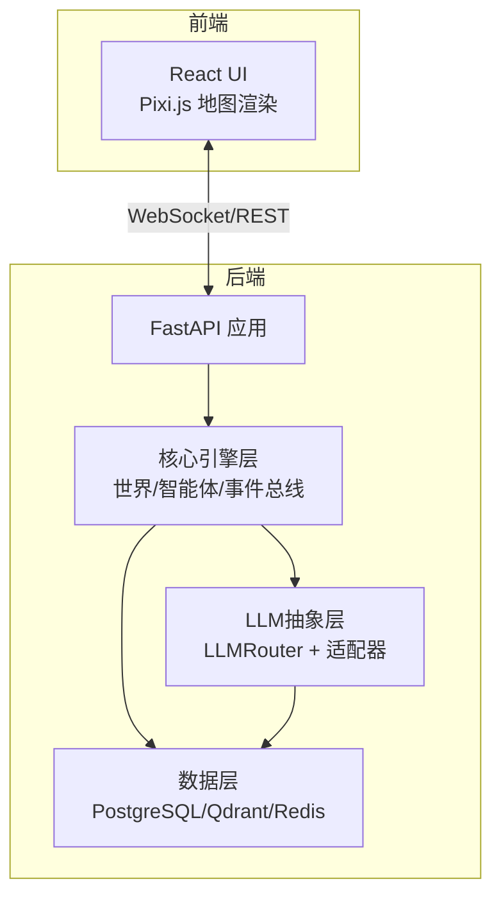
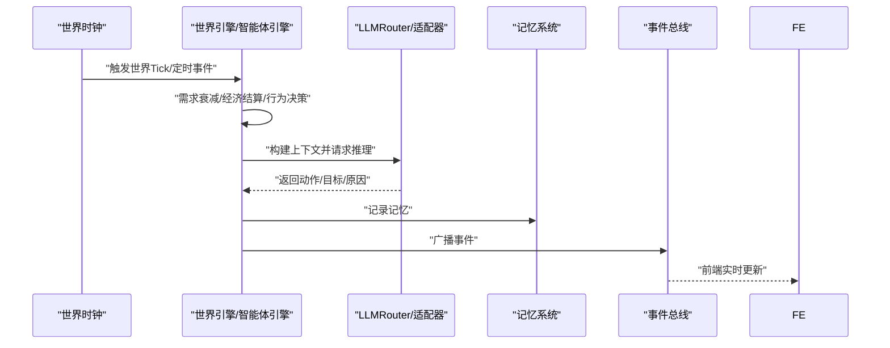
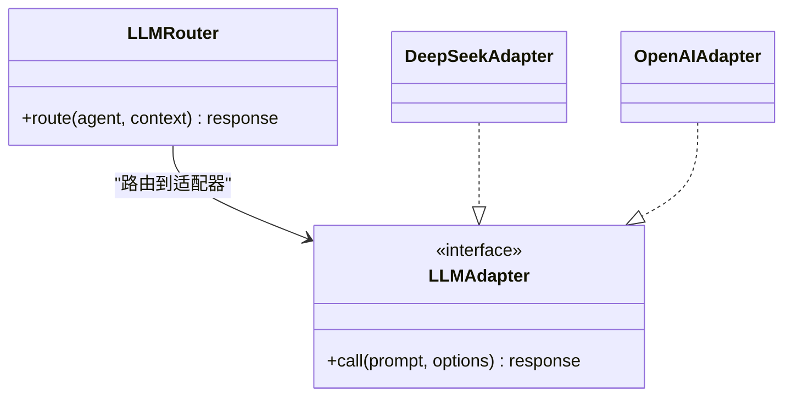
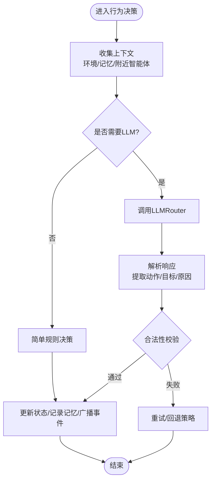
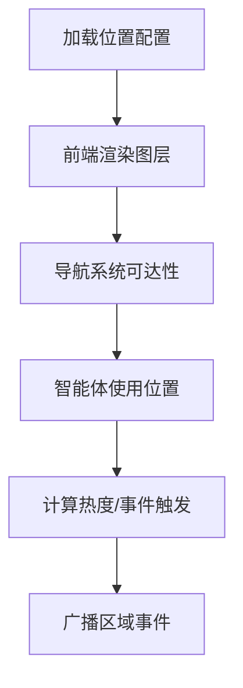
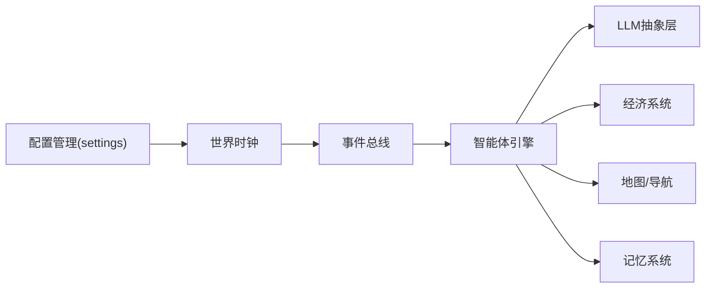

# 扩展性设计

<cite>
**本文引用的文件**
- [项目概览.spec.md](file://specs/00-project-overview.spec.md)
- [系统架构.spec.md](file://specs/01-architecture.spec.md)
- [经济系统.spec.md](file://specs/03-economy-system.spec.md)
- [世界与地图系统.spec.md](file://specs/05-world-map.spec.md)
- [agent.py](file://backend/app/core/agent.py)
- [world.py](file://backend/app/core/world.py)
- [config.py](file://backend/app/core/config.py)
</cite>

## 目录
1. [简介](#简介)
2. [项目结构](#项目结构)
3. [核心组件](#核心组件)
4. [架构总览](#架构总览)
5. [详细组件分析](#详细组件分析)
6. [依赖分析](#依赖分析)
7. [性能考量](#性能考量)
8. [故障排查指南](#故障排查指南)
9. [结论](#结论)
10. [附录](#附录)

## 简介
本文件面向希望在AI Society项目上进行扩展的开发者，系统化阐述插件化扩展的设计与实现要点，覆盖以下三大扩展方向：
- 新增LLM模型：基于适配器模式对接不同推理后端
- 新增智能体行为：通过扩展动作类型与提示词模板实现
- 新增地图区域：通过配置文件驱动前端渲染与行为约束

同时，文档给出扩展点识别方法、接口设计原则、向后兼容性保障策略，并提供最佳实践、性能优化建议与测试策略，帮助团队在保持系统稳定性的同时快速迭代。

## 项目结构
AI Society采用分层清晰的后端架构与前后端分离的前端架构。后端以FastAPI为核心，围绕“世界引擎、智能体引擎、事件总线”构建核心循环；LLM抽象层通过路由与适配器实现多模型接入；前端以React + Pixi.js渲染地图与交互界面。

图表来源
- [系统架构.spec.md](file://specs/01-architecture.spec.md#L1-L255)

章节来源
- [系统架构.spec.md](file://specs/01-architecture.spec.md#L1-L255)

## 核心组件
- 世界时钟与时间系统：负责时间推进、定时事件与昼夜节律，支撑经济结算与行为触发节奏。
- 智能体状态与决策：定义智能体属性、需求、经济状态与决策上下文，承载行为扩展入口。
- 配置管理：集中管理运行参数，支持环境变量覆盖，确保部署灵活性与可运维性。
- 经济系统：与现实对齐的收支模型，影响智能体行为与情绪。
- 地图与导航：区域配置驱动前端渲染，寻路算法支撑智能体移动。

章节来源
- [world.py](file://backend/app/core/world.py#L1-L292)
- [agent.py](file://backend/app/core/agent.py#L1-L92)
- [config.py](file://backend/app/core/config.py#L1-L175)
- [经济系统.spec.md](file://specs/03-economy-system.spec.md#L1-L418)
- [世界与地图系统.spec.md](file://specs/05-world-map.spec.md#L1-L577)

## 架构总览
下图展示了世界循环与LLM调用的关键流程，体现扩展点的插入位置与数据流向。

图表来源
- [系统架构.spec.md](file://specs/01-architecture.spec.md#L180-L227)

章节来源
- [系统架构.spec.md](file://specs/01-architecture.spec.md#L180-L227)

## 详细组件分析

### LLM适配器扩展（新增模型）
- 扩展点识别
  - 后端LLM抽象层位于backend/app/core/llm目录，包含路由与多个适配器文件。
  - 规格文档明确“新增LLM模型”的步骤：新增适配器文件、实现统一接口、在路由中注册。
- 接口设计原则
  - 统一的适配器接口：要求实现一致的输入输出契约，便于路由层解耦具体模型差异。
  - 路由层职责：根据智能体配置选择适配器，屏蔽模型细节。
- 向后兼容性
  - 默认模型与配置项可通过设置类集中管理，新增模型不影响现有调用方。
  - 通过配置文件或环境变量控制模型可用性，避免硬编码。
- 最佳实践
  - 为每个适配器封装错误处理与重试策略，避免单点失败影响全局。
  - 在适配器中实现成本控制与配额监控，配合月度预算限制。
  - 为不同模型设定调用频率上限，避免过度消耗。
- 性能考虑
  - 使用连接池与并发限流，避免高负载导致资源争用。
  - 对长文本与复杂提示词进行分块与缓存，减少重复计算。
- 测试策略
  - 单元测试：验证适配器的输入输出契约与错误分支。
  - 集成测试：模拟路由层调用，覆盖多模型切换与异常恢复。
  - 压力测试：评估并发调用下的延迟与吞吐。

图表来源
- [系统架构.spec.md](file://specs/01-architecture.spec.md#L229-L244)

章节来源
- [系统架构.spec.md](file://specs/01-architecture.spec.md#L229-L244)

### 智能体行为扩展（新增动作）
- 扩展点识别
  - 智能体状态与决策上下文定义在agent.py中，包含动作、目标、原因与思考等字段。
  - 规格文档指出“新增智能体行为”的步骤：在动作枚举中添加、在引擎中实现逻辑、更新提示词模板。
- 接口设计原则
  - 动作类型应具备可枚举性与可扩展性，避免魔法字符串污染。
  - 决策上下文需标准化，便于不同模型解析统一格式。
- 向后兼容性
  - 新增动作不应破坏既有动作的语义与序列化格式。
  - 通过版本化的提示词模板与渐进式启用策略，逐步推广新行为。
- 最佳实践
  - 将行为决策拆分为“简单规则”与“复杂推理”，降低LLM调用频率。
  - 为每个动作定义前置条件与后置效果，确保状态一致性。
  - 在事件总线中广播行为事件，便于前端与观测系统同步。
- 性能考虑
  - 控制LLM调用频次，结合需求衰减与时间片轮转。
  - 对高频动作采用缓存与批量处理，减少重复计算。
- 测试策略
  - 单元测试：验证动作前置条件与状态变更。
  - 回归测试：确保新增行为不影响既有行为链路。
  - A/B测试：通过配置开关对比新旧行为的效果差异。

图表来源
- [系统架构.spec.md](file://specs/01-architecture.spec.md#L205-L227)

章节来源
- [agent.py](file://backend/app/core/agent.py#L1-L92)
- [系统架构.spec.md](file://specs/01-architecture.spec.md#L229-L244)

### 地图区域扩展（新增位置）
- 扩展点识别
  - 地图区域配置位于data/locations.json，前端通过该配置自动渲染。
  - 规格文档明确“新增地图区域”的步骤：在配置中添加、前端自动渲染。
- 接口设计原则
  - 位置配置应包含类型、功能、容量、开放时间等关键字段，便于行为与导航模块使用。
  - 位置状态需支持实时占用与拥挤度计算，辅助智能体决策。
- 向后兼容性
  - 新增位置不影响既有位置的ID与功能，保持向前兼容。
  - 通过配置开关控制新区域的可见性与可用性。
- 最佳实践
  - 为新区域设定合理的容量与功能边界，避免过度拥挤。
  - 在导航系统中为新区域预留可达性与寻路权重。
  - 为新区域设计独特的事件与互动，增强沉浸感。
- 性能考虑
  - 位置状态的实时计算应尽量轻量化，避免高频更新带来的开销。
  - 热度计算与事件触发应按需更新，避免全量扫描。
- 测试策略
  - 单元测试：验证位置配置的解析与状态计算。
  - 集成测试：验证智能体在新区域的行为与事件触发。
  - 场景测试：模拟大量智能体涌入同一区域，评估系统稳定性。

图表来源
- [世界与地图系统.spec.md](file://specs/05-world-map.spec.md#L531-L577)

章节来源
- [世界与地图系统.spec.md](file://specs/05-world-map.spec.md#L1-L577)

## 依赖分析
- 世界时钟依赖事件总线发布定时事件，驱动经济结算与行为更新。
- 智能体引擎依赖LLM抽象层进行复杂决策，依赖记忆系统存储上下文。
- 配置管理贯穿各模块，提供统一的参数来源与覆盖机制。
- 经济系统与地图系统共同影响智能体行为与状态，形成闭环反馈。

图表来源
- [config.py](file://backend/app/core/config.py#L1-L175)
- [world.py](file://backend/app/core/world.py#L1-L292)
- [agent.py](file://backend/app/core/agent.py#L1-L92)

章节来源
- [config.py](file://backend/app/core/config.py#L1-L175)
- [world.py](file://backend/app/core/world.py#L1-L292)
- [agent.py](file://backend/app/core/agent.py#L1-L92)

## 性能考量
- 智能体并发：通过并行处理与批量化决策降低整体延迟。
- LLM调用控制：限制调用频率与并发数，结合缓存与分块处理。
- 时间系统：合理设置时间缩放与决策间隔，平衡真实感与性能。
- 数据访问：利用Redis缓存热点数据，Qdrant加速向量检索，PostgreSQL事务化写入。
- 前端渲染：使用Pixi.js的图层与对象池，减少DOM操作与重绘。

章节来源
- [系统架构.spec.md](file://specs/01-architecture.spec.md#L245-L255)
- [经济系统.spec.md](file://specs/03-economy-system.spec.md#L1-L418)
- [世界与地图系统.spec.md](file://specs/05-world-map.spec.md#L1-L577)

## 故障排查指南
- LLM调用失败
  - 检查适配器错误处理与重试策略，确认API密钥与URL配置正确。
  - 关注成本阈值与预算限制，避免因超支导致调用中断。
- 智能体行为异常
  - 校验动作前置条件与状态变更逻辑，确保事件总线广播正常。
  - 对比提示词模板版本，确认新旧行为的兼容性。
- 地图渲染问题
  - 核对位置配置的字段完整性与数值范围，检查前端图层渲染逻辑。
  - 关注导航可达性与寻路算法，确保路径生成稳定。
- 时间系统异常
  - 检查时钟暂停/恢复逻辑与时间缩放设置，确认事件总线订阅正常。

章节来源
- [config.py](file://backend/app/core/config.py#L1-L175)
- [world.py](file://backend/app/core/world.py#L1-L292)
- [agent.py](file://backend/app/core/agent.py#L1-L92)
- [系统架构.spec.md](file://specs/01-architecture.spec.md#L229-L244)

## 结论
AI Society的扩展性设计以“分层解耦、接口统一、配置驱动”为核心原则。通过LLM适配器模式、动作枚举扩展与地图配置化，系统在保持稳定性的前提下实现了高度可扩展性。遵循本文提供的扩展点识别、接口设计、兼容性与性能策略，可高效地引入新模型、新行为与新区域，持续丰富AI社会的生态与可观测性。

## 附录
- 术语
  - 适配器：封装特定LLM调用细节的模块，实现统一接口。
  - 路由器：根据智能体配置选择合适适配器的调度组件。
  - 事件总线：跨模块解耦的事件发布/订阅机制。
- 参考文档
  - 项目概览与核心理念
  - 系统架构与技术栈
  - 经济系统与现实对齐逻辑
  - 世界与地图系统与导航

章节来源
- [项目概览.spec.md](file://specs/00-project-overview.spec.md#L1-L46)
- [系统架构.spec.md](file://specs/01-architecture.spec.md#L1-L255)
- [经济系统.spec.md](file://specs/03-economy-system.spec.md#L1-L418)
- [世界与地图系统.spec.md](file://specs/05-world-map.spec.md#L1-L577)