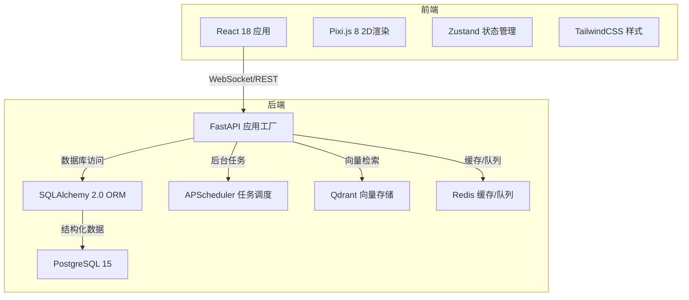
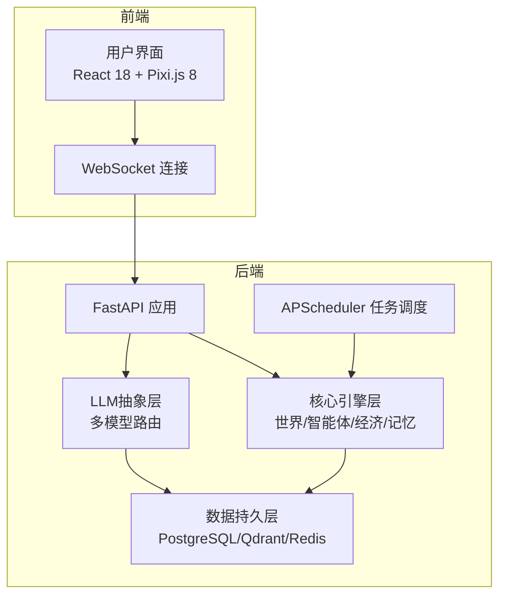
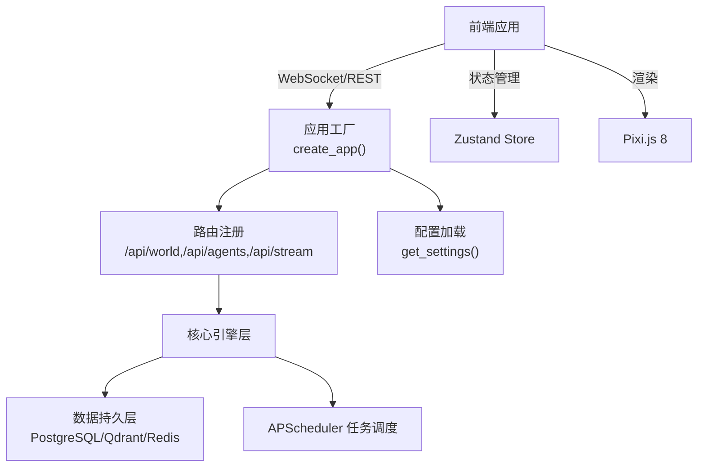

# 技术栈选型

<cite>
**本文档引用的文件**
- [backend/app/core/config.py](file://backend/app/core/config.py)
- [backend/app/__init__.py](file://backend/app/__init__.py)
- [specs/00-project-overview.spec.md](file://specs/00-project-overview.spec.md)
- [specs/01-architecture.spec.md](file://specs/01-architecture.spec.md)
- [specs/07-frontend.spec.md](file://specs/07-frontend.spec.md)
</cite>

## 目录
1. [引言](#引言)
2. [项目结构](#项目结构)
3. [核心组件](#核心组件)
4. [架构概览](#架构概览)
5. [详细组件分析](#详细组件分析)
6. [依赖关系分析](#依赖关系分析)
7. [性能考量](#性能考量)
8. [故障排除指南](#故障排除指南)
9. [结论](#结论)
10. [附录](#附录)

## 引言
本文件面向AI Society项目的技术栈选型进行系统化分析，围绕后端（FastAPI、SQLAlchemy、APScheduler、PostgreSQL、Qdrant、Redis）与前端（React 18、Pixi.js 8、Zustand、TailwindCSS）两大层面展开，结合项目需求、性能特征、生态优势与兼容性，给出选型理由与替代方案对比，并总结整体组合优势与未来演进方向。

## 项目结构
AI Society采用前后端分离架构，后端以Python为核心，前端以React为基础，配合容器化部署与实时通信机制，满足大规模智能体仿真与可视化展示的需求。

**图表来源**
- [specs/01-architecture.spec.md](file://specs/01-architecture.spec.md#L5-L57)
- [specs/07-frontend.spec.md](file://specs/07-frontend.spec.md#L12-L23)

**章节来源**
- [specs/01-architecture.spec.md](file://specs/01-architecture.spec.md#L92-L169)

## 核心组件
- 后端核心
  - FastAPI：异步原生、类型安全、高性能、自动生成接口文档，契合实时事件流与REST API双通道。
  - SQLAlchemy 2.0：提供异步ORM能力与类型友好接口，支撑复杂实体关系与事务一致性。
  - APScheduler：轻量级任务调度器，支持异步任务编排，满足世界循环与定时事件。
  - PostgreSQL 15：稳定可靠的结构化数据库，具备良好的JSON支持与扩展能力，适配复杂业务模型。
  - Qdrant：开源向量数据库，易于部署与扩展，满足智能体记忆检索与相似度匹配。
  - Redis：标准缓存与消息队列方案，保障高频读写与事件广播的低延迟。
- 前端核心
  - React 18：成熟生态、函数组件与Hooks体系，便于组件化与可维护性。
  - Pixi.js 8：基于WebGL的高性能2D渲染引擎，适合大规模精灵与流畅动画。
  - Zustand：轻量状态管理，降低耦合，提升开发效率。
  - TailwindCSS：实用优先的原子化样式工具，快速构建一致界面。

**章节来源**
- [specs/01-architecture.spec.md](file://specs/01-architecture.spec.md#L59-L82)
- [specs/07-frontend.spec.md](file://specs/07-frontend.spec.md#L12-L23)

## 架构概览
后端通过FastAPI提供REST与WebSocket接口，APScheduler驱动世界循环与定时事件；数据层采用PostgreSQL存储结构化数据，Qdrant承载向量记忆，Redis负责缓存与消息队列；前端以React+Pixi.js实现高帧率地图渲染与实时事件流展示。

**图表来源**
- [specs/01-architecture.spec.md](file://specs/01-architecture.spec.md#L3-L57)

## 详细组件分析

### 后端技术栈分析

#### FastAPI
- 性能与特性
  - 异步原生与类型安全，显著降低错误率并提升开发效率。
  - 自动生成OpenAPI/Swagger文档，便于前后端协作与接口治理。
  - 高并发场景下的低延迟请求处理，满足实时事件流与高QPS需求。
- 项目匹配度
  - 与WebSocket流和REST API并行，满足“实时观察”与“查询控制”的双重需求。
  - 与APScheduler结合，便于将世界循环与定时任务纳入统一接口体系。
- 替代方案对比
  - Django REST Framework：功能完备但异步支持较弱，开发体验与性能不及FastAPI。
  - Tornado：异步能力强但生态相对较小，文档与工具链不如FastAPI完善。
- 版本与兼容性
  - 建议使用Python 3.10+，与asyncio与typing生态兼容良好。
  - 与Pydantic v2配合，确保配置与请求体的类型安全。

**章节来源**
- [specs/01-architecture.spec.md](file://specs/01-architecture.spec.md#L64-L64)
- [backend/app/__init__.py](file://backend/app/__init__.py#L7-L22)

#### SQLAlchemy 2.0
- 性能与特性
  - 异步ORM支持，减少阻塞，提升I/O密集型场景吞吐。
  - 类型友好与声明式映射，降低模型变更成本。
  - 丰富的方言与扩展，适配PostgreSQL的高级特性（如JSON/数组/范围类型）。
- 项目匹配度
  - 支撑智能体、事件、对话、关系等复杂实体关系，满足经济系统与社交网络的数据建模。
  - 与Alembic迁移工具配合，保障数据库演进的可控性。
- 替代方案对比
  - Peewee：轻量但功能有限，不适合复杂关系与迁移管理。
  - Tortoise ORM：异步友好，但生态与成熟度不及SQLAlchemy。
- 版本与兼容性
  - 建议使用SQLAlchemy 2.0+，与asyncio与aiohttp生态兼容。

**章节来源**
- [specs/01-architecture.spec.md](file://specs/01-architecture.spec.md#L66-L66)

#### APScheduler
- 性能与特性
  - 轻量、易集成，支持多种触发器与作业存储。
  - 异步任务支持良好，可与FastAPI生命周期无缝衔接。
- 项目匹配度
  - 世界循环（每游戏内10分钟推进一次）与定时事件（日出/日落/发工资）的理想选择。
  - 与事件总线结合，形成“计划-执行-广播”的闭环。
- 替代方案对比
  - Celery：功能强大但部署与运维复杂，对本项目过于重。
  - 纯Python线程/进程：缺乏调度与持久化，可靠性不足。
- 版本与兼容性
  - 建议使用APScheduler 3.10+，与asyncio兼容良好。

**章节来源**
- [specs/01-architecture.spec.md](file://specs/01-architecture.spec.md#L65-L65)

#### PostgreSQL 15
- 性能与特性
  - 稳定可靠、扩展性强，支持JSON/JSONB、全文检索、分区表等高级特性。
  - 事务一致性与ACID保证，适合经济系统与关系数据的准确性。
- 项目匹配度
  - 存储智能体元数据、对话记录、事件日志与关系矩阵，满足高并发读写与复杂查询。
- 替代方案对比
  - MySQL：功能接近但扩展性与JSON支持略逊一筹。
  - MongoDB：文档模型灵活但事务与一致性不如PostgreSQL。
- 版本与兼容性
  - 建议使用PostgreSQL 15+，与SQLAlchemy异步驱动兼容。

**章节来源**
- [specs/01-architecture.spec.md](file://specs/01-architecture.spec.md#L67-L67)

#### Qdrant
- 性能与特性
  - 开源免费、性能优异、易于部署与扩展，支持向量检索与过滤。
  - 与嵌入模型结合，满足智能体记忆检索与相似度匹配。
- 项目匹配度
  - 记忆系统与对话上下文检索的关键组件，支撑智能体的长期记忆与决策。
- 替代方案对比
  - Weaviate/Pinecone：商业方案功能强大但成本较高，Qdrant更贴合开源预算。
- 版本与兼容性
  - 建议使用Qdrant 1.0+，与HTTP/GRPC接口兼容。

**章节来源**
- [specs/01-architecture.spec.md](file://specs/01-architecture.spec.md#L68-L68)

#### Redis
- 性能与特性
  - 标准化缓存与消息队列方案，支持高吞吐与低延迟。
  - 适合热点数据缓存、会话存储与事件广播。
- 项目匹配度
  - 缓存智能体状态、对话会话、限流策略与事件总线中间件。
- 替代方案对比
  - Memcached：缓存能力较弱，不支持发布订阅。
  - RabbitMQ/NSQ：消息队列能力更强但部署复杂度更高。
- 版本与兼容性
  - 建议使用Redis 6+，与asyncio客户端兼容。

**章节来源**
- [specs/01-architecture.spec.md](file://specs/01-architecture.spec.md#L69-L69)

### 前端技术栈分析

#### React 18
- 性能与特性
  - 并发特性与自动批处理，显著提升渲染性能与用户体验。
  - 函数组件与Hooks体系，降低心智负担，便于组件化与可维护性。
- 项目匹配度
  - 与Pixi.js协同，实现高帧率地图渲染与实时事件流展示。
- 替代方案对比
  - Vue 3：生态活跃但与WebGL渲染的集成度不及React。
  - Svelte：编译期优化强但生态与团队经验不如React。
- 版本与兼容性
  - 建议使用React 18+，与TypeScript 5+兼容。

**章节来源**
- [specs/07-frontend.spec.md](file://specs/07-frontend.spec.md#L15-L15)

#### Pixi.js 8
- 性能与特性
  - 基于WebGL的高性能2D渲染引擎，适合大规模精灵与流畅动画。
  - 分层渲染（背景/建筑/智能体/效果/UI）与对象池优化，满足高帧率需求。
- 项目匹配度
  - 世界地图（2000x2000）、智能体移动轨迹、对话气泡等视觉效果的理想选择。
- 替代方案对比
  - Three.js：面向3D场景，2D性能与复杂度不如Pixi.js。
  - Canvas 2D：性能有限，难以支撑大规模精灵与高频动画。
- 版本与兼容性
  - 建议使用Pixi.js 8+，与现代浏览器WebGL兼容。

**章节来源**
- [specs/07-frontend.spec.md](file://specs/07-frontend.spec.md#L17-L17)

#### Zustand
- 性能与特性
  - 轻量简洁、低耦合，支持原子化状态与中间件扩展。
  - 与React Hooks自然融合，避免样板代码与全局状态混乱。
- 项目匹配度
  - 世界时间、智能体集合、事件流、对话会话等状态的集中管理。
- 替代方案对比
  - Redux Toolkit：功能全面但复杂度较高，本项目无需如此重量级方案。
  - Jotai：原子化思路相近但生态与文档不如Zustand成熟。
- 版本与兼容性
  - 建议使用Zustand 4+，与React 18+兼容。

**章节来源**
- [specs/07-frontend.spec.md](file://specs/07-frontend.spec.md#L18-L18)

#### TailwindCSS
- 性能与特性
  - 原子化类名与实用优先的设计理念，快速构建一致界面。
  - 与TypeScript/Vite集成良好，提升开发效率。
- 项目匹配度
  - 顶部导航、侧边面板、统计图表等UI组件的一致风格与快速迭代。
- 替代方案对比
  - Sass/Less：需要手写样式规则，开发效率较低。
  - Ant Design/Element Plus：组件丰富但定制性与体积不如TailwindCSS。
- 版本与兼容性
  - 建议使用TailwindCSS 3+，与Vite 5+兼容。

**章节来源**
- [specs/07-frontend.spec.md](file://specs/07-frontend.spec.md#L19-L19)

### 技术栈组合优势与演进方向
- 组合优势
  - 后端：FastAPI+SQLAlchemy+APScheduler+PostgreSQL+Qdrant+Redis构成“高性能+可扩展+易维护”的技术基座，既能支撑世界循环与实时事件，又能满足复杂数据模型与向量检索需求。
  - 前端：React 18+Pixi.js 8+Zustand+TailwindCSS形成“高帧率+低耦合+快速迭代”的前端体系，满足大规模精灵渲染与实时观察体验。
  - 兼容性：Python 3.10+/Node.js LTS、PostgreSQL 15+/Redis 6+、现代浏览器与Vite 5+，确保生态成熟与长期维护。
- 未来演进方向
  - 后端：引入数据库连接池与分库分表策略，扩展至多实例部署；在LLM路由层增加负载均衡与熔断降级；探索向量索引优化与冷热数据分层。
  - 前端：引入Web Workers与GPU加速，进一步提升大规模精灵渲染性能；增强事件流的过滤与回放能力；探索WebAssembly优化计算密集型逻辑。

**章节来源**
- [specs/01-architecture.spec.md](file://specs/01-architecture.spec.md#L222-L248)
- [specs/07-frontend.spec.md](file://specs/07-frontend.spec.md#L485-L539)

## 依赖关系分析
后端应用通过应用工厂创建FastAPI实例，注册路由并接入配置；核心引擎层依赖数据持久层与任务调度；前端通过WebSocket与REST API与后端交互，使用Zustand管理状态，Pixi.js进行渲染。

**图表来源**
- [backend/app/__init__.py](file://backend/app/__init__.py#L7-L22)
- [backend/app/core/config.py](file://backend/app/core/config.py#L39-L42)

**章节来源**
- [backend/app/__init__.py](file://backend/app/__init__.py#L1-L22)
- [backend/app/core/config.py](file://backend/app/core/config.py#L1-L42)

## 性能考量
- 后端性能目标
  - 智能体数量：50-200，建议通过连接池与批量操作降低数据库压力。
  - API响应时间：<100ms，WebSocket延迟：<50ms，需优化序列化与中间件。
  - LLM调用频率：每智能体每10分钟最多1次，建议引入缓存与限流。
- 前端性能目标
  - 帧率：60fps，建议采用可见区域裁剪、对象池与批量更新。
  - 内存占用：<2GB，建议限制事件历史与对话气泡数量，启用垃圾回收策略。
- 数据库与缓存
  - PostgreSQL：合理索引与分区，避免N+1查询；Redis：热点数据缓存与消息队列解耦。

**章节来源**
- [specs/01-architecture.spec.md](file://specs/01-architecture.spec.md#L238-L248)
- [specs/07-frontend.spec.md](file://specs/07-frontend.spec.md#L485-L539)

## 故障排除指南
- 配置问题
  - 确认环境变量（数据库URL、Redis URL、向量库地址、LLM密钥）正确加载，避免运行时异常。
- 数据库连接
  - 检查PostgreSQL连接参数与权限，确保异步驱动可用；关注连接池上限与慢查询。
- 向量检索
  - 确认Qdrant服务可达且索引已建立；对高并发查询进行限流与缓存。
- 缓存与队列
  - Redis键空间过期策略与内存淘汰机制需合理配置，避免雪崩。
- WebSocket与事件流
  - 检查事件总线与广播通道，确保前端订阅成功与消息格式一致。
- 前端渲染
  - Pixi.js图层顺序与对象池复用是否正确；Zustand状态更新是否批量合并。

**章节来源**
- [backend/app/core/config.py](file://backend/app/core/config.py#L15-L39)
- [specs/01-architecture.spec.md](file://specs/01-architecture.spec.md#L171-L221)
- [specs/07-frontend.spec.md](file://specs/07-frontend.spec.md#L360-L407)

## 结论
AI Society的技术栈选型以“高性能、可扩展、易维护”为目标，后端以FastAPI为核心，结合SQLAlchemy、APScheduler与PostgreSQL/Qdrant/Redis，满足世界循环、实时事件与复杂数据模型；前端以React 18+Pixi.js 8+Zustand+TailwindCSS实现高帧率渲染与实时观察体验。该组合在当前阶段具备良好的生态成熟度与项目匹配度，未来可在分布式与向量化检索方面持续演进。

## 附录
- 项目定位与核心理念
  - 项目旨在打造一个开源的AI自治世界观察实验平台，强调“纯观察、自治优先、真实对齐、开源开放”，技术选型服务于这一理念。
- 技术约束与开源信息
  - 基于成熟软件技术实现，优先稳定性和可扩展性；代码低耦合、中文注释；云服务器部署；开源协议遵循OpenRAIL。

**章节来源**
- [specs/00-project-overview.spec.md](file://specs/00-project-overview.spec.md#L6-L46)