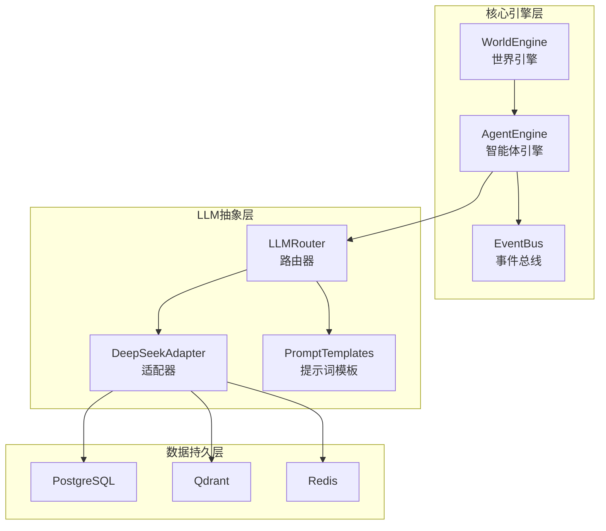
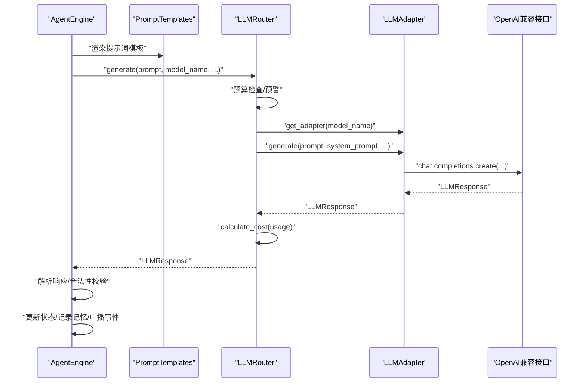
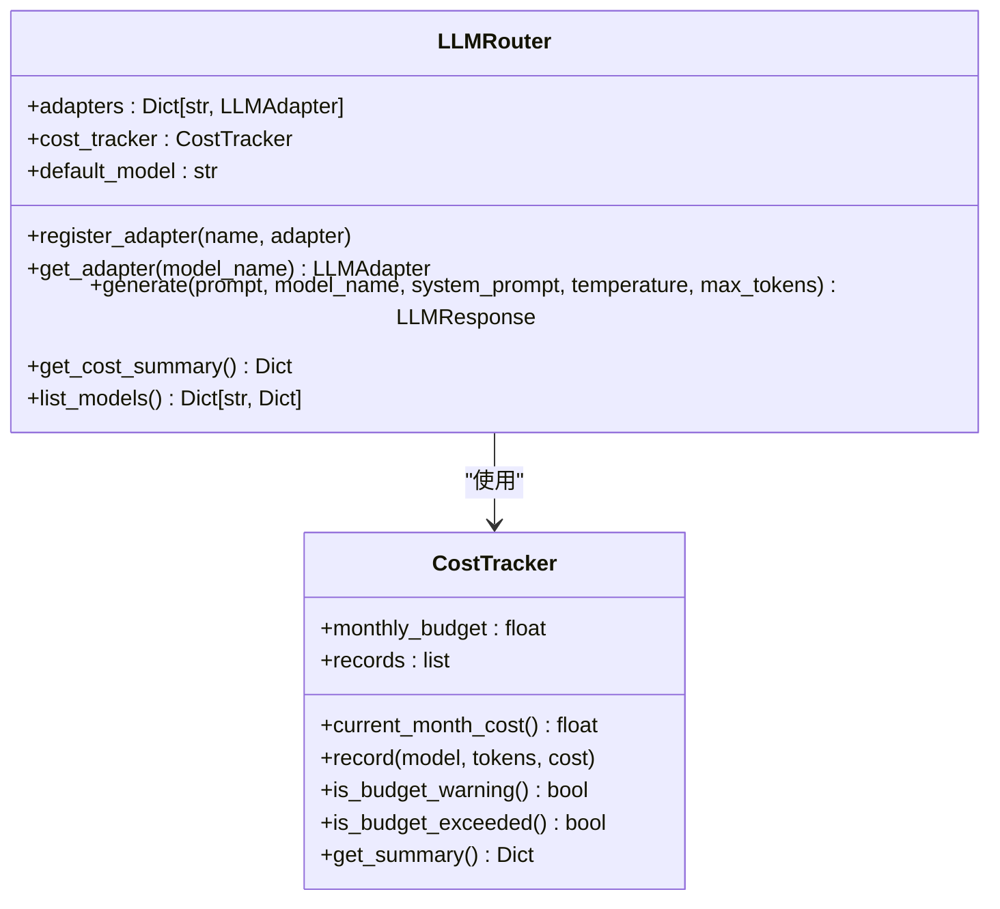
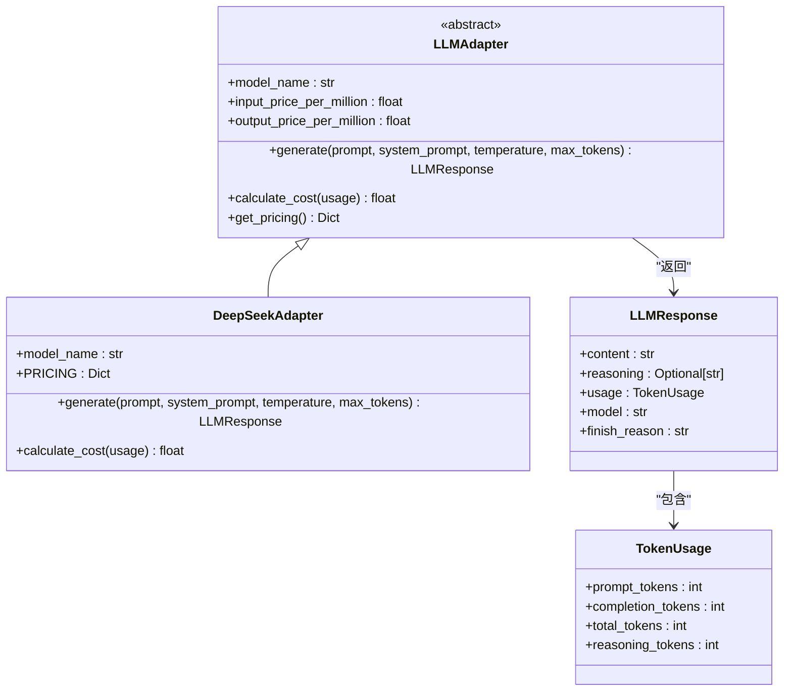
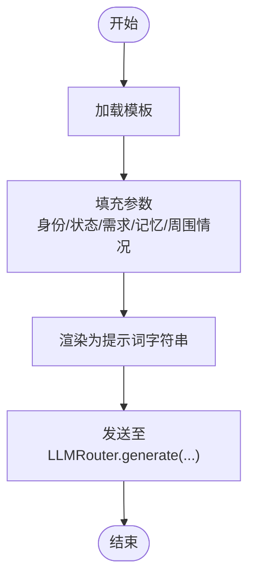
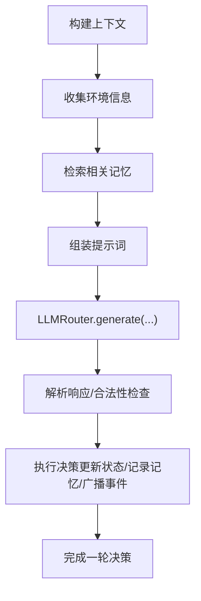
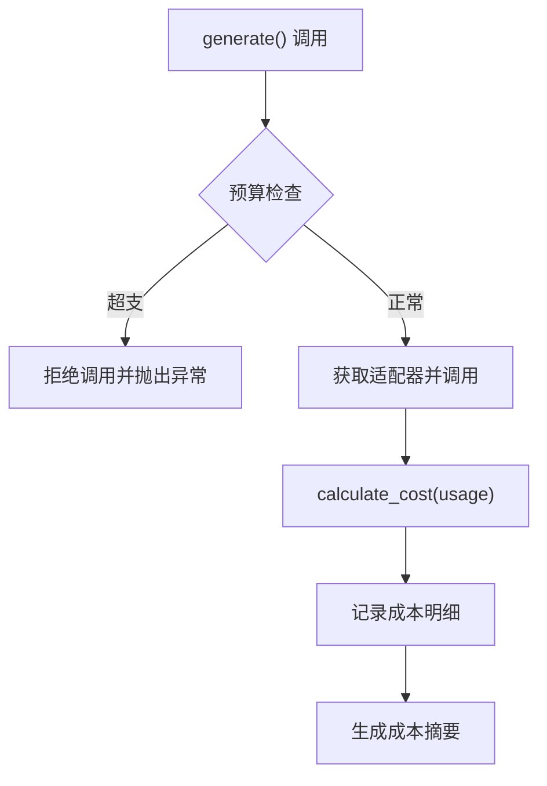
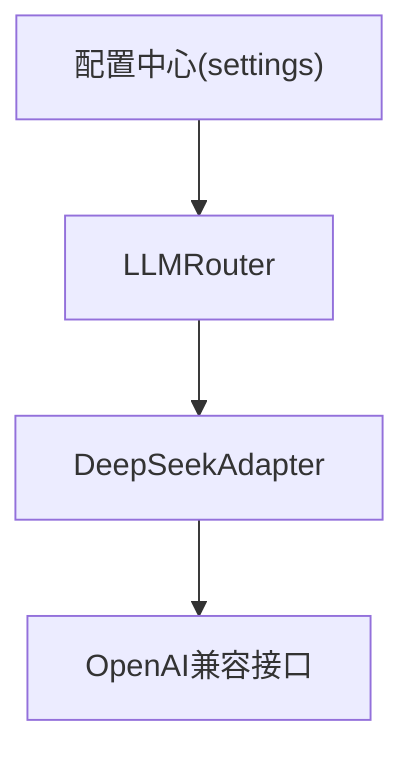

# LLM调用流程

<cite>
**本文引用的文件**
- [backend/app/llm/router.py](file://backend/app/llm/router.py)
- [backend/app/llm/adapters/base.py](file://backend/app/llm/adapters/base.py)
- [backend/app/llm/adapters/deepseek.py](file://backend/app/llm/adapters/deepseek.py)
- [backend/app/llm/prompts.py](file://backend/app/llm/prompts.py)
- [backend/app/core/agent.py](file://backend/app/core/agent.py)
- [backend/app/core/config.py](file://backend/app/core/config.py)
- [backend/app/core/world.py](file://backend/app/core/world.py)
- [backend/app/main.py](file://backend/app/main.py)
- [specs/01-architecture.spec.md](file://specs/01-architecture.spec.md)
- [specs/00-project-overview.spec.md](file://specs/00-project-overview.spec.md)
</cite>

## 目录
1. [简介](#简介)
2. [项目结构](#项目结构)
3. [核心组件](#核心组件)
4. [架构总览](#架构总览)
5. [详细组件分析](#详细组件分析)
6. [依赖分析](#依赖分析)
7. [性能考量](#性能考量)
8. [故障排查指南](#故障排查指南)
9. [结论](#结论)
10. [附录](#附录)

## 简介
本文件围绕“智能体决策时的完整LLM调用链路”展开，系统化梳理从AgentEngine上下文构建、LLMRouter模型路由、响应解析验证，到决策执行反馈的全流程。同时解释上下文管理策略、提示词工程最佳实践、成本控制机制，并给出调用示例、错误处理策略与性能优化建议。

## 项目结构
后端采用分层架构：核心引擎层（世界引擎、智能体引擎、事件总线、经济引擎、记忆引擎）、LLM抽象层（路由器与适配器）、数据持久层（PostgreSQL、Qdrant、Redis）。LLM调用位于核心引擎层之上、数据持久层之下，形成稳定的抽象边界。

图表来源
- [specs/01-architecture.spec.md](file://specs/01-architecture.spec.md#L38-L56)
- [specs/01-architecture.spec.md](file://specs/01-architecture.spec.md#L114-L118)
- [backend/app/llm/router.py](file://backend/app/llm/router.py#L89-L113)
- [backend/app/llm/adapters/deepseek.py](file://backend/app/llm/adapters/deepseek.py#L24-L64)

章节来源
- [specs/01-architecture.spec.md](file://specs/01-architecture.spec.md#L1-L255)
- [backend/app/main.py](file://backend/app/main.py#L60-L97)

## 核心组件
- LLMRouter：统一路由与成本控制，负责根据模型名选择适配器、调用生成接口、记录成本并进行预算预警/超支拦截。
- LLMAdapter（以DeepSeek为例）：封装具体模型的API调用细节，统一响应结构与成本计算。
- PromptTemplates：集中管理提示词模板，支持参数化渲染，确保提示词工程的一致性与可维护性。
- AgentEngine（概念性说明）：负责上下文构建（环境信息、记忆检索、提示词组装）、决策解析与执行反馈（状态更新、记忆记录、事件广播）。
- 配置与成本：通过配置中心统一管理默认模型、预算阈值、时间缩放等；成本追踪器按月汇总与预警。

章节来源
- [backend/app/llm/router.py](file://backend/app/llm/router.py#L89-L220)
- [backend/app/llm/adapters/base.py](file://backend/app/llm/adapters/base.py#L58-L118)
- [backend/app/llm/adapters/deepseek.py](file://backend/app/llm/adapters/deepseek.py#L24-L160)
- [backend/app/llm/prompts.py](file://backend/app/llm/prompts.py#L17-L213)
- [backend/app/core/config.py](file://backend/app/core/config.py#L19-L175)

## 架构总览
下图展示LLM调用在系统中的位置与交互关系，强调“上下文构建—路由—生成—解析—执行”的闭环。

图表来源
- [specs/01-architecture.spec.md](file://specs/01-architecture.spec.md#L205-L227)
- [backend/app/llm/router.py](file://backend/app/llm/router.py#L159-L208)
- [backend/app/llm/adapters/deepseek.py](file://backend/app/llm/adapters/deepseek.py#L66-L139)
- [backend/app/llm/prompts.py](file://backend/app/llm/prompts.py#L190-L206)

## 详细组件分析

### LLMRouter：模型路由与成本控制
- 职责
  - 统一生成接口，屏蔽底层模型差异。
  - 注册默认适配器（如DeepSeek R1与Chat），支持按需扩展。
  - 预算控制：按月汇总调用成本，超过阈值进行预警，超支时拒绝调用。
  - 成本记录：记录每次调用的token用量与费用，保留近30天明细。
- 关键流程
  - 生成调用：检查预算→获取适配器→调用→计算成本并记录→返回响应。
  - 成本摘要：提供预算、剩余、使用百分比与预警状态。
- 错误处理
  - 预算超支：抛出异常，阻止继续调用。
  - 未知模型：抛出异常，提示可用模型列表。
- 性能建议
  - 合理设置max_tokens，避免过长输出导致成本上升。
  - 控制温度与最大输出，平衡创造性与稳定性。

图表来源
- [backend/app/llm/router.py](file://backend/app/llm/router.py#L89-L220)

章节来源
- [backend/app/llm/router.py](file://backend/app/llm/router.py#L89-L220)

### LLMAdapter（DeepSeek）：统一接口与成本计算
- 职责
  - 通过OpenAI兼容接口调用DeepSeek模型。
  - 统一响应结构（内容、推理内容、token用量、结束原因）。
  - 按模型定价计算成本，R1模型推理token按输出价格计费。
- 关键流程
  - 构造消息列表（可选system_prompt）→调用API→提取内容与token→封装响应→返回。
- 错误处理
  - 捕获并记录异常，向上抛出，由上层统一处理。
- 性能建议
  - R1模型适合复杂推理，但成本更高；Chat模型适合日常对话与低成本场景。

图表来源
- [backend/app/llm/adapters/base.py](file://backend/app/llm/adapters/base.py#L58-L118)
- [backend/app/llm/adapters/deepseek.py](file://backend/app/llm/adapters/deepseek.py#L24-L160)

章节来源
- [backend/app/llm/adapters/base.py](file://backend/app/llm/adapters/base.py#L58-L118)
- [backend/app/llm/adapters/deepseek.py](file://backend/app/llm/adapters/deepseek.py#L24-L160)

### 提示词模板（PromptTemplates）：上下文组装与输出规范
- 设计原则
  - 明确角色与任务；输出格式要求（通常JSON）；提供充分上下文；支持动态参数替换。
- 关键模板
  - AGENT_DECISION：面向智能体决策的完整上下文（身份、状态、需求、记忆、周围情况、可选行动）。
  - CONVERSATION_START/CONVERSATION_REPLY：对话发起与回复的自然语言模板。
  - ANALYZE_CONVERSATION：对话分析，提取话题、情绪、关系变化等。
  - GENERATE_AGENT：生成新智能体的JSON输出模板。
- 使用方式
  - 通过类方法或便捷函数渲染模板，传入动态参数（如姓名、年龄、职业、当前时间、地点、记忆、需求等）。

图表来源
- [backend/app/llm/prompts.py](file://backend/app/llm/prompts.py#L17-L213)

章节来源
- [backend/app/llm/prompts.py](file://backend/app/llm/prompts.py#L17-L213)

### AgentEngine（概念性说明）：上下文构建与决策闭环
- 上下文构建
  - 环境信息：世界时间、昼夜、工作时间、地点名称等。
  - 记忆检索：基于向量相似度检索近期记忆片段。
  - 提示词组装：结合AgentState、环境与记忆，渲染决策模板。
- 响应解析验证
  - 从LLM响应中提取动作、目标、思考与原因。
  - 合法性检查：动作类型、目标有效性、与当前状态/地点匹配性。
- 决策执行反馈
  - 更新AgentState（位置、需求、情绪、当前行动、思考）。
  - 记录到记忆系统（持久化）。
  - 广播事件（WebSocket/事件总线）给前端与其它引擎。

图表来源
- [specs/01-architecture.spec.md](file://specs/01-architecture.spec.md#L205-L227)
- [backend/app/core/agent.py](file://backend/app/core/agent.py#L87-L92)

章节来源
- [specs/01-architecture.spec.md](file://specs/01-architecture.spec.md#L205-L227)
- [backend/app/core/agent.py](file://backend/app/core/agent.py#L87-L92)

### 成本控制机制：预算、预警与记录
- 预算与阈值
  - 月度预算与预警阈值来自配置中心。
  - 路由器在每次生成前检查预算，超支时拒绝调用。
- 成本记录
  - 记录每次调用的token用量与费用，保留近30天明细。
  - 提供成本摘要：预算、已用、剩余、使用百分比与预警状态。
- 模型定价
  - 不同模型定价不同，R1推理模型成本更高，推理token按输出价格计费。

图表来源
- [backend/app/llm/router.py](file://backend/app/llm/router.py#L183-L208)
- [backend/app/llm/adapters/deepseek.py](file://backend/app/llm/adapters/deepseek.py#L141-L160)
- [backend/app/core/config.py](file://backend/app/core/config.py#L69-L80)

章节来源
- [backend/app/llm/router.py](file://backend/app/llm/router.py#L34-L86)
- [backend/app/llm/adapters/deepseek.py](file://backend/app/llm/adapters/deepseek.py#L141-L160)
- [backend/app/core/config.py](file://backend/app/core/config.py#L69-L80)

## 依赖分析
- 组件耦合
  - LLMRouter依赖配置中心（默认模型、预算阈值）与适配器接口。
  - DeepSeekAdapter依赖配置中心（API密钥、基础URL）与OpenAI兼容客户端。
  - PromptTemplates独立于LLM层，仅依赖参数渲染。
- 外部依赖
  - OpenAI兼容接口（DeepSeek）。
  - 配置中心（环境变量/默认值）。
- 循环依赖
  - 未发现循环依赖迹象，模块职责清晰。

图表来源
- [backend/app/llm/router.py](file://backend/app/llm/router.py#L19-L113)
- [backend/app/llm/adapters/deepseek.py](file://backend/app/llm/adapters/deepseek.py#L58-L64)
- [backend/app/core/config.py](file://backend/app/core/config.py#L53-L64)

章节来源
- [backend/app/llm/router.py](file://backend/app/llm/router.py#L19-L113)
- [backend/app/llm/adapters/deepseek.py](file://backend/app/llm/adapters/deepseek.py#L58-L64)
- [backend/app/core/config.py](file://backend/app/core/config.py#L53-L64)

## 性能考量
- 调用频率控制
  - 智能体决策频率按世界时间节奏推进，避免高频重复调用。
- 输出长度与成本
  - 合理设置max_tokens，减少不必要的长输出。
  - 优先使用Chat模型进行日常对话，R1模型用于复杂推理。
- 并发与缓存
  - 可在适配器层引入请求缓存与并发限流，降低外部API压力。
- 日志与可观测性
  - 通过日志记录调用耗时、token用量与成本，辅助性能优化。

## 故障排查指南
- 预算超支
  - 现象：调用时报错，拒绝生成。
  - 处理：检查成本摘要，调整模型或降低调用频率。
- 未知模型
  - 现象：获取适配器时报错，提示可用模型列表。
  - 处理：确认AgentState.model_name或调用参数是否正确。
- API调用失败
  - 现象：DeepSeek调用异常。
  - 处理：检查API密钥、基础URL与网络连通性；查看日志定位异常。
- 提示词过大
  - 现象：成本异常升高或超时。
  - 处理：精简上下文、裁剪记忆片段、拆分长对话。

章节来源
- [backend/app/llm/router.py](file://backend/app/llm/router.py#L152-L157)
- [backend/app/llm/router.py](file://backend/app/llm/router.py#L183-L189)
- [backend/app/llm/adapters/deepseek.py](file://backend/app/llm/adapters/deepseek.py#L137-L139)

## 结论
本系统通过LLMRouter与适配器抽象，实现了跨模型的统一调用与成本控制；借助PromptTemplates保证提示词工程的一致性；AgentEngine负责上下文构建与决策闭环。配合配置中心的成本阈值与摘要能力，可在保证质量的同时有效控制成本与风险。建议在实际部署中结合业务场景进一步细化上下文与提示词策略，并持续监控成本与性能指标。

## 附录

### 调用示例（步骤说明）
- 步骤1：准备上下文
  - 从世界时钟获取当前时间与昼夜信息。
  - 从AgentState与记忆系统获取近期记忆与周围智能体摘要。
- 步骤2：渲染提示词
  - 使用PromptTemplates渲染决策模板，填入动态参数。
- 步骤3：调用LLM
  - 通过LLMRouter.generate传入提示词与模型名。
- 步骤4：解析与执行
  - 从响应中提取动作、目标与原因，进行合法性检查。
  - 更新AgentState，记录记忆，广播事件。

章节来源
- [specs/01-architecture.spec.md](file://specs/01-architecture.spec.md#L205-L227)
- [backend/app/llm/prompts.py](file://backend/app/llm/prompts.py#L190-L206)
- [backend/app/llm/router.py](file://backend/app/llm/router.py#L159-L208)