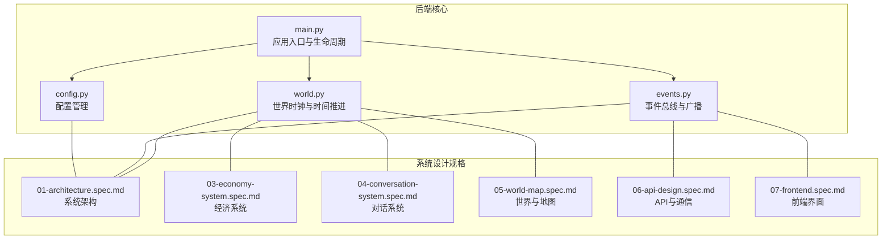
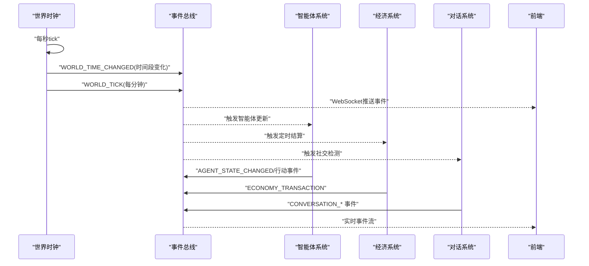
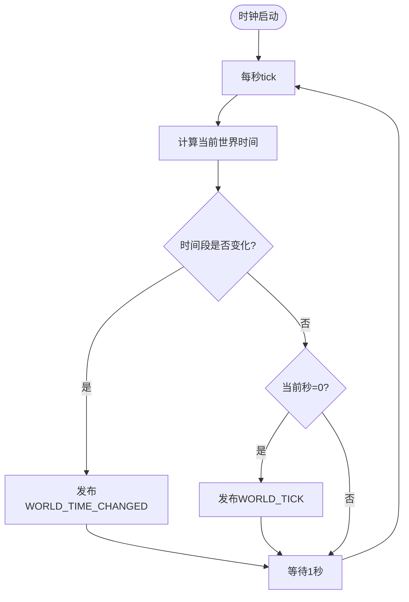
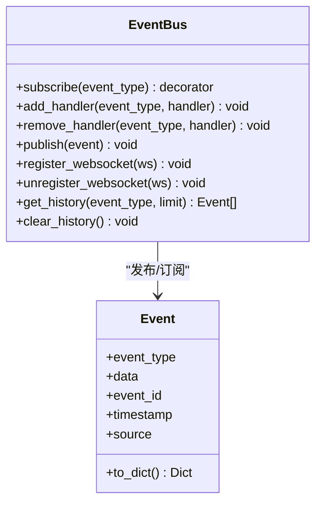
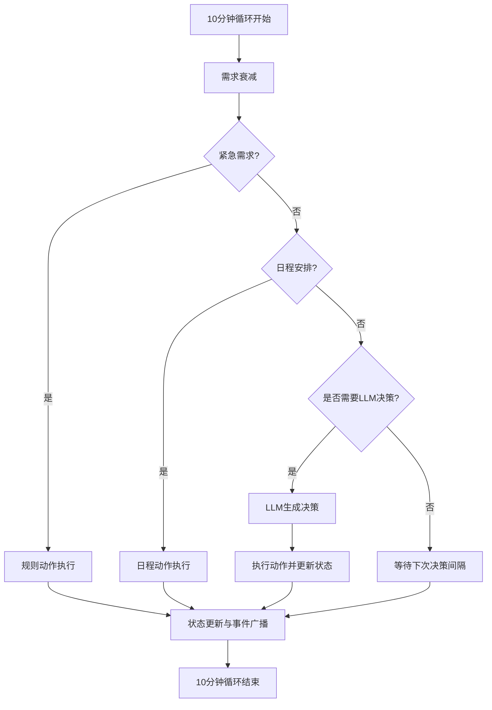
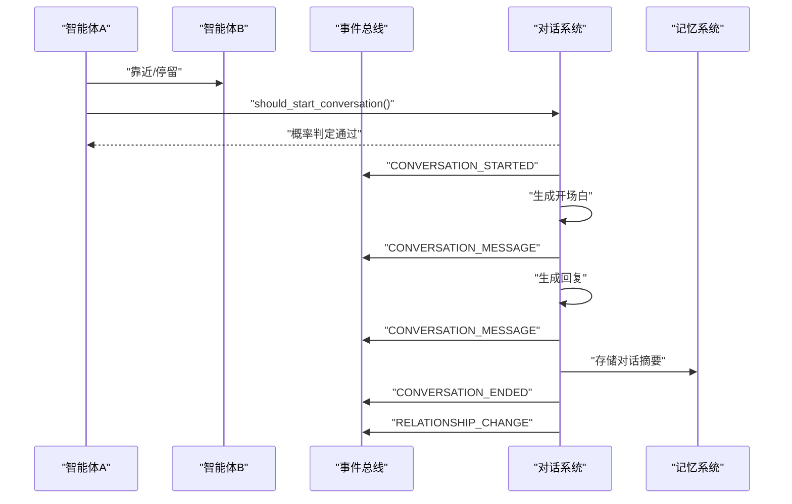
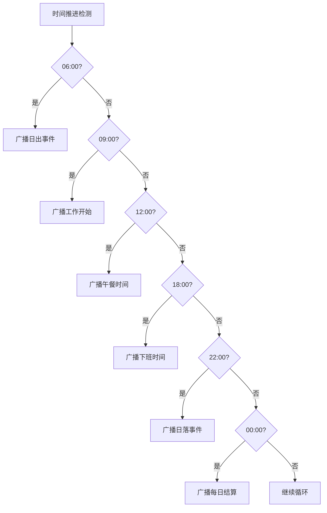
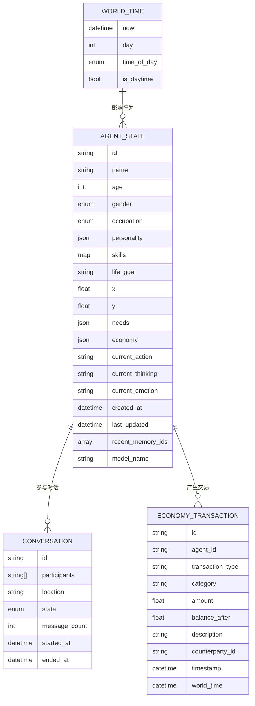
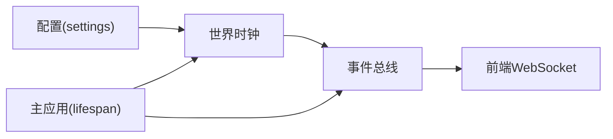

# 世界循环主流程

<cite>
**本文档引用的文件**
- [backend/app/core/world.py](file://backend/app/core/world.py)
- [backend/app/core/events.py](file://backend/app/core/events.py)
- [backend/app/main.py](file://backend/app/main.py)
- [backend/app/core/config.py](file://backend/app/core/config.py)
- [specs/01-architecture.spec.md](file://specs/01-architecture.spec.md)
- [specs/03-economy-system.spec.md](file://specs/03-economy-system.spec.md)
- [specs/04-conversation-system.spec.md](file://specs/04-conversation-system.spec.md)
- [specs/05-world-map.spec.md](file://specs/05-world-map.spec.md)
- [specs/06-api-design.spec.md](file://specs/06-api-design.spec.md)
- [specs/07-frontend.spec.md](file://specs/07-frontend.spec.md)
</cite>

## 目录
1. [简介](#简介)
2. [项目结构](#项目结构)
3. [核心组件](#核心组件)
4. [架构总览](#架构总览)
5. [详细组件分析](#详细组件分析)
6. [依赖分析](#依赖分析)
7. [性能考虑](#性能考虑)
8. [故障排除指南](#故障排除指南)
9. [结论](#结论)
10. [附录](#附录)

## 简介
本文件系统化阐述“世界循环主流程”的完整机制，围绕每10分钟游戏时间（现实1分钟）的循环展开，涵盖时间推进机制、智能体更新策略（需求衰减、经济结算、行为决策）、社交互动触发条件、事件广播机制、并行处理策略、定时事件触发（日出/日落/发工资等）、状态同步机制、世界时钟管理、事件调度算法与性能优化建议。文档同时提供数据流向图与组件协作关系图，帮助读者快速理解后端核心模块如何协同工作。

## 项目结构
后端采用分层架构，核心模块包括：
- 世界时钟与事件总线：负责时间推进与事件分发
- 配置管理：集中管理时间缩放、预算、智能体数量等参数
- 主应用入口：生命周期管理与后台任务启动
- 规格文档：提供系统设计、经济、对话、地图、API与前端的详细约束与流程

**图表来源**
- [backend/app/main.py](file://backend/app/main.py#L26-L58)
- [backend/app/core/world.py](file://backend/app/core/world.py#L73-L292)
- [backend/app/core/events.py](file://backend/app/core/events.py#L88-L269)
- [backend/app/core/config.py](file://backend/app/core/config.py#L19-L175)
- [specs/01-architecture.spec.md](file://specs/01-architecture.spec.md#L1-L255)

**章节来源**
- [backend/app/main.py](file://backend/app/main.py#L26-L58)
- [specs/01-architecture.spec.md](file://specs/01-architecture.spec.md#L1-L255)

## 核心组件
- 世界时钟（WorldClock）
  - 管理游戏内时间推进，支持时间缩放、暂停/恢复、定时事件广播
  - 每秒tick，按分钟粒度广播世界tick事件
- 事件总线（EventBus）
  - 发布-订阅模式，异步处理事件，支持WebSocket实时推送
  - 统一事件类型与数据结构，保证前后端解耦
- 配置系统（Settings）
  - 集中管理时间缩放、预算、智能体数量、决策间隔等参数
- 主应用入口（FastAPI）
  - 生命周期钩子中启动世界时钟后台任务，优雅关闭时清理资源

**章节来源**
- [backend/app/core/world.py](file://backend/app/core/world.py#L73-L292)
- [backend/app/core/events.py](file://backend/app/core/events.py#L88-L269)
- [backend/app/core/config.py](file://backend/app/core/config.py#L19-L175)
- [backend/app/main.py](file://backend/app/main.py#L26-L58)

## 架构总览
世界循环主流程遵循“每10分钟游戏时间（现实1分钟）”的节奏，由世界时钟驱动，事件总线串联各子系统，形成完整的数据流与控制流。

**图表来源**
- [backend/app/core/world.py](file://backend/app/core/world.py#L235-L277)
- [backend/app/core/events.py](file://backend/app/core/events.py#L167-L195)
- [specs/01-architecture.spec.md](file://specs/01-architecture.spec.md#L180-L203)

## 详细组件分析

### 世界时钟与时间推进机制
- 时间缩放与起始时间
  - 默认时间缩放为10，即现实1分钟=游戏内10分钟
  - 起始世界时间为当天08:00（UTC），便于后续日出/日落等定时事件对齐
- tick循环与事件广播
  - 每秒tick一次，检测时间段变化时广播“世界时间变化”
  - 每分钟（游戏内）广播“世界tick”，用于驱动10分钟循环
- 时间段判定与昼夜判断
  - 小时级时间段（黎明/上午/中午/下午/傍晚/夜晚）
  - 白天判定（06:00-22:00），工作时间（09:00-18:00），睡眠时间（23:00-06:00）

**图表来源**
- [backend/app/core/world.py](file://backend/app/core/world.py#L235-L277)

**章节来源**
- [backend/app/core/world.py](file://backend/app/core/world.py#L73-L292)
- [backend/app/core/config.py](file://backend/app/core/config.py#L43-L48)

### 事件总线与广播机制
- 事件类型
  - 智能体相关：AGENT_MOVED、AGENT_DECIDED、AGENT_ACTION、AGENT_CREATED、AGENT_LEFT、AGENT_STATE_CHANGED
  - 对话相关：CONVERSATION_STARTED、CONVERSATION_MESSAGE、CONVERSATION_ENDED
  - 世界相关：WORLD_TICK、WORLD_TIME_CHANGED
  - 经济相关：ECONOMY_TRANSACTION
  - 系统事件：SYSTEM_ERROR、SYSTEM_WARNING
- 广播与订阅
  - 异步调用所有订阅处理器
  - 广播至WebSocket连接，前端实时接收
  - 支持历史记录与清理，便于调试与回放

**图表来源**
- [backend/app/core/events.py](file://backend/app/core/events.py#L88-L269)

**章节来源**
- [backend/app/core/events.py](file://backend/app/core/events.py#L27-L53)
- [backend/app/core/events.py](file://backend/app/core/events.py#L167-L239)

### 智能体更新策略（需求衰减、经济结算、行为决策）
- 需求衰减
  - 每10分钟游戏时间（现实1分钟）触发一次需求衰减
  - 能量-5，社交-3等基础衰减，结合昼夜与行为动态调整
- 经济结算
  - 每日结算（现实2.4小时触发一次）：扣除固定支出、发放被动收入、检查经济状态
  - 收入与支出与职业、技能、心情等因素联动
- 行为决策
  - 简单需求与日程通过规则引擎即时处理
  - 复杂情境通过LLM生成决策，随后执行并广播事件

**图表来源**
- [specs/01-architecture.spec.md](file://specs/01-architecture.spec.md#L180-L203)
- [specs/03-economy-system.spec.md](file://specs/03-economy-system.spec.md#L91-L109)

**章节来源**
- [specs/01-architecture.spec.md](file://specs/01-architecture.spec.md#L180-L203)
- [specs/03-economy-system.spec.md](file://specs/03-economy-system.spec.md#L31-L48)
- [specs/03-economy-system.spec.md](file://specs/03-economy-system.spec.md#L91-L109)

### 社交互动触发条件与对话系统
- 触发条件
  - 近距离（像素距离与停留时长）遇见过往
  - 主动搭讪（社交需求阈值）
  - 工作场景（服务/教学/销售等）
  - 约定见面（基于记忆与尽责性）
- 对话生成与轮次控制
  - 开场白与回复均由LLM生成，遵循提示词模板
  - 轮次控制与结束条件（自然结束、超时、打断、紧急需求）
  - 情绪检测与话题提取，影响关系变化
- 关系变化与记忆存储
  - 对话后关系强度更新，广播关系变更事件
  - 对话摘要存入记忆系统，重要性评分综合对话长度、情感、关系变化与话题

**图表来源**
- [specs/04-conversation-system.spec.md](file://specs/04-conversation-system.spec.md#L55-L96)
- [specs/04-conversation-system.spec.md](file://specs/04-conversation-system.spec.md#L200-L240)
- [specs/04-conversation-system.spec.md](file://specs/04-conversation-system.spec.md#L331-L374)

**章节来源**
- [specs/04-conversation-system.spec.md](file://specs/04-conversation-system.spec.md#L14-L50)
- [specs/04-conversation-system.spec.md](file://specs/04-conversation-system.spec.md#L55-L96)
- [specs/04-conversation-system.spec.md](file://specs/04-conversation-system.spec.md#L200-L240)
- [specs/04-conversation-system.spec.md](file://specs/04-conversation-system.spec.md#L331-L374)

### 定时事件触发（日出/日落/发工资等）
- 定时事件配置
  - 日出（06:00）、工作开始（09:00）、午餐（12:00）、下班（18:00）、日落（22:00）、每日结算（00:00）
- 触发机制
  - 世界时钟在时间推进过程中检测到整点时，通过事件总线广播相应事件
  - 各子系统订阅对应事件，执行相应逻辑（如经济结算、工作状态切换）

**图表来源**
- [specs/05-world-map.spec.md](file://specs/05-world-map.spec.md#L288-L329)
- [backend/app/core/world.py](file://backend/app/core/world.py#L266-L272)

**章节来源**
- [specs/05-world-map.spec.md](file://specs/05-world-map.spec.md#L288-L329)
- [specs/05-world-map.spec.md](file://specs/05-world-map.spec.md#L421-L444)

### 状态同步机制与数据流向
- 世界状态
  - 世界时钟提供当前时间、天数、时间段与昼夜状态
  - 通过事件总线对外广播，供其他模块读取
- 智能体状态
  - 位置、行动、需求、经济、记忆索引等状态字段
  - 通过事件总线广播状态变化，前端实时更新
- 经济状态
  - 收入/支出/余额/经济状态分级
  - 每日结算后广播经济事件，前端统计面板更新
- 对话状态
  - 会话状态、消息序列、话题与情绪
  - 通过事件总线推送至前端，实时对话流展示

**图表来源**
- [backend/app/core/world.py](file://backend/app/core/world.py#L46-L70)
- [backend/app/core/agent.py](file://backend/app/core/agent.py#L48-L76)
- [specs/03-economy-system.spec.md](file://specs/03-economy-system.spec.md#L314-L342)
- [specs/04-conversation-system.spec.md](file://specs/04-conversation-system.spec.md#L509-L536)

**章节来源**
- [backend/app/core/world.py](file://backend/app/core/world.py#L141-L165)
- [backend/app/core/agent.py](file://backend/app/core/agent.py#L48-L76)
- [specs/03-economy-system.spec.md](file://specs/03-economy-system.spec.md#L314-L342)
- [specs/04-conversation-system.spec.md](file://specs/04-conversation-system.spec.md#L509-L536)

### 并行处理策略
- 世界时钟后台任务
  - 通过异步任务启动，避免阻塞主事件循环
- 事件处理器并行执行
  - 事件总线异步调用所有订阅处理器，使用gather并发执行
- 智能体决策并行
  - 每个智能体独立决策循环，可通过并发策略提升吞吐
- WebSocket广播
  - 广播到多个连接时，逐个发送并清理断开连接

**章节来源**
- [backend/app/main.py](file://backend/app/main.py#L40-L52)
- [backend/app/core/events.py](file://backend/app/core/events.py#L188-L194)
- [specs/01-architecture.spec.md](file://specs/01-architecture.spec.md#L180-L203)

## 依赖分析
- 时钟依赖事件总线：世界时钟通过事件总线发布时间相关事件
- 事件总线依赖WebSocket：将事件推送到前端
- 配置依赖设置：时间缩放等参数来自配置
- 主应用依赖时钟与事件总线：在生命周期中启动与停止

**图表来源**
- [backend/app/core/config.py](file://backend/app/core/config.py#L160-L175)
- [backend/app/core/world.py](file://backend/app/core/world.py#L31-L32)
- [backend/app/core/events.py](file://backend/app/core/events.py#L219-L239)
- [backend/app/main.py](file://backend/app/main.py#L40-L52)

**章节来源**
- [backend/app/core/world.py](file://backend/app/core/world.py#L31-L32)
- [backend/app/core/events.py](file://backend/app/core/events.py#L219-L239)
- [backend/app/main.py](file://backend/app/main.py#L40-L52)

## 性能考虑
- 时间推进频率
  - 世界时钟每秒tick，确保时间精度；事件广播按分钟粒度，降低开销
- 事件处理并发
  - 事件总线使用并发执行所有处理器，避免串行瓶颈
- 决策频率控制
  - 智能体决策间隔（默认60秒）可配置，避免过度LLM调用
- 前端渲染优化
  - 只渲染可见区域内的元素，使用对象池与批量更新，减少DOM操作
- 成本控制
  - 月度预算与预警阈值，限制LLM调用成本

**章节来源**
- [backend/app/core/world.py](file://backend/app/core/world.py#L235-L248)
- [backend/app/core/events.py](file://backend/app/core/events.py#L188-L194)
- [backend/app/core/config.py](file://backend/app/core/config.py#L124-L129)
- [specs/07-frontend.spec.md](file://specs/07-frontend.spec.md#L485-L521)
- [specs/03-economy-system.spec.md](file://specs/03-economy-system.spec.md#L69-L79)

## 故障排除指南
- 世界时钟未启动
  - 检查主应用生命周期钩子是否创建后台任务
  - 查看日志确认时钟启动与停止调用
- 事件未广播到前端
  - 确认WebSocket连接注册与断开清理逻辑
  - 检查事件类型与订阅通道
- 时间缩放异常
  - 校验配置中的time_scale参数范围（1-100）
  - 检查暂停/恢复逻辑对累计暂停时间的影响
- 决策频率过高导致性能问题
  - 调整智能体决策间隔配置
  - 增加规则决策比例，减少LLM调用

**章节来源**
- [backend/app/main.py](file://backend/app/main.py#L40-L52)
- [backend/app/core/events.py](file://backend/app/core/events.py#L231-L239)
- [backend/app/core/world.py](file://backend/app/core/world.py#L221-L234)
- [backend/app/core/config.py](file://backend/app/core/config.py#L124-L129)

## 结论
世界循环主流程以世界时钟为核心，通过事件总线实现模块解耦与实时广播。每10分钟游戏时间（现实1分钟）的循环中，系统完成需求衰减、经济结算、行为决策、社交互动与事件广播，形成完整的自治世界运行闭环。配合并行处理策略与性能优化，系统可在中等规模智能体数量下保持流畅运行，并通过配置灵活调整时间缩放与决策频率，满足观察与实验需求。

## 附录
- API与通信协议
  - REST API提供世界状态查询与控制，WebSocket实时推送事件
  - 前端通过Zustand状态管理与Pixi.js渲染，实现60fps地图与事件流
- 经济系统与对话系统
  - 经济系统与现实对齐，每日结算与被动收入机制真实反映生活压力
  - 对话系统支持自然语言生成、情绪检测与关系变化，增强社交观察价值

**章节来源**
- [specs/06-api-design.spec.md](file://specs/06-api-design.spec.md#L1-L655)
- [specs/07-frontend.spec.md](file://specs/07-frontend.spec.md#L1-L650)
- [specs/03-economy-system.spec.md](file://specs/03-economy-system.spec.md#L1-L418)
- [specs/04-conversation-system.spec.md](file://specs/04-conversation-system.spec.md#L1-L581)