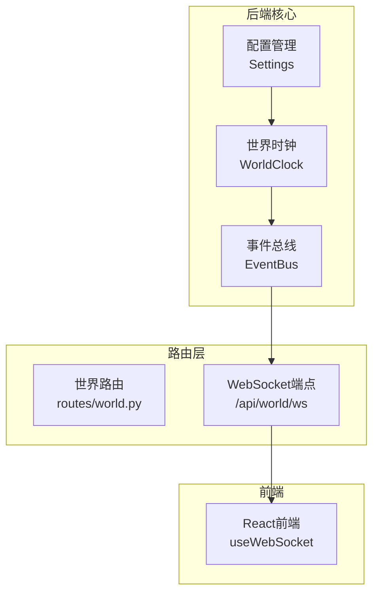
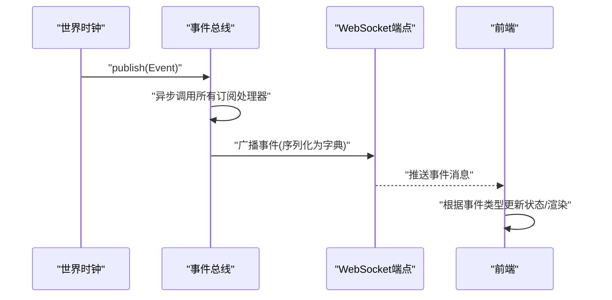
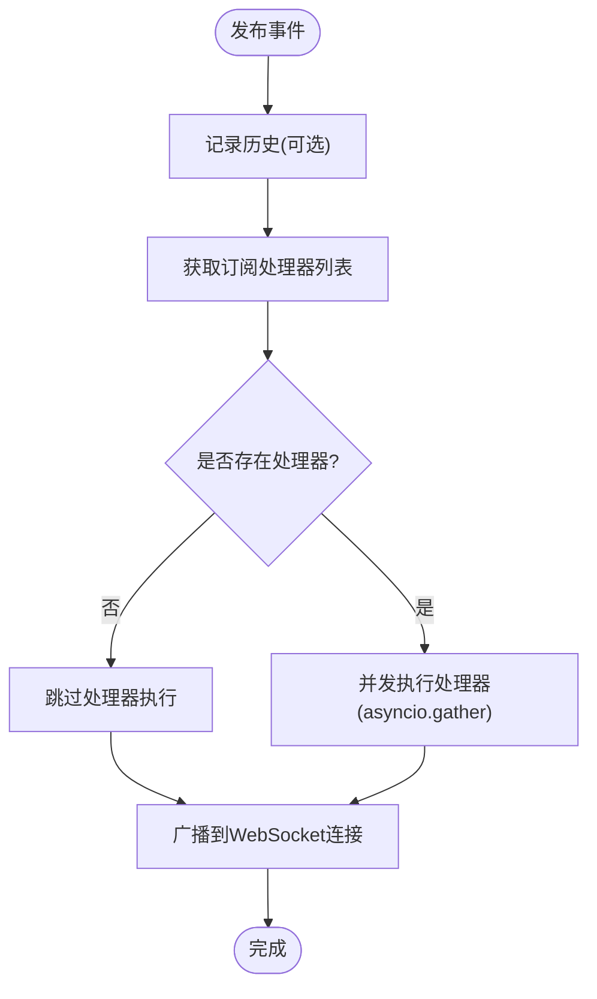
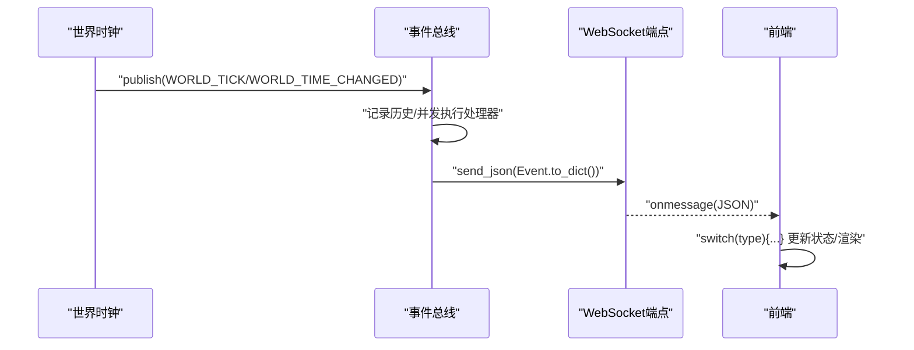
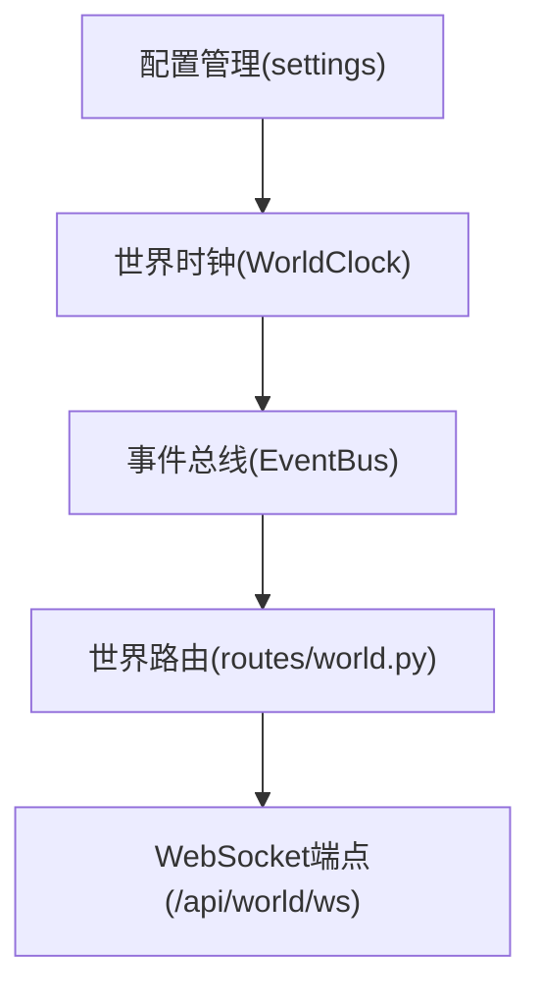
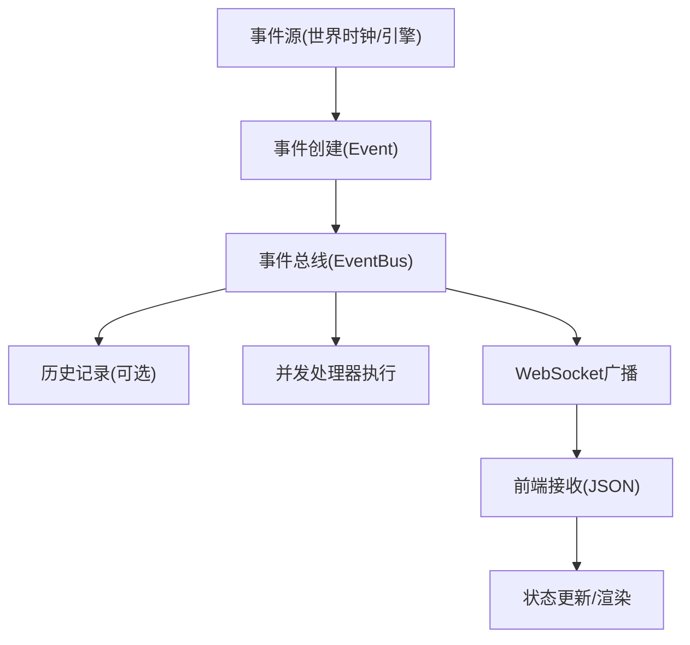

# 事件总线数据流

<cite>
**本文引用的文件**
- [backend/app/core/events.py](file://backend/app/core/events.py)
- [backend/app/core/world.py](file://backend/app/core/world.py)
- [backend/app/routes/world.py](file://backend/app/routes/world.py)
- [backend/app/main.py](file://backend/app/main.py)
- [backend/app/core/config.py](file://backend/app/core/config.py)
- [specs/06-api-design.spec.md](file://specs/06-api-design.spec.md)
- [specs/07-frontend.spec.md](file://specs/07-frontend.spec.md)
- [specs/01-architecture.spec.md](file://specs/01-architecture.spec.md)
- [backend/tests/test_events.py](file://backend/tests/test_events.py)
</cite>

## 目录
1. [简介](#简介)
2. [项目结构](#项目结构)
3. [核心组件](#核心组件)
4. [架构概览](#架构概览)
5. [详细组件分析](#详细组件分析)
6. [依赖关系分析](#依赖关系分析)
7. [性能考虑](#性能考虑)
8. [故障排查指南](#故障排查指南)
9. [结论](#结论)
10. [附录](#附录)

## 简介
本文件系统性阐述事件总线在 AI Society 项目中的数据流与工作机制，覆盖事件类型定义、消息广播机制、订阅者管理、异步处理策略；并详细描述事件从产生到消费的完整路径：事件创建、消息序列化、WebSocket 推送、前端接收渲染。同时补充事件优先级管理、批量处理策略、错误重试机制建议，提供事件流图、消息格式规范与性能监控指标，并说明如何扩展新的事件类型与优化事件处理性能。

## 项目结构
事件总线位于后端核心模块，与世界时钟、WebSocket 路由、应用生命周期紧密协作，形成“事件产生 → 事件总线 → WebSocket 推送 → 前端接收”的闭环。



**图表来源**
- [backend/app/core/events.py](file://backend/app/core/events.py#L88-L269)
- [backend/app/core/world.py](file://backend/app/core/world.py#L73-L292)
- [backend/app/routes/world.py](file://backend/app/routes/world.py#L90-L110)
- [specs/01-architecture.spec.md](file://specs/01-architecture.spec.md#L178-L203)

**章节来源**
- [specs/01-architecture.spec.md](file://specs/01-architecture.spec.md#L1-L255)
- [backend/app/core/events.py](file://backend/app/core/events.py#L1-L269)
- [backend/app/core/world.py](file://backend/app/core/world.py#L1-L292)
- [backend/app/routes/world.py](file://backend/app/routes/world.py#L1-L110)

## 核心组件
- 事件类型枚举：定义智能体、对话、世界、经济、系统等事件类型，确保跨模块一致的事件标识。
- 事件数据类：封装事件类型、数据载荷、事件ID、时间戳、来源字段，提供序列化为字典的能力。
- 事件总线：实现发布-订阅模式，支持异步处理器注册与并发执行，内置事件历史与WebSocket广播能力。
- 世界时钟：周期性产生世界事件并通过事件总线发布，驱动系统时间推进与定时事件。
- WebSocket 路由：接受客户端连接，注册/注销WebSocket连接，实现事件实时推送。
- 配置管理：提供时间缩放、预算、模型等配置，影响事件产生的节奏与成本控制。

**章节来源**
- [backend/app/core/events.py](file://backend/app/core/events.py#L27-L82)
- [backend/app/core/events.py](file://backend/app/core/events.py#L88-L269)
- [backend/app/core/world.py](file://backend/app/core/world.py#L73-L292)
- [backend/app/routes/world.py](file://backend/app/routes/world.py#L90-L110)
- [backend/app/core/config.py](file://backend/app/core/config.py#L19-L175)

## 架构概览
事件总线贯穿系统，承担解耦与实时通信职责。世界时钟作为事件源，将时间推进与定时事件通过事件总线分发给所有订阅者；事件总线同时负责将事件序列化并通过WebSocket推送给前端，前端基于事件类型进行状态更新与UI渲染。



**图表来源**
- [backend/app/core/world.py](file://backend/app/core/world.py#L249-L272)
- [backend/app/core/events.py](file://backend/app/core/events.py#L167-L230)
- [backend/app/routes/world.py](file://backend/app/routes/world.py#L90-L110)
- [specs/06-api-design.spec.md](file://specs/06-api-design.spec.md#L411-L531)

## 详细组件分析

### 事件类型与消息格式
- 事件类型：涵盖智能体移动、决策、状态变化、对话开始/消息/结束、世界时钟滴答/时间变更、经济交易、系统错误/警告等。
- 消息格式：事件被序列化为包含事件ID、事件类型、数据、时间戳、来源的字典，供WebSocket传输与前端解析。

```mermaid
classDiagram
class EventType {
<<枚举>>
"agent.moved"
"agent.decided"
"agent.action"
"agent.created"
"agent.left"
"agent.state_changed"
"conversation.started"
"conversation.message"
"conversation.ended"
"world.tick"
"world.time_changed"
"economy.transaction"
"system.error"
"system.warning"
}
class Event {
+event_type
+data
+event_id
+timestamp
+source
+to_dict()
}
class EventBus {
-_handlers
-_history
-_ws_connections
+subscribe()
+add_handler()
+remove_handler()
+publish()
+register_websocket()
+unregister_websocket()
+get_history()
+clear_history()
}
EventBus --> Event : "发布/序列化"
EventBus --> EventType : "按类型分发"
```

**图表来源**
- [backend/app/core/events.py](file://backend/app/core/events.py#L27-L82)
- [backend/app/core/events.py](file://backend/app/core/events.py#L88-L269)

**章节来源**
- [backend/app/core/events.py](file://backend/app/core/events.py#L27-L82)
- [specs/06-api-design.spec.md](file://specs/06-api-design.spec.md#L427-L531)

### 订阅者管理与异步处理
- 订阅装饰器：通过装饰器注册处理器，避免重复注册，简化订阅流程。
- 处理器注册/移除：支持动态添加与移除处理器，便于模块化扩展。
- 异步执行：发布时并发执行所有订阅处理器，提升吞吐；内部异常隔离，避免单个处理器失败影响整体。
- 事件历史：可选的历史记录功能，支持按事件类型过滤与限制数量，便于调试与回放。



**图表来源**
- [backend/app/core/events.py](file://backend/app/core/events.py#L167-L230)

**章节来源**
- [backend/app/core/events.py](file://backend/app/core/events.py#L120-L166)
- [backend/app/core/events.py](file://backend/app/core/events.py#L196-L208)
- [backend/tests/test_events.py](file://backend/tests/test_events.py#L43-L101)

### 事件从产生到消费的完整路径
- 事件创建：世界时钟在每个tick生成事件，包含世界时间信息与上下文数据。
- 消息序列化：事件转为字典格式，包含标准化字段，确保前后端一致。
- 队列存储：事件总线内部维护历史队列，支持历史查询与限长管理。
- WebSocket 推送：事件总线遍历已注册的WebSocket连接，发送JSON消息；断连自动清理。
- 前端接收渲染：前端建立WebSocket连接后订阅频道，解析消息类型并更新状态与UI。



**图表来源**
- [backend/app/core/world.py](file://backend/app/core/world.py#L254-L272)
- [backend/app/core/events.py](file://backend/app/core/events.py#L167-L230)
- [backend/app/routes/world.py](file://backend/app/routes/world.py#L90-L110)
- [specs/07-frontend.spec.md](file://specs/07-frontend.spec.md#L360-L407)

**章节来源**
- [backend/app/core/world.py](file://backend/app/core/world.py#L249-L272)
- [backend/app/core/events.py](file://backend/app/core/events.py#L209-L230)
- [specs/06-api-design.spec.md](file://specs/06-api-design.spec.md#L411-L531)
- [specs/07-frontend.spec.md](file://specs/07-frontend.spec.md#L360-L407)

### 事件优先级管理与批量处理策略
- 优先级建议：在事件数据中引入优先级字段（如高/中/低），在事件总线中按优先级分组并发执行，或为高频事件设置独立处理器队列。
- 批量处理：对同一类型的事件进行时间窗口聚合（如100ms），合并相同类型事件，减少WebSocket推送次数与前端渲染压力。
- 背压控制：当WebSocket连接积压过多未确认消息时，可降级非关键事件或丢弃旧事件，保证关键事件（如世界时钟滴答）优先推送。

[本节为通用优化建议，不直接分析具体文件，故无“章节来源”]

### 错误重试机制
- 处理器异常隔离：事件总线在安全执行处理器时捕获异常，不影响其他处理器继续执行。
- WebSocket 断连处理：广播时若连接异常，将断连连接从集合中移除，避免后续无效推送。
- 建议：对外部依赖（如数据库、缓存、LLM）的调用增加指数退避重试与熔断保护，结合事件总线的事件历史进行失败重放。

**章节来源**
- [backend/app/core/events.py](file://backend/app/core/events.py#L196-L208)
- [backend/app/core/events.py](file://backend/app/core/events.py#L221-L229)

### 扩展新的事件类型
- 定义事件类型：在事件类型枚举中新增条目，遵循清晰的命名空间与语义。
- 事件创建：在事件源（如世界时钟、对话引擎、经济引擎）中构造事件并发布。
- 处理器注册：通过装饰器或显式注册方式添加处理器，确保异步实现与异常隔离。
- WebSocket 消息格式：保持事件字典结构一致，前端按类型分支处理。
- 测试验证：编写单元测试覆盖事件创建、发布、历史记录与处理器执行。

**章节来源**
- [backend/app/core/events.py](file://backend/app/core/events.py#L27-L53)
- [backend/app/core/events.py](file://backend/app/core/events.py#L120-L154)
- [backend/tests/test_events.py](file://backend/tests/test_events.py#L12-L41)

### 性能优化建议
- 减少事件体积：仅携带必要字段，避免大对象频繁序列化。
- 并发优化：合理拆分处理器，避免阻塞操作；对IO密集型操作使用异步。
- 历史与内存：限制历史长度与事件大小，定期清理；对热点事件采用缓存。
- 前端渲染：对高频事件采用虚拟滚动、批量更新与节流策略。

[本节为通用优化建议，不直接分析具体文件，故无“章节来源”]

## 依赖关系分析
事件总线与世界时钟、WebSocket 路由、应用生命周期存在直接依赖；配置管理影响世界时钟的时间缩放，从而间接影响事件产生的频率。



**图表来源**
- [backend/app/core/config.py](file://backend/app/core/config.py#L19-L175)
- [backend/app/core/world.py](file://backend/app/core/world.py#L73-L292)
- [backend/app/core/events.py](file://backend/app/core/events.py#L88-L269)
- [backend/app/routes/world.py](file://backend/app/routes/world.py#L90-L110)

**章节来源**
- [backend/app/core/config.py](file://backend/app/core/config.py#L19-L175)
- [backend/app/core/world.py](file://backend/app/core/world.py#L73-L292)
- [backend/app/core/events.py](file://backend/app/core/events.py#L88-L269)
- [backend/app/routes/world.py](file://backend/app/routes/world.py#L90-L110)

## 性能考虑
- 事件发布吞吐：利用异步并发执行处理器，减少串行瓶颈。
- WebSocket 推送延迟：确保事件序列化轻量化，避免阻塞主线程。
- 前端渲染性能：高频事件采用批量更新与差量渲染，降低UI抖动。
- 监控指标建议：事件发布速率、处理器平均耗时、WebSocket连接数、断连率、事件历史长度、前端帧率与延迟。

[本节为通用性能讨论，不直接分析具体文件，故无“章节来源”]

## 故障排查指南
- 事件未到达前端：检查WebSocket连接是否注册、断连是否被清理、消息格式是否符合前端预期。
- 处理器异常导致其他处理器失效：确认异常隔离机制是否生效，查看日志中异常堆栈。
- 事件历史缺失：确认历史记录开关与限制长度设置，必要时清空历史以便重新采集。
- 世界事件未产生：检查世界时钟是否正常运行、时间缩放设置是否合理。

**章节来源**
- [backend/app/core/events.py](file://backend/app/core/events.py#L209-L230)
- [backend/app/core/events.py](file://backend/app/core/events.py#L241-L264)
- [backend/app/core/world.py](file://backend/app/core/world.py#L235-L272)
- [backend/app/routes/world.py](file://backend/app/routes/world.py#L90-L110)

## 结论
事件总线在 AI Society 中承担核心解耦与实时通信职责。通过明确的事件类型、异步处理器与WebSocket推送，系统实现了从世界时钟到前端的高效数据流。建议在现有基础上引入优先级与批量策略、完善外部依赖的重试与熔断，并持续监控关键性能指标，以支撑更大规模的智能体群体与更复杂的交互场景。

## 附录

### 事件流图（概念）


[本图为概念性流程示意，不直接映射具体源码文件，故无“图表来源”]

### 消息格式规范
- 字段说明
  - type：事件类型字符串（如 "world.tick"）
  - timestamp：ISO 8601时间戳
  - data：事件载荷对象
  - event_id：事件唯一标识
  - source：事件来源标识（可选）

- 示例参考
  - 世界事件：参见 WebSocket 协议中的世界事件消息格式
  - 对话事件：参见 WebSocket 协议中的对话开始/消息/结束消息格式

**章节来源**
- [specs/06-api-design.spec.md](file://specs/06-api-design.spec.md#L411-L531)