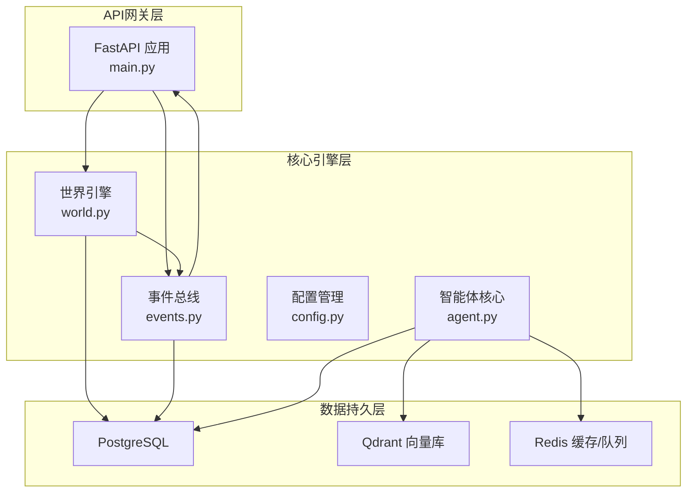
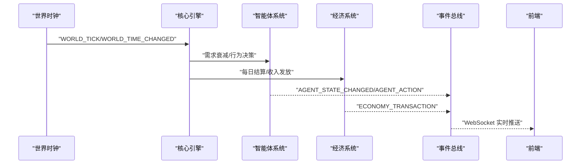
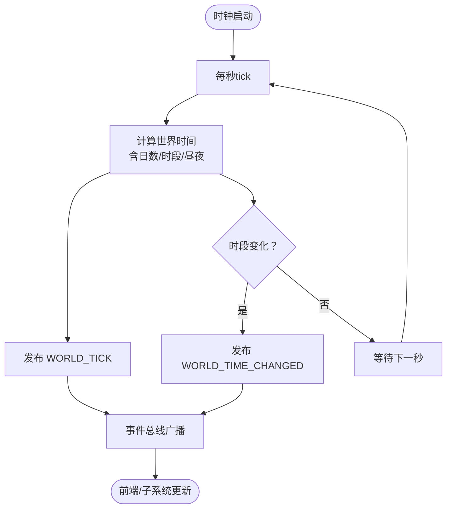
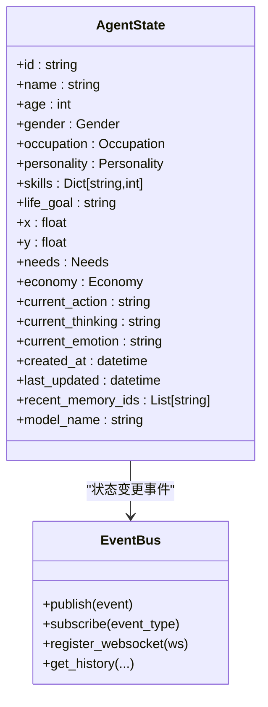
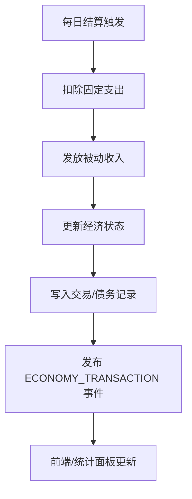
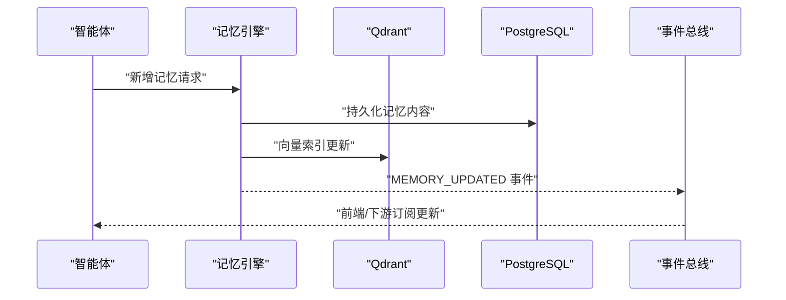
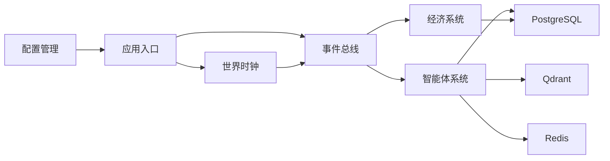

# 数据一致性策略

<cite>
**本文引用的文件**
- [backend/app/main.py](file://backend/app/main.py)
- [backend/app/core/world.py](file://backend/app/core/world.py)
- [backend/app/core/events.py](file://backend/app/core/events.py)
- [backend/app/core/agent.py](file://backend/app/core/agent.py)
- [backend/app/core/config.py](file://backend/app/core/config.py)
- [specs/01-architecture.spec.md](file://specs/01-architecture.spec.md)
- [specs/03-economy-system.spec.md](file://specs/03-economy-system.spec.md)
</cite>

## 目录
1. [简介](#简介)
2. [项目结构](#项目结构)
3. [核心组件](#核心组件)
4. [架构总览](#架构总览)
5. [详细组件分析](#详细组件分析)
6. [依赖分析](#依赖分析)
7. [性能考量](#性能考量)
8. [故障排查指南](#故障排查指南)
9. [结论](#结论)
10. [附录](#附录)

## 简介
本文件围绕“数据一致性策略”这一核心目标，系统梳理并阐述本项目在多数据源环境下的数据一致性保障机制，包括世界状态同步、智能体状态更新、经济数据结算、记忆系统一致性；同时解释事件驱动的分布式锁思想、事务处理策略、冲突解决算法，并给出数据版本控制、快照与回滚策略建议，以及在高并发场景下的性能与一致性的权衡方法。文档以现有代码与规格说明为基础，辅以可视化图示帮助读者快速建立整体认知。

## 项目结构
后端采用分层架构：API网关层（FastAPI）、核心引擎层（世界引擎、智能体引擎、事件总线、经济引擎、记忆引擎）、LLM抽象层、数据持久层（PostgreSQL、Qdrant、Redis）。世界时钟与事件总线是跨模块协调的关键枢纽，负责驱动世界循环与状态广播。

图表来源
- [backend/app/main.py](file://backend/app/main.py#L60-L98)
- [backend/app/core/world.py](file://backend/app/core/world.py#L73-L123)
- [backend/app/core/events.py](file://backend/app/core/events.py#L88-L119)
- [specs/01-architecture.spec.md](file://specs/01-architecture.spec.md#L1-L57)

章节来源
- [specs/01-architecture.spec.md](file://specs/01-architecture.spec.md#L1-L57)
- [backend/app/main.py](file://backend/app/main.py#L60-L98)

## 核心组件
- 世界时钟与世界循环：提供全局时间基准，驱动定时事件与周期性结算。
- 事件总线：解耦模块间通信，统一发布/订阅机制，支撑状态广播与一致性传播。
- 智能体状态：集中存储在数据库，结合内存缓存与事件广播实现最终一致性。
- 经济系统：基于每日结算的事务化处理，确保收支平衡与状态一致性。
- 记忆系统：向量检索与文本存储分离，通过事件驱动进行增量更新。

章节来源
- [backend/app/core/world.py](file://backend/app/core/world.py#L73-L123)
- [backend/app/core/events.py](file://backend/app/core/events.py#L88-L119)
- [backend/app/core/agent.py](file://backend/app/core/agent.py#L48-L76)
- [specs/03-economy-system.spec.md](file://specs/03-economy-system.spec.md#L91-L109)

## 架构总览
世界循环（主循环）以“每游戏内10分钟（现实1分钟）”为节拍，依次推进时间、更新智能体状态、执行经济结算、触发社交互动与事件广播。事件总线负责将状态变更广播至前端与下游模块，形成“事件驱动”的一致性传播链路。

图表来源
- [specs/01-architecture.spec.md](file://specs/01-architecture.spec.md#L180-L203)
- [backend/app/core/world.py](file://backend/app/core/world.py#L235-L277)
- [backend/app/core/events.py](file://backend/app/core/events.py#L167-L194)

章节来源
- [specs/01-architecture.spec.md](file://specs/01-architecture.spec.md#L180-L203)

## 详细组件分析

### 世界状态同步与时间一致性
- 世界时钟提供统一的时间锚点，支持时间缩放、暂停/恢复与运行状态查询。
- tick事件按“每分钟一次”的粒度广播，确保前端与各子系统对齐。
- 通过事件总线的异步广播，避免强耦合，降低跨模块一致性风险。

图表来源
- [backend/app/core/world.py](file://backend/app/core/world.py#L235-L277)
- [backend/app/core/events.py](file://backend/app/core/events.py#L167-L194)

章节来源
- [backend/app/core/world.py](file://backend/app/core/world.py#L73-L123)
- [backend/app/core/world.py](file://backend/app/core/world.py#L124-L165)
- [backend/app/core/world.py](file://backend/app/core/world.py#L235-L277)

### 智能体状态更新与冲突消解
- 智能体状态包含位置、需求、经济、近期记忆索引等字段，统一存储于数据库。
- 事件总线在状态变更时发布“AGENT_STATE_CHANGED/AGENT_ACTION”，前端与下游模块基于事件进行最终一致性更新。
- 冲突消解策略：同一tick内对同一智能体的多次写入，应合并为一次事务提交；若出现竞态，采用“后写入覆盖先写入”或“合并策略”（如需求衰减累加），并在事件层标注时间戳以辅助排序。

图表来源
- [backend/app/core/agent.py](file://backend/app/core/agent.py#L48-L76)
- [backend/app/core/events.py](file://backend/app/core/events.py#L88-L119)

章节来源
- [backend/app/core/agent.py](file://backend/app/core/agent.py#L25-L76)
- [backend/app/core/events.py](file://backend/app/core/events.py#L167-L194)

### 经济数据结算与事务化处理
- 每日结算逻辑在“世界循环”中触发，扣固定支出、发放被动收入、更新经济状态。
- 交易记录与债务关系通过数据库模型持久化，具备可审计性。
- 事务处理策略：结算过程应封装为原子事务，失败回滚，成功后发布“ECONOMY_TRANSACTION”事件，确保前后端一致。

图表来源
- [specs/03-economy-system.spec.md](file://specs/03-economy-system.spec.md#L91-L109)
- [specs/03-economy-system.spec.md](file://specs/03-economy-system.spec.md#L314-L342)
- [backend/app/core/events.py](file://backend/app/core/events.py#L47-L49)

章节来源
- [specs/03-economy-system.spec.md](file://specs/03-economy-system.spec.md#L91-L109)
- [specs/03-economy-system.spec.md](file://specs/03-economy-system.spec.md#L314-L342)

### 记忆系统一致性与检索
- 记忆系统采用向量检索（Qdrant）与文本存储（PostgreSQL）分离架构，通过事件驱动进行增量更新。
- 一致性策略：新增记忆事件触发向量索引更新；删除/修改事件需同步更新索引与存储；前端通过事件流感知最新记忆索引。

图表来源
- [specs/01-architecture.spec.md](file://specs/01-architecture.spec.md#L30-L32)
- [backend/app/core/events.py](file://backend/app/core/events.py#L167-L194)

章节来源
- [specs/01-architecture.spec.md](file://specs/01-architecture.spec.md#L30-L32)

### 分布式锁机制与冲突解决
- 现状：未发现显式的分布式锁实现（Redis RedLock等）。
- 建议（概念性）：对关键写操作（如经济结算、智能体状态更新）引入基于Redis的短时分布式锁；冲突解决采用“最后写入获胜”或“合并策略”，并记录冲突日志以便事后审计。
- 事件驱动的“乐观并发”：通过事件总线与最终一致性，降低强一致带来的性能瓶颈。

章节来源
- [specs/01-architecture.spec.md](file://specs/01-architecture.spec.md#L50-L56)

### 事务处理策略与错误恢复
- 事务策略：核心写操作（经济结算、交易记录、债务更新）应封装在数据库事务中，失败即回滚。
- 错误恢复：事件总线保留有限历史，可用于问题复盘；应用重启后可重放关键事件或从最近快照恢复。
- 建议：对高频写操作增加幂等键（如“结算批次号+agent_id”），避免重复结算。

章节来源
- [specs/03-economy-system.spec.md](file://specs/03-economy-system.spec.md#L314-L342)
- [backend/app/core/events.py](file://backend/app/core/events.py#L241-L264)

### 数据版本控制、快照与回滚
- 版本控制：为AgentState/Economy等关键实体引入版本号字段，事件中携带版本信息，前端与下游据此判断是否丢弃过期更新。
- 快照：定期生成世界状态快照（如每日0点），包含AgentState、交易与债务快照，便于离线分析与审计。
- 回滚：当检测到严重不一致（如经济失衡）时，回滚至最近快照并重放事件；对不可逆操作（如消费）需额外校验。

章节来源
- [backend/app/core/agent.py](file://backend/app/core/agent.py#L48-L76)
- [specs/03-economy-system.spec.md](file://specs/03-economy-system.spec.md#L314-L342)

### 高并发一致性与性能权衡
- 一致性优先：对关键路径（经济结算、交易）采用同步事务，确保强一致。
- 性能优先：对非关键路径（状态广播、日志）采用异步事件总线，提升吞吐。
- 混合策略：热点Agent的状态更新可做“写合并”（同一tick内多次写入合并为一次），减少写放大。

章节来源
- [specs/01-architecture.spec.md](file://specs/01-architecture.spec.md#L245-L255)

## 依赖分析
- 生命周期与启动顺序：应用启动时初始化配置与事件总线，随后启动世界时钟后台任务。
- 事件依赖：世界时钟产生时间事件，事件总线驱动智能体与经济系统更新，再反向广播状态变更事件。
- 数据依赖：智能体状态与经济数据持久化至PostgreSQL；记忆向量索引由Qdrant维护；缓存与消息队列由Redis承担。

图表来源
- [backend/app/main.py](file://backend/app/main.py#L26-L57)
- [backend/app/core/config.py](file://backend/app/core/config.py#L19-L32)
- [specs/01-architecture.spec.md](file://specs/01-architecture.spec.md#L50-L56)

章节来源
- [backend/app/main.py](file://backend/app/main.py#L26-L57)
- [backend/app/core/config.py](file://backend/app/core/config.py#L19-L32)

## 性能考量
- 事件总线异步处理：避免阻塞主循环，提高吞吐。
- 写合并与批处理：对高频状态更新进行合并，减少数据库压力。
- 缓存策略：对只读数据（如地图、静态配置）使用Redis缓存；对热数据（最近记忆索引）进行预加载。
- 监控与限流：对LLM调用频率进行限制，避免超出月度预算与系统承载。

章节来源
- [specs/01-architecture.spec.md](file://specs/01-architecture.spec.md#L245-L255)
- [backend/app/core/config.py](file://backend/app/core/config.py#L68-L80)

## 故障排查指南
- 事件丢失：检查事件总线历史与WebSocket连接集合，确认事件是否被广播。
- 时间不同步：核对世界时钟的运行状态、暂停状态与时间缩放设置。
- 经济异常：核查交易记录与债务关系表，确认是否存在重复结算或余额异常。
- 记忆不一致：检查向量索引更新事件与数据库持久化事件的顺序与结果。

章节来源
- [backend/app/core/events.py](file://backend/app/core/events.py#L241-L264)
- [backend/app/core/world.py](file://backend/app/core/world.py#L274-L277)
- [specs/03-economy-system.spec.md](file://specs/03-economy-system.spec.md#L314-L342)

## 结论
本项目通过“事件驱动 + 世界时钟 + 事务化结算”的组合，在保证系统可观测性与可扩展性的同时，实现了多数据源的一致性协同。建议在现有基础上补充分布式锁与版本控制机制，强化高并发场景下的数据完整性；同时持续优化事件处理与缓存策略，实现性能与一致性的动态平衡。

## 附录
- 术语
  - 世界循环：以固定节拍推进的主流程，包含时间推进、智能体更新、经济结算与事件广播。
  - 事件总线：发布/订阅模式的消息通道，用于模块间解耦与一致性传播。
  - 幂等：对同一操作重复执行产生的副作用与执行一次相同，常用于事务补偿与重试。