# 数据流设计

<cite>
**本文档引用的文件**
- [backend/app/core/world.py](file://backend/app/core/world.py)
- [backend/app/core/agent.py](file://backend/app/core/agent.py)
- [backend/app/core/config.py](file://backend/app/core/config.py)
- [specs/01-architecture.spec.md](file://specs/01-architecture.spec.md)
- [specs/03-economy-system.spec.md](file://specs/03-economy-system.spec.md)
- [specs/04-conversation-system.spec.md](file://specs/04-conversation-system.spec.md)
- [specs/05-world-map.spec.md](file://specs/05-world-map.spec.md)
- [specs/06-api-design.spec.md](file://specs/06-api-design.spec.md)
- [specs/08-implementation-plan.spec.md](file://specs/08-implementation-plan.spec.md)
</cite>

## 目录
1. [简介](#简介)
2. [项目结构](#项目结构)
3. [核心组件](#核心组件)
4. [架构概览](#架构概览)
5. [详细组件分析](#详细组件分析)
6. [依赖分析](#依赖分析)
7. [性能考虑](#性能考虑)
8. [故障排除指南](#故障排除指南)
9. [结论](#结论)

## 简介

AI Society是一个基于时间推进的世界模拟系统，通过智能体驱动的AI决策实现复杂的社交互动和经济活动。本项目采用异步架构设计，实现了完整的数据流管道，包括世界循环主流程和LLM调用流程。

系统的核心特点是：
- **时间推进机制**：现实1分钟 = 游戏内10分钟的时间缩放
- **智能体自治**：每个智能体都是独立的决策实体
- **实时交互**：通过WebSocket实现前后端实时数据同步
- **多模型支持**：支持DeepSeek、OpenAI等多种LLM提供商

## 项目结构

项目采用分层架构设计，主要分为以下层次：

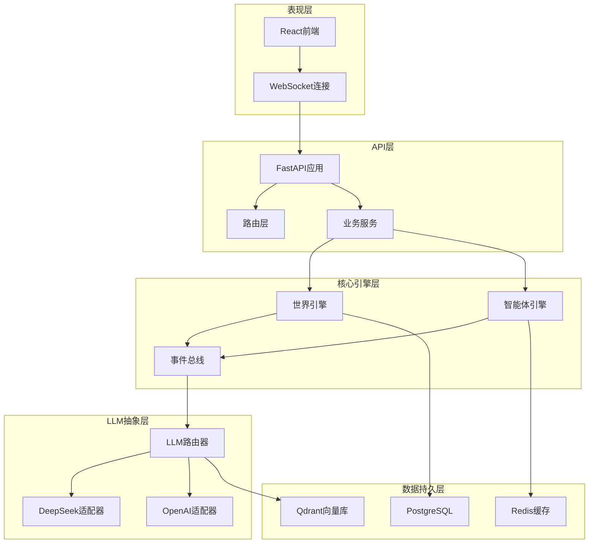

**图表来源**
- [specs/01-architecture.spec.md](file://specs/01-architecture.spec.md#L1-L255)

**章节来源**
- [specs/01-architecture.spec.md](file://specs/01-architecture.spec.md#L1-L255)

## 核心组件

### 世界时钟系统

世界时钟是整个系统的时间基准，实现了现实时间与游戏内时间的转换：

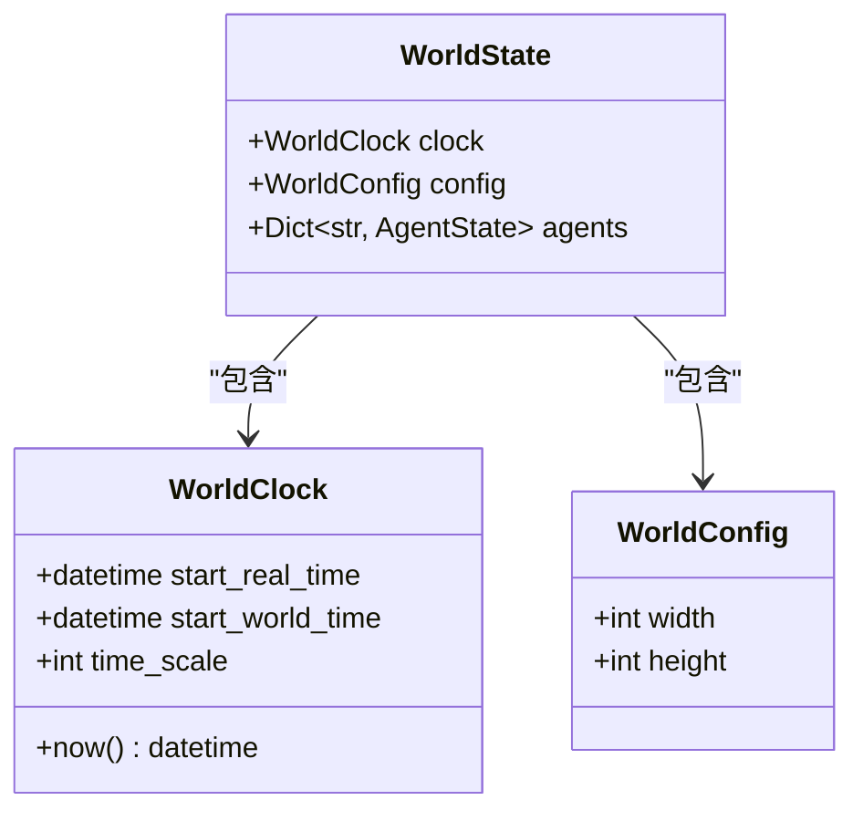

**图表来源**
- [backend/app/core/world.py](file://backend/app/core/world.py#L8-L40)

### 智能体数据模型

智能体是系统的基本单元，包含完整的个人信息、状态和行为能力：

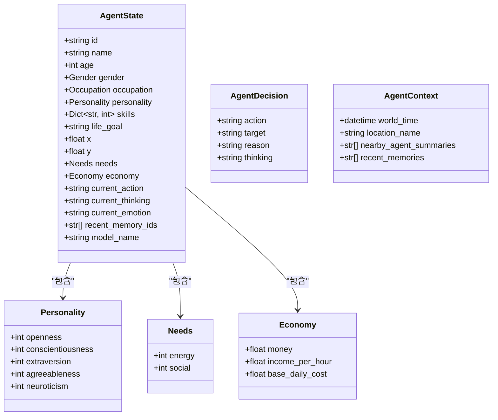

**图表来源**
- [backend/app/core/agent.py](file://backend/app/core/agent.py#L25-L92)

**章节来源**
- [backend/app/core/world.py](file://backend/app/core/world.py#L1-L40)
- [backend/app/core/agent.py](file://backend/app/core/agent.py#L1-L92)

## 架构概览

系统采用分层架构，每层都有明确的职责分工：

### 世界循环主流程

系统每游戏内10分钟执行一次完整的更新周期：

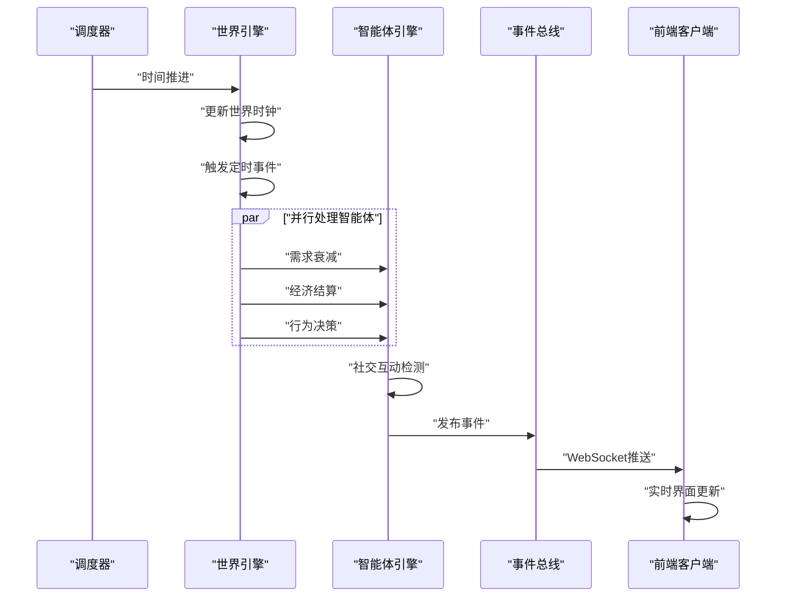

**图表来源**
- [specs/01-architecture.spec.md](file://specs/01-architecture.spec.md#L180-L203)

### LLM调用流程

智能体决策时的完整LLM调用链路：

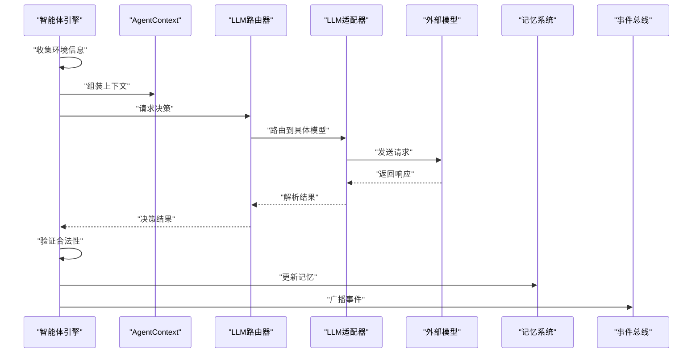

**图表来源**
- [specs/01-architecture.spec.md](file://specs/01-architecture.spec.md#L205-L227)

**章节来源**
- [specs/01-architecture.spec.md](file://specs/01-architecture.spec.md#L178-L227)

## 详细组件分析

### 世界循环详细流程

#### 时间推进机制

世界循环以游戏内10分钟为单位执行，对应现实1分钟：

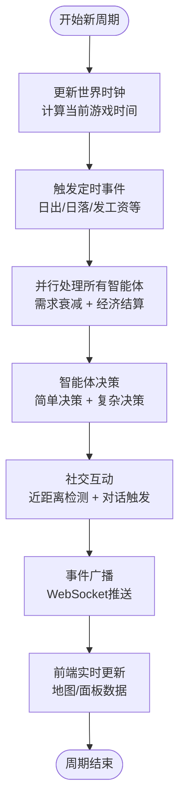

**图表来源**
- [specs/01-architecture.spec.md](file://specs/01-architecture.spec.md#L180-L203)

#### 智能体更新流程

每个智能体的更新包含多个子过程：

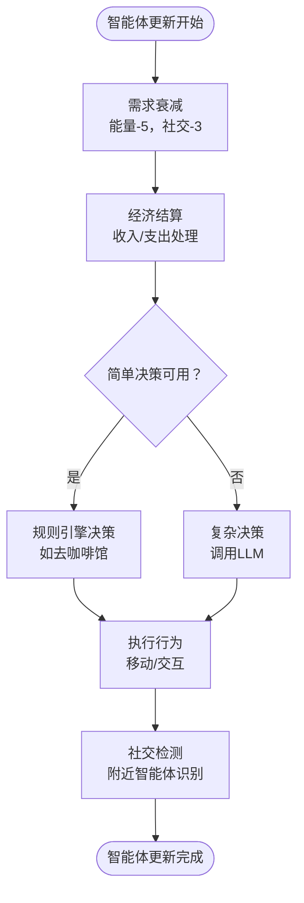

**图表来源**
- [specs/01-architecture.spec.md](file://specs/01-architecture.spec.md#L189-L194)

### LLM调用系统

#### 上下文构建

AgentContext负责收集和组织决策所需的全部信息：

| 字段名称 | 类型 | 描述 | 示例 |
|---------|------|------|------|
| world_time | datetime | 当前游戏时间 | 2024-01-15 14:30:00 |
| location_name | string | 当前位置名称 | "时光咖啡馆" |
| nearby_agent_summaries | List[string] | 附近智能体简述 | ["程序员李明", "设计师王芳"] |
| recent_memories | List[string] | 最近记忆片段 | ["昨天的会议讨论"] |

#### 模型路由机制

LLMRouter根据智能体配置选择合适的模型：

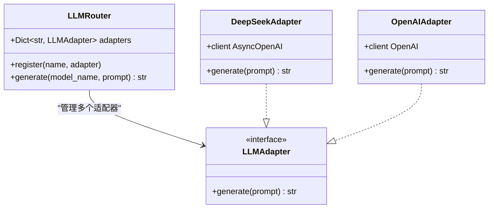

**图表来源**
- [specs/08-implementation-plan.spec.md](file://specs/08-implementation-plan.spec.md#L115-L137)

#### 响应解析与决策执行

LLM响应的标准化处理流程：

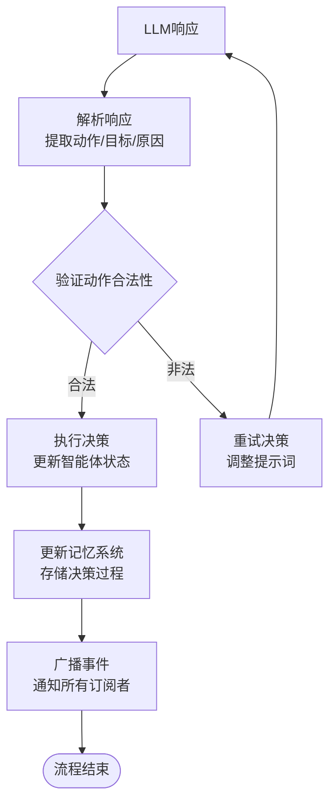

**图表来源**
- [specs/01-architecture.spec.md](file://specs/01-architecture.spec.md#L219-L226)

**章节来源**
- [specs/04-conversation-system.spec.md](file://specs/04-conversation-system.spec.md#L190-L240)
- [specs/08-implementation-plan.spec.md](file://specs/08-implementation-plan.spec.md#L115-L137)

### 经济系统数据流

经济系统的数据在多个层面流转：

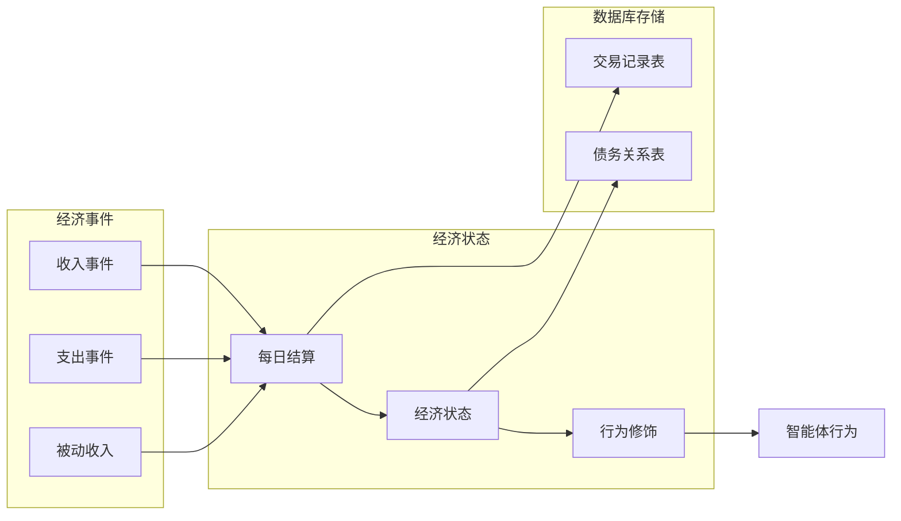

**图表来源**
- [specs/03-economy-system.spec.md](file://specs/03-economy-system.spec.md#L90-L156)

**章节来源**
- [specs/03-economy-system.spec.md](file://specs/03-economy-system.spec.md#L1-L418)

### 对话系统数据流

对话系统的完整数据流：

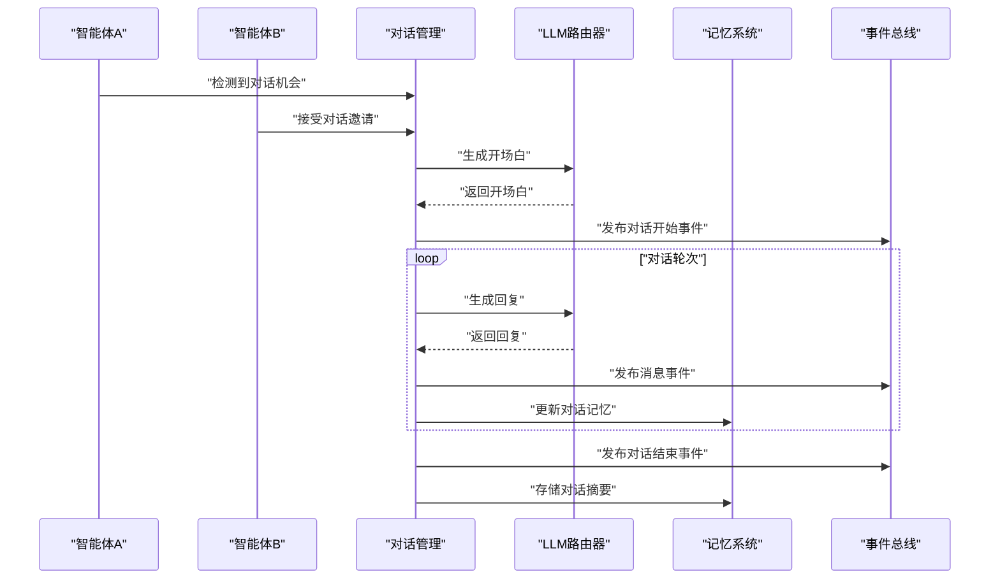

**图表来源**
- [specs/04-conversation-system.spec.md](file://specs/04-conversation-system.spec.md#L190-L240)

**章节来源**
- [specs/04-conversation-system.spec.md](file://specs/04-conversation-system.spec.md#L1-L581)

## 依赖分析

系统采用松耦合设计，各组件间通过清晰的接口交互：

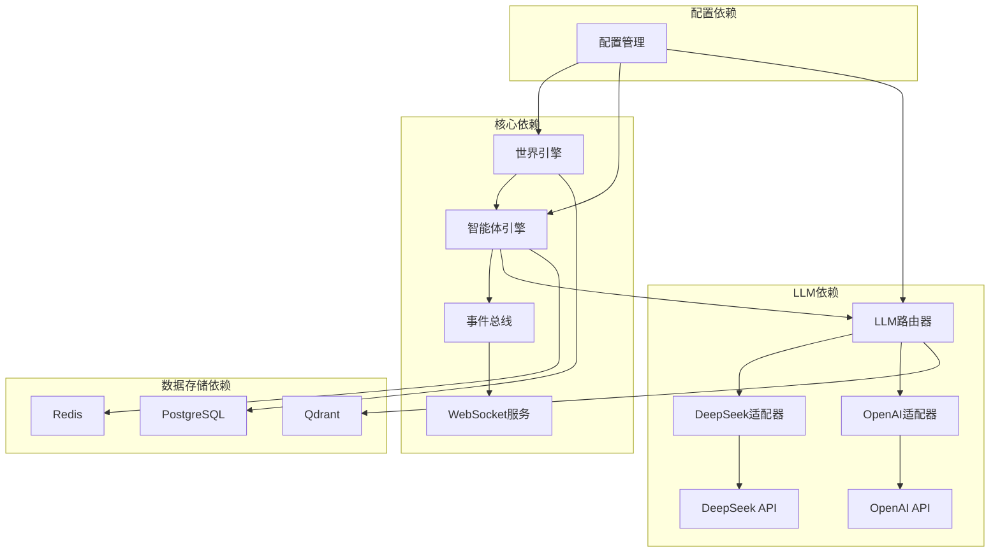

**图表来源**
- [specs/01-architecture.spec.md](file://specs/01-architecture.spec.md#L1-L255)
- [backend/app/core/config.py](file://backend/app/core/config.py#L1-L42)

**章节来源**
- [backend/app/core/config.py](file://backend/app/core/config.py#L1-L42)

## 性能考虑

### 异步处理策略

系统广泛采用异步编程模式：

- **并行智能体处理**：使用asyncio实现多个智能体的并发更新
- **异步WebSocket**：支持大量客户端的实时数据推送
- **非阻塞IO操作**：数据库和外部API调用采用异步模式
- **事件驱动架构**：通过事件总线实现解耦的数据传递

### 数据一致性保证

系统通过多种机制确保数据一致性：

- **原子性操作**：关键业务操作使用数据库事务
- **最终一致性**：通过事件总线实现跨组件的数据同步
- **版本控制**：智能体状态包含last_updated时间戳
- **冲突解决**：并发更新时采用最后写入获胜策略

### 性能优化建议

1. **缓存策略**
   - Redis缓存热点数据
   - LRU缓存最近使用的LLM响应
   - 地图瓦片缓存

2. **批处理优化**
   - 批量更新智能体状态
   - 批量推送WebSocket事件
   - 批量写入数据库

3. **资源池管理**
   - LLM客户端连接池
   - 数据库连接池
   - 线程池管理CPU密集型任务

## 故障排除指南

### 常见错误类型

| 错误类型 | 触发条件 | 处理策略 |
|---------|---------|---------|
| LLM调用失败 | API超时/认证失败 | 重试机制 + 降级策略 |
| 数据库连接异常 | 连接池耗尽 | 连接池监控 + 自动恢复 |
| WebSocket断开 | 网络波动 | 自动重连 + 事件重放 |
| 智能体状态冲突 | 并发更新冲突 | 版本检查 + 冲突解决 |

### 错误处理流程

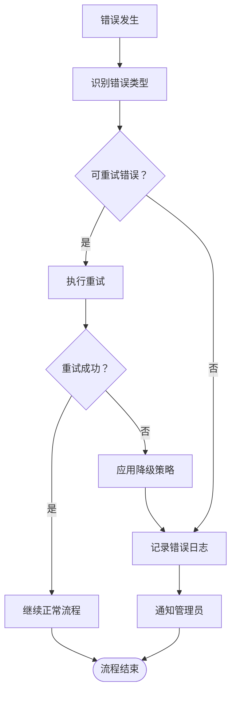

**章节来源**
- [specs/06-api-design.spec.md](file://specs/06-api-design.spec.md#L619-L634)

## 结论

AI Society项目通过精心设计的数据流架构，实现了复杂世界的实时模拟。系统的关键优势包括：

1. **清晰的分层架构**：从表现层到数据持久层的完整分层设计
2. **高效的异步处理**：充分利用异步编程提升系统吞吐量
3. **灵活的LLM集成**：支持多模型提供商的统一抽象
4. **强大的事件驱动**：通过事件总线实现组件间的松耦合交互
5. **完善的性能优化**：从缓存策略到批处理优化的全方位考虑

该架构为AI Society项目提供了坚实的技术基础，能够支持大规模智能体的并发运行和实时交互，为用户创造沉浸式的AI世界体验。