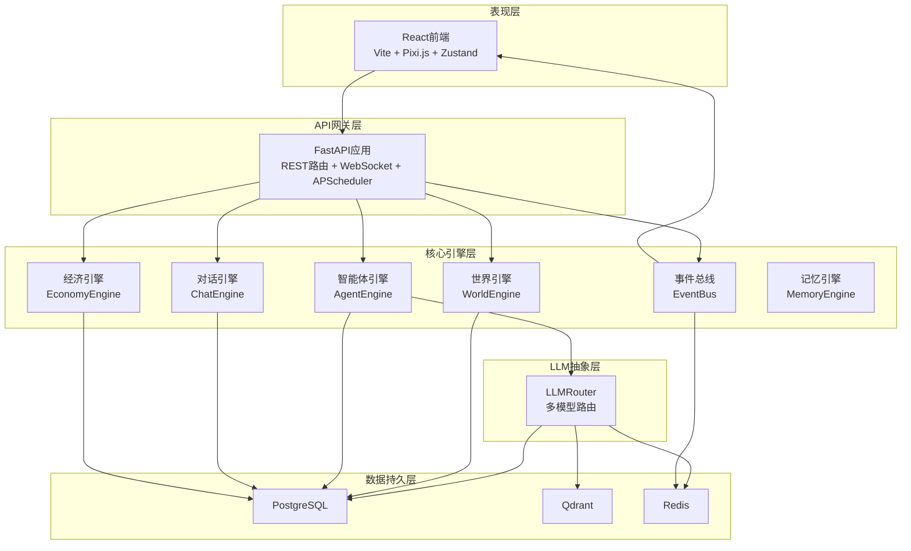
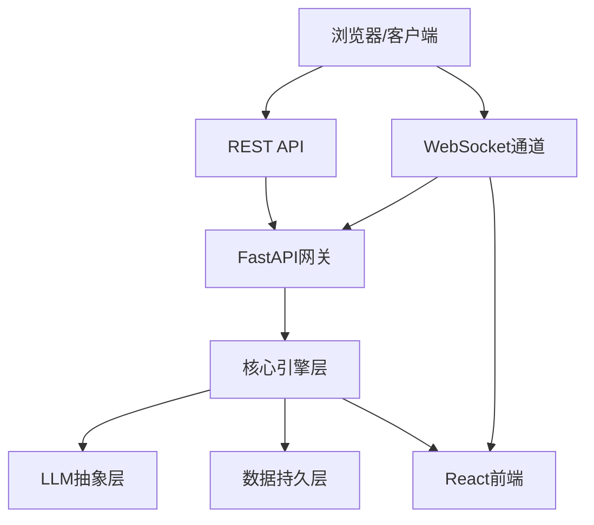
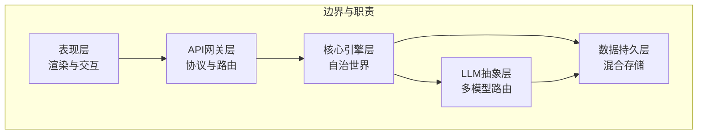
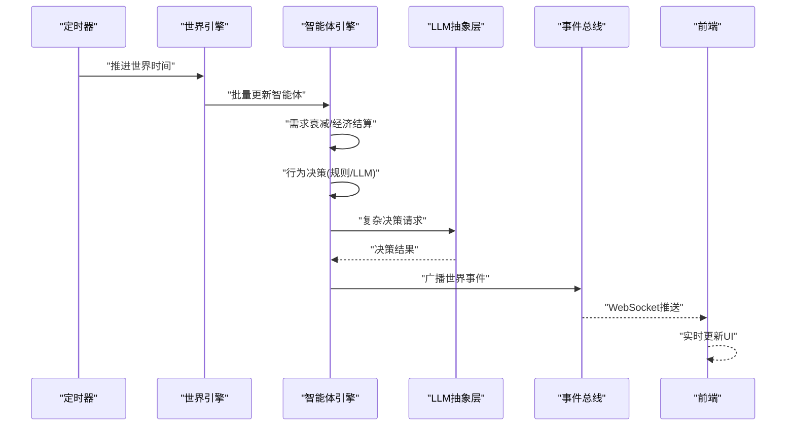
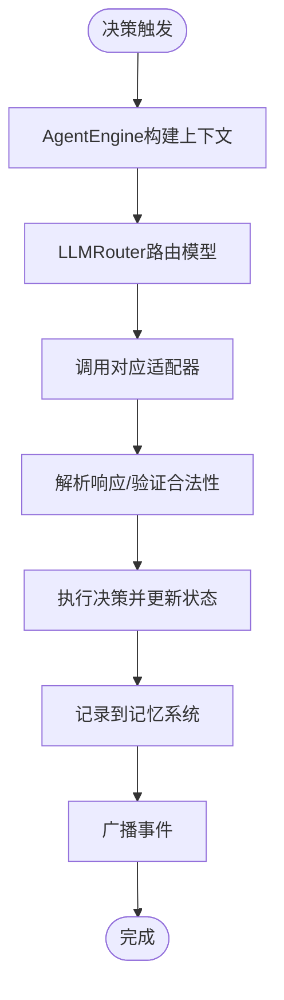
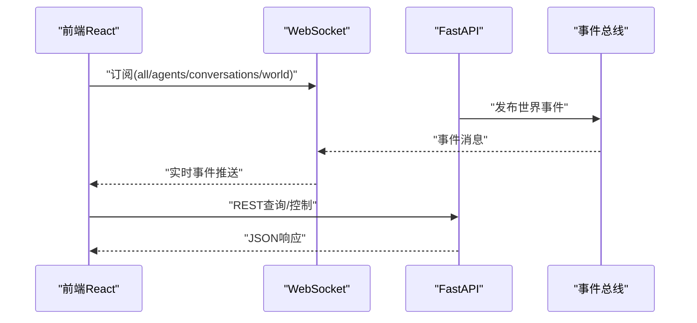
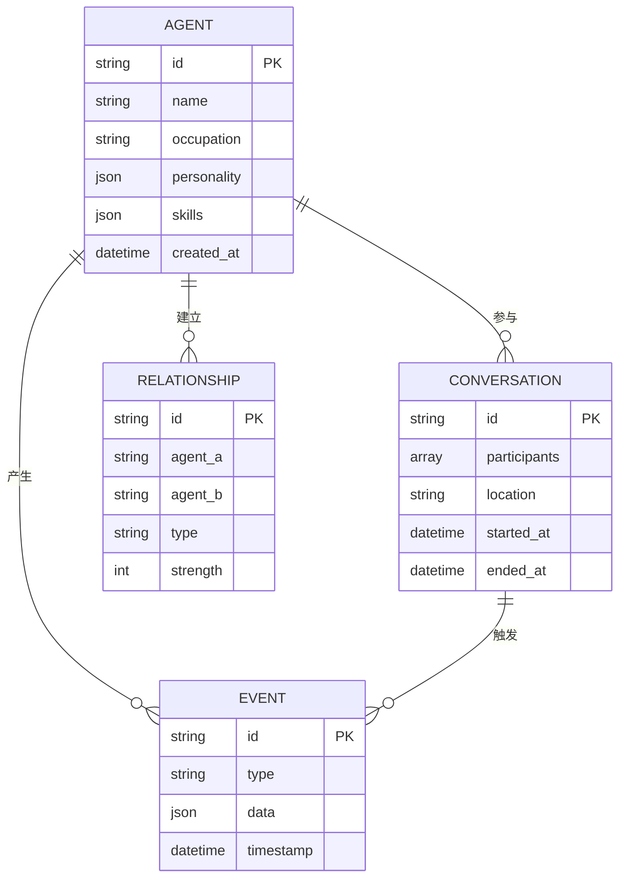
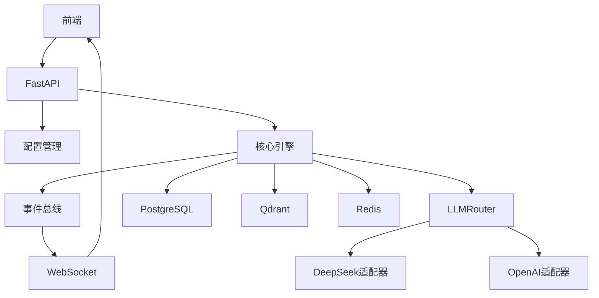

# 整体架构设计

<cite>
**本文档引用的文件**
- [01-架构规格说明.md](file://specs/01-architecture.spec.md)
- [00-项目概述.md](file://specs/00-project-overview.spec.md)
- [06-API与通信协议规格说明.md](file://specs/06-api-design.spec.md)
- [07-前端界面规格说明.md](file://specs/07-frontend.spec.md)
- [agent.py](file://backend/app/core/agent.py)
- [world.py](file://backend/app/core/world.py)
- [config.py](file://backend/app/core/config.py)
</cite>

## 目录
1. [简介](#简介)
2. [项目结构](#项目结构)
3. [核心组件](#核心组件)
4. [架构总览](#架构总览)
5. [详细组件分析](#详细组件分析)
6. [依赖关系分析](#依赖关系分析)
7. [性能考虑](#性能考虑)
8. [故障排查指南](#故障排查指南)
9. [结论](#结论)
10. [附录](#附录)

## 简介
AI Society 是一个开源的自治智能体社会实验平台，旨在构建一个可观察、可研究的AI自治世界。系统采用前后端分离架构，通过FastAPI提供REST API与WebSocket事件流，React前端负责实时可视化与交互，核心引擎层承载世界时钟、智能体系统、经济系统与事件总线，LLM抽象层实现多模型路由与适配，数据持久层以PostgreSQL、Qdrant与Redis构成混合存储体系。

## 项目结构
系统采用分层架构与微服务思想结合的模块化组织方式：
- 表现层：React前端（Vite构建、Pixi.js渲染、Zustand状态管理）
- API网关层：FastAPI（REST路由、WebSocket、后台任务调度）
- 核心引擎层：世界引擎、智能体引擎、事件总线、对话与经济引擎
- LLM抽象层：多模型路由与适配器
- 数据持久层：PostgreSQL、Qdrant、Redis

**图表来源**
- [01-架构规格说明.md](file://specs/01-architecture.spec.md#L1-L248)
- [07-前端界面规格说明.md](file://specs/07-frontend.spec.md#L1-L650)
- [06-API与通信协议规格说明.md](file://specs/06-api-design.spec.md#L1-L655)

**章节来源**
- [01-架构规格说明.md](file://specs/01-architecture.spec.md#L92-L169)
- [07-前端界面规格说明.md](file://specs/07-frontend.spec.md#L594-L650)
- [06-API与通信协议规格说明.md](file://specs/06-api-design.spec.md#L10-L16)

## 核心组件
- 表现层（React前端）
  - 技术栈：React 18、Vite、Pixi.js 8、Zustand、TailwindCSS、Recharts
  - 职责：实时渲染2D世界地图、智能体精灵与对话气泡；管理世界时间、智能体状态、事件流与统计数据；通过原生WebSocket订阅实时事件
- API网关层（FastAPI）
  - 技术栈：FastAPI、APScheduler、Pydantic
  - 职责：提供REST API与WebSocket；统一响应格式与错误处理；后台任务调度；配置管理与环境隔离
- 核心引擎层
  - 世界引擎：管理世界时钟与全局状态
  - 智能体引擎：维护智能体状态、需求与经济；触发行为决策；与LLM抽象层交互
  - 事件总线：广播世界事件至WebSocket通道
  - 对话引擎：管理对话生命周期与关系变化
  - 经济引擎：模拟现实对齐的收入、支出与财富分配
  - 记忆引擎：检索与存储智能体记忆（向量与结构化）
- LLM抽象层
  - LLMRouter：根据智能体配置路由到不同模型（DeepSeek、OpenAI、Claude、本地Ollama）
  - 适配器：标准化模型调用接口，支持复杂决策与日常对话
- 数据持久层
  - PostgreSQL：结构化数据（智能体、事件、关系、对话）
  - Qdrant：向量记忆与相似检索
  - Redis：缓存、会话与消息队列

**章节来源**
- [01-架构规格说明.md](file://specs/01-architecture.spec.md#L59-L91)
- [07-前端界面规格说明.md](file://specs/07-frontend.spec.md#L12-L23)
- [06-API与通信协议规格说明.md](file://specs/06-api-design.spec.md#L3-L9)
- [agent.py](file://backend/app/core/agent.py#L25-L92)
- [world.py](file://backend/app/core/world.py#L8-L40)
- [config.py](file://backend/app/core/config.py#L7-L42)

## 架构总览
系统采用事件驱动与微服务思想，前后端分离，通过REST API与WebSocket实现解耦的数据与事件流。核心引擎层负责自治世界的运行逻辑，LLM抽象层提供灵活的智能体决策能力，数据持久层支撑结构化与向量检索。

**图表来源**
- [01-架构规格说明.md](file://specs/01-architecture.spec.md#L14-L57)
- [06-API与通信协议规格说明.md](file://specs/06-api-design.spec.md#L411-L425)
- [07-前端界面规格说明.md](file://specs/07-frontend.spec.md#L360-L407)

## 详细组件分析

### 分层架构与职责边界
- 表现层边界：仅负责UI渲染与用户交互，不直接访问数据库或LLM
- API网关边界：统一接入与协议转换，不承载业务逻辑
- 核心引擎边界：自治世界运行的核心，封装复杂业务规则
- LLM抽象边界：屏蔽多模型差异，提供统一决策接口
- 数据持久边界：按数据类型与访问模式分离存储

**图表来源**
- [01-架构规格说明.md](file://specs/01-architecture.spec.md#L3-L57)
- [06-API与通信协议规格说明.md](file://specs/06-api-design.spec.md#L10-L16)
- [07-前端界面规格说明.md](file://specs/07-frontend.spec.md#L12-L23)

### 世界循环与事件驱动流程
系统以“世界循环”为核心驱动，每固定间隔推进时间、更新智能体状态、触发社交互动，并通过事件总线广播到前端。

**图表来源**
- [01-架构规格说明.md](file://specs/01-architecture.spec.md#L171-L196)
- [01-架构规格说明.md](file://specs/01-architecture.spec.md#L198-L220)

**章节来源**
- [01-架构规格说明.md](file://specs/01-architecture.spec.md#L171-L220)

### LLM调用与路由流程
智能体需要复杂决策时，AgentEngine构建上下文，LLMRouter根据模型配置路由到对应适配器，解析响应并执行决策。

**图表来源**
- [01-架构规格说明.md](file://specs/01-architecture.spec.md#L198-L220)

**章节来源**
- [01-架构规格说明.md](file://specs/01-architecture.spec.md#L198-L220)

### 前后端分离与实时通信
- 前端通过原生WebSocket订阅事件频道，实现低延迟实时更新
- REST API提供查询与控制能力，统一响应格式与错误码
- 前端组件通过Zustand集中管理世界、智能体、事件与对话状态

**图表来源**
- [06-API与通信协议规格说明.md](file://specs/06-api-design.spec.md#L411-L425)
- [06-API与通信协议规格说明.md](file://specs/06-api-design.spec.md#L597-L617)
- [07-前端界面规格说明.md](file://specs/07-frontend.spec.md#L360-L407)

**章节来源**
- [06-API与通信协议规格说明.md](file://specs/06-api-design.spec.md#L411-L425)
- [07-前端界面规格说明.md](file://specs/07-frontend.spec.md#L360-L407)

### 数据模型与存储策略
- 结构化数据：智能体、事件、关系、对话等保存在PostgreSQL
- 向量记忆：使用Qdrant进行相似检索与上下文召回
- 缓存与消息：Redis承担缓存、会话与消息队列

**图表来源**
- [01-架构规格说明.md](file://specs/01-architecture.spec.md#L50-L56)
- [06-API与通信协议规格说明.md](file://specs/06-api-design.spec.md#L20-L42)

**章节来源**
- [01-架构规格说明.md](file://specs/01-architecture.spec.md#L50-L56)
- [06-API与通信协议规格说明.md](file://specs/06-api-design.spec.md#L20-L42)

## 依赖关系分析
- 组件内聚与解耦
  - 前端与后端通过API解耦，前端不关心后端实现细节
  - 核心引擎层内部通过事件总线解耦各子系统
  - LLM抽象层通过Router与适配器实现多模型可插拔
- 外部依赖
  - FastAPI与Pydantic提供类型安全与高性能
  - Pixi.js提供大规模精灵的高效渲染
  - PostgreSQL、Qdrant、Redis满足不同数据特征
- 微服务思想
  - 各引擎相对独立，便于扩展与替换
  - 通过事件总线实现松耦合通信

**图表来源**
- [01-架构规格说明.md](file://specs/01-architecture.spec.md#L14-L57)
- [07-前端界面规格说明.md](file://specs/07-frontend.spec.md#L12-L23)
- [06-API与通信协议规格说明.md](file://specs/06-api-design.spec.md#L10-L16)

**章节来源**
- [01-架构规格说明.md](file://specs/01-architecture.spec.md#L14-L57)
- [07-前端界面规格说明.md](file://specs/07-frontend.spec.md#L12-L23)
- [06-API与通信协议规格说明.md](file://specs/06-api-design.spec.md#L10-L16)

## 性能考虑
- 智能体规模：目标支持50-200个智能体
- 前端帧率：追求60fps流畅渲染
- API响应：小于100ms
- WebSocket延迟：小于50ms
- LLM调用频率：每个智能体每10分钟（游戏内）最多1次
- 内存占用：控制在2GB以内

优化建议
- 前端：使用对象池与可见区域裁剪减少渲染负载；批量更新状态合并重绘
- 后端：异步处理与并发调度；缓存热点数据；合理分页与索引
- LLM：按需调用与上下文压缩；模型路由与成本控制

**章节来源**
- [01-架构规格说明.md](file://specs/01-architecture.spec.md#L238-L248)
- [07-前端界面规格说明.md](file://specs/07-frontend.spec.md#L485-L540)

## 故障排查指南
- WebSocket连接问题
  - 检查订阅消息格式与频道参数
  - 确认后端事件总线正常广播
- REST API错误
  - 查看统一错误响应与错误码表
  - 核对参数与速率限制
- LLM调用失败
  - 检查模型路由配置与API密钥
  - 验证提示词模板与上下文组装
- 前端渲染异常
  - 检查Pixi.js图层与动画逻辑
  - 确认Zustand状态同步与内存清理

**章节来源**
- [06-API与通信协议规格说明.md](file://specs/06-api-design.spec.md#L619-L655)
- [07-前端界面规格说明.md](file://specs/07-frontend.spec.md#L360-L407)

## 结论
AI Society通过清晰的分层架构与事件驱动设计，实现了前后端分离、模块化与可扩展的自治世界平台。FastAPI与React分别承担协议与渲染的职责，核心引擎与LLM抽象层提供强大的自治能力，混合存储体系满足多样化数据需求。该架构既保证了系统的稳定性与可维护性，也为未来扩展提供了坚实基础。

## 附录
- 技术栈选型理由
  - 后端：FastAPI异步原生、类型安全、自动文档；APScheduler轻量易集成；SQLAlchemy 2.0异步支持；PostgreSQL稳定可靠；Qdrant开源高性能；Redis标准方案
  - 前端：React生态成熟；Vite快速开发；Pixi.js WebGL加速；Zustand低耦合；TailwindCSS快速样式；原生WebSocket
- 部署拓扑
  - 建议容器化部署，使用Docker Compose编排；前端静态资源可单独部署；后端服务与数据库分离；Redis与Qdrant独立部署以获得更好性能

**章节来源**
- [01-架构规格说明.md](file://specs/01-architecture.spec.md#L59-L91)
- [00-项目概述.md](file://specs/00-project-overview.spec.md#L37-L42)