# 目录结构设计

<cite>
**本文档引用的文件**
- [backend/app/__init__.py](file://backend/app/__init__.py)
- [backend/app/core/agent.py](file://backend/app/core/agent.py)
- [backend/app/core/config.py](file://backend/app/core/config.py)
- [backend/app/core/world.py](file://backend/app/core/world.py)
- [specs/00-project-overview.spec.md](file://specs/00-project-overview.spec.md)
- [specs/01-architecture.spec.md](file://specs/01-architecture.spec.md)
- [specs/03-economy-system.spec.md](file://specs/03-economy-system.spec.md)
- [specs/04-conversation-system.spec.md](file://specs/04-conversation-system.spec.md)
- [specs/06-api-design.spec.md](file://specs/06-api-design.spec.md)
- [specs/08-implementation-plan.spec.md](file://specs/08-implementation-plan.spec.md)
</cite>

## 目录
1. [简介](#简介)
2. [项目结构](#项目结构)
3. [核心组件](#核心组件)
4. [架构概览](#架构概览)
5. [详细组件分析](#详细组件分析)
6. [依赖分析](#依赖分析)
7. [性能考虑](#性能考虑)
8. [故障排除指南](#故障排除指南)
9. [结论](#结论)
10. [附录](#附录)

## 简介

AI Society是一个开源的AI自治世界观察实验平台，旨在创建一个包含50+个智能体的虚拟社会，让智能体在其中自由生活、交流、发展。该项目采用前后端分离的架构设计，后端基于FastAPI构建，前端使用React + Pixi.js技术栈。

本项目的核心理念是"纯观察"和"自治优先"，智能体按照自己的想法生活，系统不强制剧本。经济系统与现实世界对齐，能够体现真实的生活压力和行为模式。

## 项目结构

AI Society项目采用清晰的分层架构，主要分为backend/和frontend/两个核心目录：

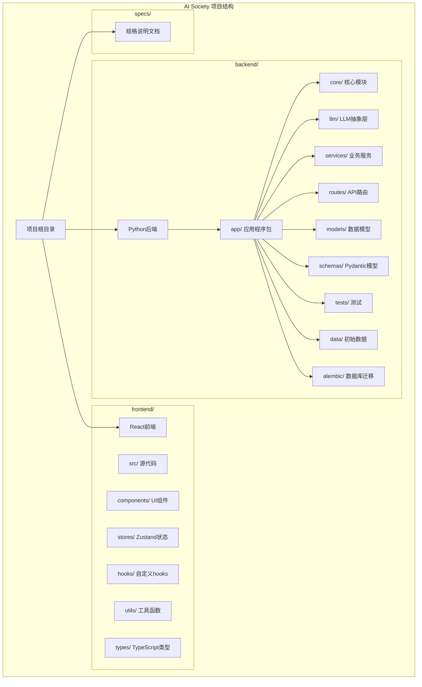

**图表来源**
- [specs/01-architecture.spec.md](file://specs/01-architecture.spec.md#L99-L176)

### backend/ 目录结构设计

backend/目录是整个项目的核心，采用模块化的组织方式：

#### 核心模块 (core/)
- **agent.py**: 智能体核心数据结构和行为定义
- **config.py**: 配置管理系统，支持多环境配置
- **world.py**: 世界引擎，管理时间和空间维度

#### 业务服务 (services/)
- **world_service.py**: 世界状态管理服务
- **agent_service.py**: 智能体生命周期管理
- **chat_service.py**: 对话系统服务
- **spawn_service.py**: 智能体生成服务

#### API路由 (routes/)
- **world.py**: 世界状态相关API
- **agents.py**: 智能体相关API
- **stream.py**: WebSocket实时流

#### 数据模型 (models/)
- **agent.py**: 智能体数据库模型
- **event.py**: 事件模型
- **conversation.py**: 对话模型
- **relationship.py**: 关系模型

#### LLM抽象层 (llm/)
- **router.py**: 多模型路由管理
- **deepseek.py**: DeepSeek适配器
- **openai.py**: OpenAI适配器
- **prompts.py**: 提示词模板管理

**章节来源**
- [specs/01-architecture.spec.md](file://specs/01-architecture.spec.md#L102-L176)

### frontend/ 目录结构设计

frontend/目录采用React + Vite的现代前端架构：

#### 源代码 (src/)
- **App.tsx**: 应用入口组件
- **main.tsx**: 主要入口文件
- **components/**: UI组件库
- **stores/**: Zustand状态管理
- **hooks/**: 自定义React hooks
- **utils/**: 工具函数库
- **types/**: TypeScript类型定义

#### 组件层次
- **WorldMap.tsx**: Pixi.js地图渲染
- **AgentSprite.tsx**: 智能体精灵渲染
- **AgentPanel.tsx**: 智能体信息面板
- **EventStream.tsx**: 实时事件流
- **StatsPanel.tsx**: 统计信息面板

**章节来源**
- [specs/01-architecture.spec.md](file://specs/01-architecture.spec.md#L145-L166)

## 核心组件

### 配置管理系统

配置管理系统采用Pydantic的BaseSettings类，支持多环境配置和缓存优化：

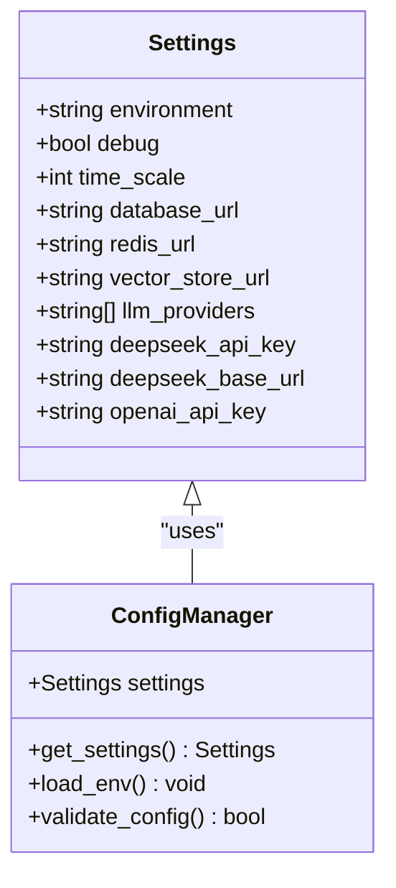

**图表来源**
- [backend/app/core/config.py](file://backend/app/core/config.py#L7-L42)

### 智能体数据模型

智能体系统采用数据类设计，支持复杂的行为模拟：

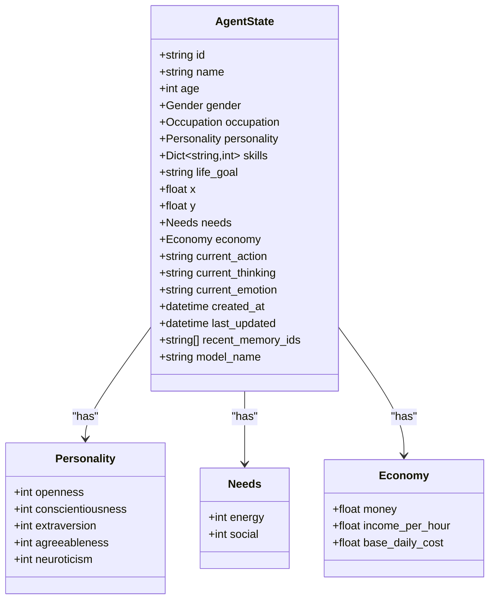

**图表来源**
- [backend/app/core/agent.py](file://backend/app/core/agent.py#L25-L92)

### 世界引擎

世界引擎负责管理虚拟世界的时钟和空间：

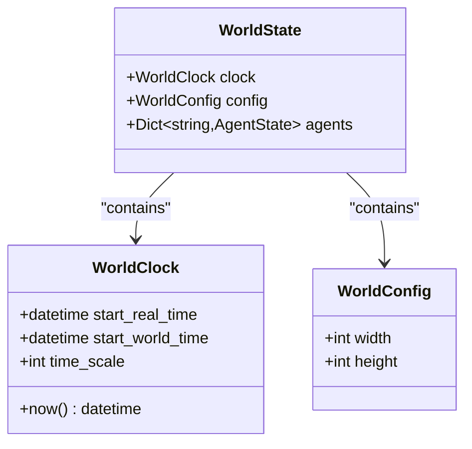

**图表来源**
- [backend/app/core/world.py](file://backend/app/core/world.py#L8-L40)

**章节来源**
- [backend/app/core/config.py](file://backend/app/core/config.py#L1-L42)
- [backend/app/core/agent.py](file://backend/app/core/agent.py#L1-L92)
- [backend/app/core/world.py](file://backend/app/core/world.py#L1-L40)

## 架构概览

AI Society采用分层架构设计，确保系统的可扩展性和维护性：

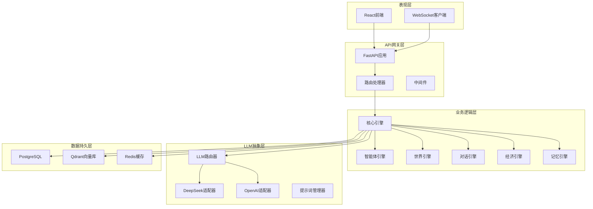

**图表来源**
- [specs/01-architecture.spec.md](file://specs/01-architecture.spec.md#L3-L57)

### 数据流架构

系统采用事件驱动的数据流设计：

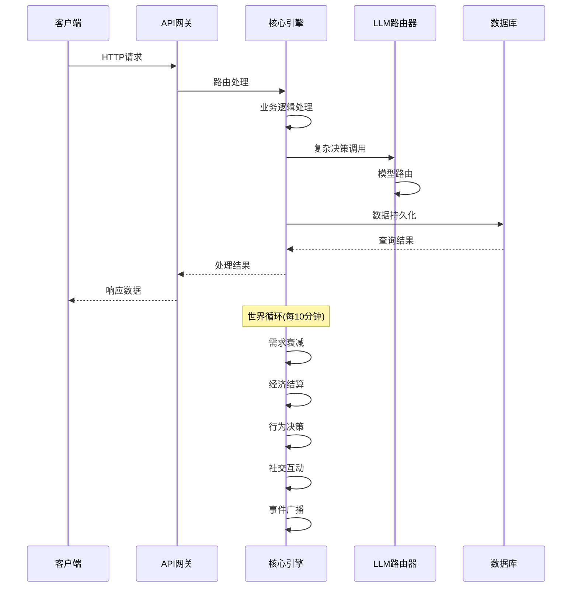

**图表来源**
- [specs/01-architecture.spec.md](file://specs/01-architecture.spec.md#L180-L203)

**章节来源**
- [specs/01-architecture.spec.md](file://specs/01-architecture.spec.md#L1-L255)

## 详细组件分析

### LLM抽象层设计

LLM抽象层采用适配器模式，支持多种大语言模型：

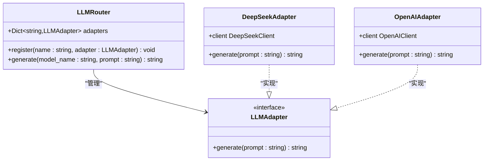

**图表来源**
- [specs/08-implementation-plan.spec.md](file://specs/08-implementation-plan.spec.md#L115-L137)

### 经济系统设计

经济系统与现实世界对齐，体现真实的生活压力：

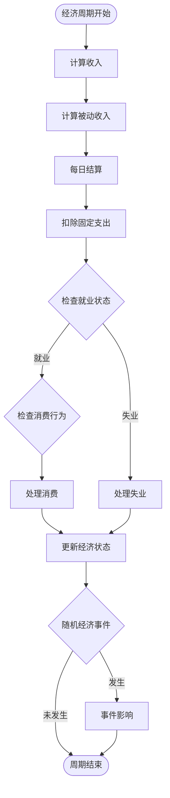

**图表来源**
- [specs/03-economy-system.spec.md](file://specs/03-economy-system.spec.md#L91-L109)

### 对话系统设计

对话系统是观察智能体的核心窗口：

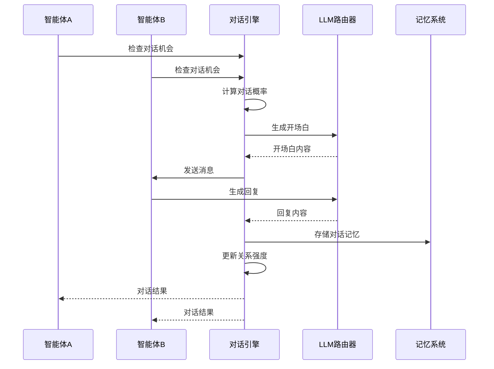

**图表来源**
- [specs/04-conversation-system.spec.md](file://specs/04-conversation-system.spec.md#L211-L240)

**章节来源**
- [specs/03-economy-system.spec.md](file://specs/03-economy-system.spec.md#L1-L418)
- [specs/04-conversation-system.spec.md](file://specs/04-conversation-system.spec.md#L1-L581)

### API设计规范

REST API采用统一的设计规范：

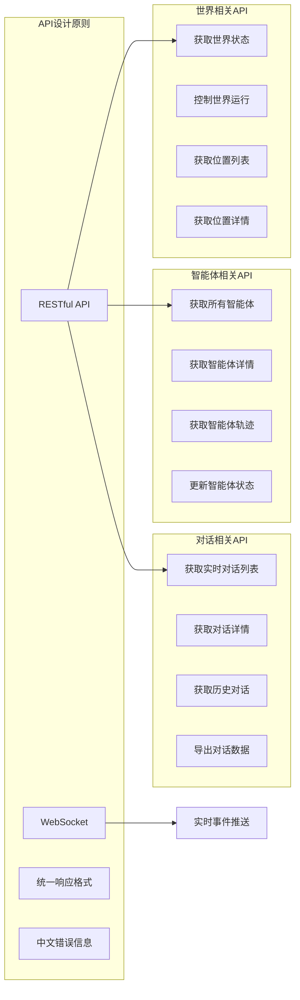

**图表来源**
- [specs/06-api-design.spec.md](file://specs/06-api-design.spec.md#L18-L380)

**章节来源**
- [specs/06-api-design.spec.md](file://specs/06-api-design.spec.md#L1-L460)

## 依赖分析

### 模块依赖关系

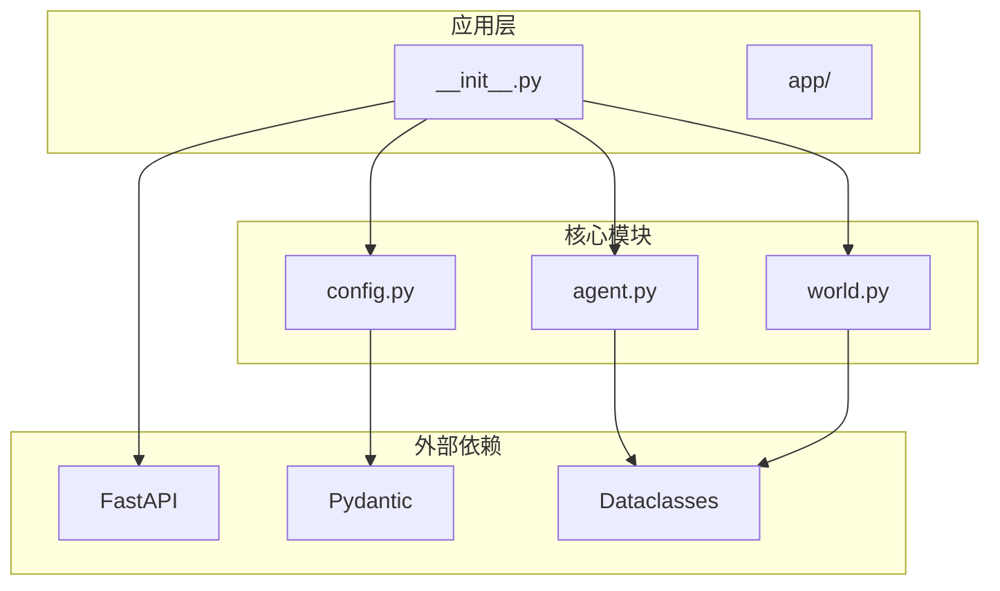

**图表来源**
- [backend/app/__init__.py](file://backend/app/__init__.py#L1-L22)
- [backend/app/core/config.py](file://backend/app/core/config.py#L1-L5)
- [backend/app/core/agent.py](file://backend/app/core/agent.py#L1-L7)
- [backend/app/core/world.py](file://backend/app/core/world.py#L1-L6)

### 数据模型依赖

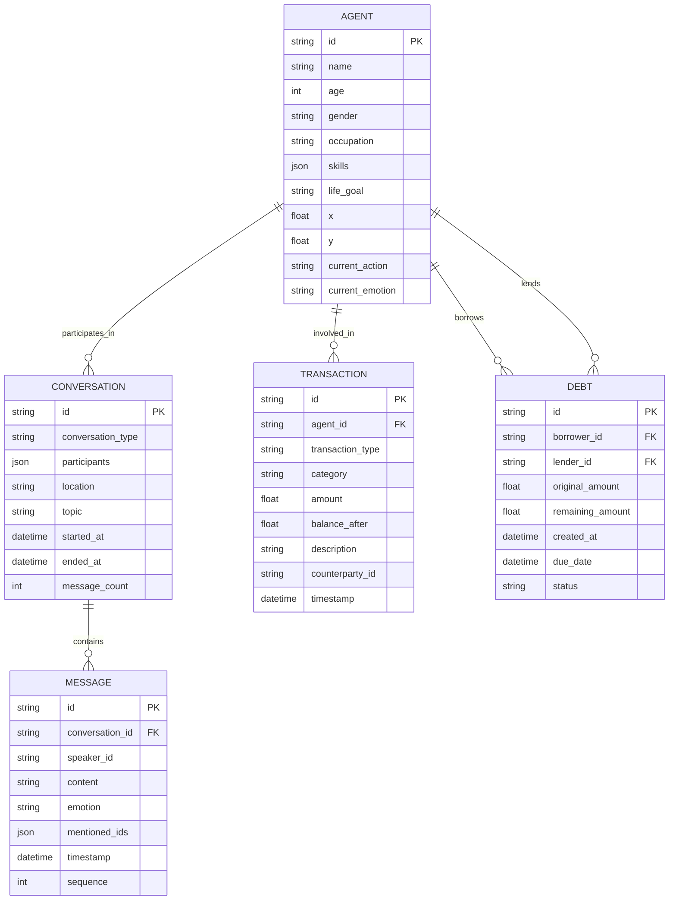

**图表来源**
- [specs/03-economy-system.spec.md](file://specs/03-economy-system.spec.md#L315-L342)
- [specs/04-conversation-system.spec.md](file://specs/04-conversation-system.spec.md#L509-L536)

**章节来源**
- [backend/app/__init__.py](file://backend/app/__init__.py#L1-L22)
- [specs/03-economy-system.spec.md](file://specs/03-economy-system.spec.md#L312-L342)
- [specs/04-conversation-system.spec.md](file://specs/04-conversation-system.spec.md#L506-L536)

## 性能考虑

### 性能指标目标

系统设计遵循严格的性能指标：

| 指标类别 | 目标值 | 说明 |
|---------|--------|------|
| 智能体数量 | 50-200 | 支持大规模并发 |
| 前端帧率 | 60fps | 流畅的动画效果 |
| API响应时间 | <100ms | 快速的用户交互 |
| WebSocket延迟 | <50ms | 实时事件推送 |
| LLM调用频率 | 每智能体每10分钟最多1次 | 控制成本和延迟 |
| 内存占用 | <2GB | 优化资源使用 |

### 扩展性设计

系统采用模块化设计，支持灵活扩展：

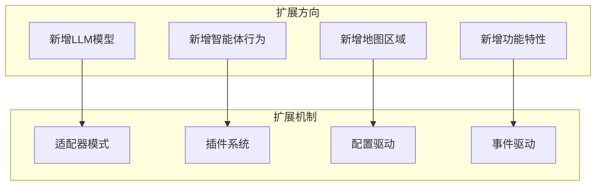

## 故障排除指南

### 常见问题诊断

1. **LLM调用失败**
   - 检查API密钥配置
   - 验证网络连接
   - 查看调用频率限制

2. **数据库连接问题**
   - 确认数据库URL配置
   - 检查数据库服务状态
   - 验证连接权限

3. **WebSocket连接异常**
   - 检查防火墙设置
   - 验证证书配置
   - 查看连接池状态

4. **性能问题**
   - 监控CPU和内存使用
   - 分析慢查询日志
   - 优化缓存策略

### 调试工具

- **日志系统**: 结构化日志记录
- **监控仪表板**: 实时性能监控
- **调试接口**: 开发环境专用接口
- **错误报告**: 用户友好的错误信息

## 结论

AI Society项目采用了先进的分层架构设计，通过清晰的目录结构和模块化组织，实现了高度的可扩展性和可维护性。项目的核心优势包括：

1. **模块化设计**: 清晰的职责分离和依赖管理
2. **抽象层设计**: LLM抽象层支持多模型集成
3. **事件驱动**: 基于事件的松耦合架构
4. **配置驱动**: 灵活的环境配置管理
5. **性能优化**: 面向大规模并发的优化设计

该架构为AI社会模拟提供了坚实的技术基础，支持未来的功能扩展和性能优化。

## 附录

### 目录扩展指南

#### 新增LLM模型步骤
1. 在`llm/`目录下创建适配器文件
2. 实现`LLMAdapter`接口
3. 在`LLMRouter`中注册模型
4. 添加配置参数
5. 编写集成测试

#### 新增智能体行为步骤
1. 在`core/agent.py`中定义行为类型
2. 实现行为逻辑
3. 更新提示词模板
4. 添加测试用例

#### 新增地图区域步骤
1. 在`data/locations.json`中添加配置
2. 更新前端渲染逻辑
3. 添加测试数据

### 最佳实践建议

1. **代码组织**
   - 保持单一职责原则
   - 使用清晰的命名约定
   - 编写详细的文档注释

2. **性能优化**
   - 实施缓存策略
   - 优化数据库查询
   - 使用异步处理

3. **测试覆盖**
   - 编写单元测试
   - 实施集成测试
   - 建立自动化测试流程

4. **部署运维**
   - 使用容器化部署
   - 实施监控告警
   - 建立备份恢复机制