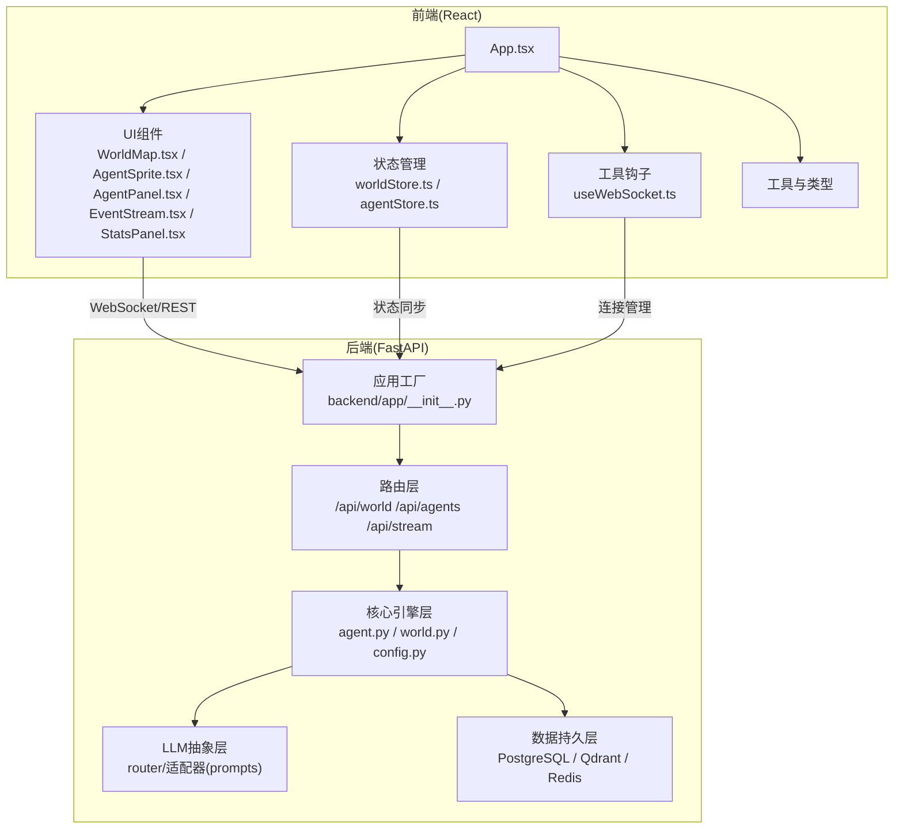
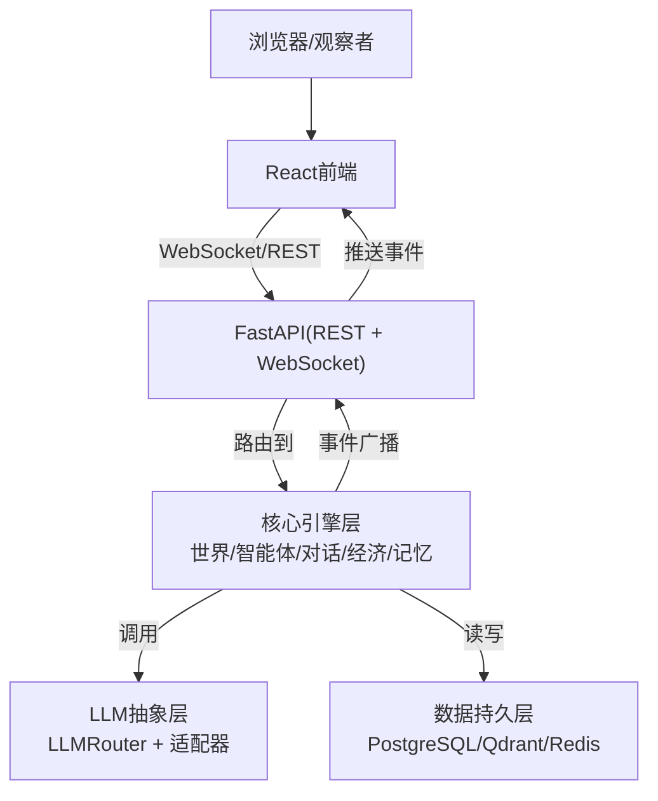
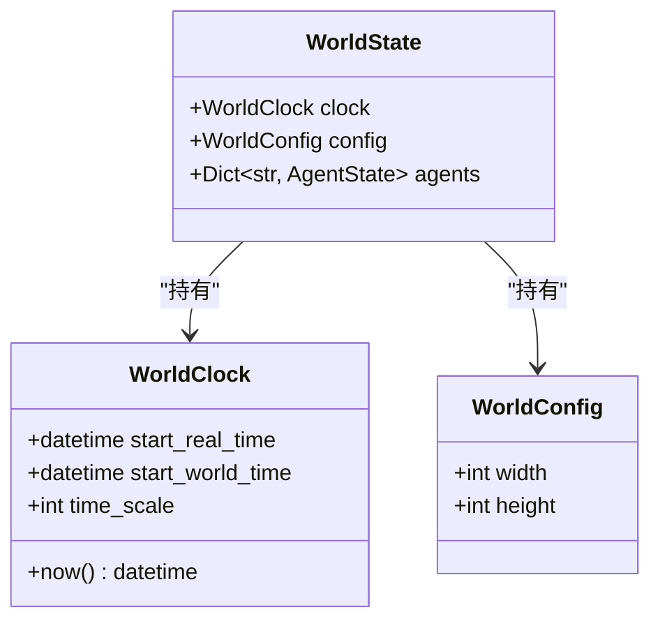
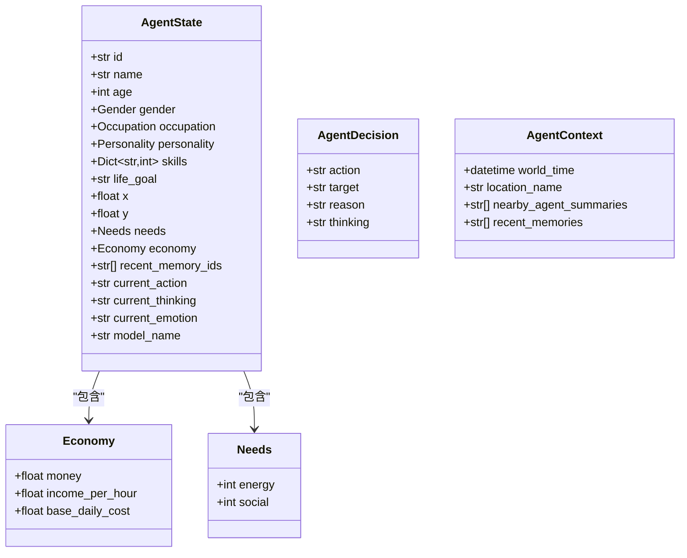
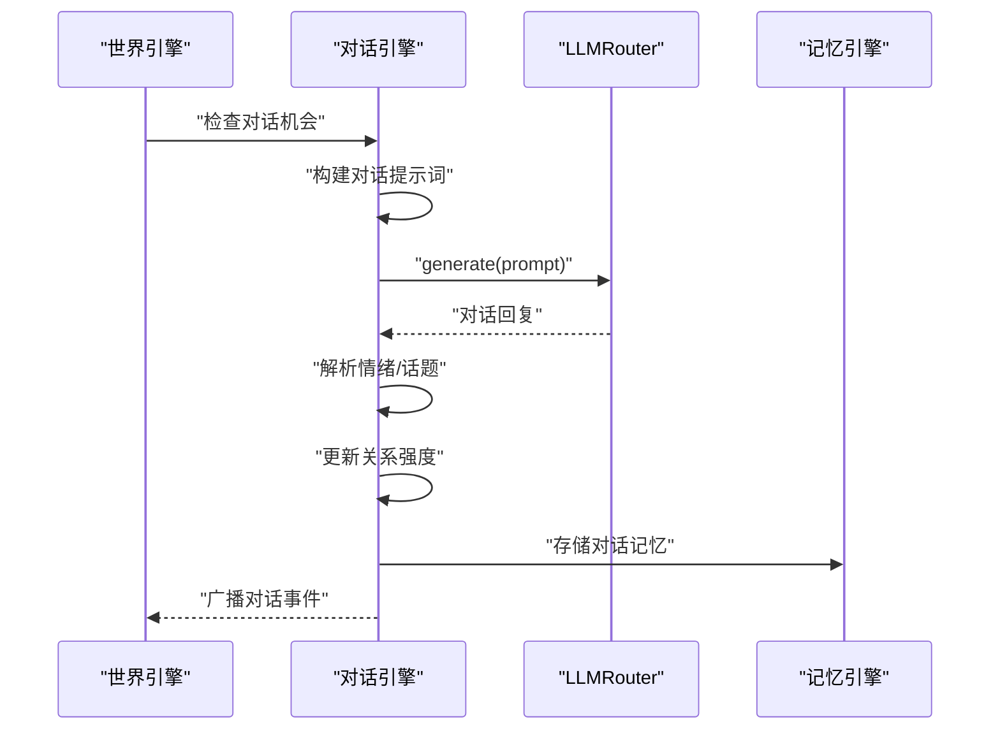
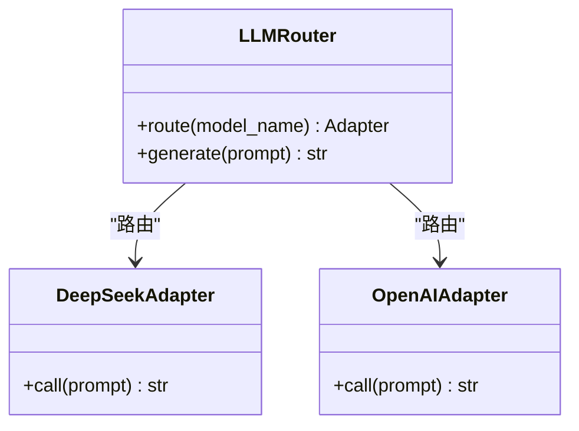
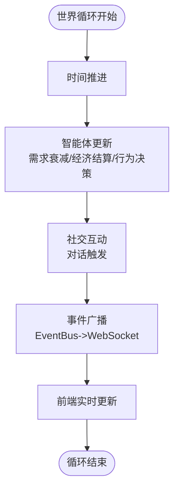
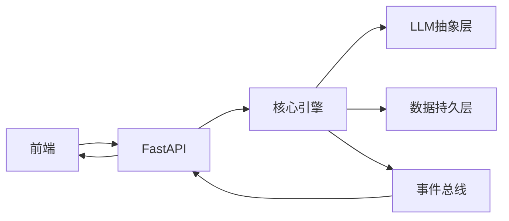

# 系统架构

<cite>
**本文档引用的文件**
- [specs/01-architecture.spec.md](file://specs/01-architecture.spec.md)
- [specs/00-project-overview.spec.md](file://specs/00-project-overview.spec.md)
- [specs/03-economy-system.spec.md](file://specs/03-economy-system.spec.md)
- [specs/04-conversation-system.spec.md](file://specs/04-conversation-system.spec.md)
- [specs/05-world-map.spec.md](file://specs/05-world-map.spec.md)
- [backend/app/__init__.py](file://backend/app/__init__.py)
- [backend/app/core/agent.py](file://backend/app/core/agent.py)
- [backend/app/core/world.py](file://backend/app/core/world.py)
- [backend/app/core/config.py](file://backend/app/core/config.py)
</cite>

## 目录
1. [简介](#简介)
2. [项目结构](#项目结构)
3. [核心组件](#核心组件)
4. [架构总览](#架构总览)
5. [详细组件分析](#详细组件分析)
6. [依赖分析](#依赖分析)
7. [性能考虑](#性能考虑)
8. [故障排查指南](#故障排查指南)
9. [结论](#结论)
10. [附录](#附录)

## 简介
本项目“AI Society”是一个面向开源研究的AI自治社会仿真平台，目标是在虚拟世界中观察50+智能体的自主演化，涵盖智能体系统、经济系统、对话与社交、世界与地图、时间系统等模块。系统采用前后端分离、事件驱动与微服务思想相结合的架构，后端基于FastAPI构建，前端使用React + Pixi.js，通过WebSocket与REST API进行实时与查询交互；核心引擎层包含世界引擎、智能体引擎、事件总线、对话引擎、经济引擎与记忆引擎；LLM抽象层提供多模型路由与适配；数据层采用PostgreSQL、Qdrant与Redis组合。

## 项目结构
系统采用分层与模块化组织方式，后端以FastAPI应用工厂为核心，路由层负责REST与WebSocket接口，核心引擎层封装业务逻辑，LLM抽象层屏蔽多模型差异，数据层提供结构化与向量化存储。前端以React为主，结合Pixi.js进行2D渲染，Zustand进行轻量状态管理，Recharts与TailwindCSS提供可视化与样式支持。

**图表来源**
- [specs/01-architecture.spec.md](file://specs/01-architecture.spec.md#L92-L169)
- [backend/app/__init__.py](file://backend/app/__init__.py#L7-L22)

**章节来源**
- [specs/01-architecture.spec.md](file://specs/01-architecture.spec.md#L92-L169)
- [backend/app/__init__.py](file://backend/app/__init__.py#L1-L22)

## 核心组件
- 应用工厂与路由
  - 应用工厂负责创建FastAPI实例并注册路由，统一暴露世界、智能体与流式接口。
- 核心引擎
  - 世界引擎：时间管理、世界配置与智能体集合。
  - 智能体引擎：智能体状态、需求、经济与决策上下文。
  - 配置管理：环境变量与多模型提供商配置。
- LLM抽象层
  - 多模型路由与适配器，统一对外接口，屏蔽不同模型差异。
- 数据持久层
  - 结构化数据(PostgreSQL)、向量记忆(Qdrant)、缓存与消息队列(Redis)。
- 前端组件
  - React组件树、Zustand状态、WebSocket钩子、Pixi.js渲染。

**章节来源**
- [backend/app/__init__.py](file://backend/app/__init__.py#L7-L22)
- [backend/app/core/world.py](file://backend/app/core/world.py#L8-L40)
- [backend/app/core/agent.py](file://backend/app/core/agent.py#L25-L92)
- [backend/app/core/config.py](file://backend/app/core/config.py#L7-L42)

## 架构总览
系统采用分层架构与微服务思想：
- 分层架构：表示层(前端)、接入层(API网关/FastAPI)、核心引擎层、LLM抽象层、数据持久层。
- 微服务思想：各引擎(世界/智能体/对话/经济/记忆)相对独立，通过事件总线与统一接口交互。
- 事件驱动：核心引擎通过事件总线广播世界事件，前端通过WebSocket订阅实时更新。
- 前后端分离：前端专注渲染与交互，后端专注业务与数据。

**图表来源**
- [specs/01-architecture.spec.md](file://specs/01-architecture.spec.md#L3-L57)
- [specs/01-architecture.spec.md](file://specs/01-architecture.spec.md#L171-L220)

**章节来源**
- [specs/01-architecture.spec.md](file://specs/01-architecture.spec.md#L3-L57)
- [specs/01-architecture.spec.md](file://specs/01-architecture.spec.md#L171-L220)

## 详细组件分析

### 世界引擎与时间系统
- 世界时钟：以现实1分钟=游戏内10分钟的比例推进，提供now()获取当前世界时间，并根据小时判断昼夜时段。
- 世界配置：定义地图尺寸、最大智能体数量等全局参数。
- 世界状态：持有世界时钟与智能体字典，作为核心状态容器。

**图表来源**
- [backend/app/core/world.py](file://backend/app/core/world.py#L8-L40)

**章节来源**
- [backend/app/core/world.py](file://backend/app/core/world.py#L8-L40)
- [specs/05-world-map.spec.md](file://specs/05-world-map.spec.md#L243-L286)

### 智能体系统与经济系统
- 智能体状态：包含身份信息、位置、需求、经济、近期记忆索引、当前行动与思考等。
- 经济系统：与现实对齐的收入、支出、被动收入、经济状态分级与行为影响，以及债务与交易记录模型。
- 行为与决策：智能体在世界循环中进行需求衰减、经济结算、行为决策（规则与LLM结合）。

**图表来源**
- [backend/app/core/agent.py](file://backend/app/core/agent.py#L25-L92)

**章节来源**
- [backend/app/core/agent.py](file://backend/app/core/agent.py#L25-L92)
- [specs/03-economy-system.spec.md](file://specs/03-economy-system.spec.md#L16-L157)

### 对话与社交系统
- 对话触发：基于近距离、主动搭讪、工作互动、约定见面等条件，结合关系、外向性与社交需求计算概率。
- 对话生成：使用提示词模板构建开场白与回复，调用LLM生成自然语言，解析情绪与话题，更新关系强度。
- 群体对话：支持3人及以上群聊，轮流发言与@提及机制。
- 记忆存储：将对话摘要存入记忆系统，计算重要性并关联话题与参与者。

**图表来源**
- [specs/04-conversation-system.spec.md](file://specs/04-conversation-system.spec.md#L55-L96)
- [specs/04-conversation-system.spec.md](file://specs/04-conversation-system.spec.md#L211-L240)
- [specs/04-conversation-system.spec.md](file://specs/04-conversation-system.spec.md#L381-L409)

**章节来源**
- [specs/04-conversation-system.spec.md](file://specs/04-conversation-system.spec.md#L12-L96)
- [specs/04-conversation-system.spec.md](file://specs/04-conversation-system.spec.md#L98-L188)
- [specs/04-conversation-system.spec.md](file://specs/04-conversation-system.spec.md#L190-L240)
- [specs/04-conversation-system.spec.md](file://specs/04-conversation-system.spec.md#L376-L439)

### LLM抽象层与多模型路由
- LLMRouter：根据智能体配置选择具体模型，统一调用接口。
- 适配器：DeepSeek、OpenAI等适配器实现统一接口，便于扩展新模型。
- 提示词模板：对话系统使用结构化提示词模板，确保输出格式与解析一致性。

**图表来源**
- [specs/01-architecture.spec.md](file://specs/01-architecture.spec.md#L38-L46)

**章节来源**
- [specs/01-architecture.spec.md](file://specs/01-architecture.spec.md#L38-L46)

### 数据流与世界循环
- 世界循环：每10分钟推进一次，依次执行时间推进、智能体更新（需求衰减/经济结算/行为决策）、社交互动、事件广播。
- LLM调用流程：构建上下文→路由模型→解析响应→执行决策→记录记忆→广播事件。

**图表来源**
- [specs/01-architecture.spec.md](file://specs/01-architecture.spec.md#L173-L196)

**章节来源**
- [specs/01-architecture.spec.md](file://specs/01-architecture.spec.md#L171-L220)

## 依赖分析
- 组件耦合与内聚
  - 核心引擎内部高内聚，通过统一接口与事件总线解耦。
  - LLM抽象层与核心引擎松耦合，便于替换与扩展。
- 直接与间接依赖
  - 前端依赖后端REST与WebSocket；后端依赖配置与数据层。
  - 事件总线贯穿核心引擎与前端，形成事件驱动闭环。
- 外部依赖与集成点
  - PostgreSQL用于结构化数据；Qdrant用于向量记忆；Redis用于缓存与消息队列。
  - LLM提供商包括DeepSeek、OpenAI、Claude等，通过适配器统一接入。

**图表来源**
- [specs/01-architecture.spec.md](file://specs/01-architecture.spec.md#L3-L57)

**章节来源**
- [specs/01-architecture.spec.md](file://specs/01-architecture.spec.md#L59-L91)

## 性能考虑
- 智能体数量：目标50-200，需关注并发与内存占用。
- 前端帧率：目标60fps，建议优化渲染层级与批量更新。
- API响应时间：<100ms，WebSocket延迟：<50ms，建议连接池与压缩。
- LLM调用频率：每智能体每10分钟最多1次，避免热点峰值。
- 内存占用：<2GB，建议对象池与惰性加载。

[本节为通用性能指导，不直接分析特定文件]

## 故障排查指南
- 配置问题
  - 环境变量缺失或错误会导致数据库、Redis、向量库与LLM提供商初始化失败。
- LLM调用异常
  - 检查模型别名与提供商密钥配置，确认LLMRouter路由正确。
- 事件流异常
  - 检查WebSocket连接状态与事件广播逻辑，确保前端订阅正常。
- 数据一致性
  - 核对数据库迁移与模型字段，确保经济与对话相关表结构一致。

**章节来源**
- [backend/app/core/config.py](file://backend/app/core/config.py#L7-L42)
- [specs/01-architecture.spec.md](file://specs/01-architecture.spec.md#L59-L91)

## 结论
AI Society系统通过清晰的分层架构、事件驱动与微服务思想，实现了前后端分离与模块化组织。核心引擎围绕世界、智能体、对话、经济与记忆五大领域构建，LLM抽象层提供多模型路由与适配，数据层采用多种存储满足结构化与向量需求。该架构在可扩展性、可维护性与性能目标之间取得平衡，适合持续演进与社区协作。

[本节为总结性内容，不直接分析特定文件]

## 附录
- 项目定位与核心理念
  - 纯观察、自治优先、真实对齐、开源开放。
- 核心需求
  - 智能体系统、经济系统、时间系统、观察系统。
- 技术约束
  - 基于成熟技术、优先稳定性与可扩展性、低耦合与中文注释、云服务器部署。
- 开源信息
  - 仓库名称：AI-Society；开源协议：OpenRAIL。

**章节来源**
- [specs/00-project-overview.spec.md](file://specs/00-project-overview.spec.md#L3-L46)