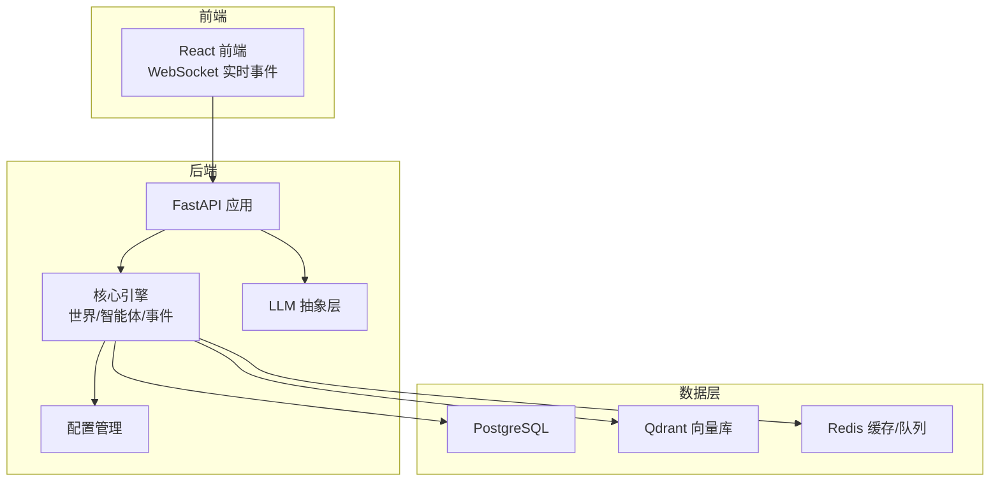
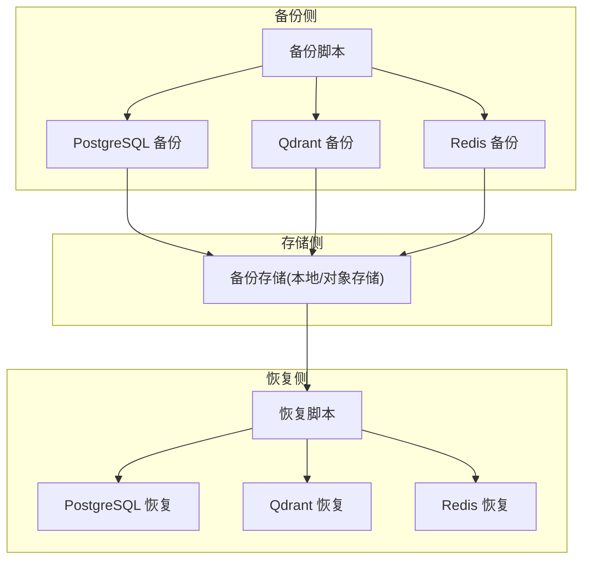
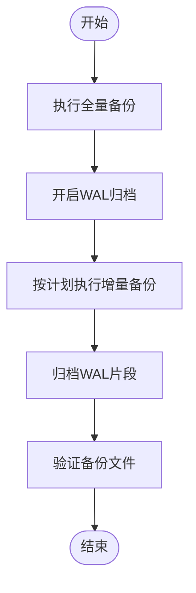
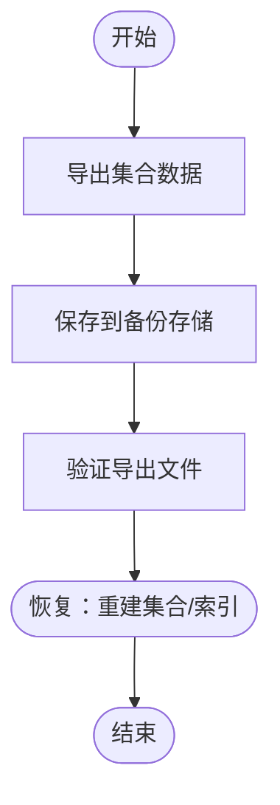
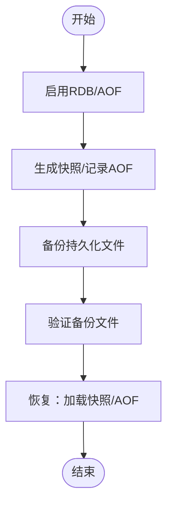
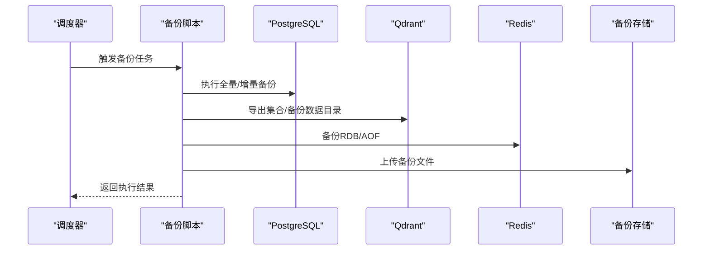
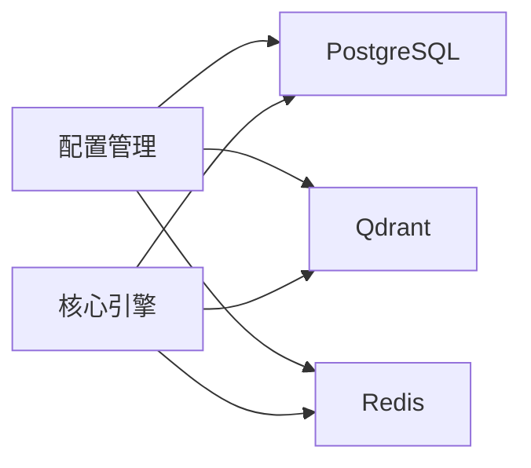

# 备份与恢复

<cite>
**本文引用的文件**
- [配置管理模块](file://backend/app/core/config.py)
- [系统架构规格说明](file://specs/01-architecture.spec.md)
- [API与通信协议规格说明](file://specs/06-api-design.spec.md)
- [实施计划规格说明](file://specs/08-implementation-plan.spec.md)
- [世界时钟模块](file://backend/app/core/world.py)
- [智能体数据结构](file://backend/app/core/agent.py)
</cite>

## 目录
1. [简介](#简介)
2. [项目结构](#项目结构)
3. [核心组件](#核心组件)
4. [架构总览](#架构总览)
5. [详细组件分析](#详细组件分析)
6. [依赖分析](#依赖分析)
7. [性能考虑](#性能考虑)
8. [故障排查指南](#故障排查指南)
9. [结论](#结论)
10. [附录](#附录)

## 简介
本文件面向AI Society项目的运维与平台工程团队，提供一套系统化的数据备份与系统恢复方案。依据项目现有配置与架构，明确数据库(PostgreSQL)、向量数据库(Qdrant)、缓存/消息队列(Redis)三类数据的备份策略与恢复流程；制定备份频率、存储位置、验证与监控告警机制；给出灾难恢复计划、故障切换与演练步骤；并提供备份脚本编写、自动化任务配置与监控告警建议，以及跨环境数据同步与版本升级的备份策略。

## 项目结构
AI Society采用“后端(FastAPI)+前端(React)+容器化(Docker/Docker Compose)”的分层架构。后端核心模块包括配置管理、世界引擎、智能体引擎、事件总线、LLM抽象层与数据持久层。数据持久层由PostgreSQL(结构化数据)、Qdrant(向量记忆)、Redis(缓存/消息队列)组成。

**图表来源**
- [系统架构规格说明](file://specs/01-architecture.spec.md#L50-L56)
- [配置管理模块](file://backend/app/core/config.py#L84-L107)

**章节来源**
- [系统架构规格说明](file://specs/01-architecture.spec.md#L50-L56)
- [配置管理模块](file://backend/app/core/config.py#L84-L107)

## 核心组件
- 配置管理：集中管理数据库、Redis、Qdrant的连接参数与集合名称，确保备份脚本与恢复脚本可从同一配置源读取。
- 数据持久层：PostgreSQL负责结构化数据(智能体、对话、关系等)，Qdrant负责向量记忆检索，Redis负责缓存与消息队列。
- 事件总线与世界引擎：驱动系统运行，产生大量事件流，事件流可用于审计与回溯。

**章节来源**
- [配置管理模块](file://backend/app/core/config.py#L84-L107)
- [系统架构规格说明](file://specs/01-architecture.spec.md#L50-L56)

## 架构总览
下图展示备份与恢复的关键数据流：备份脚本从PostgreSQL导出结构化数据，从Qdrant导出向量集合，从Redis导出键空间；恢复时按顺序反向执行，确保数据一致性。

**图表来源**
- [配置管理模块](file://backend/app/core/config.py#L84-L107)
- [系统架构规格说明](file://specs/01-architecture.spec.md#L50-L56)

## 详细组件分析

### PostgreSQL 全量备份与增量备份
- 全量备份
  - 使用逻辑备份工具导出数据库结构与数据，保留DDL与DML，便于跨环境迁移与恢复。
  - 备份频率：生产环境建议每日全量备份，结合归档日志实现时间点恢复。
- 增量备份
  - 建议启用WAL归档，定期抓取WAL片段作为增量基元，降低恢复时间。
  - 增量策略：每日全量 + 每小时增量，或每30分钟增量，视RPO/RTO目标而定。
- 时间点恢复(PITR)
  - 基于WAL归档与时间戳，可精确恢复到某一时刻。
  - 恢复前需校验备份链完整性与时间戳有效性。
- 备份存储
  - 建议将备份文件上传至对象存储(如S3兼容)，并设置生命周期策略与跨区域冗余。
- 备份验证
  - 定期执行还原演练，验证备份文件可读性与数据一致性。
- 备份监控与告警
  - 监控备份任务执行状态、耗时、失败次数；对异常及时告警。

**图表来源**
- [配置管理模块](file://backend/app/core/config.py#L84-L87)

**章节来源**
- [配置管理模块](file://backend/app/core/config.py#L84-L87)

### Qdrant 向量数据库备份
- 备份范围
  - 集合数据与向量索引元数据；若使用卷外挂载，可直接备份数据目录。
- 备份方式
  - 逻辑导出：通过API导出集合内的点与元数据，便于跨环境迁移。
  - 物理备份：直接复制数据目录(需停止服务或使用只读快照)。
- 备份频率
  - 建议每日全量 + 每小时增量；若集合增长快，可缩短周期。
- 验证与恢复
  - 恢复后重建索引(如需要)，并验证相似度检索结果一致性。
- 监控与告警
  - 监控集合大小、索引状态、写入延迟；异常时告警。

**图表来源**
- [配置管理模块](file://backend/app/core/config.py#L100-L107)

**章节来源**
- [配置管理模块](file://backend/app/core/config.py#L100-L107)

### Redis 数据持久化配置
- RDB快照
  - 周期性生成内存快照，适合非实时场景；可配置触发条件(时间/变更数量)。
- AOF追加
  - 记录写命令，提供更高数据安全性；可配置fsync策略平衡性能与安全。
- 混合持久化
  - 结合RDB与AOF优势，兼顾恢复速度与数据安全。
- 备份与恢复
  - 建议同时启用RDB与AOF；定期将快照与AOF文件备份至对象存储。
- 监控与告警
  - 监控持久化文件大小、rewrite频率、内存使用；异常时告警。

**图表来源**
- [配置管理模块](file://backend/app/core/config.py#L92-L95)

**章节来源**
- [配置管理模块](file://backend/app/core/config.py#L92-L95)

### 备份频率、存储位置与验证流程
- 频率
  - PostgreSQL：每日全量 + 每小时增量；PITR基于WAL归档。
  - Qdrant：每日全量 + 每小时增量；或直接备份数据目录。
  - Redis：RDB/AOF定期生成；持久化文件纳入备份。
- 存储位置
  - 本地磁盘(短期) + 对象存储(长期/异地)；设置生命周期与冗余。
- 验证流程
  - 定期还原演练：在隔离环境中还原备份，验证数据完整性与服务可用性。
  - 结构一致性校验：对比表结构、索引、约束；向量检索一致性校验。
  - 功能回归：关键API与事件流验证。

**章节来源**
- [配置管理模块](file://backend/app/core/config.py#L84-L107)

### 灾难恢复计划、故障切换与演练
- DRP目标
  - RTO：关键业务RTO≤1小时；非关键业务≤4小时。
  - RPO：RPO≤15分钟(生产环境)；极端情况≤1小时。
- 故障切换
  - PostgreSQL：主从切换，Promote从库；确认WAL同步与PITR可用。
  - Qdrant：多副本/集群部署，故障节点替换；恢复索引。
  - Redis：哨兵/集群切换，数据同步验证。
- 演练步骤
  - 制定演练计划与回退预案；按阶段执行(数据库→向量库→缓存)。
  - 记录演练过程与耗时，持续优化恢复流程。

**章节来源**
- [系统架构规格说明](file://specs/01-architecture.spec.md#L50-L56)

### 备份脚本编写与自动化任务
- 脚本职责
  - PostgreSQL：执行pg_dump/pg_restore，或逻辑导出；校验WAL归档。
  - Qdrant：调用API导出集合；或物理备份数据目录。
  - Redis：备份RDB/AOF文件；校验文件完整性。
- 自动化
  - 使用Cron或调度系统(如APScheduler)定时执行备份任务。
  - 失败告警：邮件/IM通知运维团队。
- 配置来源
  - 从配置模块读取数据库/Redis/Qdrant连接参数，避免硬编码。

**图表来源**
- [配置管理模块](file://backend/app/core/config.py#L84-L107)

**章节来源**
- [配置管理模块](file://backend/app/core/config.py#L84-L107)

### 监控告警
- 指标
  - 备份成功率、耗时、失败次数；WAL归档延迟；Qdrant集合大小与索引状态；Redis持久化文件大小与rewrite频率。
- 告警
  - 多级告警：轻微(邮件)、严重(电话)、紧急(短信)；明确责任人与处置时限。
- 工具建议
  - Prometheus/Grafana + Alertmanager；或云监控服务。

**章节来源**
- [系统架构规格说明](file://specs/01-architecture.spec.md#L50-L56)

### 数据迁移、版本升级与跨环境同步
- 数据迁移
  - 使用PostgreSQL逻辑导出/导入；Qdrant通过API导出/导入；Redis使用RDB/AOF。
- 版本升级备份
  - 升级前执行全量备份；升级后验证数据一致性；回滚预案准备。
- 跨环境同步
  - 通过备份存储统一管理；在目标环境执行还原；必要时进行数据清洗与映射。

**章节来源**
- [配置管理模块](file://backend/app/core/config.py#L84-L107)

### 恢复测试流程与RTO保障
- 流程
  - 准备隔离环境 → 还原数据库/向量库/缓存 → 启动服务 → 功能验证 → 性能验证 → 记录与复盘。
- RTO保障
  - 优化备份粒度与并发恢复；预热从库/副本；自动化恢复脚本；演练常态化。

**章节来源**
- [API与通信协议规格说明](file://specs/06-api-design.spec.md#L1-L655)

## 依赖分析
- 配置依赖：备份/恢复脚本依赖配置模块提供的连接参数。
- 数据依赖：世界引擎与事件总线依赖数据库与Qdrant；缓存依赖Redis。
- 外部依赖：容器化部署依赖Docker与Compose；对象存储依赖云厂商或自建。

**图表来源**
- [配置管理模块](file://backend/app/core/config.py#L84-L107)
- [系统架构规格说明](file://specs/01-architecture.spec.md#L50-L56)

**章节来源**
- [配置管理模块](file://backend/app/core/config.py#L84-L107)
- [系统架构规格说明](file://specs/01-architecture.spec.md#L50-L56)

## 性能考虑
- 备份窗口：避开业务高峰期；使用增量与并行备份降低窗口。
- 存储带宽：对象存储上传限速与并发控制；本地备份注意磁盘IO。
- 恢复效率：预热从库/副本；批量恢复与索引重建并行化。

## 故障排查指南
- 备份失败
  - 检查连接参数、权限、磁盘空间；查看日志与告警。
- 恢复异常
  - 校验备份文件完整性；确认目标环境版本兼容；逐步恢复并验证。
- 数据不一致
  - 对比结构与数据；重新索引；重放事件流(如需要)。

**章节来源**
- [配置管理模块](file://backend/app/core/config.py#L84-L107)

## 结论
通过明确的备份策略、严格的验证与监控、规范的灾难恢复流程与演练，AI Society可在保证业务连续性的前提下，高效应对各类故障与升级场景。建议尽快落地自动化备份与恢复脚本，并将演练纳入日常运维流程。

## 附录
- 关键配置项参考
  - PostgreSQL连接URL
  - Redis连接URL
  - Qdrant地址与集合名称
- 相关模块参考
  - 世界时钟与事件总线用于理解系统运行节奏与事件流，有助于恢复后的功能验证。

**章节来源**
- [配置管理模块](file://backend/app/core/config.py#L84-L107)
- [世界时钟模块](file://backend/app/core/world.py#L1-L39)
- [智能体数据结构](file://backend/app/core/agent.py#L48-L76)