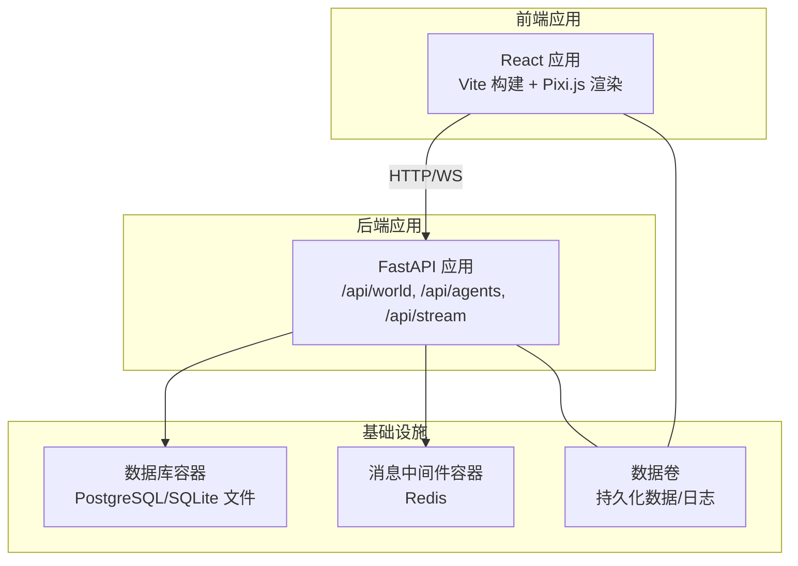
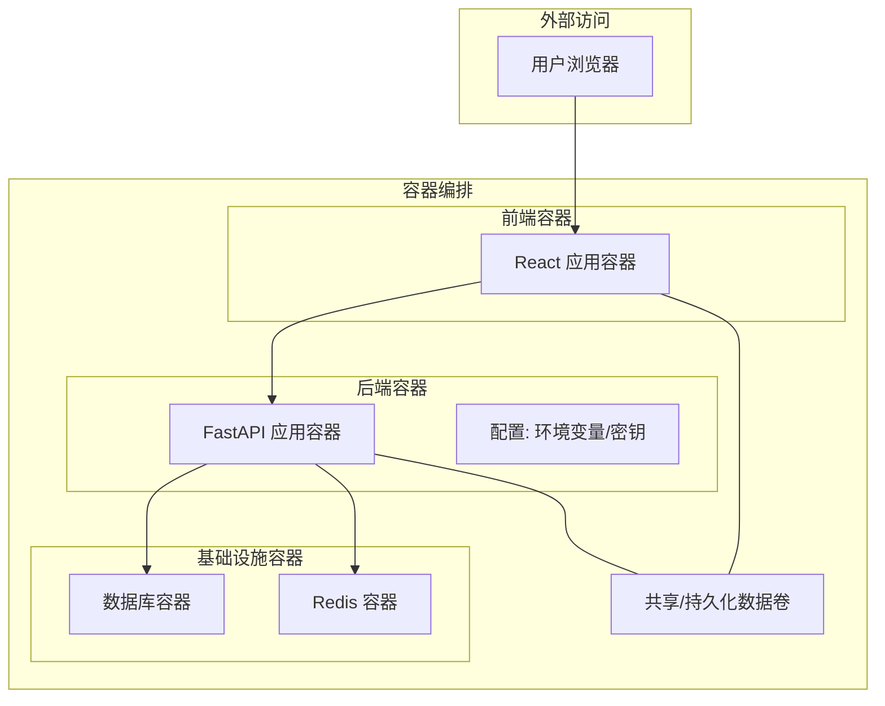
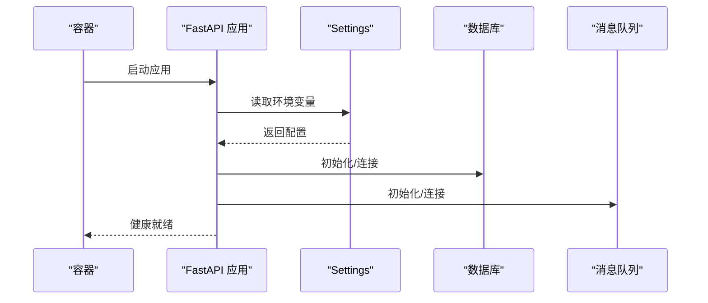
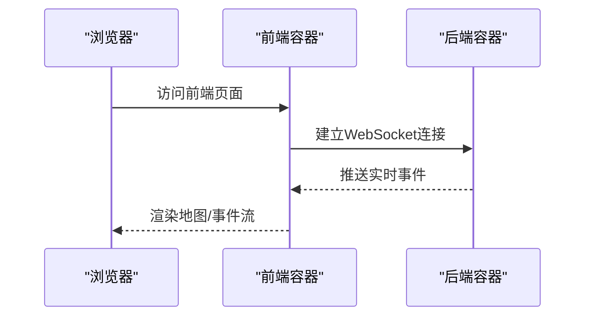
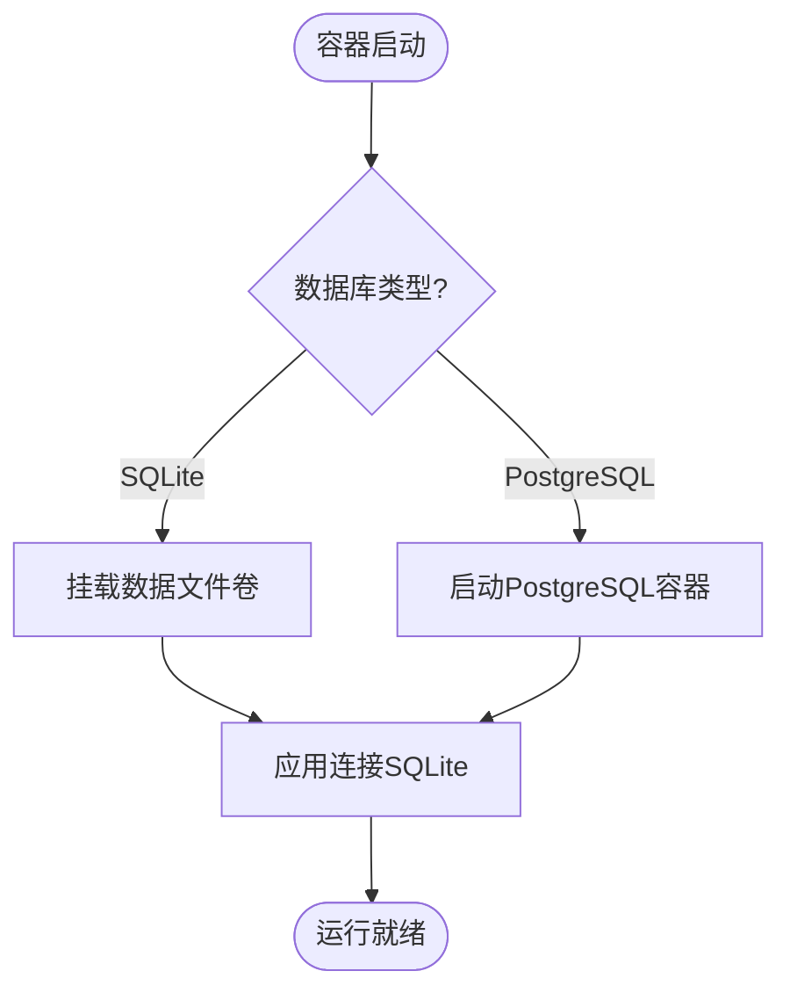
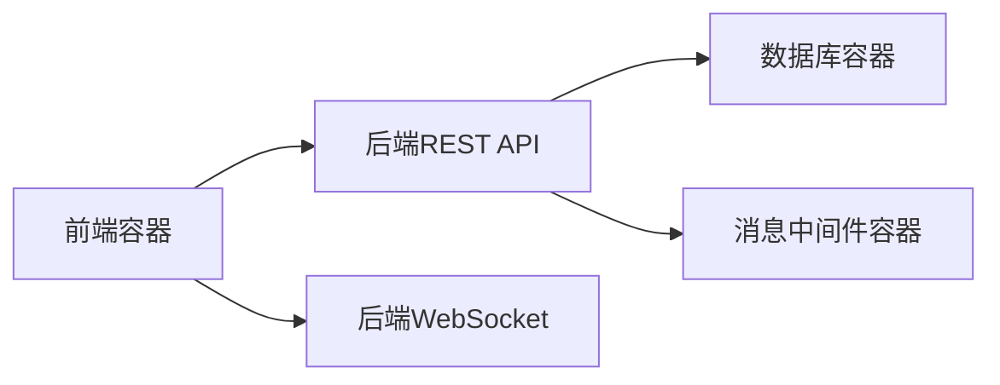

# 容器化部署

<cite>
**本文引用的文件**
- [backend/app/__init__.py](file://backend/app/__init__.py)
- [backend/app/core/config.py](file://backend/app/core/config.py)
- [specs/06-api-design.spec.md](file://specs/06-api-design.spec.md)
- [specs/07-frontend.spec.md](file://specs/07-frontend.spec.md)
- [specs/08-implementation-plan.spec.md](file://specs/08-implementation-plan.spec.md)
</cite>

## 目录
1. [简介](#简介)
2. [项目结构](#项目结构)
3. [核心组件](#核心组件)
4. [架构总览](#架构总览)
5. [组件详解](#组件详解)
6. [依赖关系分析](#依赖关系分析)
7. [性能考量](#性能考量)
8. [故障排查指南](#故障排查指南)
9. [结论](#结论)
10. [附录](#附录)

## 简介
本文件面向AI Society项目的容器化部署，提供从镜像构建到编排运行的完整方案。文档覆盖后端FastAPI应用容器、前端React应用容器、数据库与消息中间件容器的配置要点；说明容器间网络通信、数据卷挂载、环境变量传递方式；给出一键部署与手动部署步骤、健康检查、日志查看、重启策略与资源限制建议，并提供升级与回滚流程。

## 项目结构
- 后端采用FastAPI框架，提供REST API与WebSocket实时事件流。
- 前端采用React + Vite + Pixi.js，通过原生WebSocket订阅后端事件。
- 配置通过Pydantic Settings加载环境变量，支持开发/生产环境差异。
- 规划中包含数据库(PostgreSQL)与缓存/消息队列(Redis)的容器化支撑。

**章节来源**
- [backend/app/__init__.py](file://backend/app/__init__.py#L7-L21)
- [backend/app/core/config.py](file://backend/app/core/config.py#L7-L41)
- [specs/06-api-design.spec.md](file://specs/06-api-design.spec.md#L10-L16)
- [specs/07-frontend.spec.md](file://specs/07-frontend.spec.md#L12-L23)
- [specs/08-implementation-plan.spec.md](file://specs/08-implementation-plan.spec.md#L379-L386)

## 核心组件
- 后端FastAPI应用
  - 路由前缀与标签：/api/world、/api/agents、/api/stream
  - 配置来源：环境变量驱动的Settings类
- 前端React应用
  - 技术栈：React 18 + Vite + Pixi.js + Zustand + TailwindCSS
  - 通信：原生WebSocket直连后端
- 基础设施
  - 数据库：SQLite文件或PostgreSQL（按规划）
  - 缓存/消息队列：Redis（按规划）

**章节来源**
- [backend/app/__init__.py](file://backend/app/__init__.py#L10-L21)
- [backend/app/core/config.py](file://backend/app/core/config.py#L7-L41)
- [specs/06-api-design.spec.md](file://specs/06-api-design.spec.md#L10-L16)
- [specs/07-frontend.spec.md](file://specs/07-frontend.spec.md#L12-L23)
- [specs/08-implementation-plan.spec.md](file://specs/08-implementation-plan.spec.md#L379-L386)

## 架构总览
下图展示容器化后的系统交互：前端通过HTTP访问后端REST API，通过WebSocket订阅实时事件；后端连接数据库与消息中间件；所有持久化数据通过数据卷挂载。

**图示来源**
- [backend/app/__init__.py](file://backend/app/__init__.py#L10-L21)
- [backend/app/core/config.py](file://backend/app/core/config.py#L15-L22)
- [specs/07-frontend.spec.md](file://specs/07-frontend.spec.md#L12-L23)
- [specs/08-implementation-plan.spec.md](file://specs/08-implementation-plan.spec.md#L379-L386)

## 组件详解

### 后端FastAPI应用容器配置
- 应用入口与路由
  - 应用工厂函数创建FastAPI实例，注册世界、智能体、流式事件三类路由。
- 配置加载
  - Settings类从环境变量读取运行参数，如环境、调试、时间缩放、数据库URL、Redis/向量库地址、大模型提供商与密钥等。
- 端口与健康检查
  - 建议暴露应用监听端口（例如8000），并在容器中配置健康检查探针（如HTTP GET /api/world/status）。
- 环境变量传递
  - 必需：ENVIRONMENT、DATABASE_URL、REDIS_URL、VECTOR_STORE_URL、DEEPSEEK_API_KEY、DEEPSEEK_BASE_URL、OPENAI_API_KEY等。
- 数据卷挂载
  - SQLite场景：将数据文件所在目录映射为持久化卷；或使用独立卷存放数据库文件。
- 重启策略与资源限制
  - 建议使用“始终重启”策略，CPU/内存限制按实际负载评估。

**图示来源**
- [backend/app/__init__.py](file://backend/app/__init__.py#L7-L21)
- [backend/app/core/config.py](file://backend/app/core/config.py#L7-L41)

**章节来源**
- [backend/app/__init__.py](file://backend/app/__init__.py#L7-L21)
- [backend/app/core/config.py](file://backend/app/core/config.py#L7-L41)

### 前端React应用容器配置
- 技术栈与构建
  - React + Vite + Pixi.js + Zustand + TailwindCSS；前端通过原生WebSocket直连后端。
- 端口与代理
  - 建议在容器内运行静态站点服务（如Nginx或内置静态服务器），对外暴露前端端口。
- 环境变量传递
  - 前端通常无需直接读取后端敏感配置；可通过构建期注入或运行时通过反向代理传递后端WebSocket地址。
- 数据卷挂载
  - 前端为静态资源，一般无需持久化卷；如需记录日志可在宿主机挂载日志目录。
- 重启策略与资源限制
  - 前端容器重启策略与资源限制可根据访问量与宿主机资源情况设定。

**图示来源**
- [specs/07-frontend.spec.md](file://specs/07-frontend.spec.md#L12-L23)
- [specs/06-api-design.spec.md](file://specs/06-api-design.spec.md#L411-L425)

**章节来源**
- [specs/07-frontend.spec.md](file://specs/07-frontend.spec.md#L12-L23)
- [specs/06-api-design.spec.md](file://specs/06-api-design.spec.md#L411-L425)

### 数据库容器配置
- 选择与用途
  - SQLite：适合开发/演示，文件映射到持久化卷；无需额外容器。
  - PostgreSQL：适合生产，独立容器，配合备份与高可用。
- 端口与卷
  - 暴露数据库端口，挂载数据卷；设置初始化脚本或迁移工具。
- 与后端连接
  - DATABASE_URL指向数据库容器服务名与端口；开发/生产环境区分。

**图示来源**
- [backend/app/core/config.py](file://backend/app/core/config.py#L15-L16)
- [specs/08-implementation-plan.spec.md](file://specs/08-implementation-plan.spec.md#L379-L386)

**章节来源**
- [backend/app/core/config.py](file://backend/app/core/config.py#L15-L16)
- [specs/08-implementation-plan.spec.md](file://specs/08-implementation-plan.spec.md#L379-L386)

### 消息中间件与向量库容器
- Redis
  - 用于消息队列/缓存，后端通过REDIS_URL连接；建议独立容器并持久化。
- Qdrant/向量库
  - 通过VECTOR_STORE_URL连接；建议独立容器并持久化卷。

**章节来源**
- [backend/app/core/config.py](file://backend/app/core/config.py#L18-L22)
- [specs/08-implementation-plan.spec.md](file://specs/08-implementation-plan.spec.md#L379-L386)

## 依赖关系分析
- 后端对数据库与消息中间件的依赖通过配置项集中管理，容器编排时需确保服务发现与网络互通。
- 前端对后端的依赖体现在WebSocket连接与REST API调用，需保证跨容器网络可达与端口开放。

**图示来源**
- [specs/06-api-design.spec.md](file://specs/06-api-design.spec.md#L10-L16)
- [specs/07-frontend.spec.md](file://specs/07-frontend.spec.md#L12-L23)
- [backend/app/__init__.py](file://backend/app/__init__.py#L10-L21)

**章节来源**
- [specs/06-api-design.spec.md](file://specs/06-api-design.spec.md#L10-L16)
- [specs/07-frontend.spec.md](file://specs/07-frontend.spec.md#L12-L23)
- [backend/app/__init__.py](file://backend/app/__init__.py#L10-L21)

## 性能考量
- 后端
  - 通过配置项控制时间缩放与模型调用频率，避免过度调用外部LLM导致延迟。
  - 使用连接池与异步I/O，减少阻塞。
- 前端
  - 仅渲染可见区域智能体，使用对象池与批量更新，降低渲染压力。
- 容器
  - 为后端与数据库分别设置CPU/内存限制，避免资源争抢。
  - 使用只读根文件系统与最小权限镜像，增强安全性。

[本节为通用指导，无需列出具体文件来源]

## 故障排查指南
- 健康检查
  - 后端：通过HTTP请求/health或/ready端点（如存在）；若无内置，可使用/ api/world/status作为探针路径。
- 日志查看
  - 后端：容器标准输出/错误输出；建议将日志重定向至文件并挂载日志卷。
  - 前端：静态日志或浏览器开发者工具；必要时在容器内启用日志卷。
- 网络连通性
  - 确认容器网络、端口映射与防火墙；使用容器内ping/curl测试服务可达性。
- 配置问题
  - 检查DATABASE_URL、REDIS_URL、VECTOR_STORE_URL与API密钥是否正确注入。

**章节来源**
- [specs/06-api-design.spec.md](file://specs/06-api-design.spec.md#L10-L16)
- [backend/app/core/config.py](file://backend/app/core/config.py#L15-L22)

## 结论
通过明确的容器化策略与编排配置，AI Society项目可实现后端、前端与基础设施的解耦部署。建议以开发/生产双环境区分配置，结合健康检查、日志与资源限制，确保系统稳定与可观测性；同时制定升级与回滚流程，保障线上变更的安全可控。

[本节为总结性内容，无需列出具体文件来源]

## 附录

### 一键部署命令与手动部署步骤
- 一键部署（示例）
  - 使用容器编排工具启动：docker compose up -d
  - 停止与清理：docker compose down
- 手动部署步骤（示例）
  - 构建镜像：docker build -t aisociety-backend:latest ./backend
  - 启动数据库容器：docker run -d --name db -v db_vol:/var/lib/postgresql/data postgres
  - 启动后端容器：docker run -d --name backend --link db -p 8000:8000 aisociety-backend
  - 启动前端容器：docker run -d --name frontend -p 8080:80 nginx/static-site
  - 验证：curl http://localhost:8000/api/world/status

[本节为通用流程说明，未直接分析具体文件，故不列出来源]

### 容器健康检查配置
- 后端：建议使用HTTP探针访问/ api/world/status，失败次数阈值与重试间隔按SLA设定。
- 前端：静态站点可用TCP探针检测端口；或在容器内提供/health端点。
- 基础设施：数据库与Redis分别提供健康端点或探针。

**章节来源**
- [specs/06-api-design.spec.md](file://specs/06-api-design.spec.md#L10-L16)

### 容器日志查看、重启策略与资源限制
- 日志
  - 使用docker logs <container>查看；或挂载日志卷到宿主机统一收集。
- 重启策略
  - 后端：unless-stopped或no（配合编排自动拉起）。
  - 前端：unless-stopped。
- 资源限制
  - CPU/内存限额按峰值与并发量评估；数据库与消息中间件单独隔离。

[本节为通用指导，无需列出具体文件来源]

### 容器升级与回滚流程
- 升级
  - 生成新镜像版本；编排文件切换镜像标签；滚动更新（如支持）。
- 回滚
  - 恢复旧镜像标签；回滚配置与数据卷；验证服务可用性。
- 发布策略
  - 蓝绿/金丝雀发布，逐步替换流量，降低风险。

[本节为通用流程说明，未直接分析具体文件，故不列出来源]