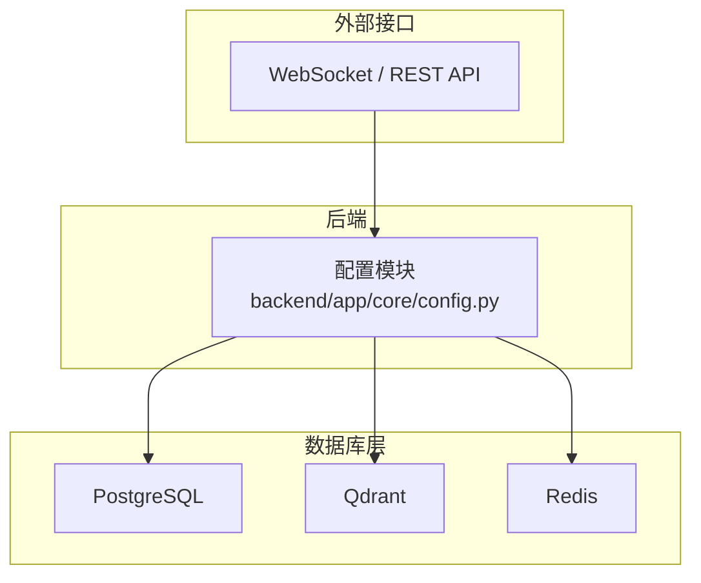
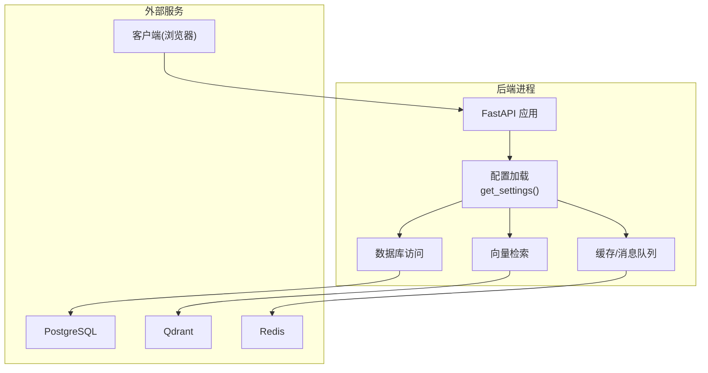
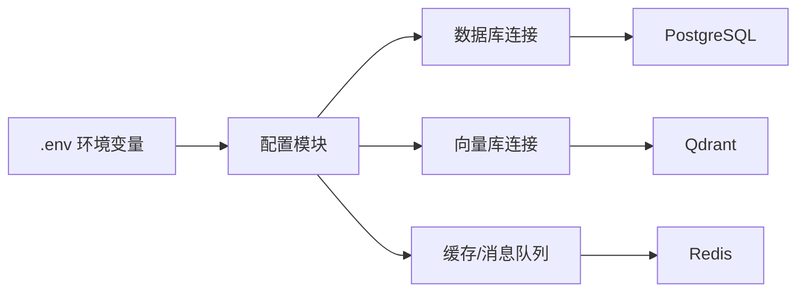

# 环境配置

<cite>
**本文引用的文件**
- [backend/app/core/config.py](file://backend/app/core/config.py)
- [specs/00-project-overview.spec.md](file://specs/00-project-overview.spec.md)
- [specs/01-architecture.spec.md](file://specs/01-architecture.spec.md)
- [specs/06-api-design.spec.md](file://specs/06-api-design.spec.md)
</cite>

## 目录
1. [简介](#简介)
2. [项目结构](#项目结构)
3. [核心组件](#核心组件)
4. [架构总览](#架构总览)
5. [详细组件分析](#详细组件分析)
6. [依赖关系分析](#依赖关系分析)
7. [性能考虑](#性能考虑)
8. [故障排查指南](#故障排查指南)
9. [结论](#结论)
10. [附录](#附录)

## 简介
本文件面向AI Society项目的环境配置与部署，覆盖系统要求、Python与Node.js环境准备、Docker与Docker Compose安装配置、数据库(PostgreSQL、Qdrant、Redis)初始化、环境变量(.env)与LLM API密钥配置、开发与生产环境差异、网络端口与防火墙建议，以及常见问题排查。

## 项目结构
- 后端采用Python + FastAPI，核心配置集中于配置模块，便于在不同环境中加载变量。
- 架构文档明确列出数据库、向量库、缓存/消息队列的选型与部署方式。
- API与通信协议文档明确了WebSocket与REST API的端口与通信约定，有助于网络规划。

图表来源
- [specs/01-architecture.spec.md](file://specs/01-architecture.spec.md#L50-L56)
- [backend/app/core/config.py](file://backend/app/core/config.py#L15-L22)

章节来源
- [specs/01-architecture.spec.md](file://specs/01-architecture.spec.md#L92-L169)

## 核心组件
- 环境变量与默认值
  - 环境模式与调试开关：development/production，调试模式与开发一致。
  - 时间缩放：现实1分钟对应程序内10分钟。
  - 数据库连接：默认SQLite（开发），生产建议PostgreSQL。
  - Redis连接：默认本地地址，用于缓存与消息队列。
  - 向量数据库：默认本地Qdrant端口。
  - LLM提供商：支持DeepSeek与OpenAI等，需配置对应API密钥与基础URL。
- 端口与服务
  - WebSocket与REST API：遵循API设计规范中的端点与协议。
  - 数据库与向量库：PostgreSQL、Qdrant、Redis均有标准端口或默认端口。

章节来源
- [backend/app/core/config.py](file://backend/app/core/config.py#L7-L41)
- [specs/06-api-design.spec.md](file://specs/06-api-design.spec.md#L10-L16)

## 架构总览
下图展示后端如何读取配置并连接数据库、向量库与缓存/消息队列，以及对外提供REST与WebSocket服务。

图表来源
- [specs/01-architecture.spec.md](file://specs/01-architecture.spec.md#L50-L56)
- [backend/app/core/config.py](file://backend/app/core/config.py#L15-L22)

## 详细组件分析

### 系统要求与硬件建议
- CPU：建议至少4核，以满足并发智能体与LLM推理的计算需求。
- 内存：建议8GB以上，以承载数据库、向量库与缓存的运行。
- 存储：开发阶段SQLite即可；生产建议SSD，容量根据数据规模与日志保留策略评估。
- 网络：确保容器间与宿主机端口可达，开放WebSocket与REST API所需端口。

章节来源
- [specs/00-project-overview.spec.md](file://specs/00-project-overview.spec.md#L37-L41)

### Python环境配置
- 版本：建议使用Python 3.10及以上版本。
- 包管理：使用requirements.txt安装后端依赖。
- 虚拟环境：强烈建议在独立虚拟环境中运行，避免全局污染。
- 配置加载：通过配置模块读取环境变量，无需手动修改代码。

章节来源
- [specs/01-architecture.spec.md](file://specs/01-architecture.spec.md#L134-L136)
- [backend/app/core/config.py](file://backend/app/core/config.py#L1-L42)

### Node.js环境准备
- 用途：前端构建与开发（Vite）。
- 版本：建议使用当前长期支持版本。
- 依赖：通过package.json管理，安装依赖后可进行开发与打包。

章节来源
- [specs/01-architecture.spec.md](file://specs/01-architecture.spec.md#L157-L158)

### Docker与Docker Compose安装配置
- Docker：安装官方发行版，确保用户加入docker组。
- Docker Compose：使用Compose V2（内置在Docker Desktop或单独安装）。
- 镜像与编排：项目提供一键编排文件，建议先拉取镜像再启动，确保网络与卷权限正确。
- 端口映射：根据实际部署需求调整宿主机端口，避免冲突。

章节来源
- [specs/01-architecture.spec.md](file://specs/01-architecture.spec.md#L69-L70)

### 数据库初始化设置
- PostgreSQL
  - 选型：PostgreSQL 15，具备良好JSON支持与扩展能力。
  - 初始化：创建数据库与用户，执行迁移脚本（如使用Alembic）。
  - 连接：在环境变量中设置DATABASE_URL，指向生产数据库。
- Qdrant
  - 选型：开源向量数据库，性能良好，易于部署。
  - 初始化：首次启动后自动初始化索引结构；确保持久化卷挂载。
  - 连接：在环境变量中设置VECTOR_STORE_URL。
- Redis
  - 选型：缓存与消息队列标准方案。
  - 初始化：可直接启动；生产建议启用持久化与密码认证。
  - 连接：在环境变量中设置REDIS_URL。

章节来源
- [specs/01-architecture.spec.md](file://specs/01-architecture.spec.md#L67-L69)
- [backend/app/core/config.py](file://backend/app/core/config.py#L15-L22)

### 环境变量配置(.env文件)
- 关键变量
  - ENVIRONMENT：development 或 production
  - DATABASE_URL：数据库连接字符串（生产建议PostgreSQL）
  - REDIS_URL：Redis连接字符串
  - VECTOR_STORE_URL：Qdrant连接地址
  - DEEPSEEK_API_KEY：DeepSeek API密钥
  - DEEPSEEK_BASE_URL：DeepSeek API基础URL
  - OPENAI_API_KEY：OpenAI API密钥
- 默认值
  - 开发环境默认使用SQLite与本地Qdrant/Redis。
- 加载机制
  - 配置模块通过环境变量覆盖默认值，无需硬编码。

章节来源
- [backend/app/core/config.py](file://backend/app/core/config.py#L8-L36)

### LLM模型API密钥配置
- 支持模型
  - DeepSeek：chat/reasoner两类，需配置API密钥与基础URL。
  - OpenAI：GPT-4o等，需配置API密钥。
- 配置步骤
  - 在环境变量中设置对应密钥与基础URL。
  - 在智能体配置中选择模型别名，系统通过路由层调用对应适配器。

章节来源
- [specs/01-architecture.spec.md](file://specs/01-architecture.spec.md#L83-L90)
- [backend/app/core/config.py](file://backend/app/core/config.py#L24-L36)

### 开发环境与生产环境配置差异
- 开发环境
  - 使用SQLite作为数据库后端，便于快速迭代。
  - 默认连接本地Qdrant与Redis。
  - 调试模式开启，便于问题定位。
- 生产环境
  - 使用PostgreSQL、Qdrant、Redis集群或托管实例。
  - 设置专用的DATABASE_URL、REDIS_URL、VECTOR_STORE_URL。
  - 关闭调试模式，启用安全与性能优化项。

章节来源
- [specs/01-architecture.spec.md](file://specs/01-architecture.spec.md#L67-L69)
- [backend/app/core/config.py](file://backend/app/core/config.py#L9-L16)

### 网络端口配置与防火墙设置
- 端口规划
  - WebSocket与REST API：遵循API设计规范中的端点与协议，确保端口可达。
  - 数据库：PostgreSQL、Qdrant、Redis的标准端口需在防火墙中放行。
- 防火墙建议
  - 仅开放必要端口，限制来源IP。
  - 使用安全组或iptables策略，避免全开放。
  - 如使用反向代理，确保WebSocket升级与长连接透传。

章节来源
- [specs/06-api-design.spec.md](file://specs/06-api-design.spec.md#L10-L16)
- [specs/01-architecture.spec.md](file://specs/01-architecture.spec.md#L67-L69)

## 依赖关系分析
- 配置模块依赖环境变量，决定数据库、缓存与向量库的连接参数。
- 后端应用通过配置模块获取运行参数，进而连接外部服务。
- 外部服务包括数据库、向量库与缓存/消息队列，均通过环境变量控制。

图表来源
- [backend/app/core/config.py](file://backend/app/core/config.py#L15-L22)

章节来源
- [backend/app/core/config.py](file://backend/app/core/config.py#L1-L42)

## 性能考虑
- 智能体数量与并发：目标支持50-200个智能体，注意CPU与内存资源。
- 前端帧率与API延迟：目标分别为60fps与<100ms，WebSocket延迟<50ms。
- LLM调用频率：每智能体每10分钟最多1次，避免高并发导致限流。
- 内存占用：目标<2GB，合理配置数据库与缓存大小。

章节来源
- [specs/01-architecture.spec.md](file://specs/01-architecture.spec.md#L238-L247)

## 故障排查指南
- 数据库连接失败
  - 检查DATABASE_URL是否正确，确认PostgreSQL服务可达与凭据有效。
  - 若使用SQLite，请确认路径存在且可写。
- 向量库连接失败
  - 检查VECTOR_STORE_URL与Qdrant服务连通性，确认持久化卷挂载正常。
- 缓存/消息队列异常
  - 检查REDIS_URL与Redis服务连通性，确认密码与权限配置正确。
- LLM调用失败
  - 检查DEEPSEEK_API_KEY与OPENAI_API_KEY是否配置，确认基础URL正确。
  - 关注模型别名是否在配置中注册。
- WebSocket/REST API不可达
  - 检查端口映射与防火墙策略，确保WebSocket升级与长连接透传。
- 性能问题
  - 监控CPU、内存与磁盘IO，按性能目标逐步扩容与优化。

章节来源
- [backend/app/core/config.py](file://backend/app/core/config.py#L15-L36)
- [specs/06-api-design.spec.md](file://specs/06-api-design.spec.md#L619-L654)

## 结论
通过标准化的环境变量与配置模块，AI Society项目可在开发与生产环境之间平滑切换。结合Docker与Docker Compose，可实现快速部署与一致性保障。建议严格遵循端口与防火墙策略，并在生产环境启用安全与性能优化项，以达到预期的性能与稳定性目标。

## 附录
- 术语
  - LLM：大语言模型
  - Qdrant：开源向量数据库
  - Redis：高性能键值存储与消息队列
- 参考
  - 项目概览与技术约束
  - 系统架构与技术栈
  - API与通信协议