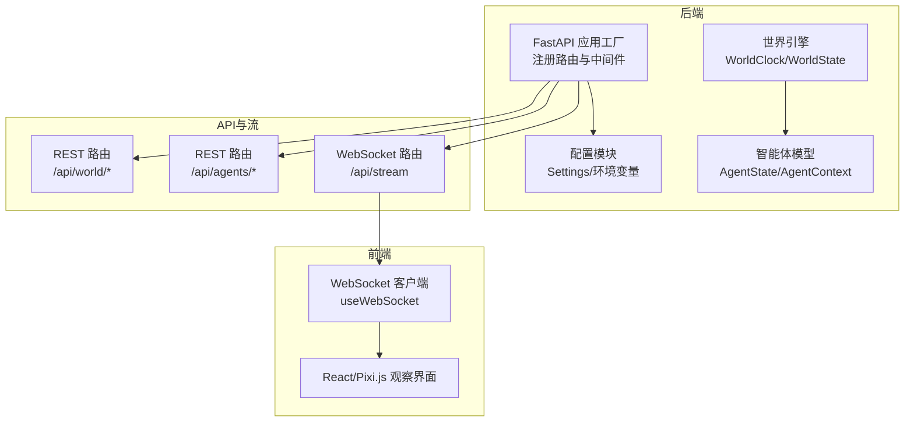
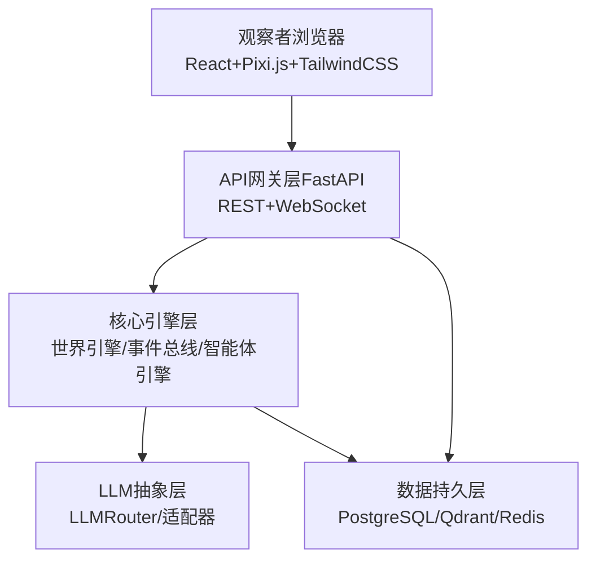
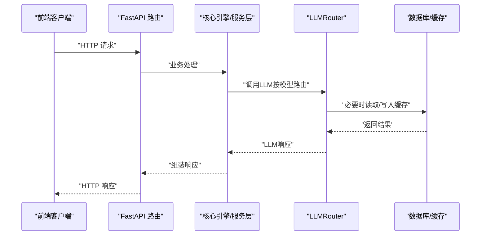
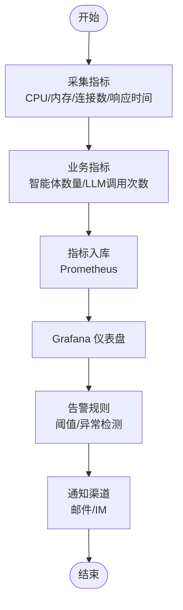
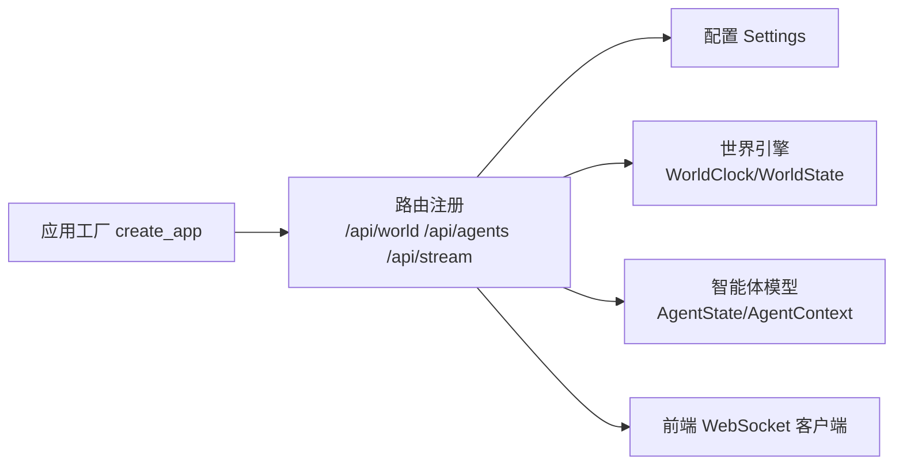

# 监控与日志

<cite>
**本文引用的文件**
- [backend/app/core/config.py](file://backend/app/core/config.py)
- [backend/app/core/world.py](file://backend/app/core/world.py)
- [backend/app/core/agent.py](file://backend/app/core/agent.py)
- [backend/app/__init__.py](file://backend/app/__init__.py)
- [specs/01-architecture.spec.md](file://specs/01-architecture.spec.md)
- [specs/06-api-design.spec.md](file://specs/06-api-design.spec.md)
- [specs/07-frontend.spec.md](file://specs/07-frontend.spec.md)
- [specs/08-implementation-plan.spec.md](file://specs/08-implementation-plan.spec.md)
</cite>

## 目录
1. [简介](#简介)
2. [项目结构](#项目结构)
3. [核心组件](#核心组件)
4. [架构总览](#架构总览)
5. [组件详细分析](#组件详细分析)
6. [依赖关系分析](#依赖关系分析)
7. [性能考量](#性能考量)
8. [故障排查指南](#故障排查指南)
9. [结论](#结论)
10. [附录](#附录)

## 简介
本文件面向AI Society项目的监控与日志管理，围绕系统性能监控指标（CPU使用率、内存占用、数据库连接数、WebSocket连接数）、日志级别与组织、日志轮转、Prometheus/Grafana监控面板配置、关键业务指标（智能体数量、LLM调用次数、API响应时间）、告警规则与异常检测、分布式追踪与性能分析、日志分析工具与故障诊断流程进行系统化说明。文档同时结合现有代码与规格说明，给出可落地的实践建议与可视化图示。

## 项目结构
后端采用FastAPI应用工厂模式，核心模块位于backend/app/core，包含配置、世界时钟、智能体状态等；API路由位于backend/app/routes，WebSocket端点位于stream路由；前端基于React+Pixi.js，通过WebSocket实时接收事件流。

**图示来源**
- [backend/app/__init__.py](file://backend/app/__init__.py#L7-L21)
- [backend/app/core/config.py](file://backend/app/core/config.py#L7-L41)
- [backend/app/core/world.py](file://backend/app/core/world.py#L8-L39)
- [backend/app/core/agent.py](file://backend/app/core/agent.py#L25-L92)
- [specs/06-api-design.spec.md](file://specs/06-api-design.spec.md#L12-L16)
- [specs/07-frontend.spec.md](file://specs/07-frontend.spec.md#L363-L406)

**章节来源**
- [backend/app/__init__.py](file://backend/app/__init__.py#L7-L21)
- [specs/01-architecture.spec.md](file://specs/01-architecture.spec.md#L1-L255)

## 核心组件
- 配置管理：集中管理环境变量、数据库URL、Redis/向量库地址、LLM提供商与密钥等，支持缓存加载。
- 世界引擎：提供世界时钟与世界状态容器，支撑智能体与事件的时间同步。
- 智能体模型：定义AgentState、AgentContext等数据结构，承载智能体属性、状态与模型选择。
- API与WebSocket：REST API提供世界状态、控制与统计数据查询；WebSocket推送实时事件流。

**章节来源**
- [backend/app/core/config.py](file://backend/app/core/config.py#L7-L41)
- [backend/app/core/world.py](file://backend/app/core/world.py#L8-L39)
- [backend/app/core/agent.py](file://backend/app/core/agent.py#L25-L92)
- [specs/06-api-design.spec.md](file://specs/06-api-design.spec.md#L18-L62)
- [specs/06-api-design.spec.md](file://specs/06-api-design.spec.md#L411-L460)

## 架构总览
系统采用“观察者（浏览器）—API网关层（FastAPI）—核心引擎层—LLM抽象层—数据持久层”的分层架构。WebSocket负责实时事件流，REST API提供查询与控制；前端通过Pixi.js渲染世界，使用Zustand管理状态并通过原生WebSocket接收事件。

**图示来源**
- [specs/01-architecture.spec.md](file://specs/01-architecture.spec.md#L5-L57)
- [specs/01-architecture.spec.md](file://specs/01-architecture.spec.md#L100-L176)

**章节来源**
- [specs/01-architecture.spec.md](file://specs/01-architecture.spec.md#L1-L255)

## 组件详细分析

### 性能监控指标与采集
- CPU使用率与内存占用：通过操作系统或容器监控工具（如Prometheus Node Exporter）采集，结合Grafana仪表盘展示。
- 数据库连接数：通过PostgreSQL统计视图或pg_stat_statements采集当前连接数、活跃会话数与慢查询。
- WebSocket连接数：在FastAPI WebSocket端点处统计当前连接数与通道订阅情况，作为业务侧连接指标。
- LLM调用次数与成本：在LLMRouter层统计各模型调用次数与累计token消耗，结合API密钥限额进行告警。
- API响应时间：在FastAPI中间件中埋点，记录请求路径、方法与耗时，支持按端点聚合。

**图示来源**
- [specs/01-architecture.spec.md](file://specs/01-architecture.spec.md#L178-L227)
- [specs/06-api-design.spec.md](file://specs/06-api-design.spec.md#L18-L62)

**章节来源**
- [specs/01-architecture.spec.md](file://specs/01-architecture.spec.md#L245-L255)
- [specs/06-api-design.spec.md](file://specs/06-api-design.spec.md#L18-L62)

### 日志级别与日志文件组织
- 日志级别建议：
  - 开发环境：DEBUG，便于调试与快速定位问题。
  - 生产环境：INFO/ERROR，避免过多DEBUG噪声；对关键业务事件（如智能体创建/离开、对话开始/结束）使用INFO。
- 日志文件组织：
  - 后端应用日志：按天滚动，保留N份备份；包含请求ID与用户标识以便关联。
  - LLM调用日志：单独文件，记录模型名、输入摘要、输出摘要与耗时。
  - WebSocket事件日志：记录订阅/取消订阅、事件推送与错误。
- 日志轮转配置（建议）：
  - 基于日志库的轮转策略（如RotatingFileHandler），按大小或时间轮转，压缩旧日志。

**章节来源**
- [backend/app/core/config.py](file://backend/app/core/config.py#L9-L10)
- [specs/06-api-design.spec.md](file://specs/06-api-design.spec.md#L411-L460)

### Prometheus/Grafana监控面板配置
- 指标采集：
  - Node Exporter：CPU使用率、内存使用、磁盘IO。
  - PostgreSQL Exporter：连接数、查询执行时间、慢查询。
  - 自定义指标：LLM调用次数、API响应时间分位数、WebSocket连接数。
- Grafana仪表盘建议：
  - 世界状态概览：智能体数量、活跃对话数、世界时间与运行状态。
  - 性能指标：API 95分位响应时间、WebSocket延迟、数据库连接峰值。
  - LLM成本与用量：按模型维度的调用次数与token消耗趋势。
  - 告警阈值：CPU/内存/连接数/响应时间/错误率阈值。

**章节来源**
- [specs/01-architecture.spec.md](file://specs/01-architecture.spec.md#L61-L70)
- [specs/06-api-design.spec.md](file://specs/06-api-design.spec.md#L309-L380)

### 关键业务指标监控
- 智能体数量：来自世界状态接口的agent_count字段，前端统计面板展示。
- LLM调用次数：在LLMRouter中按模型维度计数，支持按时间窗口聚合。
- API响应时间：在FastAPI中间件中记录每个端点的耗时，支持分位数统计。
- WebSocket连接数：在WebSocket端点统计当前连接数与订阅频道数量。

**图示来源**
- [specs/06-api-design.spec.md](file://specs/06-api-design.spec.md#L22-L42)
- [specs/06-api-design.spec.md](file://specs/06-api-design.spec.md#L309-L380)

**章节来源**
- [specs/06-api-design.spec.md](file://specs/06-api-design.spec.md#L22-L42)
- [specs/06-api-design.spec.md](file://specs/06-api-design.spec.md#L309-L380)

### 告警规则配置与异常检测
- 告警规则建议：
  - API错误率：连续5分钟错误率超过阈值触发告警。
  - 响应时间：P95/P99超过阈值触发告警。
  - 数据库连接数：超过阈值触发告警。
  - WebSocket连接数：异常波动或断连触发告警。
  - LLM调用成本：按模型维度的预算阈值触发告警。
- 异常检测：
  - 基于统计模型的离群点检测（如Z-score、孤立森林）。
  - 前后对比（环比/同比）异常检测。
- 通知机制：
  - 邮件、Slack、企业微信等渠道，区分严重/警告/恢复通知。

**章节来源**
- [specs/08-implementation-plan.spec.md](file://specs/08-implementation-plan.spec.md#L415-L424)

### 分布式追踪与性能分析
- 分布式追踪：
  - 为FastAPI请求链路注入trace_id，跨服务传递；记录关键步骤耗时。
  - 使用OpenTelemetry或自定义追踪中间件，输出到日志或追踪系统。
- 性能分析：
  - 热点函数分析：对LLM调用、事件广播、数据库查询进行采样。
  - 瓶颈定位：结合火焰图与慢查询日志，定位CPU/IO瓶颈。
- 前端性能：
  - Pixi.js渲染帧率监控，WebSocket延迟测量，事件流堆积检测。

**章节来源**
- [specs/07-frontend.spec.md](file://specs/07-frontend.spec.md#L485-L521)

### 日志分析工具与故障诊断流程
- 日志分析工具：
  - ELK/EFK：收集、解析、检索与可视化日志。
  - Loki + Promtail：面向指标的日志聚合，与Grafana联动。
- 故障诊断流程：
  - 快速定位：查看错误日志与告警，确认受影响范围。
  - 链路回溯：依据trace_id回放请求链路，核对各环节耗时。
  - 业务验证：核对世界状态、智能体数量、对话事件是否异常。
  - 修复验证：灰度发布、指标回归、告警收敛。

**章节来源**
- [specs/06-api-design.spec.md](file://specs/06-api-design.spec.md#L619-L634)

## 依赖关系分析
后端应用工厂注册REST与WebSocket路由，核心模块提供配置与世界引擎，前端通过WebSocket订阅事件流。

**图示来源**
- [backend/app/__init__.py](file://backend/app/__init__.py#L7-L21)
- [backend/app/core/config.py](file://backend/app/core/config.py#L7-L41)
- [backend/app/core/world.py](file://backend/app/core/world.py#L8-L39)
- [backend/app/core/agent.py](file://backend/app/core/agent.py#L25-L92)
- [specs/07-frontend.spec.md](file://specs/07-frontend.spec.md#L363-L406)

**章节来源**
- [backend/app/__init__.py](file://backend/app/__init__.py#L7-L21)
- [specs/07-frontend.spec.md](file://specs/07-frontend.spec.md#L363-L406)

## 性能考量
- 智能体数量目标：50-200，前端帧率目标60fps，API响应时间<100ms，WebSocket延迟<50ms。
- LLM调用频率：每智能体每10分钟（游戏内）最多1次，避免超出API限额。
- 内存占用：<2GB，需定期检查内存泄漏与缓存膨胀。
- 前端渲染优化：只渲染可见区域、对象池复用、批量状态更新。

**章节来源**
- [specs/01-architecture.spec.md](file://specs/01-architecture.spec.md#L245-L255)
- [specs/07-frontend.spec.md](file://specs/07-frontend.spec.md#L485-L521)

## 故障排查指南
- API错误处理：统一错误响应格式，包含错误码与详细信息，便于前端与日志分析。
- WebSocket连接问题：检查订阅消息格式、通道权限与后端连接池配置。
- LLM调用失败：检查模型密钥、路由配置与限流策略，记录失败原因与重试次数。
- 数据库连接问题：监控连接池饱和与慢查询，优化事务与索引。

**章节来源**
- [specs/06-api-design.spec.md](file://specs/06-api-design.spec.md#L619-L634)
- [specs/06-api-design.spec.md](file://specs/06-api-design.spec.md#L411-L460)

## 结论
通过在后端引入指标采集与告警、在前端完善事件流与统计面板、在LLM层实现调用统计与成本控制，结合Prometheus/Grafana的可视化与分布式追踪，可有效保障AI Society系统的可观测性与稳定性。建议尽快落地日志轮转与归档策略，并持续优化关键路径性能，确保在目标规模下保持良好用户体验。

## 附录
- 关键端点与事件参考：
  - REST：/api/world/status、/api/world/control、/api/stats/society、/api/export/*
  - WebSocket：/api/stream，事件类型包括agent_move、conversation_message、agent_state_change等

**章节来源**
- [specs/06-api-design.spec.md](file://specs/06-api-design.spec.md#L18-L62)
- [specs/06-api-design.spec.md](file://specs/06-api-design.spec.md#L411-L595)