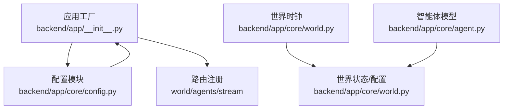
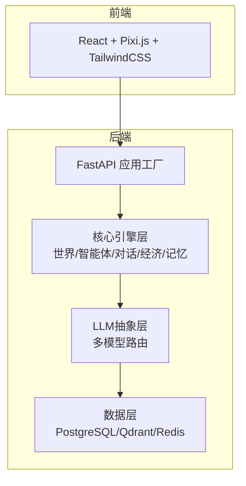
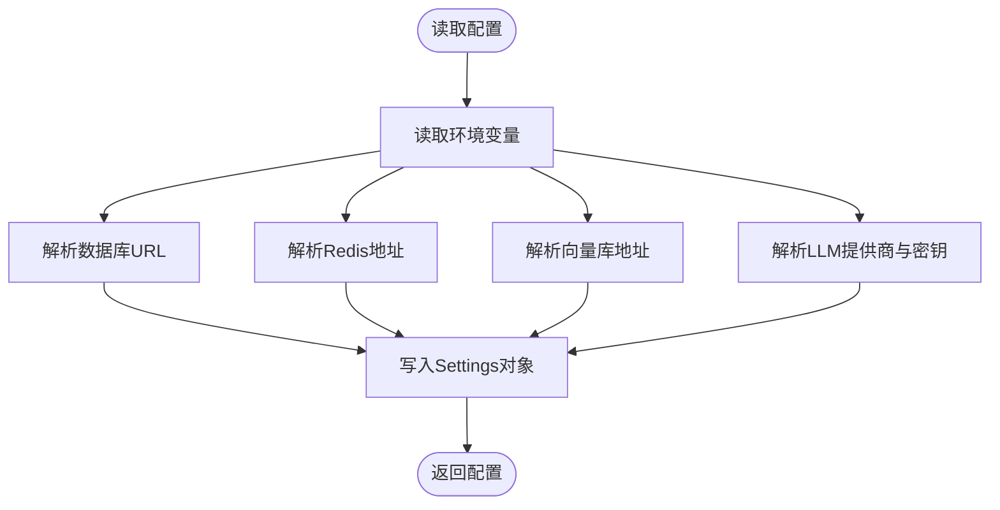
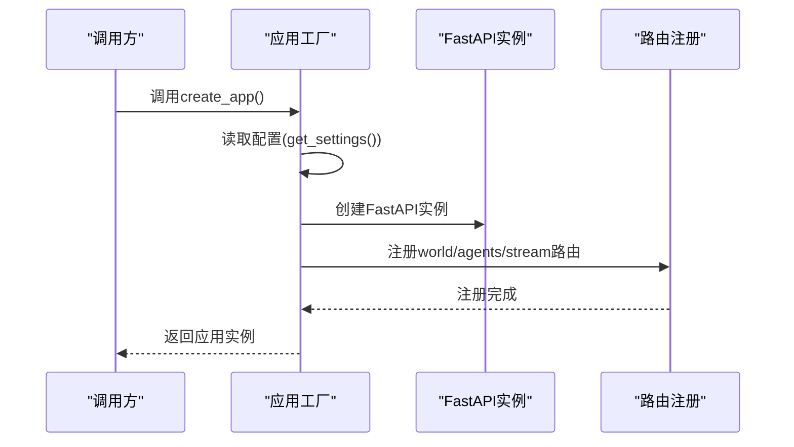
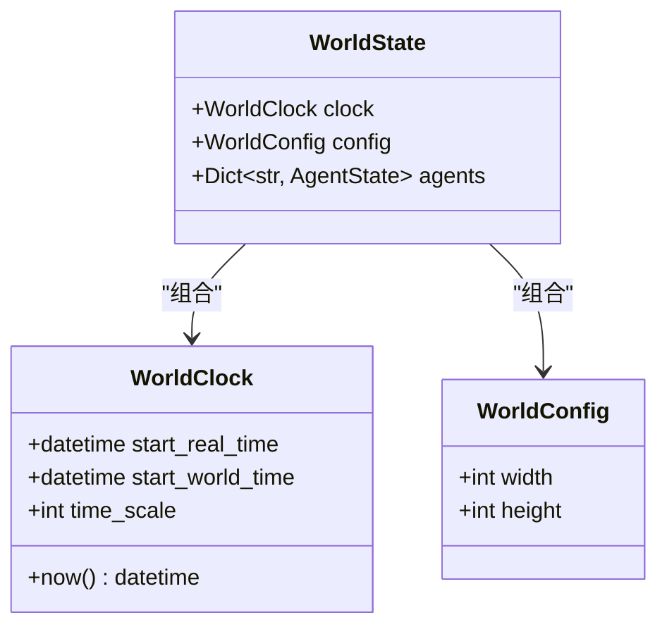
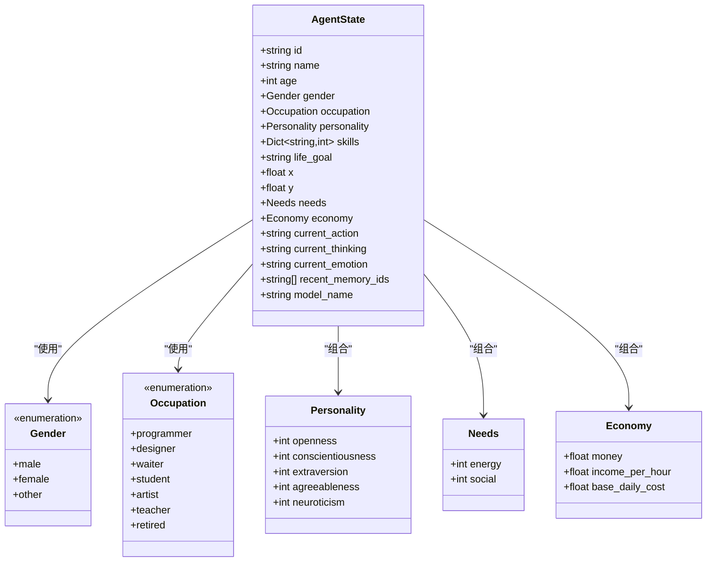
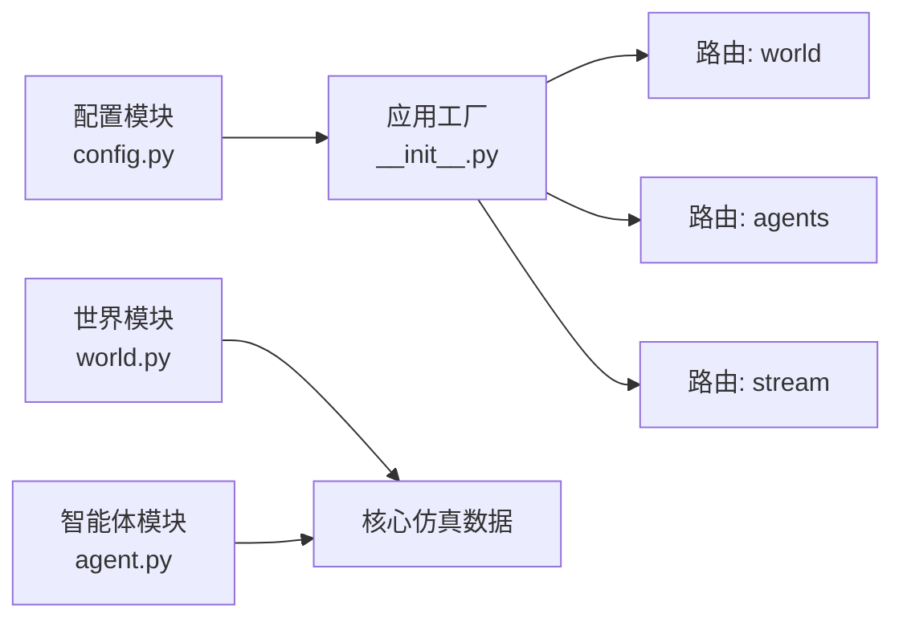

# 部署运维

<cite>
**本文引用的文件**
- [backend/app/core/config.py](file://backend/app/core/config.py)
- [backend/app/__init__.py](file://backend/app/__init__.py)
- [backend/app/core/world.py](file://backend/app/core/world.py)
- [backend/app/core/agent.py](file://backend/app/core/agent.py)
- [specs/00-project-overview.spec.md](file://specs/00-project-overview.spec.md)
- [specs/01-architecture.spec.md](file://specs/01-architecture.spec.md)
- [specs/06-api-design.spec.md](file://specs/06-api-design.spec.md)
</cite>

## 目录
1. [简介](#简介)
2. [项目结构](#项目结构)
3. [核心组件](#核心组件)
4. [架构总览](#架构总览)
5. [详细组件分析](#详细组件分析)
6. [依赖关系分析](#依赖关系分析)
7. [性能考虑](#性能考虑)
8. [运维部署指南](#运维部署指南)
9. [监控与日志](#监控与日志)
10. [故障排除指南](#故障排除指南)
11. [结论](#结论)
12. [附录](#附录)

## 简介
本文件面向AI Society项目的部署与运维团队，提供从容器化部署、环境配置、数据库与缓存初始化，到生产发布、性能监控、日志管理、高可用与灾难恢复、安全与备份、自动化与CI/CD、资源监控与容量规划的完整指导。文档基于现有代码与规格说明，结合FastAPI后端、容器化与多层架构，给出可落地的实践建议与流程图示。

## 项目结构
- 后端采用Python + FastAPI，应用工厂模式创建应用实例，并注册世界、智能体、流式WebSocket三类路由。
- 配置通过Pydantic设置类集中管理，支持环境变量覆盖与缓存。
- 核心领域模型包含世界时钟、智能体状态、个性与需求等，支撑仿真世界运行。

图表来源
- [backend/app/__init__.py](file://backend/app/__init__.py#L1-L22)
- [backend/app/core/config.py](file://backend/app/core/config.py#L1-L42)
- [backend/app/core/world.py](file://backend/app/core/world.py#L1-L40)
- [backend/app/core/agent.py](file://backend/app/core/agent.py#L1-L92)

章节来源
- [backend/app/__init__.py](file://backend/app/__init__.py#L1-L22)
- [backend/app/core/config.py](file://backend/app/core/config.py#L1-L42)
- [specs/01-architecture.spec.md](file://specs/01-architecture.spec.md#L92-L169)

## 核心组件
- 应用工厂与路由
  - 应用工厂负责创建FastAPI实例并注册路由，便于在不同环境中加载配置与路由。
- 配置管理
  - 集中管理环境、调试模式、时间缩放、数据库URL、Redis、向量库地址、大模型提供商与密钥等。
- 世界与智能体模型
  - 世界时钟以现实1分钟对应程序内10分钟；智能体包含身份、个性、需求、经济与行为状态等。

章节来源
- [backend/app/__init__.py](file://backend/app/__init__.py#L7-L22)
- [backend/app/core/config.py](file://backend/app/core/config.py#L7-L42)
- [backend/app/core/world.py](file://backend/app/core/world.py#L8-L40)
- [backend/app/core/agent.py](file://backend/app/core/agent.py#L25-L92)

## 架构总览
- 后端采用FastAPI，提供REST API与WebSocket事件流；核心引擎层包含世界引擎、智能体引擎、事件总线、对话与经济引擎；LLM抽象层支持多模型路由；数据层包括PostgreSQL、Qdrant与Redis。
- 容器化与编排：技术栈明确采用Docker与Compose，便于标准化部署与环境一致性。

图表来源
- [specs/01-architecture.spec.md](file://specs/01-architecture.spec.md#L1-L57)
- [specs/01-architecture.spec.md](file://specs/01-architecture.spec.md#L61-L71)
- [specs/01-architecture.spec.md](file://specs/01-architecture.spec.md#L92-L169)

章节来源
- [specs/01-architecture.spec.md](file://specs/01-architecture.spec.md#L1-L57)
- [specs/01-architecture.spec.md](file://specs/01-architecture.spec.md#L61-L71)
- [specs/01-architecture.spec.md](file://specs/01-architecture.spec.md#L92-L169)

## 详细组件分析

### 配置与环境变量
- 环境与调试：根据环境变量决定调试模式与默认行为。
- 时间缩放：现实1分钟 = 程序内N分钟（默认10），用于加速仿真。
- 数据库：默认SQLite（开发）或PostgreSQL（生产），可通过环境变量切换。
- 缓存与消息队列：Redis默认地址，用于缓存与消息队列。
- 向量库：Qdrant默认地址，用于向量检索与记忆。
- 大模型：支持DeepSeek与OpenAI等提供商，通过环境变量注入密钥与基础URL。

图表来源
- [backend/app/core/config.py](file://backend/app/core/config.py#L7-L42)

章节来源
- [backend/app/core/config.py](file://backend/app/core/config.py#L7-L42)

### 应用工厂与路由
- 应用工厂创建FastAPI实例，注册世界、智能体与流式WebSocket三类路由，便于统一管理与扩展。

图表来源
- [backend/app/__init__.py](file://backend/app/__init__.py#L7-L22)

章节来源
- [backend/app/__init__.py](file://backend/app/__init__.py#L7-L22)

### 世界时钟与世界状态
- 世界时钟以现实时间差乘以时间缩放系数计算世界时间，确保仿真节奏可控。
- 世界状态包含时钟与配置，以及智能体字典，作为运行时的核心数据容器。

图表来源
- [backend/app/core/world.py](file://backend/app/core/world.py#L8-L40)

章节来源
- [backend/app/core/world.py](file://backend/app/core/world.py#L8-L40)

### 智能体模型
- 智能体包含身份、性别、职业、个性、技能、需求、经济、行为状态与记忆索引等字段，支撑复杂社会仿真。

图表来源
- [backend/app/core/agent.py](file://backend/app/core/agent.py#L9-L92)

章节来源
- [backend/app/core/agent.py](file://backend/app/core/agent.py#L9-L92)

## 依赖关系分析
- 配置模块被应用工厂依赖，应用工厂在创建实例时读取配置并注册路由。
- 世界与智能体模块在运行时共同构成仿真核心数据结构，支撑API与事件流。

图表来源
- [backend/app/core/config.py](file://backend/app/core/config.py#L1-L42)
- [backend/app/__init__.py](file://backend/app/__init__.py#L1-L22)
- [backend/app/core/world.py](file://backend/app/core/world.py#L1-L40)
- [backend/app/core/agent.py](file://backend/app/core/agent.py#L1-L92)

章节来源
- [backend/app/core/config.py](file://backend/app/core/config.py#L1-L42)
- [backend/app/__init__.py](file://backend/app/__init__.py#L1-L22)
- [backend/app/core/world.py](file://backend/app/core/world.py#L1-L40)
- [backend/app/core/agent.py](file://backend/app/core/agent.py#L1-L92)

## 性能考虑
- 仿真节奏：现实1分钟对应程序内10分钟，可在配置中调整时间缩放以平衡性能与观察体验。
- API与WebSocket：REST API用于查询与控制，WebSocket用于实时事件推送；规格中给出了延迟与响应时间目标，需在部署时结合硬件与网络条件验证。
- LLM调用频率：建议限制每智能体每N分钟最多1次，避免高频调用导致成本与延迟上升。
- 内存占用：目标小于2GB，需在容器资源限制与JVM/进程参数上配合。

章节来源
- [specs/01-architecture.spec.md](file://specs/01-architecture.spec.md#L238-L248)
- [specs/06-api-design.spec.md](file://specs/06-api-design.spec.md#L648-L655)
- [backend/app/core/config.py](file://backend/app/core/config.py#L12-L13)

## 运维部署指南

### 服务器与环境要求
- 操作系统：Linux（推荐Ubuntu/AlmaLinux/CentOS）。
- CPU与内存：建议至少8核CPU、16GB内存起步，依据智能体规模与并发调整。
- 存储：SSD优先；数据库与日志目录需独立挂载，保证I/O与容量。
- 网络：开放HTTP/HTTPS端口与WebSocket端口；如启用反向代理，需配置WS升级与长连接。
- 语言与运行时：Python 3.10+，安装依赖后运行。

### 容器化与编排
- 技术栈：Docker + Docker Compose，便于标准化部署与环境一致。
- 建议镜像：官方Python运行时为基础镜像，安装后端依赖，暴露应用端口。
- Compose编排：包含后端应用、数据库、缓存与向量库服务，按需启用与扩展。

章节来源
- [specs/01-architecture.spec.md](file://specs/01-architecture.spec.md#L61-L71)
- [specs/01-architecture.spec.md](file://specs/01-architecture.spec.md#L92-L169)

### 环境变量与配置
- 必填项：数据库URL、Redis地址、向量库地址、LLM提供商密钥（如DeepSeek/OpenAI）。
- 可选项：环境（development/production）、时间缩放、调试开关。
- 建议：将敏感信息放入密钥管理服务或容器编排的Secrets，避免硬编码。

章节来源
- [backend/app/core/config.py](file://backend/app/core/config.py#L9-L37)

### 生产环境部署流程
- 准备阶段
  - 准备生产服务器，安装Docker与Docker Compose。
  - 准备环境变量文件，包含数据库、缓存、向量库与LLM密钥。
- 部署阶段
  - 拉取镜像或构建镜像，启动数据库、缓存与向量库服务。
  - 初始化数据库（见“数据库初始化”）。
  - 启动后端应用服务，等待健康检查通过。
- 验证阶段
  - 访问API与WebSocket，确认世界状态、智能体列表与事件流正常。
  - 查看日志，确认无致命错误。

章节来源
- [specs/01-architecture.spec.md](file://specs/01-architecture.spec.md#L61-L71)
- [specs/06-api-design.spec.md](file://specs/06-api-design.spec.md#L10-L16)

### 数据库初始化
- 默认开发使用SQLite，生产建议使用PostgreSQL。
- 初始化步骤（以PostgreSQL为例）
  - 创建数据库与用户，授予必要权限。
  - 设置数据库URL至环境变量。
  - 启动后端应用，执行数据库迁移（如使用Alembic）。
  - 验证迁移结果与表结构。

章节来源
- [specs/01-architecture.spec.md](file://specs/01-architecture.spec.md#L67)
- [backend/app/core/config.py](file://backend/app/core/config.py#L15-L16)

### 缓存与消息队列配置
- Redis用于缓存与消息队列，建议独立部署并开启持久化。
- 配置项：Redis地址与数据库索引，按需启用密码认证。
- 建议：使用哨兵或集群提高可用性（生产环境）。

章节来源
- [specs/01-architecture.spec.md](file://specs/01-architecture.spec.md#L69)
- [backend/app/core/config.py](file://backend/app/core/config.py#L18-L19)

### 向量数据库（Qdrant）配置
- Qdrant用于向量检索与记忆存储，建议独立部署并配置持久化卷。
- 配置项：向量库地址，按需启用TLS与鉴权。
- 建议：监控磁盘与内存使用，定期清理过期向量。

章节来源
- [specs/01-architecture.spec.md](file://specs/01-architecture.spec.md#L68)
- [backend/app/core/config.py](file://backend/app/core/config.py#L21-L22)

### 负载均衡与高可用
- 反向代理：使用Nginx或Traefik，开启HTTP/HTTPS与WebSocket升级。
- 多实例：后端应用可横向扩展，注意共享会话与事件分发策略。
- 数据层：数据库与缓存/向量库建议使用高可用方案（主从/集群）。
- 健康检查：提供/health端点，供LB与编排系统探测。

章节来源
- [specs/01-architecture.spec.md](file://specs/01-architecture.spec.md#L61-L71)
- [specs/06-api-design.spec.md](file://specs/06-api-design.spec.md#L10-L16)

### 灾难恢复策略
- 数据备份：数据库与向量库定期快照；缓存可重放事件重建。
- 回滚策略：版本化镜像与配置，变更前打标签，失败快速回滚。
- 故障演练：定期进行数据库/缓存/向量库故障演练，验证恢复流程。

章节来源
- [specs/01-architecture.spec.md](file://specs/01-architecture.spec.md#L67-L69)

### 安全配置与访问控制
- 网络隔离：数据库与缓存/向量库仅对应用容器开放。
- TLS：反向代理启用HTTPS，证书由ACME或私有CA签发。
- API鉴权：根据需要引入JWT或API Key；WebSocket可增加鉴权头。
- LLM密钥：通过密钥管理服务注入，最小权限原则。

章节来源
- [specs/01-architecture.spec.md](file://specs/01-architecture.spec.md#L61-L71)
- [backend/app/core/config.py](file://backend/app/core/config.py#L32-L37)

### 数据备份方案
- 数据库：逻辑备份（pg_dump）与物理备份（文件系统快照）结合。
- 向量库：导出向量索引与元数据，定期归档。
- 缓存：可重放事件重建；重要会话数据建议持久化。

章节来源
- [specs/01-architecture.spec.md](file://specs/01-architecture.spec.md#L67-L69)

### 运维脚本与自动化
- 部署脚本：封装拉取镜像、启动服务、健康检查与日志采集。
- CI/CD：流水线包含代码检查、单元测试、打包镜像、部署与回滚。
- 配置管理：使用Helm/Compose模板，参数化环境变量与资源限制。

章节来源
- [specs/01-architecture.spec.md](file://specs/01-architecture.spec.md#L61-L71)

### 持续集成流程
- 触发：Push/PR触发流水线。
- 步骤：安装依赖、运行测试、构建镜像、推送仓库、部署到预生产、人工审批后发布到生产。
- 回滚：一键回滚至上一个稳定版本。

章节来源
- [specs/01-architecture.spec.md](file://specs/01-architecture.spec.md#L61-L71)

## 监控与日志

### 性能监控
- 指标：CPU/内存/磁盘IO、数据库连接数、缓存命中率、向量库查询延迟、WebSocket连接数。
- 工具：Prometheus + Grafana，采集应用与系统指标。
- 告警：针对延迟、错误率、资源使用率阈值告警。

章节来源
- [specs/01-architecture.spec.md](file://specs/01-architecture.spec.md#L238-L248)

### 日志管理
- 日志级别：INFO/ERROR/WARN，区分业务日志与调试日志。
- 日志聚合：使用ELK/EFK收集容器日志，保留7-30天。
- 关键日志：启动、健康检查、数据库迁移、LLM调用、WebSocket事件。

章节来源
- [specs/06-api-design.spec.md](file://specs/06-api-design.spec.md#L10-L16)

## 故障排除指南

### 常见问题与排查
- 应用无法启动
  - 检查环境变量是否正确，特别是数据库、缓存与向量库地址。
  - 查看容器日志，确认依赖服务已就绪。
- 数据库连接失败
  - 检查数据库URL、凭据与网络连通性；确认防火墙与安全组放行。
- 缓存/向量库不可用
  - 检查Redis/Qdrant地址与认证；确认持久化卷空间充足。
- LLM调用异常
  - 检查API Key与基础URL；确认网络可达与配额充足。
- WebSocket断连
  - 检查反向代理WS升级配置；确认连接池与超时设置。

章节来源
- [backend/app/core/config.py](file://backend/app/core/config.py#L15-L37)
- [specs/06-api-design.spec.md](file://specs/06-api-design.spec.md#L411-L425)

### API与事件流验证
- 使用规格中的API示例验证世界状态、智能体详情与事件流订阅，确认返回格式与延迟满足预期。

章节来源
- [specs/06-api-design.spec.md](file://specs/06-api-design.spec.md#L18-L42)
- [specs/06-api-design.spec.md](file://specs/06-api-design.spec.md#L411-L425)

## 结论
本运维文档基于现有代码与架构规格，提供了从容器化部署、环境配置、数据库与缓存初始化，到生产发布、监控日志、高可用与灾备、安全与备份、自动化与CI/CD、资源监控与容量规划的完整指导。建议在生产环境中严格遵循安全与高可用最佳实践，并结合实际负载进行容量规划与性能调优。

## 附录

### API与通信协议要点
- REST API：统一响应格式，中文错误信息，速率限制策略明确。
- WebSocket：事件类型丰富，支持订阅与取消订阅，适合实时观察。

章节来源
- [specs/06-api-design.spec.md](file://specs/06-api-design.spec.md#L3-L9)
- [specs/06-api-design.spec.md](file://specs/06-api-design.spec.md#L619-L655)