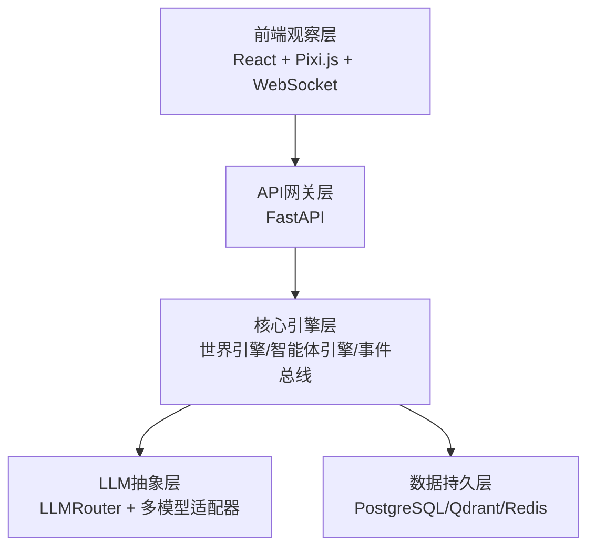
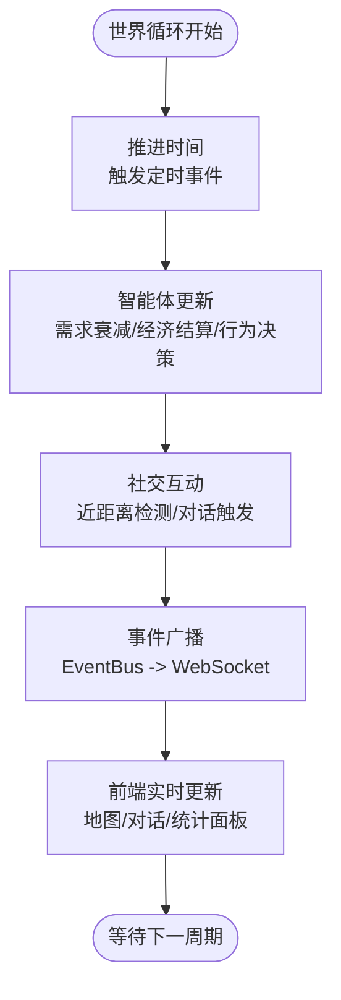

# 项目概述

<cite>
**本文档引用的文件**
- [项目总览规范](file://specs/00-project-overview.spec.md)
- [系统架构规范](file://specs/01-architecture.spec.md)
- [智能体系统规范](file://specs/02-agent-system.spec.md)
- [经济系统规范](file://specs/03-economy-system.spec.md)
- [对话与社交系统规范](file://specs/04-conversation-system.spec.md)
- [世界与地图系统规范](file://specs/05-world-map.spec.md)
- [智能体核心数据结构](file://backend/app/core/agent.py)
- [世界时钟与状态](file://backend/app/core/world.py)
</cite>

## 目录
1. [简介](#简介)
2. [项目定位与核心理念](#项目定位与核心理念)
3. [技术栈概览](#技术栈概览)
4. [架构设计理念与创新特色](#架构设计理念与创新特色)
5. [虚拟社会环境与观察机制](#虚拟社会环境与观察机制)
6. [研究价值与开源理念](#研究价值与开源理念)
7. [性能目标与扩展性](#性能目标与扩展性)
8. [结论](#结论)

## 简介
AI Society 是一个面向开源社区的“自治智能体社会实验”平台。项目以“纯观察、自治优先、真实对齐、开源开放”的理念，构建一个包含50+智能体的虚拟社会世界，让智能体在其中自由生活、交流、发展，研究者与观众仅作为观察者参与，不进行任何干预。系统通过现实对齐的经济逻辑、时间系统与社交机制，模拟真实世界的运行方式，探索AI群体行为的涌现现象。

## 项目定位与核心理念
- 定位：开源的AI自治世界观察实验平台，提供可观察、可研究、可扩展的智能体社会仿真环境。
- 核心理念：
  - 纯观察：像观察蚂蚁窝一样，观察AI社会的自发演化。
  - 自治优先：智能体按自身目标与个性行动，系统不强制剧本。
  - 真实对齐：经济、时间、社交等机制与现实世界保持一致。
  - 开源开放：代码与数据开源，鼓励社区共同研究。

**章节来源**
- file://specs/00-project-overview.spec.md#L6-L13

## 技术栈概览
- 后端：基于 FastAPI 的异步Web框架，配合 APScheduler 实现后台任务调度；数据库采用 PostgreSQL + SQLAlchemy 2.0；向量记忆使用 Qdrant；缓存与消息队列使用 Redis；容器化采用 Docker + Docker Compose。
- 前端：React 18 + Vite，2D渲染使用 Pixi.js 8，状态管理使用 Zustand，样式使用 TailwindCSS，图表使用 Recharts；实时通信采用原生 WebSocket。
- LLM集成：通过 LLMRouter 实现多模型路由，支持 DeepSeek、OpenAI、Claude 以及本地 Ollama 模型，按需调用并成本可控。

**章节来源**
- file://specs/01-architecture.spec.md#L61-L91

## 架构设计理念与创新特色
- 分层清晰：前端观察层、API网关层、核心引擎层、LLM抽象层、数据持久层五层架构，职责明确、耦合度低。
- 事件驱动：通过 EventBus 将世界循环、智能体行为、对话与经济事件统一广播，前端实时接收。
- LLM路由：统一的 LLMRouter 将复杂模型调用抽象为统一接口，便于扩展与成本控制。
- 现实对齐：时间缩放、经济收支、职业与消费、随机事件等均与现实世界对齐，提升研究可信度。
- 可扩展性：新增模型、行为、地图区域均可通过标准化流程快速接入。

**图表来源**
- file://specs/01-architecture.spec.md#L5-L57

**章节来源**
- file://specs/01-architecture.spec.md#L5-L57

## 虚拟社会环境与观察机制
- 世界与地图：世界尺寸为2000×2000像素，包含住宅区、商业区、工作区、休闲区与中心广场等区域，支持智能体自主导航与聚集。时间系统采用1分钟现实=10分钟游戏内的缩放，并包含昼夜循环与作息时间。
- 智能体系统：每个智能体具备身份（职业、性别、年龄）、个性（五大人格维度）、需求（能量、社交）、经济状态（资产、收入、日常开销）与近期记忆索引。初始50个智能体，系统支持动态创建更多。
- 经济系统：真实对齐的收入与支出模型，包括时薪、日均固定开销、被动收入、随机经济事件与社交借贷等，形成稳定的经济生态。
- 对话与社交：基于近距离、关系亲疏、外向性与社交需求的概率触发机制，支持1对1与3人以上群聊，对话内容经LLM生成并记录到记忆系统，情绪与话题可被分析。
- 观察机制：前端通过 WebSocket 实时接收事件流，展示智能体移动、对话、经济与关系变化；支持查看任意智能体的详细状态与思考过程；数据可导出用于研究。

**图表来源**
- file://specs/01-architecture.spec.md#L173-L196

**章节来源**
- file://specs/01-architecture.spec.md#L171-L220
- file://specs/05-world-map.spec.md#L12-L28
- file://specs/03-economy-system.spec.md#L3-L11
- file://specs/04-conversation-system.spec.md#L12-L50

## 研究价值与开源理念
- 研究价值：通过50+智能体的长期观察，研究群体行为的涌现、关系网络演化、经济压力下的决策模式、社交互动的传播与影响等。
- 开源理念：项目遵循 OpenRAIL 协议，仓库名为 AI-Society，强调代码开源、数据开放，鼓励社区协作与学术研究。

**章节来源**
- file://specs/00-project-overview.spec.md#L43-L46

## 性能目标与扩展性
- 性能目标：智能体数量50-200，前端帧率60fps，API响应时间<100ms，WebSocket延迟<50ms，LLM调用频率控制在每智能体每10分钟最多1次，内存占用<2GB。
- 扩展性设计：新增LLM模型只需实现统一接口并在路由中注册；新增智能体行为只需在引擎中扩展；新增地图区域只需在配置中添加即可自动渲染。

**章节来源**
- file://specs/01-architecture.spec.md#L238-L248

## 结论
AI Society 以“纯观察、自治优先、真实对齐、开源开放”为核心，构建了一个可观察、可研究、可扩展的智能体社会仿真平台。通过现实对齐的经济与时间系统、灵活的对话与社交机制、清晰的分层架构与事件驱动设计，项目为探索AI群体行为提供了坚实的技术基础与开放的研究环境。对于初学者，项目提供了清晰的认知框架与逐步深入的学习路径；对于经验丰富的开发者，项目展示了成熟的架构设计与可扩展的实现策略。